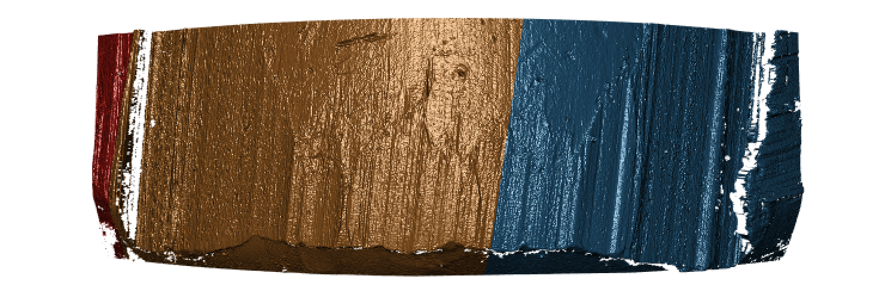

# Project CC: Bullets and Cartridge Cases {#bullets}

```{r setup, echo=FALSE}
library(knitr)
opts_chunk$set(echo=FALSE)
```

For both bullets and cartridge cases we are dealing with several inter-related aspects, that we want to address independently. 

Those are:

1. data collection
2. computational tools
3. similarity scores

    1. for bullet lands: 

        a. crosscut identification
        b. groove location
        c. curvature removal
        d. alignment of signatures
        e. feature extraction
        f. matching with trained Random Forest

    2. for breech faces

4. analysis of results
5. communication of results and methods


## Data Collection

### LAPD

All bullets are collected by Srinivasan Rathinam, LAPD. 

#### Main study
4 bullets per barrel for  626  Beretta 92 F/FS firearms , ammunition used are 9 mm Luger Winchester 115 grain with a Copper surface.

scans are on Raven.

<p class="new">evaluation: Yawei is going to work through all 626 barrels of knowns to assess similarity scores</p>

```{r, fig.cap="Results from assessing scans of barrel FAU 1 similarity.", out.width="50%", fig.keep="hold", fig.align='center'}
include_graphics(c("images/yawei/results-FAU-1.png"))
```

```{r, fig.cap="Results from assessing scans of barrel FAU 2 similarity.", out.width="50%", fig.keep="hold", fig.align='center'}
include_graphics(c( "images/yawei/results-FAU-2.png"))
```

Why some of the cases failed? (181/626 = 30%)

`x3p_crosscut_optimize()` failed to find the positions to get cross cut for some lands.

```{r, fig.cap="Land scan for barrel FAU 3 bullet A land 6.", out.width="50%", fig.keep="hold", fig.align='center'}
include_graphics(c("images/yawei/lapd-FAU-3-Bullet-A-land-6.PNG"))
```

```{r, fig.cap="Land scan for barrel FAU 4 bullet C land 5.", out.width="50%", fig.keep="hold", fig.align='center'}
include_graphics(c("images/yawei/lapd-FAU-4-Bullet-C-land-5.PNG"))
```

```{r, fig.cap="Land scan for barrel FAU 5 bullet B land 5.", out.width="50%", fig.keep="hold", fig.align='center'}
include_graphics(c("images/yawei/lapd-FAU-5-Bullet-B-land-5.PNG"))
```

Manual indentification of grooves now...


#### follow-up study 

4 bullets per barrel for  96 of the original 626 Beretta firearms using different ammunition

<p class = "new">bullets are being scanned</p>

### Hamby Sets

Scans for Hamby Sets 10, 36, 44, and 224

Scans for 3 replicates of clones for Hamby 224

### Houston Tests

contact: Melissa Nally, Houston FSI

#### Pre-study

3 kits with 23 bullets each 

```{r, fig.cap="Bullet-to-bullet similarity scores for questioned bullets (y-axis) compared to all other bullets of the test set (x-axis).",  fig.keep="hold", fig.align='center'}
include_graphics(c( "images/bullets/houston-pre-set3.png"))
```

<p class="new">evaluation included in submission to JFI</p>

#### Study

4 kits with 20 bullets each

<p class="new">scans done, evaluation finished, some scans of doubtful quality</p>


### Houston Persistence

contact: Melissa Nally, Houston FSI

8 barrels with 40 fired bullets each

### St Louis persistence

contact: Steve Kramer, St Louis PD

2 barrels with 192 fired bullets each (2 bullets collected every 25 shots)


### DFSC Cartridge cases

Breech face data for knowns are scanned and available on a private github repository

evaluation

## Computational Tools

### x3ptools

`x3ptools` is an R package for working with files in x3p format. x3p is an ISO standard for describing 3d topographic surface measurements. 
`x3ptools` is available on CRAN, i.e. can be installed with the command `install.packages("x3ptools")`. The development version is available from github. Installation instructions and basic usage can be found at https://heike.github.io/x3ptools/


### bulletxtrctr

`bulletxtrctr` is a developmental R package available from github (see https://heike.github.io/bulletxtrctr/) that allows an assessment of similarity scores using the data extraction pipeline described in @aoas. 

### grooveFinder

`grooveFinder` is a developmental R package providing different methods for identifying the location of grooves in scans of bullets.
Installation instructions and some basic usage can be found at https://heike.github.io/grooveFinder/

## Similarity Scores

### Bullet Lands

#### Approaches to identify groove locations

##### Hough Transform Method for Identifying Grooves

Charlotte 9/5/19 Update:

Will fill in with more detail later

**Current Goals**:
- Iron-out issues with consistency of units with `get_hough_grooves`. I believe there are some issues translating from the 2-d visualization to the 3-d visualization that might have to do with inconsistent unit inputs? For Example


```{r, fig.cap="2-dimensional visualization of example bullet br411 with .999 strength threshold", out.width="50%", fig.keep="hold", fig.align='center'}
knitr::include_graphics("images/charlotte/br411_2d.jpeg")
```

```{r, fig.cap="3-dimensional visualization of example bullet br411 with .999 strength threshold", out.width="50%", fig.keep="hold", fig.align='center'}

```

So either somethin is wrong with `get_mask_hough` or something is funky with the units.

- Also need to think of including a sort of rounding component where lines with slopes that are practically infinite can be viewed as a vertical line

- Compare Hough results with manual identification using score calculations from Kiegan. 

- Write up results in Hough Groove Paper (It's coming I promise)
  - Create graphical images to explain line selection method
  - Include 2-d and 3-d visualizations of Hough groove area identifications
  - Include crosscut visualization and comparison in results

##### LASSO Method  

<p class="new">A paper is in preparation for submission to Forensic Science International describing this method (`get_grooves_lassofull` in `grooveFinder`), as well as the Bayesian changepoint method (`get_grooves_bcp`). </p>  

##### Robust LOESS Method  

<p class="new">A paper submitted to the Journal of Forensic Science is waiting for peer review response to the first round of revisions.</p> 

### Cartridge Cases

#### Congruent Matching Cells (CMC) algorithm for comparing cartridge case breech face impressions

Joe 9/5/19 Update: Dealing with missing values in the x3p scans continues to be an issue. The Fast Fourier Transform method for calculating cross-correlation can't handle missing data in an image, so we've attempted a few "fixes" that haven't necessarily turned out as well as expected. One idea we had was to replace the NA values in a cell with the average pixel value. However, this is artificially introducing a signal where before there was none. This can (and demonstrably has) led to inflated/incorrect correlations between cells that shouldn't have much at all in common. Unfortunately, this may be the only solution if we still wish to adhere to the CMC algorithm as described in Song et al. (2015). One improvement that I've implemented is to "crop out" the rows and columns of an image that only contain NAs. This at least means that we've weakened the strength of the artificial signal relative to the breechface's signal.

Below is a series of images that illustrate how we might compare a cell in one image to a region of another image.

```{r, fig.cap="Comparing a cell in image 1 to a larger region in image 2. We wish to find the translations of the image 1 cell that yield the highest correlation within the image 2 region.", out.width="50%", fig.keep="hold", fig.align='center'}
knitr::include_graphics("images/cartridge_cases/im1_im2_cellComparison.png")
```

For the sake of an example, let's focus on the blue outlined cell in image 1. Our goal is to use the image 1 cell to "search" a corresponding larger region in image 2 for the horizontal/vertical translations needed to produce the highest correlation. Below is a zoomed-in version of the blue outlined image 1 cell on the left and the larger image 2 region (approximately: I made the gridded image above by-hand outside of R while the images below are from R). The image 1 cell may look larger than the image 2 region, but we can see from the axes that the image 2 region is indeed larger. Any white pixels in the two images are NA values that need to be dealt with in some way before we can use FFTs to calculate the cross-correlation.

```{r, fig.cap="(Left) A cell from image 1. (Right) A region from image 2 centered in the same location as the image 1 cell, yet quadruple the area.", out.width="50%", fig.keep="hold", fig.align='center',fig.show='hold'}
knitr::include_graphics(c("images/cartridge_cases/im1_split.png","images/cartridge_cases/im2_split.png"))
```

As already discussed above, one "solution" is to replace the NA values with the average pixel value of each image. However, to avoid creating a stronger artificial signal than necessary, we can crop-out the NA rows and columns from the two images above. Below is the cropped version of the two images. The cropping doesn't produce signficantly different images in this case, but you could imagine other examples in which a cell has captured only small amount of breechface in the corner. Such examples are fairly common and cropping signficantly changes the resulting correlation values.

```{r, fig.cap="The same images as above after cropping NA rows/columns.", out.width="50%", fig.keep="hold", fig.align='center',fig.show='hold'}
knitr::include_graphics(c("images/cartridge_cases/im1_splitFilteredCropped.png","images/cartridge_cases/im2_splitFilteredCropped.png"))
```

The last step before calculating correlation for these cells is to replace the remaining NAs with the average pixel value. This is shown below.

```{r, fig.cap="The NA-cropped images with remaining NAs replaced with the image's average pixel values.", out.width="50%", fig.keep="hold", fig.align='center',fig.show='hold'}
knitr::include_graphics(c("images/cartridge_cases/im1_splitShifted.png","images/cartridge_cases/im2_splitShifted.png"))
```

The cross-correlation is then calculated between these two images via a standard fast fourier transform process (see [Cross-Correlation Theorem](http://mathworld.wolfram.com/Cross-CorrelationTheorem.html)). The benefit of using such a process is that (as the name suggests) it's faster than calculating the raw correlation between the two images. Also, the translations that produce the highest correlation between the image 1 cell and the image 2 region fall out of the calculation for free.

This pre-processing/cross-correlation calculation procedure is repeated for every cell in image 1 that contains breech face impression. Because it is not valid to assume that the two images are rotationally aligned by default, we perform the same procedure repeatedly while rotating image 2. Currently, we perform a "rough" grid search of $\theta \in [-177.5,180]$ by increments of $2.5^{\circ}$. Theoretically, the final results tell us how we need to horizontally/vertically translate and rotate the two images to be correctly aligned.

#### Congruent Matching Tori: a promising solution to the missing value problem

As discussed above, dealing with missing values is provign to be a pain. The good news is that the currently-implemented CMC as described above yields results very similar to those published in Song et al. (2015) that originally describes that CMC algorithm. While our results seem to agree with currently published results, it would be nice if we could avoid needing to artifically replace missing values. We can do so if, rather than breaking up the circular breech face impression scans into disjoint squares, we break up the breech face impression into donut-shaped regions containing only breech face impression. Below is an example of such a toroidal region.

```{r, fig.cap="(Left) The original breech face impression scan image. (Right) A donut-shaped region cut out of the original image.", out.width="50%", fig.keep="hold", fig.align='center',fig.show='hold'}
knitr::include_graphics(c("images/cartridge_cases/im1_original.png","images/cartridge_cases/im1_toroidalRegion.png"))
```

By comparing such regions instead of the square cells, we would presumably only need to fill in a few missing value "holes" in the breech face impression scan rather than completely replacing a non-existent signal with an artificial one. In the near-future, I hope to finish up the pre-processing needed for this Congruent Matching Tori method by performing a polar transformation on these images to make them into strips that can easily be compared via an FFT.


Joe 9/12/19 Update: Before carving out toroidal regions from the two images we wish to compare, a fair amount of pre-processing needs to be completed. For example, the scans we work with begin with a considerable amount of auxiliary information, for example the firing pin impression, that we don't want to use in our comparisons. This isn't to say that firing pin impressions aren't useful to determine a match between two cartridge cases. In fact there is quite a lot of published research on how to compare two firing pin impressions. Rather, it is common practice to compare breech face impressions and firing pin impressions separately since it is difficult to scan both simultaneously. Thus, there are regions of a breech face impression scan that we want to remove so that the breech face impressions are more easily comparable. Below is an example of two breech face impression scans before processing.

```{r, fig.cap="Two cartridge case scans before pre-processing.", out.width="50%", fig.keep="hold", fig.align='center',fig.show='hold'}
knitr::include_graphics(c("images/cartridge_cases/im1_fullScan.png","images/cartridge_cases/im2_fullScan.png"))
```

There are a variety of techniques to segment an image into various parts. In image processing, common techniques are the Canny edge detector, which identifies edges of shapes in an image using image gradient techniques, and the Hough Transform, which can detect a variety of geometrical shapes in an image. The Hough Transform is what is used to segment the cartridge case images used in the previous section. However, we've found that the use of a Hough Transform doesn't extract the "breech face signal" from an image as other techniques. Namely, the breech face can be effectively extracted using the RANSAC (Random sample consensus) method that iteratively fits a plane to a set of data until it settles upon a consensus-based "bulk" of the data. In the case of these cartridge case scans, the bulk of the data should predominantely be distributed around the mode height value. That is, the breech face impression. Once we've fit this plane to the breech face impression, we can extract the residuals of the fit to better accentuate the markings left in the cartridge case base by a firearm's breech face. Below is an example of the residuals left after fitting a RANSAC plane to two cartridge case scans above. In the example below, we grab any residuals less than 20 microns in magnitude.

```{r, fig.cap="Residual values of a RANSAC plane fit to the two cartridge case scans shown above.", out.width="50%", fig.keep="hold", fig.align='center',fig.show='hold'}
knitr::include_graphics(c("images/cartridge_cases/im1_ransacResiduals.png","images/cartridge_cases/im2_ransacResiduals.png"))
```

Although these two images are of two different cartridge cases, you can hopefully see that one looks very much like a rotated version of the other. These two cartridge case scans are in fact fired from the same gun (known matches), so it's a good thing that they look so similar. We've now removed quite a bit of the unwanted regions of the original scans. However, there are still some areas of the image (e.g., the faint circular region of pixels in the center of the breech face scan) that just so happened to be close to the fitted plane and thus were brought along in the residual extraction. There are a few ways that we can clean up these last few areas. One is to use two Hough Transforms to detect the inner and outer circles of the breech face impression and filter out any pixels outside of the region between these two circles. The biggest issue with using a Hough Transform is that it must be given the radius of the circle that it is to search for in the image as an argument. That is, we need to know the radius of the breech face impression that we haven't yet identified in order to identify the breech face impression. Instead, we can dilate/erode (or vice-versa) the pixels in the image to remove the remaining "speckle" in the image. Below is an example of of the breech face impressions cleaned via a dilation/erosion procedure.

```{r, fig.cap="The selected breech face impressions based on dilation and erosion.", out.width="50%", fig.keep="hold", fig.align='center',fig.show='hold'}
knitr::include_graphics(c("images/cartridge_cases/im1_maskFiltered.png","images/cartridge_cases/im2_maskFiltered.png"))
```

The final step in the pre-processing is to align the two images in some consistent fashion. Luckily, the firing pin impression ring that's left after performing the above dilation/erosion provides us with some idea of how to align the breech face impressions. The location of the firing ring impression in the breech face impression provides us with an indicator of where the cartridge case was located relative to the firing pin when it was sitting in the barrel. So aligning two cartridge cases so that their firing pin impression rings align will ensure that, at the very least, the breech face impression left on the cartridge case is horizontally/vertically aligned if not rotationally aligned.

## Analysis of Results

## Communication of Results and Methods  

### Conference Presentations  

#### American Academy of Forensic Sciences  

- <p class="new">"Validation Study on Automated Groove Detection Methods in 3D Bullet Land Scans"</p>
    - February 2019  
    - Authors: Kiegan Rice, Ulrike Genschel, Heike Hofmann
    - Presentation given by Kiegan Rice

#### Association of Firearms and Toolmark Examiners Annual Training Seminar  

- Heike's talk 
- <p class="new"> "Reproducibility of Automated Bullet Matching Scores Using High-Resolution 3D LEA Scans" </p> 
    - May 2019
    - Authors: Kiegan Rice, Ulrike Genschel, Heike Hofmann 
    - Presentation given by Kiegan Rice  
    
    
#### Joint Statistical Meetings  

- <p class="new"> "Repeatability and reproducibility of automated bullet comparisons using high-resolution 3D scans" </p>
    - July 2019 
    - Authors: Kiegan Rice, Ulrike Genschel, Heike Hofmann
    - Poster presented by Kiegan Rice  

#### Miscellaneous  

- <p class="new">10th International Workshop on Statistics and Simulation in Salzburg, Austria, September 2019</p>
    - "Reproducibility of High-Resolution 3D Bullet Scans and Automated Bullet Matching Scores"   
         - Authors: Kiegan Rice, Ulrike Genschel, Heike Hofmann
         - Poster presented by Kiegan Rice, won 2nd Springer Poster Award  
    - "Case Study Validations of Automatic Bullet Matching"
         - Authors: Heike Hofmann, Susan VanderPlas
         - Presentation given by Alicia Carriquiry


## People involved

### Faculty

- Heike Hofmann
- Susan VanderPlas

### Graduate Students

- Ganesh Krishnan
- Kiegan Rice 
- Nate Garton
- Charlotte Roigers
- Joe Zemmels
- Yawei Ge


### Undergraduates

- Talen Fisher (fix3p)
- Andrew Maloney
- Mya Fisher, Allison Mark, Connor Hergenreter, Carley McConnell, Anyesha Ray (scanner)


