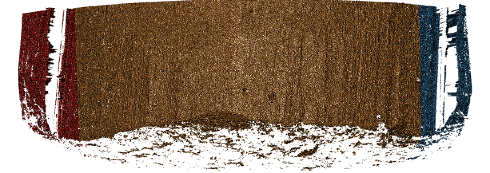

# Project CC: Bullets and Cartridge Cases {#bullets}

```{r setup, echo=FALSE}
library(knitr)
opts_chunk$set(echo=FALSE)
```

For both bullets and cartridge cases we are dealing with several inter-related aspects, that we want to address independently. 

Those are:

1. data collection
2. computational tools
3. similarity scores

    1. for bullet lands: 

        a. crosscut identification
        b. groove location
        c. curvature removal
        d. alignment of signatures
        e. feature extraction
        f. matching with trained Random Forest

    2. for breech faces

4. analysis of results
5. communication of results and methods


## Data Collection

### LAPD

All bullets are collected by Srinivasan Rathinam, LAPD. 

#### Main study
4 bullets per barrel for  626  Beretta 92 F/FS firearms , ammunition used are 9 mm Luger Winchester 115 grain with a Copper surface.

scans are on Raven.

<p class="new">evaluation: Yawei is going to work through all 626 barrels of knowns to assess similarity scores</p>

```{r, fig.cap="Results from assessing scans of barrel FAU 1 similarity.", out.width="50%", fig.keep="hold", fig.align='center'}
include_graphics(c("images/yawei/results-FAU-1.png"))
```

```{r, fig.cap="Results from assessing scans of barrel FAU 2 similarity.", out.width="50%", fig.keep="hold", fig.align='center'}
include_graphics(c( "images/yawei/results-FAU-2.png"))
```

Why some of the cases failed? (181/626 = 30%)

`x3p_crosscut_optimize()` failed to find the positions to get cross cut for some lands.

```{r, fig.cap="Land scan for barrel FAU 3 bullet A land 6.", out.width="50%", fig.keep="hold", fig.align='center'}
include_graphics(c("images/yawei/lapd-FAU-3-Bullet-A-land-6.PNG"))
```

```{r, fig.cap="Land scan for barrel FAU 4 bullet C land 5.", out.width="50%", fig.keep="hold", fig.align='center'}
include_graphics(c("images/yawei/lapd-FAU-4-Bullet-C-land-5.PNG"))
```

```{r, fig.cap="Land scan for barrel FAU 5 bullet B land 5.", out.width="50%", fig.keep="hold", fig.align='center'}
include_graphics(c("images/yawei/lapd-FAU-5-Bullet-B-land-5.PNG"))
```

Assess the land-land comparasion and bullet-bullet comparasion

For bullet-bullet comparasion: we use the "sequence average maximum"(SAM), i.e. average ccf of "lines" of land-land comparasions, as the bullet similarity score(currently).

By making use of 92 manually generated comparasion data, we try to produce the KM(known-matches) and KNM(known-non-matches) plot.

For the known mathches, we have totally 626 x 6 = 3756 for the LAPD data, excluding the comparasions for same bullet.

For the known non-matches, we don't have the data in hand. We need to generate the data in a way. We have totally 626 x 625/2 x 16 = 313000 known non-matches. We can only generate a sample from the data.

We sampled 100 bullet-bullet known non-matches from our 92 cases.

```{r, fig.cap="KM and KNM", out.width="50%", fig.keep="hold", fig.align='center'}
include_graphics(c("images/yawei/knm-km.PNG"))
```

Is the SAM(sequence average maximum) a good choice? Need to do a permutation test.

```{r, fig.cap="SAM permutation result", out.width="50%", fig.keep="hold", fig.align='center'}
include_graphics(c("images/yawei/sam_1.PNG"))
```

```{r, fig.cap="SAM permutation result among maxmum", out.width="50%", fig.keep="hold", fig.align='center'}
include_graphics(c("images/yawei/sam_max_1.PNG"))
```

Possible dependence structure in land-land comparasions:

Fact first: 

1. Six lands on the bullet engraved by different parts of the barrel? So they are essentially different?

2. Any additional similarity among different lands on a same bullet? or more generally, lands from the same barrel?

```{r, fig.cap="Inside gun barrel from google: johan-swanepoel", out.width="50%", fig.keep="hold", fig.align='center'}
include_graphics(c("images/yawei/gun-barrel-from-inside-johan-swanepoel.jpg"))
```

Any suggestions? Method and literature?

#### follow-up study 

4 bullets per barrel for  96 of the original 626 Beretta firearms using different ammunition

<p class = "new">bullets are being scanned</p>

### Hamby Sets

Scans for Hamby Sets 10, 36, 44, and 224

Scans for 3 replicates of clones for Hamby 224

### Houston Tests

contact: Melissa Nally, Houston FSI

#### Pre-study

3 kits with 23 bullets each 

```{r, fig.cap="Bullet-to-bullet similarity scores for questioned bullets (y-axis) compared to all other bullets of the test set (x-axis).",  fig.keep="hold", fig.align='center'}
include_graphics(c( "images/bullets/houston-pre-set3.png"))
```

<p class="new">evaluation included in submission to JFI</p>

#### Study

4 kits with 20 bullets each

<p class="new">scans done, evaluation finished, some scans of doubtful quality</p>


### Houston Persistence

contact: Melissa Nally, Houston FSI

8 barrels with 40 fired bullets each

### St Louis persistence

contact: Steve Kramer, St Louis PD

2 barrels with 192 fired bullets each (2 bullets collected every 25 shots)


### DFSC Cartridge cases

Breech face data for knowns are scanned and available on a private github repository

evaluation

## Computational Tools

### x3ptools

`x3ptools` is an R package for working with files in x3p format. x3p is an ISO standard for describing 3d topographic surface measurements. 
`x3ptools` is available on CRAN, i.e. can be installed with the command `install.packages("x3ptools")`. The development version is available from github. Installation instructions and basic usage can be found at https://heike.github.io/x3ptools/


### bulletxtrctr

`bulletxtrctr` is a developmental R package available from github (see https://heike.github.io/bulletxtrctr/) that allows an assessment of similarity scores using the data extraction pipeline described in @aoas. 

### grooveFinder

`grooveFinder` is a developmental R package providing different methods for identifying the location of grooves in scans of bullets.
Installation instructions and some basic usage can be found at https://heike.github.io/grooveFinder/

## Similarity Scores

### Bullet Lands

#### Approaches to identify groove locations

##### Hough Transform Method for Identifying Grooves

Charlotte 9/5/19 Update:

Will fill in with more detail later

**Current Goals**:
- Iron-out issues with consistency of units with `get_hough_grooves`. I believe there are some issues translating from the 2-d visualization to the 3-d visualization that might have to do with inconsistent unit inputs? For Example


```{r, fig.cap="2-dimensional visualization of example bullet br411 with .999 strength threshold", out.width="50%", fig.keep="hold", fig.align='center'}
knitr::include_graphics("images/bullets/Hough_project/br411_2d.jpeg")
```

```{r, fig.cap="3-dimensional visualization of example bullet br411 with .999 strength threshold", out.width="50%", fig.keep="hold", fig.align='center'}
knitr::include_graphics("images/bullets/Hough_project/br411_3d.png")
```

So either somethin is wrong with `get_mask_hough` or something is funky with the units.

- Also need to think of including a sort of rounding component where lines with slopes that are practically infinite can be viewed as a vertical line

- Compare Hough results with manual identification using score calculations from Kiegan. 

- Write up results in Hough Groove Paper (It's coming I promise)
  - Create graphical images to explain line selection method
  - Include 2-d and 3-d visualizations of Hough groove area identifications
  - Include crosscut visualization and comparison in results
  

Charlotte update 09/12/19: 
This week I have been working on obtaining some results for the Phoenix set on Sunny.
As a minor update the unit issues in `get_mask_hough()` are resolved ( I think). Below
is an example of a nice image that has been generated using masks.

```{r, fig.cap=" Phoenix Gun1 A-9 B1 Land 4 generated at strength threshold of 0.99, initially did not generate estimates at the 0.999 or 0.995 level", fig.keep="hold",fig.align = "center"}
knitr::include_graphics("images/bullets/Hough_project/mask_phoenix_nice.png")
```


However the mask is only as good as the Hough estimates that supports it as shown here (less nice).

```{r, fig.cap=" Phoenix Gun1 F-6 B2 Land 5 generated at strength threshold of 0.9, initially did not generate estimates at the 0.999 or 0.995, or 0.99 level", fig.keep="hold",fig.align = "center"}

```


Hough crosscut predictions for the Phoenix dataset are now uploaded to the bulletQuality Github in the"results" folder and contains Hough groove estimates at the following five strength levels: 0.999, 0.995, 0.99, 0.95, 0.9. The source and the crosscut estimate are also included in the dataset.


Here are some preliminary results of using Kiegan's area of misidentification method
(thanks Kiegan!) on Hough groove estimates at the strength threshold of 0.999
in comparison to the BCP and Lasso method.


```{r, fig.cap="Left-hand groove area of misidentification log-transformed scores for BCP, Lasso, and Hough", out.width="50%", fig.keep="hold", fig.align='center'}

```

```{r, fig.cap="Right-hand groove area of misidentification log-transformed scores for BCP, Lasso, and Hough", out.width="50%", fig.keep="hold", fig.align='center'}
knitr::include_graphics("images/bullets/Hough_project/preliminary_phoenix_score_results_right.png")
```


These scoresare log transformed to show better separation but it's very clear that for the
left groove both Lasso and BCP are out performing the Hough method in correctly identifying grooves. For the righthand side, scores tend to be more similar however once again,
the Lasso method seems to bo the best job since it has a larger density of low scores
and minimizes high score misidenfitications.

For improvement before next week, I will investigate why there are 47 missing Hough
predictions resulting in a score of 0 in these results and change the parameters in the
`get_grooves_hough()` function to try and generate estimates for some of those missing values.


Charlotte update 09/19/2019:

This week we are trying to think of a new way for selecting Hough lines for bullet estimates. The previous method for selecting Hough lines was to find lines with x-intercepts at the top and bottom of the lands closest to the lower and upper one sixth of the bullet lands. However this process was highly dependent on score thresholding from the Hough transform which is frustrating when running a large number of bullets since if the right score threshold was not achieved, no result would be produced. So right now I'm working on a way of selecting Hough lines from the normalized Hough scores.

To obtain a normalized Hough score I take the x-intercepts of each estimated Hough line generate and find the distance between the x-intercept at the top and the bottom of the land. This should give me the max possible score for each Hough line, rather than calculating based on theta. Then I take the Hough score and divide by this maximum to normalize scores between 0 and 1. Right now I am working on visualizing some of these results but my code is buggy because I'm getting negative values when I try to visualize the process using masks when I shouldn't. Here is an example of a bullet land using the old and new method. Really similar results although it would appear that the new resut places the Hough transform lines further in to interior of the land than the old results. So that's promising?

```{r, fig.cap="Phoenix Gun 1-A9 Bullet 3 Land 1 visualized using current Hough process message", out.width="50%", fig.keep="hold", fig.align='center'}

```

```{r, fig.cap="Phoenix Gun 1-A9 Bullet 3 Land 1 visualized using new Hough process message", out.width="50%", fig.keep="hold", fig.align='center'}
knitr::include_graphics("images/bullets/Hough_project/phoenix_new_hough_land1.png")
```

Charlotte Update 09/26/2019:

Fixing the normalization of the scores for Hough grooves. Instead of dividing by the 
geometric distance between the top and bottom intercepts of the bullet image. Now
we only consider Hough lines that actually go through both the top and bottom of the land,
therefore we can normalize each score by dividing the original hough score by the height
of the image and multiplied by the cosine of theta which accounts for the difference
in length of lines with differing angles. As far as selecting normalized scores from
every score possible I found that there is really no visual difference between selecting
the highest normalized Hough score and the other top five. 

```{r, fig.cap="Phoenix Gun 1-A9 Land 4 visualized using new Hough process index one", out.width="50%", fig.keep="hold", fig.align='center'}
  knitr::include_graphics("images/bullets/Hough_project/mask_phoenix_index_one.png")
```

```{r, fig.cap="Phoenix Gun 1-A9 Land 4 visualized using new Hough process index ten", out.width="50%", fig.keep="hold", fig.align='center'}
  knitr::include_graphics("images/bullets/Hough_project/mask_phoenix_index_ten.png")
```

```{r, fig.cap="Phoenix Gun 1-A9 Land 4 visualized using new Hough process index twenty", out.width="50%", fig.keep="hold", fig.align='center'}
  knitr::include_graphics("images/bullets/Hough_project/mask_phoenix_index_twenty.png")
```


So for now we will continue to select the highest normalized Hough score to use as our bullet land estimates. After fixing the parameterization of the Hough scores and how we normalize Hough scores,
the 3-dimensional images appear to have improved! Which is great news since no thresholding was necessary. 


```{r, fig.cap= "Hamby Bullet 1 Land 1 visualized using new Hough process", out.width="50%", fig.keep="hold", fig.align='center'}
knitr::include_graphics("images/bullets/Hough_project/mask_hamby_demo_nice.png")
```


Still we run into the problem that our masks are only as good as our estimates,
however even this terrible bullet land appears to have grooves identified somewhat well.

```{r, fig.cap= "Hamby Bullet 1 Land 4 visualized using new Hough process", out.width="50%", fig.keep="hold", fig.align='center'}
knitr::include_graphics("images/bullets/Hough_project/mask_hamby_demo_lessnice.png")
```

A comparison between the two methods finds that generally the new Hough process out-competes
the old one on nearly every bullet land in the Hamby 252 demo set.


```{r, fig.cap= "Crosscut Results Hamby 252 Demo Set Comparison between old and new methods", out.width="50%", fig.keep="hold", fig.align='center'}
knitr::include_graphics("images/bullets/Hough_project/Hamby_demo_crosscuts.png")
```


##### LASSO Method  

A paper is in preparation for submission to Forensic Science International describing this method (`get_grooves_lassofull` in `grooveFinder`), as well as the Bayesian changepoint method (`get_grooves_bcp`).  

##### Robust LOESS Method  

A paper submitted to the Journal of Forensic Science is waiting for peer review response to the first round of revisions.  
  

#### Bullet Land Comparisons Pipeline

Most data analysis processes can be thought of as a data analysis "pipeline". This process can involve data collection, decisions about data cleaning, data transformation or reduction, and feature engineering. For example, consider the general process below:

  

In the case of the bullet project, we have a pipeline which starts with having two physical bullet LEAs and ends with a quantitative result, a random forest similarity score. Our pipeline could be described (roughly) as something like this:

  

To make this a little easier to see, we can look at how a 3D scan is processed into a 2D signature:  


Now, something important to consider is whether each of these "data decisions" has an impact on the quantitative result (here, a similarity score between two LEA signatures). Consider a simple set of decisions we could make in our bullet pipeline:  

  

If we have a pair of signatures, we could theoretically end up with 16 different similarity scores depending on the decisions we make at each point. That is also assuming that both signatures were processed in the same way at each point.   

This year, I'll be studying our bullet land "pipeline" here at CSAFE, as well as pipelines that are a little different than ours (e.g., @chu_jfs). There are a few major goals I am working towards: 

1. Quantifying the uncertainty of our RF similarity scores based on data decisions  
2. Comparing reproducibility/robustness of differing bullet analysis approaches  
     - @aoas vs. @chu_jfs, for example
     - Crosscuts: method 1 vs. alternate? Crosscut parameter tuning? 
     - Groove methods  
     - Original RF vs. updated/retrained/re-engineering 
3. Reproducibility/robustness of different approaches when we consider data COLLECTION.  

Goal 3 is a major part of this pipeline process which I have been working on since the spring! We designed and collected a bullet scanning variability study of 9 bullets. I'm working on formally modeling the variability at the signature level, taking two major approaches:   

1. Subsampling and assuming independence; 
2. Directly modeling out the mean structure
     - Ignoring peak/valley dependence
     - Using time series/spatial dependence modeling
     - Using a Bayesian shrinkage prior (w/help from Amy!)
     

Results for Method 1, the subsampling, looks something like this:   


I will be updating with more on the "direct" modeling in my next Spotlight! 

<p class="new">From Kiegan: I am in Michigan this week! As a quick update, I am working on some background reading and planning for how to most effectively set up our pipeline experiments. The code in `bulletxtrctr` is already really well set up as a data "pipeline", so now we are conceptualizing the best way to wrap the pipeline and keep track of what decisions are made along the way.</p>


### Cartridge Cases

#### Congruent Matching Cells (CMC) algorithm for comparing cartridge case breech face impressions

<details>
<summary>
Joe 9/5/19 Update: Explanation of missing value problem when calculating cross-correlations and some attempted fixes.
</summary>
 Dealing with missing values in the x3p scans continues to be an issue. The Fast Fourier Transform method for calculating cross-correlation can't handle missing data in an image, so we've attempted a few "fixes" that haven't necessarily turned out as well as expected. One idea we had was to replace the NA values in a cell with the average pixel value. However, this is artificially introducing a signal where before there was none. This can (and demonstrably has) led to inflated/incorrect correlations between cells that shouldn't have much at all in common. Unfortunately, this may be the only solution if we still wish to adhere to the CMC algorithm as described in Song et al. (2015). One improvement that I've implemented is to "crop out" the rows and columns of an image that only contain NAs. This at least means that we've weakened the strength of the artificial signal relative to the breechface's signal.

Below is a series of images that illustrate how we might compare a cell in one image to a region of another image.

```{r, fig.cap="Comparing a cell in image 1 to a larger region in image 2. We wish to find the translations of the image 1 cell that yield the highest correlation within the image 2 region.", out.width="50%", fig.keep="hold", fig.align='center'}
knitr::include_graphics("images/cartridge_cases/im1_im2_cellComparison.png")
```

For the sake of an example, let's focus on the blue outlined cell in image 1. Our goal is to use the image 1 cell to "search" a corresponding larger region in image 2 for the horizontal/vertical translations needed to produce the highest correlation. Below is a zoomed-in version of the blue outlined image 1 cell on the left and the larger image 2 region (approximately: I made the gridded image above by-hand outside of R while the images below are from R). The image 1 cell may look larger than the image 2 region, but we can see from the axes that the image 2 region is indeed larger. Any white pixels in the two images are NA values that need to be dealt with in some way before we can use FFTs to calculate the cross-correlation.

```{r, fig.cap="(Left) A cell from image 1. (Right) A region from image 2 centered in the same location as the image 1 cell, yet quadruple the area.", out.width="50%", fig.keep="hold", fig.align='center',fig.show='hold'}
knitr::include_graphics(c("images/cartridge_cases/im1_split.png","images/cartridge_cases/im2_split.png"))
```

As already discussed above, one "solution" is to replace the NA values with the average pixel value of each image. However, to avoid creating a stronger artificial signal than necessary, we can crop-out the NA rows and columns from the two images above. Below is the cropped version of the two images. The cropping doesn't produce signficantly different images in this case, but you could imagine other examples in which a cell has captured only small amount of breechface in the corner. Such examples are fairly common and cropping signficantly changes the resulting correlation values.

```{r, fig.cap="The same images as above after cropping NA rows/columns.", out.width="50%", fig.keep="hold", fig.align='center',fig.show='hold'}
knitr::include_graphics(c("images/cartridge_cases/im1_splitFilteredCropped.png","images/cartridge_cases/im2_splitFilteredCropped.png"))
```

The last step before calculating correlation for these cells is to replace the remaining NAs with the average pixel value. This is shown below.

```{r, fig.cap="The NA-cropped images with remaining NAs replaced with the image's average pixel values.", out.width="50%", fig.keep="hold", fig.align='center',fig.show='hold'}
knitr::include_graphics(c("images/cartridge_cases/im1_splitShifted.png","images/cartridge_cases/im2_splitShifted.png"))
```

The cross-correlation is then calculated between these two images via a standard fast fourier transform process (see [Cross-Correlation Theorem](http://mathworld.wolfram.com/Cross-CorrelationTheorem.html)). The benefit of using such a process is that (as the name suggests) it's faster than calculating the raw correlation between the two images. Also, the translations that produce the highest correlation between the image 1 cell and the image 2 region fall out of the calculation for free.

This pre-processing/cross-correlation calculation procedure is repeated for every cell in image 1 that contains breech face impression. Because it is not valid to assume that the two images are rotationally aligned by default, we perform the same procedure repeatedly while rotating image 2. Currently, we perform a "rough" grid search of $\theta \in [-177.5,180]$ by increments of $2.5^{\circ}$. Theoretically, the final results tell us how we need to horizontally/vertically translate and rotate the two images to be correctly aligned.
</details>

#### Congruent Matching Tori: a promising solution to the missing value problem

<details>
<summary>
Joe 9/5/19 Update (cont'd): A brief introduction to a congruent matching "tori" method that may provide a better solution to the missing value problem.
</summary>

As discussed above, dealing with missing values is provign to be a pain. The good news is that the currently-implemented CMC as described above yields results very similar to those published in Song et al. (2015) that originally describes that CMC algorithm. While our results seem to agree with currently published results, it would be nice if we could avoid needing to artifically replace missing values. We can do so if, rather than breaking up the circular breech face impression scans into disjoint squares, we break up the breech face impression into donut-shaped regions containing only breech face impression. Below is an example of such a toroidal region.

```{r, fig.cap="(Left) The original breech face impression scan image. (Right) A donut-shaped region cut out of the original image.", out.width="50%", fig.keep="hold", fig.align='center',fig.show='hold'}
knitr::include_graphics(c("images/cartridge_cases/im1_original.png","images/cartridge_cases/im1_toroidalRegion.png"))
```

By comparing such regions instead of the square cells, we would presumably only need to fill in a few missing value "holes" in the breech face impression scan rather than completely replacing a non-existent signal with an artificial one. In the near-future, I hope to finish up the pre-processing needed for this Congruent Matching Tori method by performing a polar transformation on these images to make them into strips that can easily be compared via an FFT.
</details>

<details>
<summary>
Joe 9/12/19 Update: Explanation of some of the pre-processing steps needed to make the CMC work as described in [Tong et al. (2015)](https://www.ncbi.nlm.nih.gov/pmc/articles/PMC4730689/)
</summary>

Before carving out toroidal regions from the two images we wish to compare, a fair amount of pre-processing needs to be completed. For example, the scans we work with begin with a considerable amount of auxiliary information, for example the firing pin impression, that we don't want to use in our comparisons. This isn't to say that firing pin impressions aren't useful to determine a match between two cartridge cases. In fact there is quite a lot of published research on how to compare two firing pin impressions. Rather, it is common practice to compare breech face impressions and firing pin impressions separately since it is difficult to scan both simultaneously. Thus, there are regions of a breech face impression scan that we want to remove so that the breech face impressions are more easily comparable. Below is an example of two breech face impression scans before processing.

```{r, fig.cap="Two cartridge case scans before pre-processing.", out.width="50%", fig.keep="hold", fig.align='center',fig.show='hold'}
knitr::include_graphics(c("images/cartridge_cases/im1_fullScan.png","images/cartridge_cases/im2_fullScan.png"))
```

There are a variety of techniques to segment an image into various parts. In image processing, common techniques are the Canny edge detector, which identifies edges of shapes in an image using image gradient techniques, and the Hough Transform, which can detect a variety of geometrical shapes in an image. The Hough Transform is what is used to segment the cartridge case images used in the previous section. However, we've found that the use of a Hough Transform doesn't extract the "breech face signal" from an image as other techniques. Namely, the breech face can be effectively extracted using the RANSAC (Random sample consensus) method that iteratively fits a plane to a set of data until it settles upon a consensus-based "bulk" of the data. In the case of these cartridge case scans, the bulk of the data should predominantely be distributed around the mode height value. That is, the breech face impression. Once we've fit this plane to the breech face impression, we can extract the residuals of the fit to better accentuate the markings left in the cartridge case base by a firearm's breech face. Below is an example of the residuals left after fitting a RANSAC plane to two cartridge case scans above. In the example below, we grab any residuals less than 20 microns in magnitude.

```{r, fig.cap="Residual values of a RANSAC plane fit to the two cartridge case scans shown above.", out.width="50%", fig.keep="hold", fig.align='center',fig.show='hold'}
knitr::include_graphics(c("images/cartridge_cases/im1_ransacResiduals.png","images/cartridge_cases/im2_ransacResiduals.png"))
```

Although these two images are of two different cartridge cases, you can hopefully see that one looks very much like a rotated version of the other. These two cartridge case scans are in fact fired from the same gun (known matches), so it's a good thing that they look so similar. We've now removed quite a bit of the unwanted regions of the original scans. However, there are still some areas of the image (e.g., the faint circular region of pixels in the center of the breech face scan) that just so happened to be close to the fitted plane and thus were brought along in the residual extraction. There are a few ways that we can clean up these last few areas. One is to use two Hough Transforms to detect the inner and outer circles of the breech face impression and filter out any pixels outside of the region between these two circles. The biggest issue with using a Hough Transform is that it must be given the radius of the circle that it is to search for in the image as an argument. That is, we need to know the radius of the breech face impression that we haven't yet identified in order to identify the breech face impression. Instead, we can dilate/erode (or vice-versa) the pixels in the image to remove the remaining "speckle" in the image. Below is an example of of the breech face impressions cleaned via a dilation/erosion procedure.

```{r, fig.cap="The selected breech face impressions based on dilation and erosion.", out.width="50%", fig.keep="hold", fig.align='center',fig.show='hold'}
knitr::include_graphics(c("images/cartridge_cases/im1_maskFiltered.png","images/cartridge_cases/im2_maskFiltered.png"))
```

The final step in the pre-processing is to align the two images in some consistent fashion. Luckily, the firing pin impression ring that's left after performing the above dilation/erosion provides us with some idea of how to align the breech face impressions. The location of the firing ring impression in the breech face impression provides us with an indicator of where the cartridge case was located relative to the firing pin when it was sitting in the barrel. So aligning two cartridge cases so that their firing pin impression rings align will ensure that, at the very least, the breech face impression left on the cartridge case is horizontally/vertically aligned if not rotationally aligned.

</details>

<details>
<summary>
Joe 9/18/19 Update: Continuation of pre-process explanation with a discussion on how we can automatically detect the firing pin impression radius in an image.
</summary>
To automatically detect the radius of a given breech face impression, we can count the number of non-NA pixels in each row. If we were to imagine scanning down an image and counting the number of non-NA pixels in each row, then this count would obviously start to increase the moment we hit the top of the breech face impression. Because the breech face impressions are circular, the count would continue to increase the further down the image we scan. That is, until we hit the firing pin impression circle. At this point, because the firing pin impression circle consists of NAs, we would expect the non-NA pixel count to dip. This increasing followed by decreasing behavior in the non-NA pixel count constitutes a local maximum. We can use this local maximum of the non-NA pixel count to identify the beginning of the firing pin impression circle. Similarly, we would expect the non-NA pixel count to reach another local maximum once we hit the end of the firing pin impression circle. It's then a simple subtraction of the two row indices containing these local maxima to determine an estimate for the diameter of the firing pin impression circle. 

We can see below an example of the non-NA pixel row sums plotted against the row indices (starting from the top of the image and moving down). You can hopefully see that the raw row sums are rather "noisy". As such, we can pass a moving average smoother over the row sum values so that the local maxima are easier to identify. This may not be the most robust way to determine the local maxima. I hope to investigate the use of b-splines fit over the row sum values to see if these would be more effective at finding local maxima

```{r, fig.cap="Non-NA pixel row counts and moving average-smoothed row count values plotted against row index.", out.width="50%", fig.keep="hold", fig.align='center',fig.show='hold'}
knitr::include_graphics(c("images/cartridge_cases/nonNA_rowSums.png"))
```

However, because firing pin impression circles have somewhat perforated edges, performing one pass through the image may not yield a particularly accurate estimate. As such, we can repeat the process of finding the distance between local maxima for both the row and column non-NA pixel counts. We can also rotate the image by a few degrees and perform the same process. I am currently rotating the image 0, 15, 30, 45, 60, and 75 degrees and calculating row and column diameter estimates per rotation. Obviously we can apply whatever aggregation function we desire to these estimates to determine a final estimate. Below we see what the Hough Transform selects as the breech face for 4 different radii values. In particular, for circles of radius 210, 213, 216, and 219.

```{r, fig.cap="Hough Transform selected circles (red) of radius (1) 210, (2) 213, (3) 216, and (4) 219.", out.width="50%", fig.keep="hold", fig.align='center',fig.show='hold'}
knitr::include_graphics(c("images/cartridge_cases/houghTransformGridSearch.png"))
```
</details>

<details>
<summary>
Joe 9/25/18 Update: Dilation and erosion of the breech face impression image seems to be fairly effective, but require some parameter tuning based on the firing pin impression we're considering (e.g., effective erosion in one image may have a different, adverse effect in another image). The watershed algorithm appears to be a promising alternative to selecting the breech face impression out of an image containing extra "minutiae".
</summary>

When trying to select the breech face impression out of an image such as the one below (this is a slice of the original scan based on the RANSAC method-selected breech face impression z-value), we're really just interesting in obtaining a yes/no answer for each pixel to the question: "Are you a part of the breech face impression?" As such, rather than looking at the considering the raw pixel values, we can binarize the image to a 1/0 (equivalently, non-NA/NA) pixel representation. Such a representation is below.

```{r, fig.cap="(Left) Residual values of a RANSAC plane fit to a cartridge case scan. (Right) Binarized non-NA/NA image for segmentation.", out.width="50%", fig.keep="hold", fig.align='center',fig.show='hold'}
knitr::include_graphics(c("images/cartridge_cases/im1_ransacResiduals.png","images/cartridge_cases/breechFaceIndicator.png"))
```

Using this "indicator image", the beginning/end of the breech face impression should be much more obvious to, say, a Canny edge detector. Below is the output of such a Canny edge detector.

```{r, fig.cap="The edges of the binarized image above via a Canny edge detector. ", out.width="50%", fig.keep="hold", fig.align='center',fig.show='hold'}
knitr::include_graphics(c("images/cartridge_cases/watershedPriorityMap.png"))
```

From here, we can use a Watershed image segmentation procedure to identify various regions within this image. The Watershed algorithm needs to be given a set of pixel locations that the user believes to be within distinct regions of the image. With these "seed" pixels, the algorithm then searches neighboring pixels and attempts to identify them as within/without the same region. Almost as if a water source turned on at the given seed pixel and water began to spread to as many neighboring pixels as it could. The water should "stop" at the black lines in the image above, thus defining the boundary of a seed pixel's region. An example of the above image post-segmentation is given below. The 5 seed pixels I used were the 4 corners and center of the image. As we can, the watershed algorithm "overflowed" into the breech face impression, but segmented the firing pin impression circle from the rest of the image. Because most of the minutiae that we want to remove is in within this firing pin impression circle, this is not a problem for our purposes. With 5 seed images, there are technically 5 segments represented in the image below (although it's hard to see where the outer segments begin/end). So as shown below, we can just binarize the segments as being a part of the firing pin impression circle or not.

```{r, fig.cap="(Left) Watershed segmentation of the Canny edge image above. (Right) The firing pin impression circle binarization of the Watershed segmentation image.", fig.keep="hold", fig.align='center',fig.show='hold'}
knitr::include_graphics(c("images/cartridge_cases/watershedFiringPin_segments.png","images/cartridge_cases/watershedFiringPin_binarized.png"))
```

Finally, now that we've identified where the firing pin impression circle is in the original image, we can simply replace any pixel values within this circle with NAs. The final filtered image is shown below.

```{r, fig.cap="Final filtered image.", fig.keep="hold", fig.align='center',fig.show='hold'}
knitr::include_graphics(c("images/cartridge_cases/watershedFinalFiltered.png"))
```

</details>

### Modified Chumbley non-random test

#### Land-to-land scores
The moified Chumbley non-random algorithm is a statistical non-paramaetric test that compares two signatures under consideration and gives a test statistic. The test statistic is used to make classifications and compute error rates based on different nominal type I levels. The basic principle behind the method is to first take two marking that have to be compared, choose a segment length which is a portion of the signature, and use this window segement to find which windows give the maximum correlation. The lag between these respective markings is computed based on the location of the two maximum correlation windows in the two markings. Now the algorithm works in two steps where first, lag congruent correlations between several smaller windows of the two markings are computed, this is called the same-shift. The second step serves the purpose of computing windows of correlation between the two signatures with window sized the same as the same-shift, but the with the purpose of finding correlations when the windows are not lag synchronized. The second step is called different shift step and has a specific order in which the pair of windows are chosen between which the correlations are to be computed. The different-shift serves as benchmark for comparison. It shows a set of bad correlations, against which the same-shift correlations are compared. A U-statistic is computed for the comparison based on the correlations in this procedure. 

The modified chumbley method [@gkhh] can work with two markings at a time. Therefore the method can be used for comparing signatures from one land to signature from another land. The land-to-land comparison was performed for Hamby 44 dataset from [@nist] and CSAFE [@gkhh] and associated error rates were computed for these comparisons.

#### Bullet-to-bullet scores

In this method we extend the modified chumbley non-random method from land-to-land scoring to bullet-to-bullet scoring. In order to do this, first 6 ordered pairs of lands between the two bullets are chosen for comparison. The modified chumbley method is used on these 6 pairwise comparisons. This results in the same-shift and different-shift comparisons from each of the 6 comparisons. We do not need a land-to-land pairwise U-statistics and classification in this method. Instead all the same-shift and different-shift correlations are now aggregated from the 6 comparisons and a new non-parametric U test is used on the aggregated sets. This gives a test statistic at the bullet level and consequently we can compute p-values. This is used with different nominal significance levels to identify bullet level error rates.

## Analysis of Results  

## Communication of Results and Methods  

The results are communicated through an interactive user interface. The first part of this interface lets you add all the bullets, barrels and lands for which the random forest and other scores are to be computed. A preliminary diagnostic of the orientations and dimensions of the lands tell us, if we can proceed safely to extraction of markings and then to  cross-comparisons.

After this step, we can apply any sampling or interpolation needed on the land images, all these operations can be batched to the entire set of comparisons under consideration. Then we can make transformations like rotation, transpose etc on a sample image, visualize the results, and since we are dealing with conforming orientation and dimensions of lands present in the entire set, we can batch the transformations.

We extract markings, locate grooves, align signatures, and generate cross-comparison results. Each step is notified in UI and all steps are logged. 

The scores and results are then communicated through an interactive visualization. We first interact at the top most level where we have bullet-to-bullet scores for all the cross-comparisons presented in a grid. We can select one comparison at a time which would generate a second level of grid visualization that shows the land-to-land scores for all 36 comparisons within a bullet. Interacting with this visualization, we can now pull up score tables, profiles, location of grooves, aligned signatures and raw images.

The framework of interactions, allows for validation of classification recommended by the RF model as well as gives an opportunity to critically asses, identify the cause and diagnose any problems encountered in the bullet matching pipeline.

```{r, fig.cap="An instance of the interactive visualizations for communicating results", out.width="50%", fig.keep="hold", fig.align='center',fig.show='hold'}
knitr::include_graphics("images/bullets/gan-app2_consolidated.png")
```


### Conference Presentations  

#### American Academy of Forensic Sciences  

- "Validation Study on Automated Groove Detection Methods in 3D Bullet Land Scans"
    - February 2019  
    - Authors: Kiegan Rice, Ulrike Genschel, Heike Hofmann
    - Presentation given by Kiegan Rice

#### Association of Firearms and Toolmark Examiners Annual Training Seminar  

- Heike's talk 
- "Reproducibility of Automated Bullet Matching Scores Using High-Resolution 3D LEA Scans"
    - May 2019
    - Authors: Kiegan Rice, Ulrike Genschel, Heike Hofmann 
    - Presentation given by Kiegan Rice  
    
    
#### Joint Statistical Meetings  

- "A non-parametric test for matching bullet striations: extending the chumbley score for bullet-to-bullet matching"
    - July 2019 
    - Authors:Ganesh Krishnan, Heike Hofmann
    - Talk given by Ganesh Krishnan


- "Repeatability and reproducibility of automated bullet comparisons using high-resolution 3D scans" 
    - July 2019 
    - Authors: Kiegan Rice, Ulrike Genschel, Heike Hofmann
    - Poster presented by Kiegan Rice  

#### Miscellaneous  

- 10th International Workshop on Statistics and Simulation in Salzburg, Austria, September 2019
    - "Reproducibility of High-Resolution 3D Bullet Scans and Automated Bullet Matching Scores"   
         - Authors: Kiegan Rice, Ulrike Genschel, Heike Hofmann
         - Poster presented by Kiegan Rice, won 2nd Springer Poster Award  
    - "Case Study Validations of Automatic Bullet Matching"
         - Authors: Heike Hofmann, Susan VanderPlas
         - Presentation given by Alicia Carriquiry


## People involved

### Faculty

- Heike Hofmann
- Susan VanderPlas

### Graduate Students

- Ganesh Krishnan
- Kiegan Rice 
- Nate Garton
- Charlotte Roiger 
- Joe Zemmels
- Yawei Ge


### Undergraduates

- Talen Fisher (fix3p)
- Andrew Maloney
- Mya Fisher, Allison Mark, Connor Hergenreter, Carley McConnell, Anyesha Ray (scanner)


