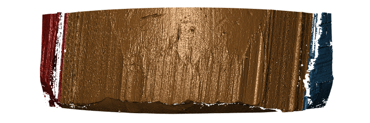
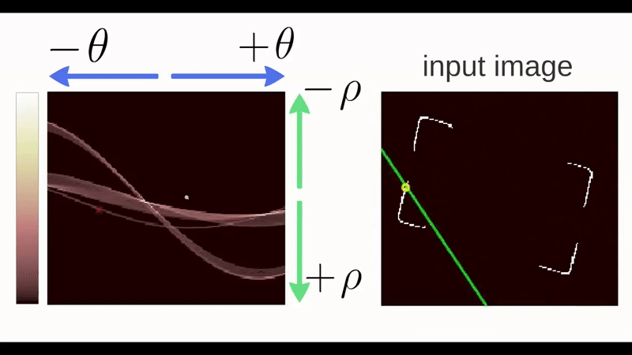
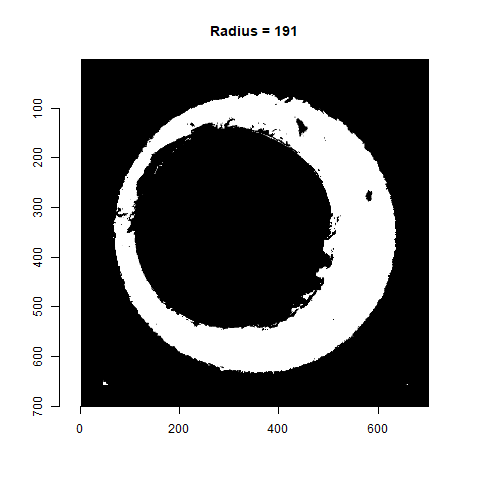
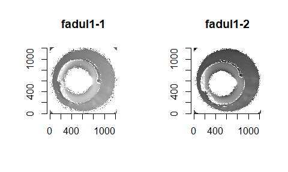

# Project CC: Bullets and Cartridge Cases {#bullets}

```{r setup, echo=FALSE}
library(knitr)
opts_chunk$set(echo=FALSE)
```

For both bullets and cartridge cases we are dealing with several inter-related aspects, that we want to address independently. 

Those are:

1. data collection
2. computational tools
3. similarity scores

    1. for bullet lands: 

        a. crosscut identification
        b. groove location
        c. curvature removal
        d. alignment of signatures
        e. feature extraction
        f. matching with trained Random Forest

    2. for breech faces

4. analysis of results
5. communication of results and methods


## Data Collection

### LAPD

All bullets are collected by Srinivasan Rathinam, LAPD. 

#### Main study
4 bullets per barrel for  626  Beretta 92 F/FS firearms , ammunition used are 9 mm Luger Winchester 115 grain with a Copper surface.

scans are on Raven.

<p class="new">evaluation: Yawei is going to work through all 626 barrels of knowns to assess similarity scores</p>

```{r, fig.cap="Results from assessing scans of barrel FAU 1 similarity.", out.width="50%", fig.keep="hold", fig.align='center'}
include_graphics(c("images/yawei/results-FAU-1.png"))
```

```{r, fig.cap="Results from assessing scans of barrel FAU 2 similarity.", out.width="50%", fig.keep="hold", fig.align='center'}
include_graphics(c( "images/yawei/results-FAU-2.png"))
```

Why some of the cases failed? (181/626 = 30%)

`x3p_crosscut_optimize()` failed to find the positions to get cross cut for some lands.

```{r, fig.cap="Land scan for barrel FAU 3 bullet A land 6.", out.width="50%", fig.keep="hold", fig.align='center'}
include_graphics(c("images/yawei/lapd-FAU-3-Bullet-A-land-6.PNG"))
```

```{r, fig.cap="Land scan for barrel FAU 4 bullet C land 5.", out.width="50%", fig.keep="hold", fig.align='center'}
include_graphics(c("images/yawei/lapd-FAU-4-Bullet-C-land-5.PNG"))
```

```{r, fig.cap="Land scan for barrel FAU 5 bullet B land 5.", out.width="50%", fig.keep="hold", fig.align='center'}
include_graphics(c("images/yawei/lapd-FAU-5-Bullet-B-land-5.PNG"))
```

Assess the land-land comparasion and bullet-bullet comparasion

For bullet-bullet comparasion: we use the "sequence average maximum"(SAM), i.e. average ccf of "lines" of land-land comparasions, as the bullet similarity score(currently).

By making use of 92 manually generated comparasion data, we try to produce the KM(known-matches) and KNM(known-non-matches) plot.

For the known mathches, we have totally 626 x 6 = 3756 for the LAPD data, excluding the comparasions for same bullet.

For the known non-matches, we don't have the data in hand. We need to generate the data in a way. We have totally 626 x 625/2 x 16 = 313000 known non-matches. We can only generate a sample from the data.

We sampled 100 bullet-bullet known non-matches from our 92 cases.

```{r, fig.cap="KM and KNM", out.width="50%", fig.keep="hold", fig.align='center'}
include_graphics(c("images/yawei/knmkm.png"))
```

Is the SAM(sequence average maximum) a good choice? Need to do a permutation test.

```{r, fig.cap="SAM permutation result", out.width="50%", fig.keep="hold", fig.align='center'}
include_graphics(c("images/yawei/sam_1.PNG"))
```

```{r, fig.cap="SAM permutation result among maxmum", out.width="50%", fig.keep="hold", fig.align='center'}
include_graphics(c("images/yawei/sam_max_1.PNG"))
```

Possible dependence structure in land-land comparasions:

Assume beta distributions for the ccf for both known mathces and known non-matches. For the real known match cases, we consider a mixture distribution of two/three beta distribution.

```{r, fig.cap="KM three components for all data", out.width="50%", fig.keep="hold", fig.align='center'}
include_graphics(c("images/yawei/km-three-alldata.png"))
```

```{r, fig.cap="KNM two components for all data", out.width="50%", fig.keep="hold", fig.align='center'}
include_graphics(c("images/yawei/knm-two-alldata.png"))
```

```{r, fig.cap="common component", out.width="50%", fig.keep="hold", fig.align='center'}
include_graphics(c("images/yawei/commoncomp.png"))
```

Ten-fold-cross validation (no validation yet), check the model estimator sensibility

```{r, fig.cap="KM ten-fold models for two components", out.width="50%", fig.keep="hold", fig.align='center'}
include_graphics(c("images/yawei/km-two.png"))
```

```{r, fig.cap="KM ten-fold models for three components", out.width="50%", fig.keep="hold", fig.align='center'}
include_graphics(c("images/yawei/km-three.png"))
```

```{r, fig.cap="KNM ten-fold models for one component", out.width="50%", fig.keep="hold", fig.align='center'}
include_graphics(c("images/yawei/knm-one.png"))
```

```{r, fig.cap="KNM ten-fold models for two components", out.width="50%", fig.keep="hold", fig.align='center'}
include_graphics(c("images/yawei/knm-two.png"))
```

Increasing sample size: 1, 2, 6, 12, ... number of barrels

```{r, fig.cap="KM increasing sample models for two components", out.width="50%", fig.keep="hold", fig.align='center'}
include_graphics(c("images/yawei/km-two-cum.png"))
```

```{r, fig.cap="KNM increasing sample models for one components", out.width="50%", fig.keep="hold", fig.align='center'}
include_graphics(c("images/yawei/knm-one-cum.png"))
```

```{r, fig.cap="KM increasing sample for first component", out.width="50%", fig.keep="hold", fig.align='center'}
include_graphics(c("images/yawei/km-c1-cum.png"))
```

More on the weight

```{r, fig.cap="Prior weight on components", out.width="50%", fig.keep="hold", fig.align='center'}
include_graphics(c("images/yawei/priorboxplot.png"))
```

More on one barrel case

```{r, fig.cap="KM one barrel model for the frist ten barrels", out.width="50%", fig.keep="hold", fig.align='center'}
include_graphics(c("images/yawei/onebarrel.png"))
```

Some conclusions from current plots:

1. Generally, the fits are stable in both ten-fold-cross validation and increasing sample cases
2. In ten-fold model, group8 model behaves a little different from others when in three components case
3. In increasing sample models, the one barrel model is not stable, but the one in our case is still a rarare case
4. The three components model for KM is less stable than two components one especially in small sample cases
5. Two components model for KNM is not stable in small sample case(in terms of weight)

```{r, fig.cap="ROC-cv-models", out.width="50%", fig.keep="hold", fig.align='center'}
include_graphics(c("images/yawei/roc-cvmodels.png"))
```

```{r, fig.cap="ROC-different-size-models", out.width="50%", fig.keep="hold", fig.align='center'}
include_graphics(c("images/yawei/roc-differentsize.png"))
```

```{r, fig.cap="ROC-one-barrel", out.width="50%", fig.keep="hold", fig.align='center'}
include_graphics(c("images/yawei/roc-onebarrel.png"))
```

```{r, fig.cap="KM-table", out.width="100%", fig.keep="hold", fig.align='center'}
include_graphics(c("images/yawei/km-table1.PNG"))
```

```{r, fig.cap="KNM-table", out.width="100%", fig.keep="hold", fig.align='center'}
include_graphics(c("images/yawei/knm-table1.PNG"))
```

```{r, fig.cap="ccf in each barrel", out.width="50%", fig.keep="hold", fig.align='center'}
include_graphics(c("images/yawei/ccfineachbarrel.png"))
```

```{r, fig.cap="within barrel ROC for barrel 42 and 56", out.width="50%", fig.keep="hold", fig.align='center'}
include_graphics(c("images/yawei/withinbarrel4256roc.png"))
```

#### follow-up study 

4 bullets per barrel for  96 of the original 626 Beretta firearms using different ammunition

<p class = "new">bullets are being scanned</p>

### Hamby Sets

Scans for Hamby Sets 10, 36, 44, and 224

Scans for 3 replicates of clones for Hamby 224

### Houston Tests

contact: Melissa Nally, Houston FSI

#### Pre-study

3 kits with 23 bullets each 

```{r, fig.cap="Bullet-to-bullet similarity scores for questioned bullets (y-axis) compared to all other bullets of the test set (x-axis).",  fig.keep="hold", fig.align='center'}
include_graphics(c( "images/bullets/houston-pre-set3.png"))
```

<p class="new">evaluation included in submission to JFI</p>

#### Study

4 kits with 20 bullets each

<p class="new">scans done, evaluation finished, some scans of doubtful quality</p>


### Houston Persistence

contact: Melissa Nally, Houston FSI

8 barrels with 40 fired bullets each

### St Louis persistence

contact: Steve Kramer, St Louis PD

2 barrels with 192 fired bullets each (2 bullets collected every 25 shots)


### DFSC Cartridge cases

Breech face data for knowns are scanned and available on a private github repository

evaluation

## Computational Tools

### x3ptools

`x3ptools` is an R package for working with files in x3p format. x3p is an ISO standard for describing 3d topographic surface measurements. 
`x3ptools` is available on CRAN, i.e. can be installed with the command `install.packages("x3ptools")`. The development version is available from github. Installation instructions and basic usage can be found at https://heike.github.io/x3ptools/


### bulletxtrctr

`bulletxtrctr` is a developmental R package available from github (see https://heike.github.io/bulletxtrctr/) that allows an assessment of similarity scores using the data extraction pipeline described in @aoas. 

### grooveFinder

`grooveFinder` is a developmental R package providing different methods for identifying the location of grooves in scans of bullets.
Installation instructions and some basic usage can be found at https://heike.github.io/grooveFinder/

## Similarity Scores

### Bullet Lands

#### Approaches to identify groove locations

##### Hough Transform Method for Identifying Grooves
<details>

<summary>
Charlotte 9/5/19 Update: State semester goals and iron out inconsistencies with 2-d and 3-d visualizations due to unit changes.
</summary>


**Current Goals**:
- Iron-out issues with consistency of units with `get_hough_grooves`. I believe there are some issues translating from the 2-d visualization to the 3-d visualization that might have to do with inconsistent unit inputs? For Example


```{r, fig.cap="2-dimensional visualization of example bullet br411 with .999 strength threshold", out.width="50%", fig.keep="hold", fig.align='center'}
knitr::include_graphics("images/bullets/Hough_project/br411_2d.jpeg")
```

```{r, fig.cap="3-dimensional visualization of example bullet br411 with .999 strength threshold", out.width="50%", fig.keep="hold", fig.align='center'}

```

So either somethin is wrong with `get_mask_hough` or something is funky with the units.

- Also need to think of including a sort of rounding component where lines with slopes that are practically infinite can be viewed as a vertical line

- Compare Hough results with manual identification using score calculations from Kiegan. 

- Write up results in Hough Groove Paper (It's coming I promise)
  - Create graphical images to explain line selection method
  - Include 2-d and 3-d visualizations of Hough groove area identifications
  - Include crosscut visualization and comparison in results

</details>


<details>
<summary>
Charlotte update 09/12/19: 
This week I have been working on obtaining some results for the Phoenix set on Sunny.
As a minor update the unit issues in `get_mask_hough()` are resolved ( I think). Below
is an example of a nice image that has been generated using masks.
</summary>

```{r, fig.cap=" Phoenix Gun1 A-9 B1 Land 4 generated at strength threshold of 0.99, initially did not generate estimates at the 0.999 or 0.995 level", fig.keep="hold",fig.align = "center"}
knitr::include_graphics("images/bullets/Hough_project/mask_phoenix_nice.png")
```


However the mask is only as good as the Hough estimates that supports it as shown here (less nice).

```{r, fig.cap=" Phoenix Gun1 F-6 B2 Land 5 generated at strength threshold of 0.9, initially did not generate estimates at the 0.999 or 0.995, or 0.99 level", fig.keep="hold",fig.align = "center"}
knitr::include_graphics("images/bullets/Hough_project/mask_phonix_lessnice.png")
```


Hough crosscut predictions for the Phoenix dataset are now uploaded to the bulletQuality Github in the"results" folder and contains Hough groove estimates at the following five strength levels: 0.999, 0.995, 0.99, 0.95, 0.9. The source and the crosscut estimate are also included in the dataset.


Here are some preliminary results of using Kiegan's area of misidentification method
(thanks Kiegan!) on Hough groove estimates at the strength threshold of 0.999
in comparison to the BCP and Lasso method.


```{r, fig.cap="Left-hand groove area of misidentification log-transformed scores for BCP, Lasso, and Hough", out.width="50%", fig.keep="hold", fig.align='center'}
knitr::include_graphics("images/bullets/Hough_project/preliminary_phoenix_score_results_left.png")
```

```{r, fig.cap="Right-hand groove area of misidentification log-transformed scores for BCP, Lasso, and Hough", out.width="50%", fig.keep="hold", fig.align='center'}
knitr::include_graphics("images/bullets/Hough_project/preliminary_phoenix_score_results_right.png")
```


These scoresare log transformed to show better separation but it's very clear that for the
left groove both Lasso and BCP are out performing the Hough method in correctly identifying grooves. For the righthand side, scores tend to be more similar however once again,
the Lasso method seems to bo the best job since it has a larger density of low scores
and minimizes high score misidenfitications.

For improvement before next week, I will investigate why there are 47 missing Hough
predictions resulting in a score of 0 in these results and change the parameters in the
`get_grooves_hough()` function to try and generate estimates for some of those missing values.

</details>

<details>

<summary>
Charlotte update 09/19/2019:

This week we are trying to think of a new way for selecting Hough lines for bullet estimates. The previous method for selecting Hough lines was to find lines with x-intercepts at the top and bottom of the lands closest to the lower and upper one sixth of the bullet lands. However this process was highly dependent on score thresholding from the Hough transform which is frustrating when running a large number of bullets since if the right score threshold was not achieved, no result would be produced. So right now I'm working on a way of selecting Hough lines from the normalized Hough scores.
</summary>

To obtain a normalized Hough score I take the x-intercepts of each estimated Hough line generate and find the distance between the x-intercept at the top and the bottom of the land. This should give me the max possible score for each Hough line, rather than calculating based on theta. Then I take the Hough score and divide by this maximum to normalize scores between 0 and 1. Right now I am working on visualizing some of these results but my code is buggy because I'm getting negative values when I try to visualize the process using masks when I shouldn't. Here is an example of a bullet land using the old and new method. Really similar results although it would appear that the new resut places the Hough transform lines further in to interior of the land than the old results. So that's promising?

```{r, fig.cap="Phoenix Gun 1-A9 Bullet 3 Land 1 visualized using current Hough process message", out.width="50%", fig.keep="hold", fig.align='center'}
knitr::include_graphics("images/bullets/Hough_project/phoenix_current_hough_land1.png")
```

```{r, fig.cap="Phoenix Gun 1-A9 Bullet 3 Land 1 visualized using new Hough process message", out.width="50%", fig.keep="hold", fig.align='center'}
knitr::include_graphics("images/bullets/Hough_project/phoenix_new_hough_land1.png")
```

</details>

<details>

<summary>
Charlotte Update 09/26/2019:

This week is focused on fixing the normalization of the scores for Hough grooves. So that the process can be automatic rather than rely on manual input for the score threshold.
</summary>

Instead of dividing by the geometric distance between the top and bottom intercepts of the bullet image. Now
we only consider Hough lines that actually go through both the top and bottom of the land,
therefore we can normalize each score by dividing the original hough score by the height
of the image and multiplied by the cosine of theta which accounts for the difference
in length of lines with differing angles. As far as selecting normalized scores from
every score possible I found that there is really no visual difference between selecting
the highest normalized Hough score and the other top five. 

```{r, fig.cap="Phoenix Gun 1-A9 Land 4 visualized using new Hough process index one", out.width="50%", fig.keep="hold", fig.align='center'}
  knitr::include_graphics("images/bullets/Hough_project/mask_phoenix_index_one.png")
```

```{r, fig.cap="Phoenix Gun 1-A9 Land 4 visualized using new Hough process index ten", out.width="50%", fig.keep="hold", fig.align='center'}
  
```

```{r, fig.cap="Phoenix Gun 1-A9 Land 4 visualized using new Hough process index twenty", out.width="50%", fig.keep="hold", fig.align='center'}
  knitr::include_graphics("images/bullets/Hough_project/mask_phoenix_index_twenty.png")
```


So for now we will continue to select the highest normalized Hough score to use as our bullet land estimates. After fixing the parameterization of the Hough scores and how we normalize Hough scores,
the 3-dimensional images appear to have improved! Which is great news since no thresholding was necessary. 


```{r, fig.cap= "Hamby Bullet 1 Land 1 visualized using new Hough process", out.width="50%", fig.keep="hold", fig.align='center'}
knitr::include_graphics("images/bullets/Hough_project/mask_hamby_demo_nice.png")
```


Still we run into the problem that our masks are only as good as our estimates,
however even this terrible bullet land appears to have grooves identified somewhat well.

```{r, fig.cap= "Hamby Bullet 1 Land 4 visualized using new Hough process", out.width="50%", fig.keep="hold", fig.align='center'}
knitr::include_graphics("images/bullets/Hough_project/mask_hamby_demo_lessnice.png")
```

A comparison between the two methods finds that generally the new Hough process out-competes
the old one on nearly every bullet land in the Hamby 252 demo set.


```{r, fig.cap= "Crosscut Results Hamby 252 Demo Set Comparison between old and new methods", out.width="50%", fig.keep="hold", fig.align='center'}
knitr::include_graphics("images/bullets/Hough_project/Hamby_demo_crosscuts.png")
```

</details>

Charlotte Update 10/3/2019:

The get_grooves_hough function has changed since last week, it previously slopes were calculated in x which is numerically less stable than a slope in y so for example when we were using the old slopes we had the possibility of dividing by zero which is not good. Changing to the new slope helps eliminate that likelihood. Other than that I am working on writing a grooveFinder vignette. I will be discussing every step of the Hough algorithm at length then demonstrating the function itself on the Hamby44 demo set.

Charlotte Update 10/3/2019:

Finished up the application section of the Hough grooves vignette, need to fill in a few demonstration images that explane how we calculate normalized scores using geometry.

Now working on:
- Finish visualization portion for the vignette
- Expand testing for get_grooves_hough


Charlotte Update 10/17/2019:

- Finally finished up with the vignette, but need to finish one or two more explanation diagrams before first-pass is complete. Having trouble figuring out what the results section should really look like. 

- Need to finish tests for get_grooves_hough. 

<details>

<summary>
Charlotte Update 10/22/2019: For this weeks spotlight I will focus on motivating the reasoning behind the Hough project, a demonstration of mechanics or how the function actually works and maybe a few results.
</summary>

** Project Motivation **

One of the main objectives of the bullet project is to develop algorithms that can match bullet lands based on a set of  features taken from a signature of a single bullet crosscut. In order to to extract these vital signatures we need to fit a robust loess to our crosscut data to remove the curvature inherent in each bullet land. However, there-in lies a problem. If the groove engraved areas are included in our fitting of the robust loess we observe boundary effects that negatively impact the accuracy of the extracted signature. 


So a key goal in the bullet project is to be able to automatically identify the location of bullet grooves. Other projects in pursuit of this goal use a statistical approach to calculating the location of bullet grooves over a single crosscut. However, we are given an entire land scan in the form of an x3p file. By using low-level image algorithms like the Hough transform, we can almost make full utility of the x3p scan by estimating bullet grooves over the entire bullet land image instead of a single crosscut.

** Hough Transform Mechanics**

 Hough transforms are essentially a computer algorithm for detecting imperfect incidences of a known class of shapes in an image by finding aligned points. In our case, grooves are typically linear so we want the Hough transform to detect straight lines. Anyone who has looked at a bullet scan knows that the striae are also straight lines, so some image pre-processing is necessary for the algorithm to be able to distinguish between weaker appearing striae and the prominent groove features. Traditionally a gaussian blur and Canny Edge detection are performed to reduce the noise found in a gradient image. However, we have found that using Canny Edge detection is pretty much unnecessary for identifying grooves.

```{r, fig.cap="Bullet land with Canny Edge detection", out.width = "80%", fig.keep="hold", fig.align='center',fig.show='hold'}
knitr::include_graphics(c("images/bullets/Hough_project/canny-land.png"))

```

```{r, fig.cap="Same bullet land but only with gradient magnitude thresholding at the 99th percentile", out.width = "80%", fig.keep = "hold", fig.align="center", fig.show="hold"}
knitr::include_graphics("images/bullets/Hough_project/strong-threshold.png")
```

Utilizing the cleaned up edges in our bullet image, the Hough transform cycles through every pixel of an image in an attempt to find aligned points on an edge. To do so, the Hough transform operates by transforming each point in a line into a different feature space. 

```{r, fig.cap="Diagram of detecting aligned points by looking for intersections in the feature space. Source: 'How Hough Transform Works'- Thales Sehn Körting", out.width = "80%", fig.keep = "hold", fig.align="center", fig.show="hold"}
knitr::include_graphics("images/bullets/Hough_project/feature-space.png")
```

Unfortunately, vertical lines have slopes in x that tend to infinity, which would make storing the results of the Hough transform impossible due to memory storage issues. So the Hough transform parameterizes lines in what is known as the Hessian Normal Form. 
$$ \rho = x\ \cos(\theta) \ + \ y\ \sin(\theta)$$

```{r, fig.cap="Hessian Normal Form of simple line over bullet image", out.width = "80%", fig.keep = "hold", fig.align="center", fig.show="hold"}
knitr::include_graphics("images/bullets/Hough_project/hessian-example.png")
```

```{r, fig.cap="Gif of a Hough Transform Algorithm at work. Source: 'How Hough Transform Works' - Thales Sehn Körting", out.width = "80%", fig.keep = "hold", fig.align="center", fig.show="hold"}


```


So the output of the Hough algorithm (in this package we utilize the `hough_lines` function from the `imager` package) is thus a set of $\rho$ and $\theta$ that define the detected lines but also a "score" which indicates the number of points that the algorithm detected for this particular edge estimation. This allows us to use thresholding and other means to select only the strongest candidates as groove estimates. Previous iterations of the `get_hough_grooves` function used a user-specified score thresholding level which made results highly variable dependent on the inputted score threshold. Now we use a normalized "score" to select the strongest line detected in the image. Once our lines for the left-hand and right-hand grooves are selected, we choose to output two functions that define our estimated grooves. To compute the parameters of our Hough line, we first find the location of where each line first intersects the bullet ("xtop") then we use our known "xtop" and our known "height" of the image to calculate "xbottom" using good ol' SOH CAH TOA. 

```{r, fig.cap="Geometrically Calculating 'xbottom'", out.width = "80%", fig.keep = "hold", fig.align="center", fig.show="hold"}
knitr::include_graphics("images/bullets/Hough_project/calc-xbottom.png")

```

The reason for calculating the top and bottom intersection points is so that we can derive a slope for our groove estimate in y. When we learned how to calculate slope in grade school, we were always taught to use "rise over run" which is slope in x. However when the lines are vertical, we are essentially dividing the height of our bullet land by 0 to obtain a slope. So it is numerically more stable to define the slope as $\frac{(\text{xtop - xbottom})}{\text{height}}$ so vertical lines simply have a slope of 0. 

**Implementation **

As far as implementation goes, the function `get_grooves_hough` takes care of the edge detection, Hough algorithm, and line selection. Similar to other methods used for detecting lines, the `get_grooves_hough` function has an adjust parameter that allows the user to specify how far inward they want to "nudge" the groove estimates. The default for the Hough transform is set at 10, however this needs to be experimented with for a variety of different bullets to find appropriate adjust levels.

```{r eval = F}
library(x3ptools)
library(ggplot2)
library(grooveFinder)

x3p <- br411 #built into x3ptools

# Get grooves fit for left and right groove from x3p
grooves <- get_grooves_hough(x3p_to_df(x3p), adjust = 20)

# Find optimized crosscut location, this may take some time
crosscut <- x3p %>% bulletxtrctr::x3p_crosscut_optimize()

# obtain a three dimensional visualization of the groove estimates
a <- get_mask_hough(x3p, grooves)
x3ptools::image_x3p(a)

```

```{r, fig.cap="3d visualization of example bullet", out.width = "80%", fig.keep = "hold", fig.align="center", fig.show="hold"}


```

** What's Next? **

Fiddling with adjusts and how it affects score. To find an optimal adjust for the Phoenix set, I calculate the default Hough groove estimates then find what the estimate would be for a series of adjusts. Naively I have defined a new parameter called "difference_left" and "difference_right" which is simply the difference between the manually identified groove location at an optimized crosscut and our Hough estimate at a particular adjust level. For now, I have defined any negative values to indicate that the Hough estimate is further from the center than the identified truth. So we want to minimize these negative difference to better get rid of boundary effects. 

```{r, fig.cap="Difference between the left hand Hough estimate and the truth at various adjusts", out.width = "80%", fig.keep = "hold", fig.align="center", fig.show="hold"}
knitr::include_graphics("images/bullets/Hough_project/adjust-boxplot-left.png")

```

```{r, fig.cap="Difference between the righ hand Hough estimate and the truth at various adjusts", out.width = "80%", fig.keep = "hold", fig.align="center", fig.show="hold"}
knitr::include_graphics("images/bullets/Hough_project/adjust-boxplot-right.png")

```
</details>


<details>
<summary>
Charlotte Update 10/31/2019:
This weeks work has been focused on figuring out why we have such extreme mis-identifications for the adjust in the Phoenix set and work on edits for the vignette.
</summary>

So last week I showed a series of boxplots that show the impact of adjust levels on the difference between the manual identification and the groove estimates from the Hough transform. There were a few significant outliers shown in the boxplot. Upon further investigation it seems as if the Hough transform simply does not find a groove on the right side of the land. 

```{r, fig.cap="Adjust level at 100, image of bullet land with a right hand differene of -600", out.width = "80%", fig.keep = "hold", fig.align="center", fig.show="hold"}
knitr::include_graphics("images/bullets/Hough_project/gun-L5-B3-l1.png")

```

```{r, fig.cap="What the Hough Transform Sees", out.width = "80%", fig.keep = "hold", fig.align="center", fig.show="hold"}
knitr::include_graphics("images/bullets/Hough_project/hough-estimates-problem-boy.png")

```

I wanted to show scores this time around but I just found out from looking through my saved results that the number of observations produced differs for each adjust level and I don't know why. So there's some major error with my code that I need to work out before proceeding. 

</details>

<details>
<summary>
Charlotte Update 11/07/2019: This week a major bug was discovered in the code! Still working to look at different adjust impacts on score and now the `get_grooves_hough` function takes x3ps and dataframes as inputs.
</summary>

Below are the visualized scores for the left and right hand estimates at various adjust levels.

```{r, fig.cap=" Phoenix Hough Scores for estimates with a series of 10 different adjusts for the Right Groove", out.width="50%", fig.keep="hold", fig.align='center'}

```


```{r, fig.cap=" Phoenix Hough Scores for estimates with a series of 10 different adjusts for the Left Groove", out.width="50%", fig.keep="hold", fig.align='center'}
knitr::include_graphics("images/bullets/Hough_project/lh-phoenix-adjust-scores.png")
```

What we mightn notice the most from these two graphics is that there are still persistent extreme scores despite the adjusts with areas of identification in the thousands. The most extreme of which for the right side happens to have a score of about 5000. Upon taking a look at the specific lands that have problematic scores
they look relatively normal. So then we want to estimate where the Hough transform thinks the grooves are.

```{r, fig.cap="Gun1-U10 Bullet 3 Image Scan", out.width="50%", fig.keep="hold", fig.align='center'}

```


Which looks like a pretty regular scan but when we look at the groove estimates we see.

```{r, fig.cap="Gun1-U10 Bullet 3 Crosscut Hough Estimates", out.width="50%", fig.keep="hold", fig.align='center'}

```


Which is bizarre because the Right hand estimate is way too far into the bullet land. However we filter out any lines that are within the middle 2/3rds of the bullet scan, and this estimate is clearly within the middle 2/3rds. So we have discovered a new bug in the code, but at least this bug is consistent.

##### LASSO Method  

A paper is in preparation for submission to Forensic Science International describing this method (`get_grooves_lassofull` in `grooveFinder`), as well as the Bayesian changepoint method (`get_grooves_bcp`).  

##### Robust LOESS Method  

A paper submitted to the Journal of Forensic Science is waiting for peer review response to the first round of revisions.  
  

#### Bullet Land Comparisons Pipeline

Most data analysis processes can be thought of as a data analysis "pipeline". This process can involve data collection, decisions about data cleaning, data transformation or reduction, and feature engineering. For example, consider the general process below:

  

In the case of the bullet project, we have a pipeline which starts with having two physical bullet LEAs and ends with a quantitative result, a random forest similarity score. Our pipeline could be described (roughly) as something like this:

  

To make this a little easier to see, we can look at how a 3D scan is processed into a 2D signature:  


Now, something important to consider is whether each of these "data decisions" has an impact on the quantitative result (here, a similarity score between two LEA signatures). Consider a simple set of decisions we could make in our bullet pipeline:  

  

If we have a pair of signatures, we could theoretically end up with 16 different similarity scores depending on the decisions we make at each point. That is also assuming that both signatures were processed in the same way at each point.   

This year, I'll be studying our bullet land "pipeline" here at CSAFE, as well as pipelines that are a little different than ours (e.g., @chu_jfs). There are a few major goals I am working towards: 

1. Quantifying the uncertainty of our RF similarity scores based on data decisions  
2. Comparing reproducibility/robustness of differing bullet analysis approaches  
     - @aoas vs. @chu_jfs, for example
     - Crosscuts: method 1 vs. alternate? Crosscut parameter tuning? 
     - Groove methods  
     - Original RF vs. updated/retrained/re-engineering 
3. Reproducibility/robustness of different approaches when we consider data COLLECTION.   

The code in `bulletxtrctr` is already really well set up as a data "pipeline", so now we are conceptualizing the best way to wrap the pipeline and keep track of what decisions are made along the way. 

We are using few resources to conceptualize and plan the pipeline work, including:  

1. `tidymodels`, a part of the `tidyverse` focused on design matrices and reproducibility of modeling
2. `drake`, an R package by Will Landau which helps cache information and keep track of steps in a pipeline  
     - We are investigating how well this scales to ``big data".  
     - <p class="new"> It does not scale well. </p>
3. Some pipeline/plumbing papers by Hadley Wickham, Heike Hofmann, Dianne Cook, and others  
     - These focus on interactive graphics and updating data/plotting objects with interactivity  
4. All of the existing tools in the "bulletverse"; `x3ptools`, `bulletxtrctr`, `grooveFinder`, etc.


Earlier this year, we designed and collected a bullet scanning variability study of 9 bullets. I'm working on formally modeling the variability at the signature level, taking two major approaches:   

1. Subsampling and assuming independence; 
2. Directly modeling out the mean structure
     - Ignoring peak/valley dependence
     - Using time series/spatial dependence modeling
     - Using a Bayesian shrinkage prior (w/help from Amy!)
     

Results for Method 1, the subsampling, looks something like this:   

  

We are also investigating the variability of random forest scores, using pairs of signatures. The current process for taking a set of signatures and completing pairwise comparisons on each of them actually completes many comparisons twice, which has two impacts:    

1. It takes up more computational time and memory than we really need it to
2. It has the potential to make our variance component estimates inaccurate - we double-count a bunch of comparisons!   


Over the summer I made a function to "fix" this, to address the estimation problem in my variability study. The `bulletxtrctr` pipeline calls for using `expand.grid`. My new function compares pairs by creating a `pairing_id` variable and ensuring no `pairing_id` is duplicated. This is the resulting set of comparisons: 

  

The changes to our results are minor, but it is an important detail when modeling things.  

<p class="new"> Two papers in progress! Groove ID paper #1 needs another round of minor revisions (hopefully will be accepted soon!), Groove ID paper #2 is waiting for advisor comments. </p> 

<p class="new"> Sometimes, data collection goes awry... </p>  

  

<p class="new"> I am in the process of documenting all the data issues and double-checking everything. We are adding more operators (and another set of bullets) to our variability study! </p>    


<p class="new"> I am polishing two full chapters of the book this week. Starting to write up the full variability study (as a dissertation chapter). Writing, writing, writing! </p>  


### Cartridge Cases

#### Congruent Matching Cells (CMC) algorithm for comparing cartridge case breech face impressions

<details>
<summary>
Joe 9/5/19 Update: Explanation of missing value problem when calculating cross-correlations and some attempted fixes.
</summary>
 Dealing with missing values in the x3p scans continues to be an issue. The Fast Fourier Transform method for calculating cross-correlation can't handle missing data in an image, so we've attempted a few "fixes" that haven't necessarily turned out as well as expected. One idea we had was to replace the NA values in a cell with the average pixel value. However, this is artificially introducing a signal where before there was none. This can (and demonstrably has) led to inflated/incorrect correlations between cells that shouldn't have much at all in common. Unfortunately, this may be the only solution if we still wish to adhere to the CMC algorithm as described in Song et al. (2015). One improvement that I've implemented is to "crop out" the rows and columns of an image that only contain NAs. This at least means that we've weakened the strength of the artificial signal relative to the breechface's signal.

Below is a series of images that illustrate how we might compare a cell in one image to a region of another image.

```{r, fig.cap="Comparing a cell in image 1 to a larger region in image 2. We wish to find the translations of the image 1 cell that yield the highest correlation within the image 2 region.", out.width="50%", fig.keep="hold", fig.align='center'}
knitr::include_graphics("images/cartridge_cases/im1_im2_cellComparison.png")
```

For the sake of an example, let's focus on the blue outlined cell in image 1. Our goal is to use the image 1 cell to "search" a corresponding larger region in image 2 for the horizontal/vertical translations needed to produce the highest correlation. Below is a zoomed-in version of the blue outlined image 1 cell on the left and the larger image 2 region (approximately: I made the gridded image above by-hand outside of R while the images below are from R). The image 1 cell may look larger than the image 2 region, but we can see from the axes that the image 2 region is indeed larger. Any white pixels in the two images are NA values that need to be dealt with in some way before we can use FFTs to calculate the cross-correlation.

```{r, fig.cap="(Left) A cell from image 1. (Right) A region from image 2 centered in the same location as the image 1 cell, yet quadruple the area.", out.width="50%", fig.keep="hold", fig.align='center',fig.show='hold'}
knitr::include_graphics(c("images/cartridge_cases/im1_split.png","images/cartridge_cases/im2_split.png"))
```

As already discussed above, one "solution" is to replace the NA values with the average pixel value of each image. However, to avoid creating a stronger artificial signal than necessary, we can crop-out the NA rows and columns from the two images above. Below is the cropped version of the two images. The cropping doesn't produce signficantly different images in this case, but you could imagine other examples in which a cell has captured only small amount of breechface in the corner. Such examples are fairly common and cropping signficantly changes the resulting correlation values.

```{r, fig.cap="The same images as above after cropping NA rows/columns.", out.width="50%", fig.keep="hold", fig.align='center',fig.show='hold'}
knitr::include_graphics(c("images/cartridge_cases/im1_splitFilteredCropped.png","images/cartridge_cases/im2_splitFilteredCropped.png"))
```

The last step before calculating correlation for these cells is to replace the remaining NAs with the average pixel value. This is shown below.

```{r, fig.cap="The NA-cropped images with remaining NAs replaced with the image's average pixel values.", out.width="50%", fig.keep="hold", fig.align='center',fig.show='hold'}
knitr::include_graphics(c("images/cartridge_cases/im1_splitShifted.png","images/cartridge_cases/im2_splitShifted.png"))
```

The cross-correlation is then calculated between these two images via a standard fast fourier transform process (see [Cross-Correlation Theorem](http://mathworld.wolfram.com/Cross-CorrelationTheorem.html)). The benefit of using such a process is that (as the name suggests) it's faster than calculating the raw correlation between the two images. Also, the translations that produce the highest correlation between the image 1 cell and the image 2 region fall out of the calculation for free.

This pre-processing/cross-correlation calculation procedure is repeated for every cell in image 1 that contains breech face impression. Because it is not valid to assume that the two images are rotationally aligned by default, we perform the same procedure repeatedly while rotating image 2. Currently, we perform a "rough" grid search of $\theta \in [-177.5,180]$ by increments of $2.5^{\circ}$. Theoretically, the final results tell us how we need to horizontally/vertically translate and rotate the two images to be correctly aligned.
</details>

#### Congruent Matching Tori: a promising solution to the missing value problem

<details>
<summary>
Joe 9/5/19 Update (cont'd): A brief introduction to a congruent matching "tori" method that may provide a better solution to the missing value problem.
</summary>

As discussed above, dealing with missing values is provign to be a pain. The good news is that the currently-implemented CMC as described above yields results very similar to those published in Song et al. (2015) that originally describes that CMC algorithm. While our results seem to agree with currently published results, it would be nice if we could avoid needing to artifically replace missing values. We can do so if, rather than breaking up the circular breech face impression scans into disjoint squares, we break up the breech face impression into donut-shaped regions containing only breech face impression. Below is an example of such a toroidal region.

```{r, fig.cap="(Left) The original breech face impression scan image. (Right) A donut-shaped region cut out of the original image.", out.width="50%", fig.keep="hold", fig.align='center',fig.show='hold'}
knitr::include_graphics(c("images/cartridge_cases/im1_original.png","images/cartridge_cases/im1_toroidalRegion.png"))
```

By comparing such regions instead of the square cells, we would presumably only need to fill in a few missing value "holes" in the breech face impression scan rather than completely replacing a non-existent signal with an artificial one. In the near-future, I hope to finish up the pre-processing needed for this Congruent Matching Tori method by performing a polar transformation on these images to make them into strips that can easily be compared via an FFT.
</details>

<details>
<summary>
Joe 9/12/19 Update: Explanation of some of the pre-processing steps needed to make the CMC work as described in [Tong et al. (2015)](https://www.ncbi.nlm.nih.gov/pmc/articles/PMC4730689/)
</summary>

Before carving out toroidal regions from the two images we wish to compare, a fair amount of pre-processing needs to be completed. For example, the scans we work with begin with a considerable amount of auxiliary information, for example the firing pin impression, that we don't want to use in our comparisons. This isn't to say that firing pin impressions aren't useful to determine a match between two cartridge cases. In fact there is quite a lot of published research on how to compare two firing pin impressions. Rather, it is common practice to compare breech face impressions and firing pin impressions separately since it is difficult to scan both simultaneously. Thus, there are regions of a breech face impression scan that we want to remove so that the breech face impressions are more easily comparable. Below is an example of two breech face impression scans before processing.

```{r, fig.cap="Two cartridge case scans before pre-processing.", out.width="50%", fig.keep="hold", fig.align='center',fig.show='hold'}
knitr::include_graphics(c("images/cartridge_cases/im1_fullScan.png","images/cartridge_cases/im2_fullScan.png"))
```

There are a variety of techniques to segment an image into various parts. In image processing, common techniques are the Canny edge detector, which identifies edges of shapes in an image using image gradient techniques, and the Hough Transform, which can detect a variety of geometrical shapes in an image. The Hough Transform is what is used to segment the cartridge case images used in the previous section. However, we've found that the use of a Hough Transform doesn't extract the "breech face signal" from an image as other techniques. Namely, the breech face can be effectively extracted using the RANSAC (Random sample consensus) method that iteratively fits a plane to a set of data until it settles upon a consensus-based "bulk" of the data. In the case of these cartridge case scans, the bulk of the data should predominantely be distributed around the mode height value. That is, the breech face impression. Once we've fit this plane to the breech face impression, we can extract the residuals of the fit to better accentuate the markings left in the cartridge case base by a firearm's breech face. Below is an example of the residuals left after fitting a RANSAC plane to two cartridge case scans above. In the example below, we grab any residuals less than 20 microns in magnitude.

```{r, fig.cap="Residual values of a RANSAC plane fit to the two cartridge case scans shown above.", out.width="50%", fig.keep="hold", fig.align='center',fig.show='hold'}
knitr::include_graphics(c("images/cartridge_cases/im1_ransacResiduals.png","images/cartridge_cases/im2_ransacResiduals.png"))
```

Although these two images are of two different cartridge cases, you can hopefully see that one looks very much like a rotated version of the other. These two cartridge case scans are in fact fired from the same gun (known matches), so it's a good thing that they look so similar. We've now removed quite a bit of the unwanted regions of the original scans. However, there are still some areas of the image (e.g., the faint circular region of pixels in the center of the breech face scan) that just so happened to be close to the fitted plane and thus were brought along in the residual extraction. There are a few ways that we can clean up these last few areas. One is to use two Hough Transforms to detect the inner and outer circles of the breech face impression and filter out any pixels outside of the region between these two circles. The biggest issue with using a Hough Transform is that it must be given the radius of the circle that it is to search for in the image as an argument. That is, we need to know the radius of the breech face impression that we haven't yet identified in order to identify the breech face impression. Instead, we can dilate/erode (or vice-versa) the pixels in the image to remove the remaining "speckle" in the image. Below is an example of of the breech face impressions cleaned via a dilation/erosion procedure.

```{r, fig.cap="The selected breech face impressions based on dilation and erosion.", out.width="50%", fig.keep="hold", fig.align='center',fig.show='hold'}
knitr::include_graphics(c("images/cartridge_cases/im1_maskFiltered.png","images/cartridge_cases/im2_maskFiltered.png"))
```

The final step in the pre-processing is to align the two images in some consistent fashion. Luckily, the firing pin impression ring that's left after performing the above dilation/erosion provides us with some idea of how to align the breech face impressions. The location of the firing ring impression in the breech face impression provides us with an indicator of where the cartridge case was located relative to the firing pin when it was sitting in the barrel. So aligning two cartridge cases so that their firing pin impression rings align will ensure that, at the very least, the breech face impression left on the cartridge case is horizontally/vertically aligned if not rotationally aligned.

</details>

<details>
<summary>
Joe 9/18/19 Update: Continuation of pre-process explanation with a discussion on how we can automatically detect the firing pin impression radius in an image.
</summary>
To automatically detect the radius of a given breech face impression, we can count the number of non-NA pixels in each row. If we were to imagine scanning down an image and counting the number of non-NA pixels in each row, then this count would obviously start to increase the moment we hit the top of the breech face impression. Because the breech face impressions are circular, the count would continue to increase the further down the image we scan. That is, until we hit the firing pin impression circle. At this point, because the firing pin impression circle consists of NAs, we would expect the non-NA pixel count to dip. This increasing followed by decreasing behavior in the non-NA pixel count constitutes a local maximum. We can use this local maximum of the non-NA pixel count to identify the beginning of the firing pin impression circle. Similarly, we would expect the non-NA pixel count to reach another local maximum once we hit the end of the firing pin impression circle. It's then a simple subtraction of the two row indices containing these local maxima to determine an estimate for the diameter of the firing pin impression circle. 

We can see below an example of the non-NA pixel row sums plotted against the row indices (starting from the top of the image and moving down). You can hopefully see that the raw row sums are rather "noisy". As such, we can pass a moving average smoother over the row sum values so that the local maxima are easier to identify. This may not be the most robust way to determine the local maxima. I hope to investigate the use of b-splines fit over the row sum values to see if these would be more effective at finding local maxima

```{r, fig.cap="Non-NA pixel row counts and moving average-smoothed row count values plotted against row index.", out.width="50%", fig.keep="hold", fig.align='center',fig.show='hold'}
knitr::include_graphics(c("images/cartridge_cases/nonNA_rowSums.png"))
```

However, because firing pin impression circles have somewhat perforated edges, performing one pass through the image may not yield a particularly accurate estimate. As such, we can repeat the process of finding the distance between local maxima for both the row and column non-NA pixel counts. We can also rotate the image by a few degrees and perform the same process. I am currently rotating the image 0, 15, 30, 45, 60, and 75 degrees and calculating row and column diameter estimates per rotation. Obviously we can apply whatever aggregation function we desire to these estimates to determine a final estimate. Below we see what the Hough Transform selects as the breech face for 4 different radii values. In particular, for circles of radius 210, 213, 216, and 219.

```{r, fig.cap="Hough Transform selected circles (red) of radius (1) 210, (2) 213, (3) 216, and (4) 219.", out.width="50%", fig.keep="hold", fig.align='center',fig.show='hold'}
knitr::include_graphics(c("images/cartridge_cases/houghTransformGridSearch.png"))
```
</details>

<details>
<summary>
Joe 9/25/18 Update: Dilation and erosion of the breech face impression image seems to be fairly effective, but require some parameter tuning based on the firing pin impression we're considering (e.g., effective erosion in one image may have a different, adverse effect in another image). The watershed algorithm appears to be a promising alternative to selecting the breech face impression out of an image containing extra "minutiae".
</summary>

When trying to select the breech face impression out of an image such as the one below (this is a slice of the original scan based on the RANSAC method-selected breech face impression z-value), we're really just interesting in obtaining a yes/no answer for each pixel to the question: "Are you a part of the breech face impression?" As such, rather than looking at the considering the raw pixel values, we can binarize the image to a 1/0 (equivalently, non-NA/NA) pixel representation. Such a representation is below.

```{r, fig.cap="(Left) Residual values of a RANSAC plane fit to a cartridge case scan. (Right) Binarized non-NA/NA image for segmentation.", out.width="50%", fig.keep="hold", fig.align='center',fig.show='hold'}
knitr::include_graphics(c("images/cartridge_cases/im1_ransacResiduals.png","images/cartridge_cases/breechFaceIndicator.png"))
```

Using this "indicator image", the beginning/end of the breech face impression should be much more obvious to, say, a Canny edge detector. Below is the output of such a Canny edge detector.

```{r, fig.cap="The edges of the binarized image above via a Canny edge detector. ", out.width="50%", fig.keep="hold", fig.align='center',fig.show='hold'}
knitr::include_graphics(c("images/cartridge_cases/watershedPriorityMap.png"))
```

From here, we can use a Watershed image segmentation procedure to identify various regions within this image. The Watershed algorithm needs to be given a set of pixel locations that the user believes to be within distinct regions of the image. With these "seed" pixels, the algorithm then searches neighboring pixels and attempts to identify them as within/without the same region. Almost as if a water source turned on at the given seed pixel and water began to spread to as many neighboring pixels as it could. The water should "stop" at the black lines in the image above, thus defining the boundary of a seed pixel's region. An example of the above image post-segmentation is given below. The 5 seed pixels I used were the 4 corners and center of the image. As we can, the watershed algorithm "overflowed" into the breech face impression, but segmented the firing pin impression circle from the rest of the image. Because most of the minutiae that we want to remove is in within this firing pin impression circle, this is not a problem for our purposes. With 5 seed images, there are technically 5 segments represented in the image below (although it's hard to see where the outer segments begin/end). So as shown below, we can just binarize the segments as being a part of the firing pin impression circle or not.

```{r, fig.cap="(Left) Watershed segmentation of the Canny edge image above. (Right) The firing pin impression circle binarization of the Watershed segmentation image.", fig.keep="hold", fig.align='center',fig.show='hold'}
knitr::include_graphics(c("images/cartridge_cases/watershedFiringPin_segments.png","images/cartridge_cases/watershedFiringPin_binarized.png"))
```

Finally, now that we've identified where the firing pin impression circle is in the original image, we can simply replace any pixel values within this circle with NAs. The final filtered image is shown below.

```{r, fig.cap="Final filtered image.", fig.keep="hold", fig.align='center',fig.show='hold'}
knitr::include_graphics(c("images/cartridge_cases/watershedFinalFiltered.png"))
```

</details>

<details>
<summary>
Joe 10/3/18 Update: Determined a fairly computationally intensive yet (seemingly) effective way to find the firing pin impression circle in an image using a grid search of possible radius values. I will now start putting together a package for easy access. I'm not yet sure what to call the package, so any ideas are welcomed
</summary>

We can find a rough estimate for the firing pin radius estimate using a variety of methods. The one that I've found to be fairly consistent in the few examples I've worked with (detailed in the in the 9/18/19 update) is by counting the number of non-NA pixels in each row/column of the image and identifying the distance between the two largest local maxima in this non-NA count sequence. We can pass a grid of radius values centered on this estimate to a Hough Transform and determine which radius picks out the firing pin impression circle most effectively. The difficulty is in how we quantify "effective" using the output of the Hough Transform. Below you can see the original image including the "minutiae" within the firing pin impression circle that we hope to filter out. You can also see the result of filtering out the firing pin impression circle based on the original radius estimate (210 pixels) obtained from the "local maxima" method.

```{r, fig.cap="(Left) Original breech face impression image. (Right) The breech face impression image after filtering based on a Hough Transform-selected circle of radius 210 pixels.", fig.keep="hold", fig.align='center',fig.show='hold'}
knitr::include_graphics(c("images/cartridge_cases/breechFaceIndicator.png",
                          "images/cartridge_cases/firingPinImpressionFiltered_radius210.png"))
```

As already discussed, we can test a variety of radius values around the 210 estimate to determine which is best. Below is a gif animating the result of filtering based on a Hough Transform for radius values ranging from 190 to 230. Although a radius of 210 does a decent job of filtering out the minutiae, a slightly smaller radius may be preferred as larger circles tend to cut into the breech face impression. We obviously want to retain as much of the breech face impression as possible for our later analysis.

```{r, fig.cap="Gif showing the result of filtering based on Hough Transform circles of various radii. ", fig.keep="hold", fig.align='center',fig.show='hold'}

```

Using the output of the Hough Transform-selected circles shown above we would like to determine an optimal radius with which to filter out the firing pin impression circle. I explored a few ways of quantifying how "effective" a given radius is at filtering out the firing pin impression minutiae while simulataneously retaining as much of the breech face impression surface as possible. For example, it seemed logical to me to count the number of non-NA pixels we would be throwing out if we filtered based on a particular radius value. As you can see from the gif above, larger radii end up chewing into the breech face impression surface while smaller radii appear to sort of bounce around inside of the firing pin impression circle. We may be able to look at the count of filtered non-NA pixel values for each radius and determine a threshold in which the circles become large enough to start chewing into the breech face impression. Unfortunately, that is not the case. You can see from the plot below on the left that the number of filtered non-NA pixels increased fairly steadily. There isn't an obvious location along the curve signalling when the circles are getting to be too large (the differences between successive counts are also shown). Since that metric didn't end up being fruitful, I had to explore alternatives. One alternative that isn't obvious from just visualizing which pixels are filtered by each radius is called the "Hough score" which essentially quantifies how confident the Hough Transform is that it indeed found the circle that it was told to find in the image. The plot on the right below shows the top Hough scores for each radius value. We can see that there is some variability depending on the radius value. However, there are a range of radius values starting at 210 in which the Hough Transform is consistently rather confident in its circle detection. In fact, we can see from the gif above that radius values between 201 and 206 indeed do a good job of filtering out the firing pin impression circle. Currently, I am basing my final firing pin radius estimate on the radius value in the middle of the longest-running sequence of high-confidence radius values. In both example breech face impressions that I've been working with (same type, fired from the same firearm), this final estimate ended up being 203. This is obviously promising, but I would like to spend time to verify that my current method is generalizable to other cartridge case scans.

```{r, fig.cap="(Left) The number of non-NA pixels filtered out by the Hough Transform-selected circles for different radius values. (Right) The Hough score curve used to determine the firing pin radius estimate.", fig.keep="hold", fig.align='center',fig.show='hold'}
knitr::include_graphics(c("images/cartridge_cases/nonNA_filteredPixelCounts.png",
                          "images/cartridge_cases/houghScorePlot.png"))
```
</details>

<details>
<summary>
Joe 10/10/18 Update: Discuss how the algorithm generalizes to different pairs of cartridge cases. Based on a sample of 5 known-match pairs, it appears that the algorithm does do a good job of deciding on a rotation value to make one breech face impression match up well with the other. 
</summary>

Now that the skeleton of the algorithm has, for the most part, been fleshed-out, we can finally start testing it on different pairs of breech face impressions.

<details>
<summary>
**For the sake of an example, I have 5 known-match breech face impressions shown below. In the state shown, the scans have been pre-processed to the point that we can visualy see when a pair matches. Hopefully, the scans should look to you as if one is just a rotated version of the other.**
</summary>

```{r, fig.cap=" ",out.width="50%",fig.keep="hold", fig.align='center',fig.show='hold'}
knitr::include_graphics(c("images/cartridge_cases/fadul1_im1_beforeRotation.png",
                          "images/cartridge_cases/fadul1_im2_beforeRotation.png"))

knitr::include_graphics(c("images/cartridge_cases/fadul2_im1_beforeRotation.png",
                          "images/cartridge_cases/fadul2_im2_beforeRotation.png"))

knitr::include_graphics(c("images/cartridge_cases/fadul3_im1_beforeRotation.png",
                          "images/cartridge_cases/fadul3_im2_beforeRotation.png"))

knitr::include_graphics(c("images/cartridge_cases/fadul4_im1_beforeRotation.png",
                          "images/cartridge_cases/fadul4_im2_beforeRotation.png"))

knitr::include_graphics(c("images/cartridge_cases/fadul5_im1_beforeRotation.png",
                          "images/cartridge_cases/fadul5_im2_beforeRotation.png"))
```
</details>

One iteration of the CMC algorithm was already discussed in-detail in the 9/5/19 Update above, so I won't go into detail about that here (I'm saving it for my Spotlight in November). Instead, we can see a gif that shows which cells from image A and image B we compare when calculating the cross-correlation. Recall that the image A cells are 100x100 and image B cells are 200x200, which is why the cells on the right appear to cover more of the breech face impression than the cells on the left.

```{r, fig.cap="(Left) 100x100 cells from Image A. (Right) 200x200 cells from Image B.", out.width="50%",fig.keep="hold", fig.align='center',fig.show='hold'}
knitr::include_graphics(c("images/cartridge_cases/im1_standardCells.gif",
                          "images/cartridge_cases/im2_largerCells.gif"))
```

As we can clearly see from the 5 pairs above, we need to perform rotations to properly align one with the other. We perform the cross-correlation calculation for 43 different rotation angles (of image B) to determine which rotation angle yields the highest correlation ($\theta \in [-179.5,180]$ by $2.5^\circ$). However, because we have broken up our images into cells, each cell in image A gets to "vote" for the theta value for which it had the highest correlation with its paired cell in image B. Below, we see the distribution of such theta values (referred to as the "registration angle" in Tong et al. (2015)). The histogram shows that the many of the cells tend to vote for theta values in a relatively small range, which bodes well for us in determining the optimal rotation angle.

```{r, fig.cap="Histogram of the registration angle of highest correlation for each of the 5 pairs of breech face impressions.", out.width="75%",fig.keep="hold", fig.align='center',fig.show='hold'}
knitr::include_graphics(c("images/cartridge_cases/highestCorrelationRegistrationAngleHistogram.png"))
```

Since we clearly have a region of popular theta values for each pair, we can perform a finer search around these theta values to arrive at a more precise estimate. The histogram for this finer grid search is shown below. According to Tong et al. (2015), the minimum number of cells that must agree upon a theta value (up to some margin) for two breech face impressions to be called a "match" is 6. We can clearly see from the histogram below that this criterion is met. There are other criteria that Tong et al. discuss including how far we need to shift each cell in image A to achieve the highest correlation with the neighboring cell in image B. Those criteria also seem to be met on the examples I've looked at.

```{r, fig.cap="A finer grid search histogram of the registration angle of highest correlation for each of the 5 pairs of breech face impressions.", out.width="75%",fig.keep="hold", fig.align='center',fig.show='hold'}
knitr::include_graphics(c("images/cartridge_cases/finerGridHighestCorrRegistrationAngleHistogram.png"))
```

<details>
<summary>
**Finally, we can pick the most popular rotation angle for each firearm pair and visually compare how well the two breech face impressions match up. This is done so below. We can see that the algorithm has indeed selected good rotation values for each pair.**
</summary>
```{r, fig.cap=" ",out.width="50%",fig.keep="hold", fig.align='center',fig.show='hold'}
knitr::include_graphics(c("images/cartridge_cases/fadul1_im1_afterRotation.png",
                          "images/cartridge_cases/fadul1_im2_afterRotation.png"))

knitr::include_graphics(c("images/cartridge_cases/fadul2_im1_afterRotation.png",
                          "images/cartridge_cases/fadul2_im2_afterRotation.png"))

knitr::include_graphics(c("images/cartridge_cases/fadul3_im1_afterRotation.png",
                          "images/cartridge_cases/fadul3_im2_afterRotation.png"))

knitr::include_graphics(c("images/cartridge_cases/fadul4_im1_afterRotation.png",
                          "images/cartridge_cases/fadul4_im2_afterRotation.png"))

knitr::include_graphics(c("images/cartridge_cases/fadul5_im1_afterRotation.png",
                          "images/cartridge_cases/fadul5_im2_afterRotation.png"))
```
</details>

</details>

<details>
<summary>
Continued testing the CMC algorithm on more known match and known non-match pairs of cartridge cases. It's a time intensive process, but the current results show that the algorithm works for the majority of known match pairs and, most importantly, appear to be qualitatively similar to what is reported in Tong et al. (2015).
</summary>

I've continued to run the algorithm on a number of known match pairs of cartridge cases. Although the algorithm seems to work well for the majority of known match pairs, it isn't perfect at picking the correct rotation angle. I haven't yet determined the cause of when the algorithm fails to pick the correct rotation angle.

```{r, fig.cap="A pair of known match cartridge cases that start off as rotationally mis-aligned.", out.width="75%",fig.keep="hold", fig.align='center',fig.show='hold'}
knitr::include_graphics(c("images/cartridge_cases/Fadul8-2_FadulX_beforeRotation.png"))
```

```{r, fig.cap="The same pair as above after being correctly aligned via the CMC algorithm.", out.width="75%",fig.keep="hold", fig.align='center',fig.show='hold'}
knitr::include_graphics(c("images/cartridge_cases/Fadul8-2_FadulX_afterRotation.png"))
```

Below is an example of a pair for which the algorithm does a poor job of choosing the correct rotation to align the two images.

```{r, fig.cap="A pair of known match cartridge cases that start off as rotationally mis-aligned.", out.width="75%",fig.keep="hold", fig.align='center',fig.show='hold'}
knitr::include_graphics(c("images/cartridge_cases/FadulC_FadulM_beforeRotation.png"))
```

```{r, fig.cap="The same pair as above after being incorrectly aligned via the CMC algorithm.", out.width="75%",fig.keep="hold", fig.align='center',fig.show='hold'}
knitr::include_graphics(c("images/cartridge_cases/FadulC_FadulM_afterRotation.png"))
```

While running code, I've also been working on putting all of my working functions into a package. I should hopefully have something resembling a structured package by my spotlight in November.

Finished computing (almost) all 780 possible known match and known non-match comparisons for the 40 cartridge case scans discussed in the Tong paper. We're running into an issue where the correlations we're getting out appear to be signficantly lower than what we expect them to be based on the results reported by Tong et al. The biggest challenge is that we effectively need to guess how the images in the Tong paper were pre-processed, so certain decisions we make may drastically affect the final results. We're going to see if making a few minor changes to the way we pre-process the images will change the results to what we expect.

Our current goal is to demonstrate that the current form of the package produces "qualitatively similar" results to those presented by Tong et al. Unfortunately, we don't actually know which data they used to produce their results. We have a strong suspicion that they just used the first pair of cartridge cases encountered when downloading the study's data from the NBTRD website, so we're going to try to base our results comparison based on those.

Below we can see the known match cartridge case pair in their raw format before pre-processing. In this state, it's difficult to make any comparisons between the two breech faces. The first step is to process these images to both remove as much of the non-breech face region of the image as possible and accentuate the breech face impression markings left on the cartridge case.

```{r out.width="75%",fig.keep="hold", fig.align='center',fig.show='hold'}

```

We can see the results of the pre-processing below. It will hopefully look to you as if one of the images is simply a rotated copy of the other. Our goal is to automatically detect what the correct rotation value is to properly align the two images.

```{r out.width="75%",fig.keep="hold", fig.align='center',fig.show='hold'}
knitr::include_graphics("images/cartridge_cases/fadul1_pair_processed.png")
```

In order to find the correct rotational value to align the two images, we divide the first image (fadul1-1) into a 7x7 grid of cells. For each cell in image 1, we select a similarly located, wider region in image 2 and calculate the cross-correlation between the image 1 cell and the larger image 2 region. Below is an image that illustrates this for a particular cell.

```{r out.width="75%",fig.keep="hold", fig.align='center',fig.show='hold'}
knitr::include_graphics("images/cartridge_cases/im1_im2_cellComparison.png")
```

Below is a gif showing an example of cell/region pairs for which the CCF is computed.

```{r, fig.cap="(Left) 100x100 cells from Image 1. (Right) 200x200 cells from Image 2.", out.width="50%",fig.keep="hold", fig.align='center',fig.show='hold'}
knitr::include_graphics(c("images/cartridge_cases/im1_standardCells.gif",
                          "images/cartridge_cases/im2_largerCells.gif"))
```

Once we calculate the CCF for each cell/region pair, we rotate image 2 by a few degrees, say 3 degrees, and repeat the process. We can obviously keep track of the correlation values for each rotation and determine for which rotation values a particular image 1 cell attains its maximum CCF. If two cartridge cases are genuine matches, then we would expect there to be some consensus among the cells for which theta value they attain their max CCF. For example, below we see a histogram of theta values for which the cells in the fadul1-1 attain highest correlation in their associated fadul1-2 regions. We can see a peak around -20 degrees. In particular, the consensus-based theta value turns out to be -21 degrees.

```{r out.width="75%",fig.keep="hold", fig.align='center',fig.show='hold'}
knitr::include_graphics("images/cartridge_cases/fadul1_fadul2_thetaHistogram.png")
```

If we then consider the CCF values at the -21 degree rotation comparison, we see there are quite a few cells that could be classified as "highly correlated". Tong et al. discuss various criteria they use to define a cell as a "Congruent Matching Cell." For example, they set a minimum CCF value of .25. Based on the criteria that they set, we can see in the table below that there are 14 cells that can be defined as CMCs. In their original paper, the number of CMCs they found was 15. The discrepancy likely comes from the fact that they perform different pre-processing steps than we do but don't discuss what those pre-processing steps are.

|cell_ID                     |      corr|  dx|  dy|
|:---------------------------|---------:|---:|---:|
|x = 1 - 82,y = 407 - 487    | 0.4605801|  -7| -19|
|x = 83 - 163,y = 83 - 163   | 0.3465763|  -1| -13|
|x = 83 - 163,y = 488 - 568  | 0.2773731| -35|  25|
|x = 164 - 244,y = 488 - 568 | 0.3917978| -24|   2|
|x = 245 - 326,y = 488 - 568 | 0.4946205| -17|   1|
|x = 327 - 407,y = 407 - 487 | 0.4824218|   4|   2|
|x = 327 - 407,y = 488 - 568 | 0.4830941| -17|   4|
|x = 408 - 488,y = 83 - 163  | 0.4034100|   9| -13|
|x = 408 - 488,y = 164 - 244 | 0.3274178|   4| -14|
|x = 408 - 488,y = 407 - 487 | 0.4588278|   7|  -3|
|x = 489 - 569,y = 83 - 163  | 0.5382969|   9|   7|
|x = 489 - 569,y = 164 - 244 | 0.4523592| -31|  21|
|x = 489 - 569,y = 326 - 406 | 0.5687978|   8|  16|
|x = 489 - 569,y = 407 - 487 | 0.5720020|   2|  24|

We can visualize which cells in fadul1-1 are classified as CMCs. The image below shows the fadul1-1 CMCs as well as fadul1-2 rotated by -21 degrees (the consensus-based theta value chosen from before). We can see that most of the regions with the most obvious visual similarity between the two cartridge cases (in particular, the linear markings in the bottom-right of each image) are indeed classified as CMCs.

```{r out.width="75%",fig.keep="hold", fig.align='center',fig.show='hold'}
knitr::include_graphics("images/cartridge_cases/fadu1_pair_CMCs.png")
```

We are currently running into issues where the correlations values we get out between the two images are not nearly as high as they appear to be in the Tong paper (although we don't really know since they didn't provide much context). Below is an example of a pair of known match cells. The two breech faces have already been rotationally aligned (by hand), so these should have very high correlation (apparantely something north of .55 according the the Tong paper). We can certainly see a mode in the correlation (red spot), but it is hard for me to interpret exactly what that mode represents. I believe it represents the shift needed to align the second, larger image with the first image. I need to do some more digging into what is actually happening with FFTs and cross-correlation implementations to know for sure.

```{r out.width="75%",fig.keep="hold", fig.align='center',fig.show='hold'}
knitr::include_graphics("images/cartridge_cases/cellCCFMap.png")
```

<details>
<summary>
I'm still currently trying to determine the cause of the correlation issue we're running into. In doing so, I've been making sure that the method by which we are calculating correlation works for simpler examples. I found these examples useful in understanding the strengths/limitations of using a FFT-based approach for calculating cross correlation, so I thought that I would share.
</summary>
For each of these examples, the image on the left is the "reference" image that we want to align the image on the right with. The left image will always be a square image with most pixel values 0 and a square of side length 20 pixels and value 255 in the middle. We want to see how changing characteristics of the right picture affects the correlation values calculated by the CCF.

In the first example below, the image on the right just has the box shifted down 30 pixels and right 10 pixels. If we were to overlay the two images with their centers aligned, the correlation "map" that accompanies this pair provides instructions for how to shift the right image to correctly match up with the left image. We see from the location of the largest correlation value (of 1 at (-10,30)) that the CCF indeed detected the correct shift.

```{r out.width="75%",fig.keep="hold", fig.align='center',fig.show='hold'}

```

In the second example, the 0-values pixels in the right image are replaced with randomly generated $\mu = 0$ and $\sigma = 50$ white noise. We see that the max correlation value still occurs at the right location, but with a smaller magnitude. We also see that the rest of the correlation map isn't all 0 as it was in the 0-pixel example above.

```{r out.width="75%",fig.keep="hold", fig.align='center',fig.show='hold'}
knitr::include_graphics("images/cartridge_cases/exampleWN_CCFMap.png")
```

Lastly, we have an example where the second image contains a smaller square of side-length 10 pixels. We see that, again, the correlation value maximum occurs at the correct location yet with a magnitude well below 1. 

```{r out.width="75%",fig.keep="hold", fig.align='center',fig.show='hold'}

```
</details>

</details>

<details>
<summary>
Joe's 11/21 Spotlight: Visual Explanation of the "Improved" Congruent Matching Cells Algorithm proposed by [Tong et al. (2015)](https://www.ncbi.nlm.nih.gov/pmc/articles/PMC4730689/).
</summary>

A cartridge case is a type of pre-assembled firearm ammunition packaging a projectile (e.g., bullet, shots, or slug). Below is an image showing different examples of cartridge cases.

```{r, out.width="30%",echo=FALSE,fig.align='center'}
knitr::include_graphics("images/cartridge_cases/11-21-Spotlight/cartridgeCaseExamples.jpg")
```

When a firearm is discharged, the projectile stored in the cartridge case is propelled down the barrel of the firearm. In response, the rest of the cartridge case that remains inside of the firearm is forced towards the back of the barrel (for every action, an equal and opposite reaction). The force with which the remaining cartridge case (hereby referred to as simply "the cartridge case") is propelled backwards causes it to strike against the back wall of the firearm's barrel. This area is commonly referred to as the "breech face." An example of a breech face from a 12 GAUGE, single-shot shotgun is shown below.

```{r, out.width="30%",echo=FALSE,fig.align='center'}

```
  
  The hole in the center of the breech face is where the firing pin shoots out to strike the cartridge case primer, which in turn ignites the propellant within the cartridge case causing an explosion that propels the bullet forward down the barrel. As you can see from the image above, there are markings (e.g., manufacturing imperfections) on the breech face. When the cartridge case slams against the breech face during the firing process, these markings can be "stamped" into either the primer of the cartridge case or the cartridge case itself. The markings left on a cartridge case from the firearm's breech face are called "breech face impressions." The image below shows the primer of a shotshell fired in the above shotgun. You can clearly see that some impressions were left on the primer during the firing process.
  
```{r, out.width="30%",echo=FALSE,fig.align='center'}

```

The image below shows how the breech face scans come in their raw format. We want to preprocess the images to remove the firing pin impression in the center and accentuate the firing pin impression.

```{r, out.width="60%",echo=FALSE,fig.align='center'}
knitr::include_graphics(c("images/cartridge_cases/11-21-Spotlight/rawBF.png"))
```

Although it is non-trivial to preprocess the images, I am going to skip the explanation of the preprocessing steps so that we have time to focus on how we quantify similarity. The image below shows the result of the preprocessing steps.

```{r, out.width="60%",echo=FALSE,fig.align='center'}
knitr::include_graphics(c("images/cartridge_cases/11-21-Spotlight/processedBF.png"))
```

We *could* now directly calculate the pixel-wise correlation between these two images. However, there are a few issues with doing so directly. One issue is that we can visually see that the two images are not rotationally aligned, so we wouldn't expect the correlation to be particularly high. We can fix this by considering a variety of rotations of the images to determine for which rotation the images are the "most aligned." While it's not obvious from the images, there is also an issue with the two images being translationally aligned. Lastly, due to the slight differences between the two images, taking the pixel-wise correlation between the entirety of the two images may lead to a deceptively small correlation. This is the motivation behind what Tong et al. (2015) describe as the "Congruent Matching Cells" algorithm. The idea is quite simple. Rather than calculating correlation across entire images, it might be better to break up each image into smaller pieces ("cells") and calculate correlation for each cell pair. In doing so, a highly correlated pair of cells won't be drowned-out by less correlated pairs of cells.

Tong et al. propose this cell-based method for quantifying similarity between two breech face impressions. For a given pair of images (like the two shown below), the first image is divided into a 7x7 grid. Each cell in this grid is then compared to a region in the second image. Because the two images aren't assumed to be translationally aligned, the region in the second image will be larger than its associated cell in the first image so that different $(dx,dy)$ translation pairs can be considered.

```{r, out.width="60%",echo=FALSE,fig.align='center'}
knitr::include_graphics(c("images/cartridge_cases/11-21-Spotlight/im1_im2_cellComparison.png"))
```

Below is a gif showing an example of different pairs of image 1 cells (left) and image 2 regions (right).

```{r, fig.cap="(Left) 100x100 cells from Image 1. (Right) 200x200 cells from Image 2.", out.width="50%",fig.keep="hold", fig.align='center',fig.show='hold'}
knitr::include_graphics(c("images/cartridge_cases/11-21-Spotlight/im1_standardCells.gif",
                          "images/cartridge_cases/11-21-Spotlight/im2_largerCells.gif"))
```

We measure the similarity between two breech face impressions using the cross-correlation function. The cross-correlation function (CCF) is a measure of similarity of two series as a function of the displacement of one relative to the other. The cross-correlation function for two complex functions $f(t)$ and $g(t)$ for $t \in \mathbb{R}$, denoted $f \star g$, is defined by

$$
(f \star g)(\tau) \equiv \int_{-\infty}^\infty \overline{f(\tau)}g(t + \tau)\ d\tau
$$

where $\overline{f(t)}$ is the complex conjugate of $f(t)$. Much like correlation between two random variables, the cross-correlation can be used as a measure of similarity between two different functions. In particular, for $f,g$ real-valued we can interpret the CCF as a measure of common area or "overlap" between the two functions at different values of $\tau$. The value $\tau$ at which $(f \star g)(\tau)$ achieves its maximum can be interpreted as the horizontal translation of $g$ at which $f$ and $g$ are the overlapping the most (i.e., are the "most similar" to each other). Below is an animation of two sinusoids that illustrates this concept. We can view the blue sinusoid as being the stationary $f$ function while the red sinusoid is function $g$ that is being translated by different versions of $\tau$. For each $\tau$ value, the integral of the product of the two functions (since $f$ is real-valued, $\bar{f} = f$) is plotted as the green curve. We can see that the CCF achieves a maximum at $\tau = 0$.

```{r, caption="http://inst.eecs.berkeley.edu/~ee16a/sp15/Labs/location/ee16a_location_lab1.html", out.width="50%",echo=FALSE,fig.align='center'}
knitr::include_graphics("images/cartridge_cases/11-21-Spotlight/ccfExample.gif")
```

Because we work with discretized representations of cartridge cases, we need to use the discrete analogue of the cross-correlation function. For two discrete functions $f$ and $g$, the CCF is defined to be

$$
(f \star g)(n) \equiv \sum_{m = -\infty}^\infty \overline{f(m-n)}g(m)
$$

The images we use are obviously 2-dimensional while the CCF defined above is for 1-dimensional functions. The 2-dimensional extension of the CCF is defined analogously. We can see two examples below of how the 2-dimensional CCF works for simple images. The image immediately below shows an image on the left of mostly 0-valued, black pixels with a 20x20 pixel square of 255-valued, white pixels. The image on the right is the same as the image on the left, but with the square shifted to the right 10 pixels and down 30 pixels. The blue/green/red image below these two shows the correlation "map" that indicates the CCF values for various $(dx,dy)$ pairs. If we were to overlay the two images such that their centers aligned with each other, the CCF map tells us how we should shift the second image so that it properly aligns with the first image. As we can see in this simple example, the maximum correlation (of 1) occurs at $(dx,dy) = (-10,30)$ indicating that we should move the second image to the left to pixels and up 30 pixels. This demonstrates that the CCF is sensitive to the correct translation values, at least for these simple examples.

```{r, out.width="80%",echo=FALSE,fig.align='center'}
knitr::include_graphics(c("images/cartridge_cases/11-21-Spotlight/examplePerfectCCFMap.png"))
```

To show a situation in which the CCF map changes, consider the images below. The image on the left is the same as the example above. However, the image on the right now has WN$(\mu = 0,\sigma = 50)$ pixels instead of strictly 0-valued pixels. The rectangle in this right image is in the same location as in the example above, yet with an intensity of 100 rather than 255. Lowering the intensity means that we are making the rectangle's "signal" weaker relative to the surrounding pixels. We can see from the CCF map that this weaker signal indeed affects the correlation values. Although the $(dx,dy)$ at which the CCF achieves its maximum is still at the appropriate location $(-10,30)$, we see that this max CCF is now only around $.4$.

```{r, out.width="80%",echo=FALSE,fig.align='center'}
knitr::include_graphics(c("images/cartridge_cases/11-21-Spotlight/correlationMap_noiseExample.png"))
```

Hopefully the two examples above provide some intuition in how the CCF function can be used to measure properly align two images to be the "most similar." As already stated, we perform this CCF calculation for each cell in image 1 and associated region in image 2. For each pair, we keep track of the both the value and $(dx,dy)$ translation at which the CCF achieves its maximum. We count this as the that cell's "vote" for how the two images should be shifted to become properly aligned. It's reasonable to assume that the true $(dx,dy)$ translation values should receive many votes from cells, up to some error threshold (e.g., the votes should be within, say, 25 pixels of the true values). Determining the correct rotational alignment isn't as straightforward. We need to search over a grid of $\theta$ rotation values and determine the rotation for which the most cells vote. Below is a gif in which we can compare the two breech face scans for various rotations of the second image. We can visually see that the two images are most similar at a rotation value of about $-24^{\circ}$. The blue region on the right image is meant to illustrate the region that is being compared to to the associated cell in the left image.

```{r, out.width="60%",echo=FALSE,fig.align='center'}
knitr::include_graphics(c("images/cartridge_cases/11-21-Spotlight/bfRotationComparison.gif"))
```

Below is an example showing the CCF map associated with (left) an image 1 cell and (right) its associated image 2 region. We can see that the CCF hits a maximum of about .5 around $(25,0)$. This is, unfortunately, not nearly the magnitude of correlation that we should expect based on the results discussed in Tong et al. (2015). It sounds like the correlation values they were getting from their comparisons were consistently above .55. The CCF maps that we have calculated are rarely above .55. Our hunch is that they are using the CCF to extract the $(dx,dy)$ pairs, but then computing the raw, pixel-wise correlation between the two images once they translate appropriately.

```{r, out.width="80%",echo=FALSE,fig.align='center'}
knitr::include_graphics(c("images/cartridge_cases/11-21-Spotlight/cellCCFMap.png"))
```

```{r, out.width="80%",echo=FALSE,fig.align='center'}
knitr::include_graphics(c("images/cartridge_cases/11-21-Spotlight/beforeAndAfterShiftExample.png"))
```

We can keep track of each cell's vote for the rotation and translation values at which it achieved its maximum correlation with its associated region in image 2. Again, we would expect that the true rotation and translation values should receive a large number of votes. We can see below a histogram of the theta values voted for by the cells in the left image above. We can a clear mode at a $\theta$ value slightly less than -20. Based on the gif of the rotating breech face above, it appears that the automatic CCF-based "votes" agree with what we can visually see to be the best rotation value to align the two images.

```{r, out.width="60%",echo=FALSE,fig.align='center'}
knitr::include_graphics(c("images/cartridge_cases/11-21-Spotlight/thetaVoteHistogram.png"))
```

Based on the histogram above, the algorithm has detected the correct rotation value to align the two images. If we were to rotationally align the two images based on this value, we can count the number of pairs that are "highly similar" with each other. Tong et al. discuss various criteria to use to define "highly similar" including having a minimum CCF value (.55 in their paper). They also require that the $(dx,dy)$ translation values that a particular pair voted for must be within some number of pixels of the "majority-voted" translation values (they propose a maximum of 25 pixels away from the median translation values). All of this seems rather arbitrary, so it would be interesting to explore if alternative criteria would be more effective at differentiating between matches and non-matches.

```{r, out.width="60%",echo=FALSE,fig.align='center'}
knitr::include_graphics(c("images/cartridge_cases/11-21-Spotlight/CMCs.png"))
```

</details>

### Modified Chumbley non-random test
#### Land-to-land scores
The moified Chumbley non-random algorithm is a statistical non-paramaetric test that compares two signatures under consideration and gives a test statistic. The test statistic is used to make classifications and compute error rates based on different nominal type I levels. The basic principle behind the method is to first take two marking that have to be compared, choose a segment length which is a portion of the signature, and use this window segement to find which windows give the maximum correlation. The lag between these respective markings is computed based on the location of the two maximum correlation windows in the two markings. Now the algorithm works in two steps where first, lag congruent correlations between several smaller windows of the two markings are computed, this is called the same-shift. The second step serves the purpose of computing windows of correlation between the two signatures with window sized the same as the same-shift, but the with the purpose of finding correlations when the windows are not lag synchronized. The second step is called different shift step and has a specific order in which the pair of windows are chosen between which the correlations are to be computed. The different-shift serves as benchmark for comparison. It shows a set of bad correlations, against which the same-shift correlations are compared. A U-statistic is computed for the comparison based on the correlations in this procedure. 

The modified chumbley method [@gkhh] can work with two markings at a time. Therefore the method can be used for comparing signatures from one land to signature from another land. The land-to-land comparison was performed for Hamby 44 dataset from [@nist] and CSAFE [@gkhh] and associated error rates were computed for these comparisons.

#### Bullet-to-bullet scores

In this method we extend the modified chumbley non-random method from land-to-land scoring to bullet-to-bullet scoring. In order to do this, first 6 ordered pairs of lands between the two bullets are chosen for comparison. The modified chumbley method is used on these 6 pairwise comparisons. This results in the same-shift and different-shift comparisons from each of the 6 comparisons. We do not need a land-to-land pairwise U-statistics and classification in this method. Instead all the same-shift and different-shift correlations are now aggregated from the 6 comparisons and a new non-parametric U test is used on the aggregated sets. This gives a test statistic at the bullet level and consequently we can compute p-values. This is used with different nominal significance levels to identify bullet level error rates.

## Analysis of Results  

## Communication of Results and Methods  

The results are communicated through an interactive user interface. The first part of this interface lets you add all the bullets, barrels and lands for which the random forest and other scores are to be computed. A preliminary diagnostic of the orientations and dimensions of the lands tell us, if we can proceed safely to extraction of markings and then to  cross-comparisons.

After this step, we can apply any sampling or interpolation needed on the land images, all these operations can be batched to the entire set of comparisons under consideration. Then we can make transformations like rotation, transpose etc on a sample image, visualize the results, and since we are dealing with conforming orientation and dimensions of lands present in the entire set, we can batch the transformations.

We extract markings, locate grooves, align signatures, and generate cross-comparison results. Each step is notified in UI and all steps are logged. 

The scores and results are then communicated through an interactive visualization. We first interact at the top most level where we have bullet-to-bullet scores for all the cross-comparisons presented in a grid. We can select one comparison at a time which would generate a second level of grid visualization that shows the land-to-land scores for all 36 comparisons within a bullet. Interacting with this visualization, we can now pull up score tables, profiles, location of grooves, aligned signatures and raw images.

The framework of interactions, allows for validation of classification recommended by the RF model as well as gives an opportunity to critically asses, identify the cause and diagnose any problems encountered in the bullet matching pipeline.

```{r, fig.cap="An instance of the interactive visualizations for communicating results", out.width="50%", fig.keep="hold", fig.align='center',fig.show='hold'}
knitr::include_graphics("images/bullets/gan-app2_consolidated.png")
```


### Conference Presentations  

#### American Academy of Forensic Sciences  

- "Validation Study on Automated Groove Detection Methods in 3D Bullet Land Scans"
    - February 2019  
    - Authors: Kiegan Rice, Ulrike Genschel, Heike Hofmann
    - Presentation given by Kiegan Rice

#### Association of Firearms and Toolmark Examiners Annual Training Seminar  

- Heike's talk 
- "Reproducibility of Automated Bullet Matching Scores Using High-Resolution 3D LEA Scans"
    - May 2019
    - Authors: Kiegan Rice, Ulrike Genschel, Heike Hofmann 
    - Presentation given by Kiegan Rice  
    
    
#### Joint Statistical Meetings  

- "A non-parametric test for matching bullet striations: extending the chumbley score for bullet-to-bullet matching"
    - July 2019 
    - Authors:Ganesh Krishnan, Heike Hofmann
    - Talk given by Ganesh Krishnan


- "Repeatability and reproducibility of automated bullet comparisons using high-resolution 3D scans" 
    - July 2019 
    - Authors: Kiegan Rice, Ulrike Genschel, Heike Hofmann
    - Poster presented by Kiegan Rice  

#### Miscellaneous  

- 10th International Workshop on Statistics and Simulation in Salzburg, Austria, September 2019
    - "Reproducibility of High-Resolution 3D Bullet Scans and Automated Bullet Matching Scores"   
         - Authors: Kiegan Rice, Ulrike Genschel, Heike Hofmann
         - Poster presented by Kiegan Rice, won 2nd Springer Poster Award  
    - "Case Study Validations of Automatic Bullet Matching"
         - Authors: Heike Hofmann, Susan VanderPlas
         - Presentation given by Alicia Carriquiry


## People involved

### Faculty

- Heike Hofmann
- Susan VanderPlas

### Graduate Students

- Ganesh Krishnan
- Kiegan Rice 
- Nate Garton
- Charlotte Roiger 
- Joe Zemmels
- Yawei Ge


### Undergraduates

- Talen Fisher (fix3p)
- Andrew Maloney
- Mya Fisher, Allison Mark, Connor Hergenreter, Carley McConnell, Anyesha Ray (scanner)


