# Project CC: Bullets and Cartridge Cases {#bullets}

```{r setup, echo=FALSE}
library(knitr)
opts_chunk$set(echo=FALSE)
```

For both bullets and cartridge cases we are dealing with several inter-related aspects, that we want to address independently. 

Those are:

1. data collection
2. computational tools
3. similarity scores

1. for bullet lands: 

a. crosscut identification
b. groove location
c. curvature removal
d. alignment of signatures
e. feature extraction
f. matching with trained Random Forest

2. for breech faces

4. analysis of results
5. communication of results and methods


## Data Collection

### Breech face images

**cartridge cases **

- DFSC (about 2000) taken with the Sensofar S-neox
- Cartridges for CSAFE persistence labelled for barrels 1 through 9.
- Cadre TopMatch Scanner: when taking scans of breech face images, we are following NIBIN protocol as closely as possible.

Some sample scans using the Cadre TopMatch scanner. Figure \@ref(fig:topmatch) shows two breech face impressions from the same firearm:

```{r topmatch, fig.cap="TopMatch scans of two breech face impressions from the same source.", , fig.show="hold", out.width="50%"}
knitr::include_graphics(c("images/cartridge_cases/heike/0001_3.1.png", "images/cartridge_cases/heike/0001_4.1.png"))
```

When re-taking scans of previously taken breech faces, we noticed that the original data (exported as dat file)  did not match the screen shot taken at the same time as the scan, see figure \@ref(fig:screenshot).

```{r screenshot, fig.cap="Screenshot of Sensofar scan of breech face #K004dD1."}

```

After (re-)exporting x3p files for the corresponding scans, we can reconcile the scans. Figure \@ref(fig:sidebyside) shows the scans from Sensofar (left) and TopMatch (right) side by side. Comparisons of these scans will be tricky but possible :)

```{r sidebyside, fig.cap="Side-by-side renderings of breech face #K004dD1 from Sensofar (left) and TopMatch (right).", fig.show="hold", out.width="50%"}
knitr::include_graphics(c("images/cartridge_cases/heike/senso-p13.png", "images/cartridge_cases/heike/topmatch.png"))
```


### Scans from land engraved areas on fired bullets

Overview in numbers:

**scans from bullet lands (about 25,000 total)**

- LAPD: 4 bullets per barrel for 626 firearms
- LAPD sub-study: 4 bullets per barrel for 92 out of 626 firearms (different ammunition)
- Variability study: 5 operators x 2 machines x 5 time points x 3 types of bullets x 3 bullets (~450 bullets)
- Hamby Sets 10, 36, 44, 224, and a clone (35 bullets each)
- Houston test sets (6 kits with 25 bullets each)
- Houston persistence: 8 barrels with 40 fired bullets each
- St Louis persistence: 2 barrels with 192 fired bullets each
- most of the CSAFE persistence study 


### LAPD

All bullets are collected by Srinivasan Rathinam, LAPD. 

#### Main study
4 bullets per barrel for  626  Beretta 92 F/FS firearms, ammunition used are 9 mm Luger Winchester 115 grain with a Copper surface.

scans are on Raven in the folder LAPD.


#### follow-up study 

4 bullets per barrel for  96 of the original 626 Beretta firearms using different ammunition

<p class = "new">bullets are being scanned</p>

### Hamby Sets

Scans for Hamby Sets 10, 36, 44, and 224

Scans for 3 replicates of clones for Hamby 224

### Houston Tests

contact: Melissa Nally, Houston FSI

#### Pre-study

3 kits with 23 bullets each 

```{r, fig.cap="Bullet-to-bullet similarity scores for questioned bullets (y-axis) compared to all other bullets of the test set (x-axis).",  fig.keep="hold", fig.align='center'}
include_graphics(c( "images/bullets/houston-pre-set3.png"))
```

<p class="new">evaluation included in submission to JFI</p>

#### Study

4 kits with 20 bullets each

<p class="new">scans done, evaluation finished, some scans of doubtful quality</p>


### Houston Persistence

contact: Melissa Nally, Houston FSI

8 barrels with 40 fired bullets each

### St Louis persistence

contact: Steve Kramer, St Louis PD

2 barrels with 192 fired bullets each (2 bullets collected every 25 shots)


### DFSC Cartridge cases

Breech face data for knowns are scanned and available on a private github repository

evaluation

### Rotation stage

We are currently evaluating a 4-axis Sensofar stage meant to capture a full 360 degree of scans.

Standard bullet SRM 2400:

```{r, fig.cap="Images from a 360 degree rotation",  fig.keep="hold", fig.align='center', fig.show="hold", out.width="20%"}
include_graphics(sprintf( "images/bullets/SRM2400-360/P%04d.png", c(1:12, 14:26)))
```
There are 40 scans taken at steps of 9 degrees. Each scan is taken at 20 fold magnification at a nominal resolution of 0.645 microns per pixel. 
Each scan is of dimension 1360 x 1024 pixels, covering a secant length of 877.2 microns.

#### Comparison of scans taken under different angles 

In our protocol for capturing land-engraved areas we take three focal views from left to right, as shown in the image below. During the capturing process, the stage shifts to place the microscope's lens center stage above the three areas of the land-engraved area.


In order to investigate the impact of the angle under which a land engraved area is taken, we rotate the land engraved area manually, such that the lens is capturing the area orthogonally, as shown in the image below.


The set of images below shows crosscuts for the three focal views of one land engraved area using both the standard protocol and under the rotation:

```{r, fig.keep="hold", fig.align='center',  warning=FALSE, message=FALSE}
library(dplyr)
library(ggplot2)
views <- readRDS("code/views-wo-x3p.rds")

p1 <- views$ccdata[[1]] %>% 
  ggplot(aes(x = x*10^6, y = value)) + geom_line(aes(colour = "standard")) +
  geom_line(aes(colour = "rotated"), data = views$ccdata[[1+18]]) +
  ggtitle("Land 1a") + 
  coord_equal() + 
  xlab("x") +
  theme(legend.position="none")

p2 <- views$ccdata[[2]] %>% 
  ggplot(aes(x = x*10^6, y = value)) + geom_line(aes(colour = "standard")) +
  geom_line(aes(colour = "rotated"), data = views$ccdata[[2+18]]) +
  ggtitle("Land 1b") + 
  coord_equal() +
  xlab("x") +
  theme(legend.position="bottom")

p3 <- views$ccdata[[3]] %>% 
  ggplot(aes(x = x*10^6, y = value)) + geom_line(aes(colour = "standard")) +
  geom_line(aes(colour = "rotated"), data = views$ccdata[[3+18]]) +
  ggtitle("Land 1c") + 
  coord_equal() +
  xlab("x") +
  theme(legend.position="none")

gridExtra::grid.arrange(p1,p2,p3, nrow=1)
```
Signatures of the same focal views from rotated and standard alignment. While most peaks between the signatures can be identified based on their horizontal location, the height of these peaks between the signatures is quite different.
```{r warning = FALSE}
library(purrr)
comparisons <- readRDS("code/comparisons.rds")

showAligned <- function(land1Chr , land2Chr) {
  comparisons %>% filter(land1==land1Chr, land2==land2Chr) %>% pluck("aligned", 1, "lands") %>%
    tidyr::pivot_longer(names_to="sigs", values_to="value", cols=sig1:sig2) %>%
    mutate(
      landID = ifelse(sigs=="sig1", land1Chr, land2Chr)
    )%>%
    ggplot(aes(x = x, y = value)) +
    geom_line(aes(colour = landID)) +
    theme_bw() +
    scale_color_brewer(palette = "Dark2")
}

showAligned("1-A-std", "1-A-rot")

stylus <- readRDS("code/stylus.rds")

showAligned("2-A-std", "2-A-rot") +
  geom_line(data = na.omit(stylus$sig[[3]]), aes(x=x-1220, y = sig, colour="stylus")) + xlim(c(0,1300))

```

#### Generating a signature from consecutive scans

<details>

<summary>
Will 03/07 update: added plots that could explain the current workflow of generating a signature using consecutive scans
</summary>

Here we are taking scan 5, 6, and 7 as an example to illustrate the current workflow. These three scans combined together provide a complete scan of the third land engraved area (LEA) of the examined bullet. The final goal is to use these three scans to generate a complete bullet signature of bullet land 3. 

**Pre-processing** - we firstly remove the grooves by finding dividing line between a groove and a land.

```{r, fig.cap="ccdata at crosscut = 50; the jump position between a groove and a land or the end position of a scan is identified and stored in R object grooves"}
knitr::include_graphics("images/cmps/rotations/ccdata_plot.png", dpi=100)
```

```{r, fig.cap="using cc_get_signature(span1=0.25, span2=0.03) to smooth out the curvature and obtain the signature; this plot shows the fitted value of the curvature"}
knitr::include_graphics("images/cmps/rotations/ccdata_smoothed.png", dpi=100)
```

```{r, fig.cap="using cc_get_signature(span1=0.25, span2=0.03) to smooth out the curvature and obtain the signature; this plot shows the obtained signatures"}
knitr::include_graphics("images/cmps/rotations/ccdata_sigs.png", dpi=100)
```

**Finding the overlap** - here we work on scan 5 and scan 6 first. We applied the CMPS algorithm on signatures of scan 5 (reference) and scan 6 (comparison), then focused on the very last segment (segment 23) of scan 5. This segment is at the right end of scan 5, so it should be shared by both scans and be identified by the CMPS algorithm. 

```{r, fig.cap="the segment analysis plot of segment 23. It shows that segment 23 does find a consistent correlation peak on position -741, which suggests that the reference profile should shift to the left by 741 units."}
knitr::include_graphics("images/cmps/rotations/segment_plot23.png", dpi=100)
```

The figure above shows that, segment 23 is suggesting to shift the reference profile to the left by 741 units. So we shift it accordingly.

```{r, fig.cap="this plot shows the shifted reference profile and the comparison profile."}
knitr::include_graphics("images/cmps/rotations/alignment_cmps.png", dpi=100)
```

According to the overlapping part, we could see that the shift is reasonable. Then we take a closer look at the overlapping part:

```{r, fig.cap="a closer look at the above plot"}
knitr::include_graphics("images/cmps/rotations/alignment_cmps_close.png", dpi=100)
```

We can see that the alignment at the overlapping part isn't perfect. It looks like that the signature of scan 5 is compressed to some extent. This might be reflecting the impact of the angles during the scanning process.

</details>

## Computational Tools

### x3ptools

`x3ptools` is an R package for working with files in x3p format. x3p is an ISO standard for describing 3d topographic surface measurements. 
`x3ptools` is available on CRAN, i.e. can be installed with the command `install.packages("x3ptools")`. The development version is available from github. Installation instructions and basic usage can be found at https://heike.github.io/x3ptools/


### bulletxtrctr

`bulletxtrctr` is a developmental R package available from github (see https://heike.github.io/bulletxtrctr/) that allows an assessment of similarity scores using the data extraction pipeline described in @aoas. 

### grooveFinder

`grooveFinder` is a developmental R package providing different methods for identifying the location of grooves in scans of bullets.
Installation instructions and some basic usage can be found at https://heike.github.io/grooveFinder/

## Similarity Scores

### Bullet Lands

#### Approaches to identify groove locations

##### Hough Transform Method for Identifying Grooves
<details>

<summary>
Charlotte 9/5/19 Update: State semester goals and iron out inconsistencies with 2-d and 3-d visualizations due to unit changes.
</summary>


**Current Goals**:
- Iron-out issues with consistency of units with `get_hough_grooves`. I believe there are some issues translating from the 2-d visualization to the 3-d visualization that might have to do with inconsistent unit inputs? For Example


```{r, fig.cap="2-dimensional visualization of example bullet br411 with .999 strength threshold", out.width="50%", fig.keep="hold", fig.align='center'}
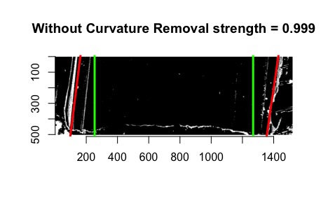
```

```{r, fig.cap="3-dimensional visualization of example bullet br411 with .999 strength threshold", out.width="50%", fig.keep="hold", fig.align='center'}
knitr::include_graphics("images/bullets/Hough_project/br411_3d.png")
```

So either somethin is wrong with `get_mask_hough` or something is funky with the units.

- Also need to think of including a sort of rounding component where lines with slopes that are practically infinite can be viewed as a vertical line

- Compare Hough results with manual identification using score calculations from Kiegan. 

- Write up results in Hough Groove Paper (It's coming I promise)
- Create graphical images to explain line selection method
- Include 2-d and 3-d visualizations of Hough groove area identifications
- Include crosscut visualization and comparison in results

</details>


<details>
<summary>
Charlotte update 09/12/19: 
This week I have been working on obtaining some results for the Phoenix set on Sunny.
As a minor update the unit issues in `get_mask_hough()` are resolved ( I think). Below
is an example of a nice image that has been generated using masks.
</summary>

```{r, fig.cap=" Phoenix Gun1 A-9 B1 Land 4 generated at strength threshold of 0.99, initially did not generate estimates at the 0.999 or 0.995 level", fig.keep="hold",fig.align = "center"}
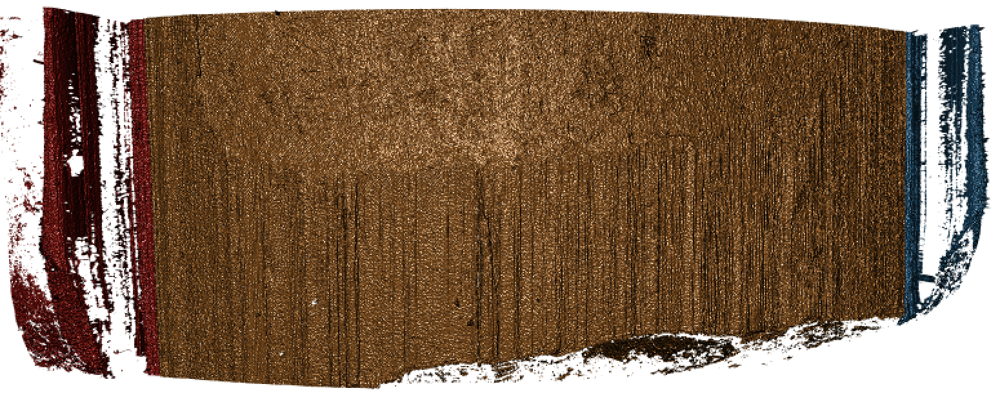
```


However the mask is only as good as the Hough estimates that supports it as shown here (less nice).

```{r, fig.cap=" Phoenix Gun1 F-6 B2 Land 5 generated at strength threshold of 0.9, initially did not generate estimates at the 0.999 or 0.995, or 0.99 level", fig.keep="hold",fig.align = "center"}
knitr::include_graphics("images/bullets/Hough_project/mask_phonix_lessnice.png")
```


Hough crosscut predictions for the Phoenix dataset are now uploaded to the bulletQuality Github in the"results" folder and contains Hough groove estimates at the following five strength levels: 0.999, 0.995, 0.99, 0.95, 0.9. The source and the crosscut estimate are also included in the dataset.


Here are some preliminary results of using Kiegan's area of misidentification method
(thanks Kiegan!) on Hough groove estimates at the strength threshold of 0.999
in comparison to the BCP and Lasso method.


```{r, fig.cap="Left-hand groove area of misidentification log-transformed scores for BCP, Lasso, and Hough", out.width="50%", fig.keep="hold", fig.align='center'}
knitr::include_graphics("images/bullets/Hough_project/preliminary_phoenix_score_results_left.png")
```

```{r, fig.cap="Right-hand groove area of misidentification log-transformed scores for BCP, Lasso, and Hough", out.width="50%", fig.keep="hold", fig.align='center'}

```


These scoresare log transformed to show better separation but it's very clear that for the
left groove both Lasso and BCP are out performing the Hough method in correctly identifying grooves. For the righthand side, scores tend to be more similar however once again,
the Lasso method seems to bo the best job since it has a larger density of low scores
and minimizes high score misidenfitications.

For improvement before next week, I will investigate why there are 47 missing Hough
predictions resulting in a score of 0 in these results and change the parameters in the
`get_grooves_hough()` function to try and generate estimates for some of those missing values.

</details>

<details>

<summary>
Charlotte update 09/19/2019:

This week we are trying to think of a new way for selecting Hough lines for bullet estimates. The previous method for selecting Hough lines was to find lines with x-intercepts at the top and bottom of the lands closest to the lower and upper one sixth of the bullet lands. However this process was highly dependent on score thresholding from the Hough transform which is frustrating when running a large number of bullets since if the right score threshold was not achieved, no result would be produced. So right now I'm working on a way of selecting Hough lines from the normalized Hough scores.
</summary>

To obtain a normalized Hough score I take the x-intercepts of each estimated Hough line generate and find the distance between the x-intercept at the top and the bottom of the land. This should give me the max possible score for each Hough line, rather than calculating based on theta. Then I take the Hough score and divide by this maximum to normalize scores between 0 and 1. Right now I am working on visualizing some of these results but my code is buggy because I'm getting negative values when I try to visualize the process using masks when I shouldn't. Here is an example of a bullet land using the old and new method. Really similar results although it would appear that the new resut places the Hough transform lines further in to interior of the land than the old results. So that's promising?

```{r, fig.cap="Phoenix Gun 1-A9 Bullet 3 Land 1 visualized using current Hough process message", out.width="50%", fig.keep="hold", fig.align='center'}
knitr::include_graphics("images/bullets/Hough_project/phoenix_current_hough_land1.png")
```

```{r, fig.cap="Phoenix Gun 1-A9 Bullet 3 Land 1 visualized using new Hough process message", out.width="50%", fig.keep="hold", fig.align='center'}

```

</details>

<details>

<summary>
Charlotte Update 09/26/2019:

This week is focused on fixing the normalization of the scores for Hough grooves. So that the process can be automatic rather than rely on manual input for the score threshold.
</summary>

Instead of dividing by the geometric distance between the top and bottom intercepts of the bullet image. Now
we only consider Hough lines that actually go through both the top and bottom of the land,
therefore we can normalize each score by dividing the original hough score by the height
of the image and multiplied by the cosine of theta which accounts for the difference
in length of lines with differing angles. As far as selecting normalized scores from
every score possible I found that there is really no visual difference between selecting
the highest normalized Hough score and the other top five. 

```{r, fig.cap="Phoenix Gun 1-A9 Land 4 visualized using new Hough process index one", out.width="50%", fig.keep="hold", fig.align='center'}

```

```{r, fig.cap="Phoenix Gun 1-A9 Land 4 visualized using new Hough process index ten", out.width="50%", fig.keep="hold", fig.align='center'}
knitr::include_graphics("images/bullets/Hough_project/mask_phoenix_index_ten.png")
```

```{r, fig.cap="Phoenix Gun 1-A9 Land 4 visualized using new Hough process index twenty", out.width="50%", fig.keep="hold", fig.align='center'}
knitr::include_graphics("images/bullets/Hough_project/mask_phoenix_index_twenty.png")
```


So for now we will continue to select the highest normalized Hough score to use as our bullet land estimates. After fixing the parameterization of the Hough scores and how we normalize Hough scores,
the 3-dimensional images appear to have improved! Which is great news since no thresholding was necessary. 


```{r, fig.cap= "Hamby Bullet 1 Land 1 visualized using new Hough process", out.width="50%", fig.keep="hold", fig.align='center'}
knitr::include_graphics("images/bullets/Hough_project/mask_hamby_demo_nice.png")
```


Still we run into the problem that our masks are only as good as our estimates,
however even this terrible bullet land appears to have grooves identified somewhat well.

```{r, fig.cap= "Hamby Bullet 1 Land 4 visualized using new Hough process", out.width="50%", fig.keep="hold", fig.align='center'}
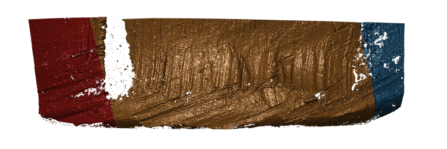
```

A comparison between the two methods finds that generally the new Hough process out-competes
the old one on nearly every bullet land in the Hamby 252 demo set.


```{r, fig.cap= "Crosscut Results Hamby 252 Demo Set Comparison between old and new methods", out.width="50%", fig.keep="hold", fig.align='center'}
knitr::include_graphics("images/bullets/Hough_project/Hamby_demo_crosscuts.png")
```

</details>

Charlotte Update 10/3/2019:

The get_grooves_hough function has changed since last week, it previously slopes were calculated in x which is numerically less stable than a slope in y so for example when we were using the old slopes we had the possibility of dividing by zero which is not good. Changing to the new slope helps eliminate that likelihood. Other than that I am working on writing a grooveFinder vignette. I will be discussing every step of the Hough algorithm at length then demonstrating the function itself on the Hamby44 demo set.

Charlotte Update 10/3/2019:

Finished up the application section of the Hough grooves vignette, need to fill in a few demonstration images that explane how we calculate normalized scores using geometry.

Now working on:
- Finish visualization portion for the vignette
- Expand testing for get_grooves_hough


Charlotte Update 10/17/2019:

- Finally finished up with the vignette, but need to finish one or two more explanation diagrams before first-pass is complete. Having trouble figuring out what the results section should really look like. 

- Need to finish tests for get_grooves_hough. 

<details>

<summary>
Charlotte Update 10/22/2019: For this weeks spotlight I will focus on motivating the reasoning behind the Hough project, a demonstration of mechanics or how the function actually works and maybe a few results.
</summary>

** Project Motivation **

One of the main objectives of the bullet project is to develop algorithms that can match bullet lands based on a set of  features taken from a signature of a single bullet crosscut. In order to to extract these vital signatures we need to fit a robust loess to our crosscut data to remove the curvature inherent in each bullet land. However, there-in lies a problem. If the groove engraved areas are included in our fitting of the robust loess we observe boundary effects that negatively impact the accuracy of the extracted signature. 


So a key goal in the bullet project is to be able to automatically identify the location of bullet grooves. Other projects in pursuit of this goal use a statistical approach to calculating the location of bullet grooves over a single crosscut. However, we are given an entire land scan in the form of an x3p file. By using low-level image algorithms like the Hough transform, we can almost make full utility of the x3p scan by estimating bullet grooves over the entire bullet land image instead of a single crosscut.

** Hough Transform Mechanics**

Hough transforms are essentially a computer algorithm for detecting imperfect incidences of a known class of shapes in an image by finding aligned points. In our case, grooves are typically linear so we want the Hough transform to detect straight lines. Anyone who has looked at a bullet scan knows that the striae are also straight lines, so some image pre-processing is necessary for the algorithm to be able to distinguish between weaker appearing striae and the prominent groove features. Traditionally a gaussian blur and Canny Edge detection are performed to reduce the noise found in a gradient image. However, we have found that using Canny Edge detection is pretty much unnecessary for identifying grooves.

```{r, fig.cap="Bullet land with Canny Edge detection", out.width = "80%", fig.keep="hold", fig.align='center',fig.show='hold'}
knitr::include_graphics(c("images/bullets/Hough_project/canny-land.png"))

```

```{r, fig.cap="Same bullet land but only with gradient magnitude thresholding at the 99th percentile", out.width = "80%", fig.keep = "hold", fig.align="center", fig.show="hold"}
knitr::include_graphics("images/bullets/Hough_project/strong-threshold.png")
```

Utilizing the cleaned up edges in our bullet image, the Hough transform cycles through every pixel of an image in an attempt to find aligned points on an edge. To do so, the Hough transform operates by transforming each point in a line into a different feature space. 

```{r, fig.cap="Diagram of detecting aligned points by looking for intersections in the feature space. Source: 'How Hough Transform Works'- Thales Sehn Körting", out.width = "80%", fig.keep = "hold", fig.align="center", fig.show="hold"}
knitr::include_graphics("images/bullets/Hough_project/feature-space.png")
```

Unfortunately, vertical lines have slopes in x that tend to infinity, which would make storing the results of the Hough transform impossible due to memory storage issues. So the Hough transform parameterizes lines in what is known as the Hessian Normal Form. 
$$ \rho = x\ \cos(\theta) \ + \ y\ \sin(\theta)$$

```{r, fig.cap="Hessian Normal Form of simple line over bullet image", out.width = "80%", fig.keep = "hold", fig.align="center", fig.show="hold"}
knitr::include_graphics("images/bullets/Hough_project/hessian-example.png")
```

```{r, fig.cap="Gif of a Hough Transform Algorithm at work. Source: 'How Hough Transform Works' - Thales Sehn Körting", out.width = "80%", fig.keep = "hold", fig.align="center", fig.show="hold"}
knitr::include_graphics("images/bullets/Hough_project/hough-detect.gif")

```


So the output of the Hough algorithm (in this package we utilize the `hough_lines` function from the `imager` package) is thus a set of $\rho$ and $\theta$ that define the detected lines but also a "score" which indicates the number of points that the algorithm detected for this particular edge estimation. This allows us to use thresholding and other means to select only the strongest candidates as groove estimates. Previous iterations of the `get_hough_grooves` function used a user-specified score thresholding level which made results highly variable dependent on the inputted score threshold. Now we use a normalized "score" to select the strongest line detected in the image. Once our lines for the left-hand and right-hand grooves are selected, we choose to output two functions that define our estimated grooves. To compute the parameters of our Hough line, we first find the location of where each line first intersects the bullet ("xtop") then we use our known "xtop" and our known "height" of the image to calculate "xbottom" using good ol' SOH CAH TOA. 

```{r, fig.cap="Geometrically Calculating 'xbottom'", out.width = "80%", fig.keep = "hold", fig.align="center", fig.show="hold"}
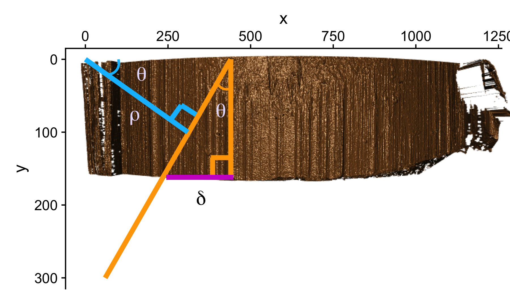

```

The reason for calculating the top and bottom intersection points is so that we can derive a slope for our groove estimate in y. When we learned how to calculate slope in grade school, we were always taught to use "rise over run" which is slope in x. However when the lines are vertical, we are essentially dividing the height of our bullet land by 0 to obtain a slope. So it is numerically more stable to define the slope as $\frac{(\text{xtop - xbottom})}{\text{height}}$ so vertical lines simply have a slope of 0. 

**Implementation **

As far as implementation goes, the function `get_grooves_hough` takes care of the edge detection, Hough algorithm, and line selection. Similar to other methods used for detecting lines, the `get_grooves_hough` function has an adjust parameter that allows the user to specify how far inward they want to "nudge" the groove estimates. The default for the Hough transform is set at 10, however this needs to be experimented with for a variety of different bullets to find appropriate adjust levels.

```{r eval = F}
library(x3ptools)
library(ggplot2)
library(grooveFinder)

x3p <- br411 #built into x3ptools

# Get grooves fit for left and right groove from x3p
grooves <- get_grooves_hough(x3p_to_df(x3p), adjust = 20)

# Find optimized crosscut location, this may take some time
crosscut <- x3p %>% bulletxtrctr::x3p_crosscut_optimize()

# obtain a three dimensional visualization of the groove estimates
a <- get_mask_hough(x3p, grooves)
x3ptools::image_x3p(a)

```

```{r, fig.cap="3d visualization of example bullet", out.width = "80%", fig.keep = "hold", fig.align="center", fig.show="hold"}
knitr::include_graphics("images/bullets/Hough_project/br411_3d.png")

```

** What's Next? **

Fiddling with adjusts and how it affects score. To find an optimal adjust for the Phoenix set, I calculate the default Hough groove estimates then find what the estimate would be for a series of adjusts. Naively I have defined a new parameter called "difference_left" and "difference_right" which is simply the difference between the manually identified groove location at an optimized crosscut and our Hough estimate at a particular adjust level. For now, I have defined any negative values to indicate that the Hough estimate is further from the center than the identified truth. So we want to minimize these negative difference to better get rid of boundary effects. 

```{r, fig.cap="Difference between the left hand Hough estimate and the truth at various adjusts", out.width = "80%", fig.keep = "hold", fig.align="center", fig.show="hold"}


```

```{r, fig.cap="Difference between the righ hand Hough estimate and the truth at various adjusts", out.width = "80%", fig.keep = "hold", fig.align="center", fig.show="hold"}
knitr::include_graphics("images/bullets/Hough_project/adjust-boxplot-right.png")

```
</details>


<details>
<summary>
Charlotte Update 10/31/2019:
This weeks work has been focused on figuring out why we have such extreme mis-identifications for the adjust in the Phoenix set and work on edits for the vignette.
</summary>

So last week I showed a series of boxplots that show the impact of adjust levels on the difference between the manual identification and the groove estimates from the Hough transform. There were a few significant outliers shown in the boxplot. Upon further investigation it seems as if the Hough transform simply does not find a groove on the right side of the land. 

```{r, fig.cap="Adjust level at 100, image of bullet land with a right hand differene of -600", out.width = "80%", fig.keep = "hold", fig.align="center", fig.show="hold"}


```

```{r, fig.cap="What the Hough Transform Sees", out.width = "80%", fig.keep = "hold", fig.align="center", fig.show="hold"}
knitr::include_graphics("images/bullets/Hough_project/hough-estimates-problem-boy.png")

```

I wanted to show scores this time around but I just found out from looking through my saved results that the number of observations produced differs for each adjust level and I don't know why. So there's some major error with my code that I need to work out before proceeding. 

</details>

<details>
<summary>
Charlotte Update 11/07/2019: This week a major bug was discovered in the code! Still working to look at different adjust impacts on score and now the `get_grooves_hough` function takes x3ps and dataframes as inputs.
</summary>

Below are the visualized scores for the left and right hand estimates at various adjust levels.

```{r, fig.cap=" Phoenix Hough Scores for estimates with a series of 10 different adjusts for the Right Groove", out.width="50%", fig.keep="hold", fig.align='center'}
knitr::include_graphics("images/bullets/Hough_project/rh-phoenix-adjust-scores.png")
```


```{r, fig.cap=" Phoenix Hough Scores for estimates with a series of 10 different adjusts for the Left Groove", out.width="50%", fig.keep="hold", fig.align='center'}

```

What we mightn notice the most from these two graphics is that there are still persistent extreme scores despite the adjusts with areas of identification in the thousands. The most extreme of which for the right side happens to have a score of about 5000. Upon taking a look at the specific lands that have problematic scores
they look relatively normal. So then we want to estimate where the Hough transform thinks the grooves are.

```{r, fig.cap="Gun1-U10 Bullet 3 Image Scan", out.width="50%", fig.keep="hold", fig.align='center'}
knitr::include_graphics("images/bullets/Hough_project/phoenix-Gun1-U10.png")
```


Which looks like a pretty regular scan but when we look at the groove estimates we see.

```{r, fig.cap="Gun1-U10 Bullet 3 Crosscut Hough Estimates", out.width="50%", fig.keep="hold", fig.align='center'}
knitr::include_graphics("images/bullets/Hough_project/grooves-est-gunu10.png")
```


Which is bizarre because the Right hand estimate is way too far into the bullet land. However we filter out any lines that are within the middle 2/3rds of the bullet scan, and this estimate is clearly within the middle 2/3rds. So we have discovered a new bug in the code, but at least this bug is consistent.

</details>

<details>

<summary>
Charlotte Update 11/12/2019:
This week I've dug more into the mysterious bug from last week. It turns out that the "bug" was actually a mis-understanding with regards to unit conversion. So get_grooves_hough is working like it should! But our estimates are still not very good.

</summary>

If we take a look at a single crosscut of a problematic bullet like Gun1-U1-Bullet-3-L1. We'll see something different from other lands. This land in particular has a much larger width than other lands found in our dataframe. So consequently the heuristic we used in `get_grooves_hough` which filtered out any lines within the middle two-thirds of the bullet were problematic.

```{r, fig.cap="Crosscut of Gun1-U10-B3-L1 with original Hough heuristic", out.width="50%", fig.keep="hold", fig.align='center'}

```

```{r, fig.cap="Crosscut of Gun1-U10-B3-L1 with middle fifty percent Hough heuristic", out.width="50%", fig.keep="hold", fig.align='center'}

```

Unfortunately even though the middle 50 percent heuristic is better suited for this particular land, the groove estimates are still not good. Let's look at a second problematic case with Fun1-p7-B3-L5. 


```{r, fig.cap="Crosscut of Gun1-P7-B3-L5 with original Hough heuristic", out.width="50%", fig.keep="hold", fig.align='center'}
knitr::include_graphics("images/bullets/Hough_project/p7-original.png")
```

```{r, fig.cap="Crosscut of Gun1-P7-B3-L5 with middle fifty percent Hough heuristic", out.width="50%", fig.keep="hold", fig.align='center'}

```

Which is a marked improvement. Here is a comparion of the three dimensional lands

```{r, fig.cap="3D view of Gun1-P7-B3-L5 with original Hough heuristic", out.width="50%", fig.keep="hold", fig.align='center'}

```

```{r, fig.cap="3D view of Gun1-P7-B3-L5 with original Hough heuristic", out.width="50%", fig.keep="hold", fig.align='center'}

```


</details>

<details>
<summary>
Charlotte Update 12/5/2019: Short update today due to unforseen circumstances but we have resolved most of the issues with some of our previous problem bullets and are starting to compare to other methods.

</summary>

So the previous heuristic used the middle two/thirds as a way of eliminating lines from consideration. But this lead to a problem with scans that were a much larger size than other iterations of the Pheonix study producing poor results.

```{r, fig.cap="Old Cetner Heuristic", out.width="50%", fig.keep="hold", fig.align='center'}
knitr::include_graphics("images/bullets/Hough_project/hough-estimates-problem-boy.png")
```

Now with an optimized adjust and a middle 50% heuristic we get

```{r, fig.cap="New Cetner Heuristic", out.width="50%", fig.keep="hold", fig.align='center'}

```

Which is a much better estimate. Comparing the differences between groove estimates and the manually identified truth for the BCP, Lasso, and Hough methods we receive the following two density plots of differences.

```{r, fig.cap="Left Groove Difference Estimates", out.width="50%", fig.keep="hold", fig.align='center'}
knitr::include_graphics("images/bullets/Hough_project/left-groove-comparison.png")
```

```{r, fig.cap="Right Groove Difference Estimates", out.width="50%", fig.keep="hold", fig.align='center'}

```

</details>

<details>
<summary>
Charlotte Update 02/03/2020:
Teaching this semester which has been fun and challenging in a new way. Had an issue with comparing LASSO Results between ones found by myself in the grooveFinder package and results that had been previously saved by Kiegan. Now I'm investigating optimal adjusts for the Hamby44 set and will be working on the summary report.
</summary>

A while back, I ran into an issue where the estimated grooves using the Lasso-full method did not match Kiegan's previously saved results. It turns out that the lasso function in grooveFinder does not have a built in adjust parameter so the results are different from those create from the bulletxtrctr version. So accounting for the adjust, I re-ran results and obtained something suprising. I know that six additional scans were uploaded to Sunny since the time Kiegan ran the lasso results. However, those were removed for the sake of consistency. 

```{r, fig.cap="Left Groove Difference Estimates", out.width="50%", fig.keep="hold", fig.align='center'}
knitr::include_graphics("images/bullets/Hough_project/left-lasso-comparison.png")
```

```{r, fig.cap="Right Groove Difference Estimates", out.width="50%", fig.keep="hold", fig.align='center'}
knitr::include_graphics("images/bullets/Hough_project/right-lasso-comparison.png")
```


So it leaves the question, why are these results ever so slightly different and  which results do we use to compare to Hough even though they're largely consistent. Other than the LASSO question I have also run the Hough results on the Hamby 44 set to find the optimal adjust. One interesting observation is that there is a set of nine observations where no valid crosscut can be produced. 

```{r, out.width="50%", fig.keep="hold", fig.align='center'}
knitr::include_graphics("images/bullets/Hough_project/hamby-44-barrel-two-land-one.png")
```
</details>

<details>
<summary>
Charlotte Update 03-30-20: Long time no see guys! Hope everyone is well! Last time, the Hough project had kind of stagnated as results fitted with an optimal adjust were not very competitive against other methods. To improve results we have imputed NA values in our bullet land. 
</summary>

**Where we were**


```{r, fig.cap="Left Groove Difference Estimates", out.width="50%", fig.keep="hold", fig.align='center'}
knitr::include_graphics("images/bullets/Hough_project/left-groove-comparison.png")
```

```{r, fig.cap="Right Groove Difference Estimates", out.width="50%", fig.keep="hold", fig.align='center'}

```


We had just instituted the optimal adjust, as well as the middle 50\% heuristic since we had some relatively large bullet scans in the Houston set. However the Hough transform still can't really compete with the LASSO method which is pretty dissapointing. 

**Where we are**

Before returning to discussing the Hough Process, we were interested in creating a mask that can pick up striae and give us a better understanding of where grooves are located. We create a rather naive way of finding striae by taking the difference in the x and y direction between each element of the surface matrix of our bullet land. We then determine what is a large enough difference in heights to be coloured in our mask by first finding the distribution of differences between different sets of our bullets. One thing that's interesting to notice is that the distribution of differences is essentially the same for the Phoenix, Hamby 44, and Houston set of scans. We might expect the Houston scan to have a different distribution because of it's deep grooves but it appears that this is some sort of scanning effect. 

```{r, fig.cap="Distribution of differences in the x-direction for the Phoenix Set", out.width="50%", fig.keep="hold", fig.align='center'}

```


Based on this distribution we find that an absolute difference of about .2 would be considered to be a large difference since only about 10 \% of all observed differences are more extreme than this threshold. 

```{r, fig.cap="Gun 1-A9 Bullet 1 Land 1 Difference Mask", out.width="50%", fig.keep="hold", fig.align='center'}
knitr::include_graphics("images/bullets/Hough_project/phoenix-a9-b1-l1-difference-mask.png")
```


So this mask is interesting since it successfully identifies some Striae and breakoff from the bullet scan. But it's not perfect. Some notable aspects of the grooves are not in fact coloured and on closer inspection this may be due to the presence of NAs. To combat this issue we have decided to impute the NA values by replacing them with 5\% greater than the maximum height recorded in the surface matrix. Ideally this will give us a better view of our grooves and maybe some of the breakoff. 

```{r, fig.cap="Distribution of differences in the x-direction for the Phoenix Set with imputed NAs", out.width="50%", fig.keep="hold", fig.align='center'}

```


For all sets what is considered a large difference has now changed from an absolute difference of .2 to an absolute difference of .15. 


```{r, fig.cap="Gun 1-M2 Bullet 2 Land 2 NA-imputed Mask of Differences", out.width="50%", fig.keep="hold", fig.align='center'}

```

With these NAs imputed we see a very clear delineation of grooves and breakoff from striae based on the NA. This is a very promising result and we decided to apply the Hough transform process to the imputed lands. Because the imputed NAs so dramatically change the bullet lands, we re-calculated the optimal adjust for this bullet set and then compared the new scores for the NA-imputed bullet lands to the older results. 


```{r, fig.cap="Left-Hand groove score comparison between old Hough method and the new method on na-imputed bullet lands", out.width="50%", fig.keep="hold", fig.align='center'}
knitr::include_graphics("images/bullets/Hough_project/left-hand-groove-score-comparison-na-imputed.png")
```


```{r, fig.cap="Right-Hand groove score comparison between old Hough method and the new method on na-imputed bullet lands", out.width="50%", fig.keep="hold", fig.align='center'}

```

</details>

<details>
<summary>
Charlotte Update 04/20/20:

Fairly quick update from me today, I'm not really making new progress on results, I'm mainly just writing up what I have done and finding good and bad examples of Hough estimates. I'm really struggling figuring out what is and isn't important for Hough background details.
</summary>

```{r, fig.cap="Right-Hand differences distribution comparison", out.width="50%", fig.keep="hold", fig.align='center'}

```

```{r, fig.cap="Left-Hand differences distribution comparison", out.width="50%", fig.keep="hold", fig.align='center'}
knitr::include_graphics("images/bullets/Hough_project/lh-difference-distribution-with-lasso.png")
```
</details>


##### LASSO Method  

A paper is in preparation for submission to Forensic Science International describing this method (`get_grooves_lassofull` in `grooveFinder`), as well as the Bayesian changepoint method (`get_grooves_bcp`).  

##### Robust LOESS Method  

A paper submitted to the Journal of Forensic Science is waiting for peer review response to the first round of revisions.  


#### Bullet Land Comparisons Pipeline

Most data analysis processes can be thought of as a data analysis "pipeline". This process can involve data collection, decisions about data cleaning, data transformation or reduction, and feature engineering. For example, consider the general process below:

  

In the case of the bullet project, we have a pipeline which starts with having two physical bullet LEAs and ends with a quantitative result, a random forest similarity score. Our pipeline could be described (roughly) as something like this:

  

To make this a little easier to see, we can look at how a 3D scan is processed into a 2D signature:  


Now, something important to consider is whether each of these "data decisions" has an impact on the quantitative result (here, a similarity score between two LEA signatures). Consider a simple set of decisions we could make in our bullet pipeline:  

  

If we have a pair of signatures, we could theoretically end up with 16 different similarity scores depending on the decisions we make at each point. That is also assuming that both signatures were processed in the same way at each point.   

This year, I'll be studying our bullet land "pipeline" here at CSAFE, as well as pipelines that are a little different than ours (e.g., @chu_jfs). There are a few major goals I am working towards: 

1. Quantifying the uncertainty of our RF similarity scores based on data decisions  
2. Comparing reproducibility/robustness of differing bullet analysis approaches  
- @aoas vs. @chu_jfs, for example
- Crosscuts: method 1 vs. alternate? Crosscut parameter tuning? 
- Groove methods  
- Original RF vs. updated/retrained/re-engineering 
3. Reproducibility/robustness of different approaches when we consider data COLLECTION.   

The code in `bulletxtrctr` is already really well set up as a data "pipeline", so now we are conceptualizing the best way to wrap the pipeline and keep track of what decisions are made along the way. 

The current work underway on this project is focused on developing a package in `R` that will assist users in keeping track of data science projects. We believe it will be particularly useful for those developing a data science process and tools to complete that process. This is most obviously the case for a lot of the ongoing projects at CSAFE; for example: 

1. The `bulletverse`, packages in development include `x3ptools`, `bulletxtrctr`, and `grooveFinder`. 
- Methods are worked on at multiple stages (e.g., groove ID methods, work on modeling bullet scores)
- Multiple people are on the project and may make changes to things that impact other stages
- We want to keep track of when something (e.g., a function, model object, parameters) changes that will impact our analyses/scripts.
2. `handwriter`, a package which processes handwritten documents and extracts data features to be used in modeling 
- If processing code changes, how does that impact the features that are extracted? 
- Can you check entire package for changes to see if you need to re-run processing?
3. `ShoeScrubR`, `shoeprintr` packages... etc. 

Almost all of the methods developed here at CSAFE use non-traditional data that requires processing and feature generation before modeling/analysis can begin. These processes are continually improved as projects move forward, and thus as changes happen we need to be able to assess: 

- The impact of differing processing approaches and how that changes results  
- Whether results need to be re-run after changes are made in a package (time saver!)  
- Confidence in reporting results: how much uncertainty is introduced by manipulating the data in a certain way?  


Earlier this year, we designed and collected a bullet scanning variability study of 9 bullets. I'm working on formally modeling the variability at the signature level, taking two major approaches:   

1. Subsampling and assuming independence; 
2. Directly modeling out the mean structure
- Ignoring peak/valley dependence
- Using time series/spatial dependence modeling
- Using a Bayesian shrinkage prior (w/help from Amy!)


Results for Method 1, the subsampling, looks something like this:   

  

We are also investigating the variability of random forest scores, using pairs of signatures. The current process for taking a set of signatures and completing pairwise comparisons on each of them actually completes many comparisons twice, which has two impacts:    

1. It takes up more computational time and memory than we really need it to
2. It has the potential to make our variance component estimates inaccurate - we double-count a bunch of comparisons!   


Over the summer I made a function to "fix" this, to address the estimation problem in my variability study. The `bulletxtrctr` pipeline calls for using `expand.grid`. My new function compares pairs by creating a `pairing_id` variable and ensuring no `pairing_id` is duplicated. This is the resulting set of comparisons: 

  

The changes to our results are minor, but it is an important detail when modeling things.  

<p class="new"> Two papers in progress! Groove ID paper #1 needs another round of minor revisions (hopefully will be accepted soon!), Groove ID paper #2 is waiting for advisor comments. </p> 

<p class="new"> Sometimes, data collection goes awry... </p>  

  

<p class="new"> I am in the process of documenting all the data issues and double-checking everything. We are adding more operators (and another set of bullets) to our variability study! </p>    


<p class="new"> I am polishing two full chapters of the book this week. Starting to write up the full variability study (as a dissertation chapter). Writing, writing, writing! </p>  


Update on data collection:  

We are in "Phase 2" of data collection, shown below as the purple numbers:   

  

**March 23, 2020 Spotlight Update:**  

We have completed Phase 2 of Variability Study Data Collection!!! 


   

This means I have been doing tons of data processing!  

Total scans: 

**Barrel Blue** *(LAPD)*: 900  
**Barrel Pink** *(Houston)*: 1386  
**Barrel Orange** *(Hamby)*: 1386  

Unfortunately, things aren't **perfectly** balanced, because we sometimes see things like this:  

  

But, we now have variability data for LAPD bullets!   

   

So, we are at the point of fitting a model and getting a "final" set of results for publication (/dissertation). Recently, we have been looking at the correct way to model things at the signature level. For a traditional Gauge Repeatability and Reproducibility (Gauge R&R) study, the model would look something like the following: n

$$z_{BLijkmn} = \mu_{BLi} + \beta_{j} + \omega_{k} + \gamma_{m} + \beta\omega_{jk} + \beta\gamma_{jm} + \omega\gamma_{km} + \beta\omega\gamma_{jkm} + \epsilon_{BLijkmn}$$ 

for location $i$, bullet $j$, operator $k$, machine $m$, and repetition $n$. $\mu_{BLi}$ is a fixed mean for location $i$ on barrel-land $BL$. We assume all other effects are random and are normally distributed. **Also note that we are using a subsampling model, so locations are spaced out to reduce location dependence.**  

However, this model often results in *singularities*. Singularities can happen for several reasons:  

1. There is not enough data to estimate parameters  
2. The model is overspecified  
3. There are not enough grouping levels for a random effect  
4. The effects are too close to zero and optimization just pushes them to 0.  

These reasons are relatively intertwined with one another. For example, a model that is overspecified is often one where there is either not enough data or not enough grouping levels. A singularity essentially means that the matrix has become rank deficient.  

Due to the fact that our study was specifically designed to estimate effects of a Gauge R&R study, we wanted to mostly maintain the traditional Gauge R&R model framework. We also thought a LOT about what is happening underlying in our model, and decided to include location as an interaction with every other factor. Therefore, we won't simply have a "bullet effect", we will have a "bullet by location" effect:  

$$z_{BLijkmn} = \mu + \alpha_{BLi} + \alpha\beta_{BLij} + \alpha\omega_{BLik} + \alpha\gamma_{BLim} + \alpha\beta\omega_{BLijk} + \alpha\beta\gamma_{BLijm}$$ 
$$ + \alpha\omega\gamma_{BLikm} + \alpha\beta\omega\gamma_{BLijkm} + \epsilon_{BLijkmn}$$ 
Where $alpha_{BLi}$ is a fixed location effect, but our other random effects are now split into "effect-by-location" groups.  

We also some simulation studies on our data with this model in order to understand optimization, singularities, and how our estimates of effects may be affected by singularities that exist in the model. All of the effects in the following image are interacted with location; for simplicity's sake they have been labelled without location.  

We simulated data in the following way:  

1. Extract fixed means $\mu$ and $\alpha_{BLi}$ for a particular land.  
2. Identify a set of "target" random effects to see whether we can estimate them.  
3. For each run of the simulation, simulate a data set by doing the following:   
- Simulate a set of random effect "true" values for each effect  
- e.g., for $\alpha\beta_{BLij}$, the bullet-by-location effect, if we have 20 locations and 3 bullets, we simulate 60 values from a $N(0, \sigma_{BLij})$ distribution.
- Each group is then assigned one value from that set of simulated values.  
- Also do this for "residual" error for every single data point.  
- After simulating a group effect for each "data point", we add the fixed and simulated random effects together to create a simulated data point.  
4. Using the simulated data, fit a model with our given specification; save the resulting estimates and whether the model is singular or not.  


Discussion points:  

1. We (I) still need to get a handle on correctly estimating an upper bound or CI for when we have a singular model whose effect is estimated at 0.  
2. Model and study design are very important!   
3. When effects are small, they are difficult to estimate correctly; we will most likely overestimate them.  


### Cartridge Cases

#### Congruent Matching Cells (CMC) algorithm for comparing cartridge case breech face impressions

<details>
<summary>
Joe 9/5/19 Update: Explanation of missing value problem when calculating cross-correlations and some attempted fixes.
</summary>
Dealing with missing values in the x3p scans continues to be an issue. The Fast Fourier Transform method for calculating cross-correlation can't handle missing data in an image, so we've attempted a few "fixes" that haven't necessarily turned out as well as expected. One idea we had was to replace the NA values in a cell with the average pixel value. However, this is artificially introducing a signal where before there was none. This can (and demonstrably has) led to inflated/incorrect correlations between cells that shouldn't have much at all in common. Unfortunately, this may be the only solution if we still wish to adhere to the CMC algorithm as described in Song et al. (2015). One improvement that I've implemented is to "crop out" the rows and columns of an image that only contain NAs. This at least means that we've weakened the strength of the artificial signal relative to the breechface's signal.

Below is a series of images that illustrate how we might compare a cell in one image to a region of another image.

```{r, fig.cap="Comparing a cell in image 1 to a larger region in image 2. We wish to find the translations of the image 1 cell that yield the highest correlation within the image 2 region.", out.width="50%", fig.keep="hold", fig.align='center'}
knitr::include_graphics("images/cartridge_cases/joe_oldImages/im1_im2_cellComparison.png")
```

For the sake of an example, let's focus on the blue outlined cell in image 1. Our goal is to use the image 1 cell to "search" a corresponding larger region in image 2 for the horizontal/vertical translations needed to produce the highest correlation. Below is a zoomed-in version of the blue outlined image 1 cell on the left and the larger image 2 region (approximately: I made the gridded image above by-hand outside of R while the images below are from R). The image 1 cell may look larger than the image 2 region, but we can see from the axes that the image 2 region is indeed larger. Any white pixels in the two images are NA values that need to be dealt with in some way before we can use FFTs to calculate the cross-correlation.

```{r, fig.cap="(Left) A cell from image 1. (Right) A region from image 2 centered in the same location as the image 1 cell, yet quadruple the area.", out.width="50%", fig.keep="hold", fig.align='center',fig.show='hold'}
knitr::include_graphics(c("images/cartridge_cases/joe_oldImages/im1_split.png","images/cartridge_cases/joe_oldImages/im2_split.png"))
```

As already discussed above, one "solution" is to replace the NA values with the average pixel value of each image. However, to avoid creating a stronger artificial signal than necessary, we can crop-out the NA rows and columns from the two images above. Below is the cropped version of the two images. The cropping doesn't produce signficantly different images in this case, but you could imagine other examples in which a cell has captured only small amount of breechface in the corner. Such examples are fairly common and cropping signficantly changes the resulting correlation values.

```{r, eval=FALSE,fig.cap="The same images as above after cropping NA rows/columns.", out.width="50%", fig.keep="hold", fig.align='center',fig.show='hold'}
knitr::include_graphics(c("images/cartridge_cases/im1_splitFilteredCropped.png","images/cartridge_cases/im2_splitFilteredCropped.png"))
```

The last step before calculating correlation for these cells is to replace the remaining NAs with the average pixel value. This is shown below.

```{r, fig.cap="The NA-cropped images with remaining NAs replaced with the image's average pixel values.", out.width="50%", fig.keep="hold", fig.align='center',fig.show='hold'}
knitr::include_graphics(c("images/cartridge_cases/joe_oldImages/im1_splitShifted.png","images/cartridge_cases/joe_oldImages/im2_splitShifted.png"))
```

The cross-correlation is then calculated between these two images via a standard fast fourier transform process (see [Cross-Correlation Theorem](http://mathworld.wolfram.com/Cross-CorrelationTheorem.html)). The benefit of using such a process is that (as the name suggests) it's faster than calculating the raw correlation between the two images. Also, the translations that produce the highest correlation between the image 1 cell and the image 2 region fall out of the calculation for free.

This pre-processing/cross-correlation calculation procedure is repeated for every cell in image 1 that contains breech face impression. Because it is not valid to assume that the two images are rotationally aligned by default, we perform the same procedure repeatedly while rotating image 2. Currently, we perform a "rough" grid search of $\theta \in [-177.5,180]$ by increments of $2.5^{\circ}$. Theoretically, the final results tell us how we need to horizontally/vertically translate and rotate the two images to be correctly aligned.
</details>

#### Congruent Matching Tori: a promising solution to the missing value problem

<details>
<summary>
Joe 9/5/19 Update (cont'd): A brief introduction to a congruent matching "tori" method that may provide a better solution to the missing value problem.
</summary>

As discussed above, dealing with missing values is provign to be a pain. The good news is that the currently-implemented CMC as described above yields results very similar to those published in Song et al. (2015) that originally describes that CMC algorithm. While our results seem to agree with currently published results, it would be nice if we could avoid needing to artifically replace missing values. We can do so if, rather than breaking up the circular breech face impression scans into disjoint squares, we break up the breech face impression into donut-shaped regions containing only breech face impression. Below is an example of such a toroidal region.

```{r, fig.cap="(Left) The original breech face impression scan image. (Right) A donut-shaped region cut out of the original image.", out.width="50%", fig.keep="hold", fig.align='center',fig.show='hold'}
knitr::include_graphics(c("images/cartridge_cases/joe_oldImages/im1_original.png","images/cartridge_cases/joe_oldImages/im1_toroidalRegion.png"))
```

By comparing such regions instead of the square cells, we would presumably only need to fill in a few missing value "holes" in the breech face impression scan rather than completely replacing a non-existent signal with an artificial one. In the near-future, I hope to finish up the pre-processing needed for this Congruent Matching Tori method by performing a polar transformation on these images to make them into strips that can easily be compared via an FFT.
</details>

<details>
<summary>
Joe 9/12/19 Update: Explanation of some of the pre-processing steps needed to make the CMC work as described in [Tong et al. (2015)](https://www.ncbi.nlm.nih.gov/pmc/articles/PMC4730689/)
</summary>

Before carving out toroidal regions from the two images we wish to compare, a fair amount of pre-processing needs to be completed. For example, the scans we work with begin with a considerable amount of auxiliary information, for example the firing pin impression, that we don't want to use in our comparisons. This isn't to say that firing pin impressions aren't useful to determine a match between two cartridge cases. In fact there is quite a lot of published research on how to compare two firing pin impressions. Rather, it is common practice to compare breech face impressions and firing pin impressions separately since it is difficult to scan both simultaneously. Thus, there are regions of a breech face impression scan that we want to remove so that the breech face impressions are more easily comparable. Below is an example of two breech face impression scans before processing.

```{r, fig.cap="Two cartridge case scans before pre-processing.", out.width="50%", fig.keep="hold", fig.align='center',fig.show='hold'}
knitr::include_graphics(c("images/cartridge_cases/joe_oldImages/im1_fullScan.png","images/cartridge_cases/joe_oldImages/im2_fullScan.png"))
```

There are a variety of techniques to segment an image into various parts. In image processing, common techniques are the Canny edge detector, which identifies edges of shapes in an image using image gradient techniques, and the Hough Transform, which can detect a variety of geometrical shapes in an image. The Hough Transform is what is used to segment the cartridge case images used in the previous section. However, we've found that the use of a Hough Transform doesn't extract the "breech face signal" from an image as other techniques. Namely, the breech face can be effectively extracted using the RANSAC (Random sample consensus) method that iteratively fits a plane to a set of data until it settles upon a consensus-based "bulk" of the data. In the case of these cartridge case scans, the bulk of the data should predominantely be distributed around the mode height value. That is, the breech face impression. Once we've fit this plane to the breech face impression, we can extract the residuals of the fit to better accentuate the markings left in the cartridge case base by a firearm's breech face. Below is an example of the residuals left after fitting a RANSAC plane to two cartridge case scans above. In the example below, we grab any residuals less than 20 microns in magnitude.

```{r, fig.cap="Residual values of a RANSAC plane fit to the two cartridge case scans shown above.", out.width="50%", fig.keep="hold", fig.align='center',fig.show='hold'}
knitr::include_graphics(c("images/cartridge_cases/joe_oldImages/im1_ransacResiduals.png","images/cartridge_cases/joe_oldImages/im2_ransacResiduals.png"))
```

Although these two images are of two different cartridge cases, you can hopefully see that one looks very much like a rotated version of the other. These two cartridge case scans are in fact fired from the same gun (known matches), so it's a good thing that they look so similar. We've now removed quite a bit of the unwanted regions of the original scans. However, there are still some areas of the image (e.g., the faint circular region of pixels in the center of the breech face scan) that just so happened to be close to the fitted plane and thus were brought along in the residual extraction. There are a few ways that we can clean up these last few areas. One is to use two Hough Transforms to detect the inner and outer circles of the breech face impression and filter out any pixels outside of the region between these two circles. The biggest issue with using a Hough Transform is that it must be given the radius of the circle that it is to search for in the image as an argument. That is, we need to know the radius of the breech face impression that we haven't yet identified in order to identify the breech face impression. Instead, we can dilate/erode (or vice-versa) the pixels in the image to remove the remaining "speckle" in the image. Below is an example of of the breech face impressions cleaned via a dilation/erosion procedure.

```{r, fig.cap="The selected breech face impressions based on dilation and erosion.", out.width="50%", fig.keep="hold", fig.align='center',fig.show='hold'}
knitr::include_graphics(c("images/cartridge_cases/joe_oldImages/im1_maskFiltered.png","images/cartridge_cases/joe_oldImages/im2_maskFiltered.png"))
```

The final step in the pre-processing is to align the two images in some consistent fashion. Luckily, the firing pin impression ring that's left after performing the above dilation/erosion provides us with some idea of how to align the breech face impressions. The location of the firing ring impression in the breech face impression provides us with an indicator of where the cartridge case was located relative to the firing pin when it was sitting in the barrel. So aligning two cartridge cases so that their firing pin impression rings align will ensure that, at the very least, the breech face impression left on the cartridge case is horizontally/vertically aligned if not rotationally aligned.

</details>

<details>
<summary>
Joe 9/18/19 Update: Continuation of pre-process explanation with a discussion on how we can automatically detect the firing pin impression radius in an image.
</summary>
To automatically detect the radius of a given breech face impression, we can count the number of non-NA pixels in each row. If we were to imagine scanning down an image and counting the number of non-NA pixels in each row, then this count would obviously start to increase the moment we hit the top of the breech face impression. Because the breech face impressions are circular, the count would continue to increase the further down the image we scan. That is, until we hit the firing pin impression circle. At this point, because the firing pin impression circle consists of NAs, we would expect the non-NA pixel count to dip. This increasing followed by decreasing behavior in the non-NA pixel count constitutes a local maximum. We can use this local maximum of the non-NA pixel count to identify the beginning of the firing pin impression circle. Similarly, we would expect the non-NA pixel count to reach another local maximum once we hit the end of the firing pin impression circle. It's then a simple subtraction of the two row indices containing these local maxima to determine an estimate for the diameter of the firing pin impression circle. 

We can see below an example of the non-NA pixel row sums plotted against the row indices (starting from the top of the image and moving down). You can hopefully see that the raw row sums are rather "noisy". As such, we can pass a moving average smoother over the row sum values so that the local maxima are easier to identify. This may not be the most robust way to determine the local maxima. I hope to investigate the use of b-splines fit over the row sum values to see if these would be more effective at finding local maxima

```{r, fig.cap="Non-NA pixel row counts and moving average-smoothed row count values plotted against row index.", out.width="50%", fig.keep="hold", fig.align='center',fig.show='hold'}
knitr::include_graphics(c("images/cartridge_cases/joe_oldImages/nonNA_rowSums.png"))
```

However, because firing pin impression circles have somewhat perforated edges, performing one pass through the image may not yield a particularly accurate estimate. As such, we can repeat the process of finding the distance between local maxima for both the row and column non-NA pixel counts. We can also rotate the image by a few degrees and perform the same process. I am currently rotating the image 0, 15, 30, 45, 60, and 75 degrees and calculating row and column diameter estimates per rotation. Obviously we can apply whatever aggregation function we desire to these estimates to determine a final estimate. Below we see what the Hough Transform selects as the breech face for 4 different radii values. In particular, for circles of radius 210, 213, 216, and 219.

```{r, fig.cap="Hough Transform selected circles (red) of radius (1) 210, (2) 213, (3) 216, and (4) 219.", out.width="50%", fig.keep="hold", fig.align='center',fig.show='hold'}
knitr::include_graphics(c("images/cartridge_cases/joe_oldImages/houghTransformGridSearch.png"))
```
</details>

<details>
<summary>
Joe 9/25/18 Update: Dilation and erosion of the breech face impression image seems to be fairly effective, but require some parameter tuning based on the firing pin impression we're considering (e.g., effective erosion in one image may have a different, adverse effect in another image). The watershed algorithm appears to be a promising alternative to selecting the breech face impression out of an image containing extra "minutiae".
</summary>

When trying to select the breech face impression out of an image such as the one below (this is a slice of the original scan based on the RANSAC method-selected breech face impression z-value), we're really just interesting in obtaining a yes/no answer for each pixel to the question: "Are you a part of the breech face impression?" As such, rather than looking at the considering the raw pixel values, we can binarize the image to a 1/0 (equivalently, non-NA/NA) pixel representation. Such a representation is below.

```{r, fig.cap="(Left) Residual values of a RANSAC plane fit to a cartridge case scan. (Right) Binarized non-NA/NA image for segmentation.", out.width="50%", fig.keep="hold", fig.align='center',fig.show='hold'}
knitr::include_graphics(c("images/cartridge_cases/joe_oldImages/im1_ransacResiduals.png","images/cartridge_cases/joe_oldImages/breechFaceIndicator.png"))
```

Using this "indicator image", the beginning/end of the breech face impression should be much more obvious to, say, a Canny edge detector. Below is the output of such a Canny edge detector.

```{r, fig.cap="The edges of the binarized image above via a Canny edge detector. ", out.width="50%", fig.keep="hold", fig.align='center',fig.show='hold'}
knitr::include_graphics(c("images/cartridge_cases/joe_oldImages/watershedPriorityMap.png"))
```

From here, we can use a Watershed image segmentation procedure to identify various regions within this image. The Watershed algorithm needs to be given a set of pixel locations that the user believes to be within distinct regions of the image. With these "seed" pixels, the algorithm then searches neighboring pixels and attempts to identify them as within/without the same region. Almost as if a water source turned on at the given seed pixel and water began to spread to as many neighboring pixels as it could. The water should "stop" at the black lines in the image above, thus defining the boundary of a seed pixel's region. An example of the above image post-segmentation is given below. The 5 seed pixels I used were the 4 corners and center of the image. As we can, the watershed algorithm "overflowed" into the breech face impression, but segmented the firing pin impression circle from the rest of the image. Because most of the minutiae that we want to remove is in within this firing pin impression circle, this is not a problem for our purposes. With 5 seed images, there are technically 5 segments represented in the image below (although it's hard to see where the outer segments begin/end). So as shown below, we can just binarize the segments as being a part of the firing pin impression circle or not.

```{r, fig.cap="(Left) Watershed segmentation of the Canny edge image above. (Right) The firing pin impression circle binarization of the Watershed segmentation image.", fig.keep="hold", fig.align='center',fig.show='hold'}
knitr::include_graphics(c("images/cartridge_cases/joe_oldImages/watershedFiringPin_segments.png","images/cartridge_cases/joe_oldImages/watershedFiringPin_binarized.png"))
```

Finally, now that we've identified where the firing pin impression circle is in the original image, we can simply replace any pixel values within this circle with NAs. The final filtered image is shown below.

```{r, fig.cap="Final filtered image.", fig.keep="hold", fig.align='center',fig.show='hold'}
knitr::include_graphics(c("images/cartridge_cases/joe_oldImages/watershedFinalFiltered.png"))
```

</details>

<details>
<summary>
Joe 10/3/18 Update: Determined a fairly computationally intensive yet (seemingly) effective way to find the firing pin impression circle in an image using a grid search of possible radius values. I will now start putting together a package for easy access. I'm not yet sure what to call the package, so any ideas are welcomed
</summary>

We can find a rough estimate for the firing pin radius estimate using a variety of methods. The one that I've found to be fairly consistent in the few examples I've worked with (detailed in the in the 9/18/19 update) is by counting the number of non-NA pixels in each row/column of the image and identifying the distance between the two largest local maxima in this non-NA count sequence. We can pass a grid of radius values centered on this estimate to a Hough Transform and determine which radius picks out the firing pin impression circle most effectively. The difficulty is in how we quantify "effective" using the output of the Hough Transform. Below you can see the original image including the "minutiae" within the firing pin impression circle that we hope to filter out. You can also see the result of filtering out the firing pin impression circle based on the original radius estimate (210 pixels) obtained from the "local maxima" method.

```{r, fig.cap="(Left) Original breech face impression image. (Right) The breech face impression image after filtering based on a Hough Transform-selected circle of radius 210 pixels.", fig.keep="hold", fig.align='center',fig.show='hold'}
knitr::include_graphics(c("images/cartridge_cases/joe_oldImages/breechFaceIndicator.png",
                          "images/cartridge_cases/joe_oldImages/firingPinImpressionFiltered_radius210.png"))
```

As already discussed, we can test a variety of radius values around the 210 estimate to determine which is best. Below is a gif animating the result of filtering based on a Hough Transform for radius values ranging from 190 to 230. Although a radius of 210 does a decent job of filtering out the minutiae, a slightly smaller radius may be preferred as larger circles tend to cut into the breech face impression. We obviously want to retain as much of the breech face impression as possible for our later analysis.

```{r, fig.cap="Gif showing the result of filtering based on Hough Transform circles of various radii. ", fig.keep="hold", fig.align='center',fig.show='hold'}
knitr::include_graphics("images/cartridge_cases/joe_oldImages/houghTransformFilter.gif")
```

Using the output of the Hough Transform-selected circles shown above we would like to determine an optimal radius with which to filter out the firing pin impression circle. I explored a few ways of quantifying how "effective" a given radius is at filtering out the firing pin impression minutiae while simulataneously retaining as much of the breech face impression surface as possible. For example, it seemed logical to me to count the number of non-NA pixels we would be throwing out if we filtered based on a particular radius value. As you can see from the gif above, larger radii end up chewing into the breech face impression surface while smaller radii appear to sort of bounce around inside of the firing pin impression circle. We may be able to look at the count of filtered non-NA pixel values for each radius and determine a threshold in which the circles become large enough to start chewing into the breech face impression. Unfortunately, that is not the case. You can see from the plot below on the left that the number of filtered non-NA pixels increased fairly steadily. There isn't an obvious location along the curve signalling when the circles are getting to be too large (the differences between successive counts are also shown). Since that metric didn't end up being fruitful, I had to explore alternatives. One alternative that isn't obvious from just visualizing which pixels are filtered by each radius is called the "Hough score" which essentially quantifies how confident the Hough Transform is that it indeed found the circle that it was told to find in the image. The plot on the right below shows the top Hough scores for each radius value. We can see that there is some variability depending on the radius value. However, there are a range of radius values starting at 210 in which the Hough Transform is consistently rather confident in its circle detection. In fact, we can see from the gif above that radius values between 201 and 206 indeed do a good job of filtering out the firing pin impression circle. Currently, I am basing my final firing pin radius estimate on the radius value in the middle of the longest-running sequence of high-confidence radius values. In both example breech face impressions that I've been working with (same type, fired from the same firearm), this final estimate ended up being 203. This is obviously promising, but I would like to spend time to verify that my current method is generalizable to other cartridge case scans.

```{r, fig.cap="(Left) The number of non-NA pixels filtered out by the Hough Transform-selected circles for different radius values. (Right) The Hough score curve used to determine the firing pin radius estimate.", fig.keep="hold", fig.align='center',fig.show='hold'}
knitr::include_graphics(c("images/cartridge_cases/joe_oldImages/nonNA_filteredPixelCounts.png",
                          "images/cartridge_cases/joe_oldImages/houghScorePlot.png"))
```
</details>

<details>
<summary>
Joe 10/10/18 Update: Discuss how the algorithm generalizes to different pairs of cartridge cases. Based on a sample of 5 known-match pairs, it appears that the algorithm does do a good job of deciding on a rotation value to make one breech face impression match up well with the other. 
</summary>

Now that the skeleton of the algorithm has, for the most part, been fleshed-out, we can finally start testing it on different pairs of breech face impressions.

<details>
<summary>
**For the sake of an example, I have 5 known-match breech face impressions shown below. In the state shown, the scans have been pre-processed to the point that we can visualy see when a pair matches. Hopefully, the scans should look to you as if one is just a rotated version of the other.**
</summary>

```{r, fig.cap=" ",out.width="50%",fig.keep="hold", fig.align='center',fig.show='hold'}
knitr::include_graphics(c("images/cartridge_cases/joe_oldImages/fadul1_im1_beforeRotation.png",
                          "images/cartridge_cases/joe_oldImages/fadul1_im2_beforeRotation.png"))

knitr::include_graphics(c("images/cartridge_cases/joe_oldImages/fadul2_im1_beforeRotation.png",
                          "images/cartridge_cases/joe_oldImages/fadul2_im2_beforeRotation.png"))

knitr::include_graphics(c("images/cartridge_cases/joe_oldImages/fadul3_im1_beforeRotation.png",
                          "images/cartridge_cases/joe_oldImages/fadul3_im2_beforeRotation.png"))

knitr::include_graphics(c("images/cartridge_cases/joe_oldImages/fadul4_im1_beforeRotation.png",
                          "images/cartridge_cases/joe_oldImages/fadul4_im2_beforeRotation.png"))

knitr::include_graphics(c("images/cartridge_cases/joe_oldImages/fadul5_im1_beforeRotation.png",
                          "images/cartridge_cases/joe_oldImages/fadul5_im2_beforeRotation.png"))
```
</details>

One iteration of the CMC algorithm was already discussed in-detail in the 9/5/19 Update above, so I won't go into detail about that here (I'm saving it for my Spotlight in November). Instead, we can see a gif that shows which cells from image A and image B we compare when calculating the cross-correlation. Recall that the image A cells are 100x100 and image B cells are 200x200, which is why the cells on the right appear to cover more of the breech face impression than the cells on the left.

```{r, fig.cap="(Left) 100x100 cells from Image A. (Right) 200x200 cells from Image B.", out.width="50%",fig.keep="hold", fig.align='center',fig.show='hold'}
knitr::include_graphics(c("images/cartridge_cases/joe_oldImages/im1_standardCells.gif",
                          "images/cartridge_cases/joe_oldImages/im2_largerCells.gif"))
```

As we can clearly see from the 5 pairs above, we need to perform rotations to properly align one with the other. We perform the cross-correlation calculation for 43 different rotation angles (of image B) to determine which rotation angle yields the highest correlation ($\theta \in [-179.5,180]$ by $2.5^\circ$). However, because we have broken up our images into cells, each cell in image A gets to "vote" for the theta value for which it had the highest correlation with its paired cell in image B. Below, we see the distribution of such theta values (referred to as the "registration angle" in Tong et al. (2015)). The histogram shows that the many of the cells tend to vote for theta values in a relatively small range, which bodes well for us in determining the optimal rotation angle.

```{r, fig.cap="Histogram of the registration angle of highest correlation for each of the 5 pairs of breech face impressions.", out.width="75%",fig.keep="hold", fig.align='center',fig.show='hold'}
knitr::include_graphics(c("images/cartridge_cases/joe_oldImages/highestCorrelationRegistrationAngleHistogram.png"))
```

Since we clearly have a region of popular theta values for each pair, we can perform a finer search around these theta values to arrive at a more precise estimate. The histogram for this finer grid search is shown below. According to Tong et al. (2015), the minimum number of cells that must agree upon a theta value (up to some margin) for two breech face impressions to be called a "match" is 6. We can clearly see from the histogram below that this criterion is met. There are other criteria that Tong et al. discuss including how far we need to shift each cell in image A to achieve the highest correlation with the neighboring cell in image B. Those criteria also seem to be met on the examples I've looked at.

```{r, fig.cap="A finer grid search histogram of the registration angle of highest correlation for each of the 5 pairs of breech face impressions.", out.width="75%",fig.keep="hold", fig.align='center',fig.show='hold'}
knitr::include_graphics(c("images/cartridge_cases/joe_oldImages/finerGridHighestCorrRegistrationAngleHistogram.png"))
```

<details>
<summary>
**Finally, we can pick the most popular rotation angle for each firearm pair and visually compare how well the two breech face impressions match up. This is done so below. We can see that the algorithm has indeed selected good rotation values for each pair.**
</summary>
```{r, fig.cap=" ",out.width="50%",fig.keep="hold", fig.align='center',fig.show='hold'}
knitr::include_graphics(c("images/cartridge_cases/joe_oldImages/fadul1_im1_afterRotation.png",
                          "images/cartridge_cases/joe_oldImages/fadul1_im2_afterRotation.png"))

knitr::include_graphics(c("images/cartridge_cases/joe_oldImages/fadul2_im1_afterRotation.png",
                          "images/cartridge_cases/joe_oldImages/fadul2_im2_afterRotation.png"))

knitr::include_graphics(c("images/cartridge_cases/joe_oldImages/fadul3_im1_afterRotation.png",
                          "images/cartridge_cases/joe_oldImages/fadul3_im2_afterRotation.png"))

knitr::include_graphics(c("images/cartridge_cases/joe_oldImages/fadul4_im1_afterRotation.png",
                          "images/cartridge_cases/joe_oldImages/fadul4_im2_afterRotation.png"))

knitr::include_graphics(c("images/cartridge_cases/joe_oldImages/fadul5_im1_afterRotation.png",
                          "images/cartridge_cases/joe_oldImages/fadul5_im2_afterRotation.png"))
```
</details>

</details>

<details>
<summary>
Continued testing the CMC algorithm on more known match and known non-match pairs of cartridge cases. It's a time intensive process, but the current results show that the algorithm works for the majority of known match pairs and, most importantly, appear to be qualitatively similar to what is reported in Tong et al. (2015).
</summary>

I've continued to run the algorithm on a number of known match pairs of cartridge cases. Although the algorithm seems to work well for the majority of known match pairs, it isn't perfect at picking the correct rotation angle. I haven't yet determined the cause of when the algorithm fails to pick the correct rotation angle.

```{r, fig.cap="A pair of known match cartridge cases that start off as rotationally mis-aligned.", out.width="75%",fig.keep="hold", fig.align='center',fig.show='hold'}
knitr::include_graphics(c("images/cartridge_cases/joe_oldImages/Fadul8-2_FadulX_beforeRotation.png"))
```

```{r, fig.cap="The same pair as above after being correctly aligned via the CMC algorithm.", out.width="75%",fig.keep="hold", fig.align='center',fig.show='hold'}
knitr::include_graphics(c("images/cartridge_cases/joe_oldImages/Fadul8-2_FadulX_afterRotation.png"))
```

Below is an example of a pair for which the algorithm does a poor job of choosing the correct rotation to align the two images.

```{r, fig.cap="A pair of known match cartridge cases that start off as rotationally mis-aligned.", out.width="75%",fig.keep="hold", fig.align='center',fig.show='hold'}
knitr::include_graphics(c("images/cartridge_cases/joe_oldImages/FadulC_FadulM_beforeRotation.png"))
```

```{r, fig.cap="The same pair as above after being incorrectly aligned via the CMC algorithm.", out.width="75%",fig.keep="hold", fig.align='center',fig.show='hold'}
knitr::include_graphics(c("images/cartridge_cases/joe_oldImages/FadulC_FadulM_afterRotation.png"))
```

While running code, I've also been working on putting all of my working functions into a package. I should hopefully have something resembling a structured package by my spotlight in November.

Finished computing (almost) all 780 possible known match and known non-match comparisons for the 40 cartridge case scans discussed in the Tong paper. We're running into an issue where the correlations we're getting out appear to be signficantly lower than what we expect them to be based on the results reported by Tong et al. The biggest challenge is that we effectively need to guess how the images in the Tong paper were pre-processed, so certain decisions we make may drastically affect the final results. We're going to see if making a few minor changes to the way we pre-process the images will change the results to what we expect.

Our current goal is to demonstrate that the current form of the package produces "qualitatively similar" results to those presented by Tong et al. Unfortunately, we don't actually know which data they used to produce their results. We have a strong suspicion that they just used the first pair of cartridge cases encountered when downloading the study's data from the NBTRD website, so we're going to try to base our results comparison based on those.

Below we can see the known match cartridge case pair in their raw format before pre-processing. In this state, it's difficult to make any comparisons between the two breech faces. The first step is to process these images to both remove as much of the non-breech face region of the image as possible and accentuate the breech face impression markings left on the cartridge case.

```{r out.width="75%",fig.keep="hold", fig.align='center',fig.show='hold'}
knitr::include_graphics("images/cartridge_cases/joe_oldImages/fadul1_pair_raw.png")
```

We can see the results of the pre-processing below. It will hopefully look to you as if one of the images is simply a rotated copy of the other. Our goal is to automatically detect what the correct rotation value is to properly align the two images.

```{r out.width="75%",fig.keep="hold", fig.align='center',fig.show='hold'}

```

In order to find the correct rotational value to align the two images, we divide the first image (fadul1-1) into a 7x7 grid of cells. For each cell in image 1, we select a similarly located, wider region in image 2 and calculate the cross-correlation between the image 1 cell and the larger image 2 region. Below is an image that illustrates this for a particular cell.

```{r out.width="75%",fig.keep="hold", fig.align='center',fig.show='hold'}
knitr::include_graphics("images/cartridge_cases/joe_oldImages/im1_im2_cellComparison.png")
```

Below is a gif showing an example of cell/region pairs for which the CCF is computed.

```{r, fig.cap="(Left) 100x100 cells from Image 1. (Right) 200x200 cells from Image 2.", out.width="50%",fig.keep="hold", fig.align='center',fig.show='hold'}
knitr::include_graphics(c("images/cartridge_cases/joe_oldImages/im1_standardCells.gif",
                          "images/cartridge_cases/joe_oldImages/im2_largerCells.gif"))
```

Once we calculate the CCF for each cell/region pair, we rotate image 2 by a few degrees, say 3 degrees, and repeat the process. We can obviously keep track of the correlation values for each rotation and determine for which rotation values a particular image 1 cell attains its maximum CCF. If two cartridge cases are genuine matches, then we would expect there to be some consensus among the cells for which theta value they attain their max CCF. For example, below we see a histogram of theta values for which the cells in the fadul1-1 attain highest correlation in their associated fadul1-2 regions. We can see a peak around -20 degrees. In particular, the consensus-based theta value turns out to be -21 degrees.

```{r out.width="75%",fig.keep="hold", fig.align='center',fig.show='hold'}
knitr::include_graphics("images/cartridge_cases/joe_oldImages/fadul1_fadul2_thetaHistogram.png")
```

If we then consider the CCF values at the -21 degree rotation comparison, we see there are quite a few cells that could be classified as "highly correlated". Tong et al. discuss various criteria they use to define a cell as a "Congruent Matching Cell." For example, they set a minimum CCF value of .25. Based on the criteria that they set, we can see in the table below that there are 14 cells that can be defined as CMCs. In their original paper, the number of CMCs they found was 15. The discrepancy likely comes from the fact that they perform different pre-processing steps than we do but don't discuss what those pre-processing steps are.

|cell_ID                     |      corr|  dx|  dy|
|:---------------------------|---------:|---:|---:|
|x = 1 - 82,y = 407 - 487    | 0.4605801|  -7| -19|
|x = 83 - 163,y = 83 - 163   | 0.3465763|  -1| -13|
|x = 83 - 163,y = 488 - 568  | 0.2773731| -35|  25|
|x = 164 - 244,y = 488 - 568 | 0.3917978| -24|   2|
|x = 245 - 326,y = 488 - 568 | 0.4946205| -17|   1|
|x = 327 - 407,y = 407 - 487 | 0.4824218|   4|   2|
|x = 327 - 407,y = 488 - 568 | 0.4830941| -17|   4|
|x = 408 - 488,y = 83 - 163  | 0.4034100|   9| -13|
|x = 408 - 488,y = 164 - 244 | 0.3274178|   4| -14|
|x = 408 - 488,y = 407 - 487 | 0.4588278|   7|  -3|
|x = 489 - 569,y = 83 - 163  | 0.5382969|   9|   7|
|x = 489 - 569,y = 164 - 244 | 0.4523592| -31|  21|
|x = 489 - 569,y = 326 - 406 | 0.5687978|   8|  16|
|x = 489 - 569,y = 407 - 487 | 0.5720020|   2|  24|

We can visualize which cells in fadul1-1 are classified as CMCs. The image below shows the fadul1-1 CMCs as well as fadul1-2 rotated by -21 degrees (the consensus-based theta value chosen from before). We can see that most of the regions with the most obvious visual similarity between the two cartridge cases (in particular, the linear markings in the bottom-right of each image) are indeed classified as CMCs.

```{r out.width="75%",fig.keep="hold", fig.align='center',fig.show='hold'}
knitr::include_graphics("images/cartridge_cases/joe_oldImages/fadu1_pair_CMCs.png")
```

We are currently running into issues where the correlations values we get out between the two images are not nearly as high as they appear to be in the Tong paper (although we don't really know since they didn't provide much context). Below is an example of a pair of known match cells. The two breech faces have already been rotationally aligned (by hand), so these should have very high correlation (apparantely something north of .55 according the the Tong paper). We can certainly see a mode in the correlation (red spot), but it is hard for me to interpret exactly what that mode represents. I believe it represents the shift needed to align the second, larger image with the first image. I need to do some more digging into what is actually happening with FFTs and cross-correlation implementations to know for sure.

```{r out.width="75%",fig.keep="hold", fig.align='center',fig.show='hold'}
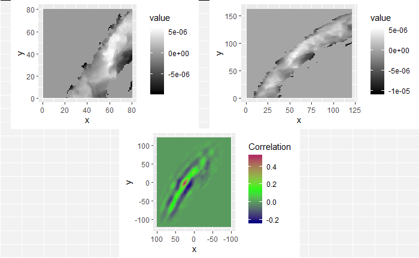
```

<details>
<summary>
I'm still currently trying to determine the cause of the correlation issue we're running into. In doing so, I've been making sure that the method by which we are calculating correlation works for simpler examples. I found these examples useful in understanding the strengths/limitations of using a FFT-based approach for calculating cross correlation, so I thought that I would share.
</summary>
For each of these examples, the image on the left is the "reference" image that we want to align the image on the right with. The left image will always be a square image with most pixel values 0 and a square of side length 20 pixels and value 255 in the middle. We want to see how changing characteristics of the right picture affects the correlation values calculated by the CCF.

In the first example below, the image on the right just has the box shifted down 30 pixels and right 10 pixels. If we were to overlay the two images with their centers aligned, the correlation "map" that accompanies this pair provides instructions for how to shift the right image to correctly match up with the left image. We see from the location of the largest correlation value (of 1 at (-10,30)) that the CCF indeed detected the correct shift.

```{r out.width="75%",fig.keep="hold", fig.align='center',fig.show='hold'}
knitr::include_graphics("images/cartridge_cases/joe_oldImages/examplePerfectCCFMap.png")
```

In the second example, the 0-values pixels in the right image are replaced with randomly generated $\mu = 0$ and $\sigma = 50$ white noise. We see that the max correlation value still occurs at the right location, but with a smaller magnitude. We also see that the rest of the correlation map isn't all 0 as it was in the 0-pixel example above.

```{r out.width="75%",fig.keep="hold", fig.align='center',fig.show='hold'}
knitr::include_graphics("images/cartridge_cases/joe_oldImages/exampleWN_CCFMap.png")
```

Lastly, we have an example where the second image contains a smaller square of side-length 10 pixels. We see that, again, the correlation value maximum occurs at the correct location yet with a magnitude well below 1. 

```{r out.width="75%",fig.keep="hold", fig.align='center',fig.show='hold'}
knitr::include_graphics("images/cartridge_cases/joe_oldImages/exampleWNSmallerSquare_CCFMap.png")
```
</details>

</details>

<details>
<summary>
Joe's 11/21 Spotlight: Visual Explanation of the "Improved" Congruent Matching Cells Algorithm proposed by [Tong et al. (2015)](https://www.ncbi.nlm.nih.gov/pmc/articles/PMC4730689/).
</summary>

A cartridge case is a type of pre-assembled firearm ammunition packaging a projectile (e.g., bullet, shots, or slug). Below is an image showing different examples of cartridge cases.

```{r, out.width="30%",echo=FALSE,fig.align='center'}

```

When a firearm is discharged, the projectile stored in the cartridge case is propelled down the barrel of the firearm. In response, the rest of the cartridge case that remains inside of the firearm is forced towards the back of the barrel (for every action, an equal and opposite reaction). The force with which the remaining cartridge case (hereby referred to as simply "the cartridge case") is propelled backwards causes it to strike against the back wall of the firearm's barrel. This area is commonly referred to as the "breech face." An example of a breech face from a 12 GAUGE, single-shot shotgun is shown below.

```{r, out.width="30%",echo=FALSE,fig.align='center'}
knitr::include_graphics("images/cartridge_cases/11-21-Spotlight/breechFace.jpg")
```

The hole in the center of the breech face is where the firing pin shoots out to strike the cartridge case primer, which in turn ignites the propellant within the cartridge case causing an explosion that propels the bullet forward down the barrel. As you can see from the image above, there are markings (e.g., manufacturing imperfections) on the breech face. When the cartridge case slams against the breech face during the firing process, these markings can be "stamped" into either the primer of the cartridge case or the cartridge case itself. The markings left on a cartridge case from the firearm's breech face are called "breech face impressions." The image below shows the primer of a shotshell fired in the above shotgun. You can clearly see that some impressions were left on the primer during the firing process.

```{r, out.width="30%",echo=FALSE,fig.align='center'}
knitr::include_graphics("images/cartridge_cases/11-21-Spotlight/breechFaceImpression.jpg")
```

The image below shows how the breech face scans come in their raw format. We want to preprocess the images to remove the firing pin impression in the center and accentuate the firing pin impression.

```{r, out.width="60%",echo=FALSE,fig.align='center'}
knitr::include_graphics(c("images/cartridge_cases/11-21-Spotlight/rawBF.png"))
```

Although it is non-trivial to preprocess the images, I am going to skip the explanation of the preprocessing steps so that we have time to focus on how we quantify similarity. The image below shows the result of the preprocessing steps.

```{r, out.width="60%",echo=FALSE,fig.align='center'}
knitr::include_graphics(c("images/cartridge_cases/11-21-Spotlight/processedBF.png"))
```

We *could* now directly calculate the pixel-wise correlation between these two images. However, there are a few issues with doing so directly. One issue is that we can visually see that the two images are not rotationally aligned, so we wouldn't expect the correlation to be particularly high. We can fix this by considering a variety of rotations of the images to determine for which rotation the images are the "most aligned." While it's not obvious from the images, there is also an issue with the two images being translationally aligned. Lastly, due to the slight differences between the two images, taking the pixel-wise correlation between the entirety of the two images may lead to a deceptively small correlation. This is the motivation behind what Tong et al. (2015) describe as the "Congruent Matching Cells" algorithm. The idea is quite simple. Rather than calculating correlation across entire images, it might be better to break up each image into smaller pieces ("cells") and calculate correlation for each cell pair. In doing so, a highly correlated pair of cells won't be drowned-out by less correlated pairs of cells.

Tong et al. propose this cell-based method for quantifying similarity between two breech face impressions. For a given pair of images (like the two shown below), the first image is divided into a 7x7 grid. Each cell in this grid is then compared to a region in the second image. Because the two images aren't assumed to be translationally aligned, the region in the second image will be larger than its associated cell in the first image so that different $(dx,dy)$ translation pairs can be considered.

```{r, out.width="60%",echo=FALSE,fig.align='center'}
knitr::include_graphics(c("images/cartridge_cases/11-21-Spotlight/im1_im2_cellComparison.png"))
```

Below is a gif showing an example of different pairs of image 1 cells (left) and image 2 regions (right).

```{r, fig.cap="(Left) 100x100 cells from Image 1. (Right) 200x200 cells from Image 2.", out.width="50%",fig.keep="hold", fig.align='center',fig.show='hold'}
knitr::include_graphics(c("images/cartridge_cases/11-21-Spotlight/im1_standardCells.gif",
                          "images/cartridge_cases/11-21-Spotlight/im2_largerCells.gif"))
```

We measure the similarity between two breech face impressions using the cross-correlation function. The cross-correlation function (CCF) is a measure of similarity of two series as a function of the displacement of one relative to the other. The cross-correlation function for two complex functions $f(t)$ and $g(t)$ for $t \in \mathbb{R}$, denoted $f \star g$, is defined by

$$
(f \star g)(\tau) \equiv \int_{-\infty}^\infty \overline{f(t)}g(t + \tau)\ dt
$$

where $\overline{f(t)}$ is the complex conjugate of $f(t)$. The cross-correlation can be used as a measure of similarity between two different functions. In particular, for $f,g$ real-valued we can interpret the CCF as a measure of common area or "overlap" between the two functions at different values of $\tau$. The value $\tau$ at which $(f \star g)(\tau)$ achieves its maximum can be interpreted as the horizontal translation of $g$ at which $f$ and $g$ are overlapping the most (i.e., are the "most similar" to each other). Below is an animation of two sinusoids that illustrates this concept. We can view the blue sinusoid as being the stationary $f$ function while the red sinusoid is function $g$ that is being translated by different versions of $\tau$. For each $\tau$ value, the integral of the product of the two functions (since $f$ is real-valued, $\bar{f} = f$) is plotted as the green curve. We can see that the CCF achieves a maximum at $\tau = 0$. Intuitively, this because the peaks and troughs of the two functions line up perfectly when $g$ is translated by $\tau = 0$ units, so their product contributes a large, positive amount to the integral.

```{r, caption="http://inst.eecs.berkeley.edu/~ee16a/sp15/Labs/location/ee16a_location_lab1.html", out.width="50%",echo=FALSE,fig.align='center'}
knitr::include_graphics("images/cartridge_cases/11-21-Spotlight/ccfExample.gif")
```

Because we work with discretized representations of cartridge cases, we need to use the discrete analogue of the cross-correlation function. For two discrete functions $f$ and $g$, the CCF is defined to be

$$
(f \star g)(n) \equiv \sum_{m = -\infty}^\infty \overline{f(m)}g(m+n)
$$

The images we use are obviously 2-dimensional while the CCF defined above is for 1-dimensional functions. The 2-dimensional extension of the CCF is defined analogously. We can see two examples below of how the 2-dimensional CCF works for simple images. The image immediately below shows an image on the left of mostly 0-valued, black pixels with a 20x20 pixel square of 255-valued, white pixels. The image on the right is the same as the image on the left, but with the square shifted to the right 10 pixels and down 30 pixels. The blue/green/red image below these two shows the correlation "map" that indicates the CCF values for various $(dx,dy)$ pairs. If we were to overlay the two images such that their centers aligned with each other, the CCF map tells us how we should shift the second image so that it properly aligns with the first image. As we can see in this simple example, the maximum correlation (of 1) occurs at $(dx,dy) = (-10,30)$ indicating that we should move the second image to the left to pixels and up 30 pixels. This demonstrates that the CCF is sensitive to the correct translation values, at least for these simple examples.

```{r, out.width="80%",echo=FALSE,fig.align='center'}
knitr::include_graphics(c("images/cartridge_cases/11-21-Spotlight/examplePerfectCCFMap.png"))
```

To show a situation in which the CCF map changes, consider the images below. The image on the left is the same as the example above. However, the image on the right now has WN$(\mu = 0,\sigma = 50)$ pixels instead of strictly 0-valued pixels. The rectangle in this right image is in the same location as in the example above, yet with an intensity of 100 rather than 255. Lowering the intensity means that we are making the rectangle's "signal" weaker relative to the surrounding pixels. We can see from the CCF map that this weaker signal indeed affects the correlation values. Although the $(dx,dy)$ at which the CCF achieves its maximum is still at the appropriate location $(-10,30)$, we see that this max CCF is now only around $.4$.

```{r, out.width="80%",echo=FALSE,fig.align='center'}
knitr::include_graphics(c("images/cartridge_cases/11-21-Spotlight/correlationMap_noiseExample.png"))
```

Hopefully the two examples above provide some intuition in how the CCF function can be used to measure properly align two images to be the "most similar." As already stated, we perform this CCF calculation for each cell in image 1 and associated region in image 2. For each pair, we keep track of the both the value and $(dx,dy)$ translation at which the CCF achieves its maximum. We count this as the that cell's "vote" for how the two images should be shifted to become properly aligned. It's reasonable to assume that the true $(dx,dy)$ translation values should receive many votes from cells, up to some error threshold (e.g., the votes should be within, say, 25 pixels of the true values). Determining the correct rotational alignment isn't as straightforward. We need to search over a grid of $\theta$ rotation values and determine the rotation for which the most cells vote. Below is a gif in which we can compare the two breech face scans for various rotations of the second image. We can visually see that the two images are most similar at a rotation value of about $-24^{\circ}$. The blue region on the right image is meant to illustrate the region that is being compared to to the associated cell in the left image.

```{r, out.width="60%",echo=FALSE,fig.align='center'}
knitr::include_graphics(c("images/cartridge_cases/11-21-Spotlight/bfRotationComparison.gif"))
```

Below is an example showing the CCF map associated with (left) an image 1 cell and (right) its associated image 2 region. We can see that the CCF hits a maximum of about .5 around $(25,0)$. This is, unfortunately, not nearly the magnitude of correlation that we should expect based on the results discussed in Tong et al. (2015). It sounds like the correlation values they were getting from their comparisons were consistently above .55. The CCF maps that we have calculated are rarely above .55. Our hunch is that they are using the CCF to extract the $(dx,dy)$ pairs, but then computing the raw, pixel-wise correlation between the two images once they translate appropriately.

```{r, out.width="80%",echo=FALSE,fig.align='center'}
knitr::include_graphics(c("images/cartridge_cases/11-21-Spotlight/cellCCFMap.png"))
```

```{r, out.width="80%",echo=FALSE,fig.align='center'}
knitr::include_graphics(c("images/cartridge_cases/11-21-Spotlight/beforeAndAfterShiftExample.png"))
```

We can keep track of each cell's vote for the rotation and translation values at which it achieved its maximum correlation with its associated region in image 2. Again, we would expect that the true rotation and translation values should receive a large number of votes. We can see below a histogram of the theta values voted for by the cells in the left image above. We can a clear mode at a $\theta$ value slightly less than -20. Based on the gif of the rotating breech face above, it appears that the automatic CCF-based "votes" agree with what we can visually see to be the best rotation value to align the two images.

```{r, out.width="60%",echo=FALSE,fig.align='center'}
knitr::include_graphics(c("images/cartridge_cases/11-21-Spotlight/thetaVoteHistogram.png"))
```

Based on the histogram above, the algorithm has detected the correct rotation value to align the two images. If we were to rotationally align the two images based on this value, we can count the number of pairs that are "highly similar" with each other. Tong et al. discuss various criteria to use to define "highly similar" including having a minimum CCF value (.55 in their paper). They also require that the $(dx,dy)$ translation values that a particular pair voted for must be within some number of pixels of the "majority-voted" translation values (they propose a maximum of 25 pixels away from the median translation values). All of this seems rather arbitrary, so it would be interesting to explore if alternative criteria would be more effective at differentiating between matches and non-matches.

```{r, out.width="60%",echo=FALSE,fig.align='center'}
knitr::include_graphics(c("images/cartridge_cases/11-21-Spotlight/CMCs.png"))
```

</details>

<details>
<summary>
Joe 12/5 Update: I believe we've finally cracked the issue that we've been running into the past few weeks of our correlations not being as high as those reported in the Tong paper. The fix is that we can first use the FFT-based method of calculating the CCF to obtain the correct dx,dy translation pairs and then calculate the raw correlation between the two images once we translate them appropriately. Before, we were using the correlation given to us by the FFT-based CCF method, which were most often deflated relative to the true correlation (due to replacing missing values with 0).
</summary>

Below, I have three examples showing the raw correlation values between pairs of cells. Any pair with a correlation above .55 we would call "highly correlated" under the Tong paper's criteria. The first example below shows a best-case scenario in which we have two images containing a lot of observed values and those observed values have a fairly high correlation (high enough to meet the arbitrary .55 threshold, at least).

```{r}
include_graphics("images/cartridge_cases/joe_oldImages/highlyCorrelatedCellPair_largeProportionOfImage.png")
```

However, the second example shows a not-so-great scenario in which we don't have a lot of observed values in the two images, but they are still highly correlated. We should be less confident that such examples indicate that the overall breech face impressions are "true matches" than we are in the example above, but the Tong paper doesn't seem to make such a distinction.

```{r}
include_graphics("images/cartridge_cases/joe_oldImages/highlyCorrelatedCellPair_smallProportionOfImage.png")
```

Lastly, I have an example of two images that certainly have many observed value that visually look like they should be fairly highly correlated. However, we can see by the raw correlation value that they, in fact, wouldn't pass the threshold to be "highly correlated." As such, we wouldn't include them when we count the number of highly correlated pairs between the two images. I wanted this example to demonstrate that our eyes don't always necessarily pick up on subtleties as strongly as a computer might.

```{r}
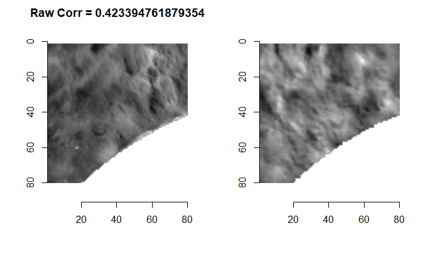
```

</details>

<details>
<summary>
Joe 12/12 Update: I have been trying to implement the Tong paper's criteria for calling two images "matches" and apply these criteria to all of the known match and known non-match image pairs. I have results to share regarding the number of CMCs counted for each known-match cell pair (the known non-matches take much longer to run).
</summary>

To recap, the CMC algorithm attempts to match two breech face impression images by breaking the image up into "cells" and counting the number of cells that are highly similar between the two images. So for each pair of images, we get a congruent matching cell count indicating how similar the overall images are. For the Fadul data that the Tong paper uses, there are 63 known match pairs. The bar chart on the left shows the various CMC counts for these 63 known match pairs as determined by our implementation in the algorithm. In contrast, the CMC count distribution as reported in the Tong paper is on the right (known matches in gold). We can see that our histogram is qualititatively similar to the gold distribution on the right.

```{r}
include_graphics(c("images/cartridge_cases/joe_oldImages/kmCMCDistribution.png",
                   "images/cartridge_cases/joe_oldImages/CMCDistribution_Tong.PNG"))
```

There are two pairs that seem to be giving us trouble in the histogram above (we expect all of the known match pairs to have a large number of "highly similar" cells). Below shows the se two pairs. Hopefully it's clear to see that the first pair, while known matches, look fairly different. There are many regions in the image on the left that are missing from the image on the right. These differences possibly provide some justification as to why the current implementation of the algorithm fails to identify these two images as matches.

```{r}

```

The troubling example is below. It's visually obvious that these two images are very similar to each other. However, the algorithm does not identify these as matches. Our current hunch is that the way we preprocess the images has a dramatic effect on the results we ultimately observe. We have a few ideas to tweak the preprocessing to hopefully fix such issues. Unfortunately, the Tong paper never describes how they preprocess the 3D scans, so we have no way of truly replicating their results. All we can hope for is qualitatively similar results, which appears to be the case for the most part.

```{r}
include_graphics("images/cartridge_cases/joe_oldImages/lowCMCCount_example2.png")
```
</details>

<details>
<summary>
Joe 1/17 Update: Broad overview of project.
</summary>

A cartridge case is a type of pre-assembled firearm ammunition packaging a projectile (e.g., bullet, shots, or slug). Below is an image showing different examples of cartridge cases.

```{r, out.width="30%",echo=FALSE,fig.align='center',fig.cap="Various cartridge cases"}

```

When a firearm is discharged, the projectile stored in the cartridge case is propelled down the barrel of the firearm. In response, the rest of the cartridge case that remains inside of the firearm is forced towards the back of the barrel (for every action, an equal and opposite reaction). The force with which the remaining cartridge case (hereby referred to as simply "the cartridge case") is propelled backwards causes it to strike against the back wall of the firearm's barrel. This area is commonly referred to as the "breech face." An example of a breech face from a 12 GAUGE, single-shot shotgun is shown below.

```{r, out.width="30%",echo=FALSE,fig.align='center',fig.cap="Breech face of a shotgun"}
knitr::include_graphics("images/cartridge_cases/11-21-Spotlight/breechFace.jpg")
```

The hole in the center of the breech face is where the firing pin shoots out to strike the cartridge case primer, which in turn ignites the propellant within the cartridge case causing an explosion that propels the bullet forward down the barrel. As you can see from the image above, there are markings (e.g., manufacturing imperfections) on the breech face. When the cartridge case slams against the breech face during the firing process, these markings can be "stamped" into either the primer of the cartridge case or the cartridge case itself. The markings left on a cartridge case from the firearm's breech face are called "breech face impressions." The image below shows the primer of a shotshell fired in the above shotgun. You can clearly see that some impressions were left on the primer during the firing process.

```{r, out.width="30%",echo=FALSE,fig.align='center',fig.cap="Breech face impression on a cartridge case"}
knitr::include_graphics("images/cartridge_cases/11-21-Spotlight/breechFaceImpression.jpg")
```

The image below shows how the breech face scans come in their raw format. We want to preprocess the images to remove the firing pin impression in the center and accentuate the firing pin impression.

```{r, out.width="100%",echo=FALSE,fig.align='center',fig.cap="A pair of known match cartridge case scans"}
knitr::include_graphics(c("images/cartridge_cases/11-21-Spotlight/rawBF.png"))
```

Tong et al. propose this cell-based method for quantifying similarity between two breech face impressions. For a given pair of images (like the two shown below), the first image is divided into a 7x7 grid. Each cell in this grid is then compared to a region in the second image. Because the two images aren't assumed to be translationally aligned, the region in the second image will be larger than its associated cell in the first image so that different $(dx,dy)$ translation pairs can be considered.

```{r, out.width="80%",echo=FALSE,fig.align='center'}
knitr::include_graphics(c("images/cartridge_cases/11-21-Spotlight/im1_im2_cellComparison.png"))
```

Below is a gif showing an example of different pairs of image 1 cells (left) and image 2 regions (right).

```{r, fig.cap="(Left) 100x100 cells from Image 1. (Right) 200x200 cells from Image 2.", out.width="40%",fig.keep="hold", fig.align='center',fig.show='hold'}
knitr::include_graphics(c("images/cartridge_cases/11-21-Spotlight/im1_standardCells.gif",
                          "images/cartridge_cases/11-21-Spotlight/im2_largerCells.gif"))
```

The two-dimensional CCF is used to quantify similarity between two breech face impressions. Below are two examples illustrating how to interpret the two-dimensional CCF.

```{r, out.width="80%",echo=FALSE,fig.align='center'}
knitr::include_graphics(c("images/cartridge_cases/11-21-Spotlight/examplePerfectCCFMap.png"))
```

Below is an example showing the CCF map associated with (left) an image 1 cell and (right) its associated image 2 region. We can see that the CCF hits a maximum of about .5 around $(25,0)$. This is, unfortunately, not nearly the magnitude of correlation that we should expect based on the results discussed in Tong et al. (2015). It sounds like the correlation values they were getting from their comparisons were consistently above .55. The CCF maps that we have calculated are rarely above .55. Our hunch is that they are using the CCF to extract the $(dx,dy)$ pairs, but then computing the raw, pixel-wise correlation between the two images once they translate appropriately.

```{r, out.width="80%",echo=FALSE,fig.align='center'}
knitr::include_graphics(c("images/cartridge_cases/11-21-Spotlight/cellCCFMap.png"))
```

The image below shows how the smaller breech face impression image aligns with the larger breech face impression image after being translated by the CCF-detected $(dx,dy)$ values.

```{r, out.width="80%",echo=FALSE,fig.align='center'}
knitr::include_graphics(c("images/cartridge_cases/11-21-Spotlight/beforeAndAfterShiftExample.png"))
```

The animation below shows how the two breech face impressions compare for various rotations of the second breech face impression.

```{r, out.width="60%",echo=FALSE,fig.align='center'}
knitr::include_graphics(c("images/cartridge_cases/11-21-Spotlight/bfRotationComparison.gif"))
```

We can keep track of each cell's vote for the rotation and translation values at which it achieved its maximum correlation with its associated region in image 2. Again, we would expect that the true rotation and translation values should receive a large number of votes. We can see below a histogram of the theta values voted for by the cells in the left image above. We can a clear mode at a $\theta$ value slightly less than -20. Based on the gif of the rotating breech face above, it appears that the automatic CCF-based "votes" agree with what we can visually see to be the best rotation value to align the two images.

```{r, out.width="80%",echo=FALSE,fig.align='center'}
knitr::include_graphics(c("images/cartridge_cases/11-21-Spotlight/CMCs.png"))
```
</details>

<details>
<summary>
Joe 1/27 Update: I've been starting to write up an article that we hope to submit to the R Journal to introduce the MARCC (Matching Algorithms in R for Cartridge Cases) package (name pending). It's been rather time intensive, but I've also been re-running the algorithm with different pre-processing steps to determine how sensitive the final results are to how we pre-process the images. It seems like they are rather sensitive to the pre-processing procedure used.
</summary>

```{r}
knitr::include_graphics("images/cartridge_cases/joe_oldImages/paperHeader.PNG")
```


I thought I would share a few of the CMC distributions made for different pre-processing steps. These pre-processing steps include extracting the breech face impression region from the rest of the image, which may be done by-hand (Tong et al. (2014/15) may do this), using the RANSAC method (Xiao Hui and I have been doing this), or using a 2nd order robust Gaussian regression filter (Chen et al. (2017) does this). Further complications come in the form of how these methods are implemented across various MATLAB and R functions (I have yet to find a Gaussian Regression filter implemented anywhere in R or MATLAB) and whether they provide the same results. After selecting the breech face impression region from the scan, no paper I have come across details how they then resize their images to their desired dimension. Tong et al. resizes to 700x700 in 2014 and 560x560 in 2015. Chen et al. uses resizes to 600x600 in 2017. As discussed below, the resizing method (nearest-neighbors, linear, lanczos) does seem to affect the final results.

To recap, we are supposed to call two cells a "match" (or "congruent matching cells") if they pass a few criteria. These criteria are based in part on whether their associated translation and rotation "votes" are close to the consensus-based votes across all cells in the image. The motivation here being that we would expect the cells in a pair of truly matching cartridge cases to all vote for approximately the same translation/rotation values to achieve maximum similarity. Another criterion is that the cell pair must reach some minimum correlation cut-off (all of these criteria vary depending on the paper).

Each of the following plots were subject to the same criteria and are based on the same data, so they should be the same plot. As we can clearly see, there is certainly some variability in how the CMC counts are distributed.

This is an example from Chen et al. (2017) that the rest of the plots are trying to emulate. This plot was made using reportedly images downsampled to size 600x600 and an 8x8 grid of cells. Again, it's unclear how this downsampling was performed since the raw surface data often have dimensions near 600x600, but never perfectly 600x600. The plots following include various resizing/padding techniques used to try to get this nominal 600x600 image size.

```{r}

```

This is a plot based on images that were resized to 560x560 (the image size specified by Tong et al. (2015)) using linear interpolation.

```{r}
knitr::include_graphics("images/cartridge_cases/joe_oldImages/kmCMCs_560x560_linearInterp.png")
```

This is a plot based on images that were resized to 600x600 (the image size specified by Chen et al. (2017)) using the `x3ptools::resize_x3p()` function followed by padding the image with NAs until it reaches a size of 600x600.

```{r}
knitr::include_graphics("images/cartridge_cases/joe_oldImages/kmCMCs_600x600_sample_x3p.png")
```

This final distribution is the most promising of the ones I've made. This distribution is also based on images that were resized using `x3ptools::resize_x3p()`. However, rather than padding the exterior of the image with NA rows/cols until it achieves the nominal 600x600 size, the image is first split into an 8x8 grid of cells and each cell is individually padded until it reaches dimension 75x75.

```{r}

```

</details>

<details>
<summary>
Joe 2/3 Update: I've been working on getting a Gaussian bandpass filter implemented for the cartridge cases in an attempt to match the results reported by Chen et al. (2017). I've also been writing more of the journal submission while code runs.
</summary>

Below is an image of black (0 intensity) grayscale image to which a low-frequency, 255 intensity box and high-frequency Gaussian noise has been added.
```{r}
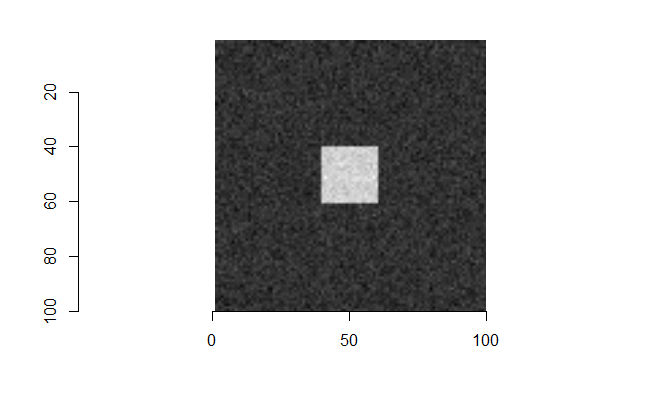
```

Below is a 3D rendering of the same image.
```{r}
knitr::include_graphics("images/cartridge_cases/2-3_fftExample/originalImage.PNG")
```


A "low pass" Gaussian filter can be interpreted as reducing the strength of high frequency signals in the image. In the image above, the Gaussian noise is higher in frequency than the white box, so it can be reduced without drastically affecting the box. In the spatial domain, we can think of a moving average as performing a similar operation as a low pass filter.

```{r}

```

Conversely, a "high pass" Gaussian filter reduces the strength of low frequency (longer period) signals and emphasizing high frequency signals. We can see in the image below that much of the white box has been removed from the image below by passing a high pass filter since the much of the white box can be explained with large period sinusoids. Only the edges, which would need to be explained with higher frequency sinusoids, remain after passing the high pass filter. The Gaussian noise also remains.

```{r}


```


</details>

<details>
<summary>
Joe 2/10 Spotlight: A further explanation of how I have been pre-processing the images and how those steps affect the CCF values.
</summary>

I have been spending the last few weeks tweaking the pre-processing procedures in order to perform a "sensitivity analysis" of the final results given a variety of initial conditions. This has required me to look deeper into various image processing techniques that has taken up a surprising amount of time. I have also been trying to pull together the various threads of the project into a cohesive manuscript and R package. I'm planning on making this project my CC and hoping to present it in late March/early April.

I've spent a considerable amount of this project, possibly more than half, agonizing over various image processing techniques. We had a working "prototype" of the CMC working as far back as October of last year. However, it quickly became evident that our results didn't quite match the results reported by authors at NIST. This realization caused us to go down a variety of rabbit holes, some of which we're still in, to determine the cause of these differing results. The biggest obstacle that we've faced is that we don't quite know how the images were processed before they were used in the CMC method; and it doesn't appear that NIST is willing to share much of their information (although Susan is currently trying to get them to share). There are a variety of decisions that need to be made when pre-processing the images that aren't discussed in sufficient detail in any papers on the CMC method. So it has been up to us to test various combinations of these decisions to determine how they affect the final results.

Because I have been spending so much time the past few weeks (months?) exploring various pre-processing techniques, I'm hoping to share with you all some of what I have learned. I've never really discussed the pre-processing procedure(s) in-full, so I hope to use this space as an opportunity to pull together various threads that I can hopefully use for my CC.

When we say that we need to "pre-process" the cartridge case scans, we mean that there are regions of the scan that aren't useful to us that we want to remove. In particular, any regions that don't come into contact with the breech face of the firearm barrel aren't going to be informative. The image below shows left-hand side and top-down views of a cartridge case.

```{r }
knitr::include_graphics(c("images/cartridge_cases/2-10_spotlight/cartridgeCaseScanBottomSideView_1.png"),dpi = 650)

knitr::include_graphics(c("images/cartridge_cases/2-10_spotlight/cartridgeCaseScanTopView_1.png"),dpi = 400)
```

The regions we want to remove outright from the scan are highlighted in red in the image below. The red circe in the middle is caused by the firing pin pushing into the cartridge case primer, causing some of the metal to be pushed to the side. This region does not come into contact with the breech face, but instead goes inside of the firing pin hole. The cluster of points in the corners of the image are from the machine with which the scan was taken. Removing these regions by hand would be straightforward. The issue comes from trying to come up with automatic methods for identifying and removing these regions for an arbitrary scan.

```{r out.height=400, out.width=400,fig.align='center'}
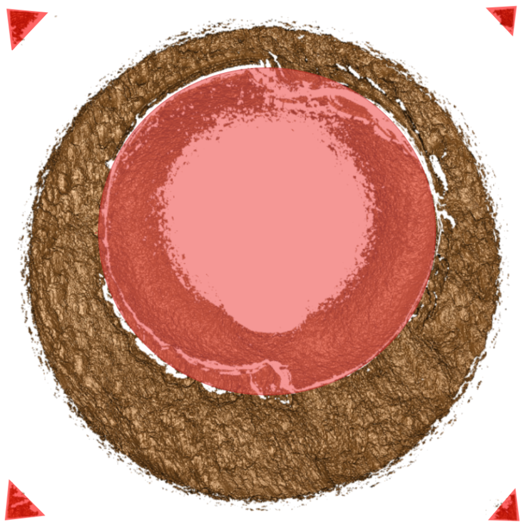
```

The first goal is to identify at which height value the breech face impression is in the scan. We currently use the RANSAC (RAndom SAmple Consensus) method to accomplish this. For our purposes, RANSAC iteratively fits a number of "candidate" planes to the cartridge case scan based on randomly selected points. At each iteration, the method determines whether a newly proposed candidate plane contains more "inliers" (defined as points within some threshold distance of fitted plane) than the previously proposed candidate planes. If so, then the method chooses this new plane as the current "consensus." After a set number of iterations, the last consensually-selected plane is returned. The picture below provides a 2-dimensional illustration of the method ([Source](https://bitesofcode.wordpress.com/category/python/)).

```{r out.height=400,fig.align='center'}
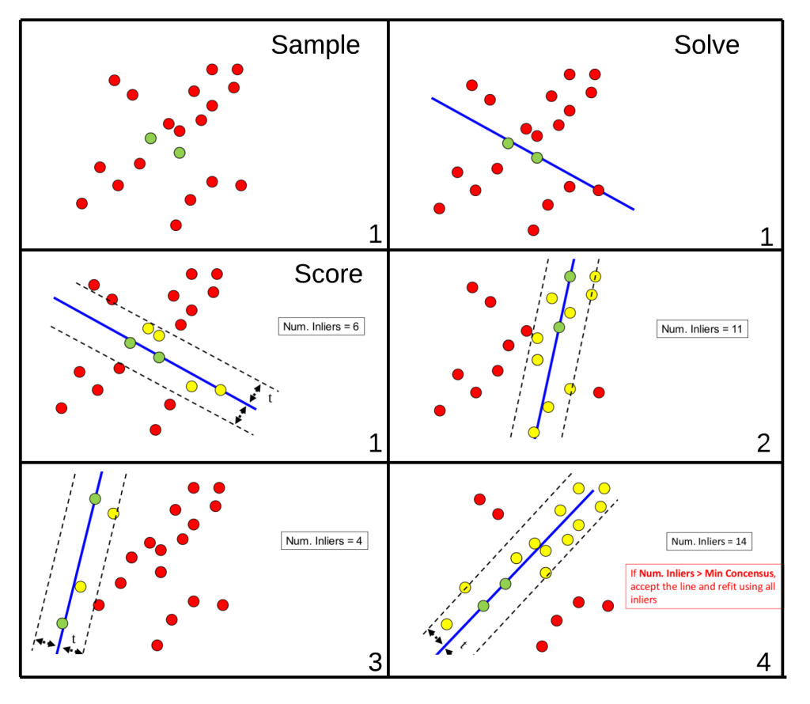
```

Once the RANSAC plane is fit, we have two options. We can either take the residuals between the fitted plane and the observed breech face impression values or simply extract from the original scan the observed values within some specified distance of the fitted plane. Assuming that the cartridge case scans aren't tilted off the horizontal, these should yield similar results. However, we have some evidence to suggest that the planes are slightly tilted. The pair of images below illustrates this point. The image on the left represents the raw, observed breech values while the image on the right contains the residuals. The grayscale intensity of the images reflect the height values. We can see that in the image on the left that there is a general trend from darker to lighter pixels (i.e, height values go from low to high) from the bottom-left corner to the top-right corner. The image on the right, on the other hand, does not contain this trend since it contains residual values. It should be noted that, although we can see a trend, this trend may be exaggerated since the pixel intensities are colored on a scale relative to the values in the image. That is, although there *is* a clear trend, this trend may not actually be that extreme when viewing the raw pixel values.

```{r}
knitr::include_graphics(c("images/cartridge_cases/2-10_spotlight/ransacSelectedBF.png"),
                        dpi = 100)

knitr::include_graphics(c("images/cartridge_cases/2-10_spotlight/ransacSelectedBFResiduals.png"),
                        dpi = 100)

```

We have yet to determine whether fixing this tilt affects the results in any major way, but, to be safe, we have mostly been using the residuals rather than the raw, observed breech face impression values. It should be noted that because the RANSAC method is dependent on randomly selected points in the scan, the final consensually-selected plane may differ in size/values between different applications of the method. However, we've observed this difference to be only slight across the many times we've applied the method.

You'll notice in the above image that we still haven't removed all of the observed values inside nor outside the breech face impression. These remaining, unwanted pixels happen to have the same height value as the breech face impression pixels. Removing the outer pixels simply requires cropping the image down such that the breech face impression pixels touch the edge of the image. Removing the inner pixels is slightly harder and was the focus of a few weeks of work last semester. The method we implemented to detect where these pixels are in the image involves first estimating the radius of the inner circle and then using a Hough Transform to detect where that circle is in the image. For the sake of wanting to discuss other pre-processing more in-depth, I'm going to skip the details here. The additionally cropped/filtered image using the RANSAC residuals is shown below.

```{r}
knitr::include_graphics(c("images/cartridge_cases/2-10_spotlight/fullyProcessedBFResidualsTopDown.PNG"),
                        dpi = 100)
```

The next pre-processing step involves passing a Gaussian filter over the image to improve the "signal-to-noise" ratio. For our purposes, the "signal" that we want to identify are the impression markings left by the breech face onto the cartridge case. "Noise" includes possible measurement error and larger structure on the cartridge case that isn't an artifact of contact with the breech face. The Gaussian filtering is performed in the frequency domain using the Convolution Theorem.

<details>
<summary>
**Gaussian Filter Intuition**
</summary>

Below is an image of black (0 intensity) grayscale image to which a low-frequency, 255 intensity box and high-frequency Gaussian noise has been added.

```{r}

```

Below shows a 3D rendering of the same image.

```{r}
knitr::include_graphics("images/cartridge_cases/2-3_fftExample/originalImage.PNG")
```

A "low pass" Gaussian filter can be interpreted as reducing the strength of high frequency signals in the image. In the image above, the Gaussian noise is higher in frequency than the white box, so it can be reduced without completely removing the box, although the box will be affected. In the spatial domain, we can think of a weighted moving average as performing a similar operation as a low pass filter.

```{r}

```

Conversely, a "high pass" Gaussian filter reduces the strength of low frequency (longer period) signals and emphasizing high frequency signals. We can see in the image below that much of the white box has been removed from the image below by passing a high pass filter since the much of the white box can be explained with large period sinusoids. Only the edges, which would need to be explained with higher frequency sinusoids, remain after passing the high pass filter. The Gaussian noise also remains.

```{r}


```

</details>

A Gaussian bandpass filter can be used to reduce signals that are either too low or too high in frequency - i.e., what we have deemed to be noise. Below we can see the processed RANSAC residuals after filtering using a Gaussian bandpass. I've implemented the Gaussian bandpass by-hand since effectively no package  We can see that the "high-frequency" markings that were in the top-right quarter of the original RANSAC residuals have been visually reduced. Increasing the high-pass threshold of the Gaussian filter would mean allowing more of the high-frequency signals to be unaffected. A balance must be struck so that enough of the "true signal" remains in the filtered image while simulatenously reducing the effects of random noise.

```{r}
knitr::include_graphics(c("images/cartridge_cases/2-10_spotlight/filteredBFResiduals.png"),
                        dpi = 100)
```

All of this pre-processing can be done while keeping the original resolution of the surface matrix. For the Fadul (2011) sets, this is 3.125 microns/pixel. The literature available commonly describes downsizing a breech face impression to speed up computational time. However, no direction is given into how this downsampling happens. For example, we could downsample simply by taking every every other row/column in an image. This is the method implemented in the `x3ptools::sample_x3p` function. On the other hand, a large number of downsampling interpolation techniques exist that take weighted averages in neighborhoods of points to determine the values in a downsampled image. Many of these interpolation methods (nearest neighbor, linear, cubic, lanczos) are implemented in the `imager::resize` function. However, `imager` is effectively an `R` frontend to the `C` library `CImg`, so the way in which these methods are actually implemented may be difficult to track down.

<details>
<summary>
**Sensitivity Analysis Example**
</summary>

To illustrate some of the sensitivity of the final results to the pre-processing steps, we'll consider an example in which we have 3 cartridge case scans. We'll consider two of them "known" and one of them to be "questioned." We'll consider combinations of two different decisions: 1) take the RANSAC residuals or the raw breech face impression values and 2) pass a gaussian bandpass filter over the images or not. In each of these examples, the questioned cartridge case is in the top left, its (known) match is in the top right, a (known) non-match is in the bottom left, and the distribution of maximum CCF values per cell comparing the questioned cartridge case to the two known cartridge cases is in the bottom right.

Below we can see the results if the RANSAC residuals were taken and then bandpass filtered. We can see considerable overlap between the two distributions.

```{r out.width = "49%"}
knitr::include_graphics(c("images/cartridge_cases/2-10_spotlight/sensitivityExample/bandpassResiduals/fadul1_bandpassResiduals.png",
                          "images/cartridge_cases/2-10_spotlight/sensitivityExample/bandpassResiduals/fadul2_bandpassResiduals.png"))

knitr::include_graphics(c("images/cartridge_cases/2-10_spotlight/sensitivityExample/bandpassResiduals/fadulx_bandpassResiduals.png",
                          "images/cartridge_cases/2-10_spotlight/sensitivityExample/bandpassResiduals/BandpassResiduals_ccfHistogram.png"))
```

Below we can see the results if the raw breech face values were taken and then bandpass filtered. Again, considerable overlap.

```{r out.width = "49%"}
knitr::include_graphics(c("images/cartridge_cases/2-10_spotlight/sensitivityExample/bandpassRawValues/fadul1_bandpassRawValues.png",
                          "images/cartridge_cases/2-10_spotlight/sensitivityExample/bandpassRawValues/fadul2_bandpassRawValues.png"))

knitr::include_graphics(c("images/cartridge_cases/2-10_spotlight/sensitivityExample/bandpassRawValues/fadulx_bandpassRawValues.png",
                          "images/cartridge_cases/2-10_spotlight/sensitivityExample/bandpassRawValues/BandpassRawValues_ccfHistogram.png"))
```

Below we can see the results if the raw breech face values were taken, but no bandpass filter was applied. One could argue that the CCF values are slightly higher than in the bandpass cases, but there is still considerable overlap.

```{r out.width = "49%"}
knitr::include_graphics(c("images/cartridge_cases/2-10_spotlight/sensitivityExample/noBandpassResiduals/fadul1_noBandpassResiduals.png",
                          "images/cartridge_cases/2-10_spotlight/sensitivityExample/noBandpassResiduals/fadul2_noBandpassResiduals.png"))

knitr::include_graphics(c("images/cartridge_cases/2-10_spotlight/sensitivityExample/noBandpassResiduals/fadulx_noBandpassResiduals.png",
                          "images/cartridge_cases/2-10_spotlight/sensitivityExample/noBandpassResiduals/noBandpassFilterResiduals_ccfHistogram.png"))
```

Startilingly, the non-bandpassed, raw values yield the highest CCF values of these 4 combinations. However, it's important to point out that the known match images very clearly have trend that starts low in the bottom left corner and increases to the top right corner. The non-match has a completely different trend. As we can see from the non-bandpassed, residual CCF histogram above, it appears that this global difference does have a fairly drastic effect on the final results. From what I have read, no author recognizes this global trend as a possible reason for the why matches tend to be more similar than the non-matches.

```{r out.width = "49%"}
knitr::include_graphics(c("images/cartridge_cases/2-10_spotlight/sensitivityExample/noBandpassRawValues/fadul1_noBandpassNoResiduals.png",
                          "images/cartridge_cases/2-10_spotlight/sensitivityExample/noBandpassRawValues/fadul2_noBandpassNoResiduals.png"))

knitr::include_graphics(c("images/cartridge_cases/2-10_spotlight/sensitivityExample/noBandpassRawValues/fadulx_noBandpassNoResiduals.png",
                          "images/cartridge_cases/2-10_spotlight/sensitivityExample/noBandpassRawValues/noBandpassNoResiduals_ccfHistogram.png"))
```

</details>

</details>

<details>
<summary>
Joe 2/17 Update: Not too much to report today. I've mainly working on the cmcR package and writing.
</summary>

```{r}
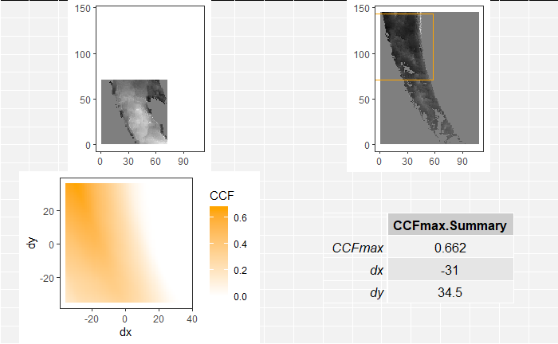
```


</details>

<details>
<summary>
Joe 2/24/20 Update: Not too much to update for today. I've been working on writing the package and associated RJournal submission. I have a few functions that I am still planning on implementing in the package, but I will for the most part be getting the package CRAN-ready. I'm planning on building upon the journal submission for my CC that I'll be presenting in April, so I will soon begin writing that as well.
</summary>

</details>

<details>
<summary>
Joe 3/2/20 Update: I spent a considerable amount of time writing my CC this week. I essentially only have the Literature Review and Results/Conclusions sections to write up before the initial draft is complete. I've also been working on pulling together results to put in the results section, but performing the entire CMC procedure on around 800 cartridge cases takes about 6 hours (I'll try to parallelize better to cut this time down on the server).

</details>

<details>
<summary>
Joe 3/9/20: Still more CC writing, pulling together results for the Results/Conclusion section, and tweaking functions in the cmcR package. We're seeing more promising results than we have in the past, but there are still avenues to explore. I'm looking forward to sharing these results and the cmcR package at my Spotlight the Monday after spring break!
</summary>
</details>

<details>
<summary>
Joe 3/23/20 Spotlight: I've been spending a considerable amount of time putting the finishing touches on the R package cmcR. The core of the package is currently done, but I'm hoping to add a few more ancillary functions, improve the documentation, and write tests. I was hoping to spend some time during the spotlight showing off some of the package functionality and getting feedback. We are also now getting the results close to we've hoping for. I'm looking forward to sharing some of those results during the spotlight as well.
</summary>

I've pushed unevaluated code chunks to the this-is-us because it would otherwise require cartridge case scan data that many probably don't have locally on their computer. See below for a link of how to access the cartridge case data

To install the cmcR package from github, run the following command in your R console.

```{r eval=FALSE,echo=TRUE}
devtools::install_github("https://github.com/jzemmels/cmcR")
```

```{r message=FALSE,warning=FALSE,eval = FALSE}
library(cmcR)
library(magrittr)
library(ggplot2)
library(dplyr)
```

For this use case, suppose we have two known match cartridge cases (km1 and km2) and two of unknown source (unknown1 and unknown2). Let's pretend that we don't see the file path clearing indicating which of the unknown source cartridge cases match the known source. These cartridge case data came from a study done by Fadul et al. (2011) and are accessible [here](https://tsapps.nist.gov/NRBTD/Studies/Studies/Details/e7a8aab8-8d5a-44ac-b2be-f0de7c2ca505?nm=True&mt=1&m=3&sp=1).

```{r eval = FALSE,echo=TRUE}
km1_raw <- x3ptools::read_x3p("~/bulletCartridgeScans/fadul_allScans/Fadul_1/cc/Fadul 1-1.x3p")
km2_raw <- x3ptools::read_x3p("~/bulletCartridgeScans/fadul_allScans/Fadul_1/cc/Fadul 1-2.x3p")
unknown1_raw <- x3ptools::read_x3p("~/bulletCartridgeScans/fadul_allScans/Fadul_2/cc/Fadul 2-1.x3p")
unknown2_raw <- x3ptools::read_x3p("~/bulletCartridgeScans/fadul_allScans/Fadul_1/cc/Fadul F.x3p")
```

*Cartridge case visualization:*

Visualizing cartridge case data is useful for determining, for example, how various pre-processing methods affect the final estimation of the breech face impressions. There are a number of ways to visualize cartridge case data, each with their own strengths and weaknesses.

*Imager with Base Plot:*
A quick yet inflexible way is to turn the surface matrix into a `cimg` object and use base plot.

```{r eval = FALSE,echo=TRUE}
par(mar = c(1,1,1,1))

imager::imlist(
  km1_raw$surface.matrix %>%
    imager::as.cimg(),
  km2_raw$surface.matrix %>%
    imager::as.cimg(),
  unknown1_raw$surface.matrix %>%
    imager::as.cimg(),
  unknown2_raw$surface.matrix %>%
    imager::as.cimg()
) %>%
  plot()
```
```{r}

```


```{r eval = FALSE,echo=TRUE}
km1_raw$surface.matrix %>%
  imager::as.cimg() %>%
  as.data.frame() %>%
  ggplot(aes(x = x,y = y)) +
  geom_raster(aes(fill = value)) +
  scale_fill_gradient2(low = "grey0",
                       mid = "grey50",
                       high = "grey100",
                       na.value = "white",
                       midpoint = median(as.vector(median(km1_raw$surface.matrix,
                                                          na.rm = TRUE)))) +
  coord_fixed(expand = FALSE) +
  theme_bw() +
  theme(panel.grid.major = element_blank(),
        panel.grid.minor = element_blank(),
        legend.position = "none",
        axis.title.x = element_blank(),
        axis.title.y = element_blank())
```

```{r}
knitr::include_graphics("images/cartridge_cases/3-23_Spotlight/rawGGplot.png")
```


*x3ptools::image_x3p:*

The `x3ptools::image_x3p` function provides 3D visualization functionality, but requires opening an RGL device on an individual machine (can't be viewed in an R Markdown file without making it huge)

```{r eval=FALSE,echo=TRUE}
km1_raw %>%
  x3ptools::image_x3p(zoom = .7)
```


*Pre-processing:*

If we want to compare these cartridge case scans based on their breech face impressions, they need to undergo some pre-processing. The `cmcR` package has the modularized family of `preProcess_` functions or the all-in-one (except Gaussian filtering) `selectBFImpression_` functions to accomplish this.

Below we can see how the `preProcess_` family of functions can be used to process a cartridge case scan. The RANSAC method is applied twice for a more precise estimate of the breech face impression height value. Then the whitespace (all NA-valued rows/columns) on the exterior of the breech face impression is cropped. Next the firing pin circle is automatically estimated and any pixels within this circle are filtered out the scan. Lastly, a lowpass Gaussian filter meant to reduce the effect of high frequency "noise" in the scan is applied.

```{r eval = FALSE,echo=TRUE}
set.seed(3152020) #RANSAC method is based on randomly sampling points in matrix

km1_residuals <- km1_raw %>%
  x3ptools::sample_x3p(m = 2) #down-sampled copy of km1_raw

km1_residuals$surface.matrix <- km1_residuals$surface.matrix %>%
  preProcess_ransac(inlierTreshold = 10^(-5),
                    finalSelectionThreshold = 2*(10^(-5)),
                    iters = 150) %>%
  preProcess_levelBF(useResiduals = TRUE) %>%
  preProcess_ransac(inlierTreshold = .1*(10^(-5)),
                    finalSelectionThreshold = 2*(10^(-5)),
                    iters = 300) %>%
  preProcess_levelBF(useResiduals = TRUE)

km1_residuals$surface.matrix %>%
  imager::as.cimg() %>%
  plot()

km1_residuals$surface.matrix <- km1_residuals$surface.matrix %>%
  preProcess_cropWS(croppingThresh = 2) %>%
  preProcess_removeFPCircle(aggregation_function = mean,
                            smootherSize = 2*round((.1*nrow(.)/2)) + 1,
                            meshSize = 1,
                            houghScoreQuant = .9)

km1_residuals$surface.matrix %>%
  imager::as.cimg() %>%
  plot()

km1_residuals$surface.matrix <- km1_residuals$surface.matrix %>%
  preProcess_gaussFilter(res = km1_residuals$header.info$incrementY,
                         wavelength = 16,
                         filtertype = "lp")

km1_residuals$surface.matrix %>%
  imager::as.cimg() %>%
  plot()
```

```{r}

```


The `selectBFImpression_` functions perform all of the pre-processing steps except for the Gaussian filtering in one function call. The following will process the 3 other scans in an equivalent manner to km1_residuals above. Note that the `selectBFImpression_` functions actually returns a list of two elements: `params` containing the list of parameters under which the function call was made (for reproducibility purposes) and `x3p` containing the actual processed x3p object.

```{r eval = FALSE,echo=TRUE}
km2_residuals <- selectBFImpression_sample_x3p(x3p_path = "~/bulletCartridgeScans/fadul_allScans/Fadul_1/cc/Fadul 1-2.x3p",
                                               ransacIters = 150,
                                               ransacInlierThresh = 10^-5,
                                               ransacFinalSelectThresh = 2*(10^-5),
                                               useResiduals = TRUE)
unknown1_residuals <- selectBFImpression_sample_x3p(x3p_path = "~/bulletCartridgeScans/fadul_allScans/Fadul_2/cc/Fadul 2-1.x3p",
                                                    ransacIters = 150,
                                                    ransacInlierThresh = 10^-5,
                                                    ransacFinalSelectThresh = 2*(10^-5),
                                                    useResiduals = TRUE)
unknown2_residuals <- selectBFImpression_sample_x3p(x3p_path = "~/bulletCartridgeScans/fadul_allScans/Fadul_1/cc/Fadul F.x3p",
                                                    ransacIters = 150,
                                                    ransacInlierThresh = 10^-5,
                                                    ransacFinalSelectThresh = 2*(10^-5),
                                                    useResiduals = TRUE)

km2_residuals$x3p$surface.matrix <- 
  cmcR::preProcess_gaussFilter(surfaceMat = km2_residuals$x3p$surface.matrix,
                               res = km2_residuals$x3p$header.info$incrementY,
                               wavelength = 16,
                               filtertype = "lp")

unknown1_residuals$x3p$surface.matrix <- 
  cmcR::preProcess_gaussFilter(surfaceMat = unknown1_residuals$x3p$surface.matrix,
                               res = unknown1_residuals$x3p$header.info$incrementY,
                               wavelength = 16,
                               filtertype = "lp")

unknown2_residuals$x3p$surface.matrix <- 
  cmcR::preProcess_gaussFilter(surfaceMat = unknown2_residuals$x3p$surface.matrix,
                               res = unknown2_residuals$x3p$header.info$incrementY,
                               wavelength = 16,
                               filtertype = "lp")
```

```{r eval = FALSE,echo=TRUE}
par(mar = c(1,1,1,1))

imager::imlist(
  km1_residuals$surface.matrix %>%
    imager::as.cimg(),
  km2_residuals$x3p$surface.matrix %>%
    imager::as.cimg(),
  unknown1_residuals$x3p$surface.matrix %>%
    imager::as.cimg(),
  unknown2_residuals$x3p$surface.matrix %>%
    imager::as.cimg()
) %>%
  plot()
```

```{r}
knitr::include_graphics("images/cartridge_cases/3-23_Spotlight/filteredPlots.png")
```


*Cartridge case cell pair CCF calculation:*

```{r}
knitr::include_graphics("images/cartridge_cases/3-23_Spotlight/im1_im2_cellComparison.png")
```


The Congruent Matching Cells (CMC) method was developed at the National Institute of Standards and Technology (NIST) to quantify the similarity between two spent cartridge cases based on their breech face impressions (Song (2013)). The CMC method involves dividing a breechface impression scan into a grid of cells and comparing each cell in one scan to a corresponding region in the other scan.  The motivation for this particular methodis that two breech face impressions tend to have regions of high similarity, e.g., where the firearm’s breech face impressed strongly into the cartridge case, and regions of low similarity, e.g., where the breech face may not have come into contact with the cartridge case.  The highly similar regions may be drowned-out, in a sense, by the less similar regions if one were to calculate a similarity score considering the entirety of the two scans.  By breaking up the breech face scans into a grid of cells, one can instead use the number of highly similar cells between the two scans as a more granular similarity metric.

The `cellCCF` and `cellCCF_bothDirections` functions perform the splitting of two surface matrices into a grid of cells and performing the cross-correlation calculation for a variety of rotation values. The only difference between the two functions is that `cellCCF_bothDirections` calls `cellCCF` twice where each scan in a pair plays the role of the "questioned" scan that is divided into cells. These functions simply return results of the comparison and don't actually implement any of the CMC logic that goes into identifying "congruent matching cells."

The call below will compare `km1_residuals` and `unknown1_residuals` by performing the following:

1) Divide one of the matrices into a grid of $8 \times 8$ cells
2) Determine which of these cells contains fewer than 15% of observed values (i.e., 85% or more NA values). These cells are not considered for the CCF calculation.
3) For each remaining cell:
(a) rotate the other matrix (not the one divided into cells) by some theta value using a linear interpolation scheme
(b) extract a region from this rotated matrix that is centered on the same index as the cell is in its matrix but is 4 times larger.
(c) shift each cell/region by its respective average element value and divide by its standard deviation
(d) calculate the translation, $(dx,dy)$, values by which the maximum CCF is attained between a cell/region pair
(e) using these translation values, calculate the "raw" cross-correlation between the cell and the cell-sized portion of the larger region at which the max CCF was attained
4) Compile a list of data frames, one per rotation value, of CCF, dx, and dy values per cell/region pair
5) Perform steps 1-4 again, but by dividing the other matrix into a grid of cells to be compared to larger regions in the other matrix (i.e., the matrices swap roles).

For now we'll just compare km1 to the two unknown source cartridge cases. The comparisons of km2 will be discussed below.

```{r eval = FALSE,echo=TRUE}
km1_unknown1_comparison <- cellCCF_bothDirections(km1_residuals,
                                                  unknown1_residuals$x3p,
                                                  thetas = seq(-30,30,by = 3),
                                                  cellNumHoriz = 8,
                                                  cellNumVert = 8,
                                                  regionToCellProp = 4,
                                                  minObservedProp = .15,
                                                  centerCell = "individualCell",
                                                  scaleCell = "individualCell")

km1_unknown2_comparison <- cellCCF_bothDirections(km1_residuals,
                                                  unknown2_residuals$x3p,
                                                  thetas = seq(-30,30,by = 3),
                                                  cellNumHoriz = 8,
                                                  cellNumVert = 8,
                                                  regionToCellProp = 4,
                                                  minObservedProp = .15,
                                                  centerCell = "individualCell",
                                                  scaleCell = "individualCell")
```

We can see one of these data frames below, specifically where unknown1_residuals was rotated by 21 degrees before being compared to the cells of km1_residuals. The `cellID` column corresponds to the locations of each cell in km1_residuals. The `cellNum` column indexes the cells starting in the top left corner of the matrix moving right. The fact that this `cellNum == 1` is missing from this data frame means that the top left corner of the matrix contains too few observed (less than 15%) observed values to be considered for the CCF calculation. The `ccf`, `dx`, and `dy` columns represent the CCF$_{\max}$ value for a particular cell/region pair as well as the associated translation values at which this CCF value occurred. The values in the `ccf` column were calculated by replacing missing values (of which there are often many) with the average value in the cells/regions (which is necessary for calculating the CCF using the Cross-Correlation Theorem). The `rawCorr` column, on the other hand, contains correlation values calculated by effectively ignoring any NA-valued elements (specifically, using the `cor` function with `use = "pairwise.complete.obs"`).

```{r eval = FALSE,echo=TRUE}
km1_unknown1_comparison$comparison_1to2$ccfResults$`21`
```

We are interested in extracting features from these CCF comparison results to differentiate matches from non-matches. In particular, we are interested only in cell/region pairs that are above a certain correlation threshold and have `dx`, `dy`, and `theta` values that are "close" to consensus-based values. We need to define what we mean be a consensus by determining some way to aggregate values together, preferably via some measure of center. It is common in the CMC literature to use the median `dx`, `dy`, and `theta` values, although the cmcR package lets you use any function you would like (although only mean, median, and mode have been tested).

The `topResultsPerCell` function will take the list of data frames returned by cellCCF (or cellCCF_bothDirections) and  extract information about the `dx`, `dy`, and `theta` values at which each cell pair attained its maximum CCF value across the entire comparison (i.e., across every rotation). If we think of the CMC method as allowing cell pairs to "vote" for a translation and rotation of one cartridge case scan to align well with another, then the resulting data frame from `topResultsPerCell` is the number one choice per cell pair.

```{r eval = FALSE,echo=TRUE}
km1_unknown1_comparison$comparison_1to2$ccfResults %>%
  topResultsPerCell()
```

*Congruent Matching Cells Filtering Logic:*

*Initially proposed method:*

Song (2013) initially proposed using this data frame to determine CMCs. In particular, we can take the `dx`, `dy`, and `theta` columns, determine some consensus value among each (by, e.g, taking the median), and then determine how close each cell pair's votes are to that consensus. For true matches, we would expect at least a majority of cells to have votes in the same ballpark. Thus, we can specify thresholds, `dx_thresh`, `dy_thresh`, and `theta_thresh` within which we will say that a cell pair's vote is "close" to the consensual value. We also only want to consider pairs that achieve some minimum correlation threshold. The`corr_thresh` argument sets this threshold.

Below we can see the CMCs selected using the top results between km1 and unknown1. We'll refer to these as the "initial CMCs" since they were determined under the initially proposed CMC method by Song. There aren't very many initial CMCs between km1 and unknown1.

```{r eval=FALSE,echo=TRUE}
km1_unknown1_comparison$comparison_1to2$ccfResults %>%
  topResultsPerCell() %>%
  cmcFilter(corr_thresh = .8,
            dx_thresh = 15,
            theta_thresh = 3)
```

In contrast, there are more initial CMCs between km1 and unknown2. This indicates a greater level of similarity between km1 and unknown2.

```{r eval=FALSE,echo=TRUE}
km1_unknown2_comparison$comparison_1to2$ccfResults %>%
  topResultsPerCell() %>%
  cmcFilter(corr_thresh = .8,
            dx_thresh = 15,
            theta_thresh = 3)
```

*"Improved" method:*

Having chosen correlation and translation thresholds by which we can classify cell pairs as "congruent matching cells," a useful way to determine an estimate for the rotation values by which two cartridge cases will align is to plot the number of CMCs per rotation value. Identifying "modes" in these CMC-per-theta plots is what Tong et al. (2015) proposed as one improvement to the initially proposed method.

The plots below show the "forward" and "backward" distribution of CMCs per theta value for the comparisons between km1 and unknown1 as well as km1 and unknown2. The "forward" and "backward" directions correspond to the which of the two scans in the comparison was partitioned into a grid of cells (think of this as the "questioned" cartridge case) and which was broken up into overlapping regions. For example, in the plot immediately below, the "x3p1 vs. x3p2" facet means that km1 was partitioned into a grid of cells, each of which were compared to larger regions in unknown1. 

Tong et al. (2015) propose using these CMC-per-theta distributions to identify which theta values have a "high" number of associated CMCs. They define a "high" number of CMCs to be the maximum number of CMCs for a particular comparison minus some empirical constant (1 in their paper). If a theta value has an associated high number of CMCs, but is far away from the theta value with the maximum number of CMCs, then there's evidence to suggest that the pair is a non-match. The plot immediately below illustrates this idea. In both bar plots, the maximum number of CMCs is 2 (at $\theta = -9$ in the first plot and $\theta = 3$ in the second). However, a number of other theta values have high CMC numbers (1 in this example) that are far away from the max CMC theta values. We define "far away" as being greater than `theta_thresh` degrees away from the max CMC theta value. 

```{r eval = FALSE,echo=TRUE}
cmcPerThetaBarPlot(km1_unknown1_comparison,
                   corr_thresh = .8,
                   dx_thresh = 15,
                   theta_thresh = 3,
                   highCMCThresh = 1)
```
```{r}
knitr::include_graphics("images/cartridge_cases/3-23_Spotlight/knmCMCpertheta.png")
```


In contrast, we can see a distinct mode in the bar plots below for the comparison between km1 and unknown2. Additionally, any theta values with associated high CMC counts are within `theta_thresh` degrees of the maximum CMC theta value. The two modes also agree with each other, up to a sign, which is what we would expect in comparing a true match pair in both directions.

```{r eval = FALSE,echo=TRUE}
cmcPerThetaBarPlot(km1_unknown2_comparison,
                   corr_thresh = .8,
                   dx_thresh = 15,
                   theta_thresh = 3,
                   highCMCThresh = 1)
```

```{r}
knitr::include_graphics("./images/cartridge_cases/3-23_Spotlight/kmCMCpertheta.png")
```


To settle on a final CMC number, Tong et al. (2015) proposes first identifying whether the high CMC theta values are too diffuse around the max CMC theta value using the logic described above. If a particular pair doesn't pass this criterion, then we assign to it the initial CMCs (described above) as its final CMC number. Otherwise, if a theta value mode is identified, then we count the number of CMCs in this mode, including those associated with the max CMC as well as CMCs associated with theta values within `theta_thresh` of the max CMC theta value. We do this for both the "forward" and "backward" CMC distributions and combine the results as the final CMC count, excluding any duplicate pairs.

The `cmcFilter_improved` function counts the number of CMCs under this improved method. It will return not only the final CMCs, but also the initial CMCs determined under the initially proposed method (in both directions).

```{r eval = FALSE,echo=TRUE}
km1_unknown1_cmcs <- cmcR::cmcFilter_improved(km1_unknown1_comparison,
                                              consensus_function = median,
                                              corr_thresh = .8,
                                              dx_thresh = 15,
                                              theta_thresh = 3)

km1_unknown2_cmcs <- cmcR::cmcFilter_improved(km1_unknown2_comparison,
                                              consensus_function = median,
                                              corr_thresh = .8,
                                              dx_thresh = 15,
                                              theta_thresh = 3)
```

The improved CMC method did not yield any "final CMCs" for the comparison between km1 and unknown1. As such, we would assign the pair whichever was the minimum number of initial CMCs calculated between both directions. The CMC(s) between km1 and unknown1 are shown below.

```{r eval=FALSE,echo=TRUE}
km1_unknown1_cmcs$initialCMCs[[1]][[which.min(c(nrow(km1_unknown1_cmcs$initialCMCs[[1]][[1]]),
                                                nrow(km1_unknown1_cmcs$initialCMCs[[1]][[2]])))]]
```

In contrast, the comparison between km1 and unknown2 did yield final CMCs, which are shown below.

```{r eval=FALSE,echo=TRUE}
km1_unknown2_cmcs$finalCMCs %>%
  arrange(cellNum)
```

The same type of comparisons can be done between km2 and the two unknown source scans, although we now have very strong evidence (apart from being able to read file paths) that unknown1 does not match km1 while unknown2 does.

```{r eval = FALSE,echo=TRUE}
km2_unknown1_comparison <- cellCCF_bothDirections(km2_residuals$x3p,
                                                  unknown1_residuals$x3p,
                                                  thetas = seq(-30,30,by = 3),
                                                  cellNumHoriz = 8,
                                                  regionToCellProp = 4,
                                                  minObservedProp = .15,
                                                  centerCell = "individualCell",
                                                  scaleCell = "individualCell")

km2_unknown2_comparison <- cellCCF_bothDirections(km2_residuals$x3p,
                                                  unknown2_residuals$x3p,
                                                  thetas = seq(-30,30,by = 3),
                                                  cellNumHoriz = 8,
                                                  regionToCellProp = 4,
                                                  minObservedProp = .15,
                                                  centerCell = "individualCell",
                                                  scaleCell = "individualCell")

km2_unknown1_cmcs <- cmcR::cmcFilter_improved(km2_unknown1_comparison,
                                              consensus_function = median,
                                              corr_thresh = .8,
                                              dx_thresh = 15)

km2_unknown2_cmcs <- cmcR::cmcFilter_improved(km2_unknown2_comparison,
                                              consensus_function = median,
                                              corr_thresh = .8,
                                              dx_thresh = 15)
```

Interestingly, we see that the comparison between km2 and unknown1 *does* actually yield final CMCs, although only 5. This illustates an important property of this method - its extreme sensitivity to making the "correct" pre, inter, and post-processing decisions. For example, changing `corr_thresh` from .8 to .81 in the call to `cmcFilter_improved` between km1 and unknown1 above yields 0 initial and final CMCs.  

```{r eval=FALSE,echo=TRUE}
km2_unknown1_cmcs$initialCMCs
```

The final CMCs for the comparison between km2 and unknown2 are given below.

```{r eval=FALSE,echo=TRUE}
km2_unknown2_cmcs$finalCMCs
```

*Diagnostic tools:*

The `cmcPlot` function allows us to visualize the regions of a cartridge case scan that have been identified as "congruent matching." 

For example, the 1 initial CMC calculated between km1 and unknown1 is shown below.

```{r eval = FALSE,echo=TRUE}
cmcR::cmcPlot(unknown1_residuals$x3p,
              cmcDF = km1_unknown1_cmcs$initialCMCs[[1]][[2]])
```
```{r}
knitr::include_graphics("images/cartridge_cases/3-23_Spotlight/knmInitialCMC.png")
```


In contrast, the final CMCs between km1 and unknown2 are shown below.

```{r eval = FALSE,echo=TRUE}
cmcR::cmcPlot(unknown2_residuals$x3p,
              cmcDF = km1_unknown2_cmcs$finalCMCs)
```

```{r}

```


The same types of plots can be made for the comparison between km2 and the unknown source scans. Below are the final CMCs between km2 and unknown1.

```{r eval = FALSE,echo=TRUE}
cmcR::cmcPlot(unknown1_residuals$x3p,
              cmcDF = km2_unknown1_cmcs$finalCMCs)
```
```{r}

```


And the CMCs for the comparison between km2 and unknown2 are shown below.

```{r eval = FALSE,echo=TRUE}
cmcR::cmcPlot(unknown2_residuals$x3p,
              cmcDF = km2_unknown2_cmcs$finalCMCs)
```
```{r}
knitr::include_graphics("images/cartridge_cases/3-23_Spotlight/kmFinalCMC_2.png")
```

*Most promising results:*

Below are plots related to what we have found to be the most promising pre, inter, and post-processing conditions for differentiating known matches from known non-matches. In particular, if one takes the residuals from the RANSAC method and applies a bandpass filter with wavelength cut-offs of 16 and 250 microns (similar to Chen et al.)

```{r}
knitr::include_graphics("images/cartridge_cases/3-23_Spotlight/residualsBP16_250.png")
```

```{r}

```

```{r}

```

```{r}
knitr::include_graphics("images/cartridge_cases/3-23_Spotlight/roc_residualsBP16-250_onePlot.png")
```


</details>

<details>
<summary>
Joe 4/20/20 Spotlight: Today I wanted to share some of the final results and conclusions related to our implementation of the Congruent Matching Cells method. I also wanted to discuss some ideas we have for the diretion of the project.
</summary>

The Congruent Matching Cells method was developed to identify a pair of cartridge case scans as "matches" or "non-matches." A brief summary of how we compare two cartridge case scans using this cell-based procedure is given below. The animation below illustrates the procedure.

- Divide first cartridge case scan into a grid of cells.

- Pair a larger region in the second cartridge case scan to each cell in the first.

- Compare each cell to its associated region across various rotations of the second cartridge case scan.

- For each rotation value, determine the translation values at which each cell/region pair attains maximum "similarity" (quantified by the cross-correlation function).

- Use these estimated "alignment parameter" values (rotation & translation) as well as the estimated $CCF_{\max}$ values for each cell/region pair as features to determine whether the two cartridge case scans match.

- The idea here is that each cell/region pair for a truly matching pair of cartridge case scans should have alignment parameter estimates that "agree" with each other (within some tolerance). On the other hand, cell/region pairs from a truly *non*-matching pair of cartridge case scans should have alignment parameter estimates that vary randomly.

- Count the number of "congruent matching" cells (CMCs) and use that as a similarity score for the cartridge case pair. Song (2013) recommend using a minimum CMC count of 6 to classify a pair as a match, but many authors since then have demonstrated that this threshold isn't particularly effective in general.

```{r}
knitr::include_graphics("images/cartridge_cases/4-20_spotlight/bfRotationComparison.gif")
```


Two versions of the method are implemented in our `R` package, `cmcR`. The initially proposed method from John Song in 2013 and an "improved" method from Tong et al. in 2015. For both methods, the cell-based comparison procedure remains the same (so the first 4 bullet points above are performed for both). The only difference between the two methods is the manner by which the extracted features (i.e., the estimated alignment parameter values and the $CCF_{\max}$ values) are used to say whether a cell/region pair match. We'll skip the particulars of how these two methods work, but just keep in-mind that they both introduce some "similarity criteria," such as a minimum $CCF_{\max}$ threshold, used to call a particular cell/region pair a match.

A commonly used set of cartridge case scans is from Fadul et al. (2011). This set is made up of 40 cartridge case scans - 63 known match (KM) pairs and 717 known non-match (KNM) pairs. We have applied both versions of the method implemented in the `cmcR` package to these scans and have been able to perfectly identify matches and non-matches for both. The plots below show the distributions of "Congruent Matching Cell" counts for all known match and known non-match pairs from the Fadul set. The first distributions shows the "initial" CMCs calculated under the initially proposed method from Song (2013) and the second the "final" CMCs calculated under the improved method from Tong et al. (2015). Pefect identification of matches and non-matches using a minimum CMC count classification threshold would correspond to separation of the known match and known non-match CMC count distributions. The ROC curves associated with each plot are created by varying the minimum CMC count classification threshold. The associated AUCs equal to 1 indicate that the KM and KNM CMC distributions are separated; that is, perfect identification is achieved.

```{r}
knitr::include_graphics(c("images/cartridge_cases/4-20_spotlight/initialCMCdistributions_perfectClassification.png","images/cartridge_cases/4-20_spotlight/initialCMCroc_perfectClassification.png"))
```

```{r}
knitr::include_graphics(c("images/cartridge_cases/4-20_spotlight/finalCMCdistributions.png","images/cartridge_cases/4-20_spotlight/finalCMCroc.png"))
```

Take note that while we were able to achieve perfect identifictaion for both methods, we were not able to do so under the same set of conditions. We have yet to find a set of conditions for which perfect identification is achieved for both methods simultaneously, although we certainly have not considered every possible set of conditions. I am quite certain that further tuning of the various parameter values will yield such results. It should also be noted that other authors have been able to achieve better separation between the KM and KNM CMC distributions. The plots below show the analogous "initial" and "final" CMC distributions from Chen et al. (2017), who referred to the improved method from Tong et al. (2015) as the "high" CMC algorithm. They also used the Fadul set, except they used pre-processing procedures currently unavailable to us. Specifically, a second-order robust Gaussian regression filter. We are currently working to get this method implemented. Additionally, as already stated, finer tuning of the various parameters used in the method would undoubtedly lead to results closer to those of other authors.

```{r}
knitr::include_graphics(c("images/cartridge_cases/4-20_spotlight/chenInitialCMCdistribution.PNG","images/cartridge_cases/4-20_spotlight/chenFinalCMCdistribution.PNG"),dpi = 250)
```

<details>
<summary>
**Sensitivity Discussion**
</summary>

Additionally, we were interested in determining how "sensitive" the method is to various pre, inter, and post-processing conditions. In particular, we wanted to determine how well the method was able to differentiate between matches and non-matches as we change how "restrictive" the classification thresholds are. For example, how does the method respond to increasing the minimum $CCF_{\max}$ threshold used to determine if a cell/region pair is truly a match? The plot below show the CMC count distributions under the initially proposed method. We glazed over the exact details of how the CMCs are calculated, so the role of the `translateThresh` variable may not mean anything to you. Suffice it to say, our classification thresholds are becoming *more* restrictive as we move from the top right corner plot the bottom left corner plot. We can see that more lenient classification thresholds (top right corner) assign higher CMC counts to both known match and known non-match pairs - which makes some sense intuitively. We can see a clear migration of both CMC distributions as our thresholds become more restrictive.

```{r}
knitr::include_graphics("images/cartridge_cases/4-20_spotlight/initialCMCResidualsBP16_250plot_corr30-90_trans10-30_noAUC.png")
```

The plot below shows the CMC count distributions under the improved method, again for the purpose of determining its sensitivity to various classification thresholds. We can again see a migration of the CMC distributions as we move from less to more restrictive thresholds. The improved method seems to assign higher CMC counts to *both* known match and known non-matches than the improved method. In particular, considering the first two rows of plots below, we can clearly see that the known non-match CMC distribution is bimodal. This is an artifact of the way in which the improved method determines CMCs differently from the initial method, again skipping over the exact details. We have a few ideas of how we could "tweak" the improved method to reduce the number of "false positive" CMCs assigned to known non-matches.

```{r}
knitr::include_graphics("images/cartridge_cases/4-20_spotlight/cmcResidualsBP16_250_corr30-90_trans10-30_noAUC.png")
```

</details>

While we haven't been able to perfectly replicate results of other authors, I do believe based on our results that our implementation of the two versions of the CMC method are quite close to the ones proposed. In the near future, we are hoping to write a submission for the R Journal related to our implementation and submit the `cmcR` package to CRAN. We are basically to the point where we have to write unit tests for functions in the package, so that should hopefully be completed in the near future (assuming I can motivate myself to write those unit tests). In the slightly further future, we are hoping to implement a few ideas we have on how to improve current CMC methodology. We should hopefully have related results to share sometime over the summer.

</details>

<details>
<summary>
Joe 6/22 Spotlight: I think we've finally found a tone for the paper that discusses the ambiguity and lack of computational reproducibility in the current CMC literature while not being overly harsh. We're hoping to use this project as an example to illustrate (1) common patterns in non-reproducible research such as omitting code, parameter settings, etc. and (2) what must be done to implement an algorithm that has only been qualitatively described.
</summary>

First, I wanted to provide some context for those of us who are not familiar with the cartridge case project or the CMC method. This will also give me an opportunity to show-off some visualizations that I've spent a good deal of time putting together and incorporating into the cmcR package that I believe illustrates the concepts well.

The back wall of the barrel of the firearm is commonly referred to as the breech face. For a variety of reasons, the breech face of a firearm contains markings that can uniquely identify the firearm. During the firing process, cartridge cases, often colloquially referred to as "bullet casings," slam into the breech face. The breech face markings are impressed upon the cartridge case when this happens. Two cartridge cases fired from the same firearm can often be matched based on these "breech face impressions." The plots below show a known match and known non-match pair of cartridge case scans.

```{r, fig.cap="Known match pair of cartridge cases"}
knitr::include_graphics("images/cartridge_cases/6-22_spotlight//kmPair.png", dpi = 100)
```

```{r, fig.cap="Known non-match pair of cartridge cases"}
knitr::include_graphics("images/cartridge_cases/6-22_spotlight//knmPair.png", dpi = 100)
```

The Congruent Matching Cells (CMC) method was developed at the National Institute of Standards and Technology to determine whether two cartridge cases match. The method involves partitioning a scan of one cartridge case into a grid of cells. Each of these cells is paired with a counterpart region in the other cartridge case scan. In their "raw" format, two matching cartridge case scans are not necessarily aligned. In particular, one scan may need to be translated and rotated to properly align with the other. These "alignment parameter" values by which two scans will be properly aligned can be estimated for each cell/region pair (I'll skip over how this is done). The CMC method tries to determine whether a "consensus" exists among the estimated alignment parameter values across cell/region pairs. For a truly matching pair of cartridge cases, we would expect the estimated alignment parameter values to agree with each other (possibly within some tolerance). We would also expect the estimated alignment parameter values to vary randomly for a truly *non*-matching pair of cartridge cases. These are assumptions underlying all methods proposed in the CMC literature. Effectively, the only difference between the various methods is how a "consensus" is determined. We have implemented two methods, the initially proposed method from Song (2013) and the High CMC method from Tong et al. (2015), in the cmcR package (these were the first two versions of the CMC method proposed). I won't delve into the details of either method here.

The plots below illustrate the CMC method. The plot immediately below shows results from a comparison between two known match cartridge case scans. The scans were partitioned into an $8 \times 8$ grid of cells. Cells shown in black have been identified as "Congruent Matching Cells." Red cells have not been identified as CMCs. Recall that the CMC method uses the estimated alignment parameter (translation and rotation) values to identify matches. The plot on the right-hand side shows how each cell in the left-hand side plot aligns best (where "best" is quantified using the cross-correlation function). 40 cells were identified as CMCs while 3 were not.

```{r,fig.cap="CMC results for known match pair"}
knitr::include_graphics("images/cartridge_cases/6-22_spotlight/kmCMCs.png", dpi = 100)
```

In contrast, the plots below show the results from a comparison between two known *non*-match cartridge case scans.

```{r, fig.cap="CMC results for known non-match pair"}
knitr::include_graphics("images/cartridge_cases/6-22_spotlight/knmCMCs.png", dpi = 100)
```

A popular cartridge case data set in the CMC literature is from Fadul et al. (2011). This data set contains 63 known match and 717 known non-match cartridge case pairs. We can count the number of CMCs for each of these cartridge case pairs. Obviously, assuming the methods applied are valid, we would expect matching pairs to have more CMCs than non-matching pairs. In particular, we hope that all KM pairs have higher CMC counts than all KNM pairs. The plot below shows the distributions of the CMC counts assigned to all 63 KM and 717 KNM pairs. We can see that there is separation between the two CMC count distributions between 15 and 16 CMCs (vertical line drawn at 15.5).

```{r, fig.cap="Initially proposed CMC method applied to 63 KM and 717 KNM cartridge case pairs"}
knitr::include_graphics("images/cartridge_cases/6-22_spotlight/initialCMC_example.png", dpi = 100)
```

The CMC count distributions based on the High CMC method are shown below for the same data set. Again, we see that there is separation between the two distributions. We've observed that both the initially proposed and High CMC methods tend to assign more "false positive" CMCs to non-match pairs than the initially proposed method. The number of non-matching pairs assigned a high false positive CMC count is heavily dependent on the the various parameters that require setting in the method. We hope to provide a deeper discussion on how sensitive the two methods are to various processing decisions than what is currently provided in the CMC literature.

```{r, fig.cap="High CMC method applied to 63 KM and 717 KNM cartridge case pairs"}
knitr::include_graphics("images/cartridge_cases/6-22_spotlight/highCMC_example.png", dpi = 100)
```

As stated above, I think we've found an appropriate tone for the paper that provides a tempered critique of and discussion of the lack of reproducibility in the CMC literature. Reproducibility of results (by other parties) is a necessary, if sometimes overlooked, component of research. For computationally-intensive research (e.g., algorithm development), computational reproducibility is vital. Anything short of the original data and code used to arrive at the results does not equate to full reproducibility.

We are planning on using the cmcR package as an example of how unreproducibility, specifically computational unreproducibility, manifests in academic literature. This includes ambiguity in how parameters are chosen, using unreplicable processing procedures (e.g., processing data manually), or reliance on proprietary software. The CMC literature is rife with all of these  Reproducibility is especially important for algorithms that may affect legal decisions (e.g., suspect's firearm fired a particular cartridge case). While few would disagree with the need for reproducible research, I believe the cmcR package provides an illustrative example of the typical challenges, failures, and successes that one experiences when implementing a previously closed-source method.

I have also been adding functionality to the cmcR as ideas come up while writing. For example, the cartridge case pairs and CMC plots shown above were created with functions available in the cmcR package.

</details>

<details>
<summary>
Joe 10/5 Spotlight: We are currently fine tuning aspects of the paper and hoping to submit soon! I'm very excited to move onto the next stage of this project. Additionally, I have been thinking a good deal about how we might improve the cartridge case identification procedures while providing more rigorous justification than the current "state-of-the-art" which is effectively guess-and-check what procedures work well. I am surprised how little the literature borrows from state-of-the-art techniques in image processing (MRI imaging, etc.) and I believe that there is a lot of untapped potential in using such methods.
</summary>

The paper is methodically coming along. We are to the point of finely tuning aspects of the paper, specifically sections that explain the CMC methodology, to make it clearer how/why the procedures work. The original algorithm descriptions are incomplete in many respects. As such, we are not only introducing our particular implementation of the procedures, but also trying to provide an unambiguous description of the methods themselves. This has proven to be a time-intensive, frustrating process and often feels like we are patching holes caused by others. The figure shown below illustrates one way in which we are trying to clarify the CMC methodology. It shows 3 cartridge cases and the results obtained from their comparisons. Fadul 1-1 and Fadul 1-2 are a matching pair while Fadul 1-1 and Fadul 2-1 are non-matching. The gray cells in Fadul 1-2 and Fadul 2-1 represent where the Fadul 1-1 cells "align" based on the maximum cross-correlation. So each cell in Fadul 1-2 and Fadul 2-1 has an associated horizontal/vertical translation, a rotation, and a cross-correlation score based on those transformations. These are visually depicted as histograms below below each scan. The purple bars represent user-defined thresholds used to classify a particular value as "congruent" or not. We can see that, in general, more values tend to be classified as congruent for the matching pair than for the non-matching pair. Interestingly, however, we can see that the CCF scores are not as "well-behaved" in that a good deal of non-matching cells have "congruent" CCF scores (based on this particular set of thresholds, at least). In order for an entire *cell* to be classified as congruent, each of its associated values (translation, rotation, and CCF) need to be classified as congruent. This is how the originally proposed CMC method works (from Song (2013)). We have also implemented one of the descendants of the original method, but are still brainstorming illustrative visualizations.

```{r}
knitr::include_graphics("images/cartridge_cases/10-5-20-Spotlight/originalMethod_sideBySide_thirdDraft.png")
```

On top of introducing the implementation, we are also trying to abstract the process we went through in its creation to a larger discussion on reproducibility in computational research. In particular, we focus on why/how computational research should/can be rendered reproducible and use this particular CMC project as an illustrative example. The example shown above effectively skips over 2 of the 3 critical steps to the CMC procedure: the preprocessing and feature extraction. Both of these steps require a good deal of user input and little has been done in the CMC literature to create a principled approach to making informed decisions. This is one aspect of the project that I hope to focus on after we're done with this paper.

The figure below illustrates the new preprocessing pipeline we have used to obtain better results. This new pipeline is semi-automatic, as opposed to the fully-automatic procedure we were previously using, but is much faster and yields considerably better results. The downside to the current version of this procedure is that it requires the user to specify the radii of the two circles between which the observations are kept (everything is handled automatically). Optimally we would use a fully automatic way to remove the undesired observations on the exterior and in the center of the scan. I would be happy to hear any ideas. Steps 2 and 3 are of our design. There is no discussion in the CMC literature concerning whether the breech face surfaces are leveled (step 3). I will discuss the ramifications of *not* leveling the surfaces below. Step 4, applying a Gaussian filter, is common in the CMC literature. However, inexplicably, different types of Gaussian filters (band-pass, low-pass, regression, robust regression, etc.) are used between CMC papers which compounds our inability to actually compare published results. Apart from it being a common tool in some domains, it's unclear why even a Gaussian filter is used -- this is something I would like to explore in the future.

```{r}

```

</details>

<details>
<summary>
Joe 11/16 Spotlight: We learned (after the last spotlight) that the R Journal requires that packages be accepted to CRAN before the associated paper is accepted. This gave us a reason to perform a major overhaul of the package's structure to make it better align with the points we made in our paper and make it CRAN-ready. The new structure of the CMC method is entirely pipe-friendly and works well with common dplyr functions. This aligns with one of the major points we discuss in the paper that modularizing an algorithm into discrete steps makes it easier to experiment with, understand, and scrutinize.
</summary>

It will be easiest to explain the new cmcR package functionality/structure by looking at the README available on the [package Github repo](https://github.com/CSAFE-ISU/cmcR).

The major benefit of modularizing the procedure as we have done in the cmcR package is that experimentation of different processing conditions involves literally just commenting out certain parts of code. For example, if we want to see how results change when the trend is not removed from the scans during preprocessing (something that is not explicitly covered in the CMC literature), we can simply remove this function call from the pipeline like so:

```{r eval=FALSE,echo=TRUE}
x3p %>%
  preProcess_crop(region = "exterior") %>%
  preProcess_crop(region = "interior") %>%
  # preProcess_removeTrend(statistic = "quantile",
  #                                tau = .5,
  #                                method = "fn") %>%
  preProcess_gaussFilter() %>%
  x3ptools::sample_x3p() %>%
  ... #continue pipeline
```

The image below illustrates the difference between a processed scan where the trend was or was not removed. Nowhere in the CMC literature is there a discussion on whether/how the global trends that exist in most cartridge cases are removed (although a Gaussian regression filter would implicitly attenuate this information).


```{r, out.width=700,fig.align="center"}

```

We will consider how the results change when we skip de-trending, but keep all other processing conditions the same.

The number of cells that are deemed "congruent" under the CMC method can be used as a similarity score between a cartridge case pair. We anticipate matching cartridge case pairs to have a higher "CMC count" than non-matching cartridge cases in general. Each plot below shows the CMC counts for a set of 63 matching and 717 non-matching cartridge case pairs. How these plots differ is in the set of translation and CCF thresholds used to classify each cell as "congruent." We would like to see a large amount of separation between the distribution of matching and non-matching CMC counts. The AUCs are calculated based on varying the minimum CMC count used to declare a cartridge case pair "matching." AUCs equal to 1 indicate perfect separation between the matching and non-matching distributions. Based on our experimentation, there are many sets of processing conditions that result in perfect identificaitons. As such, we introduced a simple diagnostic to further differentiate these threshold combinations based on the fact that we would prefer large separation between the matching and non-matching distributions:

$$
r = \frac{\sum_{i=1}^2 \left(\overline{\text{CMC}}_{i} - \overline{\text{CMC}}\right)^2}{\sum_{i=1}^2 \frac{1}{n_i - 1}\sum_{j=1}^{n_i} \left(\text{CMC}_{i,j} - \overline{\text{CMC}}_i\right)^2}
$$

where $\overline{\text{CMC}}_i$ represents the within-group (i.e., match or non-match) mean CMC count and $\overline{\text{CMC}}$ represents the grand mean CMC count. This ratio attempts to quantify the between- and within-group variability.

```{r, out.width=700,fig.align="center"}

```

This plot also uncovers another important point that we want to emphasize in the paper: the sensitivity of the method to various processing decisions. Method sensitivity has never been described in the CMC literature. Rather, authors seem to share what "looks good" on the Fadul dataset. Based on our experimentation, processing decisions have a major impact on the effectiveness of the CMC method are:

- the decision rule used,

- whether the global trend is removed during preprocessing, and

- the choice of congruency thresholds $T_x, T_y, T_\theta$, and $T_{\text{CCF}}$.

If we consider larger variance ratios as an indication of a more "promising" set of processing conditions, then the following plot can be used to select an optimal set (or at least range) of parameter settings.

```{r, out.width=700,fig.align="center"}

```

For example, consider what happens to the CMC distributions if we skip the surface-leveling (step 3) in the preprocessing above. The issue with keeping such information in the scans is that the "tilt" visible in the preprocessing pipeline in steps 1 and 2 aren't consistent across cartridge cases fired from the same firearm. The CCF, being a non-robust similarity metric, gravitates towards large-scale information such as a tilt in the height values. However, we specifically want to make classifications based on small, intricate details of the two scans. Thus, not removing information such as a large-scale tilt causes the CCF to be smaller for matching scans that don't have the same tilt and larger for non-matching that do have the same tilt. We use such examples to illustrate why the principles of reproducibility need to be adhered to, especially when they apply to forensic methods.

</details>

<details>
<summary>
Joe 12/7: I've spent a good deal of time getting the cmcR paper ready for submission to the ASA Statistical Computing and Statistical Graphics paper competition. The limit is 6 pages for the competition while our most recent draft of the R Journal submission is 24 pages. It has been challenging to trim the paper to the required page limit while maintaining our original message. On top of this, I have also been studying Markov Random Field theory and its application to image processing. I believe MRFs can provide a more "principled" structure for performing cartridge case comparisons than the current "state-of-the-art" in cartridge case comparisons. I have at least one lead on a method for performing estimation on MRFs that is novel to image processing at large.
</summary>

</details>

<details>
<summary>
Joe 12/21: The cmcR package has officially been accepted onto CRAN! It has been a challenging process to say the least, but I think we have a solid foundation upon which we can now start improving the cartridge case comparison procedures. I have some directions that I am interested in taking the project already, but still have a good deal of exploration to do. My current goal is to approach the problem of cartridge case classification from the perspective of texture classification.
</summary>

I have determined a fast method to align two scans based on estimating the firing pin impression hole and using a polar transformed version of the image to identify the aligning rotation. The plot below shows how the alignment works between the known match pair Fadul 1-1 and Fadul 1-2 and the known non-match pair Fadul 1-1 and Fadul 2-1. Additionally, we can remove all pixels that are NA in either one of the scans, thus only considering the "intersection" of the two breech face impressions. Depending on what we choose to model, this may be considered a "complete case" analysis, which often results in biased (variance?) estimators. On the other hand, certain parts of the scans are not a part of the actual breech face impressions, per se, which is ultimately what we want to model. This includes the firing pin impression region in the center. Thus, removal of these observations may be still be theoretically appropriate to avoid the complete case issues.

```{r}

```

A model that I believe has promise for the texture approach is called the iFRAME ([i]nhomogeneous [F]ilters, [R]andom Field, [A]nd [M]aximum [E]ntropy) model. 

For an image $I$, the iFRAME model assumes that the pixel intensities behave according to an inhomogeneous (i.e., dependent on the pixel index) random field model governed by a set of basis functions such as Gabor wavelets. Functionally, this model attempts to identify the set of basis functions that best explain a particular image by using "basis pursuit," which is an algorithm that estimates a basis that most effectively explains a set of data (such as an image). An example of the simulated images based on different stages of the basis pursuit algorithm for an image of a cat is shown below. The fact that images can be simulated means that this model is "generative." The authors of the paper from which the images were taken use Hamiltonian Monte Carlo to simulate these images. Also, the code is [freely available](http://www.stat.ucla.edu/~jxie/sparseFRAME.html) for download!

```{r, out.width=100}
knitr::include_graphics(c("images/cartridge_cases/12-21-20_update/1a.jpg",
                          "images/cartridge_cases/12-21-20_update/ReconstructedImg_img_1_sketch_1.png",
                          "images/cartridge_cases/12-21-20_update/ReconstructedImg_img_1_sketch_30.png",
                          "images/cartridge_cases/12-21-20_update/ReconstructedImg_img_1_sketch_60.png",
                          "images/cartridge_cases/12-21-20_update/ReconstructedImg_img_1_sketch_90.png",
                          "images/cartridge_cases/12-21-20_update/ReconstructedImg_img_1_sketch_200.png",
                          "images/cartridge_cases/12-21-20_update/ReconstructedImg_img_1_sketch_400.png"))
```

Applying this to cartridge cases, my current hypotheses are that the identifying breech face markings (1) can be found only on subsets of the cartridge case scan and (2) can be described using a small set of appropriately chosen, textural basis functions (e.g., Gabor functions/wavelets). The first hypothesis is essentially the hypothesis motivating the CMC method, so it aligns with commonly-held beliefs. This hypothesis plays-out in the iFRAME model in that the basis functions considered are small wavelet functions of dimension smaller than the cartridge case scan matrix. The second hypothesis has not been explored nearly as much as the first, so it will require some justification. If it holds true, I envision using the extracted basis functions as features in a classification algorithm (e.g., a random forest - the iFRAME authors compare logistic regression and SVM). When it comes to choosing a classifier, we may need to worry about the fact that we have fewer cartridge case scans than other types of data.

</details>

<details>
<summary>
Joe 1/11/21: The current "lowest hanging" fruit that we want to explore is applying the CMC method (or something like it) to polar transformed versions of the scans. This makes it easier to ensure that the square cells into which we partition the scans contain mostly observed values as opposed to the non-transformed scans' cells which often contain only pieces of the circular breech face surface.
</summary>

We had the idea some time ago that partitioning a circular cartridge case surface into square cells doesn't make a ton of sense. What would make more sense would be divide the scans into sort-of "pie pieces" or annular segments to be compared. This would, at the very least, avoid needing to replace as many missing values as we do in the current CMC method. The obvious problem with dividing a square matrix into annular segments is that result wouldn't be a square matrix. This makes it then challenging to apply matrix-based algorithms. To get around this, we can consider polar transformed versions of the scans.

```{r, out.width="70%",fig.align='center'}
knitr::include_graphics("images/cartridge_cases/1-11-21 Spotlight/cmc_illustration.PNG")
```


Rectangular and polar transformed versions of the Fadul 1-1 cartridge case are shown below. We use nearest-neighbor interpolation to fit the polar-transformed values into a square matrix. 

```{r, out.width="30%"}
knitr::include_graphics(c("images/cartridge_cases/1-11-21 Spotlight/fadul1-1_processedRectangular.png",
                          "images/cartridge_cases/1-11-21 Spotlight/fadul1-1_processedPolar.png"))
```

Performing the "correct" polar transformation involves identifying the center of the firing pin impression and centering the surface matrix on this center (by padding). The plots below show two examples of cartridge cases centered on their estimated firing pin impression centers. The polar transformation then involves populating a new matrix by interpolating values from the original. To preserve as many of the "raw" scan values as possible, we will choose nearest-neighbor interpolation (as opposed to performing local averaging of values, which is more often used when transforming images where the raw pixel values aren't as precious).

```{r,out.width="60%"}

```

Once the scans are centered on their firing pin impression centers, we can then calculate the CCF to identify the optimal translations to align the two scans. In the polar domain, a vertical translation of the two images below corresponds to a rotation in the rectangular domain. An example of the CCF matrix is shown below. We can consider the index at which the CCF achieves its maximum as the estimated "optimal" translation and determine the estimated rotation angle from this. The estimated rotation angle of 24 degrees shown below agrees with the estimation performed using the CMC method on the rectangular scans.

```{r, out.width="20%"}
knitr::include_graphics(c("images/cartridge_cases/1-11-21 Spotlight/fadul1-1_polar.png",
                          "images/cartridge_cases/1-11-21 Spotlight/fadul1-2_correctPolar.png",
                          "images/cartridge_cases/1-11-21 Spotlight/ccf_correctPolar.png"))
```

However, because the effectiveness of the polar transformation is dependent on *estimating* the firing pin hole center, we also want to to consider how the CCF may behave if the firing pin hole center estimation is off. The plots below show what happens when the estimated firing pin hole center estimated above is pushed left and down 40 pixels. We can see that (1) the CCF matrix is less "certain" of the location of the maximum value as evidenced by the wide crest in the values and (2) the estimated rotation is far from the correct value. This means that we need to be extra cautious that the firing pin center is accurately estimated.

```{r, out.width="20%"}
knitr::include_graphics(c("images/cartridge_cases/1-11-21 Spotlight/fadul1-1_polar.png",
                          "images/cartridge_cases/1-11-21 Spotlight/fadul1-2_wrongPolar.png",
                          "images/cartridge_cases/1-11-21 Spotlight/ccf_wrongPolar.png"))
```

Using the polar transformed matrices, we can first see how the "classical" CMC method performs. We perform a cell-based comparison on the 63 matching and 717 non-matching pairs in the Fadul data set and consider the distribution of CMCs. In general, the CMC method does not perform under the chosen set of processing conditions in the polar domain as well as it does in the rectangular domain. There are a few changes to the processing conditions that can be made that may improve the classification. However, in applying the polar transformation, we lose some of the features that are used in the classical CMC method to make classifications. For example, some CMC methods use the distribution of the estimated translation values across various rotations of the target scan to identify the rotation at which the translation values reach a "convergence." Using such information is not possible to consider here as rotating the polar transformed scans doesn't have a coherent interpretation in the rectangular domain.

```{r,out.width="80%"}
knitr::include_graphics(c("images/cartridge_cases/1-11-21 Spotlight/corrThreshPt55_numCells36.png"))
```

Even with tweaks made to the processing conditions to improve the CMC classification rate, we still run into the issue that I've discussed in the past of needing to choose a "correct" set of processing conditions. Methods like Matching Pursuit can be thought of as "automated," model-based versions of the CMC method where cells are identified based on how informative they are to describing the overall scan. In particular, we can construct a "dictionary" of cells that can be used to (approximately) reconstruct a scan.

</details>

<details>
<summary>
Joe 1/24/21: I've been working on exploring more of applying the CMC method in the polar domain. In particular, considering how changing the pre-processing procedures affects the final results.
</summary>

Transforming a "rectangular domain" cartridge case scan into the polar domain requires interpolation if we desire the result to also be a square matrix. To keep as many of the "raw" values in the scans as possible, we can use Nearest Neighbor interpolation wherein values are populated in polar transformed matrix using whichever single value is closest in the rectangular domain matrix (as opposed to locally averaging rectangular domain pixels to populate a single polar transformed pixel). This transformation necessarily causes distortion (e.g., certain pixels closer to the matrix center may be sampled more than once while those near the edges may not be sampled at all) since it depends on choosing a rotational resolution (e.g., the distance between adjacent pixel indices represents 1 degree). When making cartridge case comparisons in the polar domain, it's important to consider if/how this distortion affects final results. This is what I have recently explored.

The following shows the rectangular and polar-transformed versions of simulated scans created by Dr. VanderPlas. The polar transformation interpolation is affected by how the rectangular domain matrices are initially padded.

```{r, out.width="150%"}
knitr::include_graphics(c("images/cartridge_cases/1-24-21_update/simulatedScan_rectangular.png"))
```

```{r, out.width="150%"}
knitr::include_graphics(c("images/cartridge_cases/1-24-21_update/simulatedScan_polar.png"))
```


One way to ensure that the interpolation (and thus distortion) affects two scans in the exact same way is to translationally align them on the same center pixel. I have created a series of functions to automatically perform this alignment. I wanted to determine how pre-aligning two scans before performing a comparison would affect the final CMC results. To determine whether the classification ability of the CMC method improved by pre-aligning, I considered a statistic that quantifies the between vs. within-group variability of the CMC counts assigned to the "match" and "non-match" groups of the form:
$$
r = \frac{\sum_{i=1}^2 \left(\overline{\text{CMC}}_{i} - \overline{\text{CMC}}\right)^2}{\sum_{i=1}^2 \frac{1}{n_i - 1}\sum_{j=1}^{n_i} \left(\text{CMC}_{i,j} - \overline{\text{CMC}}_i\right)^2}
$$
where $\overline{\text{CMC}}_i$ denotes the within-group (match or non-match) CMC count average and $\overline{\text{CMC}}$ denotes the grand CMC count average. 
Greater separation between and less variability within the match and non-match CMC count distributions will yield larger $r$ values. 
As such, larger values of $r$ are preferred.

I considered the value of $r$ across a variety of processing conditions, most notably whether each pair of scans were translationally aligned before comparison. The values of $r$ are shown below. Each point corresponds to a particular set of processing conditions. We can see that, in fact, translationally aligning each pair of scans before comparisons seems to *worsen* the classification ability (as quantified by $r$). This is contrary to what I had initially hypothesized. 

```{r, out.width="150%"}

```

One possible explanation is that, because the known match cartridge cases were consecutively fired, it can be observed that the firing pin impression holes are in approximately the same position for all known match pairs. Additionally, it is commonly *assumed* in the cartridge case comparison literature that truly matching cartridge cases only need to be rotated between -30 to 30 degrees to be rotationally aligned. This means that, even without translational pre-alignment, the distortion of truly matching scans may be similar when transformed to the polar domain. The same cannot be said about non-matches since their firing pin holes may be in completely different locations, the "aligning" rotation may be outside of the -30 to 30 range, etc. In short, the CMC method may implicitly rely on the location of the firing pin impression as a feature when performing comparisons. It's unclear whether the firing pin impressions from cartridge cases fired at (perhaps considerably) different times by the same firearm would still be similarly located.

</details>

<details>
<summary>
Joe 2/1/21: I ran the CMC method on the Fadul scans that were translationally pre-aligned on the center of the firing pin impression and have some interesting results to share from this experiment. Additionally, I've been working on tweaking some of the processing procedures to work with new scans. Finally, I have made some headway into transferring a similarity scoring method developed by Chumbley et al. (2010) for comparing two 1D toolmarks to our 2D scans.
</summary>

I have experimented with translationally aligning two scans on their firing pin impression centers prior to performing the CMC method. Intuitively, if two truly matching scans were aligned by their firing pin impressions before applying the CMC method, we would expect the CMC method be able to estimate the rotation value at which the scans align. That is to say, the breech face markings should obviously align at a single rotation value if we were to first translationally align the scans such that the firing pin impression centers match up. 

For two truly matching scans that aren't first translationally aligned, we still would expect the CMC method to be somewhat effective at estimating the correct translation. This is because many cells should all "agree" upon the translation values at which the scans are best aligned. In contrast, for two non-matching scans, we would anticipate the estimated translation values to vary randomly across the various cells (i.e., an "agreement" wouldn't be reached). It is well-documented, however, that the degree to which the CMC method is "effective" at estimating the correct translation is contingent on a variety of user-defined processing conditions, thresholds, etc. In short, we should be able to lighten the burden placed on the CMC method to estimate estimate the correct rotation and translations if we first translationally align by the firing pin impression. This is illustrated by the image below.

```{r}
knitr::include_graphics("images/cartridge_cases/2-1-21_update/alignmentComparison.png")
```

To compare the effectiveness of the CMC method for pre-aligned vs. non pre-aligned scans, we will use the same variance ratio I've discussed in the past:
$$
r = \frac{\sum_{i=1}^2 \left(\overline{\text{CMC}}_{i} - \overline{\text{CMC}}\right)^2}{\sum_{i=1}^2 \frac{1}{n_i - 1}\sum_{j=1}^{n_i} \left(\text{CMC}_{i,j} - \overline{\text{CMC}}_i\right)^2}
$$
where $\overline{\text{CMC}}_i$ denotes the within-group (match or non-match) CMC count average, $\overline{\text{CMC}}$ denotes the grand CMC count average, and $CMC_{i,j}$ represents the CMC count associated with the $j$th cartridge case pair in the $i$th group, $i = 1,2$, $n_1 = 63$, $n_2 = 717$.
Greater separation between and less variability within the match and non-match CMC count distributions will yield larger $r$ values. 
As such, larger values of $r$ are preferred.

Interestingly, it appears that pre-aligning two scans by their firing pin impression does not improve the performance of the CMC method, as measured by the variance ratio statistic. This is evidenced by the plot below.

```{r}

```

This seems to agree with the findings I discussed last week of the applying the CMC method to polar transformed scans that had/had not been translationally pre-aligned.

</details>

<details>
<summary>
Joe 2/8/21: I applied the CMC method to the Sensofar data that we recently collected. Using these data, we hope to develop some more robust/generalizable methods to identify an optimal set of processing conditions than the current method - which is essentially hunt-and-peck.
</summary>

The plot below shows the results of the CMC method on the Sensofar data for a particular set of thresholds. Interestingly, one scan, G4-09, doesn't have a very high CMC score. This requires further investigation. Additionally, it should be noted that there are matching pairs of cartridge case scans here (that I don't know), yet none of the pairwise CMC scores are particularly large. This indicates that some changes to the processing procedures should be explored. This is what I plan on exploring in the upcoming weeks.

```{r}
knitr::include_graphics("images/cartridge_cases/2-8-21_update/sensofarGroup4Comparisons.png")
```


</details>

<details>
<summary>
Joe 2/15/21: I have been working more on applying the CMC method to Sensofar data. I hope to share more details during my spotlight next week.
</summary>

Among other things, it seems that automatically identifying the breech face impression region during the preprocessing continues to be an obstacle. Making minor changes to these procedures seems to have a demonstrable impact on the final CMC score in some cases. I am putting together a Shiny app to visualize the effect of and allow the user to tweak the preprocessing steps. I hope to share more about this and other results from various CMC methods to the Sensofar data next week.

</details>

<details>
<summary>
Joe 2/22/21: I will be discussing some of the recent results of applying the CMC method to our newly-collected Sensofar and TopMatch data. Additionally, I would like to show the Shiny app I've developed for processing cartridge cases and applying the CMC-method procedure.
</summary>

The preprocessing procedures continue to be a major hurdle in our handling of the Sensofar and TopMatch scans. The automatic procedures that work well for the popular Fadul data set don't seem to generalize well to these new data. As such, we have changed to manually identifying the breech face regions. The results seem to have improved with this manual identification.

We can see an example of a matching pair between the Sensofar and TopMatch scans. It is hopefully clear that these scans share distinctive markings.

```{r,out.width="49%",fig.align='center'}
knitr::include_graphics(c("images/cartridge_cases/2-22-21_spotlight/sensofar01.png",
                          "images/cartridge_cases/2-22-21_spotlight/topmatchB1.png"))
```

On the other hand, the two scanning procedures seem to represent "extreme" markings in different ways. Below is an example demonstrating this, where the markings at the top of each scan, while perhaps visually similar when compared to each other, are clearly two different representations of the marking.

```{r,out.width="49%",fig.align='center'}
knitr::include_graphics(c("images/cartridge_cases/2-22-21_spotlight/sensofar14.png",
                          "images/cartridge_cases/2-22-21_spotlight/topmatchD2.png"))
```

We are interested in determining both how well the CMC method classifies matches within scanning group (i.e., within Sensofar and within TopMatch), but also between scanning group. The plots below summarize some experimental results. We can see, at a bare minimum, that the two decision rules implemented so far in cmcR package, the Original Method of Song (2013) and the High CMC method of Tong (2015), can identify when a cartridge case is compared to itself. Additionally, we can see that High CMC method tends to assign higher CMC scores to cartridge case pairs. Note that the Original Method is an asymmetric comparison method (i.e., comparing scan A to scan B may result in a different number of CMCs than the comparison of B to A) while the High CMC method is symmetric (in that it combines the comparison results from both directions).

```{r,out.width="100%",fig.align='center'}
knitr::include_graphics(c("images/cartridge_cases/2-22-21_spotlight/sensofarOriginalMethodCMCs.png",
                          "images/cartridge_cases/2-22-21_spotlight/sensofarHighCMCs.png"))
```

A similar story is told for the TopMatch cartridge cases. It should be noted that the identical cartridge cases between the Sensofar and TopMatch groups are not indexed identically (so cartridge case P0001 from Sensofar is not necessarily cartridge case A1 from TopMatch). Interestingly, there appear to be more non-zero CMC scores assigned within the TopMatch group than within the Sensofar group.

```{r,out.width="100%",fig.align='center'}
knitr::include_graphics(c("images/cartridge_cases/2-22-21_spotlight/topMatchOriginalMethodCMCs.png",
                          "images/cartridge_cases/2-22-21_spotlight/topMatchHighCMCs.png"))
```


Comparing cross-group, we can see that both the Original Method and the High CMC method are able to pick-out pairs of similar cartridge cases. For example, G4-01 from Sensofar and B1 from TopMatch are true matches and this pairing is assigned a relatively high CMC count under both the Original Method and the High CMC method.

```{r,out.width="100%",fig.align='center'}

```

```{r,out.width="100%",fig.align='center'}
knitr::include_graphics("images/cartridge_cases/2-22-21_spotlight/allHighCMCs.png")
```

</details>

<details>
<summary>
Joe 3/1/21: I have been working on tweaking aspects of the CMC algorithm applied to the Sensofar and TopMatch data.
</summary>

I have been working on tweaking aspects of the CMC algorithm applied to the Sensofar and TopMatch data. This includes exploring changes to the Gaussian filter used during the preprocessing stage. We discussed in my spotlight last week that the current preprocessing procedures might be "overfitting" individual scans. I am currently exploring filters that automatically estimate parameters by solving, for example, a penalized least squares problem (e.g., the Wiener filter). This is one change among others that I am interested in exploring.

</details>

<details>
<summary>
Joe 3/8/21: I have been working on a Shiny app based on Will's bullet app. We are hoping to use the app to diagnose problems in the current processing pipeline.
</summary>

The app can be cloned from this GitHub repo: https://github.com/jzemmels/cartridgeInvestigatR

</details>

<details>
<summary>
Joe 3/15/21: I have been working on coming up with different diagnostics for determining whether the CMC method will succeed or fail in working as assumed.
</summary>

</details>

<details>
<summary>
Joe 4/5/21: We have been exploring issues related to the CMC method. In particular, we are interested in deriving diagnostic tools to determine when/how the CMC method will fail to accurately identify matching/non-matching cartridge case pairs.
</summary>

One of the ways we thought the CMC method could be made more "robust" would be to run the algorithm on downsampled copies of cartridge case scans. Presumably, the CMC score assigned to these downsampled copies would be approximately equal. Additionally, the CMC method *should* be able to estimate the "optimal" translation and rotation to align the two scans. This estimated alignment should also be consistent across the different downsampled copies. This does not appear to be necessarily true, as shown below.

```{r}
knitr::include_graphics("images/cartridge_cases/4-5_update/P0001_P0002_originalMethod.png")
```

```{r}
knitr::kable(data.frame("Downsampling.Offset" = c("No Offset","Col Offset","Row Offset","Col + Row Offset"),
                        "Rotation.Deg" = c(6,7.5,7.5,9),
                        "Horizontal.px" = c(13,2.5,11.5,9),
                        "Vertical.px" = c(18.5,18.5,19,19)))
```

```{r}
knitr::include_graphics("images/cartridge_cases/4-5_update/noOffset_similarityFeatures.png")

knitr::include_graphics("images/cartridge_cases/4-5_update/colOffset_similarityFeatures.png")


knitr::include_graphics("images/cartridge_cases/4-5_update/colRowOffset_similarityFeatures.png")
```


</details>

<details>
<summary>
Joe 4/12/21: We have been running some experiments to determine how well the CMC method can estimate the alignment of exact-matching or near-exact-matching scans for which we know the ground truth alignment.
</summary>

Exact copy, synthetic rotation results: The randomly generated, synthetic rotations are estimated well.

```{r}
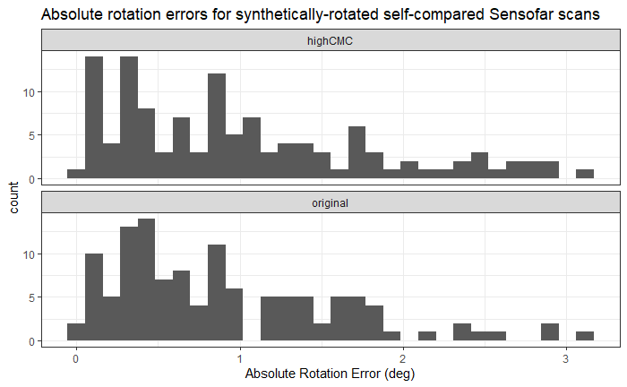
```

CMC count distribution for this experiment:

```{r}
knitr::include_graphics("images/cartridge_cases/4-12-21_update/cmcCountDistributions_selfComparisons_randomRotation.png")
```


Downsampling scheme:

```{r}

```

Downsampled, no rotation comparison: True angle (0 degrees) is well-estimated here.

```{r}

```

CMC count distribution for this experiment (little difference from above)

```{r}

```


Downsampled, synthetically rotated comparison: Synthetic angles are well-estimated here.

```{r}
knitr::include_graphics("images/cartridge_cases/4-12-21_update/estimatedAngles_sensofarGroup4_offsetCopies_randomRotation.png")
```

CMC count distribution for this experiment (again, very little change from 2 previous CMC count distributions).

```{r}
knitr::include_graphics("images/cartridge_cases/4-12-21_update/cmcCountDistributions_selfComparisons_randomRotation.png")
```


The plot below shows relationship between the CMC similarity score and the estimated rotation error. There is a slight negative relationship (not statistically significant, however) that is most noticable for the original method's CMC counts. We would anticipate such a negative relationship (i.e., poorly aligned scans should not have large CMC counts).

```{r}
knitr::include_graphics("images/cartridge_cases/4-12-21_update/cmcCount_on_rotationError_scatterplot.png")
```


</details>

<details>
<summary>
Joe 4/19/21: We have been running more experiments to diagnose situations in which the CMC method fails to identify known match pairings. This week, I worked on an experiment comparing a scan to a "combined" scan
</summary>

For two scans $A$ and $B$ and some $p \in [0,1]$, we compare $A$ to $pA + (1-p)B$. An example of a combined scan for $p = i/10, i = 0,...,10$ is shown in the animation below. 

```{r}
knitr::include_graphics("images/cartridge_cases/4-19-21_update/convexCombinationAnimation.gif")
```


Presumably, the CMC counts will be large for $p = 1$ and degrade as $p \to 0$. This appears to be the case, in general, as evidenced by the following plot. This shows the CMC counts for comparing 15 scans to a convex combination of itself with a known match scan for $p \in \{i/10\}_{i = 0,...,10}$. The blue line tracks the average CMC count per value of $p$. We see that the CMC counts degrade quickly.

```{r}
knitr::include_graphics("images/cartridge_cases/4-19-21_update/sensofarGroup4_convexCombinationCMCCounts.png")
```

</details>


<details>
<summary>
Joe 4/25/21 Spotlight: The CMC method consistently does a great job of identifying when a scan is compared to itself (which is obviously the bare-minimum we would want out of a method). However, the method seems to struggle in identifying actually matching pairs (outside of the Fadul dataset, which we're trying to get away from). We have been running a variety of experiments to diagnose situations in which the CMC method fails to identify known match pairings. I will share some interesting results/insights here.
</summary>

**Experiment 1: Downsampled/"synthetically" rotated copies**

We began by considering how we might inject a small amount of variability into the values of the cartridge case scan to determine the robustness of the CMC method. First, we compared downsampled "copies" of the same scan to each other.

Downsampling scheme:

```{r,fig.align='center'}

```


Additionally, we rotated these copies by a randomly generated angle to determine how well the CMC method could estimate the "true" rotation.

```{r,fig.align='center'}
knitr::include_graphics("images/cartridge_cases/4-12-21_update/cmcCountDistributions_offsetCopies_randomRotation.png")
```

The plot below shows the values of $|\hat{\theta}_i - \theta_i|$ for $i = 1,...,180$ comparisons (4 downsampled copies of each scan * 15 scans * 2 comparison directions = 180). The takeaway of this plot is that the true rotations are well-estimated here.

```{r,fig.align='center'}
knitr::include_graphics("images/cartridge_cases/4-12-21_update/estimatedAngles_sensofarGroup4_offsetCopies_randomRotation.png")
```

**Experiment 2: Convex Combination Comparisons**

For two scans $A$ and $B$, we compare $A$ to a new scan $C \equiv p*A + (1-p)*B$ for $p \in [0,1]$. Presumably, the CMC count should be high for $p = 1$ (where only $A$ is contributing to the combination) and decrease as $p \to 0$. The plot below shows the transition of scan $C$ from being an exact copy of $A$ to an exact copy of $B$.

```{r,fig.align='center'}
knitr::include_graphics("images/cartridge_cases/4-19-21_update/convexCombinationAnimation.gif")
```

Do form the convex combination scan, I first manually aligned each scan using a Shiny app I created. Of note here is that, even after aligning, the two surfaces do not perfectly overlap. To form the convex combination scans, I decided to only consider overlapping regions of the two scans. This decision does appear to effect the final CMC results, as will be discussed below.

```{r,fig.align='center',eval = FALSE}
knitr::include_graphics("images/cartridge_cases/4-26-21_Spotlight/alignmentShinyApp.PNG")
```

We considered a set of 15 known match pairs. For each pair, consisting of scans $A$ and $B$ say, we calculated the CMCs comparing $A$ to $C \equiv p*A + (1 - p)*B$ for $p = i/10, i = 0,...,10$ under the Original and High CMC methods. There are 15 black lines below that show the trajectory of the CMC counts per $A$ to $C$ comparison. The blue line tracks the average CMC count per value of $p$. Recall that $p = 1$ means that only scan $A$ is contributing to the combined scan $C$. As such, the right-hand sides of these plots show the CMC results when $A$ is essentially compared to itself. As $p \to 0$, the CMC counts decrease fairly monotonically. Of note here is (1) the High CMC method appears to yield larger CMC counts, on average, than the Original method (this isn't new information), (2) somehow the High CMC results seem better, on average, for $p = .9$ than $p = 1$, which is somewhat pathological, and (3) the CMC results for $p$ close to 0 are considerably worse than if we just compare the "raw" versions of scan $A$ to scan $B$ (i.e., not considering only the overlap).

```{r,fig.align='center'}
knitr::include_graphics("images/cartridge_cases/4-19-21_update/sensofarGroup4_convexCombinationCMCCounts.png")
```

*An interesting pattern in Experiment 2*

There seems to be an effect of only considering the overlapping pixels in each scan in Experiment 2. To illustrate this, consider the following example where a known match pair (Sensofar Group 4 scans #4 and #6) are compared. The first plots below show the CMC results if the non-overlapping pixels are included after aligning. We can see that there are a fair number of High CMCs. 

```{r,fig.align='center',eval = FALSE}
knitr::include_graphics("images/cartridge_cases/4-26-21_Spotlight/nonOverlapIncluded_originalScans.png")

knitr::include_graphics("images/cartridge_cases/4-26-21_Spotlight/nonOverlapIncludedCMCPlot.png")
```

Compare this to the scans where only the overlapping pixels are considered after alignment. We can see that there are no High CMCs assigned to this comparison. 

```{r,fig.align='center',eval = FALSE}
knitr::include_graphics("images/cartridge_cases/4-26-21_Spotlight/overlapOnly_originalScans.png")

knitr::include_graphics("images/cartridge_cases/4-26-21_Spotlight/overlapOnly_cmcPlot.png")
```

One seemingly well-evidenced hypothesis we have as to why considering non-overlapping pixels yields better CMC results is that the non-overlapping pixels are most often on the "edges" of the breech face impression surface. The height values at these edge pixels are oftentimes larger in magnitude than those of pixels on the surface interior. We have noticed that the CCF naturally "attracts" to large-magnitude values even if those values are not a part of an identifying breech face mark (e.g., if a pixel is a part of the natural roll-off of the cartridge case primer - see the purple pixels on the outer-edge of the scans above). By considering the non-overlapping pixels in each scan, even though such pixels cannot be a part of a shared breech face marking between the two scans, we are including a "loud signal" that the CCF, and consequently the individual cells, attract to (see e.g., the cluster of cells in the bottom-left corner of scan "P0006 Nonoverlap Included" above as an example). In removing these "loud signals" from the scan, the CMC method appears to suffer.

We might summarize the discussion above as running into "boundary effects" that detrimentally affect the CMC results. To that end, the next experiment we performed was aimed at handling these boundary effects.

**Experiment 3: Edge Erosion**

```{r,fig.align='center',eval = FALSE}
knitr::include_graphics("images/cartridge_cases/4-26-21_Spotlight/labeledScanExample.png")
```


```{r,fig.align='center',eval = FALSE}
knitr::include_graphics("images/cartridge_cases/4-26-21_Spotlight/edgeErosionScan_originalScans.png")
```

The matrix of CMC values that yielded the best results for the edge-eroded scans is shown below. Although these results look good, it should be noted that the results are quite sensitive to small changes in the translation/correlation thresholds.

```{r,fig.align='center',eval = FALSE}
knitr::include_graphics("images/cartridge_cases/4-26-21_Spotlight/group4_edgeErosionHighCMCs.png")
```


We are interested not only in determing how well the CMC method performs on a particular data set, but also in how generalizable a particular set of processing conditions is to new data. We have introduced a "variance ratio" statsitic that aims to quantify how separated the "known match" and "known non-match" CMC count distributions are from each other. Let C$_{ij}$ denote the CMC count assigned to the $j$th cartridge case pair, $j = 1,...,n_i$, $n_1 = 63, n_2 = 717$, from the $i$th group, $i = 1,2$ representing matches and non-matches, respectively. For each set of thresholds we calculate the **Variance Ratio** $r$ as: 
$$
r = r\left(T_x, T_y, T_\theta, T_{\text{CCF}}\right) = \frac{\sum_{i=1}^2 \left(\overline{C}_{i.} - \overline{C}_{..}\right)^2}{\sum_{i=1}^2 \frac{1}{n_i - 1}\sum_{j=1}
^{n_i} \left(C_{ij} - \overline{C}_{i.}\right)^2}
$$ 
where $\overline{C}_{i.}$ denotes the within-group CMC count average and $\overline{C}_{..}$ denotes the grand CMC count average. Greater separation between and less variability within the match and non-match CMC count distributions yields larger $r$ values. Larger values of $r$ are therefore indicative of greater separation between the groups.

We can consider the behavior of the variance ratio statistic across various parameter settings to determine how well the CMC method distinguishes matches from non-matches. 

```{r,fig.align='center',eval = FALSE}
knitr::include_graphics("images/cartridge_cases/4-26-21_Spotlight/edgeErosion_varianceRatioPlot.png")
```

</details>


<details>
<summary>
Joe 5/24/21 Update: I have been developing additional preprocessing techniques to more effectively emphasize the interior breech face markings between two scans.

</summary>

I have been developing additional preprocessing techniques to more effectively emphasize the interior breech face markings between two scans. This includes an automatic method for removing "anomaly" markings (dents, etc.) like the one visible in the scan shown below. It is important to remove such anomalies because (1) they are not shared across known match scans and (2) the CMC method is rather sensitive to these extreme values.

```{r,fig.align='center'}
knitr::include_graphics("images/cartridge_cases/5-24-21_update/P0009_anomaly.png")
```

Outright removing these anomaly pixels from the scan yields promising improvements when compared to known matches. In the future, I would like to consider imputing the missing values rather than outright removing them.

```{r,fig.align='center'}
knitr::include_graphics("images/cartridge_cases/5-24-21_update/P0009_anomalyRemoved.png")
```

</details>

<details>
<summary>
Joe 6/7/21 Update: We discovered a potential problem in the labeling of a well-known cartridge case data set. I was hoping to get the group's thoughts on how we should proceed if, in fact, the labeling occurred in the original experiment.
</summary>

We have been working with cartridge cases from a study done in 2014 by Baldwin et al. that assessed the False Positive and False Negative error rates in cartridge case comparisons.

As we have been applying the CMC method to more cartridge case scans, we came across an potential mislabeling of a set of cartridge case scans. The plot below illustrates the odd behavior. Note that the Group 7 scans from Barrels G and K seem to be highly similar to the Barrels K and G scans, respectively, in the other groups. That is to say, the G and K barrel labels for Group 7 may have been accidentally swapped.

```{r,fig.align='center'}
knitr::include_graphics("images/cartridge_cases/6-7-21_update/sensofarGroup9_cmcMatrix.png")
```

- I did not find anything to suggest that the label swapping is happening in my code.

- During our Monday morning meeting, we double-checked the original labeling performed at CSAFE. The possible mislabeling does not appear to have originated there (although there are few other leads we can track down to ensure that this is the case).

The only other possibility is that the mislabeling occurred during the **original** 2014 Baldwin study, which would obviously be problematic. If this is the case, we thought of a few potential actions:

1. Swap the labels to what we believe to be correct and mention this in whatever article we eventually use these data in

2. Exclude these 6 problematic cartridge case scans from our comparisons

3. Alert Baldwin et al. that there was a labeling mismatch

I would love to hear the groups' thoughts on how we should tackle this problem.

</details>

<details>
<summary>
Joe 8/9/21 Spotlight: I'll discuss improvements to the validation pipeline that we've been developing to compare cartridge case matching algorithms.
</summary>

Cartridge case comparison methods start with two cartridge case scans and end with a similarity score. This similarity score must be interpreted relative to similarity scores calculated between other scans, both known matches and known non-matches, to determine whether it is indicative of a matching or a non-matching pair.

The similarity score we've been predominately analyzing so far is the number of Congruent Matching Cells (CMC). One of the major drawbacks of the CMC method is that it relies on a large number of parameters that individually require tuning to work well. This (1) requires a lot of time to tune these parameters and (2) makes the method highly sensitive to changes in the characteristics of scans. So far, CMC papers have focused on using a relatively small set of scans from Fadul et al. to "validate" a particular CMC method. Authors prove that their method "works" to classify matches and non-matches amongst this small set of scans without a broader discussion of the process by which they tuned the underlying parameters or the method's sensitivity to, for example, new data.

A few months ago we started using scans taken at CSAFE from a study conducted by Baldwin et al. Initial experiments with these scans proved that the CMC method behaved quite differently than it did on the Fadul scans. So far, we have 90 manually-processed scans from this study (with more on the way). The number of scans per barrel is summarized below.

| Barrel | # of CCs |
| --- | --- |
| A | 3 |
| B | 3 |
| C | 3 |
| D | 3 |
| E | 3 |
| F | 9 |
| G | 9 |
| H | 9 |
| J | 9 |
| K | 9 |
| R | 6 |
| S | 6 |
| T | 6 |
| U | 6 | 
| V | 6 |

We've spent a good deal of energy trying to determine why this might be the case and how we might improve the method. To alleviate the problem of manually choosing a "good" set of parameters, as has seemingly been done in previous CMC papers, we introduce a validation scheme to "learn" parameters based on a train set and assess their effectiveness against a test set. To begin, we randomly select some number of barrels from the table above as the training set and set the rest aside for testing. A procedure to "learn" parameters from the training data is shared below. Note that it references the CMC method to calculate the similarity score, although we can use this with any similarity score method.

1. Calculate the CMC count over a grid of parameter values for all training comparisons.

2. Choose the set of parameters that optimize some metric.

- We might choose to just optimize the classification error. An alternative metric is the variance ratio. In the case of CMC counts, $C_{ij}$ where $i = 1,2$ indexes matches vs. non-matches and $j = 1,...,n_i$ represents the number of matches/non-matches, the variance ratio is:
$$
r = \frac{\sum_{i=1}^2 \left(\overline{C}_{i} - \overline{C}\right)^2}{\sum_{i=1}^2 \frac{1}{n_i - 1}\sum_{j=1}^{n_i} \left(C_{i,j} - \overline{C_i\right)^2}
$$

3. Define a CMC count boundary to classify "matches" from "non-matches" using the CMC counts associated with the parameters selected in 2.

- For example, choose the halfway point between $\bar{C}_{1 \cdot}$ and $\bar{C}_{2 \cdot}$ as the decision boundary.

We can wrap all of this into a $k$-fold cross-validation scheme to obtain an estimate of the expected prediction error.

Below is an example showing the CMC results from two different settings of the algorithm. We can see that they both result in an AUC of 1, yet the variance ratio statistic is larger for the CMC count distributions that are more spread-out. Hence, the variance ratio statistic makes sense as an optimization criterion for choosing the "best" parameters.

```{r}
knitr::include_graphics("images/cartridge_cases/8-9-21_spotlight/varianceRatioExample.PNG")
```


The training set consists of all scans fired from 3 randomly-selected barrels. These barrels are T, F, and J meaning the training data consists of 24 scans. The remaining 66 scans make up the test set. 

Below is the training confusion matrix after applying the above parameter selection method. The selected CMC count cutoff was 3.5 CMCs (between 3 and 4 CMCs, that is).

| | Predicted Match | Predicted Non-Match |
| --- | --- | --- |
| **Actual Match** | 48 | 39 |
| **Actual Non-Match** | 0 | 189 |

The test data confusion matrix using the learned parameters is shown below. 

| | Predicted Match | Predicted Non-Match |
| --- | --- | --- |
| **Actual Match** | 94 | 89 |
| **Actual Non-Match** | 40 | 1922 |

Note that the false positive rate is low (which may be preferred in an "innocent until proven guilty" legal paradigm), yet the false negative rate is dismally high. This suggests that our pipeline isn't capturing similar markings between two truly matching scans as we would like.

I've spent much of this summer implementing an alternative method to the CMC method. We're still working on a nice name, but we'll refer to it for now as a "cell correlation" method. The method is as follows. For two cartridge case scans, call them the "reference" and "target" scans,

1. Translate and rotate the target scan to be aligned with the reference scan.

2. Divide the scans into a grid of 8x8 cells.

3. Calculate the correlation between each pair of cells.

4. Flip the target scan and divide it again into a grid of 8x8 cells

5. Calculate the correlation between each cell pair, now between the reference and the flipped target.

6. Rank the correlation values and calculate the Wilcoxon Rank-Sum statistic.

7. Use this as the similarity score to classify matches vs. non-matches.

The major benefit of this method over the CMC method is that it requires significantly fewer parameters than the CMC method. Additionally, there are well-established tables and theoretical results (albeit under independence assumptions not necessarily met in this situation) related to the Wilcoxon Rank-Sum statistics allowing the calculation of either small sample or asymptotic p-values. 

We have some promising preliminary results such as the p-values shown below between a set of 7 scans (all of the orange p-values correspond to matches, the white/gray to non-matches), although there are a few obstacles in properly implementing this method at a larger scale.

```{r}
knitr::include_graphics("images/cartridge_cases/8-9-21_spotlight/correlationCellPValues.png")
```


The major obstacle with properly implementing this method is step 1 above; aligning the two scans. We've come up with a few methods to align two scans including "automatic" alignment based on estimating translations and rotation and using an app that shows the overlay of two scans to align. However, to validate the automatic method takes manual inspection which, for the large number of scans that we hope to eventually analyze, isn't going to be realistic. Additionally, there are some truly matching scans that are either extremely difficult or impossible to visually align such as the example below.

```{r}
knitr::include_graphics("images/cartridge_cases/8-9-21_spotlight/inconclusiveMatchExample.png")
```


We've also run into some pathological results where the automatic method clearly doesn't align two matching scans correctly, yet the resulting similarity scores are higher than when the scans are manually-aligned.

I think there is still more that we can explore in terms of automatic alignment or, alternatively, calculating a similarity score across various rotations/translations of two scans. We also need to explore more of the parameter space for this cell correlation method.

</details>

<details>
<summary>
Joe 9/13/21 Update: I've been working on organizing our various additions/alterations to the CMC method in a pipeline diagram.
</summary>

I've been working on organizing our various additions/alterations to the CMC method in a pipeline diagram. Below is the most recent version of the pipeline.

```{r}
knitr::include_graphics("images/cartridge_cases/9-13-21_uodate/pipelineDiagram_9-9-21.jpg")
```


This exercise has simultaneously illuminated some areas of the parameter space that could be explored a bit more carefully. Consequently, I have been running a number of "experiments" to explore these areas of the parameter space.

</details>

<details>
<summary>
Joe 9/27/21 Update: I've been working on incorporating the reviewer comments into our cmcR paper. I've also been working on various improvements to the current CMC methodology including a parametric model for the CMC counts.
</summary>

```{r}

```


</details>

<details>
<summary>
Joe 10/4/21 Update: On top of re-writing the cmcR paper and running the CMC method on a large set of TopMatch scans, I have also been trying formulate a model for the CMC counts that takes into account spatial dependence between cells in a particular comparison and the fact that any one cartridge cases among $N$ total scans is used in $N-1$ comparisons. I plan on spending part of my spotlight next week proposing a model and asking the group for feedback.
</summary>

```{r}

```


</details>

<details>
<summary>
Joe 10/11/21 Spotlight: I will discuss some recent CMC results and a model that I am putting together for CMC counts.
</summary>

**Large-scale CMC validation**

I will share results from running the CMC method on a large set of scans.

Following is the optimized confusion matrix on the training data. This is based on an optimized CMC count threshold of 6.19 (averaged) CMCs. The overall error rate is 3.8% with a Type I (false negative) error rate of 29.8% and a Type II (false positive) error rate of 1.1%.

| | Predicted Match | Predicted Non-Match |
| --- | --- | --- |
| **Actual Match** | 556 | 236 |
| **Actual Non-Match** | 83 | 7552 |

```{r,fig.align='center'}
knitr::include_graphics("images/cartridge_cases/10-11-21-spotlight/trainDataResults.png",dpi = 50)
```


Using parameters learned on the training data, the following is the test data confusion matrix. The overall error rate is 2.6% with a Type I error rate of 27.3% and a Type II error rate of 0.7%.

| | Predicted Match | Predicted Non-Match |
| --- | --- | --- |
| **Actual Match** | 2266 | 849 |
| **Actual Non-Match** | 302 | 41550 |

```{r,fig.align='center'}
knitr::include_graphics("images/cartridge_cases/10-11-21-spotlight/testDataResults.png",dpi = 50)
```

| Paper | Translation Thresh. (px) | CCF Thresh. | Theta Thresh. (deg) | CMC Thresh. | Error Rate (%) | False Pos. Rate (%) | False Neg. Rate (%) |
| --- | --- | --- | --- | --- | --- | --- | --- |
| Song et al. (2014) | 20 | 0.6 | 6 | 6 | 3.7 | 0.06 | 53.3 |
| Song et al. (2018) | 20 | 0.5 | 6 | 6 | 3.1 | 0.6 | 36.1 |
| Optimized CMC | 10 | 0.35 | 6 | 5.5 | 2.9 | 0.8 | 30.3 |
| Averaged Optimized CMC | (10,10,15) | (0.3,0.35,0.35) | 6 | 6.11 | 2.6 | 0.7 | 27.3 |


**Bayesian CMC Dependency Model**

I will describe a model that I've been developing for the CMC counts that take into account dependencies between CMC scores. I am interested in hearing the group's thoughts on the model and if they would propose any changes.

```{r,fig.align='center'}
knitr::include_graphics("images/cartridge_cases/10-11-21-spotlight/gmrf_dependencyDiagram.png",dpi = 50)
```


Let $i,j$ index $S$ scans (cartridge cases), $i,j = 1,...,S$. 
Denote a comparison between scan $i$ and scan $j$ as $i,j$.
Define function $b(\cdot)$ that maps a scan index to the barrel from which it was fired (e.g., $b(i) = A$ if scan $i$ originated from barrel $A$).
Let $\pmb{y}_{i,j} \in \{0,1\}^{N_{i,j}}$ be the vector of CMC results for the comparison $i,j$ where $N_{i,j}$ is the total number of cells in comparison $i,j$.
Identify a particular cell in comparison $i,j$ with its row/column index $[k,l]$, $k = 1,...,R_{i,j}$ and $l = 1,...,C_{i,j}$.

Then let $y_{i,j,[k,l]} \in \pmb{y}_{i,j}$ be the CMC result for cell $[k,l]$ of comparison $i,j$.
Assume $y_{i,j,[k,l]} | p_{i,j,[k,l]} \sim$ Bernoulli$(p_{i,j,[k,l]})$ where
$$
\text{logit}(p_{i,j,[k,l]}) = \alpha_0 + \alpha_{b(i)} + \alpha_{b(j)} + \gamma_{b(i)b(j)} + f_u(u_i) + f_u(u_j) + f_s(s_{[k,l]}).
$$

We might refer to this model as a *generalized linear mixed latent Gaussian Markov random field model* with Bernoulli likelihood. Sampling from this model can be accomplished using INLA (Integrated Nested Laplace Approximations).

*Mixed Effect Terms*

$\alpha_i, \alpha_j$ are fixed-effect parameters representing the effect of the barrels from which cartridge cases $i$ or $j$ originated (so $\alpha_i = \alpha_j$ if cartridge case $i$ and $j$ originated from the same barrel). 
$\gamma_{ij}$ is the fixed-effect interaction between the barrels from which $i$ and $j$ originated.
We assume that these have vague Gaussian priors with mean 0 (maybe?) and known precision (maybe?).

$f_u(u_i)$ and $f_u(u_j)$ are [u]nustructured random-effect parameters intended to account for the fact that we observe multiple CMC scores from scans $i$ and $j$ (repeated measures).
Assume that $f_u(u_i)$ and $f_u(u_j)$ are conditionally independent and distributed $N(0,\tau_u^{-1})$ given precision $\tau_u$ for $i,j = 1,...,S$.
These unstructured random terms thus behave as random intercepts.

*Spatial Terms*

```{r,fig.align='center'}
knitr::include_graphics("images/cartridge_cases/10-11-21-spotlight/CMCneighborhoodExample.png",dpi = 50)
```

Finally, $f_s(s_{[k,l]})$ is a [s]patially structured term intended to account for spatial correlation between neighboring cells (or sites, hence the $s$).
Assume that the sites $f_s(\pmb{s})$ follow a "Besag" distribution defined by
$$
f_s(s_{[k,l]}) | f_s(\pmb{s}_{-[k,l]}), \tau_s \sim N\left(\frac{1}{n_{[k,l]}} \sum_{[k,l] \sim [m,n]} f_s(s_{[m,n]}), \frac{1}{n_{[k,l]} \tau_s}\right)
$$
where $n_{[k,l]}$ is the number of neighbors of node $[k,l]$ and $[k,l] \sim [m,n]$ indicates that two nodes $[k,l]$ and $[m,n]$ are neighbors. We will assume a 3x3 neighborhood structure except for cells on the boundaries of the scan.


</details>

<details>
<summary>
Joe 11/26/21 Spotlight: I will discuss some recent developments of the CMC method and the random effects model that I have been developing for the CMC counts.
</summary>

**Density-based Clustering for CMC Features**

Here, I will discuss a new classification method using the CMC features that relies on density-based clustering. To recap, the CMC method involves partitioning a scan into a grid of cells, for example 8x8 as shown in the diagram below, and comparing each cell to a region in another scan. In particular, we maximize the cross-correlation function to estimate the horizontal and vertical translations needed to best align each cell in the other scan. We then repeat the process for various rotations of one of the two scans.

```{r,echo=FALSE,fig.align='center'}
knitr::include_graphics("images/cartridge_cases/11-29-21_Spotlight/cmc_illustration.PNG")
```

The animation shows the (x,y) translation pairs for each cell in the comparison between two matching scans for different rotations of the x3p2 scan. We can see that the (x,y) pairs appear to come to a consensus when $\theta = 0$. This is evidence that the two scans match.

```{r,echo=FALSE,fig.align='center'}

```

The diagram below shows a side-by-side comparison of the (x,y) values across various rotations for a match and non-match comparison. The match comparison shows the same data as the animation above. Again, we can see a consensus of the (x,y) values is achieved when $\theta = 0$. For the non-match comparison, I used a KDE to determine the rotation ($\theta = 18$) at which the (x,y) values achieve the highest density value. In contrast to the match example, there doesn't appear to be a consensus reached amongst the (x,y) values at this rotation.

```{r,message=FALSE,warning=FALSE,echo = FALSE,fig.align='center'}
library(tidyverse)
require(patchwork)

load("images/cartridge_cases/11-29-21_Spotlight/K002eG1_vs_K009gG1.RData")

compData_match <- compData

load("images/cartridge_cases/11-29-21_Spotlight/K002eG1_vs_K002yF1.RData")

compData_nonmatch <- compData

rm(compData)

plt1 <- compData_match %>%
  filter(direction == "refToTarget") %>%
  filter(theta %in% -6:6) %>%
  filter(pairwiseCompCor > .3) %>%
  ggplot(aes(x = x,y = y)) +
  geom_point() +
  coord_fixed() +
  facet_wrap(~ theta,nrow = 1,
             labeller = label_both) +
  theme_bw() +
  labs(subtitle = "(x,y) values per rotation, Match example") +
  xlim(-75,75) +
  ylim(-80,80)

plt2 <- compData_nonmatch %>%
  filter(direction == "refToTarget") %>%
  filter(theta %in% 12:24) %>%
  filter(pairwiseCompCor > .3) %>%
  ggplot(aes(x = x,y = y)) +
  geom_point() +
  coord_fixed() +
  facet_wrap(~ theta,nrow = 1,
             labeller = label_both) +
  theme_bw() +
  labs(subtitle = "(x,y) values per rotation, Non-Match example") +
  xlim(-75,75) +
  ylim(-80,80)

plt1 / plt2
```

The diagrams below show a side-by-side comparison of the match and non-match example at the highest-density rotation, respectively. The kernel-estimated density values formalizes the notion of a "consensus" being reached amongst the different (x,y) values.

```{r,echo=FALSE,fig.align='center'}
kdeFit <- MASS::kde2d(x = compData_match %>%
                        filter(direction == "refToTarget") %>%
                        filter(theta == 0) %>%
                        filter(pairwiseCompCor > .3) %>%
                        pull(x),
                      y = compData_match %>%
                        filter(direction == "refToTarget") %>%
                        filter(theta == 0) %>%
                        filter(pairwiseCompCor > .3) %>%
                        pull(y),n = 100)

plt1 <- compData_match %>%
  filter(direction == "refToTarget") %>%
  filter(theta == 0) %>%
  filter(pairwiseCompCor > .3) %>%
  ggplot() +
  geom_tile(data = expand.grid(x = kdeFit$x,y = kdeFit$y) %>%
              mutate(z = c(kdeFit$z)),
            aes(x = x,y = y,fill = z)) +
  geom_point(aes(x = x,y = y),alpha = .5) +
  coord_fixed() +
  facet_wrap(~ theta,nrow = 1,
             labeller = label_both) +
  scale_fill_gradient(low = "white",high = "orange") +
  theme_bw() +
  guides(fill = guide_colorbar(title = "Density")) +
  theme(panel.grid = element_blank()) +
  labs(subtitle = "(x,y) density at highest-density rotation,\nMatch example") +
  xlim(-80,80) +
  ylim(-80,80)

kdeFit <- MASS::kde2d(x = compData_nonmatch %>%
                        filter(direction == "refToTarget") %>%
                        filter(theta == 18) %>%
                        filter(pairwiseCompCor > .3) %>%
                        pull(x),
                      y = compData_nonmatch %>%
                        filter(direction == "refToTarget") %>%
                        filter(theta == 18) %>%
                        filter(pairwiseCompCor > .3) %>%
                        pull(y),n = 100)

plt2 <- compData_nonmatch %>%
  filter(direction == "refToTarget") %>%
  filter(theta == 18) %>%
  filter(pairwiseCompCor > .3) %>%
  ggplot() +
  geom_tile(data = expand.grid(x = kdeFit$x,y = kdeFit$y) %>%
              mutate(z = c(kdeFit$z)),
            aes(x = x,y = y,fill = z)) +
  geom_point(aes(x = x,y = y),alpha = .5) +
  coord_fixed() +
  facet_wrap(~ theta,nrow = 1,
             labeller = label_both) +
  scale_fill_gradient(low = "white",high = "orange") +
  theme_bw() +
  guides(fill = guide_colorbar(title = "Density")) +
  theme(panel.grid = element_blank()) +
  labs(subtitle = "(x,y) density at highest-density rotation,\nNon-Match example") +
  xlim(-80,80) +
  ylim(-80,80)

plt1 + plt2
```

The original CMC method performs an approximate version of this "consensus finding" procedure. In particular, the CMC method requires that only those (x,y) pairs that are within some $T_x, T_y$ threshold, respectively, of the median (x,y) value be considered as Congruent Matching Cells. Visually, this can be interpreted as drawing a box around the median (x,y) value and including all points that fall within that box. From the perspective of finding a consensus, this method (1) assumes that the median will be close to the mode (which is more appropriate for a consensus) and (2) requires setting an arbitrary $T_x, T_y$ to which it is heavily sensitive.

```{r,echo=FALSE,fig.align='center'}
plt1 <- compData_match %>%
  filter(direction == "refToTarget") %>%
  filter(theta == 0) %>%
  filter(pairwiseCompCor > .3) %>%
  mutate(xmed = median(x),
         ymed = median(y)) %>%
  ggplot() +
  geom_point(aes(x = x,y = y),alpha = .5) +
  coord_fixed() +
  facet_wrap(~ theta,nrow = 1,
             labeller = label_both) +
  geom_point(aes(x = xmed,y = ymed),shape = 4,colour = "orange",size = 5) +
  geom_rect(aes(xmin = xmed - 20,xmax = xmed + 20,ymin = ymed - 20,max = ymed + 20),colour = "orange",fill = NA) +
  theme_bw() +
  labs(subtitle = "Original CMC Method Classification,\nMatch example") +
  xlim(-80,80) +
  ylim(-80,80)

plt2 <- compData_nonmatch %>%
  filter(direction == "refToTarget") %>%
  filter(theta == 18) %>%
  filter(pairwiseCompCor > .3) %>%
  mutate(xmed = median(x),
         ymed = median(y)) %>%
  ggplot() +
  geom_point(aes(x = x,y = y),alpha = .5) +
  coord_fixed() +
  facet_wrap(~ theta,nrow = 1,
             labeller = label_both) +
  geom_point(aes(x = xmed,y = ymed),shape = 4,colour = "orange",size = 5) +
  geom_rect(aes(xmin = xmed - 20,xmax = xmed + 20,ymin = ymed - 20,max = ymed + 20),colour = "orange",fill = NA) +
  theme_bw() +
  labs(subtitle = "Original CMC Method Classification,\nNon-Match example") +
  xlim(-80,80) +
  ylim(-80,80)

plt1 + plt2
```

The DBSCAN (density-based clustering of applications with noise) algorithm is an unsupervised clustering method proposed in Ester et al. in 1996. The method assigns clusters based on points that are "close" to one another. Whether two points are "close" to each other depends on whether they are within some distance $\epsilon$ of each other. If so, then these points are called "directly reachable" to each other. In the diagram below, the circles around each point are of radius $\epsilon$. To ensure that points are assigned to clusters of reasonable size (e.g., no clusters of size 2), we only define a cluster if there are at least $minPts$ points that are directly reachable. In the diagram below, $minPts = 4$. All points that are directly reachable to 4 other points (including themselves) are called "core points" and are colored red. A new cluster is formed from these core points. Additionally, points that are directly reachable to at least one core point, such as points $B$ and $C$, are also included in the cluster. Point $N$ is classified as a "Noise" point because it is not directly reachable to any other of the other points.

```{r,fig.align='center'}
knitr::include_graphics("images/cartridge_cases/11-29-21_Spotlight/400px-DBSCAN-Illustration.svg.png",dpi = 100)
```

The DBSCAN algorithm is useful in this context because it doesn't require the user to set the number of clusters ahead of time and permits the definition of "noise" points that do not belong to any cluster. Below is an example of the cluster assignments in the match and non-match examples shown above with $\epsilon = 5$ and $minPts = 5$. In the match example, there are 12 points assigned to Cluster 1 and 17 noise points. All 29 points in the non-match examples are classified as noise points.

```{r,fig.align='center'}
load("images/cartridge_cases/11-29-21_Spotlight/dbscanClusters_match.RData")

load("images/cartridge_cases/11-29-21_Spotlight/dbscanClusters_nonmatch.RData")

plt1 <- compData_match %>%
  filter(direction == "refToTarget" & theta == 0) %>%
  filter(pairwiseCompCor > .3) %>%
  mutate(cluster = factor(dbscanClusters_match$dbscan[[1]]$cluster,levels = c(1,0),labels = c("Cluster","Noise Point"))) %>%
  # mutate(cluster = ifelse(cluster == 1,"Cluster","Noise Point")) %>%
  ggplot(aes(x = x,y=y,colour=cluster)) +
  geom_point() +
  theme_bw() +
  coord_fixed() +
  guides(colour = guide_legend(title = NULL)) +
  scale_colour_manual(values = c("blue","red")) +
  labs(subtitle = "DBSCAN Cluster Assignments,\nMatch example") +
  xlim(-80,80) +
  ylim(-80,80)

plt2 <- compData_nonmatch %>%
  filter(direction == "refToTarget" & theta == 18) %>%
  filter(pairwiseCompCor > .3) %>%
  mutate(cluster = factor(dbscanClusters_nonmatch$dbscan[[1]]$cluster,levels = c(1,0),labels = c("Cluster","Noise Point"))) %>%
  # mutate(cluster = ifelse(cluster == 1,"Cluster","Noise Point")) %>%
  ggplot(aes(x = x,y=y,colour=cluster)) +
  geom_point() +
  theme_bw() +
  coord_fixed() +
  guides(colour = guide_legend(title = NULL)) +
  scale_colour_manual(values = c("red")) +
  labs(subtitle = "DBSCAN Cluster Assignments,\nNon-Match example") +
  xlim(-80,80) +
  ylim(-80,80)

plt1 + plt2
```

In summary, we have transformed the feature space from (x,y) to cluster membership. Depending on the parameters of the DBSCAN method, there were upwards of 14 clusters assigned to a single comparison. Combining this with the fact that we actually consider the CMC features in *both* directions (x3p1 cells compared to x3p2 and vice versa), the feature space can be quite high-dimensional. As such, I've handed the cluster assignment features to a random forest to sort out (as opposed to defining my own cutoffs). The table below represents a data frame in which each row represents a single comparison where 3, 4, 5, etc. represent the number of points assigned to each cluster by DBSCAN. This is the data frame given to the random forest. I would be interested if anyone has any other ideas of how I can use the cluster assignments.

```{r,fig.align='center'}
data.frame(Comparison = c("K002eG1 vs. K009gG1","K002eG1 vs. K002yF1","..."),
           Type = c("Match","Non-match","..."),
           Noise = c(17,27,"..."),
           `Cluster 1` = c(12,0,"..."),
           `Cluster 2` = c(0,0,"..."),
           `...` = c("...","...","...")) %>%
  knitr::kable()
```

To assess the effectiveness of this method, I trained a random forest using the cluster assignment data for a set of 21945 comparisons. The confusion matrix for the training data based on this random forest is given below.

| | Predicted Match | Predicted Non-Match |
| --- | --- | --- |
| **Actual Match** | 1797 | 402 |
| **Actual Non-Match** | 55 | 19691 |

More importantly, I applied the trained random forest to test data consisting of cluster assignments for a set of 44967 comparisons. The confusion matrix for the test data based on this trained random forest is given below.

| | Predicted Match | Predicted Non-Match |
| --- | --- | --- |
| **Actual Match** | 2614 | 501 |
| **Actual Non-Match** | 137 | 41715 |

The table below shows a comparison of the error, false positive, and false negative rates for different methods including the CMC methods under different parameter settings on the test data. We can see that the DBSCAN method yields roughly half of the error as the "best" CMC method settings.

| Method | Error Rate (%) | False Pos. Rate (%) | False Neg. Rate (%) |
| --- | --- | --- | --- | --- | --- | --- | --- |
| Parameters from Song et al. (2014) |  3.7 | 0.06 | 53.3 |
| Parameters from Song et al. (2018) |  3.1 | 0.6 | 36.1 |
| Optimized CMC | 2.9 | 0.8 | 30.3 |
| Averaged Optimized CMC | 2.6 | 0.7 | 27.3 |
| DBSCAN Method | 1.4 | 0.3 | 16.1 |

**Random Effect Markov Random Field Model for CMC Counts**

I will describe a model that I've been developing for the CMC counts that take into account dependencies between CMC scores.

```{r,fig.align='center'}
knitr::include_graphics("images/cartridge_cases/11-29-21_Spotlight/gmrf_dependencyDiagram.png",dpi = 50)
```


**Model Structure**

Let $i,j$ index $S$ scans, $i,j = 1,...,S$. 
Denote a comparison between scan $i$ and scan $j$ as $i,j$.
Define function $b(\cdot)$ that maps a scan index to the barrel from which it was fired (e.g., $b(i) = A$ if scan $i$ originated from barrel $A$).
Let $\pmb{y}_{i,j} \in \{0,1\}^{N_{i,j}}$ be the vector of CMC results for the comparison $i,j$ where $N_{i,j}$ is the total number of cells in comparison $i,j$.
Identify a particular cell in comparison $i,j$ with its [row,column] index $[k,l]$.
<!-- , $k = 1,...,R_{i,j}$ and $l = 1,...,C_{i,j}$.  -->
Then let $y_{i,j,[k,l]} \in \pmb{y}_{i,j}$ be the CMC result for cell $[k,l]$ of comparison $i,j$.
Assume $y_{i,j,[k,l]} | p_{i,j,[k,l]} \sim$ Bernoulli$(p_{i,j,[k,l]})$ where
$$
\text{logit}(p_{i,j,[k,l]}) = \underbrace{\alpha_0}_{\text{Intercept}} + \underbrace{\beta_{b(i)} + \beta_{b(j)} + \gamma_{b(i)b(j)}}_{\text{Barrel-level R.E. w/ Inter.}} + \underbrace{\kappa_i + \kappa_j}_{\text{Scan-level R.E.}} + \underbrace{\lambda_{[k,l]}}_{\text{MRF Term}}.
$$

$\beta_{b(i)}, \beta_{b(j)}$ for barrels $b(i)$ and $b(j)$ are random-effect parameters accounting for the fact that we observe multiple CMC scores per barrel. $\gamma_{b(i)b(j)}$ is their interaction. $\kappa_i$ and $\kappa_j$ are random-effect parameters intended to account for the fact that we observe multiple CMC scores from scans $i$ and $j$. $\lambda_{[k,l]}$ accounts for spatial dependence by way of a Markov Random Field.

We assume independence between parameters and for $i = 1,...,S$, with $N(a,b)$ denoting a normal distribution with mean $a$ and variance $b$, the following priors:
\begin{align*}
\alpha_0 &\sim N(0,\tau_0^{-1}) \\
\log(\tau_0) &\sim Gam(1,0.00001) \\
\beta_{b(i)} &\overset{ind}{\sim} N(0,\tau_{b(i)}^{-1}) \\
\log(\tau_{b(i)}) &\overset{ind}{\sim} Gam(1,0.00005) \\
\gamma_{b(i)b(j)} &\overset{ind}{\sim} N(0,\tau_{b(i)b(j)}^{-1}) \\
\log(\tau_{b(i)b(j)}) &\overset{ind}{\sim} Gam(1,0.00005) \\
\kappa_i &\overset{ind}{\sim} N(0,\tau_{k,i}^{-1}) \\
\log(\tau_{k,i}) &\overset{ind}{\sim} Gam(1,0.00005).
\end{align*}

Finally, for the spatial term $\lambda_{[k,l]}$, define a "queen" neighborhood system $\mathcal{N}_{[k,l]} = \{\lambda_{m,n} : |m - k| \leq 1, |n - l| \leq 1 \text{ but } [m,n] \neq [k,l]\}$. For $\pmb{\lambda}_{-[k,l]} \equiv \{\lambda_{m,n} : m \neq k \text{ and } n \neq l\}$, we assume that

\begin{align*}
\lambda_{[k,l]} | \pmb{\lambda}_{-[k,l]}, \tau_l &\overset{ind}{\sim} N\left(\frac{1}{|\mathcal{N}_{[k,l]}|} \sum_{\lambda_{m,n} \in \mathcal{N}_{[k,l]}} \lambda_{[m,n]}, \frac{\tau_l^{-1}}{|\mathcal{N}_{[k,l]}|}\right) \\
\log(\tau_l) &\sim Gam(1,0.00005).
\end{align*}

</details>

<details>
<summary>
Joe 2/11/22 Update: We have been investigating various diagnostics for cartridge case comparison algorithms.
</summary>

We have been developing diagnostic tools for our cartridge case comparison algorithms.
One example of a diagnostic is a comparison plot used to visually compare two aligned patches.
These "patches" are the cells that the reference scan is partitioned into (on the left in the plot below) and a matrix of the same size in the target scan that the algorithm has found to align best.
Each cell you see in the reference scan has a corresponding aligned patch in the target scan, but a visualization like the plot below makes it difficult to compare two aligned patches directly.

```{r,echo = FALSE}

```

The plot below shows a "zoomed-in" version of the 3, 1 aligned patches. 
You can see some similarities between the markings on these patches.

```{r,echo = FALSE}
knitr::include_graphics("images/cartridge_cases/2-11-22_update/matchAlignedPatches.png")
```

However, it is still difficult to determine just how similar these two patches are using the above the zoomed-in plot.
As such, we have devised a grid of plots that effectively partition the two patches into "similarities" and "differences."
This grid can be seen below.
The two plots in the top row are the exact same as the zoomed-in plot above.
The second row shows the pixelwise averages between these two plots.
Not that some observations have been filtered out based on whether 

```{r,echo = FALSE}

```

We are currently exploring the calculation of various features based on these comparison plots.

</details>

<details>
<summary>
Joe 2/18/22 Update: This week, we have been working on extracting features based on the diagnostic plots that I briefly discussed last week. 
</summary>

Last week I introduced some diagnostic plots that we developed to assess how well a cell from one scan found a registration in another scan.
One of these diagnostics was visualizing the element-wise average between the two aligned "patches."
To emphasize the similarities in this average plot, we filtered-out elements whose absolute difference was greater than one standard deviation of all absolute differences.
For two well-aligned matching patches, it seems reasonable to assume that fewer elements will be filtered compared to non-matching patches.
More specifically, we might assume that the neighborhoods of filtered elements will be smaller for matching patches than non-matching.
An example of the filtered elements is shown below on the left.
Next to this plot is a labeling of the individual neighborhoods of filtered pixels using a connected components algorithm.
We can extract features from these labeled neighborhoods such as the size of each neighborhood.

```{r}
knitr::include_graphics("images/cartridge_cases/2-18-22_update/labeledBlobExample.pdf")
```


</details>

<details>
<summary>
Joe 3/4/22 Update: This week, I have been working more on the cartridge case comparison visual diagnostics paper.
</summary>

Below is an example of two comparison plots.
The first plot shows an aligned pair of patches from a matching pair of cartridge cases while the second is from a non-matching pair.
There are clearly more similarities between the aligned cells in the first plot compared to the second.
Our goal with this project is to develop features based on this observations - that matching patches should "look more similar" than non-matching patches.
We are still brainstorming different features that we can use to quantify these similarities, so we are open if anyone has any input or thoughts!

```{r}

```

```{r}

```


</details>


### Modified Chumbley non-random test
#### Land-to-land scores
The moified Chumbley non-random algorithm is a statistical non-parametric test that compares two signatures under consideration and gives a test statistic. The test statistic is used to make classifications and compute error rates based on different nominal type I levels. The basic principle behind the method is to first take two marking that have to be compared, choose a segment length which is a portion of the signature, and use this window segment to find which windows give the maximum correlation. The lag between these respective markings is computed based on the location of the two maximum correlation windows in the two markings. Now the algorithm works in two steps where first, lag congruent correlations between several smaller windows of the two markings are computed, this is called the same-shift. The second step serves the purpose of computing windows of correlation between the two signatures with window sized the same as the same-shift, but the with the purpose of finding correlations when the windows are not lag synchronized. The second step is called different shift step and has a specific order in which the pair of windows are chosen between which the correlations are to be computed. The different-shift serves as benchmark for comparison. It shows a set of bad correlations, against which the same-shift correlations are compared. A U-statistic is computed for the comparison based on the correlations in this procedure. 

The modified chumbley method [@gkhh] can work with two markings at a time. Therefore the method can be used for comparing signatures from one land to signature from another land. The land-to-land comparison was performed for Hamby 44 dataset from [@nist] and CSAFE [@gkhh] and associated error rates were computed for these comparisons.

#### Bullet-to-bullet scores

In this method we extend the modified chumbley non-random method from land-to-land scoring to bullet-to-bullet scoring. In order to do this, first 6 ordered pairs of lands between the two bullets are chosen for comparison. The modified chumbley method is used on these 6 pairwise comparisons. This results in the same-shift and different-shift comparisons from each of the 6 comparisons. We do not need a land-to-land pairwise U-statistics and classification in this method. Instead all the same-shift and different-shift correlations are now aggregated from the 6 comparisons and a new non-parametric U test is used on the aggregated sets. This gives a test statistic at the bullet level and consequently we can compute p-values. This is used with different nominal significance levels to identify bullet level error rates.


### CMPS Algorithm
#### Introduction to CMPS and Algorithm Summary

<details>
<summary>
This section provides an introduction and a summary of the Congruent Matching Profile Segments (CMPS) algorithm.
</summary>

The Congruent Matching Profile Segments (CMPS) method [Chen et al. 2019], in general, can be used for objective comparison of striated tool marks, but in our examples, we mainly use it for bullet profiles/signatures comparison. The CMPS number is expected to be large if two signatures are similar. So it can also be considered as a feature that measures the similarity of two bullets (yet another bullet feature).

Right now, we are developing a R package that implements the CMPS method [Chen et al. 2019]. The following sections will provide with a summary of the CMPS algorithm and examples on how to use the package. 

The development version of the package can be installed from [GitHub](https://github.com/) with:

``` r
# install.packages("devtools")
devtools::install_github("willju-wangqian/CMPS")
```

In this section we use a known match (KM) compasison to illustrate the main ideas of CMPS algorithm. The bullet data used here can be found in Chapter 3.5 of [Open Forensic Science in R](https://sctyner.github.io/OpenForSciR/bullets.html#case-study-1).

We can also run the following chunk. In this example, we are taking the signature of the third land engraved area (LEA) of the second bullet as the reference signature and the second LEA of the first bullet as the comparison signature. This is a KM comparison. 

```{r eval=FALSE, echo=TRUE}
library(CMPS)

data("bullets")
land23 <- bullets$sigs[bullets$bulletland == "2-3"][[1]]
land12 <- bullets$sigs[bullets$bulletland == "1-2"][[1]]

x <- land23$sig
y <- land12$sig

cmps <- extract_feature_cmps(x, y, full_result = TRUE)
cmps

# $CMPS.score
# [1] 14
# 
# $rec.position
# [1] -5
# 
# $pos.df
#   position cmps
# 1       -9   14
# 2       -8   14
# 3       -7   14
# 4       -6   14
# 5       -5   14
# 6       -4   14
# 7       -3   14
# 8       -2   14
# 9       -1   14
# 
# $nseg
# [1] 22

```

And we have the plot of `x` and `y`.

```{r, fig.cap="A KM Comparison, x and y", out.width="80%", fig.keep="hold", fig.align='center'}
include_graphics(c("images/cmps/step0.png"))
```

1. we take the first signature as the reference signature (`x`) and cut it into consecutive and non-overlapping basis segments of the same length. In this case, we have 22 basis segments in total.

```{r, fig.cap="Cut x into consecutive and non-overlapping basis segments of the same length. Only 4 basis segments are shown here", out.width="80%", fig.keep="hold", fig.align='center'}
include_graphics(c("images/cmps/step1_1.png"))
```

2. for each basis segment, we compute the cross-correlation function (ccf) between the basis segment and the comparison signature (`y`)

```{r, fig.cap="y and 7th basis segment", out.width="80%", fig.keep="hold", fig.align='center'}
include_graphics(c("images/cmps/step2_1.png"))
```

```{r, fig.cap="the cross-correlation function (ccf) between y and segment 7", out.width="80%", fig.keep="hold", fig.align='center'}
include_graphics(c("images/cmps/step2_2.png"))
```

* for the `ccf` curve, the `position` represents the shift of the segment. A negative value means a shift to the left, a positive value means a shift to the right, and 0 means no shift (the segment stays at its original position in the reference signature);
* we are interested in the peaks in the ccf curve and the positions of those peaks (as indicated by the red vertical line in the plot above). In other words, if we shift the segment, which position would give us the "best fit"?


3. If two signatures are similar (a KM comparison), most of the basis segments should agree with each other on the position of the best fit. Then these segments are called the "**Congruent Matching Profile Segments**".

```{r, fig.cap="compare y to the basis segments of x", out.width="80%", fig.keep="hold", fig.align='center'}
include_graphics(c("images/cmps/step1_2.png"))
```

And ideally, if two signatures are identical, we are expecting the position of the highest peak in the ccf curve remains the same across all ccf curves (we only show 7 segments here);

```{r, fig.cap="ideal case: compare x to itself. The highest peak has value 1 and is marked by the blue dot", out.width="80%", fig.keep="hold", fig.align='center'}
include_graphics(c("images/cmps/step3_1.png"))
```

But in the real case, the basis segments might not achieve a final agreement, but we have the majority; 

```{r, fig.cap="real case: compare x to y. The 5 highest peaks are marked by the blue dots", out.width="80%", fig.keep="hold", fig.align='center'}
include_graphics(c("images/cmps/step3_2.png"))
```

We mark the 5 highest peaks for each ccf curve because the position of the "highest peak" might not be the best one. 

4. each ccf curve votes for 5 candidate positions, then we ask two questions in order to obtain the CMPS number/score:

* which position receives the most votes? -> the best position (indicated by the red vertical line)

* how many segments have voted for the best position? -> CMPS number

If we focus on these 7 segments only, and have a very short tolerance zone, the CMPS number is 6.

(If we consider all 22 segments, and have a default tolerance zone (+/- 25 units), the CMPS number is 20.)

5. false positive: how can the segments vote more wisely? -> Multi Segment Lengths Strategy

* by increasing the segment length (scale), one can reduce the number of "false positive" peaks

```{r, fig.cap="Multi Segment Lengths Strategy - increasing the segment length could decrease the number of false positive peaks in ccf curves", out.width="80%", fig.keep="hold", fig.align='center'}
include_graphics(c("images/cmps/step5_1.png",
                   "images/cmps/step5_2.png"))
```

* we choose 5 peaks at scale 1; 3 peaks at scale 2; 1 peak at scale 3

the peak shared by all three scales is a **consistent correlation peak** (ccp). And the position of the ccp is our best choice. Sometimes a ccp might not be found. 
Trying to identify a ccp for each basis segment is called a "multi segment lengths" strategy.

* and then, each ccf curve votes for only 1 best condidate position if a ccp can be found; again, we ask two quesitons:
+ which position receives the most votes?
+ how many segments have voted for this position? -> CMPS number

* by default, CMPS algorithm uses the multi-segment lengths strategy. 

6. if we consider all segments and use the multi-segment lengths strategy

* when comparing x and y, a KM comparison, we have 

```{r, echo=TRUE, eval=FALSE}
extract_feature_cmps(x, y, seg_length = 50, seg_scale_max = 3, Tx = 25, 
                     npeaks.set = c(5, 3, 1), full_result = TRUE)

# $CMPS.score
# [1] 14
# 
# $rec.position
# [1] -5
# 
# $pos.df
#   position cmps
# 1       -9   14
# 2       -8   14
# 3       -7   14
# 4       -6   14
# 5       -5   14
# 6       -4   14
# 7       -3   14
# 8       -2   14
# 9       -1   14
# 
# $nseg
# [1] 22
```

* if we have a KNM (known non-match) comparison, e.g. compare land 2-3 with land 1-3:

```{r, eval=FALSE, echo=TRUE}
land23 <- bullets$sigs[bullets$bulletland == "2-3"][[1]]
land13 <- bullets$sigs[bullets$bulletland == "1-3"][[1]]

result <- extract_feature_cmps(land23$sig, land13$sig, seg_length = 50, seg_scale_max = 3, Tx = 25, 
                               npeaks.set = c(5, 3, 1), full_result = TRUE)
result$CMPS.score
# [1] 1

result$rec.position
# [1] 128

result$nseg
# [1] 22
```

</details>

#### Full Comparison Between Two Bullets

<details>
<summary>
This section provides an example on how to use the CMPS method to make a comparison between two bullets.
</summary>

`extract_feature_cmps()` can also be used in a pipeline fashion

```{r eval = FALSE, echo=TRUE}
library(tidyverse)
library(bulletxtrctr)

lands <- unique(bullets$bulletland)

comparisons <- data.frame(expand.grid(land1 = lands[1:6], land2 = lands[7:12]), 
                          stringsAsFactors = FALSE)

comparisons <- comparisons %>% mutate(
  aligned = purrr::map2(.x = land1, .y = land2, 
                        .f = function(xx, yy) {
                          land1 <- bullets$sigs[bullets$bulletland == xx][[1]]
                          land2 <- bullets$sigs[bullets$bulletland == yy][[1]]
                          land1$bullet <- "first-land"
                          land2$bullet <- "second-land"
                          
                          sig_align(land1$sig, land2$sig)
                        }))

comparisons <- comparisons %>% 
  mutate(cmps = aligned %>% purrr::map(.f = function(a) {
    extract_feature_cmps(a$lands$sig1, a$lands$sig2, full_result = TRUE)
  }))

# comparisons.cmps <- comparisons.cmps %>% 
#   mutate(cmps = aligned %>% purrr::map_dbl(.f = function(a) {
#     extract_feature_cmps(a$lands$sig1, a$lands$sig2, full_result = FALSE)
#   }))
# comparisons.cmps %>% select(land1, land2, cmps) 

comparisons <- comparisons %>% 
  mutate(
    cmps_score = sapply(comparisons$cmps, function(x) x$CMPS.score),
    cmps_nseg = sapply(comparisons$cmps, function(x) x$nseg)
  )

cp1 <- comparisons %>% select(land1, land2, cmps_score, cmps_nseg)
cp1

#    land1 land2 cmps_score cmps_nseg
# 1    1-1   2-1          2        23
# 2    1-2   2-1          2        22
# 3    1-3   2-1          1        21
# 4    1-4   2-1          2        22
# 5    1-5   2-1          1        23
# 6    1-6   2-1         14        22
# 7    1-1   2-2          5        23
# 8    1-2   2-2          2        22
# 9    1-3   2-2          1        21
# 10   1-4   2-2          1        22
# 11   1-5   2-2          2        23
# 12   1-6   2-2          2        22
# 13   1-1   2-3          3        23
# 14   1-2   2-3         13        22
# 15   1-3   2-3          2        21
# 16   1-4   2-3          1        22
# 17   1-5   2-3          1        23
# 18   1-6   2-3          2        22
# 19   1-1   2-4          4        23
# 20   1-2   2-4          1        22
# 21   1-3   2-4         11        21
# 22   1-4   2-4          1        22
# 23   1-5   2-4          2        23
# 24   1-6   2-4          2        22
# 25   1-1   2-5          3        23
# 26   1-2   2-5          1        22
# 27   1-3   2-5          2        21
# 28   1-4   2-5         10        22
# 29   1-5   2-5          2        23
# 30   1-6   2-5          1        22
# 31   1-1   2-6          2        23
# 32   1-2   2-6          1        22
# 33   1-3   2-6          2        21
# 34   1-4   2-6          1        22
# 35   1-5   2-6         15        23
# 36   1-6   2-6          1        22
```

</details>

#### Apply CMPS to Hamby252 and Hamby44

<details>
<summary>
Will 09/19 Update: We applied the CMPS method to Hamby252 (the dataset used in the original paper). And now we are able to reproduce the main results qualitatively. Additionally, in order to obtain more reliable bullet signatures and effectively investigate outliers, a shiny app was implemented for `bulletxtrctr`.
</summary>

##### Hamby252 and Reproduce

On the bullet level, we mainly consider two similarity scores: $\mathrm{CMPS_{max}}$ and $\mathrm{\bar{CMPS}_{max}}$. For Hamby252 each bullet has 6 lands. In order to compare two bullets, we want to compute the CMPS score for all possible land-by-land pairs. In this case, we have 36 pairs in total and thus will have 36 CMPS scores. 

We want to summarize these 36 CMPS scores into a single similarity score at the bullet level.

- $\mathrm{CMPS_{max}}$ is the maximum CMPS score among all 36 scores;  
+ here is result of the paper[Chen et al. 2019]:
```{r}
knitr::include_graphics("images/cmps/sep20/cmpsmax_pp.png", dpi = 100)
```

+ and here is our result:
```{r}
knitr::include_graphics("images/cmps/sep20/cmpsmax_mm.png", dpi=100)
```

- $\mathrm{\bar{CMPS}_{max}}$: for the CMPS scores belonging to the same phase we compute the average. Since there are 6 phases in total, there would be 6 such averages. $\mathrm{\bar{CMPS}_{max}}$ is the maximum of these averages.
+ CMPS scores and 6 phases [Chen et al. 2019]
```{r}
knitr::include_graphics("images/cmps/sep20/exp_cmpsmaxbar.png", dpi=100)
```

+ the result of the paper [Chen et al. 2019]
```{r}
knitr::include_graphics("images/cmps/sep20/cmpsbar_pp.png", dpi=100)
```

+ our result:
```{r}
knitr::include_graphics("images/cmps/sep20/cmpsmaxbar_mm.png", dpi=100)
```

- Comments:
+ We are only able to qualitatively reproduce the results because in the paper the researchers were using different ways of obtaining bullet signatures. But both $\mathrm{CMPS_{max}}$ and $\mathrm{\bar{CMPS}_{max}}$ give us a clear seperation between the known-match and known-non-match comparisons.
+ `Ukn` is a barrel label used in the Hamby252. Although it's labeled "Unknown", we do have the ground truth of which is which. There are 46 KM comparisons if we include the ground truth. And there are 46 observations for the cluster with higher CMPS score. 
+ Improving the quality of bullet signatures improves the CMPS scores.

##### Shiny App for Bullet Investigation

If something unusual happened to the `crosscut`, `ccdata`, and `grooves` (all these are important in order to extract reliable bullet signatures), users might want to step in, take a look, and try different values to get a better bullet signature. This shiny app provides a way. 

Users need to have a tibble object in their current environment called `shiny.tt`, which contains `x3p`, `crosscut`, `ccdata`, and `grooves`. 

Use the following code to launch the shiny app.

```{r, echo=TRUE, eval=FALSE}
bulletxtrctr::runExample()
```

</details>


<details>
<summary>
Will 01/03 Update: present the results of applying the CMPS method to Hamby44 set. And a brief demo of the current version of `bulletinvestigatR`
</summary>

For results below we have excluded damaged/deformed bullet scans in Hamby set 44 using the shiny app `bulletinvestigatR`.

- First, we show the distribution of $\mathrm{CMPS_{max}}$
```{r}
knitr::include_graphics("images/cmps/jan3/Hamby44_cmps_max_plot.png", dpi=100)
```
We can see a separation located at 8 and 9. In total the plot shows 595 bullet-by-bullet comparisons (since we have 35 bullets). 549 comparisons have $\mathrm{CMPS_{max}}$ lower than 8;  46 comparisons have $\mathrm{CMPS_{max}}$ higher than 9. 

- As for the distribution of $\mathrm{\bar{CMPS}_{max}}$, we have 
```{r}
knitr::include_graphics("images/cmps/jan3/Hamby44_cmps_maxbar_plot.png", dpi=100)
```
We can see that the separation of the distribution of $\mathrm{\bar{CMPS}_{max}}$ is lower than that of $\mathrm{CMPS_{max}}$ (as expected), which is at 5 and 6. And for the separation, 549 comparisons are lower than 5, and 46 comparisons are higher than 6.

- Comments:
+ We have label "Unknown" in these plots because part of the original scans are labeled with "Unknown"s. And we have not yet included the groundtruth of these "Unknown" scans into these results. 
+ It would be better if we could have a wider separation in these results. I'm still looking for solutions that could further improve these results. One possible direction is to check the parameters used in the computation. For these Hamby44 results, we are using the same parameters as we used for Hamby252 results. But since these two sets have different scan resolution, we might need different sets of parameters.


- demo: bulletinvestigatR
+ added features:
- exported csv file can now include more info about bullet scans
- code section now shows different prompts according to how the users upload their data


</details>

<details>
<summary>
Will 01/24 Update: present the results that are used in the CMPS package paper. For both Hamby set 252 and Hamby set 44, the CMPS algorithm is able to distinguish KM comparisons from KNM comparisons. And the UI of `bulletinvestigatR` has been redesigned.

</summary>

In the following plots, we are showing the distributions of $\mathrm{CMPS_{max}}$ and $\mathrm{\overline{CMPS}_{max}}$, the two similarity metrics for bullet-level comparisons. 

```{r}
knitr::include_graphics("images/cmps/jan24/hamby252_025_075.png", dpi=100)
```

- For the two plots in the first row, parameters of getting bullet signatures are `span1=0.25` and `span2=0.03` in `cc_get_signature`; signature outliers are removed; the parameters of getting the CMPS score are `seg_length=61`, `Tx=30`, `npeaks.set=c(5, 3, 1)`
- For the two plots in the second row, parameters of getting bullet signatures are `span1=0.75` and `span2=0.03` in `cc_get_signature`; signature outliers are removed; the parameters of getting the CMPS score are `seg_length=61`, `Tx=30`, `npeaks.set=c(10, 6, 1)`

```{r}
knitr::include_graphics("images/cmps/jan24/hamby44_gt.png", dpi=100)
```

- For the two plots in the first row, parameters of getting bullet signatures are `span1=0.25` and `span2=0.03` in `cc_get_signature`; signature outliers are removed; the parameters of getting the CMPS score are `seg_length=61`, `Tx=30`, `npeaks.set=c(5, 3, 1)`
- For the two plots in the second row, parameters of getting bullet signatures are `span1=0.75` and `span2=0.03` in `cc_get_signature`; signature outliers are removed; the parameters of getting the CMPS score are `seg_length=61`, `Tx=30`, `npeaks.set=c(10, 6, 1)`


- For the CMPS algorithm, increasing the number of accepted peaks at the first and second scales can largely increase the CMPS score of KM comparisons, while it has less effects on CMPS scores of KNM comparisons.  

</details>

<details>
<summary>
Will 02/01 Update: In the past week, I mainly focused on the writing of the CMPS package paper. So in this update, I will talk about the graphing tools we recently included in the CMPS package. We made two functions, `cmps_signature_plot` and `cmps_segment_plot`, that take a "CMPS result" generated by the main function `extract_feature_cmps` and output plots that can help users visualize and better understand the CMPS results.

</summary>

The example below shows how to use these two graphing functions. Note that in order to generate informative plots, `cmps_signature_plot` and `cmps_segment_plot` need more information beyond the `CMPS.score`, so we need to have `extract_feature_cmps(..., include = "full_result")`

```{r, eval=FALSE, echo=TRUE}
library(CMPS)
data(bullets)

land2_3 <- bullets$sigs[bullets$bulletland == "2-5"][[1]]
land1_2 <- bullets$sigs[bullets$bulletland == "1-4"][[1]]

cmps.result <- extract_feature_cmps(land2_3$sig,
                                    land1_2$sig,
                                    npeaks.set = c(5, 3, 1),
                                    include = "full_result")

sig.plot <- cmps_signature_plot(cmps.result)

seg.plot <- cmps_segment_plot(cmps.result, seg.idx = 6)
```

Then we can take a look at those plotting results.

+ `sig.plot$segment_shift_plot` highlights basis segments that agree with the congruent registration position and hides other basis segments. In other words, we are highlighting the congruent matching profile segments. 

```{r, eval=FALSE, echo=TRUE}
sig.plot$segment_shift_plot
```

```{r}
knitr::include_graphics("images/cmps/feb01/sigplot1.png", dpi=100)
```

+ `sig.plot$signature_shift_plot` highlights the congruent matching profile segments on the reference profile.

```{r, eval=FALSE, echo=TRUE}
sig.plot$signature_shift_plot
```

```{r}
knitr::include_graphics("images/cmps/feb01/sigplot2.png", dpi=100)
```

+ `seg.plot <- cmps_segment_plot(cmps.result, seg.idx = 6)` generates plots for the 6th basis segment. `seg.plot` contains plots of cross-correlation functions (ccf) at every scale/level of the basis segment. 

```{r, eval=FALSE, echo=TRUE}
library(ggpubr)
ggarrange(plotlist = unlist(seg.plot, recursive = FALSE),
          ncol = 2, nrow = 3)
```

```{r}
knitr::include_graphics("images/cmps/feb01/segplot3.png", dpi=100)
```

+ The red vertical dashed line indicates the congruent registration position. We can see that the segment 6 does obtain a peak near to the congruent registration position at scale two and scale three, respectively; however, this position doesn't give one of the five highest peaks at scale one. As a result, segment 6 fails to identify the consistent correlation peak (ccp) and fails to become one of the congruent matching profile segments according to the multi segment lengths strategy. 

+ Similarly, we can generate `seg.plot` of other basis segments if we want to know why it is or it isn't a congruent matching profile segment.


</details>


<details>
<summary>
Will 02/07 Update: In the past week, we finished the first draft of the CMPS package paper. A figure was made to explain the workflow of obtaining bullet signatures using `x3ptools` and `bulletxtrctr`.

</summary>

```{r}
knitr::include_graphics("images/cmps/feb07/figure1.png", dpi=100)
```

+ (a) shows a front view of a bullet land impression. The white horizontal line indicates a crosscut position identified by `bulletxtrctr::x3p_crosscut_optimize`
+ (b) shows the cross-section at the crosscut position
+ (c) shows a plot of the crosscut data (`ccdata`) computated by `bulletxtrctr::x3p_crosscut`. The blue vertical lines show groove locations identified by `bulletxtrctr::cc_locate_grooves`
+ (d) the raw data after chopping off the grooves
+ (e) shows the curvature fitted by a LOESS regression
+ (f) shows the obtained bullet signature after removing the curvature

</details>

<details>
<summary>
Will 02/14 Update: In the past week I mainly focused on the writing. Now we are making revisions paragraph by paragraph, adding figure captions, and adding citations.

</summary>

</details>

<details>
<summary>
Will 02/21 Update: In the past week my focus was on the paper writing. Moreover, the shiny app `bulletInspectR` was wrapped up as an `R` package.

</summary>

This is the updated version of the figure presented last week. 

```{r, fig.cap="(a) front view of a scanned land engraved area (LEA). The optimized crosscut location is indicated by the white line. (b) view of the cross-section of the land engraved area at the white line in (a). (c) the crosscut data plotted in 2D; blue vertical lines indicate the position of left and right grooves (d) the crosscut data after chopping the left and right grooves (e) the fitted curvature using LOESS (f) after removing the curvature from the crosscut data, the bullet signature is obtained"}
knitr::include_graphics("images/cmps/feb07/figure1_v2.PNG", dpi=100)
```

The shiny app `bulletInspectR` is available on [GitHub](https://github.com/willju-wangqian/bulletInspectR). And people can install the development version of the package by 

```{r, echo=TRUE, eval=FALSE}
devtools::install_github("willju-wangqian/bulletInspectR")
```

Currently, the app is having a bug on quitting. An error message related to package `later` would pop up and Rstudio would enter `browser` mode automatically. This happens on Windows machine, but have not yet been observed on Mac. And I'm still looking for solutions. 

The next step of the app is to add more instructions on its usage, add more helping information, and make it give more feedback to users when something goes wrong.

</details>

<details>
<summary>
Will 02/28 Update: Started to work on bullet signature pasting. For the same section of a LEA (land engraved area), different scans result in similar but not identical signatures. Ideally, different scans should give highly similar description (bullet signatures) of the same section of the scan. More plots would be added. 
</summary>

</details>

<details>
<summary>
Will 03/14 Update: In the past week I mainly focused on the paper revising and literature review. We are now looking for ideas that could be used to improve the performance of the CMPS method. 
</summary>


</details>

<details>
<summary>
Will 03/21 Update: Continued the work of the previous week; we are now checking out the U-statistics to see if we would be able to utilize that instead of using a "kind of" arbitrary threshold for the CMPS score.
</summary>


</details>


<details>
<summary>
Will 03/28 Update: Continued the work of the previous week + midterms.
</summary>


</details>

<details>
<summary>
Will 04/04 Update: some TODO work for the CMPS package paper and an idea of how to combine the CMPS algorithm with Chumbley's algorithm. 
</summary>

[TODO] - CMPS package paper

-   Complete a small example in "Conceptual idea of CMPS" 

-   Parameter names in "Implementation"

-   add zebra-striped rectangles in the background of the segment plot

**Combine the CMPS algorithm with Chumbley's algorithm**

**(1) Chumbley's algorithm**:

Select a window size;

Then:

1.  Optimization: find the window position that results in the highest R-value (cross-correlation value)

2.  Validation: 2 sets R-values

-   "common random rigid-shifts from their respective regions of best agreement"

-   "the independently selected windows"

3.  Apply a nonparametric Mann--Whitney U-statistic to these 2 sets of R-values

Another things worth noting:

-   a K-fold cross-validation using 95% one-sided Bayes credible intervals

-   A Markov Chain-Monte Carlo simulation was used to determine potential error rates

**(2) A possible way to apply it to CMPS**

Since we have results of CMPS algorithm, we don't really need the optimization step. We could try to incorporate the idea of "Validation"

The first set of R-values comes from "common random rigid-shifts", we could utilize the "congruent registration position". For each basis segment, we find the R-value of the congruent registration position. Then a question is: which segment scale should we use for these R-values?

-   if a consistent correlation peak (ccp) is identified, use the R-value of the lowest scale

-   if we have three scale levels, the R-values for three different scales could be, for example, 0.95, 0.8, 0.7; the idea is to record 0.95 instead of 0.7 in order to obtain a possible larger separation. (1)

-   if not, use the R-value of the highest scale

The second set of R-values comes from randomly and independently selected windows. Then we could apply the same idea here: we can make the window size equal to the largest segment scale, then randomly obtain the R-values.

Some thoughts:

-   The purpose of the second set is to provide a baseline. So choosing the largest segment scale is intentionally pushing the baseline down.

-   if we have a true non-match, we would expect a small number of basis segments with a consistent correlation peak identified (the congruent matching profile segments). Then most basis segments in the first set would use large segment scale, which is the same for the baseline.

-   if we have a true match, we would expect some number of cmp segments. The more cmp segments we have, the more differences we have in the distributions of these two sets of R-values, the stronger evidence we would obtain.

-   If the idea in (1) doesn't work well, we could try to use the largest scale. Or at least make some comparisons between these two ways.

The link to U-statistics: <https://en.wikipedia.org/wiki/Mann%E2%80%93Whitney_U_test>


</details>


<details>
<summary>
Will 04/11 Update: finished the TODO part from the previous week on the CMPS project. The `signature_shift_plot` now has an updated version.
</summary>

The updated version of `signature_shift_plot`. The zebra-striped background is added to indicate locations of each basis segment. 

```{r}
knitr::include_graphics("images/cmps/zebra_striped_example.png", dpi=100)
```

</details>

Will 04/18 Update: modified the zebra-striped `signature_shift_plot` and `segment_shift_plot`; prepared for the reading group discussion

Will 04/25 Update: re-organized the codes and plots in CMPS paper; worked on optimizing the performance of `CMPS` package with C implementation of the function `get_ccf4()`. Now `extract_feature_cmps()` can be done in less than 1 second!

Will 05/23 Update: revised the CMPS paper to match the current implementation of the algorithm: now the algorithm allows the highest segment scale to find multiple peaks instead of just one peak. Additionally, the current implementation of the package is built with C source codes and can finish one comparison in less than 0.03 seconds. More tests are needed for the new implementation.

Will 06/06 Update: keep editing the CMPS package paper. Now we planned to add some new sections: 1) compare the two versions of the CMPS algorithm; 2) define the CMPS version of the "variance ratio", compute the variance ratio for different sets of parameters, and try to use it as a metric for the cross-validation of the parameters. Other tasks related to CMPS package: 

*   update `get_ccf()` for `bulletxtrctr`; 
*   fix the denominator issue of the C code of `get_ccf4()`

Will 06/20 Update: First part of the CMPS package paper is finished, and we are currently working on the new sections mentioned above. New metric based on CMPS scores is introduced: `same_source_avg` - `diff_source_avg`. `same_source_avg` is the original $\mathrm{\overline{CMPS}_{max}}$, while `diff_source_avg` is the mean CMPS score of all other pairwise comparisons.

<details>
<summary>
Will 06/27 Update: we defined new metric based on CMPS scores and introduced the scaled version of the CMPS score. 

</summary>

```{r, fig.align='center'}
knitr::include_graphics("images/cmps/inspect_seg_length/phase_plot.png", dpi=100)
```

*    define $\mathrm{\overline{CMPS}_{diff}}$:

In general, we assume each bullet has $n$ land engravings (in our case $n=6$). Let $c_{ij}$ denote the CMPS score of a comparison between bullet 1 land $i$ and bullet 2 land $j$, for $i,j = 1, \dots, n$. Let $\mathcal{P}_k$ denote bullet land pairs in phase $k$ for $k = 0, \dots, n-1$, and $\mathcal{P}_k = \{ (i,j): i = 1, \dots, n ; j = (i + k) - n \cdot \unicode{x1D7D9}_{i + k > n} \}$, where $\unicode{x1D7D9}_A$ denotes an indicator function. For example, $\mathcal{P}_1 = \{ (1,2), (2,3), (3,4), (4,5), (5,6), (6,1) \}$ when $n = 6$.

Then 

$$
\mathrm{\overline{CMPS}_{max}} = \max_{k} \left[  \frac{1}{n} \sum_{(i,j) \in \mathcal{P}_k} c_{ij}\right]
$$

, and at the same time we have 

$$
k^* = \text{arg}\max\limits_{k} \left[  \frac{1}{n} \sum_{(i,j) \in \mathcal{P}_k} c_{ij}\right]
$$

so $k^*$ is the index of the "same-source" phase if we have a known-match bullet comparison.

Thus, we can define

$$
\mathrm{\overline{CMPS}_{diff}} =\left[  \frac{1}{n} \sum_{(i,j) \in \mathcal{P}_{k^*}} c_{ij}\right] - \left[  \frac{1}{n(n-1)} \sum_{(i,j) \notin \mathcal{P}_{k^*}} c_{ij}\right]
$$

which is the mean CMPS score of comparisons in the "same-source" phase minus the mean CMPS score of comparisons in the "different-source" phase.

*   the scaled CMPS score $c_{ij}^*$ can be computed with the original CMPS score $c_{ij}$ divided by the number of basis segments $l_{ij}$ (the highest possible CMPS score) of the comparison between $i$ and $j$. The number of basis segments $l_{ij}$ is determined by the length of the basis segment (a parameter of the algorithm) and the length of each bullet signature. So defining the scaled CMPS score will make the CMPS score results ($\mathrm{\overline{CMPS}_{diff}}$, $\mathrm{\overline{CMPS}_{max}}$, $\mathrm{{CMPS}_{max}}$) more comparable.

$$
c_{ij}^* = \frac{c_{ij}}{l_{ij}}
$$

```{r, fig.align='center'}
knitr::include_graphics("images/cmps/inspect_seg_length/phase_plot_s.png", dpi=100)
```


</details>

<details>
<summary>
Will 08/01 Update: with 35 bullets in the dataset, we have 595 pairwise bullet comparisons in total (either known-match or known-non-match). Each bullet comparison generates one CMPS score result ($\mathrm{\overline{CMPS}_{diff}}$, $\mathrm{\overline{CMPS}_{max}}$, $\mathrm{{CMPS}_{max}}$). We are interested in the distribution of these CMPS metrics since the distribution of the KM group and the KNM group are supposed to be different. We want to achieve a larger separation in these distributions between the KM group and the KNM group. To do this, we defined a score to measure this separation and built a pipeline for testing different sets of parameters. Additionally, we added a new feature to the CMPS implementation that allows users to decide segment lengths at each segment level under the multi-segment length strategy.

</summary>

**Distribution of CMPS metrics**

```{r}
knitr::include_graphics("images/cmps/inspect_seg_length/p50.png", dpi=100)
```

```{r}
knitr::include_graphics("images/cmps/inspect_seg_length/p50s.png", dpi=100)
```

```{r}
knitr::include_graphics("images/cmps/inspect_seg_length/p150.png", dpi=100)
```

```{r}
knitr::include_graphics("images/cmps/inspect_seg_length/p150s.png", dpi=100)
```

**Sum of Squares Ratio**

Now we define a score to measure the separation between the KM and KNM groups.

$$
v = \frac{\sum n_i (\bar{y}_{i.} - \bar{y}_{..})^2}{\sum_i \sum_j (y_{ij} - \bar{y}_{..})^2 }
$$

Or $\frac{SS_{model}}{SSE}$ in one-way ANOVA setup. Note that this is not a F-statistic since we are not including the degrees of freedom. The degrees of freedom are ignored because the df of the numerator is always $2 - 1$ and the df of the denominator is always $595 - 2$ in our case, and including the df is equivalent to multiplying the variance ratio value with $\frac{595-2}{2-1}$

If we want to determine a value for the parameter `seg_length` (the length of a basis segment), we can compare the sum of squares ratio value for different values of `seg_length`.

```{r}
knitr::include_graphics("images/cmps/inspect_seg_length/b252_seg_length_plot.png", dpi=100)
```


</details>


Will 09/12 Update: We used the sum of squares ratio to evaluate different sets of parameters and different CMPS metrics on both Hamby 252 and 44. We also ran the random forest model on Hamby 252 and 44 and compared the results to those of the CMPS algorithm via sum of squares ratio. 

Will 09/19 Update: We renamed the package to `cmpsR`. The main results of using the sum of squares ratio to compare different metrics and different sets of parameters are included. We are finishing the last part of the paper, adding the new results into the summarizing sections. 

Will 09/26 Update: preparing to submit the package to CRAN and submit the paper. I also updated some functions in `bulletxtrctr`, adding source code that improves the running speed of `get_ccf()` and `sig_align()` and defining the concept of "lag" used in `bulletxtrctr`.  

<details>
<summary>
Will 10/17 Update: final stage of paper submission (proofreading and revision) and package submission to CRAN (update vignettes and R CMD check across different platforms).

</summary>

**Paper**

Sum of squares ratio and a framework of evaluating algorithmic results:

-   we have 35 bullets, 595 pairwise bullet-by-bullet comparisons: 46 are KM comparisons and 549 are KNM comparisons.
-   each of these 595 comparisons generates a similarity score, which summarizes all 36 land-level comparisons of one bullet-level comparison. How to obtain this similarity score depends on the metrics being used. ($\mathrm{{CMPS}_{max}} = 17$ and $\mathrm{\overline{CMPS}_{max}} = 12.5$ )


```{r, eval=TRUE, echo=FALSE, fig.align='center'}
knitr::include_graphics("images/cmps/inspect_seg_length/phase_plot.png", dpi=100)
```


-   we plot the 595 similarity scores in a histogram and label them with the ground truth.
-   we compute the sum of squares ratio: for $i = 1,2$ (KM and KNM) and $j = 1, \dots, n_i$, and $y_{ij}$ denotes the similarity score of the $j$th comparison in group $i$.

$$
v = \frac{\sum n_i (\bar{y}_{i.} - \bar{y}_{..})^2}{\sum_i \sum_j (y_{ij} - \bar{y}_{..})^2 }
$$

```{r}
knitr::include_graphics("images/cmps/plot_rf_cmps_w252.png", dpi=100)
```
    
```{r}
knitr::include_graphics("images/cmps/plot_rf_cmps_w44.png", dpi=100)
```

-   use the idea of sum of squares ratio to compare algorithmic results using different parameter settings, different methods, or different data sets.

```{r}
knitr::include_graphics("images/cmps/p_seg_plot.png", dpi=100)
```

```{r}
knitr::include_graphics("images/cmps/p_npeak_plot.png", dpi=100)
```

**Package CRAN Submission**

Some resources:

-   [Checklist for CRAN submissions](https://cran.r-project.org/web/packages/submission_checklist.html)
-   [Writing R Extensions](https://cran.r-project.org/doc/manuals/r-release/R-exts.html)
-   [R packages by Hadley Wickham and Jenny Bryan](https://r-pkgs.org/index.html)

**lag**

<!-- Let $(x_i)_{i=1}^{n_x}$ and $(y_i)_{i=1}^{n_y}$ be two sequences.  -->

For a sequence $\boldsymbol{x}$ of length $n_x$ and an integer $i$, $x_i$, the $i$th element of $\boldsymbol{x}$, is `NA` if $i < 1$ or $i > n_x$. Let $\boldsymbol{x}$ of length $n_x$ and $\boldsymbol{y}$ of length $n_y$ be two such sequences, and use $\boldsymbol{x}$ and $\boldsymbol{y}$ to build a sequence of tuples $\left(x_i, y_i\right)$ for an integer $i$. 

For a new sequence $\left(x_i^*, y_i^*\right)$ generated by shifting $\boldsymbol{x}$ or $\boldsymbol{y}$ by $|d|$ units, define

\[
   \left(x_i^*, y_i^*\right) =  \mathrm{lag}\left( (x_i, y_i), d \right) = 
\begin{cases}
   \left(x_i, y_{i - |d|}\right), & \text{if } d > 0\\
   \left(x_{i-|d|}, y_i\right),   & \text{if } d < 0
\end{cases}
\]

where $d$ is an integer. 

</details>

Will 10/24 Update: the `cmpsR` package passed all tests with github action. Submitting.

Will 11/14 Update: the `cmpsR` package is now on CRAN. And the paper has been submitted to the R journal. 


## Assessing Quality of Scans

### Goal

The goal for this project is to be able to take the current CSAFE manually identified land engraved areas data and use that data to train a 3d convolutional neural network. Once the 3d convolutional neural network has been trained, we plan to use the model to automate the identification process of land engraved area scans.

### Data Brief

When a bullet is fired through the barrel of a firearm certain impressions are left on the bullet.  Impressions left on the bullet can be caused by several factors such as: rifling of the barrel, explosion created by the firing pin igniting the gun powder, and impurities inside the barrel.  These impressions are useful in the study of pattern evidence to determine if two bullets came from the same source.

<br><br>

```{r echo=FALSE, fig.cap="Area of Interest, Land Engraved Area", fig.keep="hold", fig.align='center', out.width="80%"}
knitr::include_graphics(c("images/andy_temp/rework_plots/Land_Engraved_Area.png"))
```

<br>

After a bullet has been fired and collected, a predetermined section of the bullet is scanned using a Sensofar Confocal Light Microscope.  Each scan represents a 3d topographic image referred to as a Land Engraved Area(LEA).

<br><br>

```{r echo=FALSE, fig.cap="Area of Interest, Land Engraved Area", fig.keep="hold", fig.align='center', out.width="80%"}
knitr::include_graphics(c("images/andy_temp/rework_plots/LEA_Blank.png"))
```

<br><br>

Each land engraved area scan is stored in a .x3p file format, an iso standard.  Each .x3p file contains useful information such as: surface matrix information, mask matrix information, and useful meta information for logging the collection process and any changes made to the .x3p file.  The surface information is captured on a grid of  $0.645_{\mu m} \times 0.645_{\mu m}$ microns **(1 x 10^-16)**.  Around $2.2_{mm} \times 0.6_{mm}$ of area is captured for each land engraved area.

<br>

### Data Labeling

We categorize impressions/areas on land engraved area scans into 6~7 different types, where only one of the impressions is useful in the training of pattern matching algorithms.  The area of major importance is known as well expressed striation marks.  Bringing more context about the goal of this project, correctly determining these 6~7 types of impressions/areas using a convolutional neural network is the main goal of this research project.

Currently an operator can take a land engraved area scan, which is stored as a .x3p file, and upload that file to the fix3p Google chrome extension.  Once the land engraved area scan is uploaded to fix3p, an operator can manually paint areas of the scan to identify the regions.  After all the regions have been correctly annotated and saved, the x3p file should contain a land engraved area scan with additional data known as a “mask.”

#### The regions to annotate are as follows: 

1. Groove engraved areas are painted dark blue for the left groove and neon green for the right groove.
2. Break-off region, located at the bottom heel of a scan are painted in pink.
3. Damaged regions are painted using the color white.
4. Areas without striation marks are painted in light blue. 
5. Striation marks with a secondary pattern are painted in light yellow. 
6. Finally, all areas with well expressed striation marks are left unpainted.
7. Missing values in a LEA scan are painted Black

After all the regions have been correctly annotated and saved, the x3p file should contain a land engraved area scan with additional data known as a “mask.”


```{r echo=FALSE, fig.cap="Labeled Land Engraved Area Scan using fix3p", fig.keep="hold", fig.align='center', out.width="80%"}
knitr::include_graphics(c("images/andy_temp/rework_plots/this_is_us_1.png"))
```

<br>

### Current Data Processing Procedures

We read in the manually identified land engraved areas into R using the read_x3p function and store each .x3p as a row in a tibble style dataframe.

There are a lot of missing values contained in the surface matrix for each LEA scan. Missing element values are currently being interpolated by taking the average of a missing element’s 8 neighbors, if they exist.  Missing values in the surface matrices had a label of well expressed striae assigned to the corresponding ith x jth location in the mask matrices.  These annotations are not classified correctly and are relabeled using summary statistics as a basis for a location relabeling function, a sample size of 500 land engraved area scans was used as reference.  The label known as change in striation was also removed due to lack of importance**(More on this later)**.  The left groove is also relabeled to the same color as the right groove.  Therefore we trying to use a convolutional neural network to correctly classify 6 labels: $\color{#00ff00}{\text{Grooves}}$, $\color{#ff0080}{\text{Break-off}}$, $\color{grey}{\text{Damage}}$, $\color{#66ffff}{\text{No Striations}}$, $\color{#cd7f32}{\text{Striations}}$, and  $\color{#000000}{\text{Missing Values}}$.  Interpolation and relabeling functions can be found in my Rpackage, x3pLeax. 

<br>

```{r echo=FALSE, fig.cap="Annotations Plot, Missing Values", fig.keep="hold", fig.align='center', out.width="80%"}
knitr::include_graphics(c("images/andy_temp/rework_plots/this_is_us_2.png"))
```

<br><br><br>

```{r echo=FALSE, fig.align='center', fig.cap="Interpolated Values Plot", fig.keep="hold", out.width="80%"}
knitr::include_graphics(c("images/andy_temp/rework_plots/this_is_us_4.png"))
```

<br>

The Full Land Engraved Area Surface matrices and Mask Matrices will be used to train a 3d convolutional neural network.  The surface matrices will be used as the explanatory training data with size(x, y) and the mask matrices will be used as the prediction data with size(x, y).  The mask matrices/prediction data are then one-hot encoding resulting in matrices with dimensions of size (x, y, 6).

<br>

```{r echo=FALSE, fig.cap="Full Land Engraved Area", fig.keep="hold", fig.align='center', out.width="80%"}
knitr::include_graphics(c("images/andy_temp/rework_plots/this_is_us_3.png"))
```

<br>

We propose another data preprocessing procedure that increases the amount of data we currently have. We take each x3p file containing a masked LEA scan, crop, and store each 128x128 resolution grid of the original scan and store it as a new x3p. This allows us to increase the amount of data being fed into our 3d CNN model by 224 to 240 times the amount of our original data based on the original x3p resolution size. To do this we use the x3p_crop function from the x3ptools & x3pLeax R programming packages.

<br>

```{r echo=FALSE, fig.cap="Boundaries for cropping", fig.keep="hold", fig.align='center', out.width="80%"}
knitr::include_graphics(c("images/andy_temp/rework_plots/this_is_us_5x.png"))
```

<br>

Next, we extract the annotations associated with each cropped x3p file. These 6 types of annotations will serve as our predictor variables for our 3d convolutional neural network to learn on. Each cropped x3p can contain multiple annotations. Notice that the image of the cropped section of the right groove has two annotations associated with it, one annotation is the right groove and the other annotation is well expressed striae.

<br>

```{r echo=FALSE, fig.cap="Majority Relabeling of Crops", fig.keep="hold", fig.align='center', out.width="50%"}
knitr::include_graphics(c("images/andy_temp/rework_plots/Majority.png"))
```

<br>

A cropped x3p usually has one to four annotations associated with it, where one to two annotations are the most common.  For each cropped x3p we assign one annotation based on a ratio of 80% or a maximum majority.  We do not distinguish between left and right groove and assign them as the same annotation.  Logical conditions are applied if there is a tie between annotations for a crop.  Majority annotations further reduces any spatial information, beneficial for a robust algorithm. Annotations are stored as a list and unlisted, given us 1 annotation per observation. Annotations are then one-hot encoded resulting in a matrix of size (n x 6).


3d convolutional neural networks take data as 5D tensors with shape (samples, conv_dim1, conv_dim2, conv_dim3, channels), where samples(also known as batch_shape) are the number of observations to be trained, the dimensions are our width, height, and depth values, and channels represent the color scale(=1 for grey scale and =3 for RGB color scale). Another way to think of a 5D tensor is just to think of a 5 dimensional array.

We take the surface matrix associated with each cropped x3p, transform each surface matrix to a (x, y, 1, 1) array, a 4d array or a 4d tensor. Then we can bind each surface matrix together creating a (n, x, y, 1, 1) array, a 5d array or a 5d tensor. n represents the batch_shape, x and y represent the width and height dimensions, the first “1” represents the elements contained in each surface matrix and the last “1” represents the color scale, grey scale.  We do the same procedure with our full land engraved area training data, resulting in two arrays of size (n, x, y, 1, 1) and (n, x, y, 1, 6). 

<br>

#### Pipeline Summaries

```{r echo=FALSE, fig.cap="Data Processing Pipeline for 3D CNN(Residual Networks)", fig.keep="hold", fig.align='center', out.width="80%"}
knitr::include_graphics(c("images/andy_temp/rework_plots/Crops_Pipeline.png"))
```

<br>

The cropped land engraved area tensors and one-hot encoded predictions will be used in training a variety of residual networks**(more on this later)**.

<br>

```{r echo=FALSE, fig.cap="Data Processing Pipeline for 3D CNN(Universal Networks)", fig.keep="hold", fig.align='center', out.width="80%"}
knitr::include_graphics(c("images/andy_temp/rework_plots/Full_Lea_Pipeline.png"))
```

<br>

The full land engraved area tensors and full mask prediction tensors will be used in training a universal network**(more on this later)**.

<br>

### Convolutional Neural Networks

A convolutional neural network is a deep learning algorithm which can take input data in the form of a tensor and assign importance**(learnable weights and biases)** to various aspects/objects learned throughout the model's architecture, the model learns to differentiate one from the other when done correctly.  Typically, a convolutional neural network follows a "stack" of layers architecture, also referred to as a "graph" of layers.  Consisting of an input layer, hidden layers, and an output layer.  As the input progresses through these "layers," it gets smaller and smaller, but it also gets deeper and deeper**(more feature maps)**.  This is an outline of a traditional approach designing CNN architectures but does not mean this is all we can do**(more on this later)**.

<br>

```{r echo=FALSE, fig.cap= "https://developer.nvidia.com/blog/deep-learning-nutshell-core-concepts/", fig.keep="hold", fig.align='center', out.width="80%"}
knitr::include_graphics(c("images/andy_temp/rework_plots/CNN_0.png"))
```

<br>

**Convolutional layers** are used as filters for our 5d input tensor resulting in an activation. These layers produce feature maps/activation maps that indicate the locations and strengths of our annotations.  The specified filter is also known as the weight for that layer.  The weights, along with a bias(to be learned during training) for a layer, are passed to an activation function to form the feature map for the next layer.  Uses filters that perform convolution operations while going through the input with respect to the input dimensions.  Filter size and Stride are two important parameters!

<br>

```{r echo=FALSE, fig.cap= "(Convolutional Layer) https://stanford.edu/~shervine/teaching/cs-230/cheatsheet-convolutional-neural-networks", fig.keep="hold", fig.align='center', out.width="80%"}
knitr::include_graphics(c("images/andy_temp/rework_plots/CNN_1.png"))
```

<br>

**Pooling layers** select the specified elements covered by the convolutional layers filters, hopefully resulting in a feature map containing the most prominent features.  There many types of pooling layers, max pooling and average pooling layers being the most common.

```{r echo=FALSE, fig.cap= "(Pooling Layer) https://stanford.edu/~shervine/teaching/cs-230/cheatsheet-convolutional-neural-networks", fig.keep="hold", fig.align='center', out.width="80%"}
knitr::include_graphics(c("images/andy_temp/rework_plots/CNN_2.png"))
```

<br>

The **receptive field** at each layer is the area of the input that each activation map can see. Activation maps are calculated by applying the weights and biases to an activation function, can be thought of which regions in the surface matrix were relevant for determining which class annotation.  The central pixels will have their information propagated through many different connections in the network.  This means the receptive field can be thought of as dynamic because it changes during training w.r.t to back propagation, the central "pixels" will have larger gradient magnitudes when compared to the borders.  The effective receptive field impact on the final output computation will follow more closely to a Gaussian distribution instead of a Uniform distribution.  For our project "pixels" can be thought of as the surface values. 

<br>

```{r echo=FALSE, fig.cap= "(Receptive Field) https://stanford.edu/~shervine/teaching/cs-230/cheatsheet-convolutional-neural-networks", fig.keep="hold", fig.align='center', out.width="80%"}
knitr::include_graphics(c("images/andy_temp/rework_plots/CNN_3.png"))
```

<br>

**Hidden layer activation functions**, activation functions perform a transformation on the input received, in order to keep the values within a manageable range.  Activation functions must be nonlinear and continuously differentiable.  The nonlinear restraint allows the neural network to be a universal approximation.  The continously differentiable restraint is necessary for gradient-based optimization methods.  There are many types of hidden layer activation functions but the three dominant ones are Relu, Leaky Relu, and Elu.  Fun fact, in reality Leaky Relu and Elu are more robust and perform the same or often better than Relu when comparing overall model performance.  The reason Relu is still a contender is because people mostly use Relu for comparing new model architectures with existing ones.  

<br>

```{r echo=FALSE, fig.cap= "(Hidden Layer Activations) https://stanford.edu/~shervine/teaching/cs-230/cheatsheet-convolutional-neural-networks", fig.keep="hold", fig.align='center', out.width="80%"}
knitr::include_graphics(c("images/andy_temp/rework_plots/CNN_4.png"))
```

<br>

#### What is going on?

For a given surface matrix denoted as $S$ and the filter denoted as $K$, we can write the general equation to obtain a feature map for a given convolutional layer where each element is the sum of the element wise multiplication of the filter applied to our data.

$$Convolutional \ Layer$$


$$conv(S,K)_{x,y} = \sum_{i=1}^{n_{H}}\sum_{j=1}^{n_{W}}\sum_{k=1}^{n_{C}}K_{i,j,k}\times S_{x+i-1,y+j-1,k}$$

$$conv(S^{[g-1]},K^{[n]})_{x,y} = f^{[g]}(Z) \times (\sum_{i=1}^{n^{[g-1]}_{H}}\sum_{j=1}^{n^{[g-1]}_{W}}\sum_{k=1}^{n^{[g-1]}_{C}}K^{[n]}_{i,j,k}\times S^{[g-1]}_{x+i-1,y+j-1,k} + b^{[g]}_{n})$$
Where $n_{H}$ represents the size of the height dimension for the convolutional layer, $n_{W}$ represents the size of the width dimension for the convolutional layer, and $n_{C}$ represents the number of channels for the convolutional layer, for our data, channel = 1 for every layer. $n^{[g-1]}_{H}$, $n^{[g-1]}_{W}$, $n^{[g-1]}_{C}$, represent the values for the previous layer. $f^{[g]}(Z)$ represents the convolutional layers activation function and $b^{[g]}_{n}$ is the bias term. 

<br>

**Output layer activation functions**, another activation function defines the output of each instance.  There are many types of activation functions, linear, sigmoid, softmax, ..., etc.  One should be careful about which activation function they use, it relates to the output size of your prediction data.  We focus on the softmax activation function because we are working with a multi-classification problem**(non-binary)**.  The softmax activation function is a generalized logistic function that takes inputs as a vector, matrix, or an array of scores calculated by the weights and biases of the neural network's architecture.  The output results in a vector, matrix, or array of probabilities.

$$Softmax \ Equation$$

$$p_{i}=\frac{e^{x_{i}}}{\sum_{j=1}^{n}e^{x_{j}}}\\ p = (p_{1}, p_{2}, p_{3}, ..., p_{n})$$
<br>

**Forward and Backward Propagation using Gradient Descent Optimization**: 

Forward propagation refers to the calculation and storage of our models' weights and Biases at each learnable layer in order from the input layer to the output layer.  Backward propagation refers to applying the total loss**(error)** calculated using a cost function and a gradient descent optimizer back into the layers of our model, specifically to each learnable layer's weights and biases.  Another way to think of this is calculating the gradients of learnable layers weights with respect to the error. $\frac{\partial E}{\partial L_{weight/filter}}$ 

Optimization algorithms help to minimize or maximize an objective function, which is the loss function in our project.  $\theta = \theta - \eta \times \nabla J(\theta)$, where $\eta$ is the learning rate, $\nabla J(\theta)$ is the gradient of the loss function w.r.t parameters $\theta$.  This is the equation for the traditional gradient descent optimizer.  Take small steps iteratively until our model reaches the correct weights, achieved by updating $\theta$ via backward propagation.  The problem with the original gradient descent optimizer is that the weights are only updated once after seeing the entire data set. 

<br>

```{r echo=FALSE, fig.cap= "Gradient Descent", fig.keep="hold", fig.align='center', out.width="80%"}
knitr::include_graphics(c("images/andy_temp/rework_plots/Grad_1.png"))
```

<br>

Adaptive optimizers can update parameters more frequently.  Allowing more frequent updates to our models weights and biases at each learnable layer during training.  One example, the learning rate parameter.  Adaptive optimizers can perform updates after a certain user specified amount of data has been seen, an example of this would be mini-batch stochastic gradient descent based optimization.  For this project we explore a variety of adaptive optimizers such as: $SGD$, $SGD + Momentum + Decay$, $Rmsprop$, and $Adam$.

<br>

#### Loss Functions Explored

<br>

$Loss \ Categorical \ CrossEntropy = -\sum_{i=1}^{n}t_{i}log(p_{i})$

<br><br>

$Weighted \ Categorical \ CrossEntropy = \frac{-1}{N}\sum_{n=1}^{N}wr_{n}log(p_{n})+(1-r_{n})log(1-p_{n})$

<br><br>

$Dice \ Loss = 1-\frac{2\sum_{i^{th},j^{th} \ location}Y_{true}Y_{pred}}{\sum_{i^{th},j^{th} \ location}Y^{2}_{true}+\sum_{i^{th},j^{th} \ location}Y^{2}_{pred}}$

<br><br>

$Generalized \ Dice \ Loss = 1 - 2\frac{\sum{w_{t}}\sum_{i^{th},j^{th} \ location}Y_{true}Y_{pred}}{\sum{w_{t}}\sum_{i^{th},j^{th} \ location}Y_{true}+Y_{pred}}$

<br><br>

$Focal \ Loss = -\alpha_{t}(1-p_{t})^{\gamma} \ log(p_{t})$

<br>


#### Convolution Neural Networks other layer operations used for this project

**3d zero padding**: padding allows us to keep the information at the borders of our cropped x3p scans, without padding we could potentially be losing important information regarding scans that have more than one annotation.

**Batch Normalization** normalizes the output of each previous activation layer by subtracting the batch mean and dividing by the batch standard deviation.  Batch Normalization is essentially a scaling feature, making sure each activation in each layer isn't too low or too high.

**Dropout** is used to prevent/reduce overfitting in our model and is typically used along with batch normalization.  Dropout is also referred to as dilution, thining the weights of the neural network, or it can be thought of as model averaging.

<br>

### Model Architectures

#### Multiclassification using Residual Networks

We investigate a multi-classification problem where we wish to predict a single label assigned to each 128x128 crop of a land engraved area scan.  We use 3D convolutional neural networks utilizing residual network architectures.  Residual networks utilize skip connections to jump over layers.  Reusing the activations from previous layers and concatenating these activations to the current layer using a 1x1 linear convolutional layer. Standard concatenation of layers**(Previous Layer + Residual Layer)** when feature maps for layers are the same dimensions.

<br>

```{r echo=FALSE, fig.cap= "Residual Network Skip Connection", fig.keep="hold", fig.align='center', out.width="20%"}
knitr::include_graphics(c("images/andy_temp/rework_plots/Res_1.png"))
```

<br>

Residual networks have many benefits and dominate the world when it comes to designing neural network architectures. Residual networks allow us to increase the models complexity by using more convolutional layers, allowing the model to learn more parameters at the lower, middle, and higher level feature maps, model training time is significantly reduced, reducing the vanishing gradient problem, and higher overall performance are a few of the benefits.

#### Architectures (Resnet 18, Resnet 50, Wide Resnet)

##### **Resnet 18**

```{r echo=FALSE, fig.cap= "Residual Network (18 Residual Blocks)", fig.keep="hold", fig.align='center', out.width="90%"}
knitr::include_graphics(c("images/andy_temp/rework_plots/Res_18_diagram.png"))
```

<br><br><br>

##### **Resnet 50**

```{r echo=FALSE, fig.cap= "Residual Network (50 Residual Blocks)", fig.keep="hold", fig.align='center', out.width="90%"}
knitr::include_graphics(c("images/andy_temp/rework_plots/Res_50_diagram.png"))
```

<br><br><br>

##### **Wide Residual Network**

```{r echo=FALSE, fig.cap= "Wide residual Network", fig.keep="hold", fig.align='center', out.width="90%"}
knitr::include_graphics(c("images/andy_temp/rework_plots/wide_resnet_diagram.png"))
```

<br>

#### Tensorflow and Keras Callbacks

Callbacks using the tensorflow and keras backend allow us to obtain different types of data and results throughout the a model's architecture during any point of training.  Callbacks allow an analyst to add specific constraints to the model during any point of training.  Callbacks allow us to create custom loss functions, optimization functions, and callbacks allow us to explore optimization/tuning techniques such as a learning rate scheduler. 

For each residual network architecture we explore the range of our learning rate parameter where our model's show the greatest ability to learn.  To do this we utilize the functionality of the tensorflow and keras backend callbacks.  We observe each models loss during training using a exponential distribution as the basis for a models learning rate at each step during training.  $$f_{X}(x) = \lambda {e}^{-\lambda x}, \ x > 0 $$  

<br>

```{r echo=FALSE, fig.cap= "Exponentail Learning Rate", fig.keep="hold", fig.align='center', out.width="80%"}
knitr::include_graphics(c("images/andy_temp/rework_plots/Exponential_Learning_Rate.png"))
```

<br><br><br>

```{r echo=FALSE, fig.cap= "Resnet 18 Learning Rate 5 epochs", fig.keep="hold", fig.align='center', out.width="80%"}
knitr::include_graphics(c("images/andy_temp/rework_plots/Determing_Learning_Rate.png"))
```

<br><br><br>

```{r echo=FALSE, fig.cap= "Resnet 50 Learning Rate 5 epochs", fig.keep="hold", fig.align='center', out.width="80%"}
knitr::include_graphics(c("images/andy_temp/rework_plots/Resnet_50_Learning_Rate.png"))
```

<br><br><br>

```{r echo=FALSE, fig.cap= "Wide Resnet Learning Rate 10 epochs", fig.keep="hold", fig.align='center', out.width="80%"}
knitr::include_graphics(c("images/andy_temp/rework_plots/Wide_Resnet_Learning_Rate.png"))
```

<br>

Learning rate schedulers allow us to visualize a possible best learning rate to use when training or a possible "range."  Gradient descent is a way to minimize an objective function parameterized by a model’s parameters by updating the parameters in the opposite direction of the gradient of the objective function w.r.t. to the parameters.  If we are stuck around a local minimum but have not found the global minimum we can encourage the model to jump local local minimums using cyclical learning rates or one fit cycle policies.

```{r echo=FALSE, fig.cap= "Minimizing objective Function using Cycles", fig.keep="hold", fig.align='center', out.width="80%"}
knitr::include_graphics(c("images/andy_temp/rework_plots/Explain_4.png"))
```

<br>

Using Stochastic Gradient Descent, Rmsprop, and/or Adam allows us to perform parameter updates for each training example and associated label.  Cosine Annealing is a popular technique for this.

<br>

```{r echo=FALSE, fig.cap= "Cosine Annealing with Warm Restarts", fig.keep="hold", fig.align='center', out.width="80%"}
knitr::include_graphics(c("images/andy_temp/rework_plots/Cosine_Annealing.png"))
```

<br>

The most recent learning rate optimization techniques utilize the one fit cycle policy.

<br>

```{r echo=FALSE, fig.cap= "Linear One Fit Cycle Policy", fig.keep="hold", fig.align='center', out.width="80%"}
knitr::include_graphics(c("images/andy_temp/rework_plots/Linear_One_Fit_Cycle.png"))
```

<br><br><br>


```{r echo=FALSE, fig.cap= "Cosine One Fit Cycle Policy", fig.keep="hold", fig.align='center', out.width="80%"}
knitr::include_graphics(c("images/andy_temp/rework_plots/Linear_Cosine_One_Fit_Cycle.png"))
```

<br>

#### Multi-label, Multiclassification using Universal Networks

UNET stands for Universal Network and are widely used for image segmentation in many types of fields.  Recently used for covid-19 chest CT imaging.  UNET is an end-to-end fully convolutional neural network. This architecture only contains convolutional layers where the main idea is to supplement a usual contracting network**(like our residual network)** by successive layers where pooling operations are replaced with up sampling operations. UNET models show High Performance but are not as robust w.r.t data.  UNet is able to locally distinguish every pixel, including borders, by doing classification on every pixel of our masks using every surface value of our surface matrix.

<br>

```{r echo=FALSE, fig.cap= "(Unet Example) https://en.wikipedia.org/wiki/U-Net", fig.keep="hold", fig.align='center', out.width="80%"}
knitr::include_graphics(c("images/andy_temp/rework_plots/Unet_Example.png"))
```

<br>

##### Our Model

**Contracting Path**

<br>

```{r echo=FALSE, fig.cap= "UNet Contracting Path", fig.keep="hold", fig.align='center', out.width="90%"}
knitr::include_graphics(c("images/andy_temp/rework_plots/Unet_contracting_path.png"))
```

<br>

**Expansive Path**

<br>

```{r echo=FALSE, fig.cap= "UNet expansive Path", fig.keep="hold", fig.align='center', out.width="90%"}
knitr::include_graphics(c("images/andy_temp/rework_plots/Unet_expansive_path.png"))
```


### Results

#### Multi-Classification, 3D CNN Residual Networks

Training Set: 196400 Instances

Test Set: 19640 Instances, size = 10% based on training set size

```{r echo=FALSE, fig.cap= "Resnet 50 Training vs Validation", fig.keep="hold", fig.align='center', out.width="100%"}
knitr::include_graphics(c("images/andy_temp/rework_plots/Resnet_50_results.png"))
```

<br>

Total True Positive = 176653

Overall Accuracy = 89.95%

<br>

```{r table2, echo=FALSE, message=FALSE, warnings=FALSE, results='asis'}
tabl <- "  Confusion Matrix
|Class          | Striae        | Grooves       | No Striae  | Damage        | Breakoff       | Missing Values |
|---------------|---------------|---------------|------------|---------------|----------------|----------------|
| Striae        | 91337         | 853           | 4604       | 100           | 353            | 17             |
| Grooves       | 1697          | 28894         | 30         | 23            | 90             | 1734           | 
| No Striae     | 4255          | 50            | 45984      | 98            | 19             | 0              |
| Damage        | 1866          | 148           | 1322       | 850           | 31             | 47             |
| Breakoff      | 687           | 136           | 14         | 35            | 2419           | 215            |
| Missing Values| 38            | 1221          | 0          | 1             | 63             | 7169           |
"
```

```{r echo=FALSE}
cat(tabl) # output the table in a format good for HTML/PDF/docx conversion
```
**Striations:** (Precision: 0.94, Recall: 0.91, F1-Score: 0.93)

**Grooves:** (Precision: 0.89, Recall: 0.92, F1-Score: 0.91)

**No Striations:** (Precision: 0.91, Recall: 0.89, F1-Score: 0.90)

**Damage:** (Precision: 0.20, Recall: 0.77, F1-Score: 0.32)

**Breakoff:** (Precision: 0.69, Recall: 0.81, F1-Score: 0.75)

**Missing Values:** (Precision: 0.84, Recall: 0.78, F1-Score: 0.81)

<br>

```{r echo=FALSE, fig.cap= "More Results Table", fig.keep="hold", fig.align='center', out.width="70%"}
knitr::include_graphics(c("images/andy_temp/rework_plots/Resnet_Results_table.png"))
```

<br><br><br>

```{r echo=FALSE, fig.cap= "Processed Land Engraved Area Scan", fig.keep="hold", fig.align='center', out.width="80%"}
knitr::include_graphics(c("images/andy_temp/rework_plots/this_is_us_3.png"))
```

<br><br><br>

```{r echo=FALSE, fig.cap= "Crop/Patch together, what is fed into the model", fig.keep="hold", fig.align='center', out.width="80%"}
knitr::include_graphics(c("images/andy_temp/rework_plots/New_2.png"))
```

<br><br><br>

```{r echo=FALSE, fig.cap= "What the Model Predicted, 5 Crops Misclassified ~ 97.8% Accuracy", fig.keep="hold", fig.align='center', out.width="80%"}
knitr::include_graphics(c("images/andy_temp/rework_plots/New_3.png"))
```

<br><br><br>

#### Multinomial Distribution Study

Crop at every $i_{th}$, $j_{th}$ location on the surface matrix.  Instead of having only 232 to 240 crops we will have millions of crops, varies depending on the size of the land engraved area scan.  We predict the label for each crop and assign that prediction to the $i_{th}$, $j_{th}$ location.  We end up with an array of probabilities of size (x, y, 6).  Where the last dimension are the 6 probabiliy matrices assigned to each class w.r.t to the matrix location. Therefore, we have $n = i \times j$ points, of $k = 6$ different colors, where each color have $p_{i}$ probabilities, $i = 1, ..., 6$.

<br>

$Notation: X\sim Multi(n,p)$ & where $n > 0$, $p=[p_1,\ldots,p_k]$ and $\sum p_j = 1$

<br>

$Support: \{x_1,\ldots,x_k \mid \sum x_j = n, x_j \geq 0 \}$

<br>

$PMF = {n \choose x_1,\ldots,x_k}\prod p_j^{x_j}$

<br>

${E}[X]= n p$

<br>

$Var[X_j]=  n p_j(1-p_j)$

<br>

$Cov[X_i,X_j]=  -n p_ip_j$

<br>

We can use a wide variety of statistical analysis to understand the model and our data w.r.t our population.  Explore the full variance matrix, study the entropy, look at the full distribution w.r.t each class, and investigate the certainty of our model.

<br>

```{r echo=FALSE, fig.cap= "Original label for land engraved area scan", fig.keep="hold", fig.align='center', out.width="70%"}
knitr::include_graphics(c("images/andy_temp/rework_plots/parallel_xxx.png"))
```

<br>

Initialize and empty array to be populated with probabilistic scores.

Distribute a function across available cores**(parallel)**, the function will be:

    1. Crop
    2. Predict using trained network
    3. Assign prediction of 128x128 crop to point at which it was cropped.
    
Distribute processes w.r.t the number of available cores.  19 cores => 180~200 locations per core via x direction, ~3 million crops, ~20 million probabilities.


```{r echo=FALSE, fig.cap= "Land engraved area scan", fig.keep="hold", fig.align='center', out.width="70%"}
knitr::include_graphics(c("images/andy_temp/rework_plots/blank_interp.png"))
```

<br><br><br>

```{r echo=FALSE, fig.cap= "Parallel Strategy", fig.keep="hold", fig.align='center', out.width="70%"}
knitr::include_graphics(c("images/andy_temp/rework_plots/Para_Explain_1.png"))
```

<br><br><br>

```{r echo=FALSE, fig.cap= "Populate i, j locations with predictions", fig.keep="hold", fig.align='center', out.width="70%"}
knitr::include_graphics(c("images/andy_temp/rework_plots/Para_Explain_2.png"))
```

<br><br><br>

```{r echo=FALSE, fig.cap= "Predictions for every pixel", fig.keep="hold", fig.align='center', out.width="70%"}
knitr::include_graphics(c("images/andy_temp/rework_plots/parallel.png"))
```

<br>

You can think of this as a sliding window algorithm, but I decided to use a parallel computing strategy that was a lot faster. Cropping and predicting using a CNN millions of times isn’t fast unless you go parallel.  The way we apply Neural Networks does not have to be the same way we train them!(Heike Hofmann). 

<br>

```{r echo=FALSE, fig.cap= "True Labels Pixelwise", fig.keep="hold", fig.align='center', out.width="70%"}
knitr::include_graphics(c("images/andy_temp/rework_plots/class_labels_true.png"))
```

<br><br><br>

```{r echo=FALSE, fig.cap= "Prediction Labels Pixelwise", fig.keep="hold", fig.align='center', out.width="70%"}
knitr::include_graphics(c("images/andy_temp/rework_plots/class_labels_preds.png"))
```

<br><br><br>

```{r echo=FALSE, fig.cap= "True Labels Surface Relationship", fig.keep="hold", fig.align='center', out.width="70%"}
knitr::include_graphics(c("images/andy_temp/rework_plots/true_class_surface_relation.png"))
```

<br><br><br>

```{r echo=FALSE, fig.cap= "Prediction Labels Surface Relationship", fig.keep="hold", fig.align='center', out.width="70%"}
knitr::include_graphics(c("images/andy_temp/rework_plots/predictions_class_surface.png"))
```

<br><br><br>

```{r echo=FALSE, fig.cap= "Certainty of Predictions by Class", fig.keep="hold", fig.align='center', out.width="70%"}
knitr::include_graphics(c("images/andy_temp/rework_plots/Certainty.png"))
```

<br><br><br>

```{r echo=FALSE, fig.cap= "True Labels Map", fig.keep="hold", fig.align='center', out.width="80%"}
knitr::include_graphics(c("images/andy_temp/rework_plots/True_raster.png"))
```

<br><br><br>

```{r echo=FALSE, fig.cap= "Predictions Map", fig.keep="hold", fig.align='center', out.width="80%"}
knitr::include_graphics(c("images/andy_temp/rework_plots/Predictions_raster.png"))
```

<br><br><br>

```{r echo=FALSE, fig.cap= "Overlay", fig.keep="hold", fig.align='center', out.width="80%"}
knitr::include_graphics(c("images/andy_temp/rework_plots/Overlayed_raster.png"))
```

<br><br><br>

```{r echo=FALSE, fig.cap= "Certainty Map, Probabilities", fig.keep="hold", fig.align='center', out.width="85%"}
knitr::include_graphics(c("images/andy_temp/rework_plots/Certainty_map.png"))
```

<br><br><br>

```{r echo=FALSE, fig.cap= "Certainty Map, Entropy", fig.keep="hold", fig.align='center', out.width="85%"}
knitr::include_graphics(c("images/andy_temp/rework_plots/entropy_2.png"))
```

<br><br><br>

```{r echo=FALSE, fig.cap= "Certainty Map, Entropy", fig.keep="hold", fig.align='center', out.width="85%"}
knitr::include_graphics(c("images/andy_temp/rework_plots/entropy_1.png"))
```

<br>

Pixel wise accuracy is 68%, we can see that the models certainty is related to the number of instances for each class, excluding missing values.  The low performance could be do to the scan used.  This land engraved area scan is particularly difficult due to the frequent occurrences of damage and no striations.  The annotator wasn't even able to label all of the instances of damage and left them as well expressed striation marks. Experimenting with alternative class weights of a loss function that utilizes class weights such weight categorical cross entropy could be used to improve classification accuracy.  There are upsides and downsides to this approach but further analysis needs to be done such as IOU and DICE metrics to determine class separability. 

This study has just started and there is still a lot more to do.  These are just some basic results I have made.  More on this to come!

<br><br><br>


#### Multi-label, Multi-Classification, 3D CNN Universal Network Results


```{r echo=FALSE, fig.cap= "UNet Results", fig.keep="hold", fig.align='center', out.width="70%"}
knitr::include_graphics(c("images/andy_temp/rework_plots/Unet_Results.png"))
```

<br><br>

```{r echo=FALSE, fig.cap= "Unet Results Table", fig.keep="hold", fig.align='center', out.width="70%"}
knitr::include_graphics(c("images/andy_temp/rework_plots/Unet_Current_table.png"))
```


<br>

The lines seen in the prediction outputs and activation maps from the universal networks output layer are an unintended consequence due to an issue in the data processing.  I am currently trying to narrow down this issue and I think I have figured it out.  We have seen successful training using a universal network but there was also another data processing issue with the data.  Figuring out the issue with the universal network has been put on the backburning for right now.  Hopefully it will be resolved in the coming weeks.  The model is able to determine the "contour" for each region very well.

**UPDATE**(11/15/2021)

```{r echo=FALSE, fig.cap= "Predictions before next epoch", fig.keep="hold", fig.align='center', out.width="100%"}
knitr::include_graphics(c("images/andy_temp/rework_plots/epoch_preds.gif"))
```

<br><br><br>

```{r echo=FALSE, fig.cap= "Final Prediction", fig.keep="hold", fig.align='center', out.width="70%"}
knitr::include_graphics(c("images/andy_temp/rework_plots/unet_improvement.png"))
```

<br>

### Class Imbalance

If it isn't clear by now, there is a huge class imbalance issue that could be negatively impacting the models we have trained.  There are a few approaches that can be taken, some of which we have briefly experimented with.  Training a model that takes input data in the form of crops using a balanced set of classes.  Training a model using a loss function that utilizes a weighting parameter such as weighted categorical crossentropy for the residual networks and focal loss for the universal networks.  I have previously experimented with manually set class weights, where each weight per class is determined by calculating the inverse class weighting schema, this is a common procedure.  The model will handle minority classes better but will perform worse on the majority classes. 

<br>

### Labeling Consistency

An interesting problem with this project is the trust in the scanners and annotators.  It is not an easy task to scan and label land engraved area scans.  I personally believe no one can do a great job at labeling the land engraved area scans.  The annotators are human and they will act accordingly.  The quality of the labels for each land engraved area scan could be due to a wide range of factors.  Time, concentration, outside life activities, commitment, ..., etc could cause a drop in the quality of a land engraved area scans assigned labels.  This large variability with the current data raises a lot of interesting questions.  A cross examination study would provide some valuable insights.  How much internal consistency can we expect from the scanner and annotator?  Can we quantify the variability of our data w.r.t to the assigned labels?  We plan to pull out a few scans that were redone and compare the pixel by pixel percentages w.r.t to the labels.  Can we design tools to make labeling easier?  Can we use existing tools to make labeling easier?  Even if labeling land engraved area scans was quote "easier," would the quality of labeled scans go up?  

<br>

```{r echo=FALSE, fig.cap= "Labels based on location using a sample of 500 Land Engraved Area Scans", fig.keep="hold", fig.align='center', out.width="100%"}
knitr::include_graphics(c("images/andy_temp/rework_plots/Class_labels_freq.png"))
```

<br>

### Data Processing Improvements

#### Missing Values

Interpolation of missing values w.r.t the land engraved area scans is a very interesting problem.  Neural networks can not accept inputs with a large amount of missing values because of the negative impact they have on the model weights.  The impact of missing values and training a convolutional neural network have been observed.  We saw that the model would loop a number of accuracy and loss metrics.  The length of the loop was directly related to the number of classes we were trying to predict.  The end result would yield a trained neural network that would always pick the majority class, aka the learnable layers only learned to predict the majority class for each instance of training and validation data.  The question of "What should we do with the missing values?" is not an easy one.  We have to interpolate the missing values but what is the best way in regards to our data and the problem we are trying to solve?  Previous studies have showed that the 8 neighbor approach reduces the variability more compared to other left, right, up, and down recursive approaches.  Fourier Transforms have also been explored in other topographical data problems.  Another approach would be to set missing values to an extremely low value or an extremely high value.  Another approach would be to not interpolate the missing values, but re-scale the existing values to a range greater than zero.  We can then use the keras and tensorflow backend features to pad missing values with zero before imputing into the model.  This would work for cropped land engraved areas, full land engraved areas, and would allow for a more dynamic input rather than a fixed input.

#### Normalize and Scaling of Processed Data

Currently the values for each $i_{th}$, $j_{th}$ cell of a land engraved area surface matrix range somewhere between -40 to +40.  We could change the range to be strictly positive.  The code for this is available.  Another thing that can be done is normalizing the surface data to a range between 0 and 1.  This is a common approach in many machine learning tasks.  We do utilize batch normalization layers in our neural networks currently.  The models weights/activation maps are normalized using a strictly operational layer.

<br>

```{r echo=FALSE, fig.cap= "Current: -/+ Scale, Neighbor Interpolation", fig.keep="hold", fig.align='center', out.width="100%"}
knitr::include_graphics(c("images/andy_temp/rework_plots/original_scale.png"))
```

<br><br>

```{r echo=FALSE, fig.cap= "0 to 1 Scale, Neighbor Interpolation", fig.keep="hold", fig.align='center', out.width="100%"}
knitr::include_graphics(c("images/andy_temp/rework_plots/postive_scale_0_to_1.png"))
```

<br><br>

```{r echo=FALSE, fig.cap= "0 to Positive Range Scale, Neighbor Interpolation", fig.keep="hold", fig.align='center', out.width="100%"}
knitr::include_graphics(c("images/andy_temp/rework_plots/postive_scale_0_to_range.png"))
```

<br><br>

```{r echo=FALSE, fig.cap= "Interpolate NA with 0, Zero Pad", fig.keep="hold", fig.align='center', out.width="100%"}
knitr::include_graphics(c("images/andy_temp/rework_plots/x3p_zero_pad.png"))
```

<br><br>

```{r echo=FALSE, fig.cap= "0 to Positive Range Scale, Interpolate NA with 0, Zero Pad", fig.keep="hold", fig.align='center', out.width="100%"}
knitr::include_graphics(c("images/andy_temp/rework_plots/x3p_positive_scale_interp_0.png"))
```

<br>

#### Relabeling

After a land engraved area scan is interpolated, a portion of the labels in the corresponding mask matrix need to be relabeled.  We are using a few relabeling functions where the main one replaces labels based on the location and previous label.  The relabeling process can be improved using a technique known as flooding.  We can use a combination of flood fill and boundary fill algorithms to correctly relabel areas after interpolation.  Given a matrix of colors, replace $color_{a}$ with $color_{b}$ if $color_{a}$ is surrounded by $color_{b}$.  We use the BFS technique to handle the O(MN) time complexity problem.

<br>

                                  Moore's Neighborhood
                                  #  (-1, -1)  |  (-1, 0)    | (-1, +1)    #
                                  #----------------------------------------#
                                  #  (0, -1)   |  (0, 0)     | (0, +1)     #
                                  #----------------------------------------#
                                  #  (+1, -1)  | (+1, 0)     | (+1, +1)    #
                                  #----------------------------------------#
<br>
                                               
We utilize the Moore's neighborhood approach, traversing counter clockwise, and we use the jacob stop criterion for terminating the algorithm.

<br>

```{r echo=FALSE, fig.cap= "Flood Fill Algorithm Results for 2 classes", fig.keep="hold", fig.align='center', out.width="100%"}
knitr::include_graphics(c("images/andy_temp/rework_plots/Steps_flood_fill.png"))
```

<br>

This algorithm allows us to flood each region of the land engraved area scan.  We do not need to utilize summary statistics.  This algorithm also allows us to obtain the contours associated with each region.

```{r echo=FALSE, fig.cap= "Polygon/Contours", fig.keep="hold", fig.align='center', out.width="40%"}
knitr::include_graphics(c("images/andy_temp/rework_plots/Contour_Polygon_using_moores.png"))
```
             
<br>

### Shiny App

There is always a lot of discussion about how we communicate these algorithms and procedures to the forensic community.  The ability to utilize these algorithms in applied applications is important.  I have been working on a shiny app that allows a user to perform everything I have talked about above just by the click of a mouse.

<br>

```{r echo=FALSE, fig.cap= "Intro Page", fig.keep="hold", fig.align='center', out.width="80%"}
knitr::include_graphics(c("images/andy_temp/rework_plots/shiny_app_1.png"))
```

<br><br>

```{r echo=FALSE, fig.cap= "Data Processing Page", fig.keep="hold", fig.align='center', out.width="80%"}
knitr::include_graphics(c("images/andy_temp/rework_plots/shiny_app_2.png"))
```

<br><br>

```{r echo=FALSE, fig.cap= "Data Processing Page 2", fig.keep="hold", fig.align='center', out.width="80%"}
knitr::include_graphics(c("images/andy_temp/rework_plots/shiny_app_3.png"))
```

<br><br>


```{r echo=FALSE, fig.cap= "Neural Network Design Page", fig.keep="hold", fig.align='center', out.width="80%"}
knitr::include_graphics(c("images/andy_temp/rework_plots/shiny_app_4.png"))
```

<br>

The user has the ability to examine a scan just like in rgl but in rgl widget.  The user can explore the useful meta data information found within the x3p file.  The user has the ability to load in new .x3p files, perform data processing, create tensors for deep learning models, and save the modified data.  The user has the ability to design neural network architectures from scratch using either sequential or functional modeling.  The user can specify certain callbacks when training and examine the results afterwords.  This app still needs a lot of work but is functional, hence, "Version Alpha."  I think this app is best used as a proof of concept for potential software development.   

### What's Next?

There are many things that can be done.  I plan to continue the statistical analysis portion of this project, studying the variability of the data w.r.t the model and data processing.  Using tensorflow and keras callbacks has allowed the project to progress much farther than expected and it is exciting.  Using statistical methods, inference, and studying our models learnable layers will strengthen the validity of the project.  More updates in the future. 

**END**(10/25/2021)**Current Progress**

<br><br><br><br><br><br>

### Past Work(Section May be Removed Later)

We trained a shallow 3d convolutional neural network on 100 epochs **(epoch refers to one cycle through the full training data)** resulting in an overall accuracy of 76.2 percent.  Class weights were not adjusted for Class Imbalance Issue. 

Total True Positives: 3610

Overall Accuracy: 76.22 %

**Breakoff** (Precision: 0.59, Recall: 0.27, F1-Score: 0.37)

**Damage** (Precision: 0.48, Recall: 0.045, F1-Score: 0.081)

**Grooves** (Precision: 0.72, Recall: 0.67, F1-Score: 0.69)

**No Striations** (Precision: 0.75, Recall: 0.87, F1-Score: 0.80)

**Well Expressed Striations** (Precision: 0.78, Recall: 0.83, F1-Score: 0.80)

**Vertical Striations** (Precision: 0, Recall: 0, F1-Score: 0)


```{r, fig.cap="100 epoch run confusion matrix", fig.keep="hold", fig.align='center', out.width="100%"}
knitr::include_graphics(c("images/andy_temp/cnn_best_cm.png"))
```

```{r, fig.cap="100 epoch run plot", fig.keep="hold", fig.align='center', out.width="100%"}
knitr::include_graphics(c("images/andy_temp/100_epoch modek.png"))
```

We Re-run the 3d convolutional neural network on 200 epochs and adjust class weights by the frequency of classes throughout the training data set.

Total True Positives: 3171

Overall Accuracy: 67 %

**Breakoff** (Precision: 0.34, Recall: 0.52, F1-Score: 0.41)

**Damage** (Precision: 0.38, Recall: 0.40, F1-Score: 0.39)

**Grooves** (Precision: 0.60, Recall: 0.84, F1-Score: 0.70)

**No Striations** (Precision: 0.67, Recall: 0.89, F1-Score: 0.76)

**Well Expressed Striations** (Precision: 0.86, Recall: 0.56, F1-Score: 0.68)

**Vertical Striations** (Precision: 0.017, Recall: 0.14, F1-Score: 0.030)

```{r, fig.cap="200 epoch run confusion matrix", fig.keep="hold", fig.align='center', out.width="100%"}
knitr::include_graphics(c("images/andy_temp/cnn_cm_class_weights.png"))
```

```{r, fig.cap="200 epoch run adjusted class weights plot", fig.keep="hold", fig.align='center', out.width="100%"}
knitr::include_graphics(c("images/andy_temp/CNN_class_weights.png"))
```

The model using adjusted class weights performs slightly worse overall but does a better job in classifying minority classes.  

The training loss is still decreasing while validation loss has not started to increase.  This suggest running the model using more epochs.


**Current Results:**

- 30 Layer 3d Convolutional Residual Network

- Skip Connections are used to allow for a deeper and more complex model.

- Standard concatenation of layers(Previous Layer + Residual Layer)  when feature maps for both layers are the same dimensions.

- When two layers feature maps differ, a linear projection is used for the would be residual layer(1x1 convolutions, stride = 2, batch normalization, and no relu activation)

- This new residual network is twice as fast as the current shallow network 3d cnn.

- Residual network also performs better at multiclassification compared to the shallow network 3d cnn. 

- Residual Network also performs well on new never seen before data.  6 label validation classification ~ 84%


```{r, fig.cap="Confusion Matrix.", fig.keep="hold", fig.align='center', out.width="100%"}
knitr::include_graphics(c("images/andy_temp/Resnet_CFMatrix.png"))
```

```{r, fig.cap="Training & Validation Curves.", fig.keep="hold", fig.align='center', out.width="100%"}
knitr::include_graphics(c("images/andy_temp/ResNet_3D_CNN_Performance.png"))
```

We take three LEA scans and predict each set of cropped LEAs for those original LEA scans using our current trained neural network.

```{r, fig.cap="Title coming soon.", fig.keep="hold", fig.align='center', out.width="100%"}
knitr::include_graphics(c("images/andy_temp/post_test.png"))
```

Looking at the confusion matrix we can see that the model was not able to correctly classify any cases of damage nor any cases of vertical change in striations. There were a total of 712 training samples and 74 samples were misclassified.  Out of those 74 misclassified samples, 38 of them were vertical change in striations.  We are interested in the misclassified labels. 

```{r, fig.cap="Misclassified Crops", fig.keep="hold", fig.align='center', out.width="100%"}
knitr::include_graphics(c("images/andy_temp/Compare_label_pred_1.png"))
```

```{r, fig.cap="Misclassified Crops: Vertical Change in Striations", fig.keep="hold", fig.align='center', out.width="100%"}
knitr::include_graphics(c("images/andy_temp/Compare_label_pred_2.png"))
```

We are also able to take the predicted cropped LEAs and make a full land engraved area scan with a new associated mask. 

```{r, fig.cap="Land Engraved Area Scan with assigned labels", fig.keep="hold", fig.align='center', out.width="100%"}
knitr::include_graphics(c("images/andy_temp/square_1.png"))
```

```{r, fig.cap="Land Engraved Area Scan with predicted labels", fig.keep="hold", fig.align='center', out.width="100%"}
knitr::include_graphics(c("images/andy_temp/sqaure_2.png"))
```

What's next?  We wish to study the correctly classified areas of well expressed striation marks.  Allowing for a better choice of location when deciding where to extract a crosscut from an land engraved area scan.  We are interested to see if this will reduce the variance on the signatures.

Update(04/05/2021): Processing data including missing values as a label for land engraved area scans.

Update(04/12/2021): Processed 800 Land Engraved Area Scans from scanner (Megan)

Summary Statistics were derived using 100 Land Engraved Area Scans from scanner(Megan)

```{r, fig.cap="LEA Labeled Region Summary Statistics", fig.keep="hold", fig.align='center', out.width="100%"}
knitr::include_graphics(c("images/andy_temp/Resnet_latest_summary_statistics.png"))
```

```{r, fig.cap="LEA Labeled Region Boxplot", fig.keep="hold", fig.align='center', out.width="100%"}
knitr::include_graphics(c("images/andy_temp/Annotation_boxplot.png"))
```

Training Neural Net using data from Scanner(Megan)

We Re-run the 3d convolutional neural network on 100 epochs using Megan's data for the training data set.

```{r, fig.cap="Training ResNet using LEAs 1-100 scanner(Megan)", fig.keep="hold", fig.align='center', out.width="100%"}
knitr::include_graphics(c("images/andy_temp/Resnet_Latest.png"))
```

```{r, fig.cap="Confusion Matrix using LEAs 1-100 scanner(Megan)", fig.keep="hold", fig.align='center', out.width="100%"}
knitr::include_graphics(c("images/andy_temp/Resnet_latest_cm_1.png"))
```

Total True Positives: 3940

Overall Accuracy: 83.19 %

**Breakoff** (Precision: 0.27, Recall: 0.10, F1-Score: 0.15)

**Damage** (Precision: 0.0, Recall: 0.0, F1-Score: 0.0)

**Grooves** (Precision: 0.78, Recall: 0.87, F1-Score: 0.82)

**Missing Values** (Precision: 0.76, Recall: 0.87, F1-Score: 0.81)

**No Striations** (Precision: 0.89, Recall: 0.89, F1-Score: 0.89)

**Well Expressed Striations** (Precision: 0.84, Recall: 0.91, F1-Score: 0.87)

**Vertical Striations** (Precision: 0.0, Recall: 0.0, F1-Score: 0.0)


Update(04/26/2021): Scripts used for Data Processing were converted to functions, with more features and user controls.

Update(05/24/2021): New data processing procedure implemented where relabeling of land engraved area scans is more precise and missing values are excluded from being used as input data when training the current 3D CNN. Currently over a thousand labeled land engraved area scans have been processed using the new procedure.  Released R package "x3pLeaX," for working with LEA scans and running deep learning models.  The package is continually being updated daily.

Update(06/28/2021): 1000+ processed Land Engraved Area Scans used as training data for Residual 3d Convolution Neural Network.  Current CNN has an overall validation accuracy of 89% and a 99% training accuracy.  Accuracy and Loss metrics change depending on how we set the learning rate.  Currently, three learning rates are determined by modeling the learning rate with an exponential distribution.  The further exploration resulted in using a changing learning rate when the validation loss hit a plateau.  The cyclic learning rate was also explored.  What's next?  Exploring probabilistic deep learning with an interest in capturing noise and uncertainties typically seen in training deep learning models.  Getting a better understanding of probabilistic deep learning has the potential benefit of improving our understanding of how these algorithms work.  This week I plan to use the current model as a tool to determine cross-cut regions used in training the current random forest model. 

Update(07/19/2021): Currently working on the paper for Assessing Quality of Scans using 3d convolutional neural networks.  Currently writing scripts to use the cnn for determining multiple crosscut locations used for analyzing bullet signatures. 

Update(08/09/2021): Examining the effects of hyper parameter tuning on the 3d CNN residual network.  Gradient descent is one of the most popular algorithms to perform optimization on neural networks.  Gradient descent is a way to minimize an objective function parameterized by a model’s parameters by updating the parameters in the opposite direction of the gradient of the objective function w.r.t. to the parameters. 


## Analysis of Results  

### Stability of the Analysis Process

<p class="new">evaluation: Yawei is going to work through all 626 barrels of knowns to assess similarity scores</p>

```{r, fig.cap="Results from assessing scans of barrel FAU 1 similarity.", out.width="50%", fig.keep="hold", fig.align='center'}
include_graphics(c("images/yawei/results-FAU-1.png"))
```

```{r, fig.cap="Results from assessing scans of barrel FAU 2 similarity.", out.width="50%", fig.keep="hold", fig.align='center'}
include_graphics(c( "images/yawei/results-FAU-2.png"))
```

Why some of the cases failed? (181/626 = 30%)

`x3p_crosscut_optimize()` failed to find the positions to get cross cut for some lands.

```{r, fig.cap="Land scan for barrel FAU 3 bullet A land 6.", out.width="50%", fig.keep="hold", fig.align='center'}
include_graphics(c("images/yawei/lapd-FAU-3-Bullet-A-land-6.PNG"))
```

```{r, fig.cap="Land scan for barrel FAU 4 bullet C land 5.", out.width="50%", fig.keep="hold", fig.align='center'}
include_graphics(c("images/yawei/lapd-FAU-4-Bullet-C-land-5.PNG"))
```

```{r, fig.cap="Land scan for barrel FAU 5 bullet B land 5.", out.width="50%", fig.keep="hold", fig.align='center'}
include_graphics(c("images/yawei/lapd-FAU-5-Bullet-B-land-5.PNG"))
```

Assess the land-land comparasion and bullet-bullet comparasion

For bullet-bullet comparasion: we use the "sequence average maximum"(SAM), i.e. average ccf of "lines" of land-land comparasions, as the bullet similarity score(currently).

By making use of 92 manually generated comparasion data, we try to produce the KM(known-matches) and KNM(known-non-matches) plot.

For the known mathches, we have totally 626 x 6 = 3756 for the LAPD data, excluding the comparasions for same bullet.

For the known non-matches, we don't have the data in hand. We need to generate the data in a way. We have totally 626 x 625/2 x 16 = 313000 known non-matches. We can only generate a sample from the data.

We sampled 100 bullet-bullet known non-matches from our 92 cases.

```{r, fig.cap="KM and KNM", out.width="50%", fig.keep="hold", fig.align='center'}
include_graphics(c("images/yawei/knmkm.png"))
```

Is the SAM(sequence average maximum) a good choice? Need to do a permutation test.

```{r, fig.cap="SAM permutation result", out.width="50%", fig.keep="hold", fig.align='center'}
include_graphics(c("images/yawei/sam_1.PNG"))
```

```{r, fig.cap="SAM permutation result among maxmum", out.width="50%", fig.keep="hold", fig.align='center'}
include_graphics(c("images/yawei/sam_max_1.PNG"))
```

Possible dependence structure in land-land comparasions:

Assume beta distributions for the ccf for both known mathces and known non-matches. For the real known match cases, we consider a mixture distribution of two/three beta distribution.

```{r, fig.cap="KM three components for all data", out.width="50%", fig.keep="hold", fig.align='center'}
include_graphics(c("images/yawei/km-three-alldata.png"))
```

```{r, fig.cap="KNM two components for all data", out.width="50%", fig.keep="hold", fig.align='center'}
include_graphics(c("images/yawei/knm-two-alldata.png"))
```

```{r, fig.cap="common component", out.width="50%", fig.keep="hold", fig.align='center'}
include_graphics(c("images/yawei/commoncomp.png"))
```

Ten-fold-cross validation (no validation yet), check the model estimator sensibility

```{r, fig.cap="KM ten-fold models for two components", out.width="50%", fig.keep="hold", fig.align='center'}
include_graphics(c("images/yawei/km-two.png"))
```

```{r, fig.cap="KM ten-fold models for three components", out.width="50%", fig.keep="hold", fig.align='center'}
include_graphics(c("images/yawei/km-three.png"))
```

```{r, fig.cap="KNM ten-fold models for one component", out.width="50%", fig.keep="hold", fig.align='center'}
include_graphics(c("images/yawei/knm-one.png"))
```

```{r, fig.cap="KNM ten-fold models for two components", out.width="50%", fig.keep="hold", fig.align='center'}
include_graphics(c("images/yawei/knm-two.png"))
```

Increasing sample size: 1, 2, 6, 12, ... number of barrels

```{r, fig.cap="KM increasing sample models for two components", out.width="50%", fig.keep="hold", fig.align='center'}
include_graphics(c("images/yawei/km-two-cum.png"))
```

```{r, fig.cap="KNM increasing sample models for one components", out.width="50%", fig.keep="hold", fig.align='center'}
include_graphics(c("images/yawei/knm-one-cum.png"))
```

```{r, fig.cap="KM increasing sample for first component", out.width="50%", fig.keep="hold", fig.align='center'}
include_graphics(c("images/yawei/km-c1-cum.png"))
```

More on the weight

```{r, fig.cap="Prior weight on components", out.width="50%", fig.keep="hold", fig.align='center'}
include_graphics(c("images/yawei/priorboxplot.png"))
```

More on one barrel case

```{r, fig.cap="KM one barrel model for the frist ten barrels", out.width="50%", fig.keep="hold", fig.align='center'}
include_graphics(c("images/yawei/onebarrel.png"))
```

Some conclusions from current plots:

1. Generally, the fits are stable in both ten-fold-cross validation and increasing sample cases
2. In ten-fold model, group8 model behaves a little different from others when in three components case
3. In increasing sample models, the one barrel model is not stable, but the one in our case is still a rarare case
4. The three components model for KM is less stable than two components one especially in small sample cases
5. Two components model for KNM is not stable in small sample case(in terms of weight)

After fitting Beta mixture models with different number of components and analysis with the actual fit (more on this). We finally choose Beta mixture models with two components for both KM and KNM distributions of land-land comparisons. Then we will make further inference about the land-land comparisons based on that. Specifically, we will use log likelihood ratios to quantify how strong our evidence is to support that two lands are from the same source.

To evaluate the Beta mixture models for KM and KNM, we produce ROC curves using log likelihood ratios. We also evaluate the models in different cases to see how stable the fits are and how effective the procedure is to classify the land-land comparisons. Since the log likelihood ratios require both KM and KNM models, we will control the KNM model as the full-data fitted KNM model and focus mainly on the KM models in the following sections unless otherwise specified such as in the one-barrel comparisons later where we use the KNM fitted from within barrels with three bullets.

We produced ROC curves in three different cases:

1)	Cross validation KM models and full data KNM model. Each KM model is fitted with 54 barrels, 1944 land-land comparisons.

2)	Different size KM models and full data KNM model. KM models has sample size from 1 to 60 barrels. (1, 2, 6, 12, …, 60 as stated before)

3)	One-barrel KM models and full data KNM model. One-barrel KM models use the first ten barrels.

From the ROC curves, we can easily see how stable our procedure is in terms of the classification performance. Note that those ROC curves start with the y-axis higher than 0.5 (which may be changed later). And the TPR(y-value) goes up steeply to about 0.75 with almost no change in FPR(x-value). Then the curve gradually goes up with different rates. There are two significant points from the ROC curves: 1) the pattern is very stable in the ROC curves across different cases and within each case; 2) the models perform very well. And also note that when we produce ROC curves, we need to get test sets and specify sample size and proportion. Here we generate the test set from the full data randomly, and set KM/KNM ratio as 200/1000. The same set is used in all three ROC plots. We choose such a ratio to make the true positive classification more difficult. If we set KM/KNM as 1000/1000, the curves will be smoother and get rid of those concave regions in current plots and of course, perform a little better in those concave regions but not significantly different in overall performance and pattern.


```{r, fig.cap="ROC-cv-models", out.width="50%", fig.keep="hold", fig.align='center'}
include_graphics(c("images/yawei/roc-cvmodels-new.png"))
```

```{r, fig.cap="ROC-different-size-models", out.width="50%", fig.keep="hold", fig.align='center'}
include_graphics(c("images/yawei/roc-differentsize-new.png"))
```

```{r, fig.cap="ROC-one-barrel", out.width="50%", fig.keep="hold", fig.align='center'}
include_graphics(c("images/yawei/roc-onebarrel-new.png"))
```


To summarize the model fits we have, we compare several important parameters in the following tables. We primarily focus on how stable the model we have with fixed sample size and across different sample sizes. 

From the KM-table and KNM-table, we have the following observations: 1) The weight of the components is not stable in terms of large standard errors in both KM and KNM cases with small sample sizes. 2) The mean values of the distributions (parameter mu) are relatively stable, especially for the primary components (first component for KNM and second component for KM). 3) The variance of the estimated distributions (parameter phi) is not stable, which is reasonable because it takes care of the variation of the data in each fit. 4) The variance of the estimated distributions (parameter phi) decreases as sample size increases. To better understand how well the model fit is and how stable it is we should also refer to the actual curves to help us see what those parameters actually mean in the curves. And I would say three barrels may be a safe minimum sample size to get a stable fit across different cases in terms of handling differences and variations existing in data sets but it’s not the minimum sample size required to make good classifications. 


```{r, fig.cap="KM-table", out.width="100%", fig.keep="hold", fig.align='center'}
include_graphics(c("images/yawei/km-table1.PNG"))
```

```{r, fig.cap="KNM-table", out.width="100%", fig.keep="hold", fig.align='center'}
include_graphics(c("images/yawei/knm-table1.PNG"))
```

We’re also interested in the variation of mean values of KM ccf in different barrels. The following boxplot with the global box as the right most one is shown for this comparison. From this plot, the constant mean value assumption may be challenged, however, we must take the practice work of scan and identification into considerations when making such conclusions.

```{r, fig.cap="ccf in each barrel", out.width="50%", fig.keep="hold", fig.align='center'}
include_graphics(c("images/yawei/ccfineachbarrel.png"))
```

To show how our model works in a single barrel case, we conduct the model fit as in the real case. We fit the KM and KNM models with three bullet comparisons (18 KM and 135 KNM land-land ccf respectively), and conduct a test on those comparisons with the forth bullet (18 KM and 105 KNM land-land ccf respectively). We conduct the above procedure in a LOO frame work, i.e. to leave one bullet out each time. The ROC curves for two barrels are shown as follows. We can see the classification results are almost as good as the previous ones.

```{r, fig.cap="within barrel ROC for barrel 42 and 56", out.width="50%", fig.keep="hold", fig.align='center'}
include_graphics(c("images/yawei/withinbarrel4256roc-new.png"))
```

Error Rate Control and Cutoff

Based on our estimated models for KM and KNM, we hope to construct a test statistic to quatify how likely a new bullet has the same source with our testing bullets. We start from the land-land comparison and finally reach a bullet-bullet comparison based land-land comparison.

We start with the well-known log-likelihood ratio, and see how well it works in our case. We define the statistic as: 

$$T = log(\frac{KM}{KNM})$$

In which case, we reject the null hypohesis that the new bullet is from different source from our testing bullets when we have a large value for $T$. 

First we have a look at how this log-likelihood ratio statistic changes with respect to the ccf score we calculated.

```{r, fig.cap="loglr-fau42", out.width="50%", fig.keep="hold", fig.align='center'}
include_graphics(c("images/yawei/loglr-fau42.png"))
```

Clearly, there is a potential issue with the log-likelihood ratio since it is not monotone w.r.t ccf, which means a larger ccf may lead to a smaller test statistic sometimes. As we can see when ccf is 0.45, the log-lr is 0.127 > 0, however it goes below 0 when ccf increase to 0.523 (the cutoff with type one error rate as 0.05). We can also find another issue from a different aspect. If we set the type one error as 0.05 (which should be smaller in practice), then we find the ccf with this error rate from KNM (null hypothesis) is 0.523. Then the log-likelihood ratio we calculated at this point is -1.11, which means we have larger likelihood for KNM than KM even with this large enough cutoff in terms of the type one error rate. These two criteria give us contradicted results. The cutoff we set according to the usual type one error rate contradicted with the one indicated by log-likelihood ratio. However, the lower tail of the KM distribution at this cutoff here is 0.12, which is twice as larger as 0.05, which is contradicted with the log-lr again. 

Another issue arised in the situation above is that the cutoff according to type one error is also a lower tail cutoff with small probability for the alternative hypothesis. We may be able to reject the null hypothesis, but it is not enough to support the alternative hypothesis and those hypotheses may be rejected both depending on your construction of hypothesis. This is a problem caused by the fact that these two hypothetic distributions are far apart from each other. A smaller type one error rate might help. But the issue with the log-likelihood ratio can be severe sometimes because we have non-unimodal distributions and the comparison may happen beween two components of KM distribution, which might result in a misleading result. Besides, the tail behavior is quite sensitive to the model assumption and estimation, which we should avoid to rely on.

So we might consider a probability based criteria instead of a density based criteria. The odds ratio statistic we are going to construct is promising. Given a cutoff $x_0$, we can determine the probabilities to be classified as matches for both KNM and KM distributions. Denote these probabilities for KNM and KM are $p_1$ and $p_2$ respectively, we can get the following form of odds ratio given a cutoff:

$$odds~ratio = \frac{p_2/(1-p_2)}{p_1/(1-p_1)}$$

notice that the numerator descreases w.r.t $x_0$, and the denominator descreases w.r.t $x_0$. We are able to calculate a maximum value of the odds ratio w.r.t $x_0$, which gives us a reasonable cutoff of ccf to be classified into matches.

Other possible ways to get a cutoff and control the error rate may be

1) Set a reasonable type one error rate in advance and report the cutoff

2) From the ROC curve

An additional requirement may be $$(1-p_2) > Mp_1$$ for a large M.

We are going to compare the above methods next.

```{r, fig.cap="two curves", out.width="50%", fig.keep="hold", fig.align='center'}
include_graphics(c("images/yawei/curves.png"))
```

```{r, fig.cap="odds ratio", out.width="50%", fig.keep="hold", fig.align='center'}
include_graphics(c("images/yawei/oddsratio2.png"))
```

```{r, fig.cap="comparison table", out.width="100%", fig.keep="hold", fig.align='center'}
include_graphics(c("images/yawei/comparetable3.PNG"))
```

We also have a look at the random forest scores for the LAPD sets. Our goal is to specify distributional forms to model the scores for known match (KM) and known non-match (KNM), and reach the estimated underlying theoretical error rates to evaluate the automatic matching algorithms. We would also investigate how this estimated theoretical error rates change with different sample sizes. Particularly, we make use of the LAPD data set which provide large samples to make this evaluation of underlying error rates possible. And we consider the beta distributions and beta-mixture distributions as candidate distributional forms. By consider beta-mixture distributions, we would like to introduce a second component to account for the heavy tail and the potential second mode (for KM particularly) of KM and KNM. We started with the more complex beta-mixture distribution which takes the single beta distributions as simpler cases and determine if the beta-mixture/beta distribution is sufficient to describe the data by conducting the lack of fit test through likelihood which has an asymptotic chi-square distribution. And the error rates will be evaluated under controlled conditions (given threshold selection method) and the effect of sample sizes will also be established based on the this.

This is something partly covered in the previous sections. Currently, We are working to extract from that and form a well organized discussion. Many results will need to be reproduced and more closely scrutinized. One change is that we are trying to transfer to the random forest scores from cross correlations to avoid values less than 0 and catch up with the latest method, however the random forest scores don't perform as expected so far (in terms of the distribution of scores and estimation process) which requires more investigation. And we established more formal statistical inference procedures to do model selection and evaluation. We also control the threshold selection method fixed for the current discussion of error rates (to focus on the underlying model selection) and acknowledge that the threshold selection methods could greatly affect the resulting error rates, which we would like to discuss further in another paper in ideal case.

To start the discussion, have a look at the distributions of the random forest scores for FAU 330 and 
the full available data. The figure 4.130 was produced for a particular barrel. The curves are estimated by fit beta-mixture distributions for both KNM and KM without bullet A, the rugs are those comparison with bullet A. Just to get some sense how this behaved and how the data look like. We can get the primary observations from the plot:

- Points for KNM and KM are entirely separated from each other (for rugs which are comparisons with bullet A)

- The KNM has an unexpected heavy tail

- The KM has a lot of extreme large values (including 1's), and the corresponding distribution has infinite probability density at rfscore = 1

The figure 4.131 shows beta-mixture models for both KNM and KM for full data. This plot reveals a few serious issues/doubts with the data and the estimation process: 

- KNM has two modes, which is unexpected

- Estimated KM distribution seems to be able to improve, potentially affected by extreme values

```{r, fig.cap="FAU330: rugs with A, densities without A for RF scores", out.width="50%", fig.keep="hold", fig.align='center'}
include_graphics(c("images/yawei/fau330rf.png"))
```

```{r, fig.cap="Random forest scores and estimated distributions for full data", out.width="50%", fig.keep="hold", fig.align='center'}
include_graphics(c("images/yawei/rf_full_2components_estimated.png"))
```

Currently, we have the following major issues to solve before going further. And these are more of technical issues.

- Evaluate the estimation process, double check the pattern revealed in the full random forest score figure. (with different starting values? and other tuning parameters?)

- Report standard error of estimation (bootstrap or asymptotic normality? Is the package reliable?)

- Conduct lack of fit test for the beta-mixture distribution (what's the saturated model?)

- Refine the writeup

Feb/2021 starts here

A "special" LEA scan as shown in the following:

```{r, fig.cap="A special LEA", out.width="50%", fig.keep="hold", fig.align='center'}
include_graphics(c("images/yawei/specialscan.PNG"))
```

The inspection of the LAPD data set (Show&Tell Mar/01):

Since I only used 442 barrels out of the 626 total barrels in the LAPD bullet data set, we started a review process to check those "problematic" LEA scans. Some of the work done and findings are listed below:

1. Identified 325 LEAs with bad scans that will fail to produce crosscut locations with default Bulletxtrctr method.

2. Manually check the bad scans, and locate the crosscuts and GEAs. But those scans are all really bad and if there is a screening procedure, these might be excluded.

3. Now we are using 612 barrels out of the 626 barrels, which is a big improvement.

4. For the remaining unused data, there are some issues like: units mistake (solved now), bullets not 4 (reached an agreement to solve), lands not 6 (reached an agreement to solve). For some used data, there are also issues like: inconsistent names (lands and barrels),  mislabeling (same land shown up twice). Those are all identified to my best.

5. Re-run the process and re-fit the model of my paper, and the results seem to be very similar from the previous. There are some other sections following that to be re-done.

Besides, I also did some writing which is also the main part to do for some time from now.


#### Look colser to the dependence structure of the land engraved areas

There are some discussions about the existing patterns of dependence in the observed data. Inspired by that, we are trying to build a model to formalize those thoughts.

We start from a model for the land engraved areas and try to develop a model for the ccfs in hand. We would naturely think about the following effects when producing characteristic features(in some measurement) on the lands we focused: 1) the barrel specific effect, 2) the land specific effect, 3) explosion effect, 4) random errors. If we are going to model this effect, there could be some models doing this jobs with different assumed denpendence structures accounted or expressed there. We are thinking about 1) the additive random effect model(if this is the correct name) , 2) some hierarchical structure with denpendence expressed somehow in the hyper parameters, 3) the glm.

We start with the additive random effect model which has clearer structure at the first glance. We formulate the model as the following: 

$Y_{ijk}$ is some measurement of a land engraved area from barrel $i$, land $j$(nested), and explosion $k$. 

$$Y_{ijk} = \beta_0 + \mu_i + \nu_{ij} + \omega_k + \epsilon_{ijk}$$
where, barrel effect, land effect, explosion effect, random effect are respectively:

$\mu_i$~ iid $N(0, \sigma_{\mu}^2)$, $\nu_{ij}$~ iid $N(0, \sigma_{\nu}^2)$, $\omega_{k}$~ iid $N(0, \sigma_{\omega}^2)$, $\epsilon_{ijk}$~ iid $N(0, \sigma_{\epsilon}^2)$. (some more complicated structures are possible)

Note this is a land model, however we want a ccf model. We first check the variance, covariance and correlations in different cases.

$$Var(Y_{ijk}) = \sigma_{\mu}^2 + \sigma_{\nu}^2 + \sigma_{\omega}^2 + \sigma_{\epsilon}^2$$

For the same barrel, same land but different expplosions(KM), we have the correlation:

$$corr(Y_{ijk_1}, Y_{ijk_2}) = \frac{\sigma_{\mu}^2 + \sigma_{\nu}^2}{\sigma_{\mu}^2 + \sigma_{\nu}^2 + \sigma_{\omega}^2 + \sigma_{\epsilon}^2}$$

For the same barrel, different land and different expplosions(some of KNM), we have the correlation:

$$corr(Y_{ij_1k_1}, Y_{ij_2k_2}) = \frac{\sigma_{\mu}^2}{\sigma_{\mu}^2 + \sigma_{\nu}^2 + \sigma_{\omega}^2 + \sigma_{\epsilon}^2}$$

Now we have a point estimator of the correlations in the above cases. To address our insterest, we need more than this. We could possiblly assume the beta distribution now as what we did previously(or mixed beta later). We are building a hierarchical model (not necessarily Bayesian now) for the ccfs with dependence structure considerred. We can reasonablly assume the above point estimation a mean value of the $Beta(\mu, \phi)$ (mean value parameterization, different $\mu$ from previous). We can somehow check the assumaption by some data driven methods. But the model we could have is then:

$$Z_i \mbox{~}iid ~Beta(\mu_i, \phi_i)$$ 

Where $i$ indicate the above two(or more) cases of correlations we are looking at. We could specify(assume) the model parameters by the additive random effect model through maximum likehood method or somehow.


## Communication of Results and Methods  

The results are communicated through an interactive user interface. The first part of this interface lets you add all the bullets, barrels and lands for which the random forest and other scores are to be computed. A preliminary diagnostic of the orientations and dimensions of the lands tell us, if we can proceed safely to extraction of markings and then to  cross-comparisons.

After this step, we can apply any sampling or interpolation needed on the land images, all these operations can be batched to the entire set of comparisons under consideration. Then we can make transformations like rotation, transpose etc on a sample image, visualize the results, and since we are dealing with conforming orientation and dimensions of lands present in the entire set, we can batch the transformations.

We extract markings, locate grooves, align signatures, and generate cross-comparison results. Each step is notified in UI and all steps are logged. 

The scores and results are then communicated through an interactive visualization. We first interact at the top most level where we have bullet-to-bullet scores for all the cross-comparisons presented in a grid. We can select one comparison at a time which would generate a second level of grid visualization that shows the land-to-land scores for all 36 comparisons within a bullet. Interacting with this visualization, we can now pull up score tables, profiles, location of grooves, aligned signatures and raw images.

The framework of interactions, allows for validation of classification recommended by the RF model as well as gives an opportunity to critically asses, identify the cause and diagnose any problems encountered in the bullet matching pipeline.

```{r, fig.cap="An instance of the interactive visualizations for communicating results", out.width="50%", fig.keep="hold", fig.align='center',fig.show='hold'}

```

## Explainable results: Usability and Trust survey

1. Brief background of what the App is doing in terms of FTEs
2. The explanation system and the framework which is designed to build trust, better understanding, and diagnose problems.
3. The plan- a focus group (now virtual and online)
a. need for anonymity- why?
b. possible way to set this up
c. Questionnaires before and after experiment - standard examples
d. Specific questions, for the generated b-to-b and land-to-land comparisons to scale how well critical analysis can lead to trust, understanding and diagnosing problems.
4. Other issues on the timeline - IRB approval for Virtual setups?

Connecting survey questions:
1. Trust related questions
2. Linking possible questions to the conceptual cognitive theory
3. Best set of questionnaires need to be figured out.

### Measuring Trust and calibration

```{r, fig.cap="Questionnaire setup for comparing trust in scores", out.width="50%", fig.keep="hold", fig.align='center'}
include_graphics(c("images/bullets/questionnaire.png"))
```


1. Trust: Means different things to different people
- Outright questions measuring trust are highly susceptible to prior understanding and bias
2. Trust in scores with visualizations as explanations 
- Pre- questionnaire along with Score without explanations of comparisons
- Post- questionnaire after experiencing a methodical array of visualizations (representations) 
3. Framework design (Literature based):
- Optimized design with factors that can influence trust in scores.  
Criteria:
- Aligned to the steps of the model, present ordered set of visualization, so that the inference from the score, is drawn under the light of the right kind of uncertainty. 
- Exploratory understanding of impact of problems
- Theoretical arguments defining change of trust within the visualization setup (application) and the interest in change of trust
(1) 2- Agent game; 1st Agent [1] - System ; 2nd Agent [2] - Human/ Domain expert
(2) For Agent [1]- Trust in Agent [2] meaningless; For Agent [2]- Trust in Agent [1] of concern
(3) Each addition of visualization means Agent [2] sequentially always comes 2nd; assesses 
the score in the light of new visualization.
(4) Leads to a pure prediction problem:: Hence, change in trust + or - within the system.
(*) These considerations are important as we only look to quantify trust in the light of a change and not in the light of absolute magnitude, which is not trivial.

4. Trust is confusing term before jumping into measuring trust.
(1) Need to establish some ground rules that examiners can self-assess (not necessarily explicitly) during the experience.
(2) Without this, post- questionnaire based outright questions on trust can have widely unimaginable answers not representing the true calibration of trust.
(3) Trust here is identified as a function of uncertainty around scores
(4) Trust is a function of a non-zero initial trust in model scores, and a zero trust in model scores if acceptance of facts and reason is possible.
(5) Trust a function of facts and implication of fact of scores.
(6) In the light of above points, trust is a function of detectable problems in each visualization
(7) Probability of causation, argument, brings to light the concept of change in uncertainty around the scores. Seen to be in this light. Fact: Detectable problems

5. Pre- vs Post- questionnaire as a paired Wilcox ranked sum or paired t- test
- Assumptions?
- for a difference in mean of 1 need about 15 participants

6. IRB requisites

### Survey Methods : Pre- vs Post 

1. Explainability in Machine Learning - Fairly new field 
2. Score based decision-making - Even lesser information available
3. Existing surveys and scales with explainability and trust in mind
4. Psychometric evaluation of survey questions:
a. Scale validity: Content Validity Ratio
b. Scale validity: Discriminant Validity
5. System definition: Score Evaluation System
1. Decision-making revolving scores
2. Domain knowledge + Essential Processing Information + Comparative scoring with score uncertainty coming from (a) Presence of all scores (b) Reasoning based on "prior" (domain + model pipeline process information) knowledge  
VS
Domain knowledge + Essential Processing Information + Comparative scoring with score uncertainty coming from (a) Presence of all scores (b) Reasoning based on "prior" (domain + model pipeline process information) knowledge + Pipeline Stage specific and comparison specific information from each comparison made by model to generate scores.

6. Pros of such an explanation setup
(a) Evaluation is purely about scores and the understanding gathered about the uncertainty around it
(b) Provides a good setup to minimize pre-existing biased/ unyielding concepts of trust in algorithmic scoring models - machine learning or not.

Instructions for participants:
Vital instructions with goals of keeping post-experience inference being minimally affected by strong prior-beliefs about algorithmic pattern matching vs human pattern recognition:
(a) Heavy reliance on quality of definition of the system, and communication of the "score" based goals of the explanation system.
(b) Presentation of the system as solely a "score explanation system", and evaluation of inference drawn from "scores" in the presence of inter-pipeline explanations and in the absence of it.

#### Setup:
Need multiple instances for conducting the survey - different cases for assessing different attributes
Week of January 18th 
1. Setting up instances for multiple sessions for survey. Fixing errors in script for pre-processing, generating modules for cases.
2. Evaluating the qualtrics survey setup
3. Reviewing existing work

Week of January 25th
1. Continuing work on setting up the visualizations and interactive interface instances.
2. Choosing and finalizing different cases as modules. (for testing different attributes in the survey) 
3. Mock setup for execution of the survey

February Week 1  

- Algorithmic/ AI Explainability, Trust, Fairness: Field is moving very fast  
- Comparing in depth one recently published work in ACM FAccT by IBM Research, with my work on Explainability and trust in AI. Almost unbelievable!  
- Mapping other very recently published work, implications/ similarity to my current work.  

Feb wee
- Identifying modifications, work needed and duration to completion/ submission of this work.
- Completing case setups
- Modifying paper to account for recent work
- Finalize, test mock visual app interaction setup  and survey

Feb week 3
- Connecting recent literature in AI trust
- Implications to Examiner-ML trust
- Literature review: reading papers, salient aspects and connections

Feb week 4
- Project: Class based differences in RF scores, features and metrics, perurbations and implications to uncertainty, accuracy, decision making, model scores
- Literature review: general summaries, historic directions and consolidation, absorbing and modifications to theoretical work.

March:  

- Moving to OOB predicitons vs new predictions


```{r, fig.cap="Out-of-bag prediction vs predicition using new data", out.width="50%", fig.keep="hold", fig.align='center'}
include_graphics(c("images/bullets/G/oob_vs_new.png"))
```


```{r, fig.cap="Out-of-bag prediction 1500 trees vs 500 trees", out.width="50%", fig.keep="hold", fig.align='center'}
include_graphics(c("images/bullets/G/oob_1500_vs_500.png"))
```


```{r, fig.cap="Prediction for 1500 trees vs 500 trees", out.width="50%", fig.keep="hold", fig.align='center'}
include_graphics(c("images/bullets/G/new_1500_vs_500.png"))
```


March 29th
- Looking into the forest - variable splitting, dependence modeling, variable importance
- Testing prediction intervals, proximity, confidence intervals
- Testing on Hamby and LAPD : end-splits
- Working on density and interval plots

April:
- Categorizing shifts in LAPD compared to Hamby sets
- Shift problems leading to threshold issues in the scale-invariant random forest
- Regularization for distributional similarity
- High-dimensional visualizations

- Multivariate normal distribution
- tourrrs:: R package
- Performance comparison normed data RF and original RF

### Conference Presentations  

#### American Academy of Forensic Sciences  

- "Validation Study on Automated Groove Detection Methods in 3D Bullet Land Scans"
- February 2019  
- Authors: Kiegan Rice, Ulrike Genschel, Heike Hofmann
- Presentation given by Kiegan Rice

#### Association of Firearms and Toolmark Examiners Annual Training Seminar  

- Heike's talk 
- "Reproducibility of Automated Bullet Matching Scores Using High-Resolution 3D LEA Scans"
- May 2019
- Authors: Kiegan Rice, Ulrike Genschel, Heike Hofmann 
- Presentation given by Kiegan Rice  


#### Joint Statistical Meetings  

- "A non-parametric test for matching bullet striations: extending the chumbley score for bullet-to-bullet matching"
- July 2019 
- Authors:Ganesh Krishnan, Heike Hofmann
- Talk given by Ganesh Krishnan


- "Repeatability and reproducibility of automated bullet comparisons using high-resolution 3D scans" 
- July 2019 
- Authors: Kiegan Rice, Ulrike Genschel, Heike Hofmann
- Poster presented by Kiegan Rice  

#### Miscellaneous  

- 10th International Workshop on Statistics and Simulation in Salzburg, Austria, September 2019
- "Reproducibility of High-Resolution 3D Bullet Scans and Automated Bullet Matching Scores"   
- Authors: Kiegan Rice, Ulrike Genschel, Heike Hofmann
- Poster presented by Kiegan Rice, won 2nd Springer Poster Award  
- "Case Study Validations of Automatic Bullet Matching"
- Authors: Heike Hofmann, Susan VanderPlas
- Presentation given by Alicia Carriquiry


## People involved

### Faculty

- Heike Hofmann
- Susan VanderPlas

### Graduate Students

- Ganesh Krishnan
- Kiegan Rice 
- Nate Garton
- Charlotte Roiger 
- Joe Zemmels
- Yawei Ge
- Wangqian (Will) Ju


### Undergraduates

- Talen Fisher (fix3p)
- Andrew Maloney
- Mya Fisher, Allison Mark, Connor Hergenreter, Carley McConnell, Anyesha Ray (scanner)


