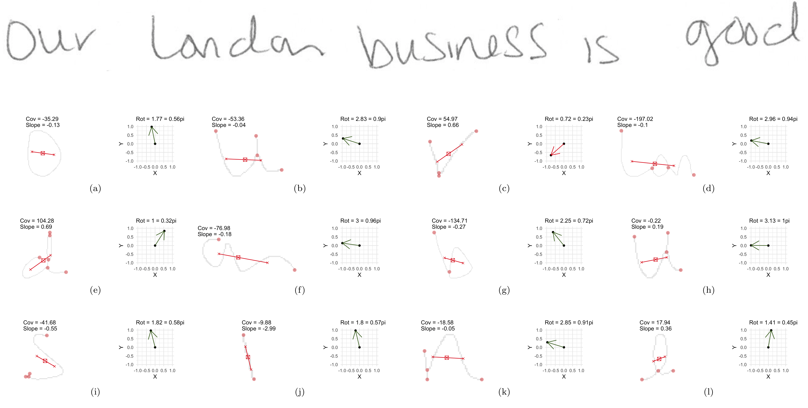

# Project G: Handwriting (& Signatures)
```{r handwritingsetup, echo=FALSE}
library(knitr)
opts_chunk$set(echo=FALSE)
```

The handwriting project has four major focuses:

  1. data collection
  2. computational tools
  3. statistical analysis
      a. glyph clustering
      b. closed set modeling for writer identification
      c. Alexandra's project
      d. open set modeling for writer identification from distribution of glyphs in clusters
  4. communication of results

## Data Collection
We are conducting a large data collection study to gather handwriting samples from a variety of participants across the world (most in the Midwest). Each participant provides handwriting samples at three sessions. Session packets are prepared, mailed to participants, completed, and mailed back. Once recieved, we scan all surveys and writing samples. Scans are loaded, cropped, and saved using a Shiny app. The app also facilitates survey data entry, saving that participant data to lines in an excel spreadsheet.

As of September 2019, Marc and Anyesha are the primary contacts for the study. Phase 2 recruiting is underway.

<strong>The first 90 complete writers were published:</strong>
> Crawford, Amy; Ray, Anyesha; Carriquiry, Alicia; Kruse, James; Peterson, Marc (2019): CSAFE Handwriting Database. Iowa State University. Dataset. https://doi.org/10.25380/iastate.10062203.

Anyesha and I worked on a variety of <strong>data quality checks and batch processing</strong> prior to publication. Scanner cuts a portion of the left side of the documents off sporadically. Survey date checks. Batch removal of header.
```{r, fig.cap="Batch process samples: rotate 0.05 degrees, turn black line pixels white, crop 450 pixels from top (under QR code), rename.", out.width="90%", fig.keep="hold", fig.align='center'}
include_graphics(c( "images/handwriting/amy/promptimage.png"))
```

We hit a bump with the ISU Office for Responsible Research (ORR). </summary> They had concerns with the demographic variables we collected on the surveys and wanted to publish. We "negotiated'' and settled on the following survey information.

```{r, fig.cap="", out.width="110%", fig.keep="hold", fig.align='center'}
include_graphics(c( "images/handwriting/amy/surveydata_header.png"))
```
<br>

<details>
<summary>A data article was accepted at [Data in Brief](https://www.sciencedirect.com/science/article/pii/S2352340919314155?via%3Dihub). <br>
Crawford, A., Ray, A., & Carriquiry, A. (2020). A database of handwriting samples for applications in forensic statistics. Data in brief, 28, 105059.</summary>
<br>
```{r, fig.cap="", out.width="90%", fig.keep="hold", fig.align='center'}
include_graphics(c( "images/handwriting/amy/DIBarticle.png"))
```
</details>   


## Computational Tools
`handwriter` is a developmental R package hosted at https://github.com/CSAFE-ISU/handwriter. It is our major computational tool for the project. The package takes in scanned handwritten documents and the following are performed. 

1. <strong> Binarize.</strong> Turn the image to pure black and white.
2. <strong> Skeletonize. </strong> Reduce writing to a 1 pixel wide skeleton.
3. <strong> Break. </strong> Connected writing is decomposed into small manageable pieces called <strong> glyphs </strong>. Glyphs are graphical structures with nodes and edges that often, but not always, correspond to Roman letters, and are the smallest unit of observation we consider for statistcal modelling.
4. <strong> Measure. </strong> A variety of measurements are taken on each glyph. See Section 4.2.1.

```{r, fig.cap="Connected text processed by `handwriter`. The grey background is the original pen stroke. Colored lines represent the single pixel skeleton with color changes marking glyph decomposition. Red dots mark endpoints and intersections of each glyph.", out.width="50%", fig.keep="hold", fig.align='center'}
include_graphics(c( "images/handwriting/amy/handwriter_csafe.png"))
```


For an input document, functions in the package give back a list of glyphs with path and node location information, adjacency grouping assignment, centroid locations, measurements (such as slope, pictured below), among other things. More on measurements in Section 4.2.1.

```{r, fig.cap="A visual of the ''slope'' calculation for two glyphs.", out.width="90%", fig.keep="hold", fig.align='center'}
include_graphics(c( "images/handwriting/amy/handwriter_slopecalc.png"))
```

### Graph measurements (extracted in RCpp by James)

The goal is to extract features that will discrimiate between writers within clusters.


<details>
<summary> 
  1. Compactness measurements
</summary> 
<br>
$$\sum_{Num.\: Pixels}\frac{d(pixel,centroid)^2}{Num.\: Pixels -1}$$
While informative for comparing like-sized graphs, this measurement suffers from the inherit spacial dependence between pixels and (unfortunately) does not scale well for modelling.
```{r, fig.cap="A visual of the ``compactness'' calculation for graphs", out.width="90%", fig.keep="hold", fig.align='center'}
include_graphics(c("images/handwriting/amy/compactness.png"))
```
</details> 

<details>
<summary> 
  2. Rotation angle measurements
</summary>
The first principal component for each graph, or "letter", is calculated through an eigendecomposition of the covariance matrix. The first principal component enjoys the property of having two invariant directions, and so we take the vector that lies in the upper half plane. The rotation angle of the graph is defined as the angle between the vector (0,1), and the unit principal component vector on the upper half plane. The angle is measured in radians and is considered a feature of the graph defined on the interval (0,$\pi$).

```{r, echo=FALSE, fig.cap="Top: writing from one of Writer 95's training documents. Bottom: the graphs from handwriter that correpsond to the writing, and the unit vector in the first pricipal direction. Red vectors are rotated by $\\pi$ to lie in the upper half plane prior to calculation of the rotation angle from the positive x-axis.", out.width = '100%', fig.align='center', fig.pos="ht!"}
knitr::include_graphics("images/handwriting/amy/w0095-1.png")
```

```{r, echo=FALSE, fig.cap = "Data: All Cluster \\#29 graphs in Writer 95's training documents. Left: A Nightingale Rose diagram displaying the rotation angles in 20 'petals'. A point for each observed rotation angle is plotted on the outermost ring of the diagram. Right: A traditional histogram of the rotation angles with 20 bins, a point for each observation is plotted on the x-axis.", fig.align='center', warning=FALSE, message=FALSE, out.width='70%', fig.pos="H"}
include_graphics(c("images/handwriting/amy/rotationangles_writer95_cluster29.pdf"))
```

```{r, echo=FALSE, fig.cap="Top: writing from one of Writer 1's training documents. Bottom: the graphs from handwriter that correpsond to the writing, and the unit vector in the first pricipal direction. Red vectors are rotated by $\\pi$ to lie in the upper half plane prior to calculation of the rotation angle from the positive x-axis.", out.width = '100%', fig.align='center', fig.pos="ht!"}

```


```{r, echo=FALSE, fig.cap = "Nightingale rose diagrams and traditional histograms for the rotation angles from Writer \\#1's training documents in Clusters \\#29 (top) and \\#16 (bottom).", fig.align='center', warning=FALSE, message=FALSE, out.width='70%', fig.pos="H"}
include_graphics(c("images/handwriting/amy/rotationangles_writer1_clusters-16-29.pdf"))
```
</details> 


<details>
<summary> 
  3. Loop measurements
</summary>
```{r, echo=FALSE, fig.cap="A few graphs with loops that come from the Writer 95 sample from Figure 4.5 (top).", out.width = '100%', fig.align='center', fig.pos="ht!"}
knitr::include_graphics("images/handwriting/amy/loops_writer95.pdf")
```

```{r, echo=FALSE, fig.cap = "Distribution of loop ratios for Writer 95 across all training documents.", fig.align='center', warning=FALSE, message=FALSE, out.width='68%', fig.pos="H"}
include_graphics(c("images/handwriting/amy/loops_linearvslog_writer95.pdf"))
```


```{r, echo=FALSE, fig.cap = "Distribution of log loop ratios for Writers 1 and 95 across all training documents.", fig.align='center', warning=FALSE, message=FALSE, out.width='45%', fig.pos="H"}
include_graphics(c("images/handwriting/amy/loops_hist_writers-95-1.pdf"))
```

</details> 

## Statistical Analysis
### Clustering

<details> 
<summary>Paper submitted to ASA Statistical Analysis and Data Mining.</summary>

```{r, fig.cap="", out.width="70%", fig.keep="hold", fig.align='center'}
include_graphics(c( "images/handwriting/amy/clusterpaper_header.png"))
```
</details> 

Rather than impose rigid grouping rules (the previously used ''adjacency grouping'') we consider a more robust, dynamic $K-$means type clustering method that is focused on major glyph structural components.  
  
Clustering algorithms require:

  - <strong> A distance measure.</strong> For us, a way to measure the discrepancy between glyphs.
  - <strong> A measure of center.</strong> A glyph-like structure that is the exemplar representation of a group of glyphs.

#### Glyph Distance Measure {-}
We begin by defining edge to edge distances. Edge to edge distances are subsequently combined for an overall glyph to glyph distance.

<strong>Edge to edge distances:</strong>

Consider the following single edge glyphs, $e_1$ and $e_2$. Make $3$ edits to $e_1$ to match $e_2$. The combined magnitude of each edit make the edge distance.
```{r, fig.cap="Two edges that are also glyphs, $e_1$ and $e_2$.", out.width="60%", fig.keep="hold", fig.align='center'}
include_graphics(c( "images/handwriting/amy/DistMeasurePlot1.png"))
```

1. <strong> Shift</strong>. Anchor to the nearest endpoint by shifting.
```{r, fig.cap="Shift = 1.4.", out.width="25%", fig.keep="hold", fig.align='center'}
include_graphics(c( "images/handwriting/amy/DistMeasurePlot2.png"))
```


2. <strong> Stretch</strong>. Make the endpoints the same distance apart.
```{r, fig.cap="Stretch = 9.9.", out.width="25%", fig.keep="hold", fig.align='center'}
include_graphics(c( "images/handwriting/amy/DistMeasurePlot3.png"))
```


3. <strong> Shape</strong>. Bend and twist the edge using $7$ shape points. Shape points are ''matched'' and the distance between them is averaged to obtain the shape contribution to the distance measure.
```{r, fig.cap="Shape Components.", out.width="25%", fig.keep="hold", fig.align='center'}
include_graphics(c( "images/handwriting/amy/DistMeasurePlot4.png"))
```

```{r, fig.cap="Shape = 8.4.", out.width="100%", fig.keep="hold", fig.align='center'}
include_graphics(c( "images/handwriting/amy/DistMeasurePlot5.png"))
```

Combine the three measurements for a final edge to edge distance. D$(e_1, e_2) = 1.4 + 9.9 + 8.4 = 19.7$.

For multi-edge glyphs get pairwise edge distances. Minimize total glyph distance using linear programming to match edges (sudoku). Down-weight edge distance contributions based on edge lengths. There are nuances associated with all of this. We must handle glyphs with differing number of edges, and consider the direction in which edges are compared (endpoint labels are arbitrary). All of this is addressed in detail in the paper.


#### Measure of glyph centers {-}
Take the weighted average of endpoints, $7$ shape points, and edge length.
```{r, fig.cap="Weighted mean between two glyphs. p = weight on blue.", out.width="60%", fig.keep="hold", fig.align='center'}
include_graphics(c( "images/handwriting/amy/Meanplot1.png"))
```


The mean of a set can be iteratively calculated by properly weighting each newly introduced glyph. For stability, the $K-$means algorithm finds the glyph nearest the mean and uses that \emph{exemplar} as measure of cluster center.


#### $K-$means Algorithm for Glyphs {-}

Implement a standard $K-$means ^[Forgy, E. (1965). Cluster Analysis of Multivariate Data: Efficiency vs. Interpretability of Classifications. Biometrics, 21:768–780.]   ^[Lloyd, S. (1982). Least Squares Quantization in PCM. IEEE Trans. on Information Theory, 28(2):129–137.] with handling of outlier observations. ^[Gan, G. and Ng, M. K.-P. (2017). K-means  clustering with outlier removal. Pattern Recog. Letters, 90:8–14.]

Begin with fixed $K$ and a set of exemplars. Iterate between the following steps until cluster assignments do not change:

1. Assign each glyph to the exemplar it is nearest to, with respect to the glyph distance measure.  
2. Calculate each cluster mean as defined. Find the exemplar nearest the cluster mean and use it as the new cluster center.

```{r, fig.cap="One of $K=40$ Clusters. Exemplar & cluster members (left). Cluster mean (right).", out.width="40%", fig.keep="hold", fig.align='center'}
include_graphics(c( "images/handwriting/amy/Cluster40.png"))
```


Use one document from each training writer to cluster and obtain a template. Make cluster assignments for the remaining documents by finding the template exemplar each glyph is nearest to. Below is an example of data that arises from the clustering method.


```{r, fig.cap="Data arising from the cluster grouping method. Cluster #'s ordered by most to least populated.", out.width="60%", fig.keep="hold", fig.align='center'}
include_graphics(c( "images/handwriting/amy/Clusterdata.png"))
```


#### Outliers
During clustering, outliers are considered glyphs that are at least $T_o$ distance units from cluster exemplars. The algorithm sets a ceiling $n_o$ on the allowable number of outliers. Initially, we were going to ignore the outliers, but now they are considered the $K+1$th cluster and contribute information about writer.

```{r, fig.cap="Cluster of outliers.", out.width="80%", fig.keep="hold", fig.align='center'}
include_graphics(c( "images/handwriting/amy/HW_Outliers.png"))
```


#### <span class="new"> CVL + CSAFE + IAM Template Development </span>

Template development on:   

    1.  CSAFE Handwriting Database, 25 documents. 
    2.  Computer Vision Lab (CVL) Database, 25 documents.
    3.  IAM Handwriting Database, 50 documents.

With the new template, we've made a few adjustments to the original algorithm and measurement tools:  

1. Starting values.
2. Changes to the distance measurement to emphasize shape, and focus less on character size.
    - $\frac{1}{2}\times$ **Stretch** (straight line distance component, ~ size)
    - 1 $\times$ **Shift** (nearest endpoint)
    - 2 $\times$ **Shape**
    - (ghost edge comparisons)$^2$
3. A sample template is picture below. 
    - 27 CVL documents (6 unique), 73 CSAFE documents (2 unique)
    - Currently working on 20+ algorithm runs with a variety of starting values to select final template.

<details> <summary>The final template.</summary>
```{r, fig.cap="Exemplars for the first 20 most populated clusters (according to training data, later). The red lines are not plotting correctly..", out.width="80%", fig.keep="hold", fig.align='center'}
include_graphics(c( "images/handwriting/amy/clusterplot2.png"))
```

```{r, fig.cap="Exemplars for the first 20 least populated clusters (according to training data, later). The red lines are not plotting correctly..", out.width="80%", fig.keep="hold", fig.align='center'}
include_graphics(c( "images/handwriting/amy/clusterplot1.png"))
```
</details>

### Statistical Modeling


#### Model #1, Straw Man {-}
Let,  


  - $\boldsymbol{Y}_{w(d)} = \{Y_{w(d),1}, \dots, Y_{w(d),K}\}$ be the number of glyphs assigned to each cluster for document within writer, $w(d),$ and
  - $\boldsymbol{\pi}_w = \{\pi_{w,1}, \dots, \pi_{w,K} \}$ be the rate at which a writer emits glyphs to each cluster.
  - Here, $K = 41$, $d = 1,2,...,5$, $w = 1,...,27$.

Then a hierarchical model for the data is
$$\begin{array}{rl}
     \mathbf{Y}_{w(d)}\: &\stackrel{ind}{\sim} \:Multinomial(\boldsymbol\pi_{w}), \\
\boldsymbol{\pi}_w \:&\stackrel{ind}{\sim}\: Dirichlet(\boldsymbol{\alpha}),\\
\alpha_{1}, \dots, \alpha_{K}\: &\stackrel{iid}{\sim}\: Gamma(2, \:0.25).  \label{model_line3}
\end{array}$$

<strong> Posterior Predictive Analysis </strong>  


For a holdout document of unknown source, $w^*$,  

  - Extract glyphs with \emph{handwriter} and assign groups,
      - $\boldsymbol{Y}^*_{w^*}=\{Y_{w^*,1}, ... Y_{w^*,K}\}$
  - Assess the posterior probability of writership under each known writer $\boldsymbol\pi_{w}$ vectors.
      - i.e. $p(w^* = w^\prime|\boldsymbol{Y^*}, \boldsymbol{Y})$ for each writer $w^\prime$ in the training data.


The posterior probability that the questioned document  $\boldsymbol{Y}^*_{w^*}$ belongs to writer $w^\prime$ with respect to the closed set is,
$$\begin{array}{rl}
    p(w^* = w^\prime|\boldsymbol{Y}^*, \boldsymbol{Y}) 
     & \propto p(\boldsymbol{Y}^*| w^* = w^\prime, \boldsymbol{Y}) p(w^*=w^\prime | \boldsymbol{Y})\nonumber\\
     & \propto p(\boldsymbol{Y}^*| w^* = w^\prime, \boldsymbol{Y})   \nonumber\\
    & = \int p(\boldsymbol{Y}^*|   \boldsymbol{\pi}_{w^\prime}) p(\boldsymbol{\pi}_{w^\prime}| \boldsymbol{Y}) d \boldsymbol{\pi}_{w^\prime}\nonumber\\ 
    & \approx \frac{1}{M} \sum_{m=1}^M p(\boldsymbol{Y}^*|   \boldsymbol{\pi}^{(m)}_{w^\prime}) , \mbox{ where }  \boldsymbol{\pi}^{(m)}_{w^\prime} \sim p(\boldsymbol{\pi}_{w^\prime}|\boldsymbol{Y})  \nonumber 
\end{array}$$  


for MCMC iterations $m = 1, \dots, M$. Then, for a given iteration $m$,

$$
p(\boldsymbol{Y}^*|   \boldsymbol{\pi}^{(m)}_{w^\prime}) =    p_{w^\prime}^{(m)} =  \frac{Mult(\boldsymbol{Y}^*; \boldsymbol{\pi}_{w^\prime}^{(m)})}{\sum_{w_i = 1}^{27}Mult(\boldsymbol{Y}^*; \boldsymbol{\pi}_{w_i}^{(m)}) }. \nonumber
$$
Calculate the quantitity for each known writer $w^\prime = w_1, \dots, w_{27}$ in training set to get
$$
\boldsymbol{p}^{(m)} = \{p_{w_1}^{(m)}, ..., p_{w_{27}}^{(m)}\},
$$
and compute summaries over the MCMC draws,
$$
\boldsymbol{\bar{p}} = \{\bar{p}_{w_1},...,\bar{p}_{w_{27}}\}.
$$


<strong> Results </strong>  


If we use a single holdout document for each writer (doc 4). The $\boldsymbol{\bar{p}}$ vector as given above is shown graphically for each holdout document (the rows).

```{r, fig.cap="Posterior predictive results. Rows are evaluated independently and the probability in each row sums to one. Log Loss = 0.2013", out.width="60%", fig.keep="hold", fig.align='center'}
include_graphics(c( "images/handwriting/amy/CVL_w27_h4_cluster40_basemodel_grid.png"))
```

<br>

We can use a cross validation routine to estimate error. For each writer, shuffle the order of their body of documents. For the first fold we holdout the first document for testing, for the second fold we hold out the second document for testing, etc.. This yields 6 results analogous to that of the figure above.


```{r, fig.cap="Posterior predictive results for each fold of the CV routine outlined above. Log Loss is clearly not a great summary of performance.", out.width="100%", fig.keep="hold", fig.align='center'}
include_graphics(c( "images/handwriting/amy/CVL_w27_CVfoldall_cluster40_basemodel_grid.png"))
```

<br>

<strong> Evaluating Over-/Under-dispersion (Writer Variability Index) </strong>  
With a count data model it is important to investigate the presence of over- and under-dispersion. An index of intra-writer variability with respect to a model.  
  
  - Multivariate Generalized Dispersion Index (GDI) of Kokonendji and Puig^[Kokonendji, C. C. and Puig, P. (2018). Fisher Dispersion Index for Multivariate Count Distributions. Journal of Multivariate Analysis, v165 p180-193.].
  - Relative Dispersion Index (RDI) = $\frac{\mbox{writer data GDI}}{\mbox{model simulated GDI}}.$
  - High RDI $\implies$ data over-dispersion and high sample to sample variability.


```{r, fig.cap="RDIs for the 27 CVL writers under Model #1.", out.width="60%", fig.keep="hold", fig.align='center'}
include_graphics(c( "images/handwriting/amy/RDI_table.png"))
```


High RDI $\implies$ data over-dispersion \& high sample to sample variability (in the sense of glyph cluster membership rates).

```{r, fig.cap="Handwriting Samples from Writer #12. Notice the repeated patterns in letters 'a', 'e', 'f', 'g', 'h', 't', etc. across samples.", out.width="70%", fig.keep="hold", fig.align='center'}
include_graphics(c( "images/handwriting/amy/writer12samples.png"))
```


```{r, fig.cap="Handwriting Samples from Writer #23. Note the red 'h's, green 'll's, purple terminal 'y's, and blue 'loo's", out.width="80%", fig.keep="hold", fig.align='center'}
include_graphics(c( "images/handwriting/amy/writer23samples.png"))
```


#### Model #2, Mixture{-}
There seem to be greatly varying shapes in the relative frequency of cluster fill. We think maybe a more flexible Dirichlet distribution is warranted.
```{r, fig.cap="Average relative frequency of cluster fill for the 8 most common clusters. Notice writers 12/21 and 6/17/18.", out.width="80%", fig.keep="hold", fig.align='center'}
include_graphics(c( "images/handwriting/amy/bucketfillshapes.png"))
```

Add flexibility to the original model by including a mixture component in the Dirichlet parameter space.

$$\begin{array}{rl}
     \mathbf{Y}_{w(d)} | \boldsymbol\pi_{w}, w\: &\stackrel{ind}{\sim} \:Multinomial(\boldsymbol\pi_{w}), \\
\boldsymbol{\pi}_w|\boldsymbol{\alpha},\boldsymbol{\beta}, \rho_w  \:&\stackrel{ind}{\sim}\:Dirichlet(\rho_w \: \boldsymbol{\alpha}+ (1-\rho_w)  \: \boldsymbol{\beta}), \\
\alpha_{k}, \: \beta_{k} \: &\stackrel{iid}{\sim}\: Gamma(2, \: 0.25) \:\: \mbox{ for } k > 3,  \\
\rho_w\: & \stackrel{iid}{\sim}\: Beta(1,1)
\end{array}$$


<strong> Label Switchin Issues. </strong>  
The model is non-identifiabile. We need to either place constraints on the parameter space to exclude the possibility of a second mode apriori, or estimate the posterior in both modes and post-process for label reassignment after.
This has been resolved (?) by placing constraints on the first three elements of $\alpha$ and $\beta$ with moderately informative priors.

  - $\mathbf{\alpha_1 < \beta_1}$, $\quad$  $\alpha_1 \sim Gamma(2, 0.25) \:\: \& \:\: \beta_1 \sim Gamma(4, 0.25)$  
        
  - $\mathbf{\alpha_2 > \beta_2}$  , $\quad$  $\alpha_2 \sim Gamma(4, 0.25) \:\: \& \:\: \beta_2 \sim Gamma(1, 0.25)$  
        
  - $\mathbf{\alpha_3 > \beta_3}$ , $\quad$  $\alpha_3 \sim Gamma(4, 0.25) \:\: \& \:\: \beta_3 \sim Gamma(1, 0.25)$   
        
```{r, echo = FALSE, message = FALSE, warning=FALSE, fig.height=2.5, fig.width = 6.5, fig.align='center'}
library(tidyverse)
x = seq(0, 30, length.out = 1000)
df = data.frame(x = x, 
                gam4 = dgamma(x, shape = 4, rate = 0.25),
                gam2 = dgamma(x, shape = 2, rate = 0.25),
                gam1 = dgamma(x, shape = 1, rate = 0.25))

df %>% gather(key = "GammaDist", value = "value", -x) %>%
  ggplot() + geom_line(aes(x = x, y = value, color = GammaDist)) + theme_bw() +  scale_color_discrete(name = "Distribution", labels = c("Gamma(1, 0.25)", "Gamma(2, 0.25)", "Gamma(4, 0.25)"))
```

<strong> Results </strong>    

The mixing component gives insights into writing style.
```{r, fig.cap="Average \rho_w value for each writer.", out.width="70%", fig.keep="hold", fig.align='center'}
include_graphics(c( "images/handwriting/amy/mixprior_rhosamps2.png"))
```  

 
```{r, fig.cap="Writing samples in a variety of styles based on the mixing parameter. From top to bottom, writer #'s 21, 4, 29, 20, 18.", out.width="60%", fig.keep="hold", fig.align='center'}
include_graphics(c( "images/handwriting/amy/writingsamples_style.png"))
```

Evaluate the posterior probability of writership for each of the holdout documents.
```{r, fig.cap="Posterior predictive results. Rows are evaluated independently and the probability in each row sums to one. Log Loss = 0.2078", out.width="60%", fig.keep="hold", fig.align='center'}
include_graphics(c( "images/handwriting/amy/CVL_w27_h4_cluster40_mixparam_grid.png"))
```


#### Model #2, CSAFE + CVL (not most recent) Template
The following analysis was done for the first 20 CSAFE writers.

- Training docs: s01_pLND_r01, s01_pLND_r03, s01_pWOZ_r02, s01_pPHR_r03  
- Testing doc: s01_pLND_r02

```{r, fig.cap="Average relative frequency of cluster fill for the 8 most common clusters.", out.width="90%", fig.keep="hold", fig.align='center'}
include_graphics(c( "images/handwriting/amy/csafe20_relfreqbyrho_template65_first8clusters.png"))
```

Posterior probability results.
```{r, fig.cap="Posterior predictive results. Rows are evaluated independently and the probability in each row sums to one.", out.width="60%", fig.keep="hold", fig.align='center'}
include_graphics(c( "images/handwriting/amy/csafe20_postprobs_template65.png"))
```

Not surprising. Working on:

- More writers (need to go through handwriter)
- Testing on the phrase prompt
- Including not yet seen CVL writers in analysis.


#### Model #3, Normal Slopes. Work in progress. {-}  

Adding slope measurements into the model.  


Let,

  - $\boldsymbol{Y}_{w(d)} = \{Y_{w(d),1}, \dots, Y_{w(d),K}\}$ be the number of glyphs assigned to each group for document within writer, $w(d),$
  - $\boldsymbol{\bar{S}}_{w(d)} = \{\bar{S}_{w(d),1}, \dots, \bar{S}_{w(d),K}\}$, be the average slope in each group for document $w(d)$
      - $G_{w(d),j}$ be the $j^{th}$ glyph in document $w(d)$,
      - $g_{w(d), j} = 1, \dots, 41$ be the available cluster assignments for the $j^{th}$ glyph in the document,
      - $S_{w(d),j}$ be the slope of the $j^{th}$ glyph in the document.

  - Here, $K = 41$, $d = 1,2,...,5$, $w = 1,...,27$, $j= 1, \dots,\mathrm{J}_{w(d)}.$


$$
\bar{S}_{w(d),k}= \frac{1}{Y_{w(d),k}} \sum_{j \ni  \mathrm{I}[g_j = k]}S_{w(d),j} \quad \& \quad Y_{w(d),k} = \sum_{j = 1}^{\mathrm{J}_{w(d)}} \mathrm{I}[g_j = k]
$$


Then a hierarchical model for the data is  


$$\begin{array}{rl}
     \mathbf{Y}_{w(d)} | \boldsymbol\pi_{w}, w\: &\stackrel{ind}{\sim} \:Multinomial(\boldsymbol\pi_{w}), \\
\boldsymbol{\pi}_w|\boldsymbol{\alpha} \:&\stackrel{ind}{\sim}\:Dirichlet(\boldsymbol{\alpha}), \\
\alpha_k\: &\stackrel{iid}{\sim}\: Gamma(a = 2, \: b= 0.25),  \\
\bar{S}_{w(d),k} | Y_{w(d),k}, w, \mu_{w, k}, \sigma^2_{k}  \: & \stackrel{iid}{\sim}\: N \left(\mu_{w, k}, \frac{\sigma^2_{k}}{Y_{w(d),k}}\right) \\
\mu_{w, k} | \mu_{k} \: & \stackrel{iid}{\sim}\:  N(\mu_{k}, 3) \\
\mu_{k} \: & \stackrel{iid}{\sim}\:  N(0, 3) \\
1/\sigma^2_{k}\: & \stackrel{iid}{\sim}\:  Gamma(0.5, 0.1)
\end{array}$$


Consider a new document with cluster fill counts $\boldsymbol{Y}^*$ and average slope measurements $\boldsymbol{\bar{S}}^*$ from unknown writer $w^*$.  

<strong> Posterior Predictive Analysis </strong>  


Posterior probability that the questioned document belongs to writer $w^\prime$ with respect to the closed set is:
\begin{array}{rl}
    &p(w^* = w^\prime|\boldsymbol{\bar{S}}^* \boldsymbol{Y}^*, \dots) \nonumber \\
      &\qquad \qquad \propto \left[ \: \prod_{k=1}^{K}p(\bar{S}^*_k | Y^*_{k}, w^* = w^\prime, \dots) \right]  p(\boldsymbol{Y}^* | w^* = w^\prime, \dots ) \nonumber \\
      &\qquad \qquad \approx \frac{1}{M} \sum_{m=1}^{M} \left[ \: \prod_{k=1}^{K}N \left(\mu_{w, k}^{(m)}, \frac{\sigma^{2(m)}_{k}}{Y_{w(d),k}}\right) \right]  Mult(\boldsymbol{Y}^*; \boldsymbol{\pi}_{w^\prime}^{(m)}) \nonumber
\end{array}
for MCMC samples $m = 1, \dots, M$.

<strong> Results </strong>    

Evaluate the posterior probability of writership for each of the holdout documents.
```{r, fig.cap="Posterior predictive results. Rows are evaluated independently and the probability in each row sums to one. Log Loss = 0.0883.", out.width="60%", fig.keep="hold", fig.align='center'}
include_graphics(c( "images/handwriting/amy/CVL_w27_h4_cluster40_normslopemean_grid.png"))
```


#### Modeling Summary {-}
```{r}
df = data.frame(Model = c("#1", "#1", "#2", "#3"), Data = c("Adjacency Grouping (not presented)", "Cluster Grouping", "Cluster Grouping", "Cluster Grouping & Glyph Slopes"), LogLoss = c(0.5413, 0.2013, 0.2078, 0.0883))

kable(df)
```

#### Modeling update (Feb 17)
 90 writers, Session \#1  
 
- Train: 3 London Letters
    - A few writers only had 2 (working on this)
- Test: 1 Wizard of Oz

Recall rotation angle measurements:

```{r, echo=FALSE, fig.cap = "Data: All Cluster \\#29 graphs in Writer 95's training documents. Left: A Nightingale Rose diagram displaying the rotation angles in 20 'petals'. A point for each observed rotation angle is plotted on the outermost ring of the diagram. Right: A traditional histogram of the rotation angles with 20 bins, a point for each observation is plotted on the x-axis.", fig.align='center', warning=FALSE, message=FALSE, out.width='70%', fig.pos="H"}
include_graphics(c("images/handwriting/amy/rotationangles_writer95_cluster29.pdf"))
```

**A NAIVE Model for Rotation Angles**

Naively we can treat the rotation angle values as if they are linear on the interval (0,$\pi$). This is of course not the case, since a value of 0 is extremely similar to a value of $\pi$, both corresponding to letters that do not lean a great deal to the left or right, and are wider than they are tall. This can be seen in Figure 2, where the unimodal density ends abuptly at zero and "wraps around" in the higher values near $\pi$. Nonetheless, we can specify a disribution on the linear, or unwrapped, rotation angles as follows: 
\begin{align} \nonumber
\mathbf{Y}_{w(d)} | \boldsymbol\pi_{w}, w \: &\stackrel{ind}{\sim} \:Multinomial(\boldsymbol\pi_{w}), \\ \nonumber
\boldsymbol{\pi}_w|\boldsymbol{\gamma} \: &\stackrel{ind}{\sim}\:Dirichlet(\boldsymbol{\gamma}), \\ \nonumber
\gamma_k\: &\stackrel{iid}{\sim}\: Gamma(a = 2, \: b= 0.25),  \\ \nonumber
& \quad \\ \nonumber
SRA_{w,k} | w,k \: & \stackrel{iid}{\sim}\: Beta \left( \alpha_{w,k}, \beta_{w,k} \right) \\ \nonumber
& \quad \\ \nonumber
\mu_{w,k} &= \frac{\alpha_{w,k}}{\alpha_{w,k}+\beta_{w,k}} \: \sim Beta(2,2) \\ \nonumber
variance_{w,k} &= \frac{\mu_{w,k}(1 - \mu_{w,k})}{\alpha_{w,k} + \beta_{w,k} + 1} = \frac{\mu_{w,k}(1 - \mu_{w,k})}{\kappa_{w,k}+1} \\ \nonumber
\kappa_{w,k} &= \alpha_{w,k} + \beta_{w,k}  \: \sim Gamma(shape = 0.1, rate = 1)
\end{align}

Where $SRA_{w,k,i}, \: \:i = 1, \dots, n_{w,k}$, are rotation angles from cluster $k$, and writer $w$, scaled to the beta density support of (0,1). For a given writer and cluster, $\mu_{w,k}$ is the mean of the data distribution, expressed as a functions of $\alpha_{w,k}$ and $\beta_{w,k}$. We place a weak prior, $Beta(2,2)$, on all $\mu_{w,k}$. Similarly, $\kappa_{w,k}$ is expressed as a function of $\alpha_{w,k}$ and $\beta_{w,k}$ and is a sort of "sample size", or "precision" parameter. Notice that $\kappa_{w,k}+1\propto\frac{1}{variance_{w,k}}$.


```{r, echo=FALSE, fig.cap = "Writer 95, Cluster 29. A plot depicting elements of the data model $SRA_{w,k} \\: \\sim \\: Beta ( \\alpha_{w,k}, \\beta_{w,k})$. Top: values of $\\alpha^{(m)}_{95,29}$ and $\\beta^{(m)}_{95,29}$ for $m = 1, \\dots,12$ iterations taken from the middle of the chain and used to plot the $12$ correpsonding beta densities. Bottom: the unscaled rotation angles (unscaled $SRA_{w,k}$), serving as data for the parameter estimation.", fig.align='center', warning=FALSE, message=FALSE, out.width='70%', fig.pos="H"}
include_graphics(c("images/handwriting/amy/rotationangles_writer95_cluster29_mcmcsamples.pdf"))
```

For a different writer who does not tend to lean one way or another...

```{r, echo=FALSE, fig.cap = "Nightingale rose diagrams and traditional histograms for the rotation angles from Writer \\#1's training documents in Clusters \\#29 (top) and \\#16 (bottom).", fig.align='center', warning=FALSE, message=FALSE, out.width='75%', fig.pos="H"}

knitr::include_graphics("images/handwriting/amy/rotationangles_writer1_clusters-16-29.pdf")
```

And we can look at a handful of beta distributions that arise from $w=1$ and $k=16$...


```{r, eval = TRUE, echo=FALSE, fig.cap = "Writer 1, Cluster 16. A plot depicting elements of the data model $SRA_{w,k} \\: \\sim \\: Beta ( \\alpha_{w,k}, \\beta_{w,k})$. Top: values of $\\alpha^{(m)}_{1,16}$ and $\\beta^{(m)}_{1,16}$ for $m = 1, \\dots,12$ iterations taken from the middle of the chain and used to plot the $12$ correpsonding beta densities. Bottom: the unscaled rotation angles (unscaled $SRA_{w,k}$), serving as data for the parameter estimation.", fig.align='center', warning=FALSE, message=FALSE, out.width='70%', fig.pos="ht!"}

knitr::include_graphics("images/handwriting/amy/rotationangles_writer1_cluster16_mcmcsamples.pdf")
```


Why am I showing you histograms and MCMC samples from clusters #29 and #16?? Becasue these are great examples of where the problems occur with the naive approach to modeling the "unwrapped" angles. 

```{r, eval = TRUE, echo=FALSE, fig.cap="Cluster members in grey, and cluster exemplars in red (plotting is a few pixels shifted left) for clusters $\\#29$ (left), and $\\#26$ (right)", out.width = '15%', fig.align='center', fig.pos="ht!", fig.show='hold'}
knitr::include_graphics(c("images/handwriting/amy/cluster29.png", "images/handwriting/amy/cluster16.png"))
```


These are clusters that tend to hold the letters $n$ and $u$ and thus, are generally wider than they are tall. When a writer emits one of these nearly straight up and down, but slightly right leaning, the rotation angle will be just above zero. If the graph is very slightly left leaning, then the rotation angle will be just under $\pi$. 


While the beta distribution can take on a $U$-shape (like the Writer 1, Cluster 16 data in Figure 4), this is still undesirable, becuase we want to express the fact that values near $0$ and $\pi$ are actually very similar. For example, a mean near $\pi/2$ does not do a good job of expressing the center of those rotation angles, and a traditional "unwrapped" variance will overstate the variability in data that is actually quite similar.

Consider the following distribution of cluster #16 rotation angles from writer #85's questioned document. The largest observation is 3.129, which scales to 0.996, the next largest is 3.024, which scales to 0.963. These are going to accumulate a huge amount of likelihood when evaluated under the beta parameters for Writer #1, displayed in Figure 6. The rest of the rotation angles are relatively spread out over the $x$-axis, and not necessarily reflective of the Writer #1 distribution in Cluster #16.

```{r, eval = TRUE, echo=FALSE, fig.cap="Questioned Document. Writer \\#85. Cluster \\#16.", fig.align='center', warning=FALSE, message=FALSE, out.width='45%', fig.pos="ht!"}
knitr::include_graphics(c("images/handwriting/amy/rotationangles_writer85_qd.pdf"))
```


**QD evaluation** under beta distributed rotation angles using $k=1,\dots,20$, the $20$ most populated clusters. Notice the probability for questioned writer #85 that is assigned to known writer #1. This error is explained by the behavior depicted above. Not all off-diagonal probability assignment can be attributed to similar behavior, but much of it can.

```{r, eval = TRUE, echo=FALSE, fig.cap = "Posterior predictive evaluation of QDs under beta distributed rotation angles.", fig.align='center', warning=FALSE, message=FALSE,out.width='100%', fig.pos="ht!"}
knitr::include_graphics(c("images/handwriting/amy/postprobs_RA_betadist.pdf"))
```

**A Wrapped Model for Rotation Angles**

A more appropriate approach to the problem is to consider the rotation angles in the polar coordinate system and treat them as spanning the full circle. So we map the upper half plane values to $(0,2\pi)$, where values above the $x-$axis indicate a right leaning graph and below the $x-$axis indicate left leaning graphs. Graphs that are relatively straight up and down will have values near $0/2\pi$ if they are wider than they are tall, and near $\pi$ if they are taller than they are wide.

```{r, eval = TRUE, echo=FALSE, fig.cap="Writer 1, Cluster 16. Left: linear consideration of the rotation angles. Right: wrapped rotation angles on the full circle.", fig.align='center', warning=FALSE, message=FALSE, fig.pos="ht!", fig.width=6.5}
knitr::include_graphics(c("images/handwriting/amy/rotationangles_writer1_wrappeddata.pdf"))
```

```{r, eval = TRUE, echo=FALSE, fig.cap="Two candidate distributions defined on circular data, both specified at MLE parameter values calculated from the data.", fig.align='center', warning=FALSE, message=FALSE, fig.pos="ht!", fig.width=6.5}
knitr::include_graphics(c("images/handwriting/amy/rotationangles_writer1_wrappeddata_withdist.pdf"))
```


We consider two distributions that are appropriate for circular data. First, the **von Mises** distribution is a close approximation to the wrapped normal distribution, which is the circular analouge of the normal. This is the "go-to" unimodal wrapped distribution, like the normal is the traditional "go-to" unimodal distribution. It is specified through the mean, $\mu$, and concentration, $\kappa$ ($\frac{1}{\kappa}$ analogous to $\sigma^2$).

The second is the **wrapped Cauchy** distribution, which is the wrapped version of the Caucy distribution. Similar to the traditional Cauchy, this distribution is symmetric, unimodel, and specified by a location parameter, $\mu$, and concentration parameter, $\rho$. This distribution is also heavy-tailed in the sense that it will place more density on the "back" of the circle opposite the peak of the distribution.


Now, consider 
\begin{align} \nonumber
\mathbf{Y}_{w(d)} | \boldsymbol\pi_{w}, w \: &\stackrel{ind}{\sim} \:Multinomial(\boldsymbol\pi_{w}), \\ \nonumber
\boldsymbol{\pi}_w|\boldsymbol{\gamma} \: &\stackrel{ind}{\sim}\:Dirichlet(\boldsymbol{\gamma}), \\ \nonumber
\gamma_k\: &\stackrel{iid}{\sim}\: Gamma(a = 2, \: b= 0.25),  \\ \nonumber
& \quad \\ \nonumber
RA_{w,k} | w,k \: & \stackrel{iid}{\sim}\: Wrapped \: Cauchy \left( \mu_{w,k}, \phi_{w,k} \right) \\ \nonumber
\mu_{w,k} &\sim Uniform(0,2\pi) \\ \nonumber
\phi{w,k} &\sim Uniform(0,1) \\ \nonumber
\end{align}

Where $RA_{w,k,i}, \: \:i = 1, \dots, n_{w,k}$, are rotation angles from cluster $k$, and writer $w$, on the full circle $(0,2\pi)$. For a given writer and cluster, $\mu_{w,k}$ and $\phi_{w,k}$ are the location and concentration parameters, respectively. We place non-informative uniform priors on each. Again, there is no borrowing set up in the model for rotation angles. Each writer/cluster combination gets its own estimated rotation angle distribution.

**QD evaluation** under wrapped Cauchy distributed rotation angles, using $k=1,\dots,20$, the $20$ most populated clusters. Notice the probability for questioned writer #85 that was previously assigned to known writer #1 is no longer an issue.


```{r, eval = TRUE, echo=FALSE, fig.cap = "Posterior predictive evaluation of QDs under wrapped Cauchy distributed rotation angles.", fig.align='center', warning=FALSE, message=FALSE, out.width='100%', fig.pos="ht!"}
knitr::include_graphics(c("images/handwriting/amy/postprobs_RA_wrappedcauchy.pdf"))
```


### Interesting documents

#### Where do we miss?


We tend to do worse on writers who only had 2 training documents.

```{r, eval = TRUE, echo=FALSE, fig.cap = "", fig.align='left', warning=FALSE, message=FALSE, out.width='80%', fig.pos="ht!"}
knitr::include_graphics(c("images/handwriting/amy/Amountoftrainingdata.png"))
```


Writers 32 and 133. 
```{r, eval = TRUE, echo=FALSE, fig.cap = "All 40 documents, wrapped cauchy rotation angles, where do we miss?", fig.align='center', warning=FALSE, message=FALSE, out.width='100%', fig.pos="ht!"}
knitr::include_graphics(c("images/handwriting/amy/postprobs_RA_wrappedcauchy_all40_miss.png"))
```


Samples:  

<details><summary>Writer 32 Test</summary>
```{r, eval = TRUE, echo=FALSE, fig.cap = "Writer 32 Test", fig.align='center', warning=FALSE, message=FALSE, out.width='100%', fig.pos="ht!"}
knitr::include_graphics(c("images/handwriting/amy/writer32_qd.png"))
```
</details>


<details><summary>Writer 133 Train</summary>
```{r, eval = TRUE, echo=FALSE, fig.cap = "Writer 133 Train", fig.align='center', warning=FALSE, message=FALSE, out.width='100%', fig.pos="ht!"}
knitr::include_graphics(c("images/handwriting/amy/writer133_train.png"))
```
</details>


#### Writer 4 Data
<details><summary>London Letter #1</summary>
```{r, eval = TRUE, echo=FALSE, fig.cap = "Writer 4 data.", fig.align='center', warning=FALSE, message=FALSE, out.width='100%', fig.pos="ht!"}
knitr::include_graphics(c("images/handwriting/amy/writer4_1.png"))
```
</details>

<details><summary>London Letter #2</summary>
```{r, eval = TRUE, echo=FALSE, fig.cap = "Writer 4 data.", fig.align='center', warning=FALSE, message=FALSE, out.width='100%', fig.pos="ht!"}
knitr::include_graphics(c("images/handwriting/amy/writer4_2.png"))
```
</details>

<details><summary>London Letter #3</summary>
```{r, eval = TRUE, echo=FALSE, fig.cap = "Writer 4 data.", fig.align='center', warning=FALSE, message=FALSE, out.width='100%', fig.pos="ht!"}
knitr::include_graphics(c("images/handwriting/amy/writer4_3.png"))
```
</details>


#### You all!
```{r, eval = TRUE, echo=FALSE, fig.cap = "CSAFE writers.", fig.align='center', warning=FALSE, message=FALSE, out.width='100%', fig.pos="ht!"}
knitr::include_graphics(c("images/handwriting/amy/csafewriters_modelresults.png"))
```

<details><summary>Wolfgang</summary>
```{r, eval = TRUE, echo=FALSE, fig.cap = "A training sample from Wolfgang.", fig.align='center', warning=FALSE, message=FALSE, out.width='100%', fig.pos="ht!"}
knitr::include_graphics(c("images/handwriting/amy/Wolfgang_writing.png"))
```
</details>

<details><summary>Soyoung</summary>
```{r, eval = TRUE, echo=FALSE, fig.cap = "A training sample from Soyoung.", fig.align='center', warning=FALSE, message=FALSE, out.width='100%', fig.pos="ht!"}
knitr::include_graphics(c("images/handwriting/amy/Soyoung_writing.png"))
```
</details>

<details><summary>Other writer</summary>
```{r, eval = TRUE, echo=FALSE, fig.cap = "A training sample from the other writer with off-diagonal assignment for Wolfgang.", fig.align='center', warning=FALSE, message=FALSE, out.width='100%', fig.pos="ht!"}
knitr::include_graphics(c("images/handwriting/amy/wolfgang_miss2.png"))
```
</details>

### Ali's project

:)

### Open Set Modeling for Writer Identification from Distribution of Glyphs in Clusters
The next step in this research extends the scope of potential sources of handwriting samples to an open set. So if there are two handwriting samples, are what is the probability they are from the same writer or different writer without the neccesary assumption of knowing all of the potential sources. The distribution of glyphs assigned to clusters in a document is can be used to explore the authorship because it is hypothesized that a particular writer would have their own writing style resulting in similar distributions of glyphs in each cluster over time across many different writing samples.

Instead of comparing multinomial distributions, the proportions of total glyphs in each cluster can be compared with two Dirichlet distributions. If there are two different samples where the length of the documents differ the expected number of glyphs per cluster would also differ. For example, if samples of handwriting were found at two different scenes and the goal is to compare the two documents, it would be expected that the number of glyphs in each cluster would vary unless they happened to write the exact same thing in both. Dirichlet distributions would compare the proportions instead of the counts of glyphs per cluster.

To start we will look at a dirichlet with three proportions, which would correspond to only having three clusters, and calculate the euclidean distance. 

KDE (kernel density estimation) can be used to estimate the behavior of the distributions when the random variables are indeed from the distribution with the same parameters and when they are drawn from the distribution with different parameters.   

```{r}
knitr::include_graphics(c("images/handwriting/mattie/both.png"))
```

These density estimates can be used to calculate score-based likelihood ratios (SLRs) using leave-one-out of another simulated dataset. We would expect SLRs that are greater than 1 to be associated with the distance measures from the same distribution.

This process was conducted with just the euclidean distance to start. Next, it is possible to assess how well a random forest with multiple distance measures (euclidean distance and the absolute difference between each of the clusters) can correctly identify if two dirichlet random variables are from a distribution with the same parameters or different parameters.

To do this, 10,000 random variables were simulated for two dirichlet with the parameters (5,10,25) and one dirichlet with parameters (6,12,22) as a training set. The distance measures were calculated between the two dirichlet from the same parameters and also between different parameters. These distance measures were added to a dataset along with an indicator if the distance measures were from the same or different dirichlet.

Next, a random forest was trained to predict the if the distance measures were from the same or different dirichlet.

A testing dataset was simulated in the same way as before and the random forest was applied. The random forest returns a value between 0 and 1 which is the proportion of trees in the forest that predicts the distance measures are from the same dirichlet. 

The training dataset was split into those that were actually from the same and different parameters. The `stat::density()` uses kernel density estimation with a Gaussian kernel to estimate the probability density function of the proportions that predicted the dirichlet were simulated from the distrution with the same parameters after defining the range of the pdf to be between 0 and 1.

Using the leave-one-out method, 1 observation was excluded from the dataset and then KDE was performed. 

```{r}
knitr::include_graphics(c("images/handwriting/mattie/kernel_bothplot.png"))
```

The ratio of the KDE estimate for the curve if the excluded point was from the distribution with the same parameters to different parameters is computed. The SLRs are compared for those that are actually from the same vs different and we would expect there to be little overlap.

```{r}
knitr::include_graphics(c("images/handwriting/mattie/loo_slrs_plot.png"))
```

The same process that was conducted with 3 clusters was repeated with 40 clusters. A random forest was trained on simulated data with 40 clusters with randomly simulated parameters drawn from a uniform distribution. There appears to be little overlap between the kernel density estimates that were drawn from the same distribution compared to those from different distributions.

```{r}
knitr::include_graphics(c("images/handwriting/mattie/kernel_bothplot_40.png"))
```

While the small SLRs are based on the distance measures from dirichlet with different parameters and larger SLRs are from the same as expected, the score likelihood ratios computed using the leave-one-out method are not as distinct of those from the same compared to different dirichlet distributions as we would expect.

```{r}
knitr::include_graphics(c("images/handwriting/mattie/slrs_40.png"))
```

Application to CSAFE Database

The data provided in the CSAFE database consist of writing samples from 90 writers who repeated three prompts three times throughout three sessions for a total of 9 writing samples per writer. The three prompts varied in length. "The London Letter" is the longest and has been used in other handwriting analyses because it includes all of the letters upper and lowercase and numbers. The second is an excerpt from "The Wizard of Oz" book. The last prompt is the short phrase: "The early bird may get the worm, but the second mouse gets the cheese"(Crawford, et al.). This initial test on the data only includes the documents from the first session.

We repeated the process of evaluating the score-based likelihoods calculated from the kernel density estimates of the output a random forest previsouly applied to simulated data to the CSAFE handwriting data. We used 4 different prompts: London Letter, Wizard of Oz, short phrase, and all prompts per writer per repetition combined. The combined document is longer and would be expected to be more representative of the writing style of each writer in the study.

For each data set, a random sample of 80% of the writers was drawn. The distance measures between all pairs of documents were calculated (absolute difference between each glyph and euchlidean distance) from sample. The number of distances from the same source were counted and the same number of different source distances were down sampled. This created a training set that includes an equal number of distances between same and different sources to train the random forest. The resulting random forest was trained using the remaining 20% of the writers not initially sampled for the training data set. As before with the simulated data, distributions of the output from the random forest by source was estimated using kernel density estimation with a Gaussian kernel with bounds between 0 and 1. SLRs were computed using the leave-one-out method as before.

The first prompt is the short phrase.

```{r varimp-p}
knitr::include_graphics(c("images/handwriting/mattie/varimportanceplot_p.png"))
```

```{r kde-p}
knitr::include_graphics(c("images/handwriting/mattie/kde_data_p.png"))
```

```{r slr-p}
knitr::include_graphics(c("images/handwriting/mattie/slr_data_p.png"))
```

The next prompt is an excerpt from "The Wizard of Oz".

```{r varimp-woz}
knitr::include_graphics(c("images/handwriting/mattie/varimportanceplot_woz.png"))
```

```{r kde-woz}
knitr::include_graphics(c("images/handwriting/mattie/kde_data_woz.png"))
```

```{r slr-woz}
knitr::include_graphics(c("images/handwriting/mattie/slr_data_woz.png"))
```

The third prompt is the "London Letter".

```{r varimp-ll}
knitr::include_graphics(c("images/handwriting/mattie/varimportanceplot.png"))
```

```{r kde-ll}
knitr::include_graphics(c("images/handwriting/mattie/kde_data.png"))
```

```{r slr-ll}
knitr::include_graphics(c("images/handwriting/mattie/slr_data.png"))
```

Lastly, all three documents are combined into one large template per writer.

```{r varimp-c}
knitr::include_graphics(c("images/handwriting/mattie/varimportanceplot_mega.png"))
```

```{r kde-c}
knitr::include_graphics(c("images/handwriting/mattie/kde_data_mega.png"))
```

```{r slr-c}
knitr::include_graphics(c("images/handwriting/mattie/slr_data_mega.png"))
```

Comparing all four implementations of the process, the method did the best at correctly classifying same vs. different source with longer documents. The euclidean distance was the most important variable according to the mean decrease in Gini index. Additionally, when comparing the absolute difference by cluster, some clusters appear to be more influential across prompts, such as cluster 31.    

The kernel density estimates for the shortest prompt are not well separated. As the length of the writing sample increases, the KDEs between same and different sources become more distinct.

The discrimination of source using SLRs can be quantified using AUC by prompt as 0.6447, 0.7293, 0.9692, and 0.961 for the short phrase, Wizard of Oz, London Letter, and all prompts combined, respectively.

```{r slr-c2}
knitr::include_graphics(c("images/handwriting/mattie/roc_plots.png"))
```

It is important to note that the training set did down sample the number of different source differences, but the testing set did not so the number of SLRs in that are from different sources will be more than from the same (a pattern not seen in the simulated data).

##Relationship Between Rotation Angle and Demographic Features
So this part of the research looks specifically at rotation angles (the slant of handwriting). We are seeing if there is a relationship between slant of a writer and demographic features. We looked at demographic features such as the participant's handedness, age group, gender, and location of third-grade education.We then fit a regression with the demographic information as explanatory variables and the average rotation angles as the response. Because rotation angles live on a circle, the regression model is based on a probability model appropriate for this type of data.


First we looked at ANOVAs using circular package in R.
Here are circular package Results:


## Communication of Results  
Presenting author is in bold.

### Papers
- <strong>"A Clustering Method for Graphical Handwriting Components and Statistical Writership Analysis"</strong>
    - Authors: Nick Berry and Amy Crawford
    - Submitted to The Annals of Applied Statistics in September 2019.
    
- <strong>"A Database of Handwriting Samples for Applications in Forensic Statistics"</strong>
    - Authors: Anyesha Rey, Amy Crawford, and Alicia Carriquiry
    - Submitted to Data in Brief in October 2019.
    
- <strong>"Bayesian Hierarchical Modeling for Forensic Handwriting Analysis"</strong>
    - Authors: Amy Crawford, Alicia Carriquiry, and Danica Ommen
    - In preparation for submission to PNAS.

### Talks
- <strong>"Statistical Analysis of Handwriting for Writer Identification"</strong>
    - August 2019
    - Authors: <strong>Amy Crawford</strong>, Nick Berry, Alicia Carriquiry, Danica Ommen
    - American Society of Questioned Document Examiners (ASQDE) Annual Meeting in Cary, NC.
 
- <strong>"A Bayesian Hierarchical Mixture Model with Applications in Forensic Handwriting Analysis"</strong>
    - July 2019
    - Authors: <strong>Amy Crawford</strong>, Nick Berry, Alicia Carriquiry Danica Ommen
    - Joint Statistical Meetings (JSM) in Denver, CO.
    
- <strong>"Forensic Analysis of Handwriting"</strong>
    - July 2019
    - Authors: <strong>Alicia Carriquiry</strong>, Amy Crawford, Nick Berry, Danica Ommen
    - VI Latin American Meeting on Bayesian Statistics (VI COBAL), Lima, Peru.
    
- <strong>"Exploratory Analysis of Handwriting Features: Investigating Numeric Measurements of Writing"</strong>
    - February 2019
    - Authors: <strong>Amy Crawford</strong>, Nick Berry, Alicia Carriquiry, Danica Ommen
    - American Academy of Forensic Sciences (AAFS) Annual Meeting in Baltimore, MD.
    
- <strong>"Toward a Statistical and Algorithmic Approach to Forensic Handwriting Comparison"</strong>
    - August 2018
    - Authors: <strong>Amy Crawford</strong> and Alicia Carriquiry
    - American Society of Questioned Document Examiners (ASQDE) Annual Meeting in Park City, UT.
    
- <strong>"A Bayesian Approach to Forensic Handwriting Evidence"</strong>
    - July 2018
        - Authors: <strong>Amy Crawford</strong> and Alicia Carriquiry
    - Joint Statistical Meetings (JSM) in Vancouver, BC, Canada.
    
- <strong>"Bringing Statistical Foundations to Forensic Handwriting Analysis"</strong>
    - May 2018
    - Authors: <strong>Amy Crawford</strong> and Alicia Carriquiry
    - American Bar Association, 9th Annual Prescription for Criminal Justice Forensics Program in New York, NY.

### Posters
- <strong>"A Bayesian Hierarchical Model for Forensic Writer Identification"</strong>
    - September 2019
    - Authors: <strong>Amy Crawford</strong>, Alicia Carriquiry, Danica Ommen
    - 10th International Workshop on Statistics and Simulation in Salzburg, Austria
    - <i>1st Springer Poster Award</i>
    - <details><summary>Click for Poster Image</summary>
    </details>
    
- <strong>"Statistical Analysis of Handwriting"</strong>
    - May 2019
    - Authors: <strong>Amy Crawford</strong> and Nick Berry
    - CSAFE Annual All-Hands Meeting in Ames, IA

- <strong>"Statistical Analysis of Letter Importance for Document Examination"</strong>
    - February 2018
    - Authors: <strong>Amy Crawford</strong> and Alicia Carriquiry
    - American Academy of Forensic Sciences in Seattle, WA
    - <i>YFSF Best Poster Award</i>
    
- <strong>(Presented AAFS 2018 Poster for a Second Time)</strong>
    - May 2018
    - Authors: <strong>Amy Crawford</strong> and Alicia Carriquiry
    - CSAFE Annual All-Hands Meeting in Ames, IA
    
- <strong>"Quantitative Support for Forensic Document Examination in an Open Set using Random Forests"</strong>
    - February 2021
    - Authors: Madeline Q. Johnson, Danica Ommen, and Alicia Carriquiry
    - American Academy of Forensic Sciences, Virtual
    - <details><summary>Click for Poster Image</summary>
    </details>
- <strong>"Relationship Between Handwriting Slant and Demographic Features"</strong>
    - February 2021
    - Authors: Anyesha Ray and Alicia Carriquiry
    - American Academy of Forensic Sciences, Virtual
    - <details><summary>Click for Poster Image</summary>
    </details>
    

## People involved

### Faculty

- Alicia Carriquiry
- Hal Stern (UCI, Project G PI)
- Danica Ommen

### Graduate Students

- Amy Crawford

### Undergraduates

- Anyesha Ray (data collection)
- James Taylor (feature extraction)

## Deep Learning Methods

We are currently researching ways in which we can use convolutional neural networks to classify pieces of handwriting by their author. Similar ideas have and are being used in applications to to face recognition and shoe print comparisons in forensics. Identifying key differences in particular features in handwriting authorship and other applications will help determine artchitectural advantages and disadvantages in different CNNs to optimize success in the classification of an author's handwriting. 

One potential approach we are investigating is using a Siamese neural network which uses the same weights and CNN architecture to train two images and output a metric noting their similarity. An outputted metric could be utilized to obtain a likelihood score that would then be used to classify similar images. With a focus on offline signatures, we are investigating the architectures of different CNNs used for other handwriting datasets to use as a baseline for constructing our own CNN to train and evaluate our handwriting datasets. 

