# Glass

## Data collection
  - Since 2016, it has started to collect the float glass panes from two glass industries in the U.S. 
  - Glass panes were consecutively manufactured. 
  
  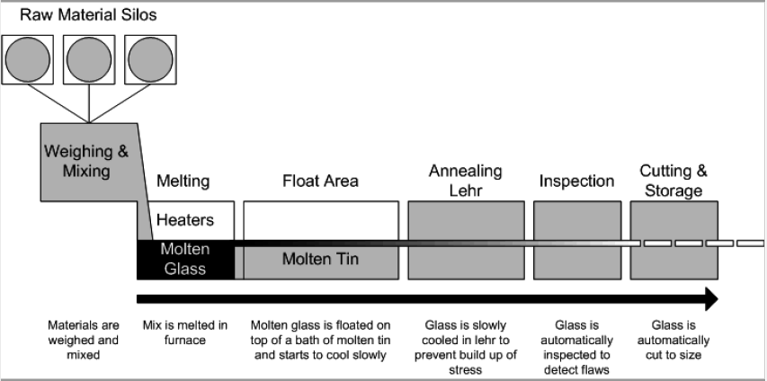
  
  - We could construct the challenging comparisons. 
  
  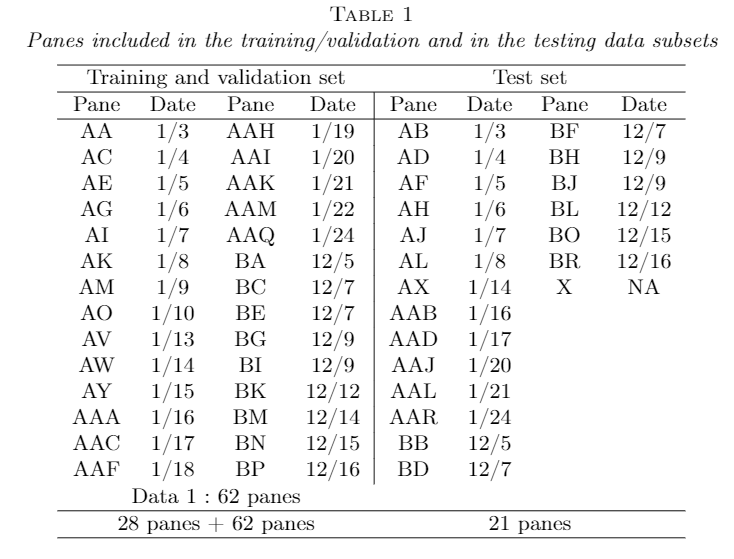
  
  - The elemental chemical concentrations were measured by LA-ICP-MS by the help from Univ. of Iowa. 
  - Each pane was broken to several fragments. Then we pick 24 fragments randomly.
  - Each fragment was measured 5 times for 21 fragments and measured 20 times for 3 fragments. 
  - Using the data, we construct mates and non-mates. 

  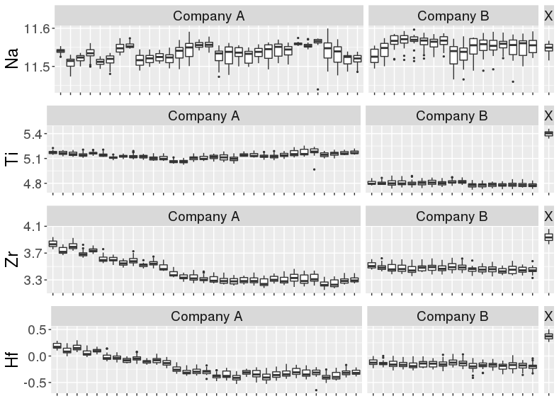

## Data collection 2.0 

  - We are starting a second set of data collection of the float glass samples.
  - Float glass samples were donated from two glass industries which are the same companies that we had for the first collection.
  - Company A and B sent samples that were manufactured from July to September in 2019.
  - We continue to collaborate with Chemistry lab in the University of Iowa. We sent the first 30 samples and the second 30 samples. The measurement process is ongoing by LA-ICP-MS. 
  - They sent us the first six sample measurements from company A. 
  
    + Company A 0800 R 072219 - A1
    + Company A 0800 R 072619 - A2
    + Company A 0800 L 072919 - A3
    + Company A 0800 L 073019 - A4  
    + Company A 0800 R 080919 - A5
    + Company A 0800 L 081819 - A6

  - We keep the same sampling procedure to sample 24 fragments from each pane: 3 fragments measured 20 times and rest of them measured 5 times. 
  - Each time of measurement, we will have 18 chemical elements observations. 
 
 - Box plots of means from the fragments within the pane: red colors are the first data collection and blues are new samples.  
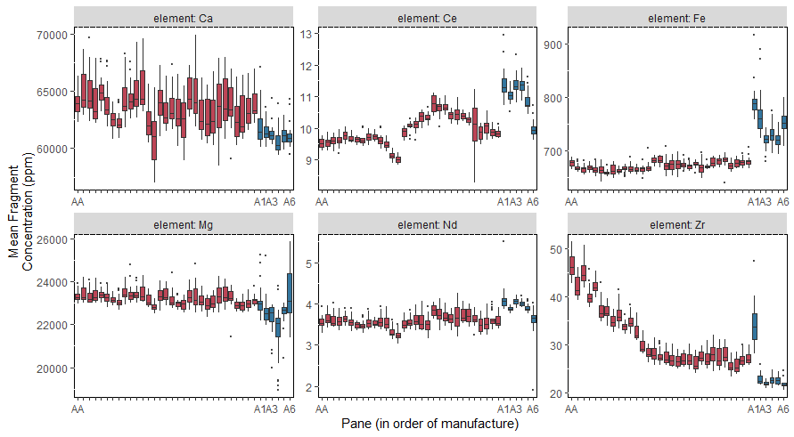

- RSD (Relative Standard Deviation, 100 \(\times\) SD / abs(Mean)) plots. Black lines are the interval of 25\% and 75\% quantile of within fragment RSD. Red dot is the pane RSD, from the means of fragments within the pane. Blue line is the manufacturer RSD, using the means of panes within the manufacturer. 
- RSDs in the pink background are from the new samples. 

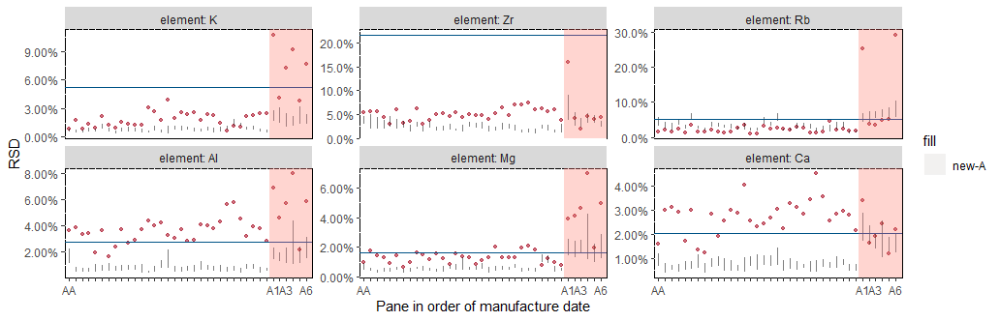

## The ASTM standard method 

- ASTM-E2330-12 (2012) and ASTM-E2927-16 (2016) detail the steps recommended to carry out forensic glass comparisons. 
- At a minimum, the standard approach calls for three fragments from the source at the crime scene (\(n_{K} \geq 3\)), each measured at least three times
(\(M_K \geq 3\)), and one fragment, also measured three times, recovered from the suspect (\(n_Q = 1, M_Q \geq 3\)). Using those measurements:

1.  Calculate the mean concentration for each element \(i = 1, \dots, p\)
  from the known fragments, denoted \(\bar{y}_{Ki\cdot\cdot}\). Also
  record 3\% of the mean, \(0.03\cdot \bar{y}_{Ki\cdot\cdot}\).
2.  Calculate the standard deviation of each elemental concentration from
  the known fragments. Denote this value by \(\sigma_{Ki}\).
3.  Compute an interval for each \(i\): \(\bar{y}_{Ki\cdot\cdot}\) \(\pm\)
  4 \(\times\) \(\max(\sigma_{Ki}, 0.03\cdot \bar{y}_{Ki\cdot\cdot})\).
  This is also known as the \(4\sigma\) interval in the literature
  (cf.~Weis et al. (2011)).
4.   Calculate the mean concentration of each element \(i = 1, \dots, p\)
  in the questioned fragment(s), denoted \(\bar{y}_{Qi\cdot\cdot}\).
5.  Compare the value \(\bar{y}_{Qi\cdot\cdot}\) to the \(4\sigma\)
  interval from Step 3: if
  \(\bar{y}_{Qi\cdot\cdot} \notin (\bar{y}_{Ki\cdot\cdot} \pm 4 \times \max(\sigma_{Ki}, 0.03\cdot \bar{y}_{Ki\cdot\cdot}))\)
  for one or more values of \(i\), the glass sources for two groups
  \(G_K\) and \(G_Q\) are distinguishable. Otherwise, they are
  indistinguishable. This means that if any single element mean value
  from the questioned source does not fall in the \(4\sigma\) interval,
  the glass sources are declared distinguishable, otherwise they are
  declared indistinguishable.

## Learning algorithms to evaluate forensic glass evidence

by Soyoung Park \& Alicia Carriquiry,

published in *The Annals of Applied Statistics* in 2019.06.

- Take the pariwise differences of 18 element values between two fragments which assigned to classes of mates and non-mates. 

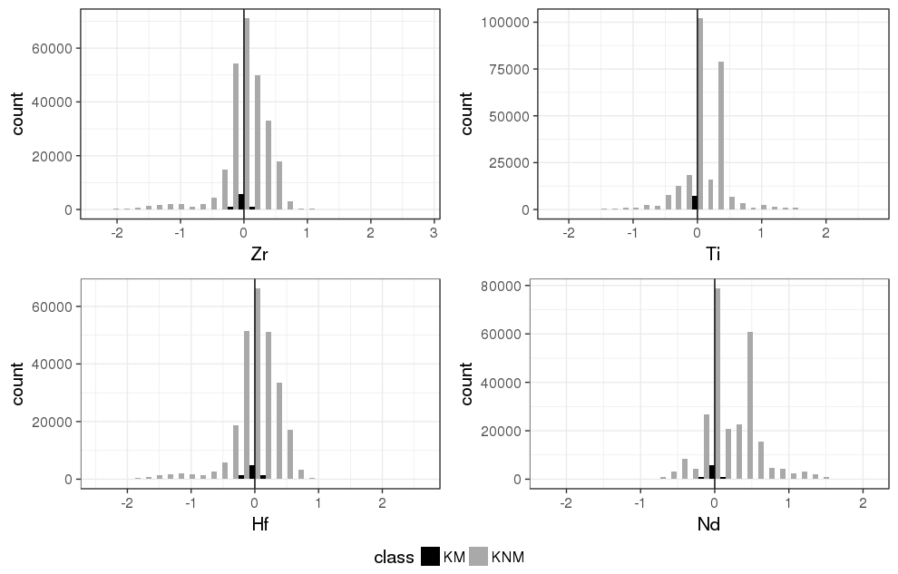

- Developed the scoring metric using several machine learning algorithm and the existing methods, including the ASTM standard. 

- We proposed expressing the criterion suggested
by the ASTM standard as a \emph{score}, representing the degree of
similarity between \(G_K\) and \(G_Q\). Mathematically, this score is
computed as:

\begin{eqnarray}
S_{ASTM,i}&=&\left|\frac{\bar{y}_{Ki\cdot\cdot}-\bar{y}_{Qi\cdot\cdot}}{\max(\sigma_{Ki}, 0.03\cdot \bar{y}_{Ki\cdot\cdot} )}\right| \label{eq:scorestad1} \\ 
 S_{ASTM}&=&\max(S_{ASTM,i})  \label{eq:scorestad2}
\end{eqnarray}

\noindent where \(i \in \{1, 2, \dots 18\}\) indexes element. The
maximum (\(S_{ASTM}\)) across all element-wise scores (\(S_{ASTM,i}\))
becomes the final score to determine if fragments from the pane \(K\)
and the pane \(Q\) have a common source. If \(S_{ASTM} > 4\), then the
two groups of fragments, \(G_K\) and \(G_Q\) from panes \(K\) and \(Q\)
are declared to be distinguishable. 

- Test the source prediction performance among the RF, BART, ASTM, hotelling T^2 shrinkage and more.. 

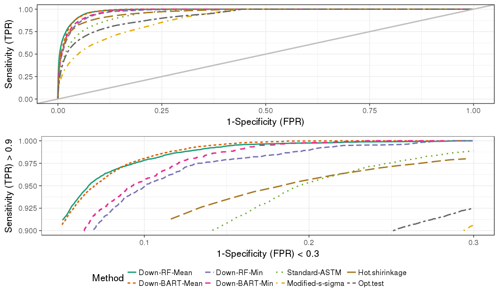

- Density plots by the RF and the ASTM 
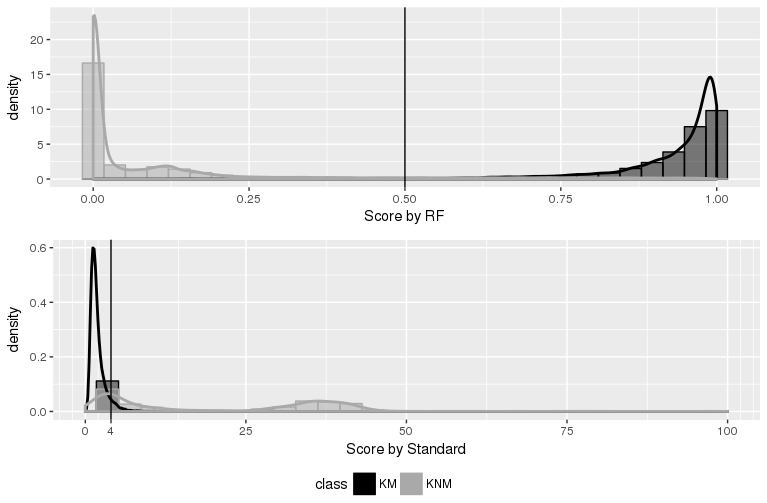

## Evaluation and comparison of methods for forensic glass source conclusions

by Soyoung Park \& Sam Tyner,

accepted for publication in *Forensic Science International* in 2019.

*Understanding the ASTM method*

- Comparison of the RF method and the ASTM method on source conclusion.
- Depart the ASTM criteria into five pieces:

\begin{eqnarray}
S_{ASTM,i}&=&\left|\frac{\bar{y}_{Ki\cdot\cdot}-\bar{y}_{Qi\cdot\cdot}}{\max(\sigma_{Ki}, 0.03\cdot \bar{y}_{Ki\cdot\cdot} )}\right| \\ 
S_{ASTM}&=&\max(S_{ASTM,i}) 
\end{eqnarray}

  1. The absolute difference in mean of two fragments
  
  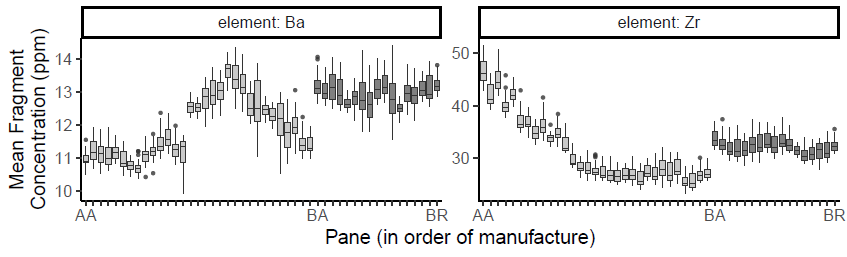
  
  2. Standard Deviation or 3\% Known Mean?
  
  
  
  3. Deciding Element 

  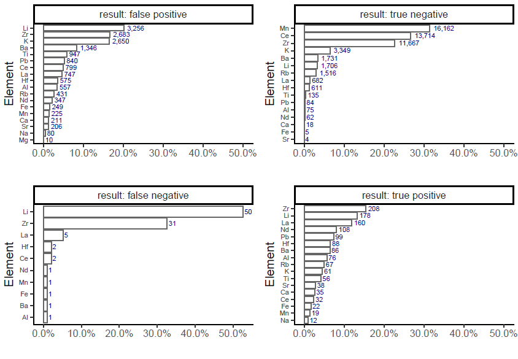
  
  4. Decision Threshold
  
  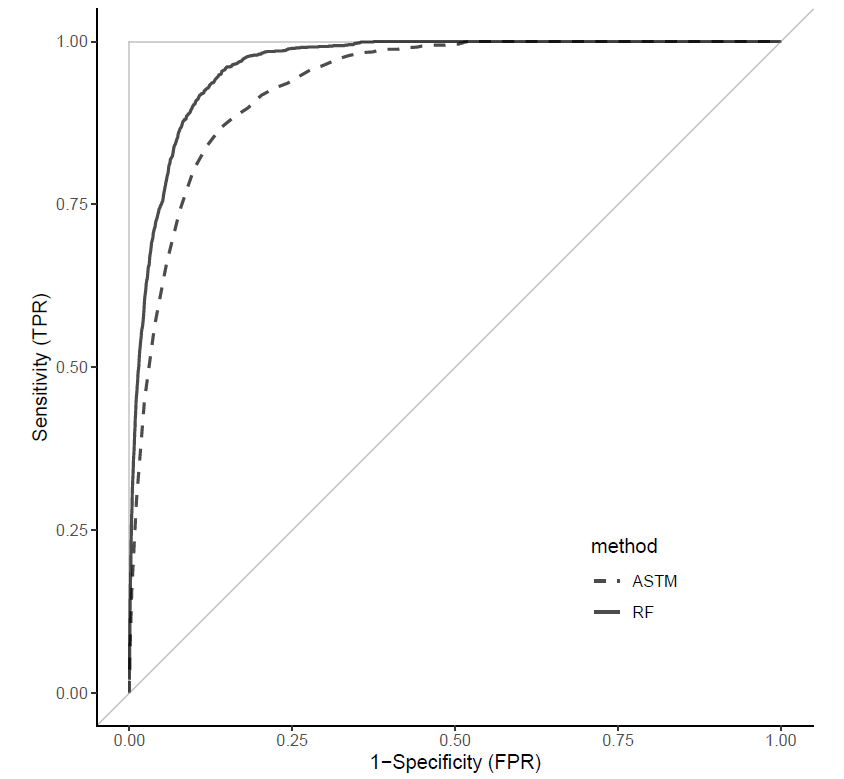
  
  
 |Method|AUC-ROC|EER|OT|FPR(OT)|FNR(OT)|
 |-------|--------|-----|-----|--------|-------|
 |RF     | 0.965  |0.098|0.522| 0.142  | 0.045 |
 |ASTM   | 0.936  |0.137|2.870| 0.140  | 0.133 |
  
  5. Number of Known Fragments

  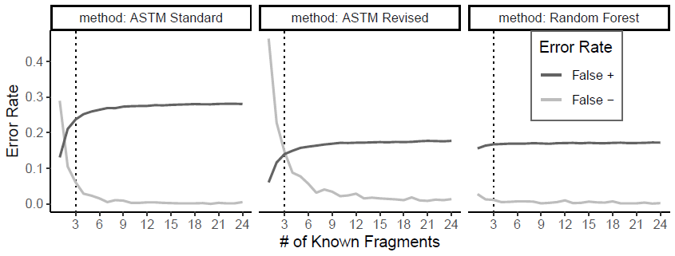

  6. Stressing test 

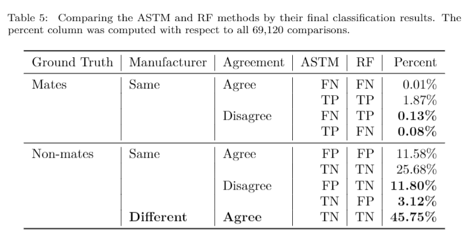
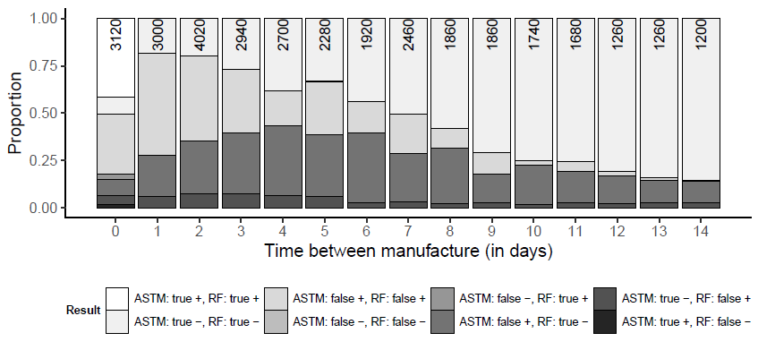
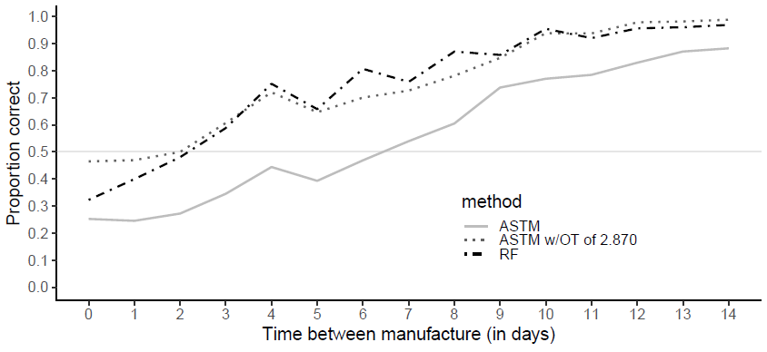

