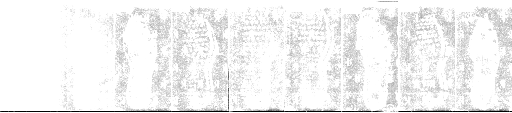
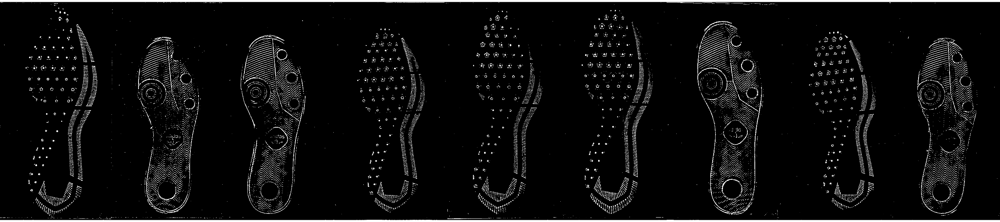

# Shoes {#shoes}

## Longitudinal Shoe Study {#longitudinal}

[Github repository](https://github.com/CSAFE-ISU/Longitudinal_Shoe_Study)

### Original Study Description

### Database Paper

[Paper subdirectory of Github repository](https://github.com/CSAFE-ISU/Longitudinal_Shoe_Study/tree/master/Paper)

#### Methods and Data Description
<p class = "new"> Methods and data description handed off to Alicia for editing </p>

#### Data Analysis Tools
<p class = "new">
- Working with the `EBImage` package - very fast processing of images
</p>

<div class = "new">
##### Film and Powder Images


Analysis Steps:

1. Create threshold mask
    a. Invert the image    
    

    b. Blur image (circular/gaussian blur, diameter 5)    
    

    c. Threshold image (adaptive threshold, 10 x 10 region, keep anything with an average higher than .90 from the mean)    
    

    d. Expand mask    
    (default parameters rad1 = 5, rad2 = 91, proportion, expand_rad = 50)    
    

        1. erode mask image (circle, diameter rad1)
        2. dilate mask image (circle, diameter rad2)
        3. label disjoint regions of the image
        4. prune small image regions (area < proportion parameter)
        5. set background color
        6. create dataframe of useful (non-background) pixels
        7. fill in holes and concave regions in mask, then expand by expand_rad vertically and horizontally (similar to "convex hull", but faster and with additional expansion)

2. Mask image to remove extra variability unrelated to the shoe    


3. Threshold masked image?    


```{r film-clean-code-demo, eval = F, include = F}
source("code/shoes/longitudinal/20190905-Film_Print_Cleaning.R")
```
</div>

<div class = "new">
##### Wear Characterization
Ideas:
- average intensity of cleaned image
- length of border/edges detected
</div>

## Passive Shoe Recognition {#connor}

## Maximum Clique Matching {#soyoung}

## Cocoa Powder Citizen Science {#cocoa}

