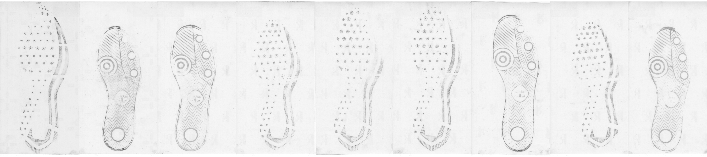
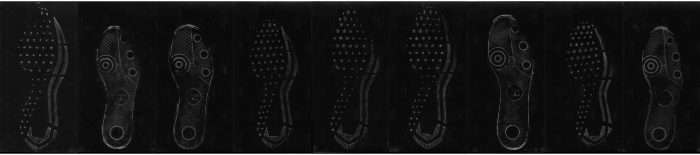
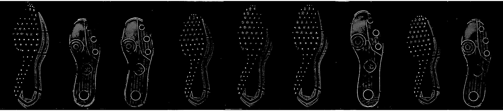
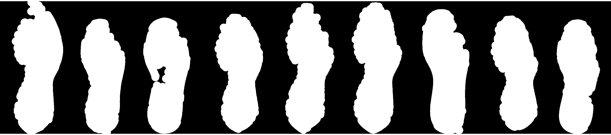

# Shoes {#shoes}

## Longitudinal Shoe Study {#longitudinal}

[Github repository](https://github.com/CSAFE-ISU/Longitudinal_Shoe_Study)

### Paper describing the database

[Paper subdirectory of Github repository](https://github.com/CSAFE-ISU/Longitudinal_Shoe_Study/tree/master/Paper)

Goal: 

- Describe experiment
- Describe database function
- Publicize data for analysis by others in the community

#### Methods and Data Description {-#lss-paper-methods}
Methods and data description handed off to Alicia for editing

#### Data Analysis Tools {-#lss-paper-analysis}
- Working with the `EBImage` package - very fast processing of images

##### Film and Powder Images {-#lss-paper-analysis-film}



Analysis Steps:
<details>
<summary>Summary: Create a mask via thresholding, clean it up, fill in mask holes, creating a shoe "region" mask</summary>

1. Create threshold mask
    a. Blur image (circular/gaussian blur, diameter 15)    
    
    b. Invert the image    
    
    c. Threshold image (adaptive threshold, 10 x 10 region, keep anything with an average higher than 0.025 from the mean)    
    
    d. Create mask    
        Default parameters selected by visually screening several shoes:
        
        (default parameters rad1 = 5, rad2 = <span class="new">91</span>, proportion = 1.5*area of rad2 in px/area of image in px)    
    
        1. erode mask image (circle, diameter rad1)
        2. dilate mask image (circle, diameter rad2)
        3. label disjoint regions of the image
        4. prune small image regions (area < proportion parameter)
    e. Fill in mask holes     
    
    f. Expand mask to capture entire shoe region
    
        1. set background color
        2. create dataframe of useful (non-background) pixels
        3. fill in holes and concave regions in mask, then expand by expand_rad vertically and horizontally (similar to "convex hull", but with additional expansion radius)
        
2. Mask image to remove extra variability unrelated to the shoe    


3. Threshold masked image?    
Con: Lose grey information; Pro: fully remove background    


4. Compromise: Keep grey pixels from thresholded, masked image (e.g. use 3. as a mask), then renormalize    


```{r film-clean-code-demo, eval = F, include = F}
source("code/shoes/longitudinal/20190905-Film_Print_Cleaning.R")
```
</details>

<div class = "new">
I've added the functions from last week to the `ShoeScrubR` package, which will hopefully contain methods for handling all of the different 2D shoe data from the longitudinal study.

Using that package, I tried the method out on a sequence of shoes over time to see what methods might best show wear. Each column shows a single left shoe over four timepoints. The shoes are the first 9 shoeIDs (e.g. 1 - 9).  

- Original     

- Cleaned     

- Cleaned and Thresholded    


Even with the cleaning methods... there is a lot of extra noise. 

Next step: templating!

- Create a template for each size and model combination
- Maximize black pixels within the template region
- Brute force angle and position of template

</div>

##### Wear Characterization {-#lss-paper-analysis-wear}
Ideas:

- average intensity of cleaned image
- length of border/edges detected


## Passive Shoe Recognition {#connor}

<div class = "new">

CoNNOR: Convolutional Neural Network for Outsole Recognition

  - Label images of shoes according to geometric classification scheme
  - Use convolutional base of pretrained CNN VGG16 and train a new classifier on labeled features

[Github repository for CC on CoNNOR](https://github.com/MirandaTilton/ISU_CC)

[Github repository for paper submitted to Forensic Science International](https://github.com/srvanderplas/CoNNORFSI)

Exploring new directions:

  - Truncate convolutional base and train random forest on features
    - Could replace fully connected layers of neural net as classifier
    - Importance score can filter/reduce the number of features
    - *Currently training on HPC, 3 days in*
  - Fully convolutional networks (FCNs)
    - Unsupervised segmentation to assess current classification scheme
    - Handle whole shoe image of any size (instead of only 256x256 pixel images)
    
References for CNNs and FCNs

[Stack Exchange post explaining patchwise training](https://stats.stackexchange.com/questions/266075/patch-wise-training-and-fully-convolutional-training-in-fully-convolutional-neur)

["Learning Hierarchical Features for Scene Labeling"](https://ieeexplore.ieee.org/abstract/document/6338939): describes an application of multi-scale CNNs and image pyramids

["Pyramid methods in image processing"](http://citeseerx.ist.psu.edu/viewdoc/summary?doi=10.1.1.56.8646): classic paper from 1984 explaining pyramid methods

["Fully Convolutional Networks for Semantic Segmentation"](https://people.eecs.berkeley.edu/~jonlong/long_shelhamer_fcn.pdf)

["W-Net: A Deep Model for Fully Unsupervised Image Segmentation"](https://arxiv.org/pdf/1711.08506.pdf)

</div>


## Maximum Clique Matching {#maxclique}

## Cocoa Powder Citizen Science {#cocoa}

## 3d Shoe Recognition 

The set up


What we have tried 

What we are doing now 


