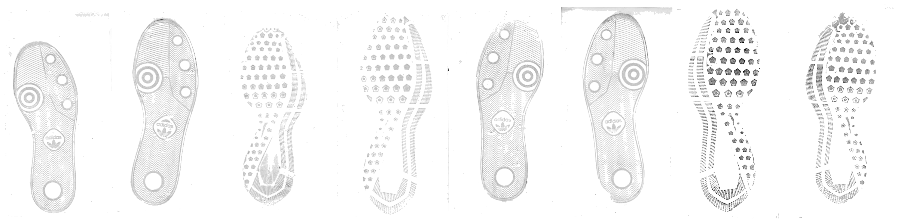
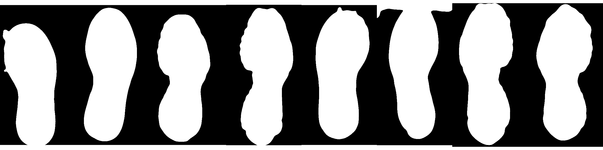
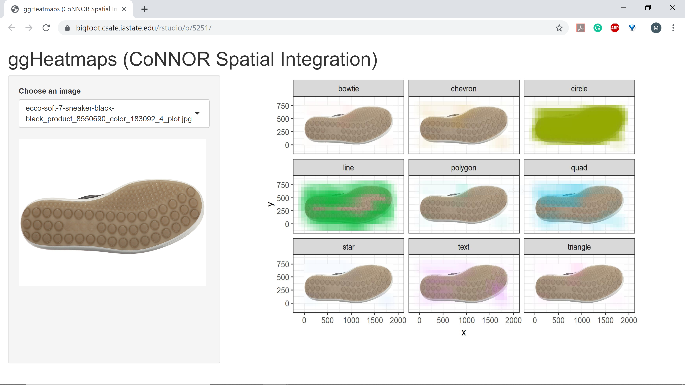
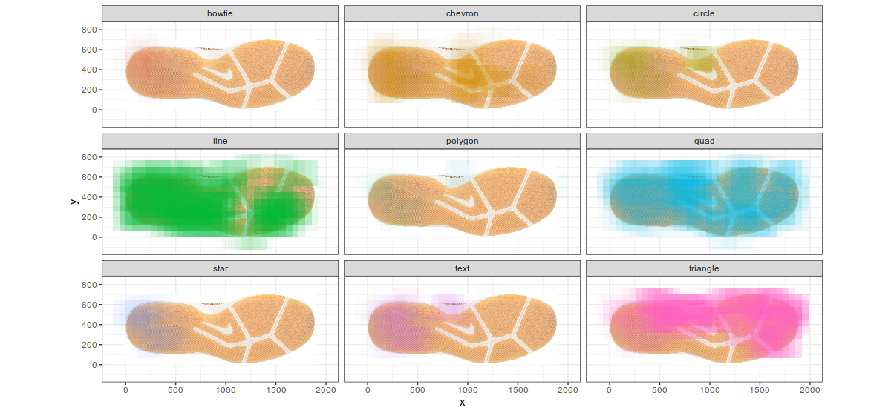
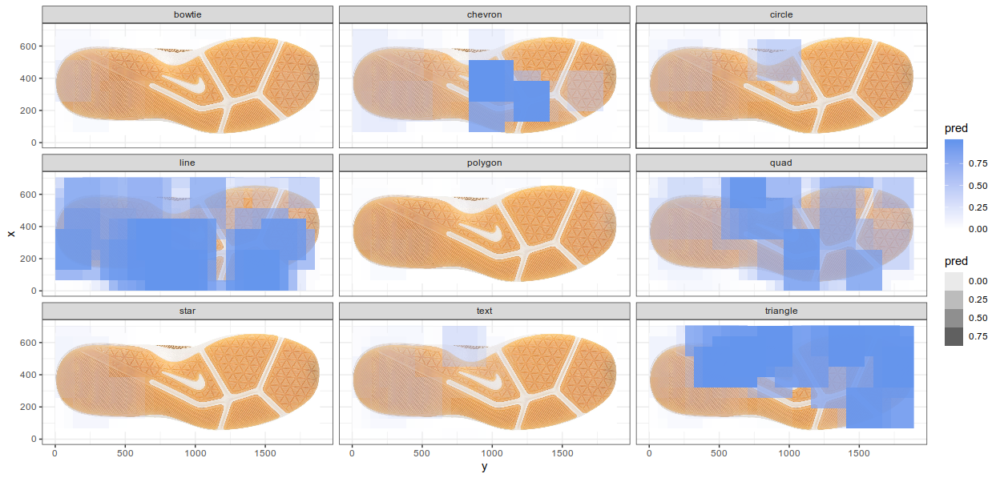
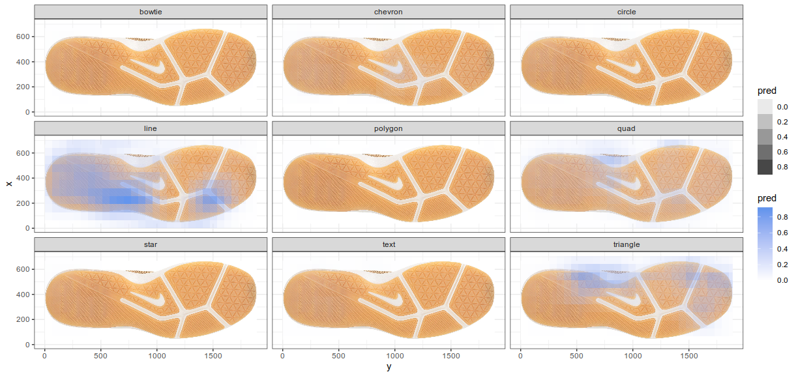
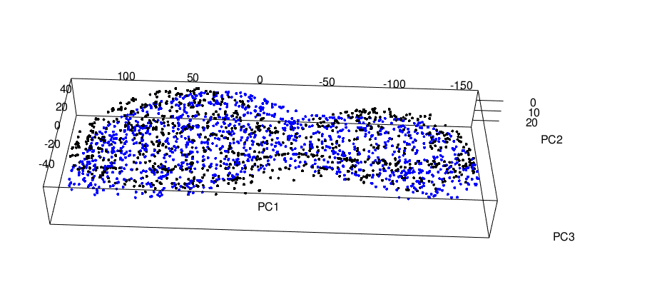
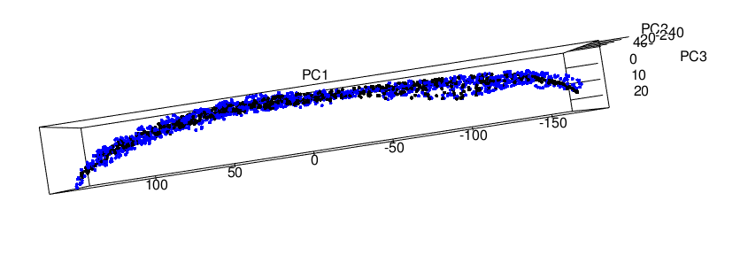
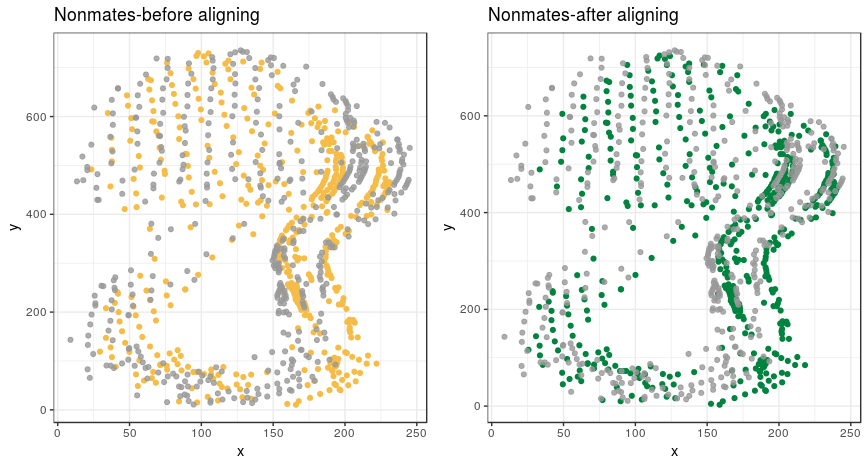
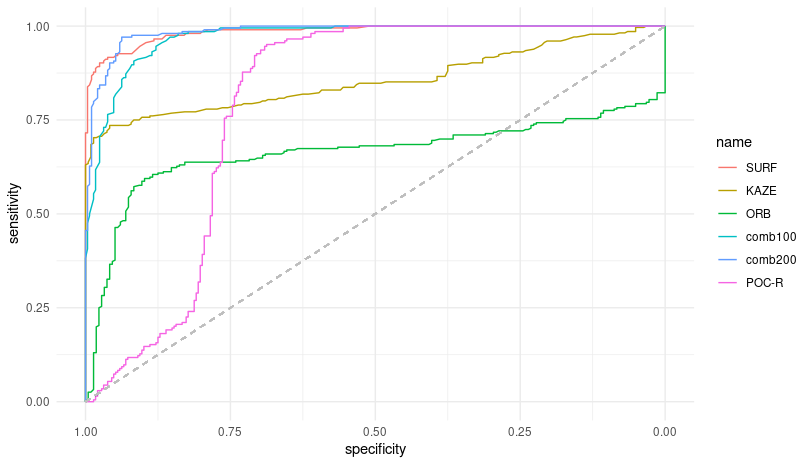

# Shoes {#shoes}

## Longitudinal Shoe Study {#longitudinal}

[Github repository](https://github.com/CSAFE-ISU/Longitudinal_Shoe_Study)

### Paper describing the database

[Paper subdirectory of Github repository](https://github.com/CSAFE-ISU/Longitudinal_Shoe_Study/tree/master/Paper)

Goal: 

- Describe experiment
- Describe database function
- Publicize data for analysis by others in the community

#### Methods and Data Description {-#lss-paper-methods}
Methods and data description handed off to Alicia for editing

#### Data Analysis Tools {-#lss-paper-analysis}
- Working with the `EBImage` package - very fast processing of images

##### `ShoeScrubR` package {-#lss-data-cleaning}
Cleaning methods for the Longitudinal data are contained in the [`ShoeScrubR` package](https://github.com/srvanderplas/ShoeScrubR). The package includes (as of 2019-10-17) a complete set of tests to guard against regressions (100% test coverage!) and uses continuous integration to ensure that the installation process is also monitored.

The `ShoeScrubR` package also includes logging of all image-in image-out operations using attributes - each time a transformation is performed, the transformation and the parameters are appended to the running operations log. This should make it possible to track the provenance of an object through the set of transformations (and potentially un-do them in some cases).

##### Film and Powder Images {-#lss-paper-analysis-film}

The images are challenging to do basic statistical analysis on because the shoe print is made up of tiny particles (e.g. it is not a solid object), and there are areas of smudged particles outside the image (fingerprints, etc.) that can be hard to automatically remove. In addition, the film backing has subtle variations in color. 

The prints are not rotationally aligned, that is, they are taken at a variety of angles (usually $\pm 15^\circ$ from vertical) which vary due to individual differences in walking style, the orientation of the film, and changes in experimental protocol. 

Experimental protocol changes included resolution changes for the scans over time: the resolution of the last set of images is about 2 times higher than the resolution of the first 3 check-ins worth of images. Thus, parameters need to be automatically selected based on the resolution of the image. 

The initial use of templates to clean up the image requires addressing the alignment of the print and the template. As this experiment contains 8 total shoe model and size combinations, it is possible to create a template for each shoe model and use that template to isolate the region of the image which contains a set of features most likely to be a shoe (rather than random noise). 

Solving the template problem by aligning the mask and template yields an additional benefit: the resulting cleaned up image is roughly aligned relative to the template and, presumably, to other images. 

<details>
<summary>Rough Alignment of Template Mask and Image: Clean images, do a rough alignment between the image and the corresponding shoe mask (per model and size).  </summary>

1. Rotationally align image and mask using principal components on the non-background pixels in the image

2. Gross align the non-background pixels in the image and mask
    - Use a "mask-ified" version of the shoe print that encloses most of the shoe region in a single region (see below for explanation)
    - Default to trimming the actual print by 5% on each dimension to minimize the effect of page borders and creases 
    
    - Alignment method options:
        - center of mass - this fails if a print does not account for the whole shoe
        - center of narrowest width - ideally, this is approximately the arch of the shoe.    
        This works better than center of mass in most cases, but occasionally computation fails because it relies on finding a local minimum near the center of the image; if the derivative calculation fails, the algorithm falls back to the center of narrowest width.

    
3. Pad the image and mask so that the centers are aligned and the image and mask are the same size

4. Set any pixels outside the mask to background

Before:    


After:    


These steps are wrapped into the `rough_align` function in the `ShoeScrubR` package. 
</details>
<details><summary>Cleaning the image and exaggerating into a mask</summary>
In several of the methods applied to this data, it has been useful to have an exaggerated version of the image to function as a mask - this exaggerated image has a center of mass similar to the actual mask, for instance. 

Creating this mask requires parameter tuning (done the old way); a new method was developed in order to reduce the number of parameters which depended on image resolution and other similar items. 

In the old method, there were several parameters necessary - gaussian blur diameter for image cleaning, threshold for binarization, gaussian blur diameter for mask creation, threshold for image cleaning, diameter for opening the mask, diameter for closing the mask. 

The new steps are as follows: 

1. Use the EM algorithm to cluster the intensities of the points into three normally distributed categories: signal, intermediate, and background. The normality assumption is highly questionable, but the method works pretty well. Use the calculated pdf values for each point to construct a likelihood ratio of P(signal)/P(intermediate + background). Binarize based on the value of this likelihood ratio - if it's over 10, the pixel is signal.    
    - Each shoe is shown in three separate images, corresponding to the pdf value for each point based on the EM algorithm clustering distribution fitted values. White pixels are highly likely to belong to the group in question - signal, intermediate, and noise.     
        
    - Binarized versions of each shoe    
    

2. The binarized image from the EM algorithm is cleaned slightly using parameters that should be robust to different ppi images (diameters < 10 pixels) - this gets rid of speckling induced by the EM segmentation.    
    - Initial cleaning - dilation and erosion at very small pixel values    
    
    - Labeling disjoint regions (different colors indicate different regions)
    
    - Removing any blobs which are in the 50px square corner region and which do not involve more than 10% of the image.    
        
At this point we can use the mask to clean the image:    


3. The binarized image is exaggerated using parameters which depend only on the size of the image. In general, size $s$ here is the square root of the number of pixels in the image, that is, the side length of the image if it were square.
    - A gaussian blur is applied to the image (diameter $s$/50)    
    
    - Any pixel intensity less than the median is determined to be shoe    
    
    - All disjoint regions are labeled    
    
    - The largest region is selected as the best mask for the shoe
    
    - Some cleaning is done to this mask - any holes are filled in and then it is opened by a diameter of approximately $s$/5 (must be odd)    
    

At this point we can use the mask to get a "clean" image:    


And proceed with the alignment as normal: 


</details>

Aligning each image to the template corresponding to the shoe model and size provides a good first step towards aligning the images to one another, but additional work is necessary in order to ensure that we can compare two images from the same shoe (or two images from different shoes). 
<details>
<summary> Fine Alignment of two images using RNiftyReg
</summary>

The `RNiftyReg` package is intended for alignment of brain scans and other MRI data and uses a symmetric block-matching approach[@modatGlobalImageRegistration2014]. It only allows for registration of images up to 2048x2048, though, which means we will have to align images at a lower resolution and then modify the transformation matrix accordingly. One definite positive feature is that it allows for provision of a mask for both the source and target images so that only pixels within the mask are used for alignment. <!-- This means that we could be using the original images and just providing the mask to ensure alignment -->

_Affine transformations_ are a type of image transformation that encompasses translation, resizing, rotation, and skew operations. Affine transformations preserve collinearity and ratios of distances: parallel lines remain parallel after the transformation. A subset of affine transformations are so-called "rigid body" transformations, which only allow translation and rotation. 

```{r, eval = F, echo = F, message = F, warning = F, fig.width = 8, fig.height = 2, out.width ="100%"}
library(EBImage)
library(tidyverse)
img <- EBImage::readImage("https://upload.wikimedia.org/wikipedia/commons/thumb/4/44/Checkerboard_identity.svg/480px-Checkerboard_identity.svg.png", type = "png") %>%
  EBImage::channel("luminance")

png("images/shoes/longitudinal/affine_transformations.png", width = 800, height = 200, units = "px", pointsize = 24)
par(mfrow = c(1, 4))
plot(img)
text(x = dim(img)[1]/2, y = dim(img)[2]/2, label = "Original Image", col = "red")
affine(img, matrix(c(cos(pi/6), -sin(pi/6), sin(pi/6), cos(pi/6), 0, dim(img)[2]/2), nrow = 3, byrow = T), output.dim = rep(sqrt(sum(dim(img)^2)), 2), bg.col = 1) %>% plot()
text(x = sqrt(sum(dim(img)^2))/2, y = sqrt(sum(dim(img)^2))/2, label = "30 deg rotation", col = "red")
affine(img, matrix(c(2, 0, 0, 1, 0, 0), nrow = 3, byrow = T), output.dim = dim(img)*c(2, 1), bg.col = 1) %>% plot()
text(x = 2*dim(img)[1]/2, y = dim(img)[2]/2, label = "Scaling", col = "red")
affine(img, matrix(c(1, 0, .5, 1, 0, 0), nrow = 3, byrow = T), output.dim = dim(img)*c(1.5, 1), bg.col = 1) %>% plot()
text(x = 1.5*dim(img)[1]/2, y = dim(img)[2]/2, label = "Shearing", col = "red")
dev.off()
```


RNiftyReg allows for linear (rigid-body, affine), and nonlinear transformations, but for the moment, we are only interested in rigid-body transformations - while the shoes may have some slight distortion due to the wearer and kinematics of walking, this is minor and should not interfere too greatly with a gross alignment. 

RNiftyReg's `niftyreg.linear` function returns a 4x4 transformation matrix describing the composition of multiple image transformation operations. A 3x3 matrix is necessary for 3-dimensional image rotation, resizing, and skew operations; it is then augmented by a row of zeros on the bottom and a column ending with a 1 that describes the x, y, and z translation coordinates. In this way, a 4x4 matrix can represent the composition of all relevant image transformation operations in 3 dimensions. In two dimensions, many of the cells in this matrix are 0. 

 | | | 
--- | --- | --- | --- 
1 | 2 | 3 | 4
5 | 6 | 7 | 8
9 | 10 | 11 | 12
13 | 14 | 15 | 16

Cells 1, 2, 5, 6 describe the [rotation operation](https://en.wikipedia.org/wiki/Rotation_matrix); the angle of rotation can be recovered using trigonometry. 

Cells 4, 8 describe the translation operation, e.g. the row (4) and column(8) offset from one matrix to another. 

For 2D rigid transformations, these are the only cells which matter. Cells 11 and 16 are 1, and 3, 7, 9, 10, 12, 13, 14, 15 are all 0 under these constraints. 

In order to use `RNiftyReg` for registration of the original-size images, we have to scale cells 4 and 8, but the rest of the cells remain unscaled. 

Note that `EBImage` uses what is essentially the transposed version of the matrix used by `RNiftyReg`, reduced to elements 1, 2, 5, 6, 4, 8 in a 3 row by 2 column matrix. 

 | 
-- | --
1 | 5
2 | 6
4 | 8


Starting with a set of 6 shoes observed at 3 timepoints each, with 2 different "modes" of print capture, we can align both prints taken on the same date for each shoe. 

The original images: (1 and 2 are taken at the same time point, 3 and 4, etc. 1-6 are the same physical shoe over time and so on)


The images are first aligned to masks, which are used to clean the images to reduce noise.


Then reduced-size versions of each image pair are aligned, producing a transformation matrix: 

|          |           |   |          |
|---------:|----------:|--:|---------:|
| 0.9999730| -0.0073485|  0|  **30.48815**|
| 0.0073485|  0.9999730|  0| **-10.16105**|
| 0.0000000|  0.0000000|  1|   0.00000|
| 0.0000000|  0.0000000|  0|   1.00000|

(this is one example)

The coordinates in bold have been scaled according to the size reduction, so that they can be applied to the full-size images. 


The resulting aligned images are shown above; black pixels are areas where both images agree; pink and blue pixels represent areas found in one image but not the other. Some images which have many bubbles (air between the film and backing) or which contain blurred or double prints do not align accurately; this is really not avoidable with automatic alignment solutions. 

The alignment process itself (without any image preprocessing) is extremely fast, about 1s per image pair, and seems to be similar even when image size is increased by a factor of 16. Due to the scaling process and necessary modification of the transformation matrix, the alignments may be off by 1-5 pixels in some cases. This might be handled by aligning a smaller subset of the image at full resolution. (TODO)

</details>

<div class="new">
Given how well RNiftyReg works, the next question is whether all of the preprocessing is even necessary. 

In the image below, the first row is alignment with the full image, the second is alignment with a binarized version of the output image (so masked + thresholded), and the third is automatically cropped around the mask which is aligned to the image using the rough-align process. The third row maintains most of the information and produces better alignments than the other rows; thus, we can conclude that it's necessary to combine the preprocessing and rough alignment in order to get the best results from RNiftyReg.


</div>

<div class="new"> 
<details><summary>Combining information from multiple images</summary>

With aligned images, we can then combine the information in each of the two prints taken at the same timepoint to get more reliable images. Because the methodology for acquiring the prints changed from timepoint to timepoint, the analysis of each type of print doesn't make sense - it is completely conflated with the observation date. However, the multiple prints aren't wasted, because while each print may be missing information, the combination of both of the prints (when properly aligned) provides a much more reliable assessment of the shoe (and the wear of that shoe at the proper timepoint). There are at least 3 options to combine these images (note that white = 1, black = 0):

- Take the pixel-by-pixel minimum: this keeps all the noise from both images (but there's relatively little noise in the cropped images, so that may not matter too much). If images are misaligned, this results in a "double" print (or smeared print). This method is also sensitive to the lightness of the print - a complete print would still be ignored if the "dark" part of the print was lighter than the "light" part of the second print.     

- Take the pixel-by-pixel maximum: this keeps only points which appear strongly in both images (losing a lot of data but also a lot of noise in the process)    

- Take the pixel-by-pixel mean: This would result in lighter regions where one image has "gaps" but would reduce noise and make it clear where there is less sure information.


Of these options, the first seems like the best, but the last provides some idea of whether the alignment was decent to begin with.

</div>
</details>

##### Wear Characterization {-#lss-paper-analysis-wear}
Ideas:

- average intensity of cleaned image
- length of border/edges detected


## Passive Shoe Recognition {#connor}

### NIJ Grant

Grant scope: Build the shoe scanner, develop an automatic recognition algorithm for geometric design elements, test the scanner in locations around Ames.

### CoNNOR: Convolutional Neural Network for Outsole Recognition##

**Project Overview**

  - Label images of shoes according to geometric classification scheme
  - Use convolutional base of pretrained CNN VGG16 and train a new classifier on labeled features
  - Eventually, acquire real data passively and use CoNNOR to assess feature similarities and frequencies

[Link to submitted Creative Component on CoNNOR](https://lib.dr.iastate.edu/creativecomponents/264/)

[Github repository for paper submitted to Forensic Science International](https://github.com/srvanderplas/CoNNORFSI)

**Exploring new directions:**

- Truncate convolutional base and train random forest on features
    - Could replace fully connected layers of neural net as classifier
    - Importance score can filter/reduce the number of features 
    - *Training the random forest requires too much memory for Bigfoot (CSAFE server), and still takes over two weeks on the HPC. We're setting this goal aside for now, but could try subsampling the features for a random forest in the future.*
  
- *Spatial integration*
    - *Model is currently set up to take in 256x256 pixels*
    - *Try taking in full shoe using a sliding window of size 256x256*
    - *View class predictions spatially*
  
- Fully convolutional networks (FCNs)
    - Unsupervised segmentation to assess current classification scheme
    - Handle whole shoe image of any size (instead of only 256x256 pixel images)
    
    
**References for CNNs and FCNs**

[Stack Exchange post explaining patchwise training](https://stats.stackexchange.com/questions/266075/patch-wise-training-and-fully-convolutional-training-in-fully-convolutional-neur)

["Learning Hierarchical Features for Scene Labeling"](https://ieeexplore.ieee.org/abstract/document/6338939): describes an application of multi-scale CNNs and image pyramids

["Pyramid methods in image processing"](http://citeseerx.ist.psu.edu/viewdoc/summary?doi=10.1.1.56.8646): classic paper from 1984 explaining pyramid methods

["Fully Convolutional Networks for Semantic Segmentation"](https://people.eecs.berkeley.edu/~jonlong/long_shelhamer_fcn.pdf)

["W-Net: A Deep Model for Fully Unsupervised Image Segmentation"](https://arxiv.org/pdf/1711.08506.pdf)


### Spatial integration

The overhead costs of going fully convolutional are high; CNN papers are opaque, and many supervised techniques require fully labeled data for semantic segmentation (i.e., label every pixel). Moreover, complex models (for both supervised and unsupervised tequniques) are often only available in Python, and there are a large number of GitHub repositories of mixed quality and reliability. Filtering for quality, understanding code structures, and implementing them on HPC are all enormous tasks on their own.

In the meantime, it is much easier (relatively speaking) to use our existing framework of 256x256 square pixel images, for which we have generated thousands of labeled images and have already trained and improved domain-specific models. Currently, I have code working to automatically crop image borders, chop the image into 256x256 pixels (padding the image when appropriate) and equalize the contrast on the individual images.

**Pad the left and top of the image with a pre-specified offset, then chop the image into 256x256 pixel pieces**  


**Equalize the contrast channel for each piece of the image**
 

**Use the trained model to predict each piece of the image for each class**
 

**Repeat the above process for different cuts of the original image, and aggregate predictions**


**Shiny App**



**Updates/In progress:**

- Presented on CoNNOR at [ISU's 3-Minute Thesis competition](https://www.grad-college.iastate.edu/three-minute-thesis/)
    - Preliminaries: 8 heats with 10-12 participants each
    - Runner up to a guy making better yogurt
- Implementing semantic segmentation model on HPC
    - Learning HPC structure, command line syntax, using Python in practice
    - Documentation assumes high baseline of knowledge :(
- Improving spatial integration process
    - Remove predictions for blank (and mostly blank) edge images
    - Smooth predictions for overlapping image pieces
    - Average and max predictions shown below. Something in between might be better?


<div class = "new">

**New Images**








</div>


## Maximum Clique Matching {#maxclique}

## Project Tread (formerly Cocoa Powder Citizen Science) {#cocoa}

Project Tread, modified from [Leverhulme Institute's Sole Searching](https://www.dundee.ac.uk/leverhulme/citizenscience/details/sole-searching.php), is a developing CSAFE project with the goals of engaging community participation in forensic research and acquiring shoe print data that may be useful in future analyses.


<div class = "new">
In progress:

- Review [procedures](https://forensicstats.org/project-tread/) and IRB documents written by James
- Volunteers are testing modified procedure (below)
- Be involved in set up of data collection site (through CSSM)
</div>


#### Comparing the procedures

| Procedure           | Leverhulme      | CSAFE (initial)    | CSAFE (proposed) |
|---------------------|-----------------|--------------------|------------------|
| 'Before' Views      | 4 per shoe      | 5 per shoe         | 5 per shoe       |
| 'Before' Pictures   | 1 per view      | 3 per view         | 1 per view       |
| Total 'before' pics | 4 per shoe      | 15 per shoe        | 5 per shoe       |
|                     |                 |                    |                  |
| Paper               | Letter (larger) | Tape 8.5 x 11      | Tape 8.5 x 11    |
|                     |                 |                    |                  |
| Actions             | Run, jump, walk | Step, hop          | Step, hop        |
| Replicates          | 6 per action    | 9 per action       | 3 per action     |
| 'After' Pictures    | 1 pic per rep.  | 3 pics per rep.    | 1 pic per rep.   |
|                     |                 |                    |                  |
| Total number prints | 18 per shoe     | 18 per shoe        | 6 per shoe       |
| Total number images | 18 per shoe     | 54 per shoe        | 6 per shoe       |
|                     |                 |                    |                  |
| Requested # shoes   | Not specified   | Both shoes         | One, 2nd optional|


**Recommended procedure modifications:**

- Ask for one high-quality image of each shoe angle ('before') and print ('after'), instead of three replicate images of each
    - If Project Tread submission website is set up like current CSSM system (which takes community submissions for environmental images), intermediate quality control can help filter out bad images
- Only ask for one shoe, and make second shoe optional
    - E.g., always ask for left shoe, and make right shoe optional
- Ask for 3 replicates per shoe
    - Longitudinal shoe study uses 2-3 replicates per shoe
    
    

## 3d Shoe Recognition 

The set up: 

Note: With these alignment processes we are assuming that the shoe size does not change with wear and that we are not aligning across pairs of shoes. 

Then we want to look at the change overtime a specific shoe, so we need to grab the shoe scans over time. Using the function *shoe_grab* to grab the scans of a given shoe ID, specify the id number of a shoe you want to look at, (Make sure you have access to the data, follow the steps on the README for more information. For more information on the shoe data, see **Longituidinal_Shoe_Study**), and turns the given shoe into mesh objects to do further analysis. 


What we have tried: 

At first we wanted to try to simplify the mesh object to just the basic shape in order have simplicity when aligning. The idea of allignment is to take the most basic features, allign them, then by adding complexity of the soul, further allign the two different shoes. The idea is that we want to take a lower detail scan of shoe, allign it, then by adding complexity we can further allign the shoes. However the problem was realized that we are using a prediction to allign rather than the shoe, which ran into some quick problems. 

What we are doing now 
  - Transforming the mesh objects to points aligned by the center of mass to overlay them detecting difference. 

  - Problems 
    - Isnt aligning properly as you can see 
  - Next
    - angle transformations 
    
-PCA: 



Better 
    
## Shoe outsole matching using image descriptors

### Features
Previously, features such as edge, corner, SURF were extracted to match shoeprints. The goal of this project is to find other image descriptors as image features for shoe print matching. 

**Image descriptors**

  - SURF(Speeded Up Robust Features)- blobs
  - KAZE - blobs
  - ORB(Oriented FAST and Rotated BRIEF)- corners


**Image matching**

  - CSAFE data - Nike size of 10.5 and Adidas size of 10 will be used to construct mated and non-mated matching
  - Features will be combination of strong 100 points of KAZE, ORB, SURF. 
  


### Matching on clean and full images


- Mates : Image (1) and (2)
- Non-mates : Image (1) and (3), Image (2) and (3) 


**Performance evaluation using**

  - **SURF 500**
  - KAZE 500
  - ORB 500
  - SURF 100 + KAZE 100 + ORB 100
  - SURF 200 + KAZE 200 + ORB 200
  - POC (Phase-only correlation)
  - FMTC (Fourier Mellon transformation correlation)
  


**Example graphs of mates**:


**Example graphs of non-mates**:



**Example matching table using SURF 500**:

Class | Clique size | Rotation angle | % Overlap | Median distance of OP|
------|-------------|----------------|-----------|----------------------|
Mates |   18        |       2.11     |   0.5646  |        0.78          |
Non-mates|    9     |       6.43     |   0.1208  |        1.39          |


**Density plots**:


**ROC curves on test comparisons**:


  
### Matching on degraded and partial images  
  
**Example of degraded images**:


**ROC curves on test comparisons**:


**ROC curves on test comparisons**:



**What we plan to do**:

  - Get ROC curves using KASE, ORB, combination of them
  - Do the same comparisons on degraded and partial impressions
  - Submit the paper
  


  
## Impact of weight to outsole scans from EverOS 2D scanner 

**Analysis setup**:

   - Shoes: 5 pairs of Nike Winflow 4, size 10.5 (Brand-new shoes)
   - Participants: Person 1 (weight aa lb)and person 2 (bb lb)
   - Weights: 2 weight vests (20 lbs and 12 lbs)
   - Weight variations: W1(P1), W2(P1 with one vest), W3(P1 with two vests), W4(P2), W5(P2 with one vest), W6(P2 with two vests)
   - W1 $=$ 155.2 lb, **W2 $=$ 173.8 lb**, W3 $=$ 187.6 lb, **W4 $=$ 178 lb**, W5 $=$ 197.4 lb, W6 $=$ 211 lb
  
  
  
**Result1**:

  - Shoe is fixed to left side of shoe1.
  


**Result2**:

  - Purple, green: comparison between repeated replicates from the same shoe, W2-W2, W4-W4.
  - Comparison between weights W2 and W4: weights are almost the same. 
  - Yellow: comparison when shoe is fixed to shoe1-L.
  - Red: comparison between shoe1 – shoe2-5. 
  - Shoes are never used.


