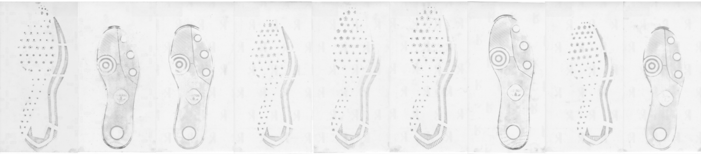
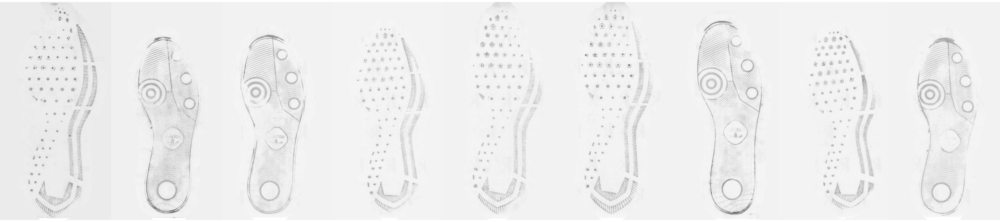

# Shoes {#shoes}

## Longitudinal Shoe Study {#longitudinal}

[Github repository](https://github.com/CSAFE-ISU/Longitudinal_Shoe_Study)

### Paper describing the database

[Paper subdirectory of Github repository](https://github.com/CSAFE-ISU/Longitudinal_Shoe_Study/tree/master/Paper)

Goal: 

- Describe experiment
- Describe database function
- Publicize data for analysis by others in the community

#### Methods and Data Description {-#lss-paper-methods}
Methods and data description handed off to Alicia for editing

#### Data Analysis Tools {-#lss-paper-analysis}
- Working with the `EBImage` package - very fast processing of images

##### Film and Powder Images {-#lss-paper-analysis-film}

<details>
<summary>Analysis Summary: Create a mask via thresholding, clean it up, fill in mask holes, creating a shoe "region" mask. Apply this mask to the image, replacing any pixels outside the mask with the median background pixel. Additional thresholding and normalization can be applied if a binary image is more desireable. </summary>


1. Create threshold mask
    a. Blur image (circular/gaussian blur, diameter 15)    
    
    b. Invert the image    
    
    c. Threshold image (adaptive threshold, 10 x 10 region, keep anything with an average higher than 0.025 from the mean)    
    
    d. Create mask    
        Default parameters selected by visually screening several shoes:
        
        (default parameters rad1 = 5, rad2 = <span class="new">91</span>, proportion = 1.5*area of rad2 in px/area of image in px)    
    
        1. erode mask image (circle, diameter rad1)
        2. dilate mask image (circle, diameter rad2)
        3. label disjoint regions of the image
        4. prune small image regions (area < proportion parameter)
    e. Fill in mask holes     
    
    f. Expand mask to capture entire shoe region
    
        1. set background color
        2. create dataframe of useful (non-background) pixels
        3. fill in holes and concave regions in mask, then expand by expand_rad vertically and horizontally (similar to "convex hull", but with additional expansion radius)
        
2. Mask image to remove extra variability unrelated to the shoe    


3. Threshold masked image?    
Con: Lose grey information; Pro: fully remove background    


4. Compromise: Keep grey pixels from thresholded, masked image (e.g. use 3. as a mask), then renormalize    


```{r film-clean-code-demo, eval = F, include = F}
source("code/shoes/longitudinal/20190905-Film_Print_Cleaning.R")
```
</details>

<div class = "new">
I've added the functions from last week to the `ShoeScrubR` package, which will hopefully contain methods for handling all of the different 2D shoe data from the longitudinal study.

Using that package, I tried the method out on a sequence of shoes over time to see what methods might best show wear. Each column shows a single left shoe over four timepoints. The shoes are the first 9 shoeIDs (e.g. 1 - 9).  

<details><summary>Original</summary>

</details>
<details><summary>Cleaned</summary>     
</details>
<details><summary>Cleaned and Thresholded</summary> 
</details>

Even with the cleaning methods... there is a lot of extra noise. 
</div>

Next step: templating!

Basic framework: 

<details><summary>Create a template for each size and model combination</summary>
(using GIMP - if I could automate this, I wouldn't need the template)
</details>

<details><summary>Intelligently brute force angle and position of template    
Goal: Maximize the number of black pixels in the image within the template region
</summary>


1. Start with an image and a template mask

2. Blur, normalize, invert, and threshold the image    


3. Naively align the "centers" of the two images (avg of white pixel row/cols). To make this calculation comparable, do some very crude dilation/erosion (that may or may not generalize that well) to fill in the image a bit.    
    
Then make the aligned center the actual center of the image via padding. (This is the 1st time we have modified the actual image beyond thresholding and color changes).

<div class = "new">
4. ~~Create a new mask to sample the image (and the mask) radially. ~~ This doesn't work when the object isn't a solid entity :(    
    
New Option: Use image pyramids and brute-force alignment, starting off with an estimated rotation angle of $\theta$ from principal components    
    
    


5. Brute force full-size image to get finer alignment.


</div>
6. Remove anything not in the mask region.

```{r film-template-code-demo, eval = F, include = F}
source("code/shoes/longitudinal/20190912-Templates_Intro_Radial_Alignment.R")
```

</details>


##### Wear Characterization {-#lss-paper-analysis-wear}
Ideas:

- average intensity of cleaned image
- length of border/edges detected


## Passive Shoe Recognition {#connor}

### NIJ Grant

<div class="new">
Grant scope: Build the shoe scanner, develop an automatic recognition algorithm for geometric design elements, test the scanner in locations around Ames.

Status: Funded! Next challenge: Figuring out how to transfer it to UNL.
</div>
### CoNNOR: Convolutional Neural Network for Outsole Recognition##

**Project Overview**

  - Label images of shoes according to geometric classification scheme
  - Use convolutional base of pretrained CNN VGG16 and train a new classifier on labeled features
  - Eventually, acquire real data passively and use CoNNOR to assess feature similarities and frequencies

[Link to submitted Creative Component on CoNNOR](https://lib.dr.iastate.edu/creativecomponents/264/)

[Github repository for paper submitted to Forensic Science International](https://github.com/srvanderplas/CoNNORFSI)

**Exploring new directions:**

- Truncate convolutional base and train random forest on features
    - Could replace fully connected layers of neural net as classifier
    - Importance score can filter/reduce the number of features 
    - *Block 4 random forest training terminated after one week :( *
    - *Block 5 currently training for two different random forest packages (randomForest and ranger)*
    - *If new models take more than 1-2 weeks, will look into subsampling techniques.*
  
- *Spatial integration*
    - *Model is currently set up to take in 256x256 pixels*
    - *Try taking in full shoe using a sliding window of size 256x256*
    - *View class predictions spatially*
  
- Fully convolutional networks (FCNs)
    - Unsupervised segmentation to assess current classification scheme
    - Handle whole shoe image of any size (instead of only 256x256 pixel images)
    
    
**References for CNNs and FCNs**

[Stack Exchange post explaining patchwise training](https://stats.stackexchange.com/questions/266075/patch-wise-training-and-fully-convolutional-training-in-fully-convolutional-neur)

["Learning Hierarchical Features for Scene Labeling"](https://ieeexplore.ieee.org/abstract/document/6338939): describes an application of multi-scale CNNs and image pyramids

["Pyramid methods in image processing"](http://citeseerx.ist.psu.edu/viewdoc/summary?doi=10.1.1.56.8646): classic paper from 1984 explaining pyramid methods

["Fully Convolutional Networks for Semantic Segmentation"](https://people.eecs.berkeley.edu/~jonlong/long_shelhamer_fcn.pdf)

["W-Net: A Deep Model for Fully Unsupervised Image Segmentation"](https://arxiv.org/pdf/1711.08506.pdf)


### Spatial integration

<div class = "new">

The overhead costs of going fully convolutional are high; CNN papers are opaque, and many supervised techniques require fully labeled data for semantic segmentation (i.e., label every pixel). Moreover, complex models (for both supervised and unsupervised tequniques) are often only available in Python, and there are a large number of GitHub repositories of mixed quality and reliability. Filtering for quality, understanding code structures, and implementing them on HPC are all enormous tasks on their own.

In the meantime, it is much easier (relatively speaking) to use our existing framework of 256x256 square pixel images, for which we have generated thousands of labeled images and have already trained and improved domain-specific models. Currently, I have code working to automatically crop image borders, chop the image into 256x256 pixels (padding the image when appropriate) and correct the contrast on the individual images.

</div>

    
  

I hoped to have some cool visualizations to show today. Unfortunately, model predictions are behaving very strangely, and I haven't been able to figure out why... All classes are predicting to zero, except quadrilaterals.

  

Possible issues:

- <del>The specific shoe is behaving strangely</del> The issue persists for multiple shoes
- <del>Using a different package to read in the image changes the extracted features</del> The issue persists when I try using the original image reading function
- <del>Contrast correction changes predictions</del> The issue exists for images both with and without contrast correction
- <del>Model trained incorrectly</del> The [Shiny app](https://bigfoot.csafe.iastate.edu:442/tiltonm/NNPreview/) shows predictions on the test set are behaving as expected
- Bigfoot is angry?

Bottom line: CNN features are NOT interpretable, which makes them VERY hard to debug.


## Maximum Clique Matching {#maxclique}

## Project Tread (formerly Cocoa Powder Citizen Science) {#cocoa}

Project Tread, modified from [Leverhulme Institute's Sole Searching](https://www.dundee.ac.uk/leverhulme/citizenscience/details/sole-searching.php), is a developing CSAFE project with the goals of engaging community participation in forensic research and acquiring shoe print data that may be useful in future analyses.

In progress:

- Review [procedures](https://forensicstats.org/project-tread/) and IRB documents written by James
- Perhaps modify procedures, then bribe some friends into helping me test them :)
    - Test for length, clarity, ease, etc.
- Be involved in set up of data collection site (through CSSM)

<div class = "new">

#### Comparing the procedures


| Procedure           | Leverhulme      | CSAFE              |
|---------------------|-----------------|--------------------|
| 'Before' Pictures   | 4 per shoe      | 15 per shoe        |
| Paper               | Letter (larger) | Tape printer paper |
|                     |                 |                    |
| Actions             | Run, jump, walk | Step, hop          |
| Replicates          | 6 per shoe      | 9 per shoe         |
| 'After' Pictures    | 1 pic per print | 3 pics per print   |
|                     |                 |                    |
| Total number prints | 18 per shoe     | 18 per shoe        |
| Total number images | 18 per shoe     | 54 per shoe        |

</div>

## 3d Shoe Recognition 

The set up


What we have tried 

What we are doing now 
  - Transforming the mesh objects to points aligned by the center of mass to overlay them detecting difference. 

  - Problems 
    - Isnt aligning properly as you can see 
  - Next
    - angle transformations 
    
    
## Shoe outsole matching using image descriptors

Previously, features such as edge, corner, SURF were extracted to match shoeprints. The goal of this project is to find other image descriptors as image features for shoe print matching. 

**Image descriptors**

  - SURF(Speeded Up Robust Features)- blobs
  - KAZE - blobs
  - ORB(Oriented FAST and Rotated BRIEF)- corners


