# Shoes {#shoes}

## Longitudinal Shoe Study {#longitudinal}

[Github repository](https://github.com/CSAFE-ISU/Longitudinal_Shoe_Study)

### Paper describing the database

[Paper subdirectory of Github repository](https://github.com/CSAFE-ISU/Longitudinal_Shoe_Study/tree/master/Paper)

Goal: 

- Describe experiment
- Describe database function
- Publicize data for analysis by others in the community

Accompanied by Figshare upload of static data sets (grouped by type). 

#### Data Analysis Tools {-#lss-paper-analysis}
- Working with the `EBImage` package - very fast processing of images

##### `ShoeScrubR` package {-#lss-data-cleaning}
Cleaning methods for the Longitudinal data are contained in the [`ShoeScrubR` package](https://github.com/srvanderplas/ShoeScrubR). The package includes (as of 2019-10-17) a complete set of tests to guard against regressions (100% test coverage!) and uses continuous integration to ensure that the installation process is also monitored.

The `ShoeScrubR` package also includes logging of all image-in image-out operations using attributes - each time a transformation is performed, the transformation and the parameters are appended to the running operations log. This should make it possible to track the provenance of an object through the set of transformations (and potentially un-do them in some cases).

##### Film and Powder Images {-#lss-paper-analysis-film}

The images are challenging to do basic statistical analysis on because the shoe print is made up of tiny particles (e.g. it is not a solid object), and there are areas of smudged particles outside the image (fingerprints, etc.) that can be hard to automatically remove. In addition, the film backing has subtle variations in color. 

The prints are not rotationally aligned, that is, they are taken at a variety of angles (usually $\pm 15^\circ$ from vertical) which vary due to individual differences in walking style, the orientation of the film, and changes in experimental protocol. 

Experimental protocol changes included resolution changes for the scans over time: the resolution of the last set of images is about 2 times higher than the resolution of the first 3 check-ins worth of images. Thus, parameters need to be automatically selected based on the resolution of the image. 

The initial use of templates to clean up the image requires addressing the alignment of the print and the template. As this experiment contains 8 total shoe model and size combinations, it is possible to create a template for each shoe model and use that template to isolate the region of the image which contains a set of features most likely to be a shoe (rather than random noise). 

Solving the template problem by aligning the mask and template yields an additional benefit: the resulting cleaned up image is roughly aligned relative to the template and, presumably, to other images. 

<details>
<summary>Rough Alignment of Template Mask and Image: Clean images, do a rough alignment between the image and the corresponding shoe mask (per model and size).  </summary>

1. Rotationally align image and mask using principal components on the non-background pixels in the image

2. Gross align the non-background pixels in the image and mask
    - Use a "mask-ified" version of the shoe print that encloses most of the shoe region in a single region (see below for explanation)
    - Default to trimming the actual print by 5% on each dimension to minimize the effect of page borders and creases 
    
    - Alignment method options:
        - center of mass - this fails if a print does not account for the whole shoe
        - center of narrowest width - ideally, this is approximately the arch of the shoe.    
        This works better than center of mass in most cases, but occasionally computation fails because it relies on finding a local minimum near the center of the image; if the derivative calculation fails, the algorithm falls back to the center of narrowest width.

    
3. Pad the image and mask so that the centers are aligned and the image and mask are the same size

4. Set any pixels outside the mask to background

Before:    


After:    


These steps are wrapped into the `rough_align` function in the `ShoeScrubR` package. 
</details>
<details><summary>Cleaning the image and exaggerating into a mask</summary>
In several of the methods applied to this data, it has been useful to have an exaggerated version of the image to function as a mask - this exaggerated image has a center of mass similar to the actual mask, for instance. 

Creating this mask requires parameter tuning (done the old way); a new method was developed in order to reduce the number of parameters which depended on image resolution and other similar items. 

In the old method, there were several parameters necessary - gaussian blur diameter for image cleaning, threshold for binarization, gaussian blur diameter for mask creation, threshold for image cleaning, diameter for opening the mask, diameter for closing the mask. 

The new steps are as follows: 

1. Use the EM algorithm to cluster the intensities of the points into three normally distributed categories: signal, intermediate, and background. The normality assumption is highly questionable, but the method works pretty well. Use the calculated pdf values for each point to construct a likelihood ratio of P(signal)/P(intermediate + background). Binarize based on the value of this likelihood ratio - if it's over 10, the pixel is signal.    
    - Each shoe is shown in three separate images, corresponding to the pdf value for each point based on the EM algorithm clustering distribution fitted values. White pixels are highly likely to belong to the group in question - signal, intermediate, and noise.     
        
    - Binarized versions of each shoe    
    

2. The binarized image from the EM algorithm is cleaned slightly using parameters that should be robust to different ppi images (diameters < 10 pixels) - this gets rid of speckling induced by the EM segmentation.    
    - Initial cleaning - dilation and erosion at very small pixel values    
    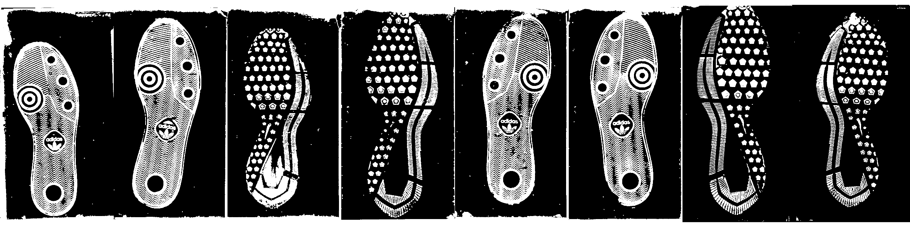
    - Labeling disjoint regions (different colors indicate different regions)
    
    - Removing any blobs which are in the 50px square corner region and which do not involve more than 10% of the image.    
    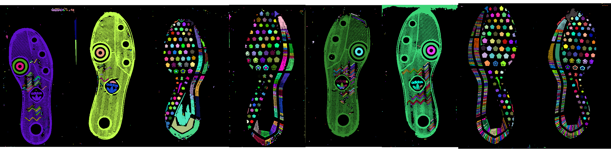    
At this point we can use the mask to clean the image:    


3. The binarized image is exaggerated using parameters which depend only on the size of the image. In general, size $s$ here is the square root of the number of pixels in the image, that is, the side length of the image if it were square.
    - A gaussian blur is applied to the image (diameter $s$/50)    
    
    - Any pixel intensity less than the median is determined to be shoe    
    
    - All disjoint regions are labeled    
    
    - The largest region is selected as the best mask for the shoe
    
    - Some cleaning is done to this mask - any holes are filled in and then it is opened by a diameter of approximately $s$/5 (must be odd)    
    

At this point we can use the mask to get a "clean" image:    


And proceed with the alignment as normal: 


</details>

Aligning each image to the template corresponding to the shoe model and size provides a good first step towards aligning the images to one another, but additional work is necessary in order to ensure that we can compare two images from the same shoe (or two images from different shoes). 
<details>
<summary> Fine Alignment of two images using RNiftyReg
</summary>

The `RNiftyReg` package is intended for alignment of brain scans and other MRI data and uses a symmetric block-matching approach[@modatGlobalImageRegistration2014]. It only allows for registration of images up to 2048x2048, though, which means we will have to align images at a lower resolution and then modify the transformation matrix accordingly. One definite positive feature is that it allows for provision of a mask for both the source and target images so that only pixels within the mask are used for alignment. <!-- This means that we could be using the original images and just providing the mask to ensure alignment -->

_Affine transformations_ are a type of image transformation that encompasses translation, resizing, rotation, and skew operations. Affine transformations preserve collinearity and ratios of distances: parallel lines remain parallel after the transformation. A subset of affine transformations are so-called "rigid body" transformations, which only allow translation and rotation. 

```{r, eval = F, echo = F, message = F, warning = F, fig.width = 8, fig.height = 2, out.width ="100%"}
library(EBImage)
library(tidyverse)
img <- EBImage::readImage("https://upload.wikimedia.org/wikipedia/commons/thumb/4/44/Checkerboard_identity.svg/480px-Checkerboard_identity.svg.png", type = "png") %>%
  EBImage::channel("luminance")

png("images/shoes/longitudinal/affine_transformations.png", width = 800, height = 200, units = "px", pointsize = 24)
par(mfrow = c(1, 4))
plot(img)
text(x = dim(img)[1]/2, y = dim(img)[2]/2, label = "Original Image", col = "red")
affine(img, matrix(c(cos(pi/6), -sin(pi/6), sin(pi/6), cos(pi/6), 0, dim(img)[2]/2), nrow = 3, byrow = T), output.dim = rep(sqrt(sum(dim(img)^2)), 2), bg.col = 1) %>% plot()
text(x = sqrt(sum(dim(img)^2))/2, y = sqrt(sum(dim(img)^2))/2, label = "30 deg rotation", col = "red")
affine(img, matrix(c(2, 0, 0, 1, 0, 0), nrow = 3, byrow = T), output.dim = dim(img)*c(2, 1), bg.col = 1) %>% plot()
text(x = 2*dim(img)[1]/2, y = dim(img)[2]/2, label = "Scaling", col = "red")
affine(img, matrix(c(1, 0, .5, 1, 0, 0), nrow = 3, byrow = T), output.dim = dim(img)*c(1.5, 1), bg.col = 1) %>% plot()
text(x = 1.5*dim(img)[1]/2, y = dim(img)[2]/2, label = "Shearing", col = "red")
dev.off()
```


RNiftyReg allows for linear (rigid-body, affine), and nonlinear transformations, but for the moment, we are only interested in rigid-body transformations - while the shoes may have some slight distortion due to the wearer and kinematics of walking, this is minor and should not interfere too greatly with a gross alignment. 

RNiftyReg's `niftyreg.linear` function returns a 4x4 transformation matrix describing the composition of multiple image transformation operations. A 3x3 matrix is necessary for 3-dimensional image rotation, resizing, and skew operations; it is then augmented by a row of zeros on the bottom and a column ending with a 1 that describes the x, y, and z translation coordinates. In this way, a 4x4 matrix can represent the composition of all relevant image transformation operations in 3 dimensions. In two dimensions, many of the cells in this matrix are 0. 

 | | | 
--- | --- | --- | --- 
1 | 2 | 3 | 4
5 | 6 | 7 | 8
9 | 10 | 11 | 12
13 | 14 | 15 | 16

Cells 1, 2, 5, 6 describe the [rotation operation](https://en.wikipedia.org/wiki/Rotation_matrix); the angle of rotation can be recovered using trigonometry. 

Cells 4, 8 describe the translation operation, e.g. the row (4) and column(8) offset from one matrix to another. 

For 2D rigid transformations, these are the only cells which matter. Cells 11 and 16 are 1, and 3, 7, 9, 10, 12, 13, 14, 15 are all 0 under these constraints. 

In order to use `RNiftyReg` for registration of the original-size images, we have to scale cells 4 and 8, but the rest of the cells remain unscaled. 

Note that `EBImage` uses what is essentially the transposed version of the matrix used by `RNiftyReg`, reduced to elements 1, 2, 5, 6, 4, 8 in a 3 row by 2 column matrix. 

 | 
-- | --
1 | 5
2 | 6
4 | 8


Starting with a set of 6 shoes observed at 3 timepoints each, with 2 different "modes" of print capture, we can align both prints taken on the same date for each shoe. 

The original images: (1 and 2 are taken at the same time point, 3 and 4, etc. 1-6 are the same physical shoe over time and so on)

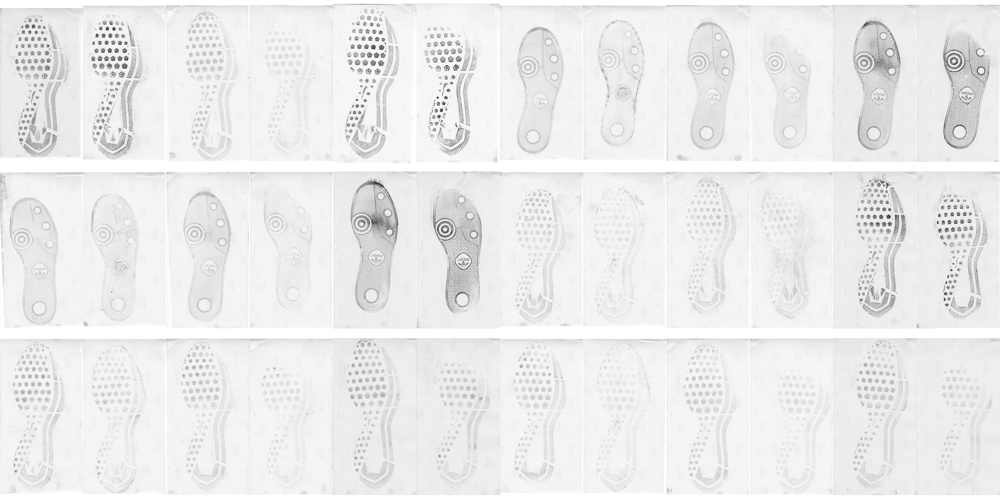

The images are first aligned to masks, which are used to clean the images to reduce noise.


Then reduced-size versions of each image pair are aligned, producing a transformation matrix: 

|          |           |   |          |
|---------:|----------:|--:|---------:|
| 0.9999730| -0.0073485|  0|  **30.48815**|
| 0.0073485|  0.9999730|  0| **-10.16105**|
| 0.0000000|  0.0000000|  1|   0.00000|
| 0.0000000|  0.0000000|  0|   1.00000|

(this is one example)

The coordinates in bold have been scaled according to the size reduction, so that they can be applied to the full-size images. 

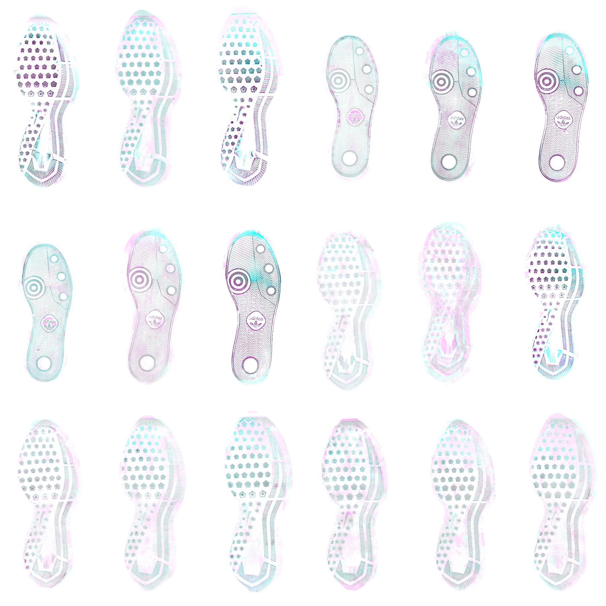

The resulting aligned images are shown above; black pixels are areas where both images agree; pink and blue pixels represent areas found in one image but not the other. Some images which have many bubbles (air between the film and backing) or which contain blurred or double prints do not align accurately; this is really not avoidable with automatic alignment solutions. 

The alignment process itself (without any image preprocessing) is extremely fast, about 1s per image pair, and seems to be similar even when image size is increased by a factor of 16. Due to the scaling process and necessary modification of the transformation matrix, the alignments may be off by 1-5 pixels in some cases. <span class="new">~~This might be handled by aligning a smaller subset of the image at full resolution.~~ Efforts to align sub-images produced less accurate alignments, likely due to the kinematic distortion of the sole during the walking process, resulting in situations where the local alignment estimate is not a good estimate of the global alignment. New attempts to find consensus alignment might include keypoint-based alignment methods, trying to identify the shoe border precisely to align that, and possibly use of Hough transforms to identify specific reproducible features that might serve as global keypoints.
</span>

</details>

Given how well RNiftyReg works, the next question is whether all of the preprocessing is even necessary. 

In the image below, the first row is alignment with the full image, the second is alignment with a binarized version of the output image (so masked + thresholded), and the third is automatically cropped around the mask which is aligned to the image using the rough-align process. The third row maintains most of the information and produces better alignments than the other rows; thus, we can conclude that it's necessary to combine the preprocessing and rough alignment in order to get the best results from RNiftyReg.


<details>
<summary> Fine Alignment of two images using FFT </summary>
Basic Process:    
    


1. Pad images so they're the same size (Let's say that $A$ and $B$ are the two images)
    


2. Downweight the edges of the images using a [Hann function](https://en.wikipedia.org/wiki/Hann_function)    
This is necessary because Fourier transforms assume images go on forever, so abrupt changes (e.g. edges) don't work out that well. Computationally, the image is "wrapped" around itself to be considered "infinite".     
    


  - The strength of the Hann function can be adjusted by a power argument     
```{r, echo = F, warning = F, message = F}
library(tidyverse)
fun <- function(y, x = 0:1000) {
  data.frame(x = x/max(x), y = y, Hann = (.5 * (1 - cos(2*pi*(x)/max(x)))) ^ (1/y))
}

purrr::map_df(c(.2, .5, 1, 2, 5, 10), fun) %>%
  ggplot(aes(x = x, y = Hann, color = factor(y))) + 
  geom_line() + 
  scale_color_discrete("Root") + 
  ggtitle("Widen_root argument to Hann function")

```

3. Use the Fast Fourier Transform on each image. Center the FFT'd images so that low frequencies are in the center (exchange top left quadrant with bottom right, and top right quadrant with bottom left). Call the FFT'd, centered images $F(A)$ and $F(B)$    
```{r, echo = F, warning = F, message = F, fig.width = 8, fig.height = 4.25, out.width = "50%"}
centering_op <- bind_rows(
  data.frame(type = "Original", x = .5*c(1, -1, -1, 1), y = .5*c(1, 1, -1, -1), label = 1:4),
  data.frame(type = "Centered", x = .5*c(1, -1, -1, 1), y = .5*c(1, 1, -1, -1), label = c(3, 4, 1, 2))) %>%
  mutate(type = factor(type, levels = c("Original", "Centered"), ordered = T))

ggplot(centering_op, aes(x = x, y = y, fill = factor(label))) + 
  geom_tile(color = "black") + 
  geom_text(aes(label = label)) + 
  scale_fill_discrete(guide = F) + 
  facet_wrap(~type) + 
  theme_void()
```    
    


4. Recover the angle between the two images:     
In Fourier space, a rotated image produces the same signal in Fourier space, but rotated. To recover this information, we can use the **magnitude** of the FFT'd images as a new image. Call these images $|F(A)|$ and $|F(B)|$. Then, 

    a. Polar transform the image, so that a rotation of the original image is a linear shift of the transformed image ($P(|F(A)|)$ and $P(|F(B)|)$). Apply Hann functions to the polar-transformed images.     
    

    
    b. Use FFT-based alignment (see steps 3, 5) to pick out the $\theta, \rho$ which best align the two polar images
    
    c. Discard $\rho$ and keep $\theta$. Transform the original image (not the FFT'd image) to get $\tilde{B}_\theta$ and recompute the FFT on the rotated image ($F(\tilde{B}_\theta)$).     
    

    

5. Recover the shift between the two images: 
    
    a. Compute the cross-power spectrum: $S = F(A) \times F(\tilde{B}_\theta)*$, where $F(x)*$ is the complex conjugate of $F(x)$ (e.g. $a + bi$ becomes $a - bi$)
    
    b. Compute the magnitude of the cross-power spectrum: $|S| = \sqrt{S \times S*}$
    
    c. Use (a) and (b) to get the normalized cross power spectrum: $S/|S|$
    
    d. Take the inverse FFT of $S/|S|$: $A = F^{-1}(S/|S|)$
    
    e. Find the maximum of the $A$ matrix. The row and column where the maximum is found are the shift to align the two images: $(\Delta x, \Delta y)$.       
    


6. Apply the shift to image $\tilde{B}_\theta$ to get $\tilde{B}_{\theta,\Delta x, \Delta y}$.    
    


There are some fiddly details (e.g. converting shifts which are most of the image into negative shifts), but FFT-based alignment works pretty well (and pretty quickly) for shoes.

Original Images:


Angle-aligned Images:


FFT-Aligned Result: (still working out the kinks)


</details>

<details><summary>Combining information from multiple images</summary>

With aligned images, we can then combine the information in each of the two prints taken at the same timepoint to get more reliable images. Because the methodology for acquiring the prints changed from timepoint to timepoint, the analysis of each type of print doesn't make sense - it is completely conflated with the observation date. However, the multiple prints aren't wasted, because while each print may be missing information, the combination of both of the prints (when properly aligned) provides a much more reliable assessment of the shoe (and the wear of that shoe at the proper timepoint). There are at least 3 options to combine these images (note that white = 1, black = 0):

- Take the pixel-by-pixel minimum: this keeps all the noise from both images (but there's relatively little noise in the cropped images, so that may not matter too much). If images are misaligned, this results in a "double" print (or smeared print). This method is also sensitive to the lightness of the print - a complete print would still be ignored if the "dark" part of the print was lighter than the "light" part of the second print.     

- Take the pixel-by-pixel maximum: this keeps only points which appear strongly in both images (losing a lot of data but also a lot of noise in the process)    

- Take the pixel-by-pixel mean: This would result in lighter regions where one image has "gaps" but would reduce noise and make it clear where there is less sure information.


Of these options, the first seems like the best, but the last provides some idea of whether the alignment was decent to begin with.

The alignment method seems to fail more frequently when one of the images is very light. It may be advantageous to invest more effort into adaptive histogram normalization. 

Alignment Fails:

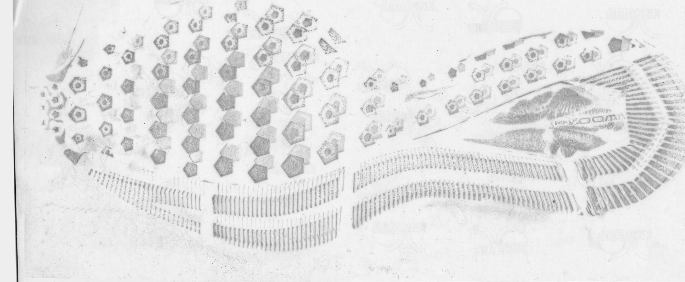

<br/>
Alignment Success:


</details>

##### Wear Characterization {-#lss-paper-analysis-wear}
Ideas:

- average intensity of cleaned image
- length of border/edges detected


## Shoe Scanner - Passive Shoe Recognition {#shoescanner}

### NIJ Grant

Grant scope: Build the shoe scanner, develop an automatic recognition algorithm for geometric design elements, test the scanner in locations around Ames.

#### Hardware

- 2 molds made: Fiber cement held, modified cement is still under testing
- Fiberglass in the ground being hydro-tested
- Big mold - modified concrete, comes out of the mold tomorrow morning (2020-06-02)
- Indoor ramp constructed - can hold 900 lbs safely
- Electronics - waiting on plexiglass - proximity sensors aren't working in daylight with reg plexiglass. New plexiglass ordered wednesday to diffuse top-light better

#### Software

##### Whole-Shoe Object Detection {.new}

**Project Overview**

- Explore the use of RCNNs for whole-shoe object detection 

Preliminary results (using ~1000 previously classified images to train and then predict several thousand other images in a semi-supervised approach):


##### Restoring Shoe Images {.new}

**Overview**

- Use CNNs to "upsample" manually degraded shoe images (or pairs of ideal and realistic images), restoring as much of the original pattern as possible.

Proof of concept (with awful image scaling to 120x120 px... sorry)


### CoNNOR: Convolutional Neural Network for Outsole Recognition##
<details>
**Project Overview**

  - Label images of shoes according to geometric classification scheme
  - Use convolutional base of pretrained CNN VGG16 and train a new classifier on labeled features
  - Eventually, acquire real data passively and use CoNNOR to assess feature similarities and frequencies

[Link to submitted Creative Component on CoNNOR](https://lib.dr.iastate.edu/creativecomponents/264/)

[Github repository for paper submitted to Forensic Science International](https://github.com/srvanderplas/CoNNORFSI)

**Exploring new directions:**

- Truncate convolutional base and train random forest on features
    - Could replace fully connected layers of neural net as classifier
    - Importance score can filter/reduce the number of features 
    - *Training the random forest requires too much memory for Bigfoot (CSAFE server), and still takes over two weeks on the HPC. We're setting this goal aside for now, but could try subsampling the features for a random forest in the future.*
  
- *Spatial integration*
    - *Model is currently set up to take in 256x256 pixels*
    - *Try taking in full shoe using a sliding window of size 256x256*
    - *View class predictions spatially*
  
- Fully convolutional networks (FCNs)
    - Unsupervised segmentation to assess current classification scheme
    - Handle whole shoe image of any size (instead of only 256x256 pixel images)
    
    
**References for CNNs and FCNs**

[Stack Exchange post explaining patchwise training](https://stats.stackexchange.com/questions/266075/patch-wise-training-and-fully-convolutional-training-in-fully-convolutional-neur)

["Learning Hierarchical Features for Scene Labeling"](https://ieeexplore.ieee.org/abstract/document/6338939): describes an application of multi-scale CNNs and image pyramids

["Pyramid methods in image processing"](http://citeseerx.ist.psu.edu/viewdoc/summary?doi=10.1.1.56.8646): classic paper from 1984 explaining pyramid methods

["Fully Convolutional Networks for Semantic Segmentation"](https://people.eecs.berkeley.edu/~jonlong/long_shelhamer_fcn.pdf)

["W-Net: A Deep Model for Fully Unsupervised Image Segmentation"](https://arxiv.org/pdf/1711.08506.pdf)


#### Spatial integration

The overhead costs of going fully convolutional are high; CNN papers are opaque, and many supervised techniques require fully labeled data for semantic segmentation (i.e., label every pixel). Moreover, complex models (for both supervised and unsupervised tequniques) are often only available in Python, and there are a large number of GitHub repositories of mixed quality and reliability. Filtering for quality, understanding code structures, and implementing them on HPC are all enormous tasks on their own.

In the meantime, it is much easier (relatively speaking) to use our existing framework of 256x256 square pixel images, for which we have generated thousands of labeled images and have already trained and improved domain-specific models. Currently, I have code working to automatically crop image borders, chop the image into 256x256 pixels (padding the image when appropriate) and equalize the contrast on the individual images.

**Pad the left and top of the image with a pre-specified offset, then chop the image into 256x256 pixel pieces**  


**Equalize the contrast channel for each piece of the image**
 

**Use the trained model to predict each piece of the image for each class**
 

**Repeat the above process for different cuts of the original image, and aggregate predictions**


**Updates/In progress:**

- Presented on CoNNOR at [ISU's 3-Minute Thesis competition](https://www.grad-college.iastate.edu/three-minute-thesis/)
    - Preliminaries: 8 heats with 10-12 participants each
    - Runner up to a guy making better yogurt
- Implementing semantic segmentation model on HPC
    - Learning HPC structure, command line syntax, using Python in practice
    - Documentation assumes high baseline of knowledge :(
- Improving spatial integration process
    - Remove predictions for blank (and mostly blank) edge images
    - Smooth predictions for overlapping image pieces
      - geom_density2d(), stat_contour(), creating brush overlay with EBImage


<div class = "new">

**Shiny app demo**

</div>

</details>


## Maximum Clique Matching {#maxclique}

## Project Tread (formerly Cocoa Powder Citizen Science) {#cocoa}

Project Tread, modified from [Leverhulme Institute's Sole Searching](https://www.dundee.ac.uk/leverhulme/citizenscience/details/sole-searching.php), is a developing CSAFE project with the goals of engaging community participation in forensic research and acquiring shoe print data that may be useful in future analyses.


In progress:

- Review [procedures](https://forensicstats.org/project-tread/) and IRB documents written by James
- Volunteers are testing modified procedure (below)
- Be involved in set up of data collection site (through CSSM)
- Develop plan for data analysis and use (to inform procedure modifications)


#### Comparing the procedures

| Procedure           | Leverhulme      | CSAFE (initial)    | CSAFE (proposed) |
|---------------------|-----------------|--------------------|------------------|
| 'Before' Views      | 4 per shoe      | 5 per shoe         | 2 per shoe       |
| 'Before' Pictures   | 1 per view      | 3 per view         | 1 per view       |
| Total 'before' pics | 4 per shoe      | 15 per shoe        | 2 per shoe       |
|                     |                 |                    |                  |
| Paper               | Letter (larger) | 8.5x11 or 8.5x14   | 8.5x11 or 8.5x14 |
|                     |                 |                    |                  |
| Actions             | Run, jump, walk | Step, hop          | Step, hop        |
| Replicates          | 6 per action    | 9 per action       | 3 per action     |
| 'After' Pictures    | 1 pic per rep.  | 3 pics per rep.    | 1 pic per rep.   |
|                     |                 |                    |                  |
| Total # prints      | 18 per shoe     | 18 per shoe        | 6 per shoe       |
| Total # print images| 18 per shoe     | 54 per shoe        | 6 per shoe       |
|                     |                 |                    |                  |
| Requested # shoes   | Not specified   | Both shoes         | One, 2nd optional|
|                     |                 |                    |                  |
| Total # images taken| 22 or 44        | 138                | 8 or 16          |


**Recommended procedure modifications:**

- Ask for one high-quality image of each shoe angle ('before') and print ('after'), instead of three replicate images of each
    - If Project Tread submission website will be set up like current CSSM system (which takes community submissions for environmental images), intermediate quality control can help filter out bad images
- Only ask for one shoe, and make second shoe optional
    - E.g., always ask for left shoe, and make right shoe optional
- Ask for 3 replicates per shoe instead of 6-9
    - Longitudinal shoe study only uses 2-3 replicates per shoe
- Make written instructions clearer, close loopholes


<div class = "new">
### Pilot procedure testing

**Feedback from pilot testing:**

- Materials
    - Used 1/4 - 1/2 tsp of cocoa powder, not a "dime-size""
    - Test/specify cocoa powder vs hot chocolate powder 
    
- Procedure
    - Sift cocoa powder onto paper (brushing damages print)
    - More pictures of what things should look like
    - Fewer "before" pictures: bottom and side only
    - Mention won't see oil if done correctly
    - Don't stack completed prints until after imaging/scanning
    
- Analysis
    - Use printable scale/ruler for later alignment of images
    - QR code (like handwriting study) to identify action/replicate/meta info
    - Collect shoe demographics (brand, size, measurements of length/width)
    - Get "mask" by tracing around shoe

</div>
    
    
**A few images from pilot testing**


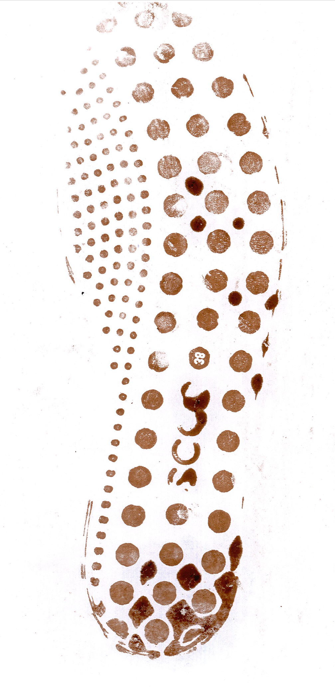


## 3d Shoe Recognition 
Some background info: Shoe impressions are often left at crime scenes.  In an ideal investigation, an impression left atthe scene of the crime is matched to the suspect’s shoe, placing them at the scene.  However, it is not always that easy.  An additional problem when dealing with shoes in the forensic discipline isshoes wear over time. When time elapses between the crime and recovery of the shoe, this processmay  be  more  difficult:  identifying  marks  may  have  worn  away,  or  new  marks  may  have  been acquired due to additional wear. In order to understand the changes to an outsole of a shoe that may occur during the wear process, it is necessary to collect longitudinal data from across the shoe's lifetime. These studies are needed to establish statistical models for shoe wear patterns and accumulated damage. In order to analyze data collected from these studies, it is imperative to develop a statistical pipeline to align and compare successive 3D scans over time. Manual alignment methods are time consuming, and do not scale effectively to large studies, because it is necessary to align  hundreds of scans, observed at  multiple time points, before any statistical analysis or  modeling can be performed. To practically use longitudinal studies, the best approach is to develop statistical tools, to provide a pipeline in which to align and analyze two shoe scans. 


The set up: 

Ititally, the idea of the of the study was to use the data from the longitudial study in order to determine if one could predict wear, given pressure point matts and amount of steps and so on that was all part of the longitutidal data collection done previously. This idea has someone shifted. There is a large difference between the scans of the longitudial study that were conducted by hand scanning and those conducted using the turn table. The hand scan soles of the shoes have a wide variation not only on quality, but also on amount of shoe and direction of the scan. In order to simplify the inital processes and determining a pipeline for alignment, instead of the longitudinal shoe scans, the processes below are using a shoe that is scanned soly using the turn table to have some consistancy in the processing as we start to have a pipe line for at least alignment, then later using the longitudinal study add the extra information into the processing; amount of steps, weight,ect. 

Steps: 
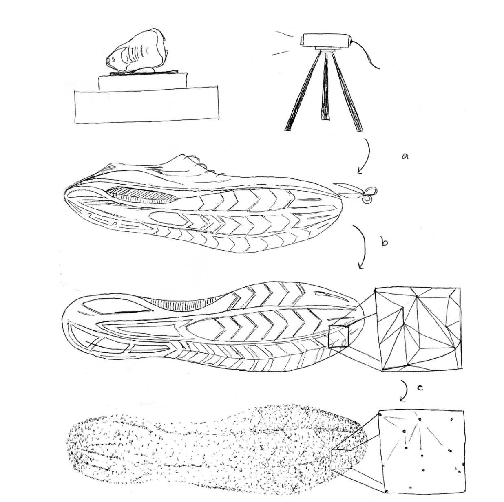


<details>
<summary> 
The shoe scans start as an stl file, however R does not work with stl files directly so they need to be transformed into a mesh object, in this specific case a triangle mesh object:  </summary>

Mesh Objects: A triangle mesh object is made up of the following parts, sufaces, polygons, faces, edges and vertices.


Looking at a mesh object at first: 


</details>


Some background: 
At first we wanted to try to simplify the mesh object to just the basic shape in order have simplicity when aligning. The idea of allignment is to take the most basic features, allign them, then by adding complexity of the soul, further allign the two different shoes. The idea is that we want to take a lower detail scan of shoe, allign it, then by adding complexity we can further allign the shoes. However the problem was realized that we are using a prediction to allign rather than the shoe, which ran into some quick problems. The next "attempt" at alignment came from a package called morph. In order to use this package, we needed to transform the data from a mesh object into a plane of points. In order to do this, we greated the function *shoe_coord*. This function takes a triangle mesh object, and looks at the vertices that make up each triangle. With a specific amount of vertices specified using the specification vert, *shoe_coord*, takes these vertices and maps them onto a x,y,z coordinate plane. Then using this coordinate plane, the allignment process began. 
<details>
<summary> 
When working with coordinate systems, there was still not aligning, as each shoe was set on its own coordinate plane  </summary>

Some attempts that have not really turned out well 
  - Transforming the mesh objects to points aligned by the center of mass to overlay them detecting difference. 

  - Problems 
    - Isnt aligning properly as you can see 
</details>    

Principal Component Analysis: 
The basic idea of principal component analysis is to take a dataset with many variables, and simplify that dataset by turning the original variables into a smaller number of "Principal Components". These principal components are the underlying structure in the data. Taking that data and giving a vector in directions where there is the most variance. Taking these egienvectors as the data, we can get a "flattened" version of our origianl shoe. This is done using singular decomposition: If the $N  \times p$ matrix X has rank r then it has a so-called singular value decomposition as $X_{N \times p} = U_{N\times r} D_{r \times r} V'_{r\times p}$ where U has orthonormal columns spanning the column space of X, V has orthonormal columns spanning the colum space of X' and D is a diaginal matrix of singular values. For ordinary principal components, the columns of V are called the principal component directions in $\Re^3$ . 

Once a shoe has been turned into coordinates from the verticies of a mesh object, we can use the function *prcomp* to get a transformation matrix.

<details>
<summary>Some notes on this:</summary>

  - use vertices of 7 to decrease amount of points to match
  - if you have too few points also doesnt work
  - turn table works the best 
  - Sony are the best matches (the shoes I personally have scanned) 
</details>
<details>
<summary> Point cloud alignment </summary>     

  - First looking at shoes with all vertices included: 
  
  


  - Now the same shoe with fewer vertices included in the allignment 


With these point clous alignments, the next step is to take the rotation matrix given by *prcomp* and apply it to the original mesh object since rather than comparing points that may or may not exsisit in comparison to each other shoes, as the vertices are not exactly the same on a mesh object from scan to scan of even the same shoe. *prcomp* gives a matrix that can be applied to a mesh object using a function called *transform3d*


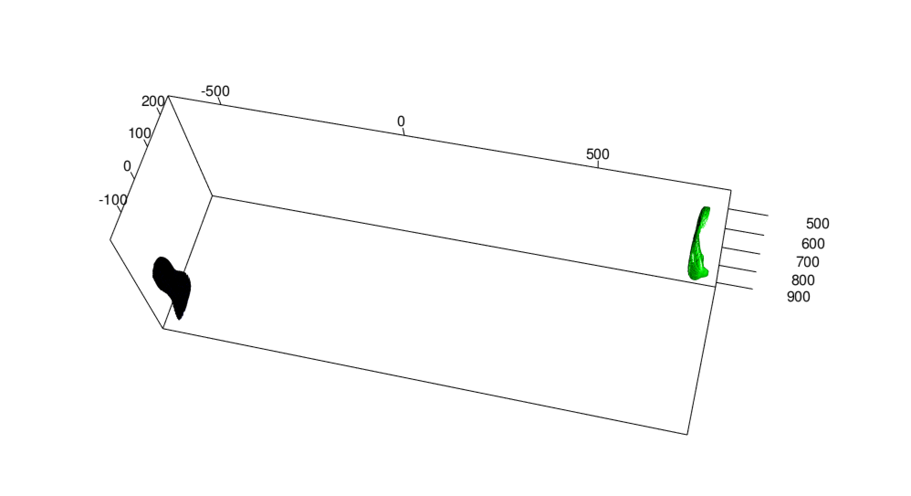

</details>


Once this was tried, it seems that the function *prcomp* isnt actually centering the data, although according to the code it should. So in order to overcome this issue when initially turning the stl file into a mesh object, a centering is performed using the barycenter of the shoe scan. In astronomy, the barycenter is the center of mass of two or more bodies that orbit one another and is the point about which the bodies orbit, since we are obviously only dealing with one object, the barycenter can be thought of as the center of mass for the shoe scan (the center of mass of a distribution of mass in space is the unique point where the weighted relative position of the distributed mass sums to zero). This puts the point (0,0,0) in the center of the shoe rather than the center being close to the 300s as before 
<details><summary> Centering </summary>


The blue shoe is the original shoe grab, where the green shoe is now the shoe that has been centered on the center of mass. Now we can start with two shoes that at least have the same "center" point before principal component analysis is completed: 


</details>


Once the shoes themselves have been centered, then PCA can be compleated on the shoes themselves: 
<details> <summary> PCA after centering </summary>


The Green shoe is the original shoe grab centered, where the red shoe is now after PCA has been applied. Then using the PCA for both of the two scans we can get the following map of the two shoes with their given principal component rotation matrix applied: 


As you can see although they are on the same plane, they are not exactly allign. In order to get them aligned a matrix of 1s and -1 needs to be applied in some order, minimizing the RMSE 


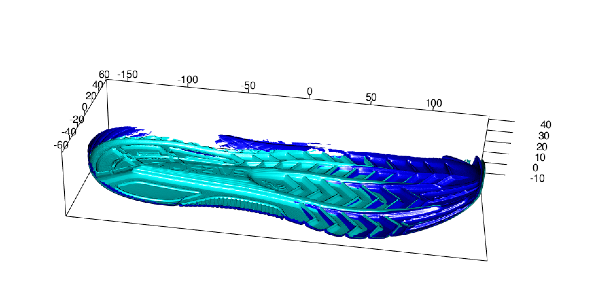
</details>

Once the PCA has done the initial alignment, then a secondary alignment needs to be done using Itterative Closest Point, to do this a landmark must be established. One cant just use the PCA, the way that the initial scans are only of the soles, which change as they wear, so we are trying to allign something that is not there anymore. The idea landmark will give a spot in the shoe that will not change, the arch or a large indent, in order to find a proposed landmark, we are attempting to use the maximum distance in z. 

<details><summary> </summary>

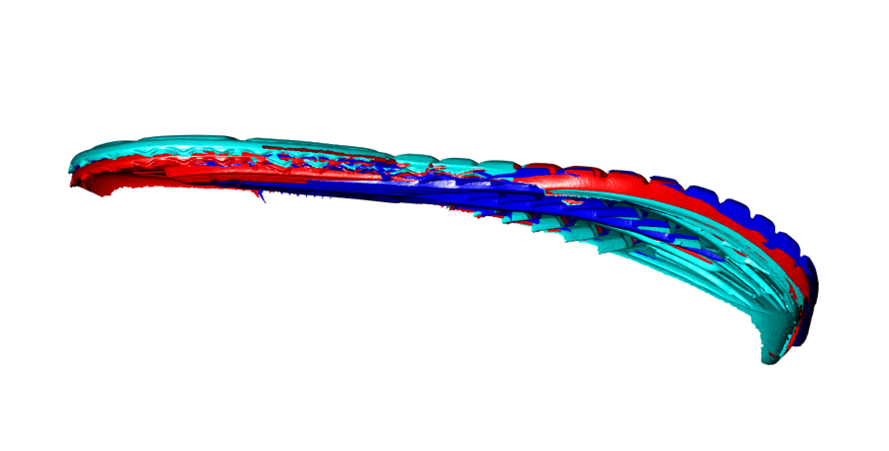

</details>


    
Understanding the distance: 
Using the package *Morpho* we have a glimps at how much alignment is working (using scan 1 and scan 2 of the shoes)
After centering, we have the mean distance -9.542274 and a max distance of 59.08234. Visually we can see this as: 


Now after PCA, we have the mean distance of 2.801961 and a maximum of 45.37814, visually we can see that there is less variation in the shoes 


Now finally after ICP, which does not change the mean or maximum distance of difference between the two shoes: 


Now looking at scan 1 verse scan 6:


## Shoe outsole matching using image descriptors

### Method 1: Edge detection and MC (MC-COMP)

Under the revision by *Journal of Applied Statistics*,


**Comments by reviewers**

 Compare your predictive accuracies on the **number of circles (more or less than 3)**.


In the previous matching, we found three circular regions in red. As reviewer requests, we selected the additional three more circles in blue. We tried the same set of mated and non-mated matching in training and testing set. 


We get the average of the similarity values by the number of circles. The random forest is trained on the set of results summarised by the number of circles. 


When there are five and six circles found in the questioned shoe, then the AUC is the largest as 0.96 in the test set. 


### Method 2: SURF detection and MC on degraded impressions 


Accepted by *Statistical Analysis and Data Mining* in Feb. 2020. 


**Comments by reviewers**

  1. Generalization (Fingerprints,  Photos of faces, ... )
  2. Other classifiers, besides the random forest.
  3. Variable importance


### Research 1: Features
Previously, features such as edge, corner, SURF were extracted to match shoeprints. The goal of this project is to find other image descriptors as image features for shoe print matching. 

**Image descriptors**

  - SURF(Speeded Up Robust Features)- blobs
  - KAZE - blobs
  - ORB(Oriented FAST and Rotated BRIEF)- corners


**Image matching**

  - CSAFE data - Nike size of 10.5 and Adidas size of 10 will be used to construct mated and non-mated matching
  - Features will be combination of strong 100 points of KAZE, ORB, SURF. 
  


### Matching on clean and full images with several features


- Mates : Image (1) and (2)
- Non-mates : Image (1) and (3), Image (2) and (3) 


**Performance evaluation using**

  - **SURF 500**
  - KAZE 500
  - ORB 500
  - SURF 100 + KAZE 100 + ORB 100
  - SURF 200 + KAZE 200 + ORB 200
  - POC (Phase-only correlation)
  - FMTC (Fourier Mellon transformation correlation)
  


**Example graphs of mates**:


**Example graphs of non-mates**:


**Example matching table using SURF 500**:

Class | Clique size | Rotation angle | % Overlap | Median distance of OP|
------|-------------|----------------|-----------|----------------------|
Mates |   18        |       2.11     |   0.5646  |        0.78          |
Non-mates|    9     |       6.43     |   0.1208  |        1.39          |


**Density plots**:


**ROC curves on test comparisons**:


  
  
### Matching on degraded and partial images  
  
**Example of degraded images**:


**Example crime-scene like images on dust from the data by Speir's group**:


**Density of mates and non-mates by features**:


**ROC curves by features**:


**AUC values by features**:


**Relationship among similarities (% Overlap) by feature-types**

- Overlap feature (\% overlap after the alignment) in the degradation level, 0


- Overlap feature (\% overlap after the alignment) in the degradation level, 10

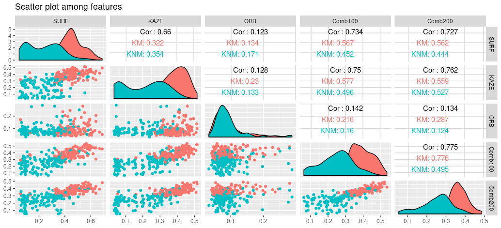


**Random forest training for the variable importance**

- Trained the RF, in the degradatino level of 0 and 10, on the class with the variables of all similarities by each feature type.

- Degradation level 0


  
- Degradation level 10

  

  
### Research 2: Impact of weight to outsole scans from EverOS 2D scanner 

**Analysis setup**:

   - Shoes: 5 pairs of Nike Winflow 4, size 10.5 (Brand-new shoes)
   - Participants: Person 1 (weight aa lb)and person 2 (bb lb)
   - Weights: 2 weight vests (20 lbs and 12 lbs)
   - Weight variations: W1(P1), W2(P1 with one vest), W3(P1 with two vests), W4(P2), W5(P2 with one vest), W6(P2 with two vests)
   - W1 $=$ 155.2 lb, **W2 $=$ 173.8 lb**, W3 $=$ 187.6 lb, **W4 $=$ 178 lb**, W5 $=$ 197.4 lb, W6 $=$ 211 lb
  
  
  
**Result1**:

  - Shoe is fixed to left side of shoe1.
  


**Result2**:

  - Purple, green: comparison between repeated replicates from the same shoe, W2-W2, W4-W4.
  - Comparison between weights W2 and W4: weights are almost the same. 
  - Yellow: comparison when shoe is fixed to shoe1-L.
  - Red: comparison between shoe1 – shoe2-5. 
  - Shoes are never used.


**Discrimination among groups**
 
 Let's simplify the question; **Is the person effect significant?** 
 
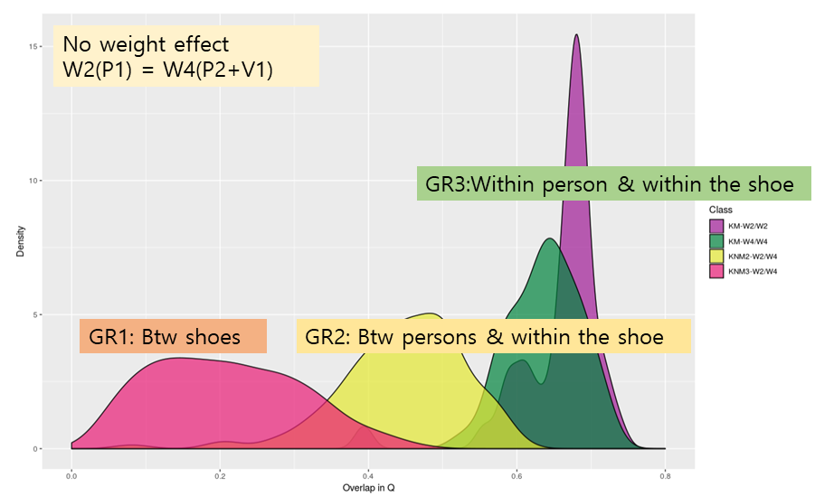

  - Initial analysis 
     + Cluster analysis; hcluter
     + Principal component analysis (PCA)
 
  - Are groups significantly different?
     + Multivariate Analysis of Variance (MANOVA)
     + Multi-Response Permutation Procedurs(MRPP)
     + Analysis of Group Similarities (ANOSIM)
     
  - How do groups differ?
     + Discriminant Analysis (DA)
     + Classification and Regression Trees (CART)
     + Logistic Regression (LR)
     
     
     
### Research 3: MC + CNN

**Idea**:

  1. Align two images using MC. 
  2. Calculate similarity features.
  3. Ask CNN to learn similarity features.
  4. Combine 3 and 4. Use ResNet-50 to get a final similarity value. 
  
  ### Additional features from descriptors

Much of the outsole matching already done at CSAFE is based primarily on the geometric locations of SURF features. While this is apparently useful, the utility of SURF and other computer vision features (such as BRISK, ORB, and KAZE) can go far beyond location. Most of the work done has also been on images produced using the EverOS 2D scanner. Location features from these images are relatively easy to align, but with different image types -such as those made using fingerprint powder- alignment becomes much more difficult. 

When a SURF (or other feature type) is detected in an image, several features are extracted. Each SURF is a detected “blob” from an image. Features from a SURF include Sign of Laplacian, orientation, location, metric, and a 1x64 vector of descriptors. Essentially these several features describe characteristics of the blob like color intensity, change in intensity, change in pattern, blob direction, etc.

Between two different images if two SURFs have a matching sign of Laplacian, the distance between the two 1x64 descriptor vectors is measured. If the distance is below a specified threshold the two SURFs are considered matching.

**Sign of Laplacian**

 


**64 descriptors**


When SURFs are matched, a matrix is returned with indices of matching SURFs and the measured distance. Matched features are illustrated here.


Clearly many of these “matched” SURFs -based on metric- are not actually corresponding parts between images. To make more precise which SURFs match, I use the maximum clique from the shoeprintr packages to align the SURF points based on location. Once aligned, Euclidean distance is used to find the closest point(s) in image 2 to each point in image 1. Now there are two sets of matching indices. The index pairs which overlap between the two sets are considered certain matches.


The number of “certain” matching SURFs and the metric between SURF descriptors can be used as two additional features for image pair comparison.

**Useable features**

  - Clique Size
  - Rotation Angle
  - % Overlap
  - Median distance of OP
  - **Certain SURF matches**
  - **Max SURF match corr**


We’ve trained 2 different random forests using these features from image pairs.

The first random forest uses 115 pairs of images using matching soles with the same stepping style and 116 pair of images of the same shoes with different stepping style. The random forest classification accuracy using leave one out cross validation is 92%

**Different step type average variable values**

Class | Clique size | Rotation angle | % Overlap | Median distance of OP| Certain SURF matches | Max SURF match corr |
------|-------------|----------------|-----------|----------------------|----------------------|---------------------|
Same steps|    8        |       3.97     |   0.1992  |        1.21          |         13           |         0.9523      |
Dif steps|    6     |       14.04     |   0.0169  |        0.99          |         0.487        |         0.2236     |

***RF Variable importance***


Variable             |Importance Score |
---------------------|------------------|
Certain SURF matches |     100.000      |
% Overlap            |     14.951       |
Max SURF match corr  |     14.059       |
Rotation angle       |     4.484        |
Median distance of OP|     2.359        |
Clique size          |     0.000        |

The second rf is trained from 115 images of matching shoes with the same stepping style and 116 images of non-matching shoes with the same stepping style. The random forest classification accuracy was also 92%


**Match v. non-match average variable values**

Class | Clique size | Rotation angle | % Overlap | Median distance of OP| Certain SURF matches | Max SURF match corr |
------|-------------|----------------|-----------|----------------------|----------------------|---------------------|
Mates |    8        |       3.97     |   0.1992  |        1.21          |         13           |         0.9523      |
Non-mates|    6     |       9.26     |   0.0164  |        1.24          |         0.836        |         0.2821      |

**RF Variable importance**

Variable             |Importance Score |
---------------------|------------------|
% Overlap            |     100.000      |
Certain SURF matches |     34.044       |
Max SURF match corr  |     26.937       |
Rotation angle       |     2.221        |
Median distance of OP|     2.213        |
Clique size          |     0.000        |


**Improvements to be made**

When two images using fingerprint powder are are from the same shoe and with the same stepping style, the alignment using maximum clique is generally good. However, when the sole images are not mates the alignment is occasionally not good. The alignment is especially poor when the step style changes. 


So far, other existing methods haven't shown any more effectiveness in aligning shoes than the maximum clique. It would be useful if features could be made from the SURF descriptors which could be used to compare shoes without needing to align the images. 

 
