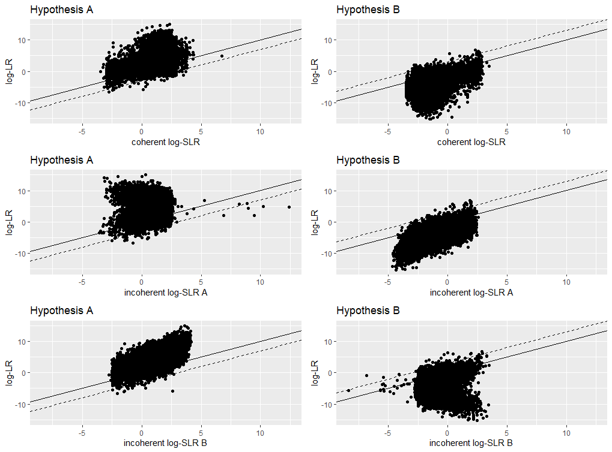
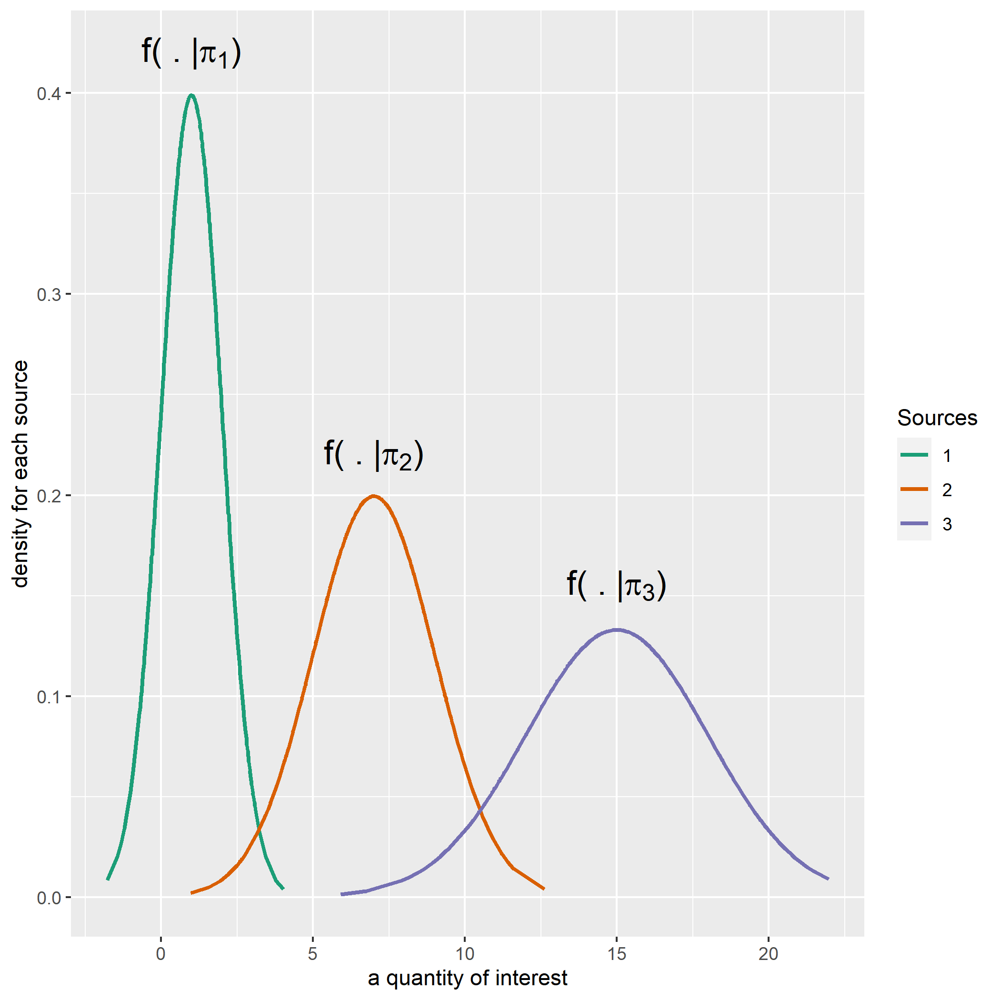
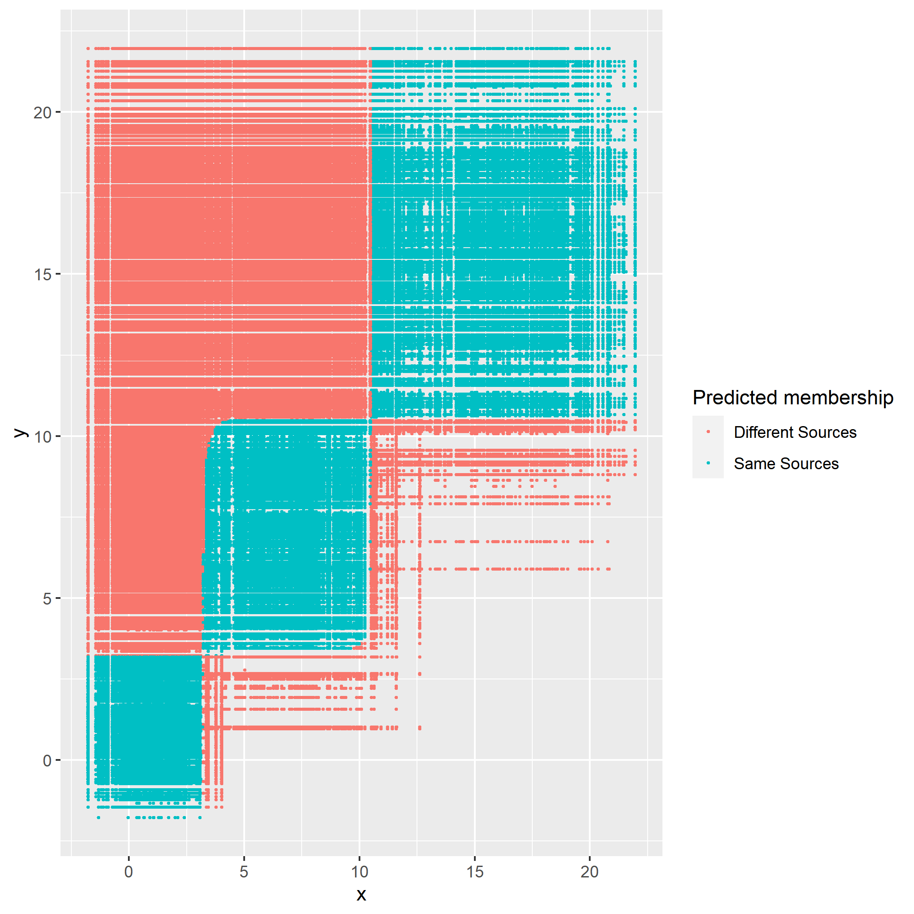
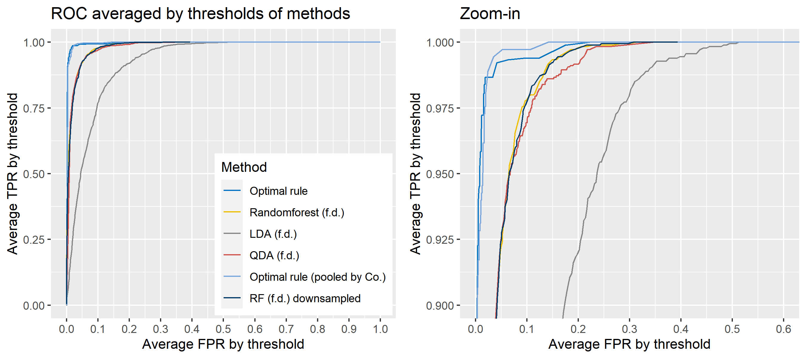
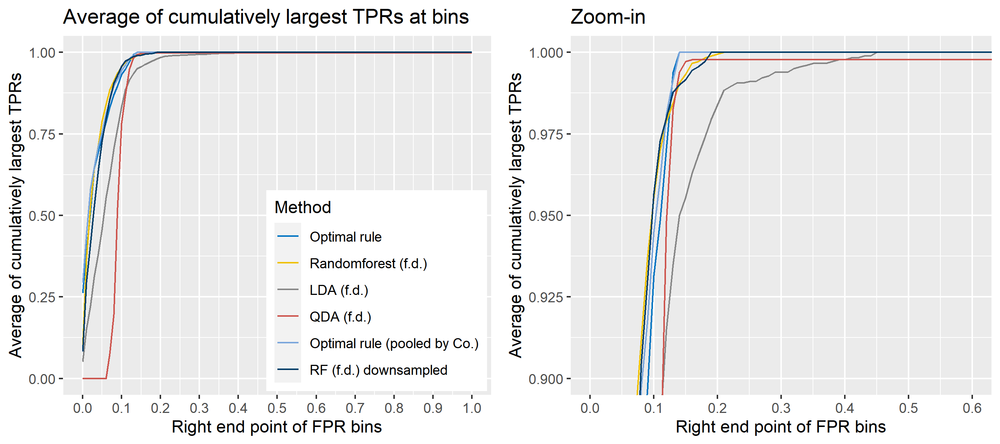
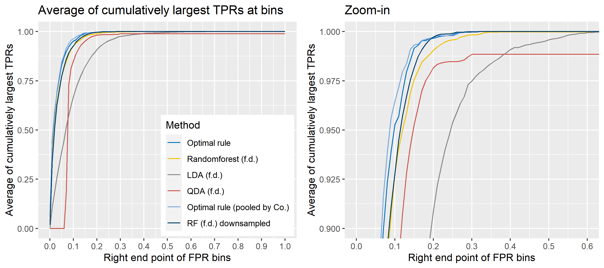
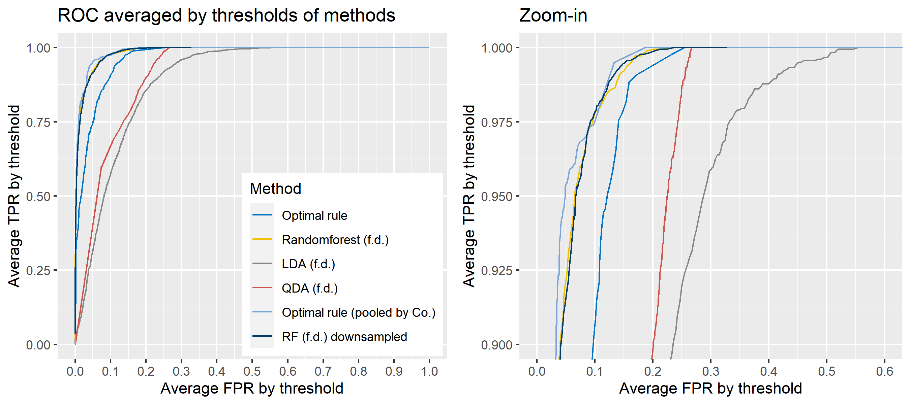
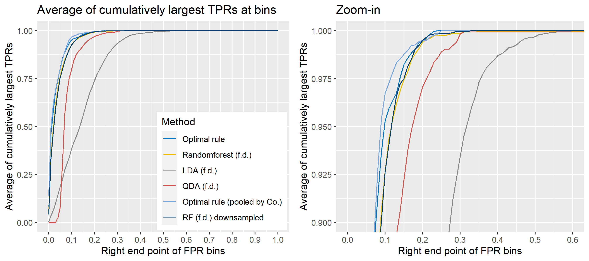
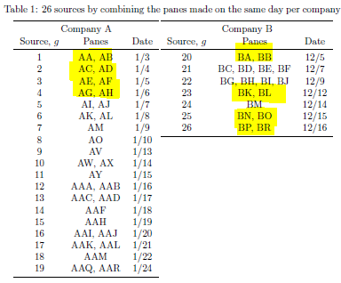

---
output:
  html_document: default
  pdf_document: default
---
# Theoretical foundations

## Explaining SLR behavior

This project involves explaining the behavior of an SLR w.r.t. the true LR. Here 
is a summary of the main results: 

- $|log(LR) - log(SLR)|$ is likely to be unbounded and has to do with the fact 
that the LR and the SLR typically do not share the same invariances (the contour
lines of the LR and SLR differ). The example 
in the paper shows how this works for univariate Gaussian data and squared 
Euclidean distance score function.
- Large discrepancies between the LR and the SLR are probably even with 
univariate data
- The most likely and largest discrepancies between the SLR and LR 
tend to be when both the LR and SLR are very large or very small. 
- Bounds on the tail probabilities of the LR given a score
- Bounded LR implies bounded SLR
- LRs are always larger than the SLR in expectation under the prosecution 
hypothesis and smaller in expectation under the defense hypothesis (technically 
the latter statement should be that the inverse of the LR is larger in expectation 
than the inverse of the SLR)


We submitted this to JRSS Series A, but it was returned to us with the option to 
resubmit. The biggest issue seemed to be a misunderstanding about whether 
independence under the prosecution hypothesis is reasonable. Otherwise, the 
first reviewer seemed to focus heavily on the LR paradigm generally, and they 
also seemed to misunderstand that our definition of "LR" was of the true 
distributions from which data are sampled under both hypotheses. To address these 
misunderstandings, we are completely rewriting the intro to move the 
focus from LRs to SLRs and correcting some specific lines that may have helped 
lead to some confusion. We are also taking more time in the paper to discuss that, 
the specific source problem conditions on the source of the evidence under 
the prosecution hypothesis, and thus the "dependence" that we think the reviewers 
are thinking should exist is lost. That is, the fact that the unknown source and 
known source data should be more similar under $H_p$ than any random two pieces 
of evidence is already conditioned upon. 

**See [here](https://github.com/CSAFE-ISU/this-is-us/blob/master/images/foundations/nate/slr_manuscript_revised.pdf) for the current draft of the paper from this work.**

## Common Source vs Specific Source Comparison via Information Theory

**Please note that this project has changed somewhat 
significantly, but this information might be relevant for others 
in the future.**

**See [here](https://github.com/CSAFE-ISU/this-is-us/blob/master/images/foundations/nate/RA2019_manuscript.pdf) 
for the current draft of the paper from this work.**

### Introduction
**Central Goals**

- continue work started by Danica and Peter Vergeer on the analysis of likelihood ratios
- study the differences between specific source (SS) and common source (CS) likelihood ratios (LRs) in an information theoretic way
- does the CS or SS LR have more "information"?
- does the data (or the score) have more "information" about the SS or the CS hypothesis?
- can be the CS or SS hypotheses (prosecution or defense) be formally compared in terms of being easier to "prove" or "disprove"?

  
**General Notation**
Let $X \in \mathbb{R}^{q_x}$ and $Y \in \mathbb{R}^{q_y}$ be two random vectors with joint distribution $P$ and corresponding density $p$. 


- \textbf{Entropy}: $\mathbb{H}(X) = -\int{p(x) \log p(x) dx}$
- \textbf{Conditional Entropy}: $\mathbb{H}(X|Y) = \mathbb{E}_{Y}\left[-\int{p(x|y) \log p(x|y) dx}\right]$
- \textbf{Type II Conditional Entropy}: $\mathbb{H}_{2}(X|Y) = -\int{p(x|y) \log p(x|y) dx}$
- \textbf{Mutual Information}: $\mathbb{I}(X;Y) = \mathbb{H}(X) - \mathbb{H}(X|Y)$


Proof that Mutual Information is always positive:

\begin{align*}
\mathbb{I}(X;Y) &= \mathbb{H}(X) - \mathbb{H}(X|Y) \\
&= -\int{p(x) \log p(x) dx} + \int{\int{p(x|y)p(y) \log p(x|y) dx} dy} \\
&= -\int{\int{p(x,y) \log p(x) dx}dy} + \int{\int{p(x,y) \log p(x|y) dx} dy} \\
&= -\int{\int{p(x,y) \log p(x) dx}dy} + \int{\int{p(x,y) \log \frac{p(x,y)}{p(y)} dx} dy} \\
&= \int{\int{p(x,y) \log \frac{p(x,y)}{p(x)p(y)} dx}dy} \\
&= KL(P||P_{X} \times P_{Y}) \\
&\geq 0
\end{align*}
  
### Common Source vs Specific Source LR
The "common source" problem is to determine whether two pieces of evidence, both with unknown origin, have the same origin. One might be interested in this problem if two crimes were suspected to be linked, but no suspect has yet been identified. Alternatively, the "specific source" problem is to determine whether a fragment of evidence coming from an unknown source, such as evidence at a crime scene, has the same origin as a fragment of evidence of known origin, such as evidence collected directly from a suspect.

**Basic Setup**

- $H \in \{ H_p, H_d \}$ as the random variable associated with the CS hypothesis. 
- $A$ and $B$ are discrete r.v.'s representing two "sources" of evidence
- distributions for $A$ and $B$ defined conditionally based on the hypothesis
- SS hypothesis is represented by the conditional random variable $H|A$
- $X$ is data coming from $A$, $Y$ is data coming from $B$
- compare information contained in $(X,Y)$ about $H$ and $H|A$
- join density can be written as $p(X,Y,A,B,H) = p(X,Y|A,B)p(B|A,H)p(A|H)p(H)$

**Is there more information in a CS or SS LR?**

Let us examine this question in two different ways. 

1. Is the posterior entropy (given $(X,Y)$) in the common source hypothesis smaller than that of the specific source hypothesis?
     + In other words, would observing the specific value of $A$ as well as the data make you _more_ certain about $H$ than just observing the data?
2. Is the posterior entropy (given $(X,Y)$) in the common source hypothesis smaller than the average (over possible values for $(X,Y,A)$) posterior entropy of the specific source hypothesis?
     + In other words, do you expect that, on average, observing the value of $A$ as well as the data make you _more_ certain about $H$ than just observing the data?

Answering the first question/interpretation, to me, requires proving that 

\[ \mathbb{H}_{2}(H|X,Y) - \mathbb{H}_{2}(H|X,Y, A) \geq 0 \].

Answering the second question requires proving that 

\[ \mathbb{H}(H|X,Y) - \mathbb{H}(H|X,Y, A) \geq 0 \].

\noindent Luckily, the second question is true due to the fact that 

\begin{align*}
\mathbb{H}(H|X,Y) - \mathbb{H}(H|X,Y,A) &= \mathbb{E}_{(X,Y)} \left[ - \int{p(h,a|x,y) \log p(h|x,y) d(h,a)} + \int{p(h,a|x,y) \log p(h|x,y,a) d(h,a)} \right] \\
&= - \int{p(h,a|x,y)p(x,y) \log \frac{p(h,a|x,y)}{p(a|x,y)p(h|x,y)} d(h,x,y,a)} \\
&= \mathbb{E}_{(X,Y)} \left[ KL(P_{(H,A)|(X,Y)}||P_{H|(X,Y)} \times P_{A|(X,Y)}) \right] \geq 0
\end{align*}

Whether or not $\mathbb{H}_{2}(H|X,Y) - \mathbb{H}_{2}(H|X,Y, A) \geq 0$ is not obvious. We have that 

\begin{align*}
\mathbb{H}_{2}(H|X,Y) - \mathbb{H}_{2}(H|X,Y, A) &= \int{-p(h|x,y)\log p(h|x,y) dh} - \int{-p(h|x,y,a) \log p(h|x,y,a) dh} \\
&=  \frac{p(a)}{p(a|x,y)}\int{-p(h|x,y,a)\log p(h|x,y) dh} + \int{p(h|x,y,a) \log p(h|x,y,a) dh}\\ 
&???
\end{align*}

We can try and understand the value of $\mathbb{H}_{2}(H|X,Y) - \mathbb{H}_{2}(H|X,Y, A)$ in terms of $\frac{p(a)}{p(a|x,y)}$. For example, if $\frac{p(a)}{p(a|x,y)} \geq 1$, then $\mathbb{H}_{2}(H|X,Y) - \mathbb{H}_{2}(H|X,Y, A) \geq 0$. If $\frac{p(a)}{p(a|x,y)} \leq 1$, then it is hard to say much about the value of $\mathbb{H}_{2}(H|X,Y) - \mathbb{H}_{2}(H|X,Y, A)$.

**Is there more information in the data about the CS or SS hypothesis?**
Under the second scenario, we can study this question by looking at 

<!-- \begin{align*} -->
<!-- \mathbb{I}(H_{x};\delta) - \mathbb{I}(H;\delta) &= \begin{multlined}[t] \mathbb{H}(H|A) - \mathbb{H}(H|\delta, A) - \\ -->
<!-- \left[ \mathbb{H}(H) - \mathbb{H}(H|\delta) \right] \end{multlined} \\ &= \begin{multlined}[t] \mathbb{H}(H|A) - \mathbb{H}(H) - \\  -->
<!-- \left[ \mathbb{H}(H|\delta, A) - \mathbb{H}(H|\delta) \right] \end{multlined} \\ -->
<!-- &= \mathbb{I}(H;A|\delta) - \mathbb{I}(H;A)  -->
<!-- \end{align*} -->

### Other notions of information
- Information in $Y$ about $X$:
    - $\int{p(x|y) \log \frac{p(x|y)}{p(x)} dx}$
    - nonnegative
    - Equal to zero when $X \perp Y$
    - needn't integrate over $Y$ (?)
    - as opposed to entropy, information in a random variable requires another random variable to be "predicted"... this is fine in our situation as we have a natural candidate: $H_p$ or $H_d$
    
### Information Theoretic Specific Source Score Sufficiency Metric
Consider the specific source problem. The following derivations are very similar to those in the "infinite alternative population" situation considered in the paper that Danica, Alicia, Jarad, and I submitted. Assuming $X \perp Y|A,B$ and both $X \perp B|A$ and $Y \perp A|B$, the LR is 

\begin{align*}
LR &= \frac{p(x,y|A = a,B = a)}{p(x,y|A = a,B \neq a)} \\
&= \frac{p(x|A = a)p(y|A = a, B = a)}{p(x|A = a)p(y|A = a, B \neq a)} \\
&= \frac{p(y|A = a, B = a)}{p(y|A = a, B \neq a)}.
\end{align*}

Thus, the LR depends only on the evidence from the unknown source, $Y$. For a given score, $s$, we can also write the LR in the following way,

\begin{align*}
LR = \frac{p(y|A = a, B = a)}{p(y|A = a, B \neq a)} &= \frac{p(s|y, A = a)p(y|A = a, B = a)}{p(s|y, A = a)p(y|A = a, B \neq a)} \\
&= \frac{p(s|y, A = a, B = a)p(y|A = a, B = a)}{p(s|y, A = a, B \neq a)p(y|A = a, B \neq a)} \\
&= \frac{p(s,y|A = a, B = a)}{p(s,y|A = a, B \neq a)} \\
&= \frac{p(y|s,A = a, B = a)p(s|A = a, B = a)}{p(y|s,A = a, B \neq a)p(s|A = a, B \neq a)}.
\end{align*}

Because $S|Y,A$ is a function only of the known source evidence, $X$, and because $X \perp B|A$, we have that $S \perp B | Y, A$. This means that $p(s|y, A = a, B = a) = p(s|y, A = a, B \neq a)$. 

Using these facts, we can then decompose the KL divergence of the data under the specific source prosecution hypothesis in the following way,

\begin{align*}
KL(P(X,Y|A &= a, B = a)||P(X,Y|A = a, B \neq a)) = E_{(X,Y)}\left[ \log \frac{p(x,y|A = a,B = a)}{p(x,y|A = a,B \neq a)} | A = a, B = a \right] \\
&= E_{Y}\left[ \log \frac{p(y|A = a,B = a)}{p(y|A = a,B \neq a)} | A = a, B = a \right] \\
&= E_{S}\left[ E_{Y}\left[ \log \frac{p(y|A = a,B = a)}{p(y|A = a,B \neq a)} |s, A = a, B = a \right] \right] \\
&= E_{S}\left[ E_{Y}\left[ \log \frac{p(y|s,A = a,B = a)}{p(y|s,A = a,B \neq a)} + \log \frac{p(s|A = a, B = a)}{p(s|A = a, B \neq a)} |s, A = a, B = a \right] \right] \\
&= E_{S}\left[ E_{Y}\left[ \log \frac{p(y|s,A = a,B = a)}{p(y|s,A = a,B \neq a)}|s, A = a, B = a \right] \right] + E_{S} \left[ \log \frac{p(s|A = a, B = a)}{p(s|A = a, B \neq a)} \right] \\
&= E_{S} \left[ KL(P(Y|S,A = a,B = b) || P(Y|S, A = a, B \neq a)) \right] + KL(P(S|A = a, B = a)||P(S|A = a, B \neq a)).
\end{align*}

This implies that $KL(P(X,Y|A = a, B = a)||P(X,Y|A = a, B \neq a)) \geq KL(P(S|A = a, B = a)||P(S|A = a, B \neq a))$.

An additional consequence is that larger values of $KL(P(S|A = a, B = a)||P(S|A = a, B \neq a))$ imply smaller values of $E_{S} \left[ KL(P(Y|S,A = a,B = b) || P(Y|S, A = a, B \neq a)) \right]$. Because $KL(P(Y|S,A = a,B = b) || P(Y|S, A = a, B \neq a))$ is a nonnegative function in terms of $S$, small values of $E_{S} \left[ KL(P(Y|S,A = a,B = b) || P(Y|S, A = a, B \neq a)) \right]$ imply small values (in some sense) of $KL(P(Y|S,A = a,B = b) || P(Y|S, A = a, B \neq a))$. For example, if the expectation is zero, then the (conditional) KL divergence is zero almost everywhere. Zero KL divergence implies that $P(Y|S,A = a,B = b) = P(Y|S,A = a,B \neq b)$, i.e. $S$ is sufficient for the specific source hypothesis. 

All of this means that $KL(P(S|A = a, B = a)||P(S|A = a, B \neq a))$ and $KL(P(S|A = a, B \neq a)||P(S|A = a, B = a))$ are measures of the usefulness of the score which have direct ties to sufficiency. Estimates of these are always computable in practice, and they are intuitive targets to maximize. For example, if the score is a predicted class probability for "match", the more discriminative the classifier, the more sufficient the score. 

## Score-based Likelihood Ratios are not Fundamentally "Incoherent"
Concern has been raised in the literature on LRs about a desirable property supposedly inherently absent from specific-source SLRs. The property, dubbed "coherence", intuitively says that given two mutually exhaustive hypotheses, $H_A$ and $H_B$, the likelihood ratio used to compare hypothesis A to hypothesis B should be the reciprocal of that used to compare hypothesis B to hypothesis A. I will argue that the claims about the inherent incoherency of SLRs is a result of thinking about SLRs too narrowly. Specifically, I will show that the arguments as to why SLRs are incoherent arise through the inappropriate comparison of SLRs based on different score functions. When one appropriately considers a single score function, incoherency is impossible. 

### Coherence
Denote by $E \in \mathbb{R}^{n}$ the vector of random variables describing _all_ of the observed evidence or data which will be used to evaluate the relative likelihood of the two hypotheses. Define by $LR_{i,j} \equiv \frac{p(E|H_i)}{p(E|H_j)}$ the likelihood ratio of hypothesis $i$ to hypothesis $j$. The coherency principal is satisfied if 

\[ LR_{i,j} = \frac{1}{LR_{j,i}} \].

Likelihood ratios are fundamentally coherent, but what about score-based likelihood ratios? Denote by $s: \mathbb{R}^n \rightarrow \mathbb{R}^{q}$ a score function mapping the original data to Euclidean space of dimension $q$ (typically $q = 1$). Similar to LRs, denote by $SLR_{i,j} \equiv \frac{p(s(E)|H_i)}{p(s(E)|H_j)}$ the score-based likelihood ratio comparing hypothesis $i$ to hypothesis $j$. Clearly, in this general context SLRs are also coherent.

### Problems with arguments showing SLRs are incoherent
Let us examine the arguments presented in [REFS] to the incoherence of SLRs. These arguments stem from an example where there are two known sources of evidence say, source $A$ and source $B$, each producing data $e_A$ and $e_B$, respectively. Furthermore, assume that we have a third piece of evidence of unknown origin, $e_u$, which must have come from either $A$ or $B$. We then wish to evaluate the support of the data for $H_A$ or $H_B$ defined as follows 

$$\begin{array}{cc}
H_A: & e_u \text{ was generated from source } A \\
H_B: & e_u \text{ was generated from source } B.
\end{array}$$

In this case, we have $LR_{A,B} = \frac{p(e_A, e_B, e_u|H_A)}{p(e_A, e_B, e_u|H_B)}$. We make use of _all_ available data in the formulation of the numerator and denominator densities. Under the assumptions that each fragment of evidence is independent under both hypothesis $A$ and $B$ as well as that $p(e_A,e_B|H_A) = p(e_A,e_B|H_B)$, the LR reduces to $LR_{A,B} = \frac{p(e_u|H_A)}{p(e_u|H_B)}$. The second assumption is generally acceptable as the source of $e_u$ ought to have no impact on the distribution of the evidence with known source.

[REFS] then consider possible SLRs for this example. However, they make an assumption that the score is explicitly a function only of two fragments of evidence. That is, assuming the dimension of $e_i$, $dim(e_i) = k$, is constant for $i = A,B,u$, their score maps $s:\mathbb{R}^k \times \mathbb{R}^k \rightarrow \mathbb{R}$. An common example of such a score is Euclidean distance, i.e. $s(x,y) = \left[ \sum_{i = 1}^{k}(x_i - y_i)^2 \right]^{1/2}$. Such a score makes perfect sense in a typical specific-source problem context in which only two fragments of evidence are considered: one from the known source and one from the unknown source. 

However, when one desires to create an SLR based on this score in this particular example, it is tempting to suggest that the natural SLR is $SLR_{A,B} = \frac{p(s(e_A,e_u)|H_A)}{p(s(e_A,e_u)|H_B)}$. Yet, the natural SLR if the hypotheses were reversed is $SLR_{B,A} = \frac{p(s(e_B,e_u)|H_B)}{p(s(e_B,e_u)|H_A)}$. Neither of these SLRs is the reciprocal of the other, and so the specific source SLR appears to be "incoherent". 

This approach, however, should raise a red flag immediately. Why, in the full LR case, do we require that (simplifying model assumptions aside) the numerator and denominator densities be functions of all available data, but the score is not? Furthermore, if we consider these SLRs in the more general context of scores depending on all available data, we see that, in fact, what [REFS] define to be $SLR_{A,B}$ and $SLR_{B,A}$ turn out to be two different SLRs depending on two different scores. 

For clarity, we will use $s(\cdot)$ to denote scores which are explicitly functions of _all_ observed data, and we will use $\delta (\cdot)$ to denote score functions which are only a function of two fragments of evidence/data. Specifically, the score in $SLR_{A,B}$ is $s_1(e_u,e_A,e_B) = \delta(e_u,e_A)$ and the score in $SLR_{B,A}$ is $s_2(e_u,e_A,e_B) = \delta(e_u,e_B)$. While the functional form of the score in the two SLRs _appears_ to be the same, clearly $s_1(e_u,e_A,e_B) \neq s_2(e_u,e_A,e_B)$. Thus, the two SLRs are simply two distinct quantities whose relationship needn't be expected to be related anymore than if one had decided to use two different function forms of $\delta(\cdot,\cdot)$ in the two separate SLRs. 

One might ask how to reasonably construct an SLR which utilizes a (univariate) score other than a similarity metric for two fragments of evidence. One such example in this case would be $s(e_u, e_A, e_B) = \frac{\delta(e_u,e_A)}{\delta(e_u,e_B)}$. Intuitively, under $H_A$, the numerator should be larger than the denominator, while under $H_B$, the opposite should be true. 

### Example of a coherent SLR in the two source problem
Suppose that our hypotheses are defined such that 

\[
\begin{array}{cc}
H_A: & e_u \sim N(\mu_A, \sigma^2), e_A \sim N(\mu_A, \sigma^2), e_B \sim N(\mu_B, \sigma^2) \\
H_B: & e_u \sim N(\mu_B, \sigma^2), e_A \sim N(\mu_A, \sigma^2), e_B \sim N(\mu_B, \sigma^2),
\end{array}
\]

where $e_u$, $e_A$, $e_B$ are mutual independent under both $H_A$ and $H_B$. We will examine three different SLRs: $SLR^{(A)} \equiv \frac{p(s_1(E)|H_A)}{p(s_1(E)|H_B)}$, $SLR^{(B)} \equiv \frac{p(s_2(E)|H_A)}{p(s_2(E)|H_B)}$, and $SLR^* \equiv \frac{p(s_3(E)|H_A)}{p(s_3(E)|H_B)}$, where 

\begin{align*}
E &= (e_u, e_A, e_B)^{\top} \\
s_1(E) &= \log \lVert e_u - e_A \rVert^2 \\
s_2(E) &= \log \lVert e_u - e_B \rVert^2 \\
s_3(E) &= \log \frac{\lVert e_u - e_A \rVert^2}{\lVert e_u - e_B \rVert^2}
\end{align*}



| RMSE| Exp.Cond.KL| score.KL| true.KL|type         |hypothesis |
|----:|-----------:|--------:|-------:|:------------|:----------|
| 3.79|        2.71|     1.76|    4.47|coherent     |A          |
| 3.86|        2.77|     1.74|    4.51|coherent     |B          |
| 4.64|        3.37|     1.10|    4.47|incoherent A |A          |
| 3.94|        3.22|     1.29|    4.51|incoherent A |B          |
| 3.93|        3.23|     1.24|    4.47|incoherent B |A          |
| 4.73|        3.44|     1.07|    4.51|incoherent B |B          |

### Possible Generalizations of Coherent SLRs to the Multisource Case
It might be nice to, in general, be able to construct a reasonable score given a "similarity" score, $\delta(\cdot, \cdot)$ defined in terms of two pieces of evidence. I'll propose a couple ways of doing this. First, suppose that instead of two sources, we now have $K$ sources, one of which is the source of the evidence from an unknown source. The task is to compare the hypothesis that the unknown source evidence was generated by a specific source $A = a_x \in \mathcal{S} \equiv \{1, 2, ..., K\}$ to the hypothesis that the unknown source evidence was generated by any one of the other sources $B = b \in \mathcal{S} \setminus a_x$. Mathematically,  

\[
\begin{array}{cc}
H_A: & e_u \text{ generated by } a_x \\
H_B: & e_u \text{ generated by some } b \in \mathcal{S} \setminus a_x.
\end{array}
\]

Let's consider two possible scores, both of which will be based off of an accepted dissimilarity metric, $\delta(\cdot, \cdot) \geq 0$. The first score that we will consider is 

\[ S_1(e_u, e_1, ..., e_K) = \log \frac{\delta(e_u, e_{a_x})}{ \min_{b \in \mathcal{S} \setminus a_x} \delta(e_u, e_b) }.
\]

The second score that we will consider is 

\[ S_2(e_u, e_1, ..., e_K) = \log \frac{\delta(e_u, e_{a_x})}{ \sum_{b \in \mathcal{S} \setminus a_x} w(b)\delta(e_u, e_b) },
\]

where $w(b)$ are weights with $\sum_{b \in \mathcal{S} \setminus a_x} w(b) = 1$. Intuitively, the first score should perform well. The dissimilarity in the numerator should be compared with the smallest dissimilarity in $ \mathcal{S} \setminus a_x$. In the absence of other prior information, only the relative size of the numerator dissimilarity to the smallest dissimilarity of $b \in \mathcal{S} \setminus a_x$ should matter. 

The second score would likely be easier to study in terms of mathematical properties. For example, it might be possible to assume $E \left[ \delta(e_u, e_i) \right] = \mu_1 < \infty$ if the source of $e_u$ is that of $e_i$ but that $E \left[ \delta(e_u, e_i) \right] = \mu_2 < \infty$ if the sources are different. One might be able to show some type of consistency property if, instead of one copy of $E = (e_u, e_1, ..., e_K)^{\top}$, we now have $N$ iid copies $E_i = (e_u, e_1, ..., e_K)^{\top}_i$. Then, using $\frac{1}{N} \sum_{i = 1}^{N} \delta(e_{u_i}, e_{j_i})$ in place of $\delta(e_u, e_j)$ yields the ability to use the law of large numbers. This may be impractical in any real life situation, but I consider the score here nonetheless.

In more generality, there seems to be no reason why a multisource score couldn't be constructed using an arbitrary summary statistic of the "similarity" scores computed between the unknown source evidence and the alternative population.

### Multisource example
For simplicity, we will again assume that all evidence is generated from independent, univariate Gaussian distributions. Specifically, 

\[
\begin{array}{ccc}
H_p: & e_u \sim N(\mu_K, \sigma^2), & e_i \sim N(\mu_i, \sigma^2), i \in \{ 1,..., K \} \\
H_d: & e_u \sim GMM(\{\mu_k\}_{k = 1}^{K - 1}, \{ \pi_k \}_{k = 1}^{K - 1}, \sigma^2),  & e_i \sim N(\mu_i, \sigma^2), i \in \{ 1,...,K \}
\end{array}.
\]

where all random variables are assumed to be independent conditional on each hypothesis. We will further assume that $\mu_i \stackrel{iid}{\sim} N(0, \tau^2), i \in \{ 1,..., K-1 \}$.


|   RMSE| Exp.Cond.KL|     KL| true.KL|type |hypothesis |
|------:|-----------:|------:|-------:|:----|:----------|
| 3.1371|      2.1718| 2.2813|  4.4527|min  |P          |
| 8.4669|      5.1396| 1.8487|  6.9865|min  |D          |
| 3.4835|      2.3965| 2.0568|  4.4527|avg  |P          |
| 7.6549|      4.2336| 2.7529|  6.9865|avg  |D          |
| 3.8587|      2.7198| 1.7333|  4.4527|max  |P          |
| 7.0711|      4.1623| 2.8250|  6.9865|max  |D          |

![log-LR versus log-SLR scatterplots under hypothesis P and D using four types of SLRs. The first three scores correspond to using different statistics to aggregate dissimilarity scores in the alternative source population. The fourth score is essentially the predicted probability of Hypothesis P being true given the first three scores based on a sparse Gaussian process model. We try min, average, and max, corresponding to rows 1-3, respectively. Results are based on 1,000 observations for each hypothesis due to training time for the sparse Gaussian process.](images/foundations/nate/multisource_slr_vs_lr_gp.png)

|   |   RMSE| Exp.Cond.KL|     KL| true.KL|type |hypothesis |
|:--|------:|-----------:|------:|-------:|:----|:----------|
|1  | 3.0605|      2.0616| 2.3206|  4.3809|min  |P          |
|3  | 3.2725|      2.0710| 2.3111|  4.3809|avg  |P          |
|5  | 3.7826|      2.5398| 1.8424|  4.3809|max  |P          |
|7  | 2.6095|      1.5380| 2.8442|  4.3809|gp   |P          |

|   |   RMSE| Exp.Cond.KL|     KL| true.KL|type |hypothesis |
|:--|------:|-----------:|------:|-------:|:----|:----------|
|2  | 7.9189|      4.7271| 2.1101|  6.8364|min  |D          |
|4  | 7.1000|      3.8640| 2.9724|  6.8364|avg  |D          |
|6  | 6.6734|      4.0090| 2.8274|  6.8364|max  |D          |
|8  | 6.9872|      3.3887| 3.4414|  6.8364|gp   |D          |

Aggregating scores via the sparse GP results in a final score that uniformly beats 
each of the other scores under both the prosecution and defense hypotheses in terms 
of the score KL divergence. 

### Other Possible Viewpoints?
I have assumed in the previous section that the order of consideration of hypotheses should not affect the ordering of the data vector $E = (e_u,e_A,e_B)$ or of the ordering of these arguments to the score function. This seems reasonable, but perhaps [REFS] would argue that considering $H_A$ first, $E = (e_u, e_A, e_B)$ and $s(E) = s(e_u, e_A, e_B)$, but considering $H_B$ first, $E = (e_u, e_B, e_A)$ and $s(E) = s(e_u, e_B, e_A)$. In this case, $SLR_{A,B} \neq \frac{1}{SLR_{B,A}}$ because we switch the order of arguments to the score from one SLR to the other. Note that, however, if we relax the independence assumptions of independence under either $H_A$ or $H_B$, then even the LR becomes "incoherent" because $\frac{p(e_u, e_A, e_B|H_A)}{p(e_u, e_A, e_B|H_B)} \neq \frac{p(e_u, e_B, e_A|H_A)}{p(e_u, e_B, e_A|H_B)}$ in general.

It is true that the LR depends only on the evidence of the unknown source _in this specific scenario_, but that is a consequence of modeling assumptions and not of LR paradigmatic principals. 

## Copper Wire Synthetic Data


## Optimal matching problem

### Two groups case.

Suppose there are two groups $\pi_{1}$ and $\pi_{2}$ with densities $f_{1}(x)$ and $f_{2}(x)$ on the support $x \in T$. 
Let $p_{1}$ and $p_{2}$ be the prior probabilities of groups $\pi_{1}$ and $\pi_{2}$, respectively.
There are new observations $\mbox{obs}_{1}$ and $\mbox{obs}_{2}$ with measurements $x_{1}$ and $x_{2}$, respectively. The goal is to distinguish there the new observations are from the same group or not. That is to partition the space $T \times T$ in to $T_{m} \cup T_{nm}$, where we conclude $\mbox{obs}_{1}$ and $\mbox{obs}_{2}$ are from the same group if $(x_{1}, x_{2})$ falls into $T_{m}$; and otherwise if $(x_{1}, x_{2}) \in T_{nm}$.
The two type errors:

- Matching error: $(x_{1}, x_{2}) \in T_{m}$ if $\mbox{obs}_{1} \in \pi_{1}, \mbox{obs}_{2} \in \pi_{2}$ or $\mbox{obs}_{1} \in \pi_{2}, \mbox{obs}_{2} \in \pi_{1}$;
- Unmatching error: $(x_{1}, x_{2}) \in T_{um}$ if $\mbox{obs}_{1}, \mbox{obs}_{2} \in \pi_{1}$ or $\mbox{obs}_{1}, \mbox{obs}_{2} \in \pi_{2}$.

The probability of errors are:
$$P(\mbox{Matching error}) = \int_{T_{m}} \{f_{1}(x_{1})f_{2}(x_{2}) + f_{2}(x_{1})f_{1}(x_{2})\}p_{1}p_{2}dx_{1}dx_{2},$$
$$P(\mbox{Unmatching error}) = \int_{T_{um}} \{f_{1}(x_{1})f_{1}(x_{2})p_{1}^{2} + f_{2}(x_{1})f_{2}(x_{2})p_{2}^{2}\}dx_{1}dx_{2}.$$
Consider the unweighted sum of those two error probabilities $P(\mbox{error}) = P(\mbox{Matching error}) + P(\mbox{Unmatching error})$. We have
$$P(\mbox{error}) = \int_{T_{m}} \big[\{f_{1}(x_{1})f_{2}(x_{2}) + f_{2}(x_{1})f_{1}(x_{2})\}p_{1}p_{2} - \{f_{1}(x_{1})f_{1}(x_{2})p_{1}^{2} + f_{2}(x_{1})f_{2}(x_{2})p_{2}^{2}\}\big]dx_{1}dx_{2} + C,$$
where $C$ is a constant.

The minimum of this error probability with respect to $T_{m}$ occurs when 
\begin{equation}
T_{m} = \bigg\{(x_{1}, x_{2}): \frac{[f_{1}(x_{1})f_{2}(x_{2}) + f_{2}(x_{1})f_{1}(x_{2})]p_{1}p_{2}}{f_{1}(x_{1})f_{1}(x_{2})p_{1}^{2} + f_{2}(x_{1})f_{2}(x_{2})p_{2}^{2}} < 1 \bigg\}.
\label{eq:Optimalrule1}
\end{equation}
This decision region is the ***optimal*** matching rule to minimize the probability of the matching errors.
Note that 
$$f_{1}(x_{1})f_{1}(x_{2})p_{1}^{2} + f_{2}(x_{1})f_{2}(x_{2})p_{2}^{2} - [f_{1}(x_{1})f_{2}(x_{2}) + f_{2}(x_{1})f_{1}(x_{2})]p_{1}p_{2} = 
\{f_{1}(x_{1})p_{1} - f_{2}(x_{1})p_{2}\}\{f_{1}(x_{2})p_{1} - f_{2}(x_{2})p_{2}\}.$$
The optimal region $T_{m}$ in (\ref{eq:Optimalrule1}) is equivalent to 
\begin{eqnarray}
\frac{f_{1}(x_{1})}{f_{2}(x_{1})} < \frac{p_{2}}{p_{1}} 
&\mbox{and}&
\frac{f_{1}(x_{2})}{f_{2}(x_{2})} < \frac{p_{2}}{p_{1}} \ \mbox{ or } \nonumber \\
\frac{f_{1}(x_{1})}{f_{2}(x_{1})} > \frac{p_{2}}{p_{1}} 
&\mbox{and}&
\frac{f_{1}(x_{2})}{f_{2}(x_{2})} > \frac{p_{2}}{p_{1}}, 
\label{eq:Optimalrule2}
\end{eqnarray}
which corresponds to the optimal classification rule. 
From (\ref{eq:Optimalrule2}), the optimal matching rule is equivalent to the optimal classification rule as long as we conclude the observations matched from one group if they are classified to the same group.

**Normal distribution.** As an example, assume $\pi_{1}$ and $\pi_{2}$ are from normal distributions with mean $\mu_{1}$ and $\mu_{2}$, and covariance $\Sigma$. 
Further assume the prioir probabilities are the same $p_{1} = p_{2} = 1 / 2$.
The optimal decision is to classify $x_{1}$ and $x_{2}$ into the same group if 
\begin{equation}
\frac{\exp\big[ \{x_{2} - (\mu_{1} + \mu_{2}) / 2\} \Sigma^{-1} (\mu_{2} - \mu_{1}) \big] + \exp\big[ \{x_{1} - (\mu_{1} + \mu_{2}) / 2\} \Sigma^{-1} (\mu_{2} - \mu_{1}) \big]} {1 + \exp\big[ \{x_{1} + x_{2} - (\mu_{1} + \mu_{2})\}' \Sigma^{-1} (\mu_{2} - \mu_{1})  \big]} < 1.
\label{eq:OptimalruleNormal1}
\end{equation}
It can be shown that the above inequality is equivalent to 
\begin{eqnarray}
\exp\big[ \{x_{2} - (\mu_{1} + \mu_{2}) / 2\} \Sigma^{-1} (\mu_{2} - \mu_{1}) \big] < 1 
&\mbox{and}&
\exp\big[ \{x_{1} - (\mu_{1} + \mu_{2}) / 2\} \Sigma^{-1} (\mu_{2} - \mu_{1}) \big] < 1 \ \mbox{ or } \nonumber \\
\exp\big[ \{x_{2} - (\mu_{1} + \mu_{2}) / 2\} \Sigma^{-1} (\mu_{2} - \mu_{1}) \big] > 1 
&\mbox{and}&
\exp\big[ \{x_{1} - (\mu_{1} + \mu_{2}) / 2\} \Sigma^{-1} (\mu_{2} - \mu_{1}) \big] > 1
\label{eq:OptimalruleNormal2}
\end{eqnarray}
For discriminat analysis, it is well known that the optimal classification rule under normal distribution is to classify $x_{1}$ and $x_{2}$ to $\pi_{1}$ if $\{x_{1} - (\mu_{1} + \mu_{2}) / 2\} \Sigma^{-1} (\mu_{2} - \mu_{1}) \leq 0$ and $\{x_{2} - (\mu_{1} + \mu_{2}) / 2\} \Sigma^{-1} (\mu_{2} - \mu_{1}) \leq 0$ respectively, and classify them to $\pi_{2}$ if otherwise. 

**Feature difference** is a method to solve the matching problem via classification. Take $d = x_{1} - x_{2}$ as the pairwise difference between two observations. It is clear that $d \sim N(0, 2 \Sigma)$ if $x_{1}$ and $x_{2}$ are both from either $\pi_{1}$ or $\pi_{2}$, and $d \sim N(\mu_{1} - \mu_{2}, 2 \Sigma)$ or $d \sim N(\mu_{2} - \mu_{1}, 2 \Sigma)$ if $x_{1}$ and $x_{2}$ are from different groups. 
Let $f_{m}(d)$ and $f_{um}(d)$ be the density of $d$ if two observations are from the same group and different groups, respectively.
Then, $f_{m}(d)$ is the normal density with mean $0$ and covariance $2 \Sigma$, and $f_{um}(d)$ is the mixture normal $0.5 N(\mu_{1} - \mu_{2}, 2 \Sigma) + 0.5 N(\mu_{2} - \mu_{1}, 2 \Sigma)$. The optimal discriminant rule is to classify $d$ into the unmatching case if 
$$\frac{f_{um}(d)}{f_{m}(d)} = \frac{\exp\{-(d - \mu_{1} + \mu_{2})' \Sigma^{-1} (d - \mu_{1} + \mu_{2}) / 4\} + \exp\{-(d + \mu_{1} - \mu_{2})' \Sigma^{-1} (d + \mu_{1} - \mu_{2}) / 4\}}{2 \exp(-d' \Sigma^{-1} d / 4)} > \frac{p_{1}^{2} + p_{2}^{2}}{2 p_{1} p_{2}}.$$
Let $\mu_{d} = \mu_{1} - \mu_{2}$. The above inequality is equivalent to 
$$\exp(d' \Sigma^{-1} \mu_{d} / 2) + \exp( - d' \Sigma^{-1} \mu_{d} / 2) > \exp(\mu_{d}' \Sigma^{-1} \mu_{d} / 4) \frac{p_{1}^{2} + p_{2}^{2}}{p_{1}p_{2}},$$
which is approximately equivalent to 
$$|d' \Sigma^{-1} \mu_{d}| / 2 > \mu_{d}' \Sigma^{-1} \mu_{d} / 4 + \log (p_{1}^{2} + p_{2}^{2}) - \log(p_{1}p_{2}).$$

As an illustration, consider one dimensional feature space. Take $\mu_{1} = 1, \mu_{2} = -1, \Sigma = 1$, and $p_{1} = p_{2} = 0.5$. Figure 1 shows the optimal matching rule and the optimal rule based on feature difference. 
We see that in this example the matching region from the feature difference method only overlaps a small fraction of that from the optimal matching rule, and there is a missing alignment for the feature difference method in the two small triangles at the origin.
We also note that even though most of the pink area and the blue area in Figure 1 don't overlap, the probabilities that the pair of data $(x_{1}, x_{2})$ falling into those non-overlapping regions could be small, especially if the absolute value of either coordinate is large. See the contours of multivariate normal distribution in Figure 1.

```{r, echo = FALSE, message = FALSE, fig.height = 4, fig.align = 'center', fig.cap = 'Matching regions from the optimal rule (in pink) and the method based on feature difference (in blue). The contours of multivariate normal distribution with means $(1, -1)$ (unmatching case) and $(1, 1)$ (matching case) are marked in black and red, respectively, where the covariance is identity.'}
library(tidyverse)
library(mvtnorm)
data1 = data.frame(x = seq(-5, 5, 0.1), y = seq(-5, 5, 0.1))
data2 = data.frame(x = seq(-5, 0, 0.1), ymin = rep(-5, 51), ymax = rep(0, 51))
data3 = data.frame(x = seq(0, 5, 0.1), ymin = rep(0, 51), ymax = rep(5, 51))
data4 = data.frame(x = seq(-5, 5, 0.1), ymin = pmax(seq(-5, 5, 0.1) - 1 - log(2), -5), ymax = pmin(seq(-5, 5, 0.1) + 1 + log(2), 5))
mu1 = c(-1, 1); mu2 = c(1, 1); sigma = diag(c(1, 1))
data.grid1 = expand.grid(s.1 = seq(-3.1, 1.1, length.out=200), s.2 = seq(-1.1, 3.1, length.out=200))
data.grid2 = expand.grid(s.1 = seq(-1.1, 3.1, length.out=200), s.2 = seq(-1.1, 3.1, length.out=200))
q.samp1 = cbind(data.grid1, prob = mvtnorm::dmvnorm(data.grid1, mean = mu1, sigma = sigma))
q.samp2 = cbind(data.grid2, prob = mvtnorm::dmvnorm(data.grid2, mean = mu2, sigma = sigma))

data1 %>% ggplot(aes(x = x, y = y)) + xlim(-5, 5) + ylim(-5, 5) + 
  geom_ribbon(data = data2, aes(x = x, ymin = ymin, ymax = ymax), inherit.aes = FALSE, fill="#BB000033") + 
  geom_ribbon(data = data3, aes(x = x, ymin = ymin, ymax = ymax), inherit.aes = FALSE, fill="#BB000033") + 
  geom_ribbon(data = data4, aes(x = x, ymin = ymin, ymax = ymax), inherit.aes = FALSE, fill="#1A13DFD6") + 
  geom_contour(data = q.samp1, aes(x=s.1, y=s.2, z=prob), color = 'black', alpha = 0.5) + 
  geom_contour(data = q.samp2, aes(x=s.1, y=s.2, z=prob), color = 'red', alpha = 0.5) + 
  xlab("") + ylab("") + coord_fixed(ratio = 1)
```

```{r, echo = FALSE, message = FALSE, eval = FALSE}
library(randomForest)
library(MASS)
B = 100
res = matrix(0, B, 2)

for (rep in 1 : B){
  n.train = 50
  n.test = 10
  X1 = rnorm(n.train, 1, 1)
  X2 = rnorm(n.train, -1, 1)
  X1.test = rnorm(n.test, 1, 1)
  X2.test = rnorm(n.test, -1, 1)
  X = as.matrix(c(X1, X2))
  X.test = as.matrix(c(X1.test, X2.test))
  Y = as.factor(c(rep(1, n.train), rep(0, n.train)))
  Y.test = as.factor(c(rep(1, n.test), rep(0, n.test)))
  fit.lda = lda(X, Y)
  predict.lda = predict(fit.lda, X.test)$class

  m = dim(X.test)[1]
  matching.test = c()
  matching.lda = c()
  diff.test = c()
  k = 1
  for (i in 1 : m){
    for (j in i : m){
      diff.test[k] = X.test[i, 1] - X.test[j, 1]
      if (Y.test[i] == Y.test[j]) matching.test[k] = 1
      if (Y.test[i] != Y.test[j]) matching.test[k] = 0
      if (predict.lda[i] == predict.lda[j]) matching.lda[k] = 1
      if (predict.lda[i] != predict.lda[j]) matching.lda[k] = 0
      k = k + 1
    }
  }
  #mean(matching.lda == matching.test)

  matching.train = c()
  diff = c()
  k = 1
  for (i in 1 : dim(X)[1]){
    for (j in i : dim(X)[1]){
      diff[k] = X[i, 1] - X[j, 1]
      if (Y[i] == Y[j]) matching.train[k] = 1
      if (Y[i] != Y[j]) matching.train[k] = 0
      k = k + 1
    }
  }

  predict.rf = randomForest(x = as.matrix(diff), y = as.factor(matching.train), xtest = as.matrix(diff.test))
  res[rep, ] = c(mean(matching.lda == matching.test), mean(predict.rf$test$predicted == as.factor(matching.test)))
}
data.res = data.frame(optimal = res[, 1], difference.rf = res[, 2])
#write.csv(data.res, "simulation.csv")
```

**Comparison with random forest.** We also conducted a small scale simulation to compare the optimal matching rule with the random forest method applied on the feature difference. The traning data include 50 observations from $N(1, 1)$ and $N(-1, 1)$. There are additional 10 observations from each of the group serving as the testing data. We evaluate the percentage of the matching errors on the pairs of the testing data. We repeated the whole simulation 100 times. The accuracy rates are ***0.762*** and ***0.708*** for the optimal matching rule and the random forest applied on the differences of the measurements, respectively. 65\% out of the 100 repetitions, the former method has higher accuracy than the latter method.

```{r, echo = FALSE, message = FALSE, fig.width = 3}
data.res = read.csv("simulation.csv")
#colMeans(data.res[, -1])
#mean(data.res[, 2] >= data.res[, 3])
data.res %>% ggplot(aes(x = difference.rf, y = optimal)) + geom_point() + 
  geom_abline(intercept = 0, slope = 1, color="red", linetype="dashed") +
  xlab("Random forest classification") + ylab("Optimal matching rule") + coord_fixed(ratio = 1) +
  theme(panel.background = element_rect(fill = NA), 
        panel.grid.major = element_line(colour = "grey95"),
        axis.title.x = element_text(size = 8), axis.title.y = element_text(size = 8))
data.res1 = data.frame(prop = c(data.res[, 2], data.res[, 3]), method = c(rep("Optimal matching rule", dim(data.res)[1]), rep("Random forest", dim(data.res)[1])))
data.res1 %>% ggplot(aes(y = prop, x = method)) + geom_boxplot() + 
  xlab("") + ylab("Proportion of accuracy") + 
  theme(panel.background = element_rect(fill = NA), 
        panel.grid.major = element_line(colour = "grey95"),
        axis.text = element_text(size = 8), axis.title.y = element_text(size = 8))
```

### Topics needs exploration

- How to quantify the matching error rates when the training data only inlcude a small part of many potential groups?
- How training errors change as more and more features are collected (dimension $p$ increases), where only a small fraction of those features carry useful signals (feature selection).


```{r echo = FALSE, warning = FALSE, message = FALSE, eval = FALSE, include = FALSE}
library(tidyverse)
library(MASS)


paring.uni <- function(no.of.obs, data.X , data.Y){
  # data.X contains info of response values 
  # data.Y contains info of groups
  id.set <- t(combn(no.of.obs,2))
  
  id1 <- as.data.frame(id.set[,1]) %>%
    rename(id = `id.set[, 1]`)
  
  id2 <- as.data.frame(id.set[,2]) %>%
    rename(id = `id.set[, 2]`)
  
  XY.with.id <- as.data.frame(cbind(1:no.of.obs, data.X, data.Y)); colnames(XY.with.id) <- c("id", "X", "Y")
  XY.with.id1 <- left_join(id1, XY.with.id, by = "id"); colnames(XY.with.id1) <- c("id1", "X1", "Y1")
  XY.with.id2 <- left_join(id2, XY.with.id, by = "id"); colnames(XY.with.id2) <- c("id2", "X2", "Y2")
  
  paired <- cbind(XY.with.id1, XY.with.id2) %>%
    mutate(diff.X = X1 - X2,
           group.matching = if_else(Y1==Y2, 1, 0))
  
  return(paired)
}

optimal.uni.w <- function(x1, x2, G, mu.vec, sigma.vec, prior.p, weight.DS.error){
  # Here, G is the number of group
  # Independence assumed among observations
  # optimal matching rule with G groups under normal distributions
  # mu is an G dimensional vector for group means
  # prior probabilities are assumed the same
  # As weight.DS.error (a vector) increases, sensitivity increases but specificity decreases
  if(sum(weight.DS.error <0 | weight.DS.error >1) != 0) stop("Weights must be in [0, 1]")
  
  between.group = 0
  for (j1 in 1 : G){
    for (j2 in 1 : G){
      if (j1 != j2){
        temp = dnorm(x1, mu.vec[j1],sigma.vec[j1]) * dnorm(x2, mu.vec[j2], sigma.vec[j2]) * prior.p[j1] * prior.p[j2] * (1 - weight.DS.error)
        between.group = between.group + temp #LHS term w/o p's in the equation (6)
      }
    }
  }
  within.group = 0
  for (j in 1 : G){
    temp = dnorm(x1, mu.vec[j], sigma.vec[j]) * dnorm(x2, mu.vec[j], sigma.vec[j]) * (prior.p[j])^2 * weight.DS.error
    within.group = within.group + temp #RHS term w/o p's in the equation (6)
  }
  return(1 * (between.group <= within.group)) #1 if (x1, x2) belongs to T_m in the equation (6)
}


N = 1; G = 3;
mu.vec = c(1, 7, 15)
sigma.vec = c(1, 2, 3) 
prior.p = c(1,1, 1)/3 
n = 900

no.obs.by.groups.train <- n*prior.p

Y <- as.factor(rep(1:G, times = no.obs.by.groups.train))

X <- c()
for(g in 1:G){
  X.g <- rnorm(no.obs.by.groups.train[g], mu.vec[g], sigma.vec[g])
  
  X <- c(X, X.g)
}
X <- as.matrix(X)

source.distribution <- cbind.data.frame(X, Y) %>%
  ggplot(aes(x = X, y = dnorm(X, mu.vec[Y], sigma.vec[Y]), colour = factor(Y))) + 
  geom_line(size = 1) +
  labs(colour = "Sources") +
  xlab("a quantity of interest") + ylab("density for each source") +
  annotate(geom="text", x = mu.vec, y = c(0.42, 0.22, 0.155), 
           label=c(expression(paste("f( . |", pi[1], ")", sep = "")),
                   expression(paste("f( . |", pi[2], ")", sep = "")),
                   expression(paste("f( . |", pi[3], ")", sep = ""))),
           color="black", size = 6) +
  scale_color_brewer(palette = "Dark2")

ggsave("images/foundations/optimal_rule/source.distribution.PNG", source.distribution)

##### Pairing test data, and computing feature difference #####
paired.train <- paring.uni(n, X, Y)
###############################################################


paired.res <- paired.train %>%
  mutate(matching.res = optimal.uni.w(X1, X2, 
                                      G, mu.vec, sigma.vec, 
                                      prior.p, weight.DS.error = 0.5)) %>%
  mutate(error.zone = if_else(group.matching == matching.res,
                              1, 0),
         matching.res = factor(matching.res, labels = c("Different Sources", "Same Sources")),
         group.matching = factor(group.matching, labels = c("Different Sources", "Same Sources")))

plot.true.T.ss <- paired.res %>%
  ggplot(aes(x = X1, y = X2, colour = factor(group.matching))) + 
  geom_point(size = 0.5) +
  labs(colour = "True membership") +
  xlab("x") + ylab("y") 


plot.optimal.T.ss <- paired.res %>%
  ggplot(aes(x = X1, y = X2, colour = factor(matching.res))) + 
  geom_point(size = 0.5) +
  labs(colour = "Predicted membership")+
  xlab("x") + ylab("y")

# plot.optimal.error <- paired.res %>% 
#   filter(error.zone == 0) %>%
#   ggplot(aes(x = X1, y = X2, colour = factor(error.zone))) + geom_point(size = 0.5) +
#   scale_color_manual(values = c("red"))

ggsave("images/foundations/optimal_rule/plot.true.T.ss.PNG", plot.true.T.ss)
ggsave("images/foundations/optimal_rule/plot.optimal.T.ss.PNG", plot.optimal.T.ss)
# ggsave("images/foundations/optimal_rule/plot.plot.optimal.error.PNG", plot.optimal.error)

```


### Brief introduction to optimal rule

Suppose that there are multiple sources denoted by $\pi_g$ for $g = 1,\ \cdots,\ G$, and observations from each $\pi_g$ follow a distribution denoted by $f(\cdot|\pi_g)$. As an example, the figure below shows three different normal distributions by source. Let's say we have $n$ observations from those souces but do not know which sources they actually belong to. Our goal is to identify if two observations represented by $x$ and $y$ would have come from the same sources or not. 

```{r, echo = FALSE, fig.cap="", out.width="60%", fig.keep="hold", fig.align='center',fig.show='hold'}

```

For $n$ independent observations, ${n \choose 2}$ pairwise comparisons occur. When we sampled 300 observations from each density in the plot above, the following plot illustrates whether each pair actually come from the same sources or not. Blue dots represent the pairs from the same sources, and red ones indicates the pairs from the different sources. If we can predict the blue area accurately as much as possible, our goal to predict the membership of pairwise observations will be attained.

```{r, echo = FALSE, fig.cap="True membership of pairs", out.width="60%", fig.keep="hold", fig.align='center',fig.show='hold'}
knitr::include_graphics("images/foundations/optimal_rule/plot.true.T.ss.PNG")
```

The following figure displays the optimal rule's matching results using the data from the previous plot. Likewise, the blue dots represent the matched zone by optimal rule where the pairs are predicted to be from the same sources, and the red ones represent the unmatched zone by optimal rule where the pairs are predicted to be from different sources. 

```{r, echo = FALSE, fig.cap="Membership of pairs predicted by optimal rule", out.width="60%", fig.keep="hold", fig.align='center',fig.show='hold'}

```


Now, let $T_{SS}$ and $T_{DS}$ denote the same source zone, and a different source zone, respectively where $T_{SS} \cup T_{DS} = T \times T$, $T$ is the support of observations, and $T_{SS} \cap T_{DS} = \emptyset$. With the notation, if a pair, $(x,y) \in T_{SS}$, then they are said to be **matched**. Otherewise, $(x,y) \in T_{DS}$, which means that the pair is not matching, **unmatched**. In addition, let $\pi_X$ and $\pi_Y$ denote the sources for $x$, and $y$, two observations in a pair. Our prior belief for sources is denoted by $p_g$ for a source, $\pi_g$, such that the probability of an observation belonging to $\pi_g$ is equal to $p_g$, and $\sum_{g=1}^G p_g = 1$ where $G$ is the total number of sources considered.

Optimal rule is constructed to minimize the total error occuring when matching the memberships of two observations. The total error probability can be written as the following:

$\begin{aligned}
&P(\mbox{total error}) \\
&=P(\mbox{Incorrectly matching pairs})\\
&=P(\mbox{A pair of observations matched when they are from different sources}) \ +\\
&\ \ \ \ \ \ \ \   P(\mbox{A pair of observations unmatched when they are from the same sources})\\
&= P\left((X,Y) \in T_{SS}|\pi_X \ne \pi_Y\right)P\left(\pi_X \ne \pi_Y \right) + P\left((X,Y) \in T_{DS}|\pi_X = \pi_Y\right)P\left(\pi_X = \pi_Y \right) \\
&=\int_{T_{SS}} \sum_{g_1 \ne g_2}^G f_X(x|\pi_{g_1}) f_Y(y|\pi_{g_2}) p_{g_1}p_{g_2} dx dy + \sum_{g=1}^G p_g^2 - \int_{T_{SS}}\sum_{g=1}^G  f_X(x|\pi_{g_1}) f_Y(y|\pi_{g_2}) p_g^2 dxdy \\
&= \int_{T_{SS}} \left[\sum_{g_1 \ne g_2}^G f_X(x|\pi_{g_1}) f_Y(y|\pi_{g_2}) p_{g_1}p_{g_2}\right]  - \left[\sum_{g=1}^G  f_X(x| \pi_{g})  f_Y(y| \pi_{g}) p_g^2\right] dx dy + C \\
&\mbox{where } C = \sum_{g=1}^G p_g^2 = P(\pi_X = \pi_Y) \mbox{ is a constant over } T_{SS}.
\end{aligned}$

If we could collect every $(x,y) \in T \times T$ such that 
$$\left[\sum_{g_1 \ne g_2}^G f_X(x|\pi_{g_1}) f_Y(y|\pi_{g_2}) p_{g_1}p_{g_2}\right]  - \left[\sum_{g=1}^G  f_X(x| \pi_{g})  f_Y(y| \pi_{g}) p_g^2\right] < 0,$$
then over the set denoted by $T_{SS}^{Opt}$, the intergral will attain its minimum, so does $P(\mbox{total error})$. That is,
$$T_{SS}^{Opt} = \underset{T_{SS}}{\mathrm{argmin}} \ P(\mbox{total error}).$$

Note above that the parameters for true densities are unknown in practice, so parameters will be replaced with sample estimates. (e.g., sample mean, and sample variance)


### Optimal rule for matching problems

We would like to statistically tell if two observations would have com from the same source or not, which is said to be matching problems. The optimal rule is designed to deal with matching problems, and to minimize the matching error rate defined as the unweighted or weighted sum of the probabilities related to mismatching the memberships of two observations.

Let $X$ and $Y$ be two independent random variables associated with the observations $x$ and $y$, respectively, and $T$ be the support of them. i.e., $x \in T$, $y \in T$, and $(x,y)\in T \times T$. Suppose that there are $G$ known sources denoted by $\pi_1,\ \pi_2,\ \cdots ,\ \pi_G$ with corresponding prior probabilities denoted by $p_g \in (0,1)$ for $g = 1,\ \cdots,\ G$ where $\sum_{g=1}^G p_g = 1$. Next, let $\pi_X$ and $\pi_Y$ denote the source of $X$ and $Y$. Then, the conditional pdf of $X$ if it is from a source $\pi_g$ can be defined as $f_X(x|\pi_g)$ with the prior probability, $p_g = P(\pi_X = \pi_g)$. Likewise, the conditional pdf of $Y$ if it is from a source $\pi_{g'}$ is written as $f_Y(y|\pi_{g'})$ with the prior probability, $p_{g'} = P(\pi_Y = \pi_{g'})$. Lastly, let $T_{SS}$ and $T_{DS}$ be the zone for the same sources and zone for the different sources such that $T_{SS} \cup T_{DS} = T \times T$, and $T_{SS} \cap  T_{DS} = \emptyset$. 

Now, we can define two errors occurring in matching problems using the notation above:

- The same source error: $\pi_X = \pi_g$ and $\pi_Y = \pi_{g'}$ for $g \ne g'$, but $(x,y) \in T_{SS}$;
- Different source error: $\pi_X = \pi_Y = \pi_g$ for some $g$, but $(x,y) \in T_{DS}$.

It follows that the probabilities of those errors above are given as the following:

- $\pi_X = \pi_g$ and $\pi_Y = \pi_{g'}$ for $g \ne g'$, but $(x,y) \in T_{SS}$: 

    $\begin{aligned}
    P(\mbox{The same source error}) &= P\left((X,Y) \in T_{SS}|\pi_X \ne \pi_Y\right)P\left(\pi_X \ne \pi_Y \right)\\
    &= \sum_{g_1 \ne g_2}^G \int_{T_{SS}} f_X(x|\pi_{g_1}) f_Y(y|\pi_{g_2}) p_{g_1}p_{g_2} dx dy \\
    &= \int_{T_{SS}} \sum_{g_1 \ne g_2}^G f_X(x|\pi_{g_1}) f_Y(y| \pi_{g_2}) p_{g_1}p_{g_2} dx dy,
    \end{aligned}$

- $\pi_X = \pi_Y = \pi_g$ for some $g$, but $(x,y) \in T_{DS}$:

    $\begin{aligned}
    P(\mbox{different source error}) &= P\left((X,Y) \in T_{DS}|\pi_X = \pi_Y\right)P\left(\pi_X = \pi_Y \right)\\
    &= \sum_{g=1}^G \int_{T_{DS}} f_X(x| \pi_{g}) f_Y(y| \pi_{g}) p_g^2 dx dy \\
    &=\sum_{g=1}^G p_g^2 \int_{T_{DS}} f_X(x| \pi_{g}) f_Y(y| \pi_{g}) dx dy \\
    &=\sum_{g=1}^G p_g^2 \left[1 - \int_{T_{SS}} f_X(x| \pi_{g}) f_Y(y| \pi_{g}) dx dy \right]\\
    &=\sum_{g=1}^G p_g^2 - \int_{T_{SS}}\sum_{g=1}^G  f_X(x| \pi_{g})  f_Y(y| \pi_{g}) p_g^2 dx dy. \\
    \end{aligned}$

Then, the total error probability as the **unweighted** sum of the two probabilities is given as the following:

$\begin{aligned}
&P(\mbox{total error}) \\
&= P(\mbox{The same source error}) + P(\mbox{different source error})\\
&=\int_{T_{SS}} \sum_{g_1 \ne g_2}^G f_X(x|\pi_{g_1}) f_Y(y|\pi_{g_2}) p_{g_1}p_{g_2} dx dy + \sum_{g=1}^G p_g^2 - \int_{T_{SS}}\sum_{g=1}^G  f_X(x|\pi_{g_1}) f_Y(y|\pi_{g_2}) p_g^2 dxdy \\
&= \int_{T_{SS}} \left[\sum_{g_1 \ne g_2}^G f_X(x|\pi_{g_1}) f_Y(y|\pi_{g_2}) p_{g_1}p_{g_2}\right]  - \left[\sum_{g=1}^G  f_X(x| \pi_{g})  f_Y(y| \pi_{g}) p_g^2\right] dx dy + C \\
&\mbox{where } C = \sum_{g=1}^G p_g^2 = P(\pi_X = \pi_Y) \mbox{ is a constant over } T_{SS}.
\end{aligned}$

Recall that $T_{SS} \subset T \times T$ is the set of all pairs of the form of $(x,y)$ from the same sources, called the same source zone, and the optimal rule's mechanism is to minimize the total error probability. Note in the equation above that $P(\mbox{total error})$ attains its minimum with respect to $T_{SS}$ if $T_{SS}$ is the set of all possible $(x,y) \in T \times T$ satisfying the following:
$$\left[\sum_{g_1 \ne g_2}^G f_X(x|\pi_{g_1}) f_Y(y| \pi_{g_2}) p_{g_1}p_{g_2}\right] - \left[\sum_{g=1}^G  f_X(x| \pi_{g})  f_Y(y| \pi_{g})p_g^2 \right] < 0.$$ 
That's because such $T_{SS}$ is the collection of all $(x,y)$ such that the intergrand is negative. Therefore, the optimal rule is defined as $$T_{SS}^{Opt} = \left\{(x,y):\ \frac{\sum_{g_1 \ne g_2}^G f_X(x|\pi_{g_1}) f_Y(y| \pi_{g_2}) p_{g_1}p_{g_2}}{\sum_{g=1}^G  f_X(x| \pi_{g})  f_Y(y| \pi_{g}) p_g^2} < 1 \right\}.$$

Additionally, We can also consider the **weighted** total error probability as the **weighted** sum of the two error probabilities: for a given $w \in [0,1]$, 
$$P(\mbox{weighted total error}) = (1-w)\cdot P(\mbox{The same source error}) + w\cdot P(\mbox{different source error}).$$

It can be shown that $P(\mbox{weighted total error})$ is equal to 
$\int_{T_{SS}} (1-w)\left[\sum_{g_1 \ne g_2}^G f_X(x|\pi_{g_1}) f_Y(y| \pi_{g_2}) p_{g_1}p_{g_2}\right] - w\left[\sum_{g=1}^G  f_X(x| \pi_{g})  f_Y(y| \pi_{g})p_g^2 \right] dx dy + w\cdot C$.

Therefore, by the same logic, the generalized optimal rule designed to minimize $P(\mbox{weighted total error})$ can be defined as the following:
$$T_{SS}^{Opt, w} = \left\{(x,y):\ \frac{\sum_{g_1 \ne g_2}^G f_X(x|\pi_{g_1}) f_Y(y| \pi_{g_2}) p_{g_1}p_{g_2}}{\sum_{g=1}^G  f_X(x| \pi_{g})  f_Y(y| \pi_{g})p_g^2} < \frac{w}{1-w} \right\}.$$


### Simulation plan

#### Matching techniques

For matching problems, techniques using feature differences have been commonly used. A feature difference as a measure of similarity (discrepancy) can be defined to be the difference between two observations in a pair. Then, traditional classification methods can be applied to the feature differences in order to predict if two observations having such similarity or discrepancy would have belonged to the same sources. In this report, we compare the performance of common classification methods based on feature differences with that of optimal rule. Note here that optimal rule works based on the entire data instead of feature differences. A list of the methods compared is shown below.

- Optimal rule

- Linear discriminant analysis (LDA) based on feature differences

- Quadratic discriminant analysis (QDA) based on feature differences

- Randomforest based on feature differences


#### ROC curve for comparison

ROC curve is a diagnostic plot of binary classifiers, and with varying appropriate thresholds for a predictive model, ROC curve can be plotted, which is a great way to figure out predictive performance. The matching techniques we considered above are binary in that their prediction results for each pair of data represent whether the two observations are from the same sources or not rather than which source each observation would have come from. Thus, ROC curve will be used for comparing the matching techniques in this report.

Besides, threshold is different depending on matching methods, and varying threshold values lead to trade-off between true positive rate (TPR), and false positive rate (FPR). For optimal rule, the weight $w$ in $T_{SS}^{Opt, w}$ plays a role of threshold in ROC curve. We use prior probabilities as threshold for LDA and QDA based on feature differences where the prior indicates the probabilities of two groupsthe same sources, and different sourcesapplied to the discriminant rules. Lastly, cutoff values for the two groups are used as threshold for randomforest so that the "winning" group for each pair of observations is the one with the maximum ratio of its vote share to cutoff.


#### Set-up for simulations

Assume that the conditional distribution, $f(\cdot | \pi_g)$, is a normal distribution for any $g = 1,\ \cdots,\ G$. The distributions will be used to generate data below. They may have different parameters for mean, variance, and covariance by a source, and some of them may share common parameters. For prior probabilities, $p_g = 1/G$ is used so that the number of observations per a source is equal. 

- Step 1: According to the distributions for sources, 50 observations per a source are generated for a training set, and additional 10 observations per a source are generated for a test set. i.e., $50 \times G$ observations in a training set and $10 \times G$ observations in a test set.

- Step 2: Pair all obesrvations in the test set. Hence, there will be the matching results for ${10G \choose 2}$ pairs in the test set so that whether the two observations in each pair would have come from the same sources or not are predicted.

- Step 3: For a matching technique selected, using different thresholds, compute the false positive rate (FPR), and the true positive rate (TPR) based on the prediction results with the test set. Here, FPR indicates the estimated probability of the same source error and TPR indicates 1 minus the estimated probability of the different source error.

- Step 4: By plotting the values of TPR over corresponding values of FPR, a single ROC curve is constructed.

- Step 5: Repeat the step 1 to 4 100 times.

- Step 6: Incorporate 100 ROC curves into a single monotonic ROC curvee.g., incorporation by averaging out.


#### How to average multiple ROC curves

For the step 6, there are some issues of averaging multiple ROC curves by the values of FPR because no matter how densely the coordinates for (FPR, TPR) are formed, some ROC curves may not share common values of FPR. With that approach, the average ROC curve may be non-monotonic ROC curve which is not a desirable property of a ROC curve. The figure below illustrates the result. 


Hence, we consider two differnt ways to average out, and the description and examples are shown below:

- Average of the values of TPRs and FPRs by threshold value

```{r, echo = FALSE, fig.cap="", out.width="95%", fig.keep="hold", fig.align='center',fig.show='hold'}
knitr::include_graphics("images/foundations/optimal_rule/avg-ROC-remedy1.PNG")
```

- Average of cumulatively largest vause of TPR in each bin for FPR.

```{r, echo = FALSE, fig.cap="", out.width="95%", fig.keep="hold", fig.align='center',fig.show='hold'}
knitr::include_graphics("images/foundations/optimal_rule/avg-ROC-remedy2-1.PNG")
```

```{r, echo = FALSE, fig.cap="", out.width="47.5%", fig.keep="hold", fig.align='center',fig.show='hold'}
knitr::include_graphics("images/foundations/optimal_rule/avg-ROC-remedy2-2.PNG")
```

Like above, two types of average ROC curves will be provided for comparing the performance of several methods.


### Simulation results


```{r, echo = FALSE}
output.f <- function(simulation.title){
## Simulation info amd times
 simul.info <-yaml::yaml.load_file(paste("./images/foundations/optimal_rule/",
                                         simulation.title, ".yaml", sep = ""))
 if(is.list(simul.info[[2]]) == TRUE & length(unique(simul.info[[2]])) > 1){
   simul.info[[2]] <- lapply(simul.info[[2]], FUN = function(x) matrix(x, sqrt(length(x))))
 }
  
 if(is.list(simul.info[[2]]) == TRUE & length(unique(simul.info[[2]])) == 1){
   simul.info[[2]] <- unique(lapply(simul.info[[2]], FUN = function(x) matrix(x, sqrt(length(x)))))
 }
 return(simul.info[c(1, 2)])
}

write_matex <- function(x){
  begin <- "$$\\begin{bmatrix}"
  end <- "\\end{bmatrix}$$"
  X <- paste(begin, 
             paste(apply(x, 
                         1, 
                         function(x) {paste(x, collapse = "&")}), 
                   collapse = "\\\\"),
                 end)
  return(X)
}

write_vetex <- function(x){
  begin <- "$$\\begin{bmatrix}"
  end <- "\\end{bmatrix}\'$$"
  X <- paste(begin, 
             paste(x, collapse = "&"),
             end)
  return(X)
}

out.multi <- function(simulation.title){
Y <- output.f(simulation.title)

if(purrr::vec_depth(Y) == 3){
Y.mean <- Y$`Group Means` %>%
  map(~write_vetex(.x))
Y.var <- Y$`Group Variances` %>%
  map(~write_matex(.x))

if(length(Y.var) == 1){
for(i in 2:length(Y.mean)){
  Y.var[[i]] <- "$$\'\'$$"
}}

Y.res <- Y.mean %>%
  map2(Y.var, ~paste(.x, .y, sep = " | ")) %>%
  map2(1:length(Y.mean), ~paste("| $$", .y, "$$ | ", .x, " |" , sep = ""))

writeLines(c("| $$\\mbox{Source, }g$$ | $$\\mu_g$$ | $$\\Sigma_g$$ |",
             "|:-:|-|-|",
             unlist(Y.res)))
# writeLines(c("| $$\\mbox{Source, }g$$ | $$\\mu_g$$ | $$\\Sigma_g$$ |",
#              "|----------------------|-----------|--------------|",
#              unlist(Y.res)))
}else{
  uni.Y <- cbind.data.frame(`$$\\mbox{Source, }g$$` = c("$$\\mu$$", "$$\\Sigma_g$$"),
                          rlist::list.rbind(Y))
  
  row.names(uni.Y) <- NULL

  uni.Y %>% 
    knitr::kable(format = "html", align = 'c') %>%
    kableExtra::kable_styling(bootstrap_options = "striped",
                              full_width = FALSE,
                              position = "left")
}
}
```


#### Univariate Result 1

```{r, echo = FALSE, results = 'asis'}
out.multi("uni.Sg.2")
```

```{r, echo = FALSE, fig.cap="", out.width="100%", fig.keep="hold", fig.align='center',fig.show='hold'}
knitr::include_graphics("images/foundations/optimal_rule/uni.Sg.2_simulation.PNG")
```


#### Univariate Result 2

```{r, echo = FALSE, results = 'asis'}
out.multi("uni.Sg.3")
```

```{r, echo = FALSE, fig.cap="", out.width="100%", fig.keep="hold", fig.align='center',fig.show='hold'}
knitr::include_graphics("images/foundations/optimal_rule/uni.Sg.3_simulation.PNG")
```


#### Univariate Result 3

```{r, echo = FALSE, results = 'asis'}
out.multi("uni.Sg.5")
```

```{r, echo = FALSE, fig.cap="", out.width="100%", fig.keep="hold", fig.align='center',fig.show='hold'}
knitr::include_graphics("images/foundations/optimal_rule/uni.Sg.5_simulation.PNG")
```


#### Univariate Result 4

```{r, echo = FALSE, results = 'asis'}
out.multi("uni.Sp.2")
```

```{r, echo = FALSE, fig.cap="", out.width="100%", fig.keep="hold", fig.align='center',fig.show='hold'}
knitr::include_graphics("images/foundations/optimal_rule/uni.Sp.2_simulation.PNG")
```


#### Univariate Result 5

```{r, echo = FALSE, results = 'asis'}
out.multi("uni.Sp.3")
```

```{r, echo = FALSE, fig.cap="", out.width="100%", fig.keep="hold", fig.align='center',fig.show='hold'}
knitr::include_graphics("images/foundations/optimal_rule/uni.Sp.3_simulation.PNG")
```


#### Univariate Result 6

```{r, echo = FALSE, results = 'asis'}
out.multi("uni.Sp.5")
```

```{r, echo = FALSE, fig.cap="", out.width="100%", fig.keep="hold", fig.align='center',fig.show='hold'}
knitr::include_graphics("images/foundations/optimal_rule/uni.Sp.5_simulation.PNG")
```


#### Multivariate Result 1; G = 2, N = 2

```{r, echo = FALSE, results = 'asis'}
out.multi("multi.Sg.2.d2")
```

```{r, echo = FALSE, fig.cap="", out.width="100%", fig.keep="hold", fig.align='center',fig.show='hold'}
knitr::include_graphics("images/foundations/optimal_rule/multi.Sg.2.d2_simulation.PNG")
```


#### Multivariate Result 2

```{r, echo = FALSE, results = 'asis'}
out.multi("multi.Sg.3.d2")
```

```{r, echo = FALSE, fig.cap="", out.width="100%", fig.keep="hold", fig.align='center',fig.show='hold'}
knitr::include_graphics("images/foundations/optimal_rule/multi.Sg.3.d2_simulation.PNG")
```


#### Multivariate Result 3

```{r, echo = FALSE, results = 'asis'}
out.multi("multi.Sg.5.d2")
```

```{r, echo = FALSE, fig.cap="", out.width="100%", fig.keep="hold", fig.align='center',fig.show='hold'}
knitr::include_graphics("images/foundations/optimal_rule/multi.Sg.5.d2_simulation.PNG")
```


#### Multivariate Result 4

```{r, echo = FALSE, results = 'asis'}
out.multi("multi.Sg.3.d3")
```

```{r, echo = FALSE, fig.cap="", out.width="100%", fig.keep="hold", fig.align='center',fig.show='hold'}
knitr::include_graphics("images/foundations/optimal_rule/multi.Sg.3.d3_simulation.PNG")
```


#### Multivariate Result 5

```{r, echo = FALSE, results = 'asis'}
out.multi("multi.Sg.3.d5")
```

```{r, echo = FALSE, fig.cap="", out.width="100%", fig.keep="hold", fig.align='center',fig.show='hold'}
knitr::include_graphics("images/foundations/optimal_rule/multi.Sg.3.d5_simulation.PNG")
```


#### Multivariate Result 6

```{r, echo = FALSE, results = 'asis'}
out.multi("multi.Sp.2.d2")
```

```{r, echo = FALSE, fig.cap="", out.width="100%", fig.keep="hold", fig.align='center',fig.show='hold'}
knitr::include_graphics("images/foundations/optimal_rule/multi.Sp.2.d2_simulation.PNG")
```


#### Multivariate Result 7

```{r, echo = FALSE, results = 'asis'}
out.multi("multi.Sp.3.d2")
```

```{r, echo = FALSE, fig.cap="", out.width="100%", fig.keep="hold", fig.align='center',fig.show='hold'}
knitr::include_graphics("images/foundations/optimal_rule/multi.Sp.3.d2_simulation.PNG")
```


#### Multivariate Result 8

```{r, echo = FALSE, results = 'asis'}
out.multi("multi.Sp.5.d2")
```

```{r, echo = FALSE, fig.cap="", out.width="100%", fig.keep="hold", fig.align='center',fig.show='hold'}
knitr::include_graphics("images/foundations/optimal_rule/multi.Sp.5.d2_simulation.PNG")
```


#### Multivariate Result 9

```{r, echo = FALSE, results = 'asis'}
out.multi("multi.Sp.3.d3")
```

```{r, echo = FALSE, fig.cap="", out.width="100%", fig.keep="hold", fig.align='center',fig.show='hold'}
knitr::include_graphics("images/foundations/optimal_rule/multi.Sp.3.d3_simulation.PNG")
```


#### Multivariate Result 10

```{r, echo = FALSE, results = 'asis'}
out.multi("multi.Sp.3.d5")
```

```{r, echo = FALSE, fig.cap="", out.width="100%", fig.keep="hold", fig.align='center',fig.show='hold'}
knitr::include_graphics("images/foundations/optimal_rule/multi.Sp.3.d5_simulation.PNG")
```


### Real data for simulations

For the simulations in the previous section, data were generated from normal distributions, and optimal rule outperformed the other methods under the condition. To examine if it works well in practice, we compare it with the other techniques on the glass data published in this [paper](https://projecteuclid.org/euclid.aoas/1560758438) where the data are referred to as *Dataset* 3.


#### Data description

We use the data set consisting of 31 and 17 glass panes (AA, AB, ..., AAQ, AAR / BA, BB, ..., BP, BR) provided from company A and B, and 22 to 24 fragments were randomly sampled frome each source, a glass pane. A single fragment as an observational unit has the average amount of concentration for 18 chemical elements such as Li7, Na23, and Mg25 where the mean was caluated from repeatedly measured values of concentration. Hence, each row of the data at our analysis level is made up of a 18-dimensional vector whose coordinates indicate the average amount of concentration for the 18 chemical elements, and extra information like which source fragments came from. 


#### Simulation plan for glass data

The basic scheme is the same as the explanation in [Simulation plan], the section above, but there are some differences. For the glass data, 20 random splits of a dataset will be generated into test sets so that an average ROC curve aggregated from 20 ROC curves can be provided. Specifically, 6 observations per source are assigned to a test set, and the rest is assigned to a training set. Then, 16 to 18 fragments per a source remain in a training set, which is not enough to estimate 18 by 18 covariance matrix for each source, and covariance estimation is a necessary process for optimal rule. Alternatively, we use pooled covariance estimate for optimal rule with the glass data. One way is to use a single pooled covariance across all sources, and another one is apply separate pooled covariance estimate for each company. The latter is based on our prior belief that covariance structure could differ by company, and could be similar within the same company while there is the possibility that a single sample covariance across all sources is more reliable than separate ones. 

Besides, unlike the other methods, randomforest method needs to train its model while the other methods just computes their matching rule based on summary statistics. Since feature differences are calculated from all pairwise observations in a training set, a serious imbalance to the number of pairs from the same sources, and that from different sources happens as the number of sources and the number of observations increase. To address some potential problems due to the imbalance, we also employ downsampling technique to randomforest method where twice the number of pairs from the same sources is randomly selected from different sources instead of utilizing all pairs from different sources.

Lastly, subsets of the whole data will be used to compare mathing techniques where a subset of data is determined by choosing different glass panes. For example, we can apply matching methods to a dataset with 6 different panes (AA, AB, AC, BA, BB, and BC) as the whole data. In this report, a scenario will be based on a subset of the entire glass data, and several scenarios will be presented.

To sum up, two kinds of average of 20 ROC curves will be presented for each scenario: average of the values of TPRs and FPRs by threshold value, and average of cumulatively largest vause of TPR in each bin for FPR. Optimal rule's performance will be compared with LDA, QDA, and randomforest based on feature differences as before, but optimal rule and randomforest have two different scenarios. For optimal rule, one is to apply a single pooled covariance across all sources, and the other is to use separate pooled covariance for each company. Randomforest will present a regualr one without downsampling, and one with downsampling. Consequently, there will be 6 methods compared.


### Simulation results using glass data

#### Case 1: 6 sources

Panes used: 

-  AA, AB, AC 
- BA, BB, BC

```{r, echo = FALSE, fig.cap="", out.width="100%", fig.keep="hold", fig.align='center',fig.show='hold'}

knitr::include_graphics("images/foundations/optimal_rule/Sp_dat1_max_avg_roc.png")
```


#### Case 2: 6 sources

Panes used: 

-  AAM, AAQ, AAR 
- BO, BP, BR

```{r, echo = FALSE, fig.cap="", out.width="100%", fig.keep="hold", fig.align='center',fig.show='hold'}
knitr::include_graphics("images/foundations/optimal_rule/Sp_dat2_avg_roc.png")

```


#### Case 3: 10 sources

Panes used: 

-  AD, AE, AF, AG, AH
- BD, BE, BF, BG, BH

```{r, echo = FALSE, fig.cap="", out.width="100%", fig.keep="hold", fig.align='center',fig.show='hold'}
knitr::include_graphics("images/foundations/optimal_rule/Sp_dat3_avg_roc.png")
knitr::include_graphics("images/foundations/optimal_rule/Sp_dat3_max_avg_roc.png")
```


#### Case 4: 20 sources

Panes used: 

-  AAD, AAF, AAH, AAI, AAJ, AAK, AAL, AAM, AAQ, AAR
- BH, BI, BJ, BK, BL, BM, BN, BO, BP, BR

```{r, echo = FALSE, fig.cap="", out.width="100%", fig.keep="hold", fig.align='center',fig.show='hold'}
knitr::include_graphics("images/foundations/optimal_rule/Sp_dat4_avg_roc.png")

```


#### Case 5: All sources (48)

Panes used: 

-  31 panes from company A
- 17 panes from company B

```{r, echo = FALSE, fig.cap="", out.width="100%", fig.keep="hold", fig.align='center',fig.show='hold'}
knitr::include_graphics("images/foundations/optimal_rule/Sp_dat.all_avg_roc.png")
knitr::include_graphics("images/foundations/optimal_rule/Sp_dat.all_max_avg_roc.png")
```


#### Case 6: 6 sets of sources combined by dates

```{r, echo = FALSE, fig.cap="", out.width="100%", fig.keep="hold", fig.align='center',fig.show='hold'}

knitr::include_graphics("images/foundations/optimal_rule/Sp_dat1.combine_max_avg_roc.png")
```


#### Case 7: 10 sets of sources combined by dates

```{r, echo = FALSE, fig.cap="", out.width="100%", fig.keep="hold", fig.align='center',fig.show='hold'}
knitr::include_graphics("images/foundations/optimal_rule/Sp_dat2.combine_avg_roc.png")

```


#### Case 8: All sets (26) of sources combined by dates

```{r, echo = FALSE, fig.cap="", out.width="100%", fig.keep="hold", fig.align='center',fig.show='hold'}
knitr::include_graphics("images/foundations/optimal_rule/Sp_dat.all.combine_avg_roc.png")
knitr::include_graphics("images/foundations/optimal_rule/Sp_dat.all.combine_max_avg_roc.png")
```


### Extension to openset problems

This is motivated to consider the situations where no training data are given for questioned evidence such as glass fragments. In earlier work, we assumed finite known sources corresponding to a closed-set situation. The assumption would break as a questioned evidence does not belong to those known sources. To improve this weakness, and move to openset framework, we used simple hierarchical structure first.

#### Initial set-up

$$X|\mu, Y|\mu \sim N(\mu, \Sigma) \mbox{ where }\mu \sim N(M, V), \ X, Y \mbox{ are conditionally independent}$$

&nbsp;


\begin{align*}
&P(\mbox{the same source error}) \\
&= \iint_{T_{SS}}\iint_{\mathbb{R}^2} f_X(x|\mu_X)f_Y(y|\mu_Y)h(\mu_X)h(\mu_Y) d\mu_X d\mu_Y dx dy \\
&= \iint_{T_{SS}}\iint_{\mathbb{R}^2} (2\pi)^{-1}\Sigma^{-1}\exp{\left(-\frac{(x - \mu_X)^2}{2\Sigma}\right)}\exp{\left(-\frac{(y - \mu_Y)^2}{2\Sigma}\right)}\times \\
&(2\pi)^{-1}V^{-1}\exp{\left(-\frac{(\mu_X - M)^2}{2V}\right)}\exp{\left(-\frac{(\mu_Y - M)^2}{2V}\right)}d\mu_X d\mu_Y dx dy\\
&= \iint_{T_{SS}} \mbox{MVN}\left(\left(\begin{matrix}M \\ M\end{matrix}\right), \left(\begin{matrix}\Sigma + V & 0 \\ 0 & \Sigma + V \end{matrix} \right) \right) dxdy
\end{align*}

&nbsp;

\begin{align*}
&P(\mbox{different source error}) \\
&=\iint_{T_{DS}}\iint_{\mathbb{R}^2} f_X(x|\mu)f_Y(y|\mu)h(\mu)d\mu d\mu_Y dx dy \\
&=\iint_{T_{DS}}\iint_{\mathbb{R}^2} (2\pi)^{-1}\Sigma^{-1}\exp{\left(-\frac{(x - \mu)^2}{2\Sigma}\right)}\exp{\left(-\frac{(y - \mu)^2}{2\Sigma}\right)} \times\\
&(2\pi)^{-1/2}V^{-1/2}\exp{\left(-\frac{(\mu - M)^2}{2V}\right)}d\mu_X d\mu_Y dx dy \\
&=\iint_{T_{DS}} \mbox{MVN}\left(\left(\begin{matrix}M \\M\end{matrix}\right), \left(\begin{matrix}\Sigma + V & V \\ V & \Sigma + V \end{matrix} \right) \right) dxdy
\end{align*}

&nbsp;

\begin{align*}
&P(\mbox{the same source error})(1-w) + P(\mbox{different source error})w\\
&=\iint_{T_{SS}} \mbox{MVN}\left(\left(\begin{matrix}M \\M\end{matrix}\right), \left(\begin{matrix}\Sigma + V & 0 \\ 0 & \Sigma + V \end{matrix} \right) \right) dxdy (1-w)\\
&+ \iint_{T_{DS}} \mbox{MVN}\left(\left(\begin{matrix}M \\M\end{matrix}\right), \left(\begin{matrix}\Sigma + V & V \\ V & \Sigma + V \end{matrix} \right) \right) dxdy w \\
&= \iint_{T_{SS}} \mbox{MVN}\left(\left(\begin{matrix}M \\M\end{matrix}\right), \left(\begin{matrix}\Sigma + V & 0 \\ 0 & \Sigma + V \end{matrix} \right) \right) dxdy (1-w) + \\
&w - \iint_{T_{SS}} \mbox{MVN}\left(\left(\begin{matrix}M \\M\end{matrix}\right), \left(\begin{matrix}\Sigma + V & V \\ V & \Sigma + V \end{matrix} \right) \right) dxdy w \\
&= w + \iint_{T_{SS}} \mbox{MVN}\left(\left(\begin{matrix}M \\M\end{matrix}\right), G_1 \right)(1-w) - \mbox{MVN}\left(\left(\begin{matrix}M \\M\end{matrix}\right), G_2 \right) w dxdy\\
&\mbox{where } G_1 = \left(\begin{matrix}\Sigma + V & 0 \\ 0 & \Sigma + V \end{matrix} \right), G_2 = \left(\begin{matrix}\Sigma + V & V \\ V & \Sigma + V \end{matrix} \right) 
\end{align*}

&nbsp;

\begin{align*}
T_{SS}^{Opt} = \left\{(x,y):\ \exp{\left(-\frac{1}{2} \left(\begin{matrix}x - M \\y - M \end{matrix}\right)'\left(G_1^{-1} - G_2^{-1}\right)\right)}\left(\begin{matrix}x - M \\y - M \end{matrix}\right) < \frac{w}{1-w} \left|G_1\right|^{1/2}\left|G_2\right|^{-1/2}\right\}
\end{align*}
, which is valid for both univariate and multivariate cases.


#### An example based on normal populations

Set-up: $X|\mu, Y|\mu \sim \mbox{N}(\mu, \Sigma = 1)$ where $\mu \sim \mbox{N}(M = 0, V =1)$, which results in $X, Y \sim N(0,2)$.

```{r message = FALSE, echo = FALSE}
uni.normal.optimal <- function(paired.dat, Sigma, M, V, weight.DS.error){
  
  G1 <- matrix(c(Sigma + V, 0, 0, Sigma + V), 2, 2, byrow = T)
  G2 <- matrix(c(Sigma + V, V, V, Sigma + V), 2, 2, byrow = T)
  
  T_SS = apply(paired.dat, 
               1, 
               FUN = function(i) {exp(-1/2 * t(i - M) %*% 
                                        (solve(G1) - solve(G2)) %*% 
                                        (i - M)) < 
                   (weight.DS.error/(1-weight.DS.error))*(Sigma + V)*Sigma^(-1/2)*(Sigma + 2*V)^(-1/2)})
  
  return(T_SS)
}

# Theoretical area of T_SS: X, Y ~ N(Mu, Sigma = 1) where Mu ~ N(M = 0, V = 1)
x <- seq(-3, 3, by = 0.01)
y <- seq(-3, 3, by = 0.01)

xy <- as.matrix(expand.grid(x = x, y = y))

res <- uni.normal.optimal(xy, Sigma = 1, M = 0, V = 1, weight.DS.error = 0.5)

cbind.data.frame(xy, res) %>%
  dplyr::filter(res == TRUE) %>%
  ggplot(aes(x = x, y = y)) + geom_point(size = 0.1)  + coord_fixed(ratio = 1)
```


#### Application to glassdata

Assumption: $$X|\mu, Y|\mu \sim N(\mu, \Sigma) \mbox{ where }\mu \sim N(M, V), \ X, Y \mbox{ are conditionally independent.}$$

Here, $\Sigma$ is replaced with a pooled sample covariance based on training data. For $M$ and $V$, we use the overall sample mean, and the sample covariance of sample means by source based on training data as well. Actually, the sample means and covariance matrices are so different by company that produced glass panes. The names of panes started with letters A, B indicates their production from the company A and B, respectively.

```{r, echo = FALSE, fig.cap="", out.width="60%", fig.keep="hold", fig.align='center',fig.show='hold'}

```

- Training: AA(1/3), AC(1/4), AE(1/5), AG(1/6)
- Testset: AB(1/3), AD(1/4), AF(1/5), AH(1/6)

```{r echo = FALSE}
read.csv("images/foundations/optimal_rule/Openset/ex1.csv") %>%
  mutate(Method = if_else(X >533, "Optimalrule_close", Method)) %>%
  arrange(Method, FPR, TPR) %>%
  ggplot(aes(x = FPR, y = TPR, color = Method)) +
  geom_line() +
  xlim(0, 1) + ylim(0, 1)

```

- Training: BA(12/5), BK(12/12), BN(12/15), BP(12/16)
- Testset: BB(12/5), BL(12/12), BO(12/15), BR(12/16)

```{r echo = FALSE}
read.csv("images/foundations/optimal_rule/Openset/ex2.csv") %>%
  mutate(Method = if_else(X >533, "Optimalrule_close", Method)) %>%
  arrange(Method, FPR, TPR) %>%
  ggplot(aes(x = FPR, y = TPR, color = Method)) +
  geom_line() +
  xlim(0, 1) + ylim(0, 1)

```


- Training: AA(1/3), AC(1/4), AE(1/5), AG(1/6)
- Testset: AI(1/7), AJ(1/7), AK(1/8), AL(1/8)
                      
```{r echo = FALSE}
read.csv("images/foundations/optimal_rule/Openset/ex5.csv") %>%
  mutate(Method = if_else(X >533, "Optimalrule_close", Method)) %>%
  arrange(Method, FPR, TPR) %>%
  ggplot(aes(x = FPR, y = TPR, color = Method)) +
  geom_line() +
  xlim(0, 1) + ylim(0, 1)
```


- Training: AA(1/3), AC(1/4), AE(1/5), AG(1/6), BA(12/5), BK(12/12), BN(12/15), BP(12/16)
- Testset: AB(1/3), AD(1/4), AF(1/5), AH(1/6), BB(12/5), BL(12/12), BO(12/15), BR(12/16)

```{r echo = FALSE}
read.csv("images/foundations/optimal_rule/Openset/ex3.csv") %>%
  mutate(Method = if_else(X >533, "Optimalrule_close", Method)) %>%
  arrange(Method, FPR, TPR) %>%
  ggplot(aes(x = FPR, y = TPR, color = Method)) +
  geom_line() +
  xlim(0, 1) + ylim(0, 1)
```


- Training: AA(1/3),  AC(1/4),   AE(1/5),   AG(1/6))
- Testset: BA(12/5), BK(12/12), BN(12/15), BP(12/16)

```{r echo = FALSE}
read.csv("images/foundations/optimal_rule/Openset/ex4.csv") %>%
  mutate(Method = if_else(X >533, "Optimalrule_close", Method)) %>%
  arrange(Method, FPR, TPR) %>%
  ggplot(aes(x = FPR, y = TPR, color = Method)) +
  geom_line() +
  xlim(0, 1) + ylim(0, 1)
```

                      
- Training: AI(1/7), AJ(1/7), AK(1/8), AL(1/8)               
- Testset: AV(1/13), AY(1/15), AAA(1/16), AAC(1/17)

```{r echo = FALSE}
read.csv("images/foundations/optimal_rule/Openset/ex6.csv") %>%
  mutate(Method = if_else(X >533, "Optimalrule_close", Method)) %>%
  arrange(Method, FPR, TPR) %>%
  ggplot(aes(x = FPR, y = TPR, color = Method)) +
  geom_line() +
  xlim(0, 1) + ylim(0, 1)
```


## SRL behaviour and dependence.

### Abstract and summary of the project.
In forensic settings, likelihood ratios (LR) are used to provide a numerical assessment of the evidential strength but require knowing a complex probability model, particularly for pattern and impression evidence. A proposed alternative relies on using similarity scores to develop score-based likelihood ratios (SLR). We illustrate the use of simulations to evaluate feature-based LR and SLR already present in the literature focusing on a less-discussed aspect, dependence on the data used to estimate the ratios.We provide evidence that no clear winner outperforms all other methods through our simulation studies.  On average, distance-based methods of computing scores resulted in less discriminating power and a higher rate of misleading evidence for known non-matching data. Machine learning-based scores produce highly discriminating evidential values but require additional samples to train.  Our results also show that non-parametric estimation of score distributions can lead to non-monotonic behavior of the SLR and even counter-intuitive results. We also present evidence that the methods studied are susceptible to performance issues when the split into training, estimation and test sets is modified. The resulting SLRs could even lead examiners in different directions.
**See [here](https://dr.lib.iastate.edu/entities/publication/38a3826f-b14a-48d2-a69c-8feede14523d) for the CC Version of the paper from this work.**

 


```{r , include=FALSE}
library(kableExtra)

library(readxl)
Table_cut <- read_excel("images/foundations/FV/Out_tables.xlsx",sheet = "Table")

Out_tablesKM <- read_excel("images/foundations/FV/Out_tables.xlsx",sheet = "KM_1stSIM")
Out_tablesKNM <- read_excel("images/foundations/FV/Out_tables.xlsx",sheet = "KNM_1stSIM")
```

### Introduction.

Statistical analysis in forensic science can be used to help guide decision making in a criminal case.

In a general court case, a ruling regarding the innocence of a suspect can be thought as if you are contrasting two hypotheses:

* The prosecutor hypothesis $(H_p)$, that the suspect is guilty of the crime.   
* The defense hypothesis $(H_d)$,  that the suspect is innocent.

Suppose that some evidence $E$ was found at the crime scene. Formalizing the previous statement, we can think about the two competing hypotheses and how likely they are.  

Using Bayes Theorem, we can compute: 


\begin{equation}
\label{eq:LR}
\frac{P(H_p/E)}{P(H_d/E)}= \underbrace{\frac{P(E/H_p) }{P(E/H_d) }}_{\text{Likelihood ratio}}     \underbrace{\frac{P(H_p)}{P(H_d)}}_{\text{Prior odds}} 
\end{equation}

The first component is the **ratio of competing hypothesis**. Following cite{Stern2017}  and cite{Cook1998}, it should be noted that decision regarding guilt or innocence is something that is up to the judge and potentially outside of the scope of expertise of the forensic expert.

In general, forensic testimony would concern lower level proposition, addressing, for instance, the common source hypothesis. Reframing under this tier of propositions, we will address the hypothesis that the trace found in the crime scene $(E_x)$ is a match with the suspect $(E_y)$ $(H_p)$ or that evidence came from a different source $(H_d)$.

The **Prior odds** reflects a pre evidence belief, and the **Likelihood ratio** or **Bayes factor** acts as an update of those beliefs into posterior probabilities. 

In essence, the likelihood ratio allows us to assess the relative probability of observing the evidence under the competing hypothesis. It is a means to quantifying the strength of the evidence.

Consider the following example of DNA trace from cite{Stern2017}. DNA was found in a crime scene $(E_x)$, a suspect $S$ is arrested and we can obtain a sample from the suspect ($E_y$). The likelihood ratio can be written as:


\begin{equation}
\label{eq:LR_DNA2}
LR= \frac{Pr(E_x,E_y|H_p)}{Pr(E_x,E_y|H_d)}.
\end{equation}

In the case of DNA trace, under some simplifying assumptions, the calculation for the numerator and denominator can be performed studying the match at each j location in a DNA profile. And the denominator can be interpreted as the probability of a random match or that a random person shares the same DNA profile, this refers to the different source hypothesis. 


Note that the previous calculation required a thorough knowledge of the population frequencies and some simplifying assumptions. In most cases, this information might not be available, or constructing formal probability models can be challenging, so a similarity score can be used instead. SRL has been featured in statistical forensic work with different degrees of emphasis (e.g.: handwriting cite{Hepler2012},cite{Davis2012},firearms: cite{Dong2019},cite{Riva2017},...).

Suppose there is a method to compute the similarity between the crime scene evidence and the one collected from the suspect $S$, $S(E_x,E_y)$, (e.g., RF score, Cross-correlation, CMS).
Then, the likelihood ratio can be written as,


\begin{equation}
SLR= \frac{Pr(S(E_x,E_y)=s|H_p)}{Pr(S(E_x,E_y)=s|H_d)}
\end{equation}

Now we can interpret the numerator as the likelihood that the scores being $s$ under the prosecutor hypothesis and the denominator the likelihood $s$ under the defense hypothesis
As noted by cite{Stern2017}, the distribution will depend on the evidence found at the crime scene $(E_x)$ so we can formalize this by: 

\begin{equation}
SLR= \frac{Pr(S(E_x,E_y)=s|E_x,H_p)}{Pr(S(E_x,E_y)=s|E_x,H_d)}.
\end{equation}

SRL allows to use a univariate distribution instead of a more complex probability model that might depend on multiple parameters. Even if the probability model can be formulated, the true parameters are unknown and likely challenging to estimate cite{Hepler2012}

To find an estimated value of the SRL ($\hat{SLR}$) we can implement a **two-step** approach that has been used in the literature before cite{...}.


1. Find $\hat{Pr}(S(E_x,E_y)|E_x,H_p)$ ,  $\hat{Pr}(S(E_x,E_y)|E_x,H_d)$ 
2. Evaluate $\hat{Pr}(S(E_x,E_y)=s|E_x,H_p)$ and  $\hat{Pr}(S(E_x,E_y)=s|E_x,H_d)$ at $s$ observed to determine which one is more likely.

For the first steps, researchers have used dataset of pairwise comparison or similarity scores. If the hypothesis that the empirical distribution follows a known unimodal distribution cannot be rejected, this distribution is used, and its parameters are estimated using the data.   Alternatively, KDE has been used to get an estimate of the PDF.

In the literature, $\hat{Pr}(S(E_x,E_y)|E_x,H_p)$ has also been denoted as within score and $\hat{Pr}(S(E_x,E_y)|E_x,H_d)$ as between scores. 

Different issues regarding the use of Score Likelihood ratio in forensic have been discuses in the literature cite{Garton, others}. In particular, we are interested in the results obtained from these techniques are different compared to their LR counterparts, how dependent are the results to the training data, and if there exist other dependence structures. 


### A pipeline for testing forensic algorithm.

The following sections address a simulation approach to assess empirically the SLR and their behavior. The first section describes the step for simulating realistic data, then the steps implemented to construct LR and SLR, and tools for comparison.  

### Simulating realistic data.

### Forensic set up
For assessing the behavior of our SRL under realistic data, we begin with data glass data collected by Dr. Joan Buscaglia, which is publicly available and has been previously used in related analysis cite{Aitken and lucy, Ommen}.  The data set provides the elemental composition of 62 windows pane, 5 fragments each, evaluation of the composition of 4 elements. Calcium (CA), Potassium (K), Silicone (Si) and Iron (Fe). As previously noted cite{..}, the features provided are actually the log ratio of elements, hence for each window fragment, we have actually 3 features $log(CA/K)$,$log(CA/SI)$,$log(CA/Fe)$. In their database, the windows pane are organized in 3 groups, 16 window pane in groups 1 and 2, 30 on group 3. This grouping will provide the starting point for the pipeline. 

To set up the forensic experiment, suppose, a crime has been committed, and a glass fragment was recovered from the crime scene. We assume the fragment comes from a particular window $W_1$. A suspect is arrested and a second fragment is found on their clothing, the fragments are assumed to come from window $W_2$.

Under the prosecutor and defense hypothesis framework, the prosecutor hypothesis or $H_p$ states that the fragments share the same source, meaning that $W_1$ and $W_2$ are the same window. On the other hand, the defense states that the windows are not the same. 

Note that we assume that only one fragment is found in the crime scene and another on the suspect for simplicity at first.

### Model set up

We will also assume that the following random effects model generated the data.

$y_{ijk}=\mu_k+a_{ik}+w_{ijk}$

Where  $y_{ijk}$  denotes the 3 dimensional vector of features measured for the $j^{th}$ fragment of the $i^{th}$ window on group $k$. Within each group we have $m$  ($i=1,...,m$) windows and $n$ fragments ($j=1,...,n$), in total the group size would be $N=nm$. For example, if we have 10 window panes, with 5 
fragments sampled each we would have $N=50$. 

In the previous model $\mu_k$ is the population mean for group $k$, and $a_{ik}$ is a random effect associated with the window $i$ in group $k$,
$w_{ikj}$ is the RE associated for glass fragment.  Assuming that the RE follows a  3 dimensional Gaussian distribution, $a_{ik} \sim N(0,\Sigma_b)$ and $w_{ijk} \sim N(0,\Sigma_w)$ where $\Sigma_b$ is the between source covariance matrix and $\Sigma_w$ is the within source covariance matrix, 

Hence we will have the following parameter to estimate, $\mu_k$ , $\Sigma_W$ and $\Sigma_b$. Aitken and Lucy proposed the following way to estimate the parameters.

For each group we can compute the mean vector for the features as,

$$\bar{y}_{..k}= \frac{1}{mn} \sum_{j=1}^{n}  \sum_{i=1}^{m}  y_{ijk},$$


Under this model, we assume that there is two source of variation. The variation that is *between* the sources or windows, and the variation among the fragments of the same window or in other word *within* source variation. Lucy and aitken propose a way to compute them when there is only one group, to make our notation consistent suppose that we are dealing with only one group $k$ for now,

We can compute the within-group covariance matrix $\hat{\Sigma}_{wk}=U_k$ using as:,

 $$U_{k}=S_{wk}/(N-m),$$
 


where $S_{wk}= \sum_{i=1}^{m} \sum_{j=1}^{n} (y_{ijk}-\bar{y}_{.ik}) (y_{ijk}-\bar{y}_{.ik})'$


The between group covariance matrix $\hat{\Sigma}_{bk}=C_k$ can be estimated by

$$C_k=S_k^*/(m-1)-S_{wk}/n(N-m),$$

with $S_k^*=\sum_{i=1}^m (\bar{y}_{.ik}-\bar{y}_{y}) (\bar{X_{i}}-\bar{X})'$,

Since we have 3 groups, we used the previous steps to find  $\hat{U}_{k}$ and $\hat{C_k}$ and compute the average to find $\hat{\Sigma}_{w}$ and $\hat{\Sigma}_{b}$ that is going to be used in the following steps.


### Simulation basics.

After estimating $\hat{\mu}_k$ $(k=1,2,3)$, $\hat{\Sigma}_{b}$ and $\hat{\Sigma}_{w}$ we can simulate 3 groups as follows.

1. For k=1 to 3.
2. Select   number of windows $m$ and fragment $n$ within the window
3. We first sample $m$ sources $z_{ik} \sim N(\hat{\mu}_k,\hat{\Sigma}_{b})$
4. We sample $n$ fragments from each source $y_{ijk} \sim N(z_{ik},\hat{\Sigma}_{w})$

For our simulation study, we choose $m=10$ and $n=5$ hence each group will have 50 total fragments, and 150 rows will compose our database.

The following plots show the distribution for just one sample, where each point is a fragment within a window and group. The shape of the point denotes the group of origin and the color the Source ID within the group. 

{width=60%}

### SLR. 

Different scores have been proposed to measures similarity between all pairwise comparisons of trace evidence, in our case, the fragments. 

BolcK Ni and Lopakta (2015) used distances for measuring different impurities in drugs. Suppose you are making comparisons of two elements, $x$, and $y$, then if you measure $p$ characteristics, the following distances are used. 

* Euclidean: $s_e=\sqrt{ \sum_{i=1}^{p}(x_i-y_i)^2}$
* City : $s_c= \sum_{i=1}^{p}|x_i-y_i|$


In forensic glass data analysis, Random Forest (RF) generated scores have been proposed as a way to address the same source problem cite{Carriquiry Park}, cite{Park}. Beginning from all possible pairwise combinations in a data frame, we took the absolute difference for each ratio as our features. The pair of fragments are designated as a known match (KM) if they come from the same windows and non-match (KNM) if not. Since the KM observation clearly outnumber the KNM observations, we use downsampling during the training stage to improve the performance of the classifier as proposed by Carriquiry and Park

The prediction of this trained RF is the third score $s_{RF}$ we compare in this document.


### LR

Since we know the source of the simulated data for each pair, we can compute the common source LR

$$\lambda_{CS}=\frac{f(u_x,u_y|\theta_a,M_p)} {f(u_x|\theta_a,M_d)f(u_y|\theta_a,M_d)}$$


$u_x$ is the vector of features for the first item in the pair, and $u_y$ the vector for the second item.

Since we sample from a multivariate normal distribution, we use $f$ the density of a multivariate normal whose parameters are $\theta_a=\{\hat{\mu_k},\hat{\Sigma_b},\hat{\Sigma_w}\}$.

Under the prosecutor hypothesis the two items share the same source, while in the defense hypotesis has different source. 

Details of *Block covariance*...


### Train- Test - Validation.

Previous papers have used the same data for training their SLR, comparing them to LR. Inspired by machine learning k-fold, we follow a train-test-Validation validation approach as follows.

1. In the Traing Group: Train a RF using Downsampling.
2. Compute the following scores over the Test set: RF score, Euclidean distance, City Distance.
3. For the KM in the Test set, estimate the KDE of each score.
4. For the KNM in the Test set, estimate the KDE of each score.
5. Compute the following scores over the Validation set: RF score, Euclidean distance, City Distance.
6. Plug in the Scores in the KDE found in step 3. This will act as the numerator in each SLR
7. Plug in the Scores in the KDE found in step 4. This will act as the denominator in each SLR
8. Compute the ratio of points 6 and 7. This will act as the SLR.
9. Compute the true LR that will serve as a basis for comparison.


The assignment of groups 1,2 or 3 into training, testing and validation set allows to do 3-fold validation permutating the order in which they were assigned, hence for each simulation, we have actually 6 permutations. This allows us to compare the sensitivity of using different training and testing set over the validation results.

{width=50%}


### Metrics for comparing results
Cite(Meuwly _2017) address different evaluation metric.

* Rate of misleading evidence.
  
Recall that the LR is used to update the prior belief of the decision-maker, a ratio larger than 1 would indicate that the evidence leans towards prosecutor hypothesis, that the traces compare belong to the same source. On the opposite direction, a ratio smaller than 1 would support the defense hypothesis.

Since our validation process tracks the pairs that genuinely belong to the same source  (KM)and those who do not (KNM), we can assess if the ratios found could potentially be misleading.

In the case of a KNM, we would expect the ratio to be smaller than 1. The rate of misleading evidence for KNM is then the percentage of pairs that present a ratio larger than 1 but are actually KNM.

In the case of a KM, we would expect the opposite, that the ratio is bigger that 1 supporting the prosecutor hypothesis. The rate of misleading evidence for KNM is then the percentage of pairs that present a ratio smaller than 1 but are actually KM.

* Comparison with LR

Since our primary goal is to study the behavior of Score likelihood ratio, we can compare each of them computed for any pairs to the LR counterpart described previously. 
Scatter plots have been used previously to compare these results, however, do to the domain of the ratio $(0,\infty)$ we follow a discretization for the ratios that follow the scale proposed by Evett et al. (2000).


```{r ,echo=F}
kable(Table_cut)

```

cite{Garton}, defines the following collections of set as a way to compare the ratios.

$$B=\{(0,10^{-4}),(10^{-4},10^{-3}),...,(1,10),...,(10^4,\infty) \} $$

From this discretization, we create a tile plot, mapping the number of times a pair fall in one of the bins for the LR and the corresponding SLR. Ideally, we expect that the values fall within the diagonal showing an agreement between the LR and the SLR

* Agreements between Validation sets.

The Train Test Validation followed allows for testing the agreement between different permutations that have the same groups as Validation set. Consider, for instance the first permutation and the third, although the validation set is the same, we are using different train and test sets. In this case the LR will agree since they do not depend on the train and test, however, we can potentially see difference in the SLR scores.
In the distance-based scores, a source of difference is introduced as we use a different Test set to get the KDE. While the RF we exchange the order in which the train and test set are used. Note that also, a third source of difference is introducing in the RF case since we are also implementing a downsampling step.

As in the previous comparison, we introduce the following collection of sets as a way to study the difference. 

$$D=\{(-\infty,-10^4),...,(-10,0),(0,10),...,(10^4,\infty) \} $$


### Evaluation metrics.
Update march 7: Added new metrics 

CCLR

\begin{eqnarray}
C_{LLR_{KM}} &=&  \frac{1}{n_{KM}} \sum_{t=1}^{T} y_t  log_2(1+\frac{1}{SLR_t})    \\ 
C_{LLR_{KNM}} &=& \frac{1}{n_{KNM}}  \sum_{t=1}^{T} (1-y_t)  log_2(1+SLR_t)   \\ 
C_{LLR} &=&   \frac{1}{2}(C_{LLR_{KM}}+C_{LLR_{KNM}})  
\end{eqnarray}


    
{width=50%}

RME:

\begin{eqnarray}
RME_{KM} &=& \frac{\sum_t^{T} y_t \one_{\{SLR_t<1\}}}{\sum_t^{T}y_t} =  \frac{\sum_t^{T} y_t \one_{\{SLR_t<1\}}}{n_{KM}}  \\ 
RME_{KNM} &=& \frac{\sum_t^{T} (1-y_t) \one_{\{SLR_t>1\}}}{\sum_t^{T} (1-y_t)} =\frac{\sum_t^{T} (1-y_t) \one_{\{SLR_t>1\}}}{n_{KNM}}   
\end{eqnarray}

Discriminatory power:

\begin{eqnarray}
D_p_{{KM}} &=& \frac{\sum_t^{T} y_t \one_{\{SLR_t\geq C_{KM}\}} }{\sum_t^{T}y_t} =  \frac{\sum_t^{T} y_t \one_{\{SLR_t\geq C_{KM}\}}}{n_{KM}}  \\ 
D_p_{{KNM}} &=& \frac{\sum_t^{T} (1-y_t) \one_{\{SLR_t\leq C_{KNM}\}} }{\sum_t^{T} (1-y_t)} =\frac{\sum_t^{T} (1-y_t) \one_{\{SLR_t\leq C_{KNM}\}} }{n_{KNM}}   
\end{eqnarray}


## Ensemble of Score Likelihood ratios for forensic evidence project. 

### Intro


## Communication of Results  
### Poster

- <strong>"An evaluation of score-based likelihood ratios for glass data."</strong>
    - February 2021
    - Authors: Federico Veneri and Danica Ommen
    - American Academy of Forensic Sciences, Virtual
    - <details><summary>Click for Poster Image</summary>
    </details>
    

