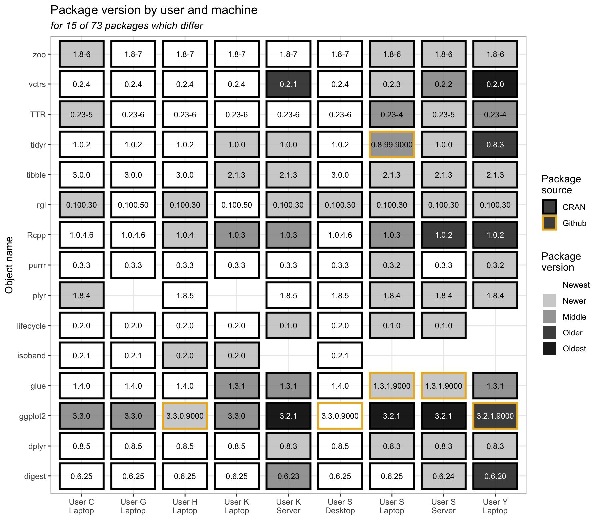

# Reproducibility in Research  

We are working on improving CSAFE's reproducibility in research.  

## Computational Reproducibility  

CSAFE's work is driven by a goal of providing open-source research, including open-source data and open-source algorithms. We believe in transparency and honesty in research, and allowing others to see ``under the hood" of algorithms that may be used to analyze evidence.   

In the process of furthering that goal, many of our researchers implement methods and data analysis in R, an open-source scripting language often used in data science and statistics. R and python are both languages which encourage (and rely on) user-developed packages to enhance the language's ability to perform specific data manipulation and modeling tasks.  

Many software packages are still under development; that is, functions and methods that exist in a package are subject to changes over time by the developers. This affects our work as statistics researchers in three major ways:  
- Code to run data analyses and obtain quantitative results may be affected by package updates. This can lead to differing quantitative results and lack of reproducibility of a method. 
- Researchers' own packages in development (e.g., bullet pipeline, shoe analysis pipeline) are vulnerable to changes in any package dependencies.  
- Group collaboration efforts on a developing package can lead to miscommunications, including changes in code that affect others' results (sorry again, Charlotte!)  

So, how does this practically affect CSAFE's research teams, and how can we manage it?  

For example, consider the bullet analysis ``pipeline" and some of the R packages that are involved at different steps of the process (this is not exhaustive):  

  

Just to go from a two raw x3p files to a quantitative result of a similarity score between the two bullet LEAs, we need a lot of R packages. When something in those packages change (e.g., default requirements for a `tidyverse` function), it can break our code! In addition, different people on the project may be running the same script to analyze bullets but be using different versions of packages.  

Because packages like `bulletxtrctr` and the methodology for different steps (e.g., groove ID, crosscut ID) are still changing and new approaches are being added, we need to be thoughtful and careful about reporting results and working to make sure our results are reproducible by other team members and outside users.  

This is not isolated to just the bullet project, either. Let's consider three major projects at CSAFE and their associated packages: `bulletxtrctr` and `x3ptools` for the bullet project, `handwriter` for the handwriting project, and `shoeprintr` for the shoe project.  

  

A total of 109 different packages are involved!!!!! This is a LOT of packages, and it leaves "open forensic science in R" very vulnerable to changes in other packages.  

To remedy this, we are developing a package to help manage dependencies and track when functions change. It is ongoing work, and by the next spotlight I should be able to share some use cases, examples, and functionality that will majorly assist our package development workflow.  

### Computational Reproducibility in Team-based Collaboration   

In order to investigate just how vulnerable our teams are to differences in code across machines, we can perform a small case study of the CSAFE bullet team and each team member's package inventories.  

I asked each member of the bullet project to use the `manager` tools we have developed to take an inventory of their package versions when they use the `bulletxtrctr` package (`take_inventory(packages = c("bulletxtrctr"))`), and send me their inventory.  

I received:  

- 9 total inventories   
- 6 unique users (one user on 3 machines, one user on 2 machines)  

We first want to look at all the CSAFE R packages that are used when data analysis is done. The four packages developed by the team at CSAFE interact with one another during the bullet data analysis process:  

  

Most of these packages are under active development, which means that one or more people on the team are adding or changing functionality. This means that across the bullet team we can have multiple versions of the packages in question. We can look at the versions of the bullet-related packages that the team has: 

  

This only accounts for the four bullet packages we are actively developing; however, there are a lot more packages implicitly involved when we call the `bulletxtrctr` package. We can take a look at a sampling of those package versions:  

  

We can already see a lot of differences in package versions, but we are most interested in where **functions** and **objects** actually differ between packages. Just because two users or machines have two different versions of a package doesn't mean there are any **functional** differences between the functions or objects employed in a script in question.  

  

There is some inconsistency! There are only two pairs of users who have the same exact sets of functions, which means any other two users who run an analysis may end up with different results.  

However, we have also quickly identified specific functions which differ across the team, and can now focus on identifying whether these functions are used in a script in question, or for a particular analysis.  

*Kiegan Summer 2020 Plans*:  

1. Work on CSAFE Statistics and Forensics Book  
  - Chapter 1, Intro: **outline and draft**  
  - Chapter 2, Analysis of Forensic Evidence: **written and edited**  
  - Chapter 3, The Path to the Witness Stand: **written, partially edited**   
  - Chapter 4, Communicating Evidence in the Courtroom: **draft and edit**  
  - Chapter 5, Conclusions: **outline and draft**  
2. Publication of Research Work  
  - Groove ID Methods paper with Nate Garton. Aiming for FSI. **editing and submission**  
  - Bullet scanning variability study   
    - Forensic community-facing paper, study design and key findings   
    - Statistics community-facing paper, statistical methodology and application    
  - Computational Reproducibility Package, manager  
    - Documentation and cleaning up, CRAN submission (?)   
    - Written paper about tools with case studies   
3. Presentation of Research Work   
  - Symposium on Data Science and Statistics (SDSS)  
4. Personal: Submit final dissertation, find a job  

  

