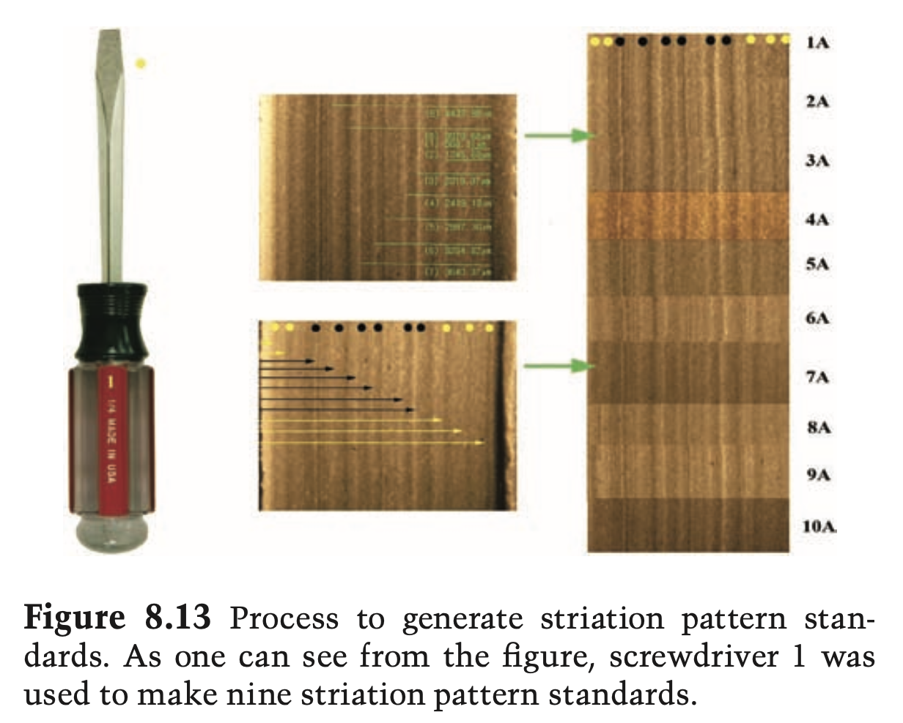

# Toolmarks {#toolmarks}


```{r setup-tm, echo=FALSE, warning = FALSE}
library(knitr)
opts_chunk$set(echo=FALSE, warning =FALSE)
```

```{r toolmarks, fig.cap="Tool and its corresponding marks from the Color Atlas of Forensic Toolmark Identification (Petraco, 2010).", , fig.show="hold", out.width="100%"}

```


```{r screwdriver, fig.cap="Screwdriver and its tip.", , fig.show="hold", out.width="50%"}
knitr::include_graphics(c("images/toolmarks/initial/screwdriver.png", "images/toolmarks/initial/tooltip.png"))
```

```{r tip-sensofar, fig.cap="Confocal light microscope scan of the top side of the tip. Horizontal grind marks are visible across the surface", , fig.show="hold", out.width="80%"}
knitr::include_graphics(c("images/toolmarks/initial/sensofar-tip.png"))
```

```{r tip-cadre, fig.cap="Top of the tip using GelSight capture", , fig.show="hold", out.width="100%"}
  knitr::include_graphics(c("images/toolmarks/initial/tool.png"))
  knitr::include_graphics(c("images/toolmarks/initial/tool-3.png"))
  knitr::include_graphics(c("images/toolmarks/initial/tool-2.png"))
```


```{r mark-cadre, fig.cap="GelSight capture of toolmark.", , fig.show="hold", out.width="50%"}
  knitr::include_graphics(c("images/toolmarks/initial/mark.png"))
  knitr::include_graphics(c("images/toolmarks/initial/mark-2.png"))
```


```{r tool-mark-profile, fig.cap="Profiles from tool (left) and mark (right).", , fig.show="hold", out.width="50%"}
  knitr::include_graphics(c("images/toolmarks/initial/tool-profile.png"))
  knitr::include_graphics(c("images/toolmarks/initial/mark-profile.png"))
```

```{r tool-mark-signature, fig.cap="Signatures from tool (left) and mark (right).", , fig.show="hold", out.width="50%"}
  knitr::include_graphics(c("images/toolmarks/initial/tool-signature.png"))
  knitr::include_graphics(c("images/toolmarks/initial/mark-signature.png"))
```

```{r aligned-signature, fig.cap="Aligned signatures from mark and (flipped and reversed) tool", , fig.show="hold", out.width="100%"}
  knitr::include_graphics(c("images/toolmarks/initial/aligned-signatures.png"))
```

## Next Steps: experimental setup

```{r toolmark-angle, fig.cap="Striation marks from the same tool under different angles.", , fig.show="hold", out.width="80%"}
  knitr::include_graphics(c("images/toolmarks/initial/bailker-identify-angle.png"))
```

```{r rig, fig.cap="Rig setup to control pressure and  angle.", , fig.show="hold", out.width="80%"}
  knitr::include_graphics(c("images/toolmarks/initial/rig.png"))
```
